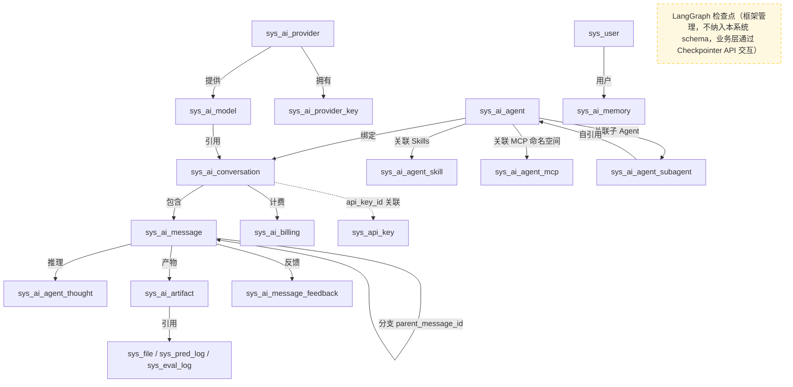
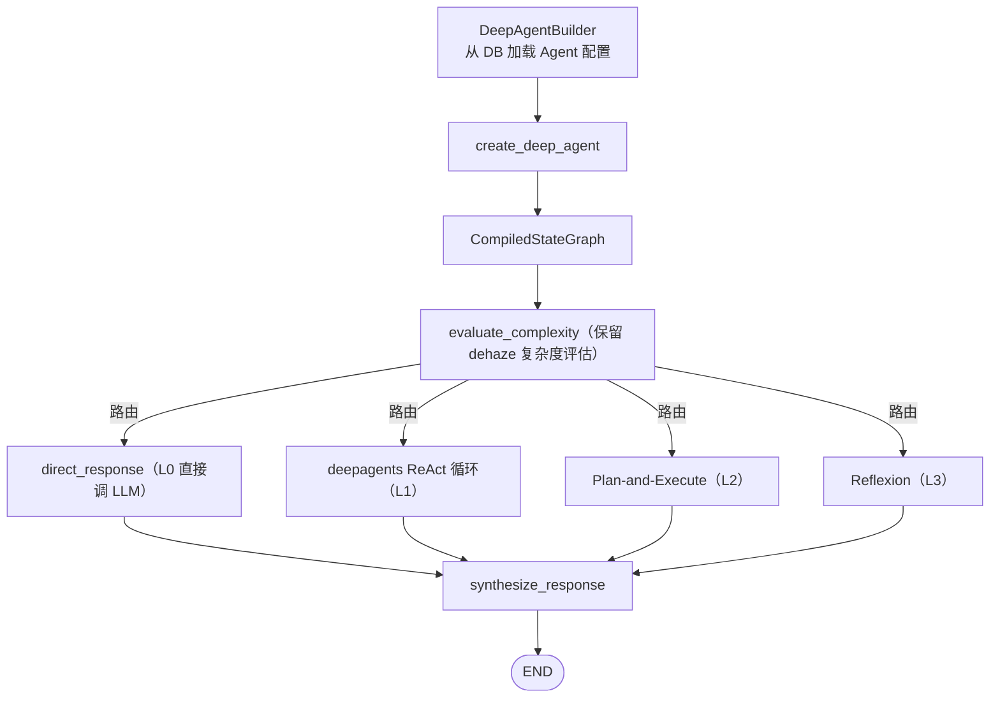

# AI 对话模块 - 后端实现设计（架构与公共）

## 1. 文档概述

### 1.1 文档目的

本文档描述 AI 对话模块的整体架构设计、数据模型总览、跨功能域公共组件、缓存策略与安全设计。各功能域的具体实现详见同目录下的分篇文档

### 1.2 设计思想

#### 设计动机

AI 对话是 AI 工作平台的交互中枢，本模块面临的根本矛盾是：**对话式入口的通用性**与**系统能力的多样性**之间的张力。平台存在图像处理、指标评估、算法推荐、知识库检索、任务管理等大量异构能力，若每种能力都为对话模块定制集成（写死工具、写死流程），对话模块将随能力增长而不可维护。

因此本模块的整体设计围绕一个核心命题展开：**如何让"一个对话入口"能自然调度"任意新增能力"，且不随能力演化而重写推理核心**。

#### 核心设计原则

| 原则 | 说明 |
|------|------|
| 能力与推理解耦 | 系统能力以"工具"形态接入，通过 MCP 网关动态发现。新增后端 API 后 MCP 自动同步，AI 对话模块零改动，这是模块可扩展性的根基 |
| 配置驱动 | 供应商、模型、API Key、Agent、Skills 全部由数据库配置管理，运行时可调整，不硬编码、不写死环境变量。配置即产品能力，而非代码变更 |
| 框架复用 | 推理引擎基于 LangGraph + deepagents（官方 Agent Harness），不重复造轮子。框架返回标准 `CompiledStateGraph`，保留对执行流程的完全控制（流式、中断、检查点） |
| 横切关注点钩子化 | 安全、计费、审计、记忆等横切逻辑通过 Hooks 挂载，不侵入推理核心代码。新增一条合规审计规则不需要改动推理循环 |

#### 关键架构取舍

| 取舍点 | 方案对比 | 选择与理由 |
|--------|---------|-----------|
| 推理引擎选型 | 自研 LangGraph 图 vs 基于 deepagents | 选后者。deepagents 白送 TodoWrite、虚拟文件系统、SubAgent 机制、上下文管理四类能力（自研约 40-50% 工作量），且返回标准 LangGraph 图，dehaze 通过适配器桥接自有 LLM 调用、计费、SSE 组件，未来可完全替换底层 |
| 工具接入方式 | 直接服务调用 vs MCP 网关调用 | 两者并存。高频路径（算法推荐、批量处理）绕开 MCP 网络开销直接调用业务服务；通用路径经内部 MCP 能力网关动态发现，换取"新增 API 零改动"的扩展性 |
| 工具注入策略 | 全量注入所有工具定义 vs 命名空间预筛选 | 选后者。全量注入数万个 token 的工具定义会挤占上下文预算；`before_model` 钩子按用户意图预筛选 1-2 个命名空间 |
| 检查点存储 | 仅 MySQL vs Redis + MySQL 双层 | 选双层。Redis 支撑每步推理的高速读写与中断恢复，MySQL 异步持久化兜底崩溃恢复，兼顾性能与可靠性 |

#### 总体规划

模块以"会话为容器、推理为引擎、能力为工具"三层结构组织：

```
会话层（容器）    → 会话/消息/分支/上下文/记忆/产物，见[会话与消息][上下文管理]
推理层（引擎）    → 复杂度感知的多范式推理 + 中断恢复 + 子Agent协作，见[多步推理][智能体管理]
能力层（工具）    → MCP/Skills/虚拟文件系统/业务工具，见[后端实现-能力扩展][后端实现-智能调度]
地基（模型与计费）→ 供应商/模型/Key/反馈 + 计费集成，见[AI模型管理模块][后端实现-消息反馈]
```

各功能域共享本公共层（SSE 管理器、LlmClient、检查点管理器、Hooks、缓存、安全），功能域之间通过数据表和 Service 接口协作，不互相依赖实现细节。

---

## 2. 架构设计

### 2.1 模块分层架构

AI 对话模块以 LangGraph 为推理框架，基于 [deepagents](https://github.com/langchain-ai/deepagents)（LangChain 官方 Agent Harness）构建推理引擎，通过能力扩展体系间接调用系统能力。模块本身不直接执行图像处理，而是通过工具调用委派给底层 API。能力扩展体系包括 MCP 工具（调用系统 API）、Skills（工作流指令包）、虚拟文件系统（Agent 内部临时文件）、子智能体等多种能力来源：

```
Controller 层
├── ConversationController       # 会话 CRUD、置顶、归档
├── MessageController            # 消息发送（SSE）、列表、重新生成、编辑、停止
├── ReasoningController          # 推理中断恢复、取消
├── ContextController            # 上下文查询、产物、记忆管理
├── AgentController              # 智能体管理（CRUD、Skills/MCP/Subagent 关联）
├── ModelController              # 模型配置管理
├── FeedbackController           # 消息反馈
├── ObservabilityController      # 可观测中心（过程链检索/汇总/导出，F-M08-013）
├── QuotaController              # 配额查询
├── CompatibleOpenAIController    # OpenAI 兼容 API（/api/v1/chat/completions、/api/v1/models）
└── CompatibleClaudeController    # Claude 兼容 API（/api/v1/messages、/api/v1/models）

Service 层
├── ConversationService          # 会话生命周期管理（CRUD、置顶、归档、标题自动提取、活跃度统计）
├── MessageService               # 消息发送与流式输出（SSE 推送、分支对话 parent_message_id、状态管理、重新生成）
├── ReasoningService             # 推理编排（复杂度感知与范式调度、deepagents stream → dehaze SSE 转换、中断恢复）
├── AgentService                 # 智能体配置管理（CRUD、缓存、Skills/MCP/Subagent 关联）
├── AgentConfigResolver          # Agent 配置三级合并（系统默认 ← Agent 配置 ← 会话覆盖）
├── ContextManager               # 上下文与记忆分层管理（短期记忆组装、长期记忆检索注入、产物引用化）
├── ArtifactService              # 中间产物引用化（摘要元数据不存 URL、多态引用 sys_pred_log/sys_eval_log/sys_file、失效标记）
├── MemoryService                # 长期记忆管理（情景/语义/程序三子类型、ES 向量检索同步、加权检索注入、整理巩固）
├── ModelService                 # 模型配置管理（CRUD、计费比例维护、能力校验）
├── FeedbackService              # 消息反馈管理（upsert、唯一性校验、质量统计）
├── SkillManageService            # Skills 管理（创建/启停/列表查询）
├── TraceService                  # 过程链记录与上下文快照采集（F-M08-013）
├── ScheduledTaskService          # 定时调度管理（Cron 任务 CRUD 与触发执行）
├── CompatibleApiService          # OpenAI/Claude 兼容协议适配（请求解析、会话映射、SSE 格式转换）
└── BillingIntegration           # 计费集成（Token 统计、积分换算、配额校验与扣减，委托 AI 计费模块）

deepagents Harness 层
├── DeepAgentBuilder             # 从 DB 加载 Agent 配置，组装 create_deep_agent 入参
├── DehazeChatModel              # dehaze LlmClient 适配为 LangChain BaseChatModel
├── DehazeHooksMiddleware        # dehaze AgentHooks 适配为 deepagents Middleware
├── DehazeToolsBuilder           # 按 Agent 配置装载 dehaze 业务工具
├── SseEventConverter            # deepagents 流式事件 → dehaze SSE 事件转换
├── TeamBuilder                  # Team 团队构建（langgraph-supervisor 编排）
└── CheckpointManager            # 检查点管理（LangGraph RedisSaver + MySQLCheckpointSaver，直接传入 deepagents）

依赖模块
├── McpGatewayClient（MCP 客户端）    # 连接内部 MCP 能力网关（系统能力出口），调用系统后端 API
├── McpToolFetcher（MCP 客户端）      # 连接外部 MCP Server（外部能力进口），拉取工具清单
├── SkillManager（Skills 管理）       # Skills 加载/渐进式披露/执行
├── SearchToolExecutor（搜索工具）    # 网络搜索/知识库检索/本地文件检索
├── CodeExecutor（代码执行）          # 沙箱执行代码和命令（Python/Shell）
├── BillingService（AI 计费管理）      # 积分计量与配额扣减
├── KnowledgeBaseService（AI 知识库）  # RAG 检索
├── VoiceService（语音交互）           # ASR/TTS
├── TaskService（任务管理）            # 异步任务回调
├── FileService（文件管理）            # 图片上传与获取
└── AuthService（认证管理）            # 用户身份解析
```

---

## 3. 数据模型总览

AI 对话模块业务表 + LangGraph 官方 Saver 管理的检查点表构成。其中 `sys_ai_provider`/`sys_ai_provider_key`/`sys_ai_model` 归 AI 模型管理模块，`sys_ai_billing`/`sys_ai_credit_log`/`sys_ai_refund` 归 AI 计费管理模块。下表仅列模块自身业务表，全量表清单与 DDL 见 [数据库设计 §4.7](../../../02-系统架构/03-数据库设计.md#47-ai-对话模块)。

### 3.1 表清单与职责

| 表 | 职责 | 所属功能域 | 逻辑删除 |
|----|------|-----------|---------|
| `sys_ai_agent` | 智能体配置（系统提示词、模型、推理范式、配置 JSON、类型标识、权限规则） | 智能体管理 | 是（类别②，agent_code 不可复用） |
| `sys_ai_agent_skill` | Agent-Skill 关联 | 智能体管理 | 否（关联表，覆盖式更新） |
| `sys_ai_agent_mcp` | Agent-MCP 命名空间关联 | 智能体管理 | 否（关联表，覆盖式更新） |
| `sys_ai_agent_subagent` | Agent-Subagent 关联（自引用，含优先级） | 智能体管理 | 否（关联表，覆盖式更新） |
| `sys_ai_conversation` | 对话会话（模型配置、Agent 绑定、摘要、API Key 绑定） | 会话与消息 | 是（标准） |
| `sys_ai_message` | 对话消息（多角色、分支、流式状态） | 会话与消息 | 是（标准） |
| `sys_ai_agent_thought` | 推理过程（thought/tool/observation/步骤序号、来源 Agent） | 多步推理 | 否（只追加） |
| `sys_ai_trace` | 对话过程链（上下文快照、状态、消耗汇总、首 Token、缓存命中；`trace_id` 复用日志链路唯一） | 可观测性 | 否（只追加，保留 180 天物理清理） |
| `sys_ai_llm_call` | 每次 LLM 调用明细（输入/输出摘要/缓存命中/耗时，`(trace_id, seq)` 串联链路） | 可观测性 | 否（只追加，保留 180 天物理清理） |
| `sys_ai_artifact` | 中间产物（引用化，摘要元数据不存 URL，is_invalid 失效标记） | 上下文管理 | 否（只追加） |
| `sys_ai_memory` | 长期记忆（用户偏好、处理模式） | 上下文管理 | 是（标准） |
| `sys_ai_message_feedback` | 消息反馈（点赞/点踩） | 消息反馈 | 是（类别①，upsert 复活） |
| `sys_ai_schedule` | 定时任务配置（Cron 触发规则、输入输出、用户启停、熔断状态） | 定时调度 | 是（标准） |
| `sys_ai_schedule_run` | 定时任务执行历史（幂等防重入：`uk_schedule_window` 唯一约束） | 定时调度 | 否（只追加，保留 30 天物理清理） |

> `sys_ai_billing`/`sys_ai_provider`/`sys_ai_model` 等外部模块表 DDL 与写入分别由 [AI 计费管理模块](../../基础模块/AI计费管理/需求规格.md)、AI 模型管理模块负责，AI 对话仅消费，不拥有写入权。
>
> LangGraph 的 checkpoint 持久化表（`langgraph_*`）由检查点 Saver 自动创建管理，不纳入本系统 schema，不在此列出（见 §4.3）。

### 3.2 核心关系



---

## 4. 跨功能域公共组件

### 4.1 SSE 流式输出管理器（SseEmitterManager）

**选型理论：为什么用 SSE 而非 WebSocket 或短轮询**。LLM 流式输出的技术特征是"服务端到客户端单向、高频、增量、长连接"，候选技术对比：

| 候选方案 | 匹配度 | 关键缺陷 |
|---------|--------|---------|
| 短轮询 | 低 | 高频轮询造成请求洪峰与延迟放大，无法做到 token 级低延迟；LLM 输出 1-2 分钟，轮询成本不可接受 |
| WebSocket | 中 | 双向通信对本场景多余；需要独立的连接协商/心跳/鉴权协议栈，断线续传需自研会话重放；与现有 HTTP 鉴权、网关（Nginx 缓冲）集成成本高 |
| SSE（选择） | 高 | 单向推送天然契合"服务端→客户端"；复用 HTTP 连接与现有鉴权中间件；**标准 `Last-Event-ID` 机制原生支持断线续传**（配 Redis token 缓存即可重放断点后事件，见下）；EventSource API 在前端零依赖 |

本系统的取舍：**SSE + Redis token 缓存 + Last-Event-ID** 组合，把"断线不丢 token"这一 WebSocket 方案需要自研的复杂度，用 SSE 标准机制 + 既有 Redis 低成本实现。

所有流式接口（消息发送、推理恢复）共用 SSE 管理器：

| 能力 | 说明 |
|------|------|
| 连接管理 | 维护会话与 SSE 连接的映射，同会话同一时间只允许一个活跃连接 |
| 事件推送 | 支持 message.start、content_block.start/delta/stop、thought、interrupt、ping、error、message.end 事件，每个事件携带递增 `id` |
| 心跳保活 | 每 15 秒推送心跳事件，防止代理超时断连 |
| token 缓存 | 每个事件同步写入 Redis token 缓存（`ai:stream:{streamSessionId}`，TTL 5 分钟），支撑断线重连 |
| 断线重连 | 客户端携带 `Last-Event-ID` 重连时，从 Redis 缓存重放断点之后的已发送事件，原流未完成则继续拉取新 token |
| 异常断连 | 客户端断连后保留 token 缓存 5 分钟等待重连；超时未重连则停止 LLM 推理，消息标记为"已取消" |
| 超时控制 | 120 秒无新 token 判定超时，主动关闭连接并标记失败 |

### 4.1.1 LLM 客户端（LlmClient）

所有 LLM 调用统一通过 `LlmClient`（`app/infrastructure/llm/call/llm_client.py`，单例 `llm_client`）发起，屏蔽不同提供商的协议差异，返回统一的流式数据结构 `LlmStreamChunk`（`text_delta` / `tool_call_start` / `tool_call_delta` / `tool_call_complete` / `done`）：

| 能力 | 说明 |
|------|------|
| 模型与认证 | 按 `model_id` 关联解析供应商配置与 API Key（AES 解密），选取与容错策略见 [AI模型管理/后端实现.md §2.3](../../基础模块/AI模型管理/后端实现.md#23-api-key-管理) |
| 提供商适配 | 按 `protocol_type` 选择 OpenAI 兼容 SSE 或 Anthropic 原生 SSE；内部消息列表转换（assistant 携带 `tool_calls`、tool 结果、anthropic system 顶层字段） |
| Token 统计 | `count_tokens(text)` 按字符数 / 4 估算；流式结束返回 usage（input/output/cached tokens） |
| Function Calling | `stream_chat()` 接受 `tools`/`tool_choice` 参数；流式解析 `delta.tool_calls` 按 index 聚合，发出 `tool_call_start` → 若干 `tool_call_delta` → `tool_call_complete`；不传 `tools` 时与普通对话完全等价（L0 直接回复路径） |

> **设计要点**：`tool_call_complete` 一次一个工具调用，便于推理节点直接按完整 tool_call 调度执行，无需自行累积解析参数。Anthropic 走 `input_json_delta` 事件流，同样聚合为 start → delta → complete 三段式。

### 4.2 推理引擎（基于 deepagents）

推理引擎基于 [deepagents](https://github.com/langchain-ai/deepagents)（LangChain 官方 Agent Harness）构建，底层仍为 LangGraph。`DeepAgentBuilder` 从数据库加载 Agent 配置（系统提示词、模型、推理参数、Skills、MCP 命名空间、子 Agent），组装 `create_deep_agent` 入参并返回编译后的 `CompiledStateGraph`。deepagents 内置虚拟文件系统、TodoWrite、SubAgent 机制、上下文管理等能力，dehaze 通过适配器桥接现有 LLM 调用、计费、SSE 推送等组件。详见 [后端实现-智能体管理](智能体管理/后端实现.md)。



- `evaluate_complexity`：两级复杂度评估（规则预判 + LLM 兜底），L0 直接调 LLM 不走 deepagents，L1/L2/L3 走 deepagents
- deepagents 内部 ReAct 循环替代手动构建的 `react_loop`/`execute_tools` 节点
- 三种循环共享检查点持久化、记忆系统、工具调度，差异在于规划策略和反思机制
- 子 Agent 通过 deepagents `task` 工具调用，独立上下文窗口，防递归
- 具体推理流程与规则见 [后端实现-多步推理](多步推理/后端实现.md) 和 [后端实现-智能体管理](智能体管理/后端实现.md)

### 4.3 检查点管理器（CheckpointManager）

**设计来源**：检查点机制来自 LangGraph 的 Checkpointer 设计——每次图节点执行后把 `state`（含 messages、工具调用中间结果、中断位置）序列化持久化。没有它，中断/恢复、断线续跑、时间旅行都无法实现（每次推理要么从零开始、要么把全部历史塞进内存）。本系统**不自建 checkpoint 业务表、直接复用 LangGraph 官方 Saver 协议**，理由：(1) checkpoint 的 schema 随 LangGraph 版本演化，自建表会与框架绑定且需跟随升级维护；(2) 业务层只需 Checkpointer API（get/put/ainvoke），不关心存储细节。

**双层存储**：checkpoint 是"高频写、低频恢复"的数据（每步推理都写、只在中断恢复时读），Redis 支撑运行时高速读写与中断恢复，MySQL 异步落盘兜底崩溃恢复：

| 层 | 存储 | Saver 实现 | 用途 | 读写频率 |
|----|------|-----------|------|---------|
| Redis | Redis | `RedisSaver`（自定义，继承 `BaseCheckpointSaver`） | 运行时高速读写、interrupt/resume | 每步推理自动读写 |
| MySQL | LangGraph 持久化表 | `MySQLCheckpointSaver`（自定义，继承 `BaseCheckpointSaver`） | 持久化、崩溃恢复 | 异步写入 |

- **运行时**：LangGraph 每步推理自动通过 `RedisSaver` 读写 checkpoint，Redis 开启 AOF 持久化保证数据安全。注：当前 langgraph 1.2.x 未内置官方 RedisSaver，`RedisSaver` 为自定义实现（继承 `BaseCheckpointSaver`，使用项目 `get_redis_client()`），按 LangGraph 标准 Checkpointer 协议实现，支撑中断/恢复即可
- **持久化**：`MySQLCheckpointSaver` 按 LangGraph 官方 `PostgresSaver` 的 4 表结构建表，适配 MySQL 语法（`JSONB`→`JSON`，`BYTEA`→`LONGBLOB`）。**持久化表由 `MySQLCheckpointSaver.setup()` 自动创建管理，不纳入本系统 `config/sql/schema/` 目录**，表结构以 LangGraph 官方为准
- **恢复策略**：会话重新进入时优先从 Redis 恢复，Redis 丢失时从 MySQL 恢复（`MySQLCheckpointSaver` 按 LangGraph 标准协议读取）
- **时间旅行**：通过 LangGraph Checkpointer API 可回溯历史检查点
- **业务层隔离**：业务代码不直接读写 LangGraph 持久化表，全部通过 LangGraph 的 Checkpointer API 交互

### 4.4 生命周期钩子（AgentHooks）

参考 LangGraph 1.0 Middleware 体系，提供 Agent 推理全生命周期的钩子机制，支持在关键节点注入横切逻辑（安全、审计、计费、记忆等），避免硬编码到流程中：

```
before_agent → before_model → (LLM 调用) → after_model → (工具调用) → after_tool → after_agent
```

| 钩子 | 触发时机 | 典型用途 | 可否中断 |
|------|---------|---------|---------|
| `before_agent` | Agent 推理开始前 | 配额预校验、敏感词输入过滤、prompt 注入防护 | 是（拒绝推理） |
| `before_model` | 每次 LLM 调用前 | 动态注入 system prompt（记忆/任务状态）、上下文 token 预算校验、**MCP 工具命名空间预筛选**（按用户意图仅展开匹配分组） | 是（跳过本次调用） |
| `after_model` | 每次 LLM 调用后 | 内容安全审核、输出敏感词过滤、token 统计、日志记录 | 是（标记为失败） |
| `before_tool` | 每次工具调用前 | 工具参数校验、权限校验、危险操作拦截（如删除文件确认） | 是（阻止调用） |
| `after_tool` | 每次工具调用后 | 工具结果过滤、产物自动注册、工具调用审计日志 | 否 |
| `after_agent` | Agent 推理结束后 | 计费扣减、记忆提取触发、会话标题更新、消息状态更新 | 否 |

**设计要点**：

- 钩子通过配置注册，非硬编码到推理流程中，新增横切逻辑不改推理代码
- 钩子按优先级顺序执行，前置钩子可中断后续链路（如 `before_model` 校验失败则跳过 LLM 调用）
- 钩子可访问当前 state（messages、task、artifacts）和会话上下文
- 内置钩子：配额校验（`before_agent`）、敏感词过滤（`before_model`/`after_model`）、计费扣减（`after_agent`）、记忆提取（`after_agent`）
- 可扩展钩子：管理员可注册自定义钩子（如企业内部合规审计）
- **MCP 工具命名空间预筛选**是 `before_model` 的核心内置钩子，按用户意图预筛选工具加载范围，机制与效果见 [后端实现-能力扩展 §3](能力扩展/后端实现.md#3-mcp-工具命名空间预筛选)

---

## 5. 缓存策略

### 5.1 会话列表缓存

| 缓存对象 | 缓存 Key | TTL | 更新策略 |
|---------|---------|------|---------|
| 用户会话列表 | `ai:conv:list:{userId}` | 5 分钟 | 发消息/置顶/归档/删除时失效 |
| 会话详情 | `ai:conv:detail:{convId}` | 10 分钟 | 会话更新时失效 |

### 5.2 模型配置缓存

| 缓存对象 | 缓存 Key | TTL | 更新策略 |
|---------|---------|------|---------|
| 模型列表 | `ai:model:list` | 1 小时 | 模型增删改时失效 |

### 5.3 推理检查点缓存

检查点存储由 LangGraph Saver 体系管理（见 §4.3），业务层仅维护中断点信息：

| 缓存对象 | 缓存 Key | TTL | 更新策略 |
|---------|---------|------|---------|
| 中断点信息 | `ai:interrupt:{threadId}` | 24 小时 | interrupt 时写入，resume 时清除 |

### 5.4 SSE token 缓存

| 缓存对象 | 缓存 Key | TTL | 更新策略 |
|---------|---------|------|---------|
| 流式 token 缓存 | `ai:stream:{streamSessionId}` | 5 分钟 | 每个事件同步写入；流式结束后标记 done=true；重连窗口过期自动清理 |
| 消息幂等键 | `ai:msg:idempotent:{userId}:{key}` | 60 秒（pending）/ 5 分钟（已完成） | 发送时 SET pending；完成后更新为最终结果；失败时 DEL 允许重试 |
| 流式并发锁 | `ai:streaming:{conversationId}` | 120 秒 | 发送时 SET；流式结束后 DEL |

### 5.5 配额缓存

| 缓存对象 | 缓存 Key | TTL | 更新策略 |
|---------|---------|------|---------|
| 日配额已用 | `ai:quota:daily:{userId}:{date}` | 至当日 0 点 | 每次扣减时更新 |
| 月配额已用 | `ai:quota:monthly:{userId}:{month}` | 至当月 1 日 | 每次扣减时更新 |

### 5.6 消息列表

消息列表不缓存，每次实时查询数据库。消息为高频写入的流式数据，缓存一致性维护成本高于直接查询收益。

### 5.7 长期记忆缓存

| 缓存对象 | 缓存 Key | TTL | 更新策略 |
|---------|---------|------|---------|
| 用户长期记忆 | `ai:memory:{userId}` | 1 小时 | 记忆新增/删除/整理巩固时失效 |

---

## 6. 安全设计

### 6.1 配额穿透防护

| 防护措施 | 说明 |
|---------|------|
| 预扣减 + 实扣减 | 推理前按预估消耗**原子预扣减**配额（占额度，防止并发请求同时通过预校验导致超扣），推理后按实际 Token 消耗回补差额或补扣；预扣减失败直接拒绝，推理失败不扣减 |
| 原子扣减 | 使用 Redis 原子操作（DECR + 阈值判断）保证预扣减的原子性，避免"预校验通过但实际扣减时超额"的竞态 |
| 配额缓存 | 用户配额缓存在 Redis，BillingService 维护一致性 |
| 降级策略 | 缓存不可用时降级为直接查询 MySQL，保证核心功能可用 |

### 6.2 数据隔离

- 会话和消息仅能查询/操作当前用户自己的数据
- 长期记忆仅能管理当前用户自己的记忆
- 模型配置查询对所有用户开放，管理操作需 `ai:model:manage` 权限
- 所有接口校验用户身份与资源归属

### 6.3 API Key 安全

- 会话绑定的 API Key 只存储引用 ID（`api_key_id`），不存储明文
- MCP 工具调用时从 `sys_api_key` 查询 Key 哈希，运行时解密使用
- API Key 明文绝不进入日志、不进入 LLM 上下文

### 6.4 输入校验

| 校验项 | 规则 | 错误码 |
|--------|------|--------|
| 单条消息长度 | 不超过 4000 字符 | A0500 |
| 会话并发 | 同一会话同一时间只允许一个流式输出 | A0500 |
| 模型可用性 | 选择的模型必须为启用状态且支持所需能力 | A0601 |
| 反馈对象 | 仅 assistant 消息可反馈 | A0502 |
| 反馈时效 | 消息发送后 30 天内可反馈 | A0502 |

### 6.5 认证授权

| 认证方式 | 适用场景 | 说明 |
|---------|---------|------|
| Session 认证 | Web 端用户对话交互 | 通过登录态 Cookie/Token 校验用户身份 |
| API Key 认证 | MCP 工具调用、第三方集成 | 会话可绑定 API Key（`dhak_` 前缀），工具调用时透传身份 |

- 会话隔离：每个会话绑定创建者用户 ID，所有消息和推理操作校验会话归属
- 双轨认证结果统一解析为 userId，后续业务逻辑无感知认证方式差异

### 6.6 内容安全

| 防护方向 | 实现方式 |
|---------|---------|
| 输入过滤 | `before_model` 钩子对用户输入进行敏感词检测，命中敏感词时拒绝推理或脱敏处理后继续 |
| 输出过滤 | `after_model` 钩子对 LLM 生成的回复进行敏感词过滤，违规内容标记并拦截 |
| 违规内容拦截 | 涉及政治、色情、暴力等违规内容的输入/输出均拦截，记录审计日志 |

### 6.7 Prompt 注入防护

| 防护措施 | 说明 |
|---------|------|
| 系统提示词隔离 | 系统提示词（System Prompt）以受控方式注入，与用户输入严格分层，用户输入不拼接到系统提示词区域 |
| 用户输入净化 | 对用户输入进行边界标记和特殊字符转义，防止注入指令覆盖系统提示词 |
| 工具描述保护 | MCP 工具的 inputSchema 描述不可被用户输入篡改，工具调用参数经 SDK 自动校验 |

### 6.8 流式安全

| 防护项 | 说明 |
|--------|------|
| SSE 连接鉴权 | 流式输出连接建立时校验用户身份与会话归属，未认证请求拒绝建立连接 |
| 超时控制 | 120 秒无新 token 判定超时，主动关闭连接并标记消息失败，防止连接资源泄漏 |
| 断线重连安全 | 重连时校验 Last-Event-ID 与用户身份匹配，仅允许会话创建者重连自己的流式连接 |
| 并发控制 | 同一会话同一时间只允许一个活跃 SSE 连接，通过 Redis 分布式锁保证 |

### 6.9 API Key 吊销与审计

| 安全措施 | 说明 |
|---------|------|
| 吊销机制 | API Key 支持吊销（`revoked_at` 置非空），吊销后立即失效，正在进行的流式连接在下次操作时拒绝 |
| 使用审计 | API Key 的创建、吊销、工具调用记录审计日志，含调用时间、工具名称、调用结果 |

---

## 7. 配置项

设计原则：仅保留"有明确修改者与修改场景"的配置——技术参数一律代码常量，随版本演进调整；个性化需求由实体级配置（Agent/会话）覆盖，不设第三层全局字典默认值。

| 配置项 | 说明 | 默认值 | 来源 |
|--------|------|--------|------|
| `AI_MESSAGE_MAX_LENGTH` | 单条消息最大字符数 | 4000 | 应用配置（环境变量可覆盖） |
| `AI_MEMORY_MAX_COUNT` | 单用户记忆条数上限 | 200 | 应用配置（环境变量可覆盖） |

其余参数为代码常量，不提供运行时配置：

| 常量 | 值 |
|------|-----|
| SSE 心跳间隔 / 流式输出超时 | 15 秒 / 120 秒 |
| 推理步数默认值（ReAct / Plan-and-Execute / Reflexion / Reflexion 最大迭代） | 20 / 30 / 15 / 3 |
| Reflexion 质量达标阈值 | 0.8 |
| 并行子任务上限 / 单工具调用超时 / 工具调用失败重试上限 | 5 / 60 秒 / 2 |
| 单会话 Token 预算上限 | 500000 |
| 会话归档 / 已删除可恢复 / 反馈时效天数 | 各 30 天 |
| 记忆遗忘曲线参数（归档阈值 / 半衰期 / 检索注入条数） | 10 / 30 天 / 5 |
| 反思、摘要巩固定时任务执行时间 | 每日 3 点 / 4 点 |

> 推理参数全局默认值为代码常量（`REASONING_DEFAULTS`）；Agent 级配置通过 `sys_ai_agent.config` JSON 覆盖，会话级配置通过 `sys_ai_conversation.config` 进一步覆盖。配置解析详见 [后端实现-智能体管理 §4.2 AgentConfigResolver](智能体管理/后端实现.md)。
