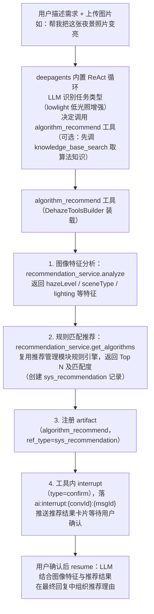

# AI 对话模块 - 后端实现设计（智能调度）

## 1. 文档概述

本文档描述 F-M08-004 智能算法推荐和 F-M08-005 批量处理摘要的后端实现，包括 LLM 结合图像特征和知识库推荐算法、批量任务调度与结果摘要生成。

### 1.1 设计思想

#### 设计动机

智能调度承载平台的核心业务价值：**让用户用自然语言驱动专业的图像处理能力**。本功能域的根本矛盾是：**LLM 的通用理解力**与**专业引擎的可靠性**之间的张力。

LLM 擅长理解"帮我把这张夜景照片变亮"这种模糊意图，但算法推荐本身（基于图像特征匹配算法）是确定性逻辑，批量去雾执行是重型计算任务——这两者都不适合让 LLM 自由发挥。若让 LLM 自行判断算法优劣，推荐质量将不可控；若让 LLM 直接操作图像数据，既慢又危险。

本功能域的设计目标：**LLM 负责"决策与编排"，专业引擎负责"执行"，各司其职**。

#### 核心设计原则

| 原则 | 说明 |
|------|------|
| 复用专业引擎 | 算法推荐复用推荐管理模块的规则匹配引擎，批量处理委托去雾处理模块执行。AI 对话只做"编排"，不重复实现专业逻辑（详见 §2.6/4.3） |
| 决策依赖数据 | LLM 的推荐决策不是凭空猜测，而是基于三个客观输入：图像特征分析（7 维向量）、AI 知识库检索（算法适用场景）、用户长期记忆（历史偏好）。数据充分，推荐才可信（详见 §2.2） |
| 推荐闭环 | 推荐 → 采纳 → 反馈回流，推荐管理模块统计采纳率，AI 对话把用户修改参数等反馈同步回去，形成数据闭环持续优化推荐质量（详见 §2.6） |
| 批量调度自适应 | 批量处理支持串行/并行/自动三种策略，默认按图片数量自动选择，避免资源竞争与过载（详见 §3.3） |
| 失败隔离 | 单张图片失败不中断整个批量任务，逐项记录失败原因，最后统一汇总（详见 §3.6） |

#### 关键架构取舍

| 取舍点 | 方案对比 | 选择与理由 |
|--------|---------|-----------|
| 推荐逻辑归属 | 在 AI 对话内实现算法匹配 vs 复用推荐管理模块 | 选后者。推荐管理模块已有规则匹配引擎与采纳率统计体系，AI 对话通过 MCP 工具调用复用，避免两套推荐逻辑漂移（详见 §2.6） |
| 批量调度方式 | 一次性全并行 vs 串行/并行/自动三策略 | 选三策略。全并行会触发资源竞争与过载；默认 auto 按图片数量在串行与并行间切换，兼顾吞吐与稳定，且不把调度决策交给不可控的 LLM 自由发挥 |
| 任务粒度 | LLM 直接发起一次大规模批量 vs 分解为逐张子任务 | 选逐张子任务。每张图片独立注册产物（image_result + metric_report）、独立记录推理步骤、独立失败处理，才能支撑"第 3/10 张完成"的细粒度进度反馈与部分失败汇总（详见 §3.2/3.5） |

#### 总体规划

智能调度是推理层之上的"业务场景层"，复用多步推理的完整基础设施：

```
自然语言需求
    ↓
多步推理（ReAct/Plan-and-Execute 循环）
    ↓ 工具调用
推荐/批量/评估（DehazeToolsBuilder 装载的工具，工具内部直调专业引擎）
    ↓ 结果回流
产物注册（artifact）→ 结果摘要生成 → 用户确认（interrupt/resume）
```

本功能域不新增推理能力，只定义"如何编排已有能力"——这正是工具化架构的收益：业务场景按需组合，推理核心零改动。

---

## 2. 智能算法推荐 (F-M08-004)

### 2.1 功能实现

用户用自然语言描述处理需求，LLM 结合图像特征分析和 AI 知识库的算法知识，智能推荐最匹配的算法。推荐过程作为多步推理的一个特殊场景，通过工具调用串联图像特征分析和知识库检索。

### 2.2 推荐流程



**实现说明**（`algorithm_recommend_service.recommend_algorithm` + `dehaze_tools_builder._algorithm_recommend`）：

- 无固定"意图理解/结果观察/继续判断"节点：调用哪些工具、是否先查知识库、如何组织回复，全部由 deepagents 内置 ReAct 循环中的 LLM 自行决定，本功能域只提供工具与中断协议
- 推荐理由（`reason` / `effectDescription`）由推荐引擎给出并随 artifact 摘要保存，不是 LLM 另起的解释
- 用户长期偏好经上下文记忆注入参与 LLM 决策（见 [上下文管理 §7.4](../上下文管理/后端实现.md)），不在推荐服务内检索
- 特征分析与规则匹配是 `algorithm_recommend` 工具内部的两次服务调用，对 LLM 是单次工具调用

### 2.3 推荐结果数据结构

LLM 生成的推荐结果通过 interrupt 事件推送给前端，interrupt 事件结构属于 API 契约，详见 [API接口.md](../API接口.md)。推荐结果核心字段：

| 字段 | 说明 |
|------|------|
| recommendation.algorithm | 推荐算法（ID、名称、描述） |
| recommendation.reason | 推荐理由（自然语言，融合图像特征与用户偏好） |
| recommendation.params | 建议处理参数（如强度、饱和度） |
| recommendation.match_score | 匹配度（0-1） |
| alternatives | 备选算法列表（算法、理由、匹配度） |

### 2.4 推荐结果注册为 artifact

推荐结果同时注册为中间产物，便于后续引用：

```
推荐结果生成后
    ↓
ArtifactService 注册产物：
  - type = algorithm_recommend
  - ref_type = sys_recommendation
  - ref_id = 推荐管理模块创建的推荐记录 ID
  - summary = {推荐算法, 推荐理由, 匹配度, 备选方案}
    ↓
后续对话可引用此 artifact
  - 如用户问"刚才推荐的算法是什么"，LLM 从 artifact 摘要读取
```

### 2.5 用户确认与处理发起

```
用户看到推荐结果卡片
    ↓
用户确认使用推荐 → resume 接口传 confirm 参数
    ↓
Agent 恢复推理：
  - 使用推荐的算法和参数
  - 调用图像处理工具（系统工具）
  - 进入 async_wait 中断等待处理完成
    ↓
或用户修改参数 → resume 接口传修改后的参数
    ↓
Agent 使用修改后的参数发起处理
```

### 2.6 与推荐管理模块的协作

| 集成点 | 说明 |
|--------|------|
| 推荐引擎复用 | `algorithm_recommend` 工具内部调推荐管理模块的规则匹配引擎，AI 对话不重复实现推荐逻辑 |
| 推荐记录创建 | 推荐管理模块创建 `sys_recommendation` 记录，AI 对话通过 artifact 引用 |
| 采纳率统计 | 用户确认推荐后，推荐管理模块更新 `adopted_algorithm_id`，统计采纳率 |
| 反馈回流 | 用户对推荐结果的反馈（采纳/拒绝/修改）同步到推荐管理模块 |

---

## 3. 批量处理摘要 (F-M08-005)

### 3.1 功能实现

用户上传多张图片后，通过自然语言描述统一处理需求，LLM 调度批量处理并生成结果摘要。批量处理作为多步推理的一个特殊场景，LLM 分解为多个子任务逐个或并行调度。

### 3.2 批量处理流程

```
用户上传多张图片 + 描述需求（如"把这 10 张雾图都去雾并评估效果"）
    ↓
deepagents 内置 ReAct 循环：LLM 识别批量任务并决定调用 batch_process 工具
（无独立的意图理解/结果观察/继续判断节点，分解与汇总由 LLM 在循环内完成）
    ↓
batch_process 工具（dehaze_tools_builder._batch_process）：
  1. 校验每张图片 URL 为本系统且归属当前用户（validate_owned_image_url）
  2. 按 BATCH_ASYNC_THRESHOLD（3）分流：
     - > 3 张：submit_batch_task 提交后台任务 → interrupt(async_wait)
               → 任务完成回调自动 resume，摘要回注 LLM
     - ≤ 3 张：process_batch 同步直返
    ↓
process_batch 逐张/并行调度（batch_process_service）：
  - 调用预测服务（异步任务模式，立即返回 logId）
  - 注册 artifact（image_result，ref_type=sys_pred_log）
  - 推送批量进度事件（SSE content_block，type=tool_use）：
    - {index, total, imageId, status, artifactId}
    - 前端实时展示"第 3/10 张完成"
    ↓
评估：metric_report 由 evaluation_service 在评估完成后注册（不在批处理内同步执行）
    ↓
LLM 汇总工具返回的结果摘要，生成最终批量结果摘要
```

> 每张图片独立注册产物、独立失败处理，是细粒度进度反馈与部分失败汇总的前提，故不合并为一次大规模批量调用。

### 3.3 批量调度策略

策略由 `batch_process_service._resolve_strategy` 解析，是确定性逻辑、不由 LLM 运行时决策：

| 策略 | 说明 | 适用场景 |
|------|------|---------|
| 串行（serial） | 逐张处理，前一张完成后再处理下一张 | 图片数量少，避免资源竞争 |
| 并行（parallel） | `asyncio.Semaphore` 限并发 + `gather` 收集结果 | 图片数量多时 |
| 自动（auto，默认） | 图片数 ≤ 3 串行，> 3 并行 | 默认策略 |

**并行度与规模**：纯技术参数，代码常量，不提供运行时配置（口径见 [后端实现-架构与公共 §7](../后端实现-架构与公共.md)）：

| 常量（`batch_process_service`） | 说明 | 值 |
|------|------|-----|
| `BATCH_MAX_PARALLEL` | 并行信号量上限 | 5 |
| `BATCH_STRATEGY` | 调度策略（serial/parallel/auto） | auto |
| `BATCH_MAX_IMAGES` | 单次批量最大图片数（超出部分截断） | 20 |
| `BATCH_ASYNC_THRESHOLD` | 异步阈值（超过走 `async_wait` 中断 + 回调恢复） | 3 |

### 3.4 批量结果摘要

所有子任务完成后，LLM 生成批量结果摘要，核心字段：

| 字段 | 说明 |
|------|------|
| summary.total / success / failed | 处理总数 / 成功数 / 失败数 |
| summary.avg_metrics | 平均指标（PSNR、SSIM 等） |
| summary.best | 效果最佳图片（ID + 指标） |
| summary.worst | 效果最差图片（ID + 指标） |
| summary.failures | 失败图片列表（ID + 原因） |
| results[] | 每张图片结果（artifact 引用 + 指标 + 算法 + 参数） |

### 3.5 批量产物管理

每个子任务的处理结果和评估结果都注册为独立的 artifact：

```
每张图片处理完成
    ↓
注册两个 artifact：
  1. type = image_result, ref_type = sys_pred_log, ref_id = 预测日志 ID
  2. type = metric_report, ref_type = sys_eval_log, ref_id = 评估日志 ID
    ↓
所有 artifact 关联到同一条 assistant 消息
    ↓
前端展示批量结果时：
  - 摘要卡片（成功率、平均指标、最佳/最差）
  - 结果列表（每张图片的 artifact 引用 + 指标 + 参数，缩略图 URL 运行时通过 FileService.getUrl() 拼接）
  - 点击单张可查看 artifact 详情
```

### 3.6 失败处理

| 失败场景 | 处理方式 |
|---------|---------|
| 单张处理失败 | 记录失败原因，继续处理其他图片，不中断整个批量任务 |
| 部分评估失败 | 处理成功的图片正常评估，失败的在摘要中标注 |
| 全部失败 | LLM 分析失败原因，建议用户检查图片格式或更换算法 |
| 系统过载 | 并行度受 `BATCH_MAX_PARALLEL` 信号量硬限，调度策略按图片数量确定性选择，不依赖 LLM 对过载信号的判断 |

---

## 4. 模块间协作

### 4.1 与推荐管理模块

| 集成点 | 说明 |
|--------|------|
| 推荐引擎调用 | `algorithm_recommend` 工具内部直调 `recommendation_service`（不经 MCP 网关） |
| 推荐记录创建 | 推荐管理模块创建 `sys_recommendation` 记录 |
| 采纳率统计 | 用户确认推荐后更新 `adopted_algorithm_id` |
| 推荐反馈回流 | 用户对推荐结果的反馈同步到推荐管理模块 |

### 4.2 与 AI 知识库

| 集成点 | 说明 |
|--------|------|
| 算法知识检索 | LLM 通过搜索工具调用知识库检索，获取各算法适用场景、效果特点 |
| RAG 注入 | 检索结果作为工具返回注入 LLM 上下文，辅助推荐决策 |

### 4.3 与去雾处理模块

| 集成点 | 说明 |
|--------|------|
| 图像处理调度 | `batch_process` 工具内部调 `prediction_service` 提交异步预测（不经 MCP 网关） |
| 评估调度 | 评估由 `evaluation_service` 在预测完成后注册 `metric_report` 产物 |
| 异步任务回调 | 去雾处理完成后回调 ReasoningService 恢复推理 |
| 配额扣减 | 图像处理和评估的配额由底层 API 扣减，不在 AI 计费中重复记录 |

### 4.4 与文件管理模块

| 集成点 | 说明 |
|--------|------|
| 图片上传 | 用户上传图片通过文件管理模块，获取 fileId 后在消息中引用 |
| 结果获取 | 处理结果图片通过文件管理模块获取 URL |
| 批量上传 | 批量处理时多张图片通过文件管理模块批量上传 |
