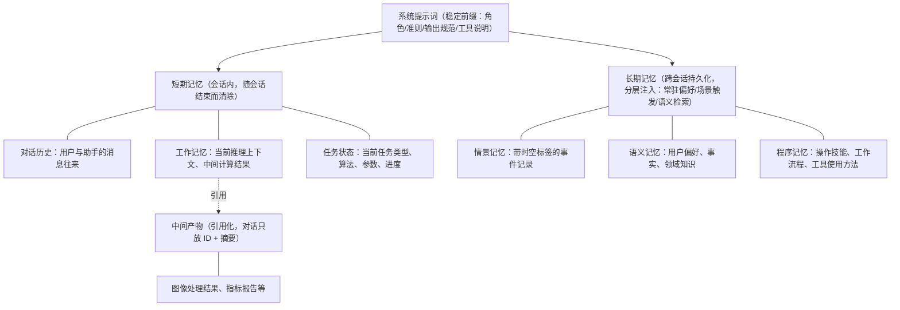

# AI 对话模块需求规格（上下文管理）

## 功能域概述

上下文、记忆与提示词管理是 AI 对话模块的"长期大脑"，通过提示词工程、短期记忆、长期记忆、中间产物引用化四个层次的协同，以最小上下文开销让 Agent 稳定理解用户、复用历史经验、可靠完成长对话与复杂任务。

### 2.3 上下文、记忆与提示词管理 (F-M08-003)

#### 2.3.1 功能描述

围绕"如何组织发送给 LLM 的上下文"这一核心命题，覆盖三大能力：

| 能力 | 核心内容 |
|------|---------|
| **提示词工程** | 系统提示词分层设计与场景化组装，保证 Agent 行为稳定可控 |
| **长短期记忆** | 短期记忆压缩、长期记忆的注入与巩固，让 Agent 认识用户、跨会话复用经验 |
| **中间产物引用化** | 大体积处理结果不进入上下文，仅以引用 + 摘要形式参与推理 |

设计依据：参考认知心理学记忆模型（短期记忆 + 长期记忆）、Anthropic 上下文工程（Context Engineering）的"注意力预算"理念，以及 ChatGPT 记忆、Claude Memory、Gemini 记忆等主流产品的记忆能力，做产品化的工程取舍。

#### 2.3.2 上下文分层结构

发送给 LLM 的完整上下文按"稳定程度"自顶向下分层组装，越靠上越稳定、越靠下越随对话变化：

| 层次 | 稳定程度 | 变化频率 |
|------|---------|---------|
| 系统提示词 | 稳定前缀 | 平台/智能体配置变更时更新 |
| 长期记忆 | 跨会话持久 | 随对话、反思持续积累 |
| 短期记忆 | 会话内有效 | 每轮对话都在变化 |
| 中间产物 | 外部引用 | 随任务执行产生 |

#### 2.3.3 提示词工程

提示词工程解决"系统如何稳定、高效地组织发送给 LLM 的指令"，是上下文的稳定前缀（第一层）。核心目标：以最小上下文开销换取最稳定的 Agent 行为，参考 Anthropic 上下文工程的"注意力预算"理念——上下文是有限资源，每一层注入都应有明确价值。

**系统提示词分层设计**：系统提示词内部再分为"稳定层"与"变量层"，稳定内容长期复用、动态内容随场景注入。

| 层 | 内容 | 维护方 | 变更频率 |
|----|------|-------|---------|
| 稳定层 | 平台级角色定位、通用行为准则、安全合规约束、输出格式规范 | 平台统一维护 | 极低 |
| 变量层 | 智能体人设与专属指令、当前会话/用户/模型相关上下文 | 随智能体配置（F-M08-011）、会话、模型变化 | 随配置/会话 |

**上下文组装顺序**（自顶向下，稳定 → 动态）：

| 顺序 | 组装内容 | 说明 |
|------|---------|------|
| 1 | 系统提示词 | 稳定前缀，先确立角色与行为准则 |
| 2 | 长期记忆注入 | 按 §2.3.5 注入策略组装 |
| 3 | 检索增强（RAG） | 知识库检索结果按需注入 |
| 4 | 工具/能力说明 | 仅注入当前任务相关的最小工具集（预筛选见 F-M08-006） |
| 5 | 对话历史 | 摘要 + 最近 N 轮原文（见 §2.3.4） |
| 6 | 用户当前输入 | 本轮消息 |

**场景化提示词模板**：针对通用对话、图像处理调度、多步推理、算法推荐、定时任务等场景预设提示词模板，通过变量注入动态内容，保证同类任务行为一致、可预期。

**结构化提示规范**：

| 规范 | 说明 |
|------|------|
| 角色-任务-格式三要素 | 每个提示词明确"扮演什么角色、完成什么任务、以什么格式输出" |
| 分节组织 | 指令、约束、示例、输入分区清晰，降低 LLM 理解歧义 |

**提示词优化闭环**：结合消息反馈（F-M08-008）的点赞/点踩数据与 A/B 评估，持续迭代提示词模板，用真实用户反馈驱动提示词质量提升。

#### 2.3.4 短期记忆管理

短期记忆存活于单次会话内，生命周期短，需要压缩策略避免上下文膨胀。

| 层 | 内容 | 管理策略 |
|----|------|---------|
| 对话历史 | 用户与助手的消息往来 | 超上下文容量阈值自动摘要老消息，保留最近 N 轮原文 |
| 工作记忆 | 当前推理上下文、中间计算结果、正在分析的变量 | 随推理过程更新，不持久化；推理中断后可从保存的执行状态恢复 |
| 任务状态 | 当前任务类型、算法、参数、执行进度 | 结构化保存，不进入对话流，LLM 可按需查询 |

- 增量指令（如"再亮一点"）不被摘要压掉：最近 N 轮原文始终保留，任务状态独立维护记录上一次处理的算法和参数

#### 2.3.5 长期记忆管理

长期记忆跨会话持久化，参考认知心理学三类记忆模型：

| 记忆类型 | 定位 | 内容 | 示例 |
|---------|------|------|------|
| **情景记忆** (episodic) | 带时空标签的事件记录 | "某时某地发生了什么" | "用户上周二要求用 RIDCP 处理一张雾图，结果满意" |
| **语义记忆** (semantic) | 抽象知识、事实、用户偏好 | "知道什么" | "用户偏好简洁回复"、"用户是图像处理研究者" |
| **程序记忆** (procedural) | 操作技能、工作流程、工具使用方法 | "会做什么" | "用户习惯先去雾再评估，强度通常设 60-80" |

**记忆来源**：

| 来源 | 提取方式 | 示例 |
|------|---------|------|
| 对话提取 | LLM 在对话中识别值得记住的信息 | "我喜欢简洁的回复" → 语义记忆 |
| 反馈提取 | 用户点踩时附带的改进建议 | "太冗长" → 语义记忆（偏好简洁） |
| 反思整合 | 定期回顾近期记忆，生成更高层次的抽象洞察 | "连续三周周一要报告" → 程序记忆（每周一需周报） |
| 手动录入 | 用户在设置中手动添加 | "我是图像处理研究者" → 语义记忆 |

**记忆注入策略**：长期记忆并非"统一检索后注入"，而是**按记忆类型分三种注入方式**，对齐业界最佳实践（常驻偏好 + 按需检索）后的核心设计：

| 注入方式 | 适用记忆 | 注入时机 | 为什么这样设计 |
|---------|---------|---------|---------------|
| **常驻注入**（Always-on） | **语义记忆**中的用户偏好、身份、固定习惯（如"用户偏好简洁"、"用户是图像处理研究者"） | **每轮对话都注入**，不检索、不省略 | 这类记忆数量少、与任何对话都相关、是用户明确告知或系统高置信提炼的信息。检索可能因当前对话语义不相关而漏掉它们，导致偏好失效 |
| **检索注入**（Retrieval-based） | **情景记忆**（具体事件）、**语义记忆**中的事实、领域知识 | **按当前对话语义检索** Top N（默认 5-20 条）注入 | 这类记忆数量大、只在语义相关时才需要。按相关性 + 近因性 + 重要性三维度加权检索；被检索命中的记忆"重激活"（重置衰减），类似人类"复习巩固" |
| **场景触发注入**（Trigger-based） | **程序记忆**（工作流程、操作习惯、工具用法） | **检测到特定场景时**注入对应工作流（如用户发起去雾任务时注入其历史处理习惯） | 程序记忆是"某类任务怎么做"的操作知识，只在对应任务出现时才有用。全量常驻浪费上下文、检索又可能因任务类型未在对话中明说而漏掉；由系统在任务类型识别后主动注入最准确 |

**三类注入的分工边界**：

| 判断问题 | 答案 |
|---------|------|
| 用户偏好/身份什么时候生效？ | **永远生效**（常驻注入），不依赖当前对话是否提及 |
| 历史事件什么时候被想起？ | **只在与当前对话语义相关时**被检索出来（如用户提到"上次""之前"时） |
| 处理习惯什么时候被用上？ | **只在对应任务出现时**被触发（如用户要处理图片时） |

**记忆使用时机与场景**：

长期记忆的核心价值是让 Agent"认识用户"——它决定了同样一句话，Agent 是像对待陌生人一样回答，还是像熟悉的老用户一样回答。

| 使用时机 | 注入方式 | 触发场景 | 记忆类型 | 起到的作用 | 示例 |
|---------|---------|---------|---------|-----------|------|
| **每轮对话前** | 常驻 + 检索 | 用户发送任何新消息，Agent 组装回复上下文时 | 常驻注入语义偏好；检索注入相关情景记忆 | 让 Agent 带着对用户的了解开始思考，而非每次从零认识用户 | 用户问"继续处理吧"，Agent 依据情景记忆知道"继续"指上一轮的那批雾图 |
| **回复风格与内容个性化** | 常驻 | 用户提出开放性问题、表达诉求时 | 语义记忆 | 按用户偏好调整回复长度、详细程度、专业深度 | "太冗长"点踩后，后续回复自动更简洁 |
| **算法推荐与参数设定** | 场景触发 | 智能算法推荐流程（F-M08-004）中生成推荐参数、备选方案时 | 程序记忆 + 语义记忆 | 参考用户历史处理习惯设置推荐参数默认值，减少用户重复调整 | 用户习惯"强度 60-80"，新推荐默认按此区间取值 |
| **模糊/指代需求理解** | 检索 | 用户使用"上次""之前""和上次一样"等指代表达时 | 情景记忆 | 解析指代对象，恢复历史事件上下文，避免 Agent 反问或误读 | "就用上次那个效果好的算法"→ 命中上次成功处理的事件 |
| **处理流程建议** | 场景触发 | 用户描述目标但未指定步骤时 | 程序记忆 | 按用户习惯的工作流程提供步骤建议，贴合其操作模式 | 用户习惯"先去雾再评估"，Agent 建议流程时按此顺序 |
| **专业问题回答** | 检索 | 用户询问领域知识时 | 语义记忆 | 结合用户已知的专业背景调整回答深度，避免过度解释基础概念 | 用户是图像处理研究者，回答直接使用专业术语 |
| **多轮任务衔接** | 检索 | 复杂任务跨多轮进行、中间中断后恢复时 | 情景记忆 | 让 Agent 在长时间隔后仍记得任务的来龙去脉 | 几天后用户问"上次的任务怎么样了"，Agent 能接续 |

**注入边界**（何时**不**使用记忆）：

| 边界 | 说明 |
|------|------|
| 相关性过滤 | 检索仅命中与当前对话语义相关的记忆；无关记忆不注入，不污染当前上下文 |
| 时效与重要性过滤 | 重要性低且长期未访问的记忆随时间衰减并归档，归档后不再注入（见 §2.3.6 遗忘曲线） |
| 用户主动控制 | 用户删除的记忆不注入；用户可在设置中批量清空或按类型/时间范围清空（见 §2.3.6 记忆管理操作） |
| 敏感信息 | 敏感信息写入前已过滤，不会进入记忆，更不会注入到回复（见 §2.3.6 隐私合规） |
| 注入可见性 | 每条回复可展开查看"本次引用的记忆"清单，用户可确认记忆是否被正确使用（见 §2.3.6 隐私合规-注入可见性） |

> 记忆是"辅助"而非"主控"：记忆注入只影响 Agent 的回复质量与个性化程度，不改变功能流程本身；当记忆与当前明确指令冲突时，以当前指令为准。

#### 2.3.6 记忆整理与巩固

记忆整理是将短期记忆转化为长期记忆、并对长期记忆进行维护管理的核心过程：

| 机制 | 说明 | 触发条件 |
|------|------|---------|
| **定期摘要巩固** | 对话历史超阈值时摘要压缩，提取关键信息存入长期记忆 | 上下文占用达模型容量的 70% |
| **遗忘曲线** | 记忆检索优先级随时间衰减，未被访问的记忆逐渐淡化，低于阈值时归档 | 每日定时计算衰减 |
| **重要性评分** | 综合情感/频率/时效/信息增益/显式标记计算记忆重要性（0-100 分） | 记忆写入和访问时更新 |
| **反思整合** | 周期性回顾近期记忆，生成更高层次的抽象洞察（情景记忆 → 语义/程序记忆） | 每日定时 / 会话结束时 |
| **合并去重** | 检测语义重复的记忆条目，合并为更完整的单一条目 | 每日定时 |

> 设计依据：三类记忆模型、三维加权检索、遗忘曲线、反思整合均来自认知心理学与业界 Agent 记忆系统（MemGPT、Generative Agents 等）的成熟实践。本系统做工程化取舍——只保留对产品价值有直接贡献的机制（分类存储、加权检索、衰减归档、反思整合），不引入复杂的认知模拟。

**记忆管理操作**：
- 用户可在设置中查看所有记忆条目（按类型/来源/重要性筛选），区分"对话自动提取"与"用户手动录入"两类来源
- 用户可删除单条记忆（软删除，不再注入后续对话）
- 归档的记忆不注入但保留记录，用户可查看历史归档

**长期记忆隐私合规**：

| 维度 | 规则 |
|------|------|
| 记忆可见性 | 用户对自身所有记忆条目（含活跃、归档）享有完整可见权；系统/管理员仅在用户授权或合规审计场景下可访问 |
| 敏感信息过滤 | 记忆写入前由 LLM + 规则双重过滤：身份证、手机号、银行卡、密码、密钥等敏感字段不写入长期记忆，命中过滤时仅保留脱敏后的非敏感上下文 |
| 批量清空 | 支持"清空全部记忆""清空指定类型记忆""清空指定时间范围记忆"三种粒度，需二次确认，30 天内可恢复 |
| 记忆导出 | 用户可在设置中一键导出全部记忆为 JSON/Markdown，含类型、来源、重要性、创建时间，便于个人数据携带与合规审计 |
| 注入可见性 | 每条助手回复可附"本次引用的记忆"清单（默认折叠），用户可知晓哪些记忆被用于本次响应 |
| 合规留存 | 记忆删除遵循平台数据留存策略，软删除 30 天后物理清理；涉及合规审计的记录按法规要求单独留存 |

#### 2.3.7 中间产物引用化

图像处理结果体量大，绝不塞入对话上下文：

1. 处理完成后，在对话中展示结果卡片（缩略图 + 指标数值 + 算法信息）
2. LLM 需要理解结果时，通过工具获取结构化摘要（指标数值 + 算法信息 + 处理参数）
3. 若需视觉理解（如"看看去雾效果好不好"），利用多模态模型读取图片，控制成本

**多模态视觉读取限额与计费边界**：

| 维度 | 规则 |
|------|------|
| 限额范围 | "多模态视觉读取（次/日）"专指 LLM 在推理过程中主动读取图片（含中间产物引用化场景）的次数，与用户主动附图输入分开计量 |
| 用户附图输入 | 用户在消息中附带的图片按多模态输入计费（按模型 Token 比例扣减积分），不占用视觉读取日限额 |
| 计量方式 | 按用户维度全局日计数，跨会话共用同一额度，每日 0 点重置，避免"开新会话绕过限额" |
| 用尽降级路径 | 视觉读取次数用尽后，LLM 不再读取图片，改为基于结构化摘要（指标数值 + 算法信息 + 处理参数）生成文本描述；前端提示"今日视觉读取已用尽，已切换为文本描述模式，升级 VIP 可获更多次数" |
