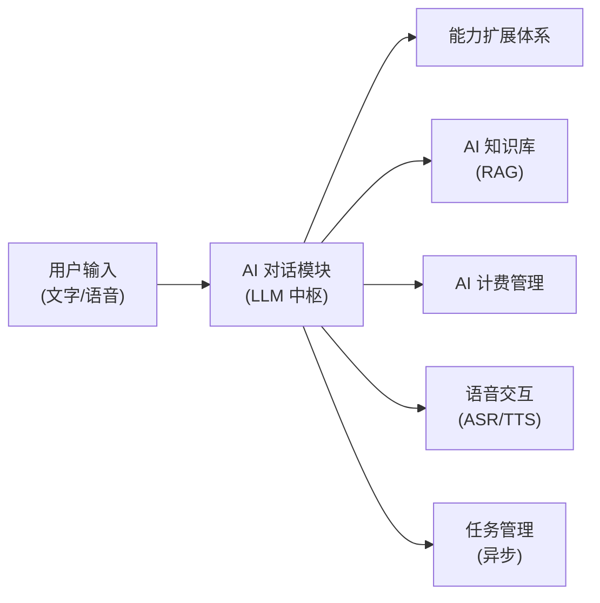
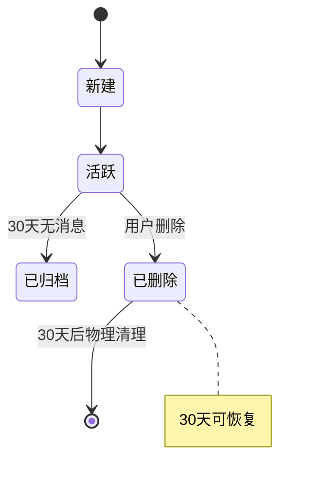
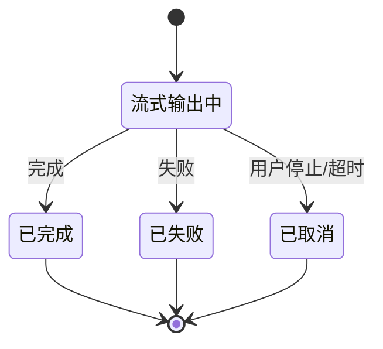
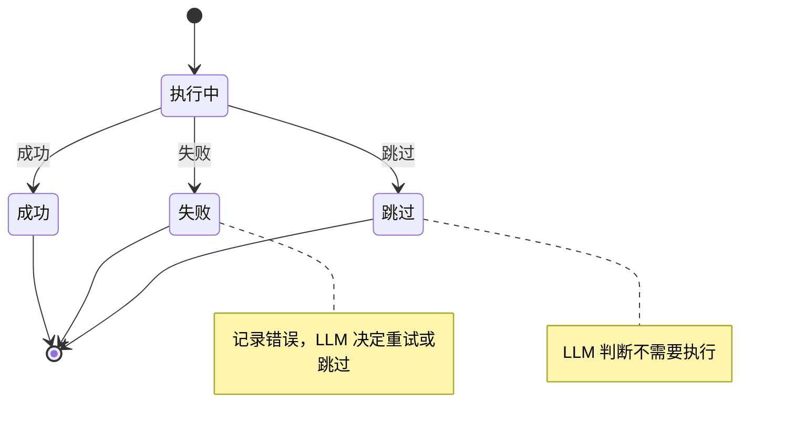

# AI 对话模块需求规格

## 1. 模块概述

### 1.1 模块定位

AI 对话模块是 AI 工作平台的交互中枢，以通用大语言模型（LLM）为底座，通过对话式统一入口调度图像处理、指标评估、算法选择等系统已有能力。模块将平台从"工具集合"升级为"具备通用 AI 助手潜力的智能工作平台"，实现"专业长板 + 通用底座"的融合定位。

### 1.2 核心价值

| 价值维度 | 具体内容 |
|---------|---------|
| **统一入口** | 用户通过对话完成问答、写作、翻译等通用任务，同时可一句话调度图像处理能力 |
| **智能调度** | LLM 理解用户意图，通过能力扩展体系自动调用系统能力（MCP 工具、Skills、内置工具等） |
| **多步推理** | 支持子任务分解、反思重试、人工中断 |
| **上下文记忆** | 提示词工程 + 分层管理对话历史、任务状态、长期记忆、中间产物引用化 |
| **知识增强** | 结合 AI 知识库的 RAG 检索，提升响应准确性和专业性 |
| **语音交互** | 结合语音交互模块，支持语音输入和语音指令控制 |

### 1.3 用户角色分析

| 用户类型 | 特征 | 使用偏好 | 功能需求 |
|---------|------|---------|---------|
| **普通用户** | 不熟悉图像处理参数 | 自然语言描述需求，如"帮我把这张照片变亮" | 语音输入、智能推荐、自动处理 |
| **专业用户** | 了解算法特点 | 对话式调参，如"用 RIDCP 重新处理，强度调到 80" | 多步推理、参数优化 |
| **批量用户** | 需要处理大量图片 | 自然语言描述批量需求，如"把这 10 张雾图都去雾并评估效果" | 批量处理调度、结果摘要 |
| **企业用户** | 需要自动化流程 | 对话调度 + 定时执行，如"每天定时拉取监控截图去雾后分发" | 定时调度（AI 对话子功能） |

### 1.4 依赖关系

> AI 对话通过能力扩展体系间接调用图像处理、指标评估、算法选择等系统能力，不直接依赖这些业务模块。能力扩展体系包括 MCP 工具（调用系统 API）、Skills（工作流指令包）、内置工具（代码执行/文件检索等）等多种能力来源。

### 1.5 依赖模块

| 模块 | 依赖说明 |
|------|---------|
| **能力扩展体系** | AI 对话通过能力扩展体系调用系统能力（MCP 工具调用系统 API、Skills 提供工作流指令、内置工具提供代码执行/文件检索等） |
| **AI 知识库** | 对话时检索知识注入 LLM prompt |
| **AI 计费管理** | 对话消耗 Token 的积分计量与配额扣减 |
| **语音交互** | 语音输入转文本、回复语音播报 |
| **任务管理** | 异步任务调度与回调 |
| **文件管理** | 图片上传与结果获取 |
| **认证管理** | 用户身份解析 |

### 1.6 模块边界

AI 对话模块聚焦"对话理解与调度"，以下能力由其他模块承载，AI 对话不重复实现：

| 能力 | 归属 | 边界说明 |
|------|------|---------|
| 图像处理、指标评估 | 图像处理、指标评估等业务模块 | 通过能力扩展体系调用，不直接实现算法 |
| 算法推荐核心逻辑 | 算法选择模块 | AI 对话只做意图理解、参数生成与推荐理由解释 |
| 积分计量与配额管理 | AI 计费管理 | AI 对话只做执行前校验、执行中预扣、消费结果呈现 |
| 知识库存储与检索 | AI 知识库 | 对话时以检索结果作为增强上下文，不管理知识内容 |
| 语音识别与合成 | 语音交互模块 | 对话侧仅接收转写文本与输出播报文本 |
| 模型与供应商管理 | AI 模型管理模块 | AI 对话消费模型注册表（会话内选择/切换），不管理供应商与模型生命周期 |

---

## 2. 功能需求索引

AI 对话模块的功能需求按业务域拆分至以下分篇文档，每篇为独立模块，覆盖完整的功能点（编号 F-M08-xxx 为功能追溯标识）：

| 功能域分篇 | 功能点 | 核心内容 |
|-----------|--------|---------|
| [需求规格-会话与消息](./需求规格-会话与消息.md) | F-M08-001 | 通用对话能力、会话生命周期管理、消息交互与流式输出 |
| [需求规格-多步推理](./需求规格-多步推理.md) | F-M08-002 | 多步推理范式（ReAct/Plan-and-Execute/Reflexion）、复杂度感知、中断恢复 |
| [需求规格-上下文管理](./需求规格-上下文管理.md) | F-M08-003 | 提示词工程、短期/长期记忆分层管理、中间产物引用化、记忆注入与巩固 |
| [需求规格-智能调度](./需求规格-智能调度.md) | F-M08-004/005 | 智能算法推荐、批量处理与结果摘要 |
| [需求规格-能力扩展](./需求规格-能力扩展.md) | F-M08-006 | 工具执行体系、Skills 管理、MCP 命名空间预筛选 |
| [AI模型管理模块](../../基础模块/AI模型管理/需求规格.md) | F-M08-007 | 模型供应商管理与模型注册表（chat/embedding/rerank）、生命周期与计费——原模型管理功能域，因被多模块消费抽离为基础模块；会话内模型选择交互保留在本模块 |
| [需求规格-消息反馈](./需求规格-消息反馈.md) | F-M08-008 | 消息点赞/点踩、反馈驱动优化闭环 |
| [需求规格-定时与兼容](./需求规格-定时与兼容.md) | F-M08-009/010 | 定时调度（防重入/并发/失败熔断/执行观测）、OpenAI/Claude 第三方兼容 API（Key 治理/模型白名单/审计） |
| [需求规格-智能体管理](./需求规格-智能体管理.md) | F-M08-011 | 智能体配置管理、子 Agent 协作、Team 团队 |
| [§3 页面设计](#3-页面设计用户端--管理端f-m08-012) | F-M08-012 | 用户端对话页与管理端 AI 对话管理页（会话管理审计/智能体管理/MCP 管理/SKILL 管理）的页面设计 |

---

## 3. 页面设计（用户端 + 管理端）(F-M08-012)

### 3.1 设计原则

| 原则 | 说明 |
|------|------|
| **一页一角色** | 用户端对话页回答"对话怎么用得顺手、AI 在做什么是否可信"；管理端四页分别回答"平台 AI 行为是否可控（会话管理）、智能体资产如何管好（智能体管理）、外部能力如何接进来（MCP 管理）、内部技能如何发出去（SKILL 管理）" |
| **过程显性化** | 用户端把 AI 干活的过程（工具调用/推理步骤/产物）对用户可见可控可回看；管理端把全平台 AI 行为（会话/消息/调用轨迹）对管理员可审计可追踪 |
| **数据同源** | 用户端与管理端消费同一份会话/消息/工具调用数据，审计口径与用户所见一致 |
| **能力即资产** | 智能体、MCP Server、SKILL 作为平台能力资产统一治理——注册、配置、启用、版本、审计全生命周期闭环 |
| **配置即消费** | 管理端对能力资产的启停/授权配置，直接决定用户端会话中可用能力与可选范围 |

### 3.2 用户端对话页

**定位**：对话即服务——统一对话入口承载问答、写作、代码、图像处理调度等多类任务，核心链路（会话列表 → 对话 → 结果）一页完成。

**入口规划**：

| 端 | 入口 | 说明 |
|----|------|------|
| 桌面端 | AI 对话分组（L1 常驻） | 左侧会话列表 + 右侧对话区 |
| 移动端 | AI 对话 Tab（L1 常驻） | 对话列表 L2 + 对话详情 L2 |

**页面结构**：

| 页面 | 区块 | 内容 | 关联功能点 |
|------|------|------|-----------|
| 对话页 | 会话侧栏 | 会话列表（最后活跃倒序/搜索/置顶/归档范围筛选/批量操作/未读数）+ 新建会话 + 回收站 | F-M08-001 |
| 对话页 | 对话区 | 消息流（用户/助手/工具调用三种角色，流式增量/分支切换/推理链折叠/产物卡片/反馈）+ 输入区（文本/多模态附件/语音/模型与智能体切换/引用预填充/停止） | F-M08-001/002/006 |
| 对话页 | 会话设置 | 标题/模型/智能体/系统提示词/上下文配置/类似问题推荐开关 | F-M08-001 |
| 对话页 | 记忆面板 | 长期记忆查看/筛选/删除/清空/手动录入/导出 | F-M08-003 |
| 对话页 | 定时任务入口 | 将对话流程保存为定时任务（常用频率快捷项/Cron + 输入来源/输出目标） | F-M08-009 |

**交互细节**：

- **开场引导**：新会话展示问候语 + 示例问题（平台预设静态内容，点击填充输入框），降低开口门槛
- **流式与阅读**：流式输出逐字展示、自动滚动跟随、上滑暂停、回到底部；推理过程默认折叠可展开（含子智能体并行消耗）
- **过程可见可控**：工具调用以折叠条目展示（工具名/参数摘要/状态/结果），高风险操作确认卡片，用户随时回看"AI 刚才做了什么"
- **分支与反馈**：重新生成/编辑重发创建分支可切换对比；点赞一键完成、点踩展开问题标签（渐进式反馈）
- **配额引导**：积分不足展示升级引导卡片，升级后可从中断点继续
- **兜底与出错**：流式失败/网络中断展示错误状态与"重新生成/重试"入口，不静默失败

### 3.3 管理端 AI 对话管理页

**定位**：治理即运营——围绕"行为可审计、资产可治理、结果可度量"组织，按四页分权管理。

**入口**：桌面端系统管理分组 → AI 对话管理（子页）；移动端管理入口 → AI 对话管理（轻量管理）。

#### 3.3.1 会话管理页（审计 + 链路追踪）

**定位**：面向审计、故障排查与 AI 链路追踪的全量会话视角，回答"平台上 AI 都在做什么、是否异常"。

**页面结构**：

| 区块 | 内容 | 关联功能点 |
|------|------|-----------|
| 会话审计列表 | 全量会话列表（按用户/时间/状态/关键词筛选，含模型、消息数、Token 与积分消耗、状态标注） | F-M08-001 |
| 会话详情 | 只读浏览会话全部消息（含推理步骤、工具调用、模型轨迹、Token 与积分消耗） | F-M08-001 |
| 链路追踪 | 单条消息下钻完整推理链路：用户输入 → 每一步推理（thought）→ 工具调用（参数/结果/耗时）→ 中断/重试 → 最终回复 | F-M08-001 |
| 异常会话标注 | 失败/中断/配额拒绝/高风险工具调用会话显著标注，支持筛选 | F-M08-001 |

**交互细节**：

- **只读语义**：审计页仅浏览与追踪，不提供会话内容操作（删除/重发），与用户所有权边界分离
- **链路下钻**：从会话列表 → 会话详情 → 单条消息推理链，逐层下钻定位问题根因
- **口径一致**：Token/积分消耗与用户端计费明细同源，对账口径一致

#### 3.3.2 智能体管理页

**定位**：智能体全生命周期管理，支撑 Agent 的配置、版本、评测与发布。

**页面结构**：

| 区块 | 内容 | 关联功能点 |
|------|------|-----------|
| Agent 列表 | 全部 Agent（类型标签/状态/关联 Skills 与 MCP/子 Agent 数）+ 新建/复制/启停/删除 | F-M08-011 |
| Agent 配置 | 基本信息/系统提示词/模型/推理参数/Skills 关联/MCP 命名空间/子 Agent 关联/文件权限/安全护栏/A2A 暴露 | F-M08-011 |
| 版本与发布 | 草稿/已发布版本列表、版本差异对比、发布（评测门禁）/回滚 | F-M08-011 |
| 评测与调试 | 测试 Agent 即时预览；评测集（开发/回归/保留）管理、评测执行与结果 | F-M08-011 |
| A2A 端点 | 外部 A2A 端点注册/刷新 Agent Card/删除 | F-M08-011 |

**交互细节**：

- 发布前须通过评测集回归（发布门禁），评测不通过阻断发布并提示差异点
- 生产 Bad Case 脱敏后回流回归集，防止同类问题复现
- 文件系统权限（工作区治理：只读/指定目录/容量）在 Agent 权限配置内承载

#### 3.3.3 MCP 管理页（市场 + 管理）

**定位**：外部 MCP Server 的通用接入中心——任何符合 MCP 规范的服务都可接入平台供 Agent 调用。

**页面结构**：

| 区块 | 内容 | 关联功能点 |
|------|------|-----------|
| MCP 市场 | 内置常用 MCP Server 目录（名称/描述/能力标签），一键接入；展示已接入状态 | F-M08-006 |
| Server 管理 | 已接入 MCP Server 列表（名称/传输协议/端点/鉴权方式/启用状态/健康状态）+ 注册/编辑/启停/删除 | F-M08-006 |
| 工具与命名空间 | 查看 Server 提供的工具清单，工具分组为命名空间，供智能体配置关联（最小权限） | F-M08-006 |
| 凭据管理 | 外部服务 API Key 配置（加密存储，不落明文、不暴露给 LLM） | F-M08-006 |
| 调用审计 | 外部 MCP 工具调用记录（谁/何时/调用什么/结果/耗时） | F-M08-006 |

**交互细节**：

- **接入即发现**：注册后自动拉取 Server 工具清单，管理员可预览工具定义再启用
- **健康可见**：Server 连通性/健康状态实时展示，异常显著标注
- **凭据保护**：密钥仅可录入/更新，不可回显明文
- **内部网关并存**：系统内部 MCP 能力网关（元工具）作为内置工具来源保留，外部 Server 与其统一纳入命名空间授权

#### 3.3.4 SKILL 管理页（市场 + 管理）

**定位**：工作流指令包（Skill）的市场分发与管理，让平台沉淀的标准化流程可复用、可治理。

**页面结构**：

| 区块 | 内容 | 关联功能点 |
|------|------|-----------|
| SKILL 市场 | 预设/共享 Skill 目录（名称/描述/适用场景/步骤预览），一键启用 | F-M08-006 |
| SKILL 管理 | Skill 列表（启用状态/被 Agent 关联数）+ 创建（Markdown 指令 + 可选脚本/模板）/编辑/启停/删除 | F-M08-006 |
| 关联校验 | 删除前校验是否被 Agent 关联，有则提示先解绑 | F-M08-006 |

**交互细节**：

- **创建即试用**：支持在管理端输入测试数据试运行 Skill 指令，验证效果后启用
- **渐进式加载**：会话启动只加载 Skill 名称与描述，需要时才加载完整指令（不挤占上下文）
- **启停即消费**：禁用后 LLM 不再自动选择，进行中对话不受影响

### 3.4 双端联动

- **数据同源**：管理端会话审计展示的会话/消息/消耗与用户端对话完全一致，审计口径统一
- **配置即消费**：管理端对 MCP/SKILL 的启停、对智能体的发布直接影响用户端可用能力与可选范围，管理端配置状态在用户端显著可见（如禁用模型不可选）
- **反馈闭环**：用户点踩/异常会话在管理端可检索定位，支撑问题排查与能力优化
- **权限一致**：管理端各页权限标识与后端一致，无权限不显示入口、路由守卫拦截直达

---

## 4. 用户交互流程

### 4.1 对话式图像处理完整流程

用户进入对话页面 → 输入需求（文字/语音）→ LLM 理解意图 → 智能选算法 → 用户确认 → 发起图像处理（异步）→ 处理完成回调 → LLM 获取结果 → 生成响应 → 展示处理结果

### 4.2 多轮调参流程

用户："帮这张图去雾" → LLM 选算法并发起处理 → 返回结果 → 用户："再去雾强一点" → LLM 调整参数重新处理 → 返回新结果 → 用户："评估一下效果" → LLM 调用评估工具 → 返回指标 + 解读

### 4.3 模型切换流程

用户在会话设置中选择新模型 → 下一条消息使用新模型 → 历史上下文保持不变 → 新模型基于历史上下文继续对话 → 积分按新模型计费比例扣减

### 4.4 推理中断恢复流程

LLM 推理到需确认环节 → 展示确认卡片（推荐算法/参数/理由）→ 用户确认或修改 → LLM 恢复推理继续执行 → 若用户离开页面，下次进入时自动恢复到确认环节

### 4.5 定时任务固化流程

用户在对话中确认处理流程 → 选择"保存为定时任务" → 设置触发规则、输入来源、输出目标 → 系统创建定时任务 → 到达触发时间自动以系统身份执行 → 执行结果通知用户 → 用户可在任务列表中查看执行历史并启停任务

### 4.6 智能体选择流程

用户在创建会话时选择智能体（Agent）→ 会话内所有消息由该 Agent 推理 → 会话中切换 Agent → 下一条消息使用新 Agent，历史消息保持原 Agent 记录 → 配置变更后新建会话生效，进行中会话沿用原配置

---

## 5. 状态流转

### 5.1 会话状态

### 5.2 消息状态

### 5.3 推理步骤状态

---

## 6. 会员权益与限制

AI 对话的积分计量、配额扣减由 [AI 计费管理模块](../../基础模块/AI计费管理/需求规格.md)统一管理。配额不足时，暂停 LLM 执行并提示用户升级 VIP。

AI 对话积分（日/月限额）、多模态视觉读取日限额的字段落地与各等级建议配额见 [AI 计费管理模块 §2.8 VIP 配额配置](../../基础模块/AI计费管理/需求规格.md)，本文档不重复定义。AI 对话自身的模型选择权益如下：

| 权益项 | 普通用户 | VIP1 | VIP2 | SVIP |
|--------|---------|------|------|------|
| 可选模型范围 | 基础模型 | 基础+进阶 | 全部 | 全部 |

---

## 7. 被依赖模块

| 模块 | 依赖说明 |
|------|---------|
| **前端各端** | 统一对话入口 UI |

---

## 8. 非功能需求与成功度量

### 8.1 非功能需求

| 维度 | 指标 |
|------|------|
| 首 Token 延迟 | 流式输出首 Token P95 ≤ 1.5s（基础模型）/ ≤ 3s（推理模型） |
| 上下文命中率 | 长期记忆检索注入后，相关上下文命中率 ≥ 85% |
| 推理完成率 | 多步推理任务正常完成率 ≥ 95%（不含用户主动中断） |
| 并发承载 | 单实例支持 500 并发流式会话，水平扩展线性提升 |
| 可用性 | 模块可用性 ≥ 99.5%，单次故障 RTO ≤ 5min |
| 计费准确性 | Token 计量与上游模型计费偏差 ≤ ±2% |
| 记忆检索延迟 | 长期记忆检索 P95 ≤ 200ms |

### 8.2 成功度量

| 指标 | 定义 | 目标 |
|------|------|------|
| 推荐采纳率 | 用户采用 LLM 推荐算法（未切换备选、未修改参数）的比例 | ≥ 60% |
| 推理完成率 | 多步推理任务正常完成（非中断、非失败）的比例 | ≥ 95% |
| 首 Token 延迟 | 用户发送消息到收到首个 Token 的延迟 P95 | ≤ 1.5s（基础）/ ≤ 3s（推理） |
| 上下文命中率 | 助手回复正确引用前文上下文/长期记忆的比例 | ≥ 85% |
| 用户满意度 | 助手回复点赞率（点赞 / (点赞 + 点踩)） | ≥ 80% |
| 多模态利用率 | 视觉读取次数 / 限额的均值（衡量配额设置合理性） | 40%-80% |
| 记忆有效率 | 被注入的记忆对回复有正向贡献的比例（A/B 评估） | ≥ 70% |
