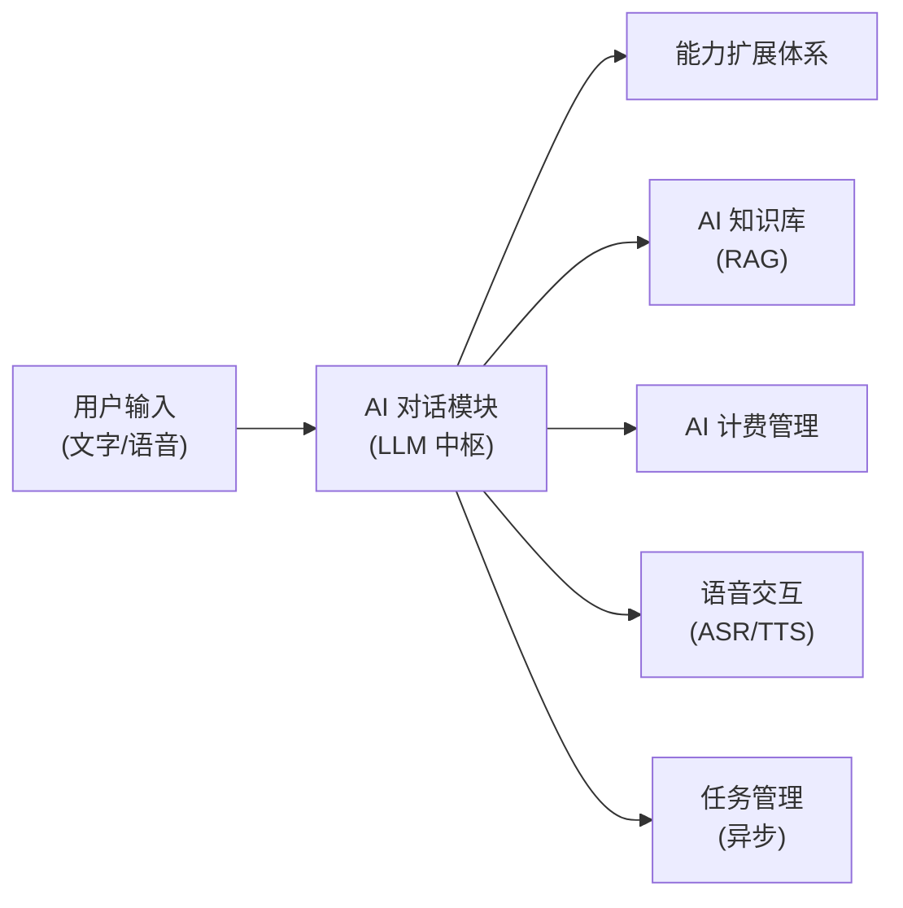
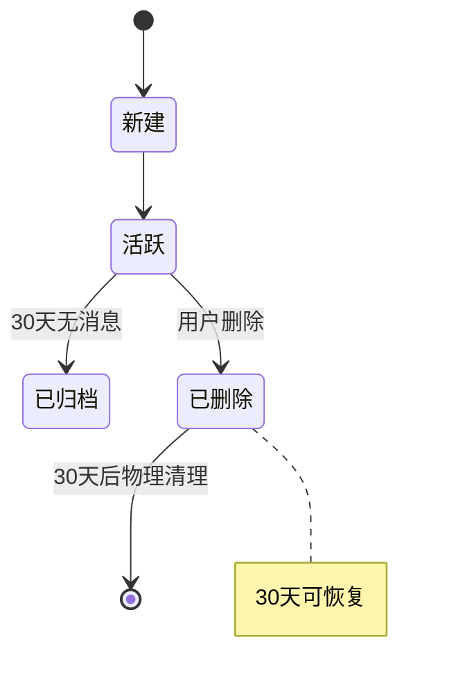
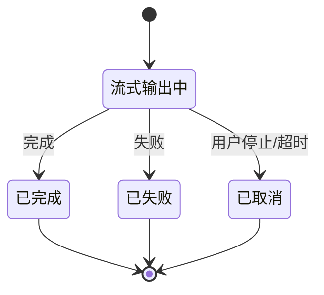
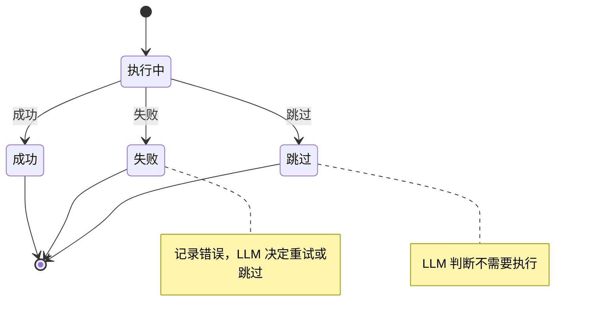

# AI 对话模块需求规格

## 1. 模块概述

### 1.1 模块定位

AI 对话模块是 AI 工作平台的交互中枢，以通用大语言模型（LLM）为底座，通过对话式统一入口调度图像处理、指标评估、算法选择等系统已有能力。模块将平台从"工具集合"升级为"具备通用 AI 助手潜力的智能工作平台"，实现"专业长板 + 通用底座"的融合定位。

### 1.2 核心价值

| 价值维度 | 具体内容 |
|---------|---------|
| **统一入口** | 用户通过对话完成问答、写作、翻译等通用任务，同时可一句话调度图像处理能力 |
| **智能调度** | LLM 理解用户意图，通过能力扩展体系自动调用系统能力（MCP 工具、Skills、内置工具等） |
| **多步推理** | 支持子任务分解、反思重试、人工中断 |
| **上下文记忆** | 提示词工程 + 分层管理对话历史、任务状态、长期记忆、中间产物引用化 |
| **知识增强** | 结合 AI 知识库的 RAG 检索，提升响应准确性和专业性 |
| **语音交互** | 结合语音交互模块，支持语音输入和语音指令控制 |

### 1.3 用户角色分析

| 用户类型 | 特征 | 使用偏好 | 功能需求 |
|---------|------|---------|---------|
| **普通用户** | 不熟悉图像处理参数 | 自然语言描述需求，如"帮我把这张照片变亮" | 语音输入、智能推荐、自动处理 |
| **专业用户** | 了解算法特点 | 对话式调参，如"用 RIDCP 重新处理，强度调到 80" | 多步推理、参数优化 |
| **批量用户** | 需要处理大量图片 | 自然语言描述批量需求，如"把这 10 张雾图都去雾并评估效果" | 批量处理调度、结果摘要 |
| **企业用户** | 需要自动化流程 | 对话调度 + 定时执行，如"每天定时拉取监控截图去雾后分发" | 定时调度（AI 对话子功能） |

### 1.4 依赖关系

> AI 对话通过能力扩展体系间接调用图像处理、指标评估、算法选择等系统能力，不直接依赖这些业务模块。能力扩展体系包括 MCP 工具（调用系统 API）、Skills（工作流指令包）、内置工具（代码执行/文件检索等）等多种能力来源。

### 1.5 依赖模块

| 模块 | 依赖说明 |
|------|---------|
| **能力扩展体系** | AI 对话通过能力扩展体系调用系统能力（MCP 工具调用系统 API、Skills 提供工作流指令、内置工具提供代码执行/文件检索等） |
| **AI 知识库** | 对话时检索知识注入 LLM prompt |
| **AI 计费管理** | 对话消耗 Token 的积分计量与配额扣减 |
| **语音交互** | 语音输入转文本、回复语音播报 |
| **任务管理** | 异步任务调度与回调 |
| **文件管理** | 图片上传与结果获取 |
| **认证管理** | 用户身份解析 |

### 1.6 模块边界

AI 对话模块聚焦"对话理解与调度"，以下能力由其他模块承载，AI 对话不重复实现：

| 能力 | 归属 | 边界说明 |
|------|------|---------|
| 图像处理、指标评估 | 图像处理、指标评估等业务模块 | 通过能力扩展体系调用，不直接实现算法 |
| 算法推荐核心逻辑 | 算法选择模块 | AI 对话只做意图理解、参数生成与推荐理由解释 |
| 积分计量与配额管理 | AI 计费管理 | AI 对话只做执行前校验、执行中预扣、消费结果呈现 |
| 知识库存储与检索 | AI 知识库 | 对话时以检索结果作为增强上下文，不管理知识内容 |
| 语音识别与合成 | 语音交互模块 | 对话侧仅接收转写文本与输出播报文本 |

---

## 2. 功能需求索引

AI 对话模块的功能需求按业务域拆分至以下分篇文档，每篇为独立模块，覆盖完整的功能点（编号 F-M08-xxx 为功能追溯标识）：

| 功能域分篇 | 功能点 | 核心内容 |
|-----------|--------|---------|
| [需求规格-会话与消息](./需求规格-会话与消息.md) | F-M08-001 | 通用对话能力、会话生命周期管理、消息交互与流式输出 |
| [需求规格-多步推理](./需求规格-多步推理.md) | F-M08-002 | 多步推理范式（ReAct/Plan-and-Execute/Reflexion）、复杂度感知、中断恢复 |
| [需求规格-上下文管理](./需求规格-上下文管理.md) | F-M08-003 | 提示词工程、短期/长期记忆分层管理、中间产物引用化、记忆注入与巩固 |
| [需求规格-智能调度](./需求规格-智能调度.md) | F-M08-004/005 | 智能算法推荐、批量处理与结果摘要 |
| [需求规格-能力扩展](./需求规格-能力扩展.md) | F-M08-006 | 工具执行体系、Skills 管理、MCP 命名空间预筛选 |
| [需求规格-模型管理](./需求规格-模型管理.md) | F-M08-007 | 模型供应商管理（多供应商/多 Key 调度、健康与容错）、模型配置、选择切换、生命周期与计费 |
| [需求规格-消息反馈](./需求规格-消息反馈.md) | F-M08-008 | 消息点赞/点踩、反馈驱动优化闭环 |
| [需求规格-定时与兼容](./需求规格-定时与兼容.md) | F-M08-009/010 | 定时调度（防重入/并发/失败熔断/执行观测）、OpenAI/Claude 第三方兼容 API（Key 治理/模型白名单/审计） |
| [需求规格-智能体管理](./需求规格-智能体管理.md) | F-M08-011 | 智能体配置管理、子 Agent 协作、Team 团队 |

---

## 3. 用户交互流程

### 3.1 对话式图像处理完整流程

用户进入对话页面 → 输入需求（文字/语音）→ LLM 理解意图 → 智能选算法 → 用户确认 → 发起图像处理（异步）→ 处理完成回调 → LLM 获取结果 → 生成响应 → 展示处理结果

### 3.2 多轮调参流程

用户："帮这张图去雾" → LLM 选算法并发起处理 → 返回结果 → 用户："再去雾强一点" → LLM 调整参数重新处理 → 返回新结果 → 用户："评估一下效果" → LLM 调用评估工具 → 返回指标 + 解读

### 3.3 模型切换流程

用户在会话设置中选择新模型 → 下一条消息使用新模型 → 历史上下文保持不变 → 新模型基于历史上下文继续对话 → 积分按新模型计费比例扣减

### 3.4 推理中断恢复流程

LLM 推理到需确认环节 → 展示确认卡片（推荐算法/参数/理由）→ 用户确认或修改 → LLM 恢复推理继续执行 → 若用户离开页面，下次进入时自动恢复到确认环节

### 3.5 定时任务固化流程

用户在对话中确认处理流程 → 选择"保存为定时任务" → 设置触发规则、输入来源、输出目标 → 系统创建定时任务 → 到达触发时间自动以系统身份执行 → 执行结果通知用户 → 用户可在任务列表中查看执行历史并启停任务

### 3.6 智能体选择流程

用户在创建会话时选择智能体（Agent）→ 会话内所有消息由该 Agent 推理 → 会话中切换 Agent → 下一条消息使用新 Agent，历史消息保持原 Agent 记录 → 配置变更后新建会话生效，进行中会话沿用原配置

---

## 4. 状态流转

### 4.1 会话状态

### 4.2 消息状态

### 4.3 推理步骤状态

---

## 5. 会员权益与限制

AI 对话的积分计量、配额扣减由 [AI 计费管理模块](../../基础模块/AI计费管理/需求规格.md)统一管理。配额不足时，暂停 LLM 执行并提示用户升级 VIP。

AI 对话积分（日/月限额）、多模态视觉读取日限额的字段落地与各等级建议配额见 [AI 计费管理模块 §2.8 VIP 配额配置](../../基础模块/AI计费管理/需求规格.md)，本文档不重复定义。AI 对话自身的模型选择权益如下：

| 权益项 | 普通用户 | VIP1 | VIP2 | SVIP |
|--------|---------|------|------|------|
| 可选模型范围 | 基础模型 | 基础+进阶 | 全部 | 全部 |

---

## 6. 被依赖模块

| 模块 | 依赖说明 |
|------|---------|
| **前端各端** | 统一对话入口 UI |

---

## 7. 非功能需求与成功度量

### 7.1 非功能需求

| 维度 | 指标 |
|------|------|
| 首 Token 延迟 | 流式输出首 Token P95 ≤ 1.5s（基础模型）/ ≤ 3s（推理模型） |
| 上下文命中率 | 长期记忆检索注入后，相关上下文命中率 ≥ 85% |
| 推理完成率 | 多步推理任务正常完成率 ≥ 95%（不含用户主动中断） |
| 并发承载 | 单实例支持 500 并发流式会话，水平扩展线性提升 |
| 可用性 | 模块可用性 ≥ 99.5%，单次故障 RTO ≤ 5min |
| 计费准确性 | Token 计量与上游模型计费偏差 ≤ ±2% |
| 记忆检索延迟 | 长期记忆检索 P95 ≤ 200ms |

### 7.2 成功度量

| 指标 | 定义 | 目标 |
|------|------|------|
| 推荐采纳率 | 用户采用 LLM 推荐算法（未切换备选、未修改参数）的比例 | ≥ 60% |
| 推理完成率 | 多步推理任务正常完成（非中断、非失败）的比例 | ≥ 95% |
| 首 Token 延迟 | 用户发送消息到收到首个 Token 的延迟 P95 | ≤ 1.5s（基础）/ ≤ 3s（推理） |
| 上下文命中率 | 助手回复正确引用前文上下文/长期记忆的比例 | ≥ 85% |
| 用户满意度 | 助手回复点赞率（点赞 / (点赞 + 点踩)） | ≥ 80% |
| 多模态利用率 | 视觉读取次数 / 限额的均值（衡量配额设置合理性） | 40%-80% |
| 记忆有效率 | 被注入的记忆对回复有正向贡献的比例（A/B 评估） | ≥ 70% |
