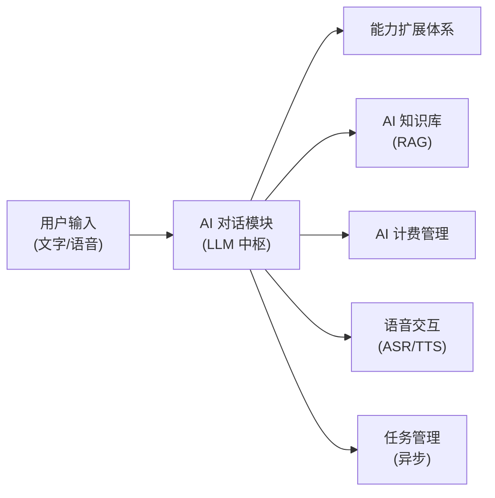
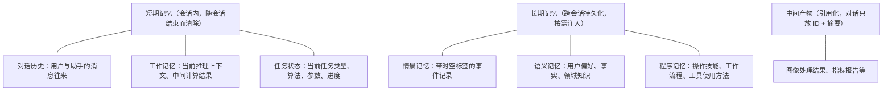
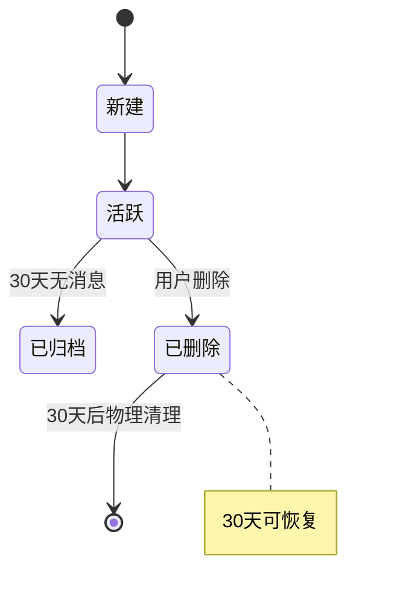
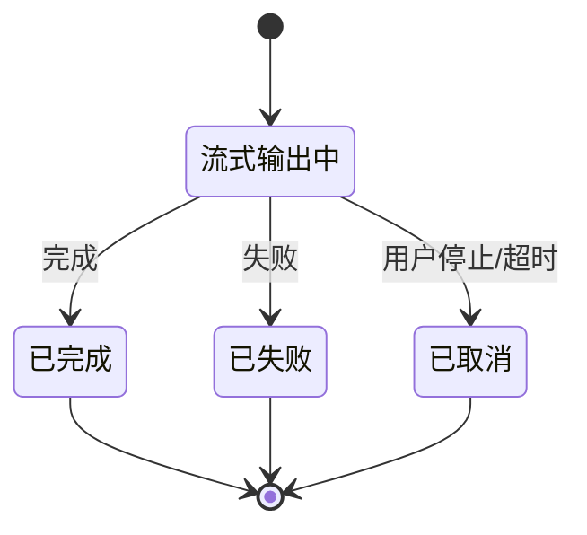
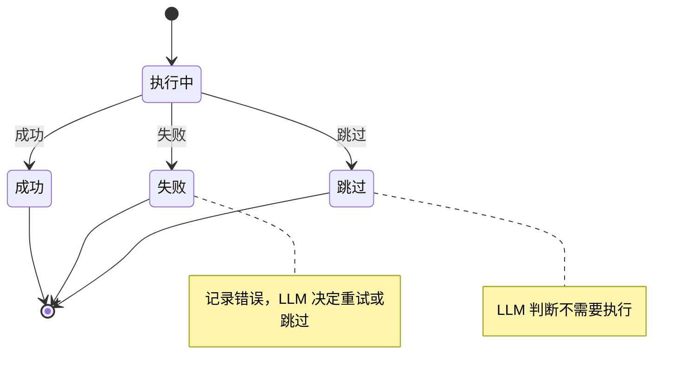

# AI 对话模块需求规格

## 1. 模块概述

### 1.1 模块定位

AI 对话模块是 AI 工作平台的交互中枢，以通用大语言模型（LLM）为底座，通过对话式统一入口调度图像处理、指标评估、算法选择等系统已有能力。模块将平台从"工具集合"升级为"具备通用 AI 助手潜力的智能工作平台"，实现"专业长板 + 通用底座"的融合定位。

### 1.2 核心价值

| 价值维度 | 具体内容 |
|---------|---------|
| **统一入口** | 用户通过对话完成问答、写作、翻译等通用任务，同时可一句话调度图像处理能力 |
| **智能调度** | LLM 理解用户意图，通过能力扩展体系自动调用系统能力（MCP 工具、Skills、内置工具等） |
| **多步推理** | 支持子任务分解、反思重试、人工中断 |
| **上下文记忆** | 分层管理对话历史、任务状态、长期记忆、中间产物 |
| **知识增强** | 结合 AI 知识库的 RAG 检索，提升响应准确性和专业性 |
| **语音交互** | 结合语音交互模块，支持语音输入和语音指令控制 |

### 1.3 用户角色分析

| 用户类型 | 特征 | 使用偏好 | 功能需求 |
|---------|------|---------|---------|
| **普通用户** | 不熟悉图像处理参数 | 自然语言描述需求，如"帮我把这张照片变亮" | 语音输入、智能推荐、自动处理 |
| **专业用户** | 了解算法特点 | 对话式调参，如"用 RIDCP 重新处理，强度调到 80" | 多步推理、参数优化 |
| **批量用户** | 需要处理大量图片 | 自然语言描述批量需求，如"把这 10 张雾图都去雾并评估效果" | 批量处理调度、结果摘要 |
| **企业用户** | 需要自动化流程 | 对话调度 + 定时执行，如"每天定时拉取监控截图去雾后分发" | 定时调度（AI 对话子功能） |

### 1.4 依赖关系



> AI 对话通过能力扩展体系间接调用图像处理、指标评估、算法选择等系统能力，不直接依赖这些业务模块。能力扩展体系包括 MCP 工具（调用系统 API）、Skills（工作流指令包）、内置工具（代码执行/文件检索等）等多种能力来源。

### 1.5 依赖模块

| 模块 | 依赖说明 |
|------|---------|
| **能力扩展体系** | AI 对话通过能力扩展体系调用系统能力（MCP 工具、Skills、内置工具等） |
| **AI 知识库** | 对话时检索知识注入 LLM prompt |
| **AI 计费管理** | 对话消耗 Token 的积分计量与配额扣减 |
| **语音交互** | 语音输入转文本、回复语音播报 |
| **任务管理** | 异步任务调度与回调 |
| **文件管理** | 图片上传与结果获取 |

---

## 2. 功能需求

### 2.1 通用对话与会话管理 (F-M06-001)

#### 2.1.1 功能描述

接入通用大语言模型，提供开放式对话能力，支持问答、写作、翻译、代码、推理等通用任务。用户通过统一对话入口即可完成通用任务，同时可调度图像处理能力。

#### 2.1.2 对话能力

| 能力 | 说明 | 示例 |
|------|------|------|
| 问答 | 知识问答、事实查询 | "PSNR 是什么意思？" |
| 写作 | 文本生成、润色 | "帮我写一段去雾效果的描述" |
| 翻译 | 多语言翻译 | "把这段算法说明翻译成英文" |
| 代码 | 代码生成、解释 | "写一个调用去雾 API 的 Python 脚本" |
| 推理 | 逻辑推理、分析 | "对比 DCP 和 FFA-Net 的适用场景" |

#### 2.1.3 多轮对话

- 支持上下文记忆，后续对话可引用前文内容
- 增量指令不被摘要压掉（如"再亮一点"能正确理解为对上一次处理的调整）
- 超过 token 阈值时自动摘要老消息，保留最近 N 轮原文

#### 2.1.4 会话管理

| 操作 | 说明 | 业务规则 |
|------|------|---------|
| 创建会话 | 用户发起新对话，系统创建会话记录 | 标题默认"新对话"，首条消息发送后自动从内容提取标题 |
| 会话列表 | 展示用户历史会话，支持搜索、继续、删除 | 按最后活跃时间倒序排列，支持置顶；搜索匹配标题和消息内容 |
| 会话中断恢复 | 用户离线后重新进入对话可继续 | 流式输出中断的消息支持断线重连恢复（5 分钟窗口）；超时未重连标记为"已取消"，支持重新生成 |
| 会话标题 | 自动用 LLM 生成标题，支持手动修改 | 首条消息后异步用 LLM 生成标题（不超过 20 字）；手动修改后不再自动生成；LLM 失败时降级为截取前 20 字 |
| 会话归档 | 不活跃的会话自动归档，用户也可手动归档 | 超过 30 天无新消息的会话自动转为归档状态；手动归档通过更新会话 `status` 字段实现；归档会话不计入活跃列表 |
| 会话删除 | 用户删除会话 | 软删除，30 天内可恢复；删除会话不级联删除关联的图像处理记录 |

#### 2.1.5 消息交互

| 交互 | 说明 |
|------|------|
| 发送消息 | 文字输入，支持回车发送（Shift+回车换行）|
| 流式输出 | LLM 回复实时流式展示，支持中途停止和断线重连 |
| 重新生成 | 对助手回复不满意可重新生成，生成新分支消息，支持分支切换 |
| 编辑重发 | 编辑已发送的用户消息，重新触发回复，原消息标记"已编辑"并保留原文 |
| 复制消息 | 一键复制消息内容 |
| 已读未读 | 多端登录时同步已读状态 | 会话列表显示未读消息数，切换会话时标记为已读 |
| 多模态输入 | 支持在消息中附带图片、文档（PDF/Word/Excel/PPT/Markdown）、音视频（MP4/MP3）等文件，由多模态模型理解内容 |

#### 2.1.6 业务规则

| 规则 | 说明 |
|------|------|
| 单条消息长度 | 用户输入不超过 4000 字符 |
| 流式超时 | 单次流式输出超过 120 秒未收到新 token 判定超时，标记消息为失败 |
| 断线重连 | SSE 连接断开后 5 分钟内可重连恢复，客户端携带 Last-Event-ID 从断点继续 |
| 幂等性 | 消息发送需携带 Idempotency-Key，同一 Key 多次发送只产生一条消息和一次计费 |
| 并发限制 | 同一会话同一时间只允许一个流式输出进行中，新消息需等待上一个完成或取消 |
| 消息归属 | 用户只能查看和操作自己的会话和消息 |

### 2.2 多步推理 (F-M06-002)

#### 2.2.1 功能描述

支持开放式对话的多步推理，Agent 根据任务复杂度自动选择最合适的推理范式（ReAct 边想边做 / Plan-and-Execute 先想后做 / Reflexion 反思迭代），通过理解-执行-观察-反思循环完成任务。

#### 2.2.2 推理能力

| 能力 | 说明 |
|------|------|
| 复杂度感知 | Agent 启动时评估任务复杂度，自动选择推理范式（简单问答直接回复、动态任务用 ReAct、多步任务用 Plan-and-Execute、高精度任务用 Reflexion） |
| 子任务分解 | 将复杂需求分解为多个子任务，标注依赖关系，独立子任务可并行执行 |
| 工具调用 | 通过能力扩展体系调用系统能力（系统工具、文件操作、搜索、代码执行、Skills、子智能体等） |
| 结果观察 | 观察工具返回结果，决定下一步操作 |
| 自我评估 | Reflexion 范式下评估结果质量（LLM 自评 + 规则校验 + 工具验证），不达标时反思改进 |
| 反思重试 | 工具调用失败或结果不理想时，分析根因修正策略重试 |
| 错误恢复 | 参数错误修正重试、超时降并行度、服务不可用切换备用工具或跳过 |
| 人工中断 | 需要用户确认时暂停（如算法选择确认、危险操作确认、VIP 付费确认） |
| 异步等待 | 长耗时任务（如图像处理）提交后中断等待，完成后恢复继续推理 |
| 子智能体协作 | 复杂任务委派给专用子智能体执行，支持并行执行和 Agent 团队协作 |

#### 2.2.3 推理范式

| 范式 | 核心思想 | 适用场景 |
|------|---------|---------|
| ReAct（边想边做） | Thought → Action → Observation 循环，每步只决定下一步 | 步骤不确定需动态调整的任务、实时问答 |
| Plan-and-Execute（先想后做） | 先规划完整计划再执行，支持并行和动态重规划 | 步骤可预见的多步骤任务、批量处理 |
| Reflexion（反思迭代） | 执行 → 评估 → 反思 → 改进循环，从错误中学习 | 需高精度输出的任务、可迭代优化的任务 |

> 三种范式可混合使用：顶层 Plan-and-Execute 分解任务，子任务按特性选择 ReAct 或 Reflexion。

#### 2.2.4 推理循环

```
用户描述需求
    ↓
评估任务复杂度，选择推理范式
    ↓
按选定范式执行（ReAct 循环 / Plan-and-Execute 规划执行 / Reflexion 迭代优化）
    ↓
观察结果，判断是否完成
    ↓
完成 → 生成响应返回用户
未完成 → 继续下一步（循环）
需要确认 → 暂停等待用户确认
失败 → 错误恢复策略（修正重试 / 降级 / 跳过）
质量不达标（Reflexion）→ 反思改进，重新执行
```

#### 2.2.5 推理过程展示

用户可看到 LLM 的推理过程，包括：
- 当前使用的推理范式（ReAct / Plan-and-Execute / Reflexion）
- 每一步的思考内容（LLM 在想什么）
- 调用的工具名称和输入参数
- 工具返回的结果摘要
- 步骤序号和耗时
- Plan-and-Execute 的任务计划（子任务列表、依赖关系、执行进度）
- Reflexion 的评估结果和反思内容（迭代改进过程）
- 并行执行的子任务进度

推理过程默认折叠展示，用户可展开查看详情。这帮助用户理解 LLM 的决策逻辑，建立信任。

#### 2.2.6 成本与安全控制

| 限制 | 说明 |
|------|------|
| 最大推理步数 | 按推理范式差异化限制（ReAct: 20 步、Plan-and-Execute: 30 步、Reflexion: 15 步×3 次迭代），防止无限循环 |
| Token 预算 | 单会话累计 Token 超限后拒绝继续推理 |
| 滚动预算校验 | 每步执行前（含子智能体派发前）向计费管理校验剩余配额并预扣本步预估消耗；剩余配额不足时触发中止策略 |
| 工具超时 | 单工具调用超过阈值自动失败，触发错误恢复策略 |
| 工具白名单 | Agent 只能调用注册的工具，防止未授权操作 |
| 危险操作确认 | 删除文件、执行危险命令前需用户确认 |
| 沙箱隔离 | 代码执行在受限沙箱中，资源配额和路径白名单控制 |
| 并行度限制 | 并行执行子任务数上限（默认 5），防止资源耗尽 |

**配额不足中止策略与降级体验**：

| 场景 | 处理方式 |
|------|---------|
| 单步预扣失败 | 立即暂停推理，已完成步骤保留；前端展示"积分不足"卡片，支持升级 VIP 后从当前步骤继续 |
| 推理中途累计超额 | 停止后续步骤，已生成部分结果以摘要形式返回，避免用户白等 |
| 子智能体并行超额 | 主 Agent 召回未启动的子智能体，已完成子智能体结果保留并参与汇总；前端提示"部分子任务因配额不足未执行" |
| 降级继续 | 用户可选择跳过非关键步骤、切换积分单价更低的模型或减少并行度，按剩余配额完成核心目标 |

**子智能体并行计费呈现**：
- 主会话计费明细按子智能体维度分项展示（子智能体名称 + Token 数 + 积分），与主 Agent 消耗汇总为会话总消耗
- 前端推理过程面板实时展示各并行子智能体的累计消耗与配额占用
- 子智能体消耗归集到主会话配额，不单独开账户

#### 2.2.7 中断与恢复

| 场景 | 用户体验 |
|------|---------|
| 算法选择确认 | LLM 推荐算法后暂停，展示推荐理由供用户确认或修改 |
| 配额不足 | 积分/配额耗尽时暂停，按 2.2.6 中止策略处理（升级 VIP 或降级继续） |
| 异步任务等待 | 图像处理提交后暂停，前端展示处理进度，完成后自动恢复推理 |
| 用户主动中断 | 用户点击"停止"按钮，立即终止当前推理，已完成的步骤保留 |
| 断线重连 | 用户网络中断后重连，自动恢复到中断前的推理状态 |

### 2.3 上下文与记忆管理 (F-M06-003)

#### 2.3.1 功能描述

分层管理对话上下文与记忆，避免上下文爆炸，支持长对话和复杂任务。参考认知心理学记忆模型（短期记忆 + 长期记忆）与业界记忆管理框架，构建精细化的记忆管理体系。

#### 2.3.2 上下文与记忆分层结构



#### 2.3.3 短期记忆管理

短期记忆存活于单次会话内，生命周期短，需要压缩策略避免上下文膨胀。

| 层 | 内容 | 管理策略 |
|----|------|---------|
| 对话历史 | 用户与助手的消息往来 | 超 token 阈值自动摘要老消息，保留最近 N 轮原文 |
| 工作记忆 | 当前推理上下文、中间计算结果、正在分析的变量 | 随推理过程更新，不持久化，通过 checkpoint 恢复 |
| 任务状态 | 当前任务类型、算法、参数、执行进度 | 结构化存储在 checkpoint state 中，不进入对话流，LLM 可通过工具查询 |

- 增量指令（如"再亮一点"）不被摘要压掉：最近 N 轮原文始终保留，任务状态独立维护记录上一次处理的算法和参数

#### 2.3.4 长期记忆管理

长期记忆跨会话持久化，参考认知心理学三类记忆模型：

| 记忆类型 | 定位 | 内容 | 示例 |
|---------|------|------|------|
| **情景记忆** (episodic) | 带时空标签的事件记录 | "某时某地发生了什么" | "用户上周二要求用 RIDCP 处理一张雾图，结果满意" |
| **语义记忆** (semantic) | 抽象知识、事实、用户偏好 | "知道什么" | "用户偏好简洁回复"、"用户是图像处理研究者" |
| **程序记忆** (procedural) | 操作技能、工作流程、工具使用方法 | "会做什么" | "用户习惯先去雾再评估，强度通常设 60-80" |

**记忆来源**：

| 来源 | 提取方式 | 示例 |
|------|---------|------|
| 对话提取 | LLM 在对话中识别值得记住的信息 | "我喜欢简洁的回复" → 语义记忆 |
| 反馈提取 | 用户点踩时附带的改进建议 | "太冗长" → 语义记忆（偏好简洁） |
| 反思整合 | 定期回顾近期记忆，生成更高层次的抽象洞察 | "连续三周周一要报告" → 程序记忆（每周一需周报） |
| 手动录入 | 用户在设置中手动添加 | "我是图像处理研究者" → 语义记忆 |

**记忆检索**：按相关性 + 近因性 + 重要性三维度加权检索，被检索命中的记忆"重激活"（重置衰减计时器），类似人类"复习巩固"。

#### 2.3.5 记忆整理与巩固

记忆整理是将短期记忆转化为长期记忆、并对长期记忆进行维护管理的核心过程：

| 机制 | 说明 | 触发条件 |
|------|------|---------|
| **定期摘要巩固** | 对话历史超阈值时摘要压缩，提取关键信息存入长期记忆 | token 数达模型上下文 70% |
| **遗忘曲线** | 记忆检索优先级随时间衰减，未被访问的记忆逐渐淡化，低于阈值时归档 | 每日定时计算衰减 |
| **重要性评分** | 综合情感/频率/时效/信息增益/显式标记计算记忆重要性（0-100 分） | 记忆写入和访问时更新 |
| **反思整合** | 周期性回顾近期记忆，生成更高层次的抽象洞察（情景记忆 → 语义/程序记忆） | 每日定时 / 会话结束时 |
| **合并去重** | 检测语义重复的记忆条目，合并为更完整的单一条目 | 每日定时 |

记忆管理操作：
- 用户可在设置中查看所有记忆条目（按类型/来源/重要性筛选），区分"对话自动提取"与"用户手动录入"两类来源
- 用户可删除单条记忆（软删除，不再注入后续对话）
- 归档的记忆不注入但保留记录，用户可查看历史归档

**长期记忆隐私合规**：

| 维度 | 规则 |
|------|------|
| 记忆可见性 | 用户对自身所有记忆条目（含活跃、归档）享有完整可见权；系统/管理员仅在用户授权或合规审计场景下可访问 |
| 敏感信息过滤 | 记忆写入前由 LLM + 规则双重过滤：身份证、手机号、银行卡、密码、密钥等敏感字段不写入长期记忆，命中过滤时仅保留脱敏后的非敏感上下文 |
| 批量清空 | 支持"清空全部记忆""清空指定类型记忆""清空指定时间范围记忆"三种粒度，需二次确认，30 天内可恢复 |
| 记忆导出 | 用户可在设置中一键导出全部记忆为 JSON/Markdown，含类型、来源、重要性、创建时间，便于个人数据携带与合规审计 |
| 注入可见性 | 每条助手回复可附"本次引用的记忆"清单（默认折叠），用户可知晓哪些记忆被用于本次响应 |
| 合规留存 | 记忆删除遵循平台数据留存策略，软删除 30 天后物理清理；涉及合规审计的记录按法规要求单独留存 |

#### 2.3.6 中间产物引用化

图像处理结果体量大，绝不塞入对话上下文：

1. 处理完成后，在对话中展示结果卡片（缩略图 + 指标数值 + 算法信息）
2. LLM 需要理解结果时，通过工具获取结构化摘要（指标数值 + 算法信息 + 处理参数）
3. 若需视觉理解（如"看看去雾效果好不好"），利用多模态模型读取图片，控制成本

**多模态视觉读取限额与计费边界**：

| 维度 | 规则 |
|------|------|
| 限额范围 | "多模态视觉读取（次/会话）"专指 LLM 在推理过程中主动读取图片（含中间产物引用化场景）的次数，与用户主动附图输入分开计量 |
| 用户附图输入 | 用户在消息中附带的图片按多模态输入计费（按模型 Token 比例扣减积分），不占用视觉读取次/会话限额 |
| 用尽降级路径 | 视觉读取次数用尽后，LLM 不再读取图片，改为基于结构化摘要（指标数值 + 算法信息 + 处理参数）生成文本描述；前端提示"本会话视觉读取已用尽，已切换为文本描述模式，升级 VIP 可获更多次数" |
| 跨会话延续 | 会话可长期延续，视觉读取限额按会话维度独立计算，新会话重置；超长会话不累积跨日额度 |

### 2.4 智能算法推荐 (F-M06-004)

#### 2.4.1 功能描述

用户用自然语言描述处理需求，LLM 理解用户意图并生成推荐理由，算法的匹配、排序、打分逻辑由独立的"算法选择"模块统一承载，AI 对话通过 MCP 调用算法选择模块获取推荐结果。

#### 2.4.2 职责边界

| 关注点 | 归属 | 说明 |
|--------|------|------|
| 用户意图理解 | AI 对话 | 解析自然语言需求，提取任务类型、约束条件、偏好 |
| 图像特征分析 | 算法选择模块（MCP 调用） | 图像特征提取与归类，由算法选择模块封装 |
| 算法匹配/排序/打分 | 算法选择模块（MCP 调用） | 基于特征与规则的算法推荐核心逻辑，对话侧不重复实现 |
| 推荐理由生成 | AI 对话 | 将算法选择模块的推荐结果转化为自然语言解释 |
| 用户确认与参数调整 | AI 对话 | 展示推荐、接收用户修改、发起处理 |

> AI 对话侧不维护算法知识库与匹配规则，避免与算法选择模块重复建设。

#### 2.4.3 推荐流程

1. 用户描述需求（如"帮我把这张夜景照片变亮"）
2. LLM 解析意图，通过 MCP 调用算法选择模块（传入图像特征分析 + 用户约束）
3. 算法选择模块返回推荐算法及匹配依据
4. LLM 结合 AI 知识库检索的算法知识生成推荐理由（自然语言解释为什么选这个算法）
5. 用户确认后自动发起处理

#### 2.4.4 推荐结果展示

| 元素 | 说明 |
|------|------|
| 推荐算法 | 算法名称 + 简要说明 |
| 推荐理由 | 自然语言解释（如"该算法针对夜景低光照场景优化，能有效提升亮度且抑制噪声"）|
| 推荐参数 | 建议的处理参数（如"强度 70，饱和度 120"）|
| 备选方案 | 1-2 个备选算法及各自适用场景 |
| 确认/修改 | 用户可确认使用推荐，或切换备选算法、调整参数 |

### 2.5 批量处理摘要 (F-M06-005)

#### 2.5.1 功能描述

用户上传多张图片后，通过自然语言描述统一处理需求，LLM 调度批量处理并生成结果摘要。

#### 2.5.2 批量处理流程

1. 用户上传多张图片 + 描述需求（如"把这 10 张雾图都去雾并评估效果"）
2. LLM 分解为批量任务：每张图片 → 去雾处理 → 指标评估
3. 逐张或并行调度工具执行
4. 全部完成后生成摘要：成功率、平均指标、效果最佳/最差的图片

#### 2.5.3 批量结果摘要

| 摘要内容 | 说明 |
|---------|------|
| 处理概况 | 总数 / 成功数 / 失败数 |
| 平均指标 | 平均 PSNR、SSIM 等关键指标 |
| 效果最佳 | 指标最高的图片及详情 |
| 效果最差 | 指标最低的图片及详情 |
| 失败原因 | 失败图片的原因汇总 |
| 结果列表 | 每张图片的缩略图 + 指标 + 处理参数 |

### 2.6 能力扩展 (F-M06-006)

#### 2.6.1 功能描述

AI 对话支持多种能力来源，LLM 根据任务类型自动选择最合适的能力来源执行。能力扩展体系覆盖系统能力调用、文件操作、搜索检索、代码执行、工作流指令、子智能体协作等场景。

#### 2.6.2 能力来源

| 能力来源 | 定位 | 适用场景 | 示例 |
|---------|------|---------|------|
| **系统工具（MCP）** | 调用系统后端 API | 需要访问系统能力 | 图像去雾处理、指标评估、算法推荐查询 |
| **文件操作** | 读取/写入/删除文件 | 需要操作用户文件 | 读取用户上传的 CSV、保存生成的评估报告 |
| **搜索工具** | 网络搜索、知识库检索、本地文件检索 | 需要获取实时信息或检索知识 | 搜索最新去雾算法论文、检索 AI 知识库、搜索本地文件 |
| **代码执行** | 沙箱中执行代码和命令 | 需要数据计算、自动化处理 | 执行 Python 脚本分析指标分布、执行 Shell 命令 |
| **Skills** | 工作流指令包（渐进式加载） | 有固定工作流程，需要按步骤执行 | 代码审查清单、去雾效果评估报告生成流程、算法选型决策树 |
| **子智能体** | 将 Agent 作为工具调用，支持多智能体协作 | 复杂任务分解、专业能力协作 | 代码审查 Agent、数据分析 Agent、Agent 团队协作 |

> **Skills 渐进式加载**：启动时只加载名称和描述（几十 tokens），LLM 判断需要时才加载完整指令，避免上下文膨胀。Skills 可调用其他工具协同工作——Skill 定义"怎么做"，系统工具/代码执行提供"调什么"。
>
> **子智能体协作**：主 Agent 可将子任务委派给专用子智能体执行，子智能体有独立的 System Prompt 和工具集。多个子智能体可组成 Agent 团队协作完成复杂任务，主 Agent 负责任务分解、结果汇总和最终回复。

#### 2.6.3 能力选择

LLM 根据用户意图自动选择能力来源：

| 用户意图 | 能力来源 | 理由 |
|---------|---------|------|
| "帮这张图去雾" | 系统工具（MCP） | 需要调用图像处理 API |
| "帮我审查这段代码" | Skills | 有固定的代码审查清单流程 |
| "分析这批指标的统计分布" | 代码执行 | 需要执行 Python 脚本做数据分析 |
| "查一下最新的去雾算法论文" | 搜索工具（网络搜索） | 需要实时网络信息 |
| "把我上次生成的报告找出来" | 搜索工具（本地文件检索） | 需要检索本地文件 |
| "把分析结果保存成 CSV" | 文件操作 | 需要写入文件 |
| "让专门的代码审查 Agent 检查这个项目" | 子智能体 | 需要专业子智能体执行 |
| "按标准流程评估去雾效果并生成报告" | Skills + 系统工具 | Skill 定义评估流程，MCP 工具调用评估 API |

#### 2.6.4 Skills 管理

| 操作 | 说明 |
|------|------|
| Skills 列表 | 展示可用的 Skills，含名称、描述、适用场景 |
| Skill 加载 | LLM 自动判断需要时加载，用户也可手动指定"使用 xxx Skill" |
| Skill 创建 | 管理员可创建自定义 Skill（Markdown 指令 + 可选脚本/模板） |
| Skill 启停 | 管理员可启用/禁用 Skill |

### 2.7 模型选择 (F-M06-007)

#### 2.7.1 功能描述

用户可在对话中选择不同的 LLM 模型，不同模型的积分消耗不同（按模型计费比例换算）。模型选择在会话级别生效，同一会话内可切换模型。

#### 2.7.2 模型展示

| 展示信息 | 说明 |
|---------|------|
| 模型名称 | 显示名称（如"GPT-4o"、"Claude 3.5 Sonnet"）|
| 能力标识 | 标识模型能力（多模态、工具调用、流式输出）|
| 积分单价 | 输入/输出积分单价，帮助用户了解成本 |
| 推荐场景 | 简要说明模型适用场景（如"通用对话"、"复杂推理"、"代码生成"）|

#### 2.7.3 业务规则

| 规则 | 说明 |
|------|------|
| 模型可用性 | 仅启用状态的模型可选择 |
| VIP 限制 | 部分高端模型仅 VIP 用户可用 |
| 多模态校验 | 附带文件输入时，模型必须支持对应模态（图片需视觉能力、文档需文档理解能力） |
| 切换生效 | 会话中切换模型后，下一条消息使用新模型，历史消息保持原模型记录 |
| 默认模型 | 新建会话使用平台默认模型，用户可在设置中配置偏好默认模型 |

### 2.8 消息反馈 (F-M06-008)

#### 2.8.1 功能描述

用户可对助手的回复进行点赞或点踩反馈，用于质量分析和效果度量。反馈帮助平台持续优化 LLM 提示词和工具调用策略。

#### 2.8.2 反馈交互

| 交互 | 说明 |
|------|------|
| 点赞 | 标记回复有帮助，可附选预设标签（准确、详细、简洁、有创意）|
| 点踩 | 标记回复需改进，必须选择问题标签（太长、错误、无关、有害）并填写改进建议 |
| 撤销 | 撤销已提交的反馈 |
| 修改 | 修改反馈类型（点赞改点踩或反之），走 upsert 更新 |

#### 2.8.3 业务规则

| 规则 | 说明 |
|------|------|
| 反馈对象 | 仅助手的回复消息可反馈，用户消息和工具消息不可反馈 |
| 唯一性 | 同一用户对同一消息只能有一条反馈记录 |
| 反馈时效 | 消息发送后 30 天内可反馈 |

### 2.9 定时调度 (F-M06-009)

#### 2.9.1 功能描述

支持用户将对话中调度的处理流程固化为定时任务，按设定的时间规则自动触发对话执行，满足企业用户自动化流程需求（如每日定时去雾监控截图并分发）。

#### 2.9.2 定时任务管理

| 操作 | 说明 | 业务规则 |
|------|------|---------|
| 创建定时任务 | 用户在对话中确认流程后"保存为定时任务" | 需指定触发规则（Cron 表达式）、输入来源（固定/动态拉取）、输出目标 |
| 任务列表 | 展示用户的定时任务，支持启停、编辑、删除 | 按下次触发时间排序，展示最近执行结果 |
| 任务执行 | 到达触发时间自动以系统身份发起对话执行 | 复用多步推理能力，执行结果通过消息推送/回调通知用户 |
| 执行历史 | 记录每次执行的结果、消耗、耗时、失败原因 | 保留 30 天，支持回溯查看 |

#### 2.9.3 业务规则

| 规则 | 说明 |
|------|------|
| 权限限制 | 定时调度仅 VIP2 及以上用户可用，普通用户不可创建 |
| 配额占用 | 定时任务执行消耗的积分计入用户配额，配额不足时跳过本次执行并通知用户 |
| 失败重试 | 任务执行失败时按指数退避重试 3 次，仍失败则记录并通知用户 |
| 任务上限 | 单用户定时任务数上限 20 个，防止资源滥用 |
| 输入来源 | 支持固定输入（用户预设图片集）与动态输入（通过 MCP 拉取监控截图/指定目录新文件） |

---

## 3. 用户交互流程

### 3.1 对话式图像处理完整流程

用户进入对话页面 → 输入需求（文字/语音）→ LLM 理解意图 → 智能选算法 → 用户确认 → 发起图像处理（异步）→ 处理完成回调 → LLM 获取结果 → 生成响应 → 展示处理结果

### 3.2 多轮调参流程

用户："帮这张图去雾" → LLM 选算法并发起处理 → 返回结果 → 用户："再去雾强一点" → LLM 调整参数重新处理 → 返回新结果 → 用户："评估一下效果" → LLM 调用评估工具 → 返回指标 + 解读

### 3.3 模型切换流程

用户在会话设置中选择新模型 → 下一条消息使用新模型 → 历史上下文保持不变 → 新模型基于历史上下文继续对话 → 积分按新模型计费比例扣减

### 3.4 推理中断恢复流程

LLM 推理到需确认环节 → 展示确认卡片（推荐算法/参数/理由）→ 用户确认或修改 → LLM 恢复推理继续执行 → 若用户离开页面，下次进入时自动恢复到确认环节

---

## 4. 状态流转

### 4.1 会话状态



### 4.2 消息状态



### 4.3 推理步骤状态



---

## 5. 会员权益与限制

AI 对话的积分计量、配额扣减由 [AI 计费管理模块](../../基础模块/AI计费管理/需求规格.md)统一管理。配额不足时，暂停 LLM 执行并提示用户升级 VIP。

| 权益项 | 普通用户 | VIP1 | VIP2 | SVIP |
|--------|---------|------|------|------|
| AI 对话积分（日限额） | 10,000 | 50,000 | 200,000 | 1,000,000 |
| AI 对话积分（月限额） | 100,000 | 500,000 | 2,000,000 | 10,000,000 |
| 多模态视觉读取（次/会话） | 5 | 10 | 20 | 50 |
| 可选模型范围 | 基础模型 | 基础+进阶 | 全部 | 全部 |

---

## 6. 依赖关系

### 6.1 依赖模块

| 模块 | 依赖说明 |
|------|---------|
| **能力扩展体系** | AI 对话通过能力扩展体系调用系统能力（MCP 工具调用系统 API、Skills 提供工作流指令、内置工具提供代码执行/文件检索等） |
| **AI 知识库** | 对话时检索知识注入 LLM prompt |
| **AI 计费管理** | 对话消耗 Token 的积分计量与配额扣减 |
| **语音交互** | 语音输入转文本、回复语音播报 |
| **任务管理** | 异步任务调度与回调 |
| **文件管理** | 图片上传与结果获取 |
| **认证管理** | 用户身份解析 |

### 6.2 被依赖模块

| 模块 | 依赖说明 |
|------|---------|
| **前端各端** | 统一对话入口 UI |

---

## 7. 非功能需求与成功度量

### 7.1 非功能需求

| 维度 | 指标 |
|------|------|
| 首 Token 延迟 | 流式输出首 Token P95 ≤ 1.5s（基础模型）/ ≤ 3s（推理模型） |
| 上下文命中率 | 长期记忆检索注入后，相关上下文命中率 ≥ 85% |
| 推理完成率 | 多步推理任务正常完成率 ≥ 95%（不含用户主动中断） |
| 并发承载 | 单实例支持 500 并发流式会话，水平扩展线性提升 |
| 可用性 | 模块可用性 ≥ 99.5%，单次故障 RTO ≤ 5min |
| 计费准确性 | Token 计量与上游模型计费偏差 ≤ ±2% |
| 记忆检索延迟 | 长期记忆检索 P95 ≤ 200ms |

### 7.2 成功度量

| 指标 | 定义 | 目标 |
|------|------|------|
| 推荐采纳率 | 用户采用 LLM 推荐算法（未切换备选、未修改参数）的比例 | ≥ 60% |
| 推理完成率 | 多步推理任务正常完成（非中断、非失败）的比例 | ≥ 95% |
| 首 Token 延迟 | 用户发送消息到收到首个 Token 的延迟 P95 | ≤ 1.5s（基础）/ ≤ 3s（推理） |
| 上下文命中率 | 助手回复正确引用前文上下文/长期记忆的比例 | ≥ 85% |
| 用户满意度 | 助手回复点赞率（点赞 / (点赞 + 点踩)） | ≥ 80% |
| 多模态利用率 | 视觉读取次数 / 限额的均值（衡量配额设置合理性） | 40%-80% |
| 记忆有效率 | 被注入的记忆对回复有正向贡献的比例（A/B 评估） | ≥ 70% |

---

## 8. 相关文档

| 文档类型 | 文档路径 |
|---------|---------|
| **API 接口** | [API接口](./API接口.md) |
| **后端实现-架构与公共** | [后端实现-架构与公共](./后端实现-架构与公共.md) |
| **后端实现-会话与消息** | [后端实现-会话与消息](./后端实现-会话与消息.md) |
| **后端实现-多步推理** | [后端实现-多步推理](./后端实现-多步推理.md) |
| **后端实现-上下文管理** | [后端实现-上下文管理](./后端实现-上下文管理.md) |
| **后端实现-智能调度** | [后端实现-智能调度](./后端实现-智能调度.md) |
| **后端实现-模型与反馈** | [后端实现-模型与反馈](./后端实现-模型与反馈.md) |
| **前端实现** | [前端实现](./前端实现.md) |
| **MCP 能力网关** | [MCP能力网关/需求规格](../MCP能力网关/需求规格.md)（能力扩展体系的工具来源之一） |
| **AI 知识库** | [AI知识库/需求规格](../../基础模块/AI知识库/需求规格.md) |
| **AI 计费管理** | [AI计费管理/需求规格](../../基础模块/AI计费管理/需求规格.md) |
| **语音交互** | [语音交互/需求规格](../../基础模块/语音交互/需求规格.md) |
| **任务管理** | [任务管理/需求规格](../../基础模块/任务管理/需求规格.md) |
| **远期规划** | [远期改造计划总览](../../05-改造计划/远期改造计划总览.md) |
