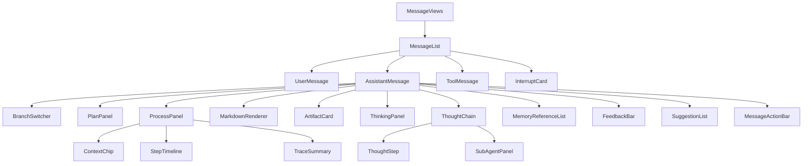
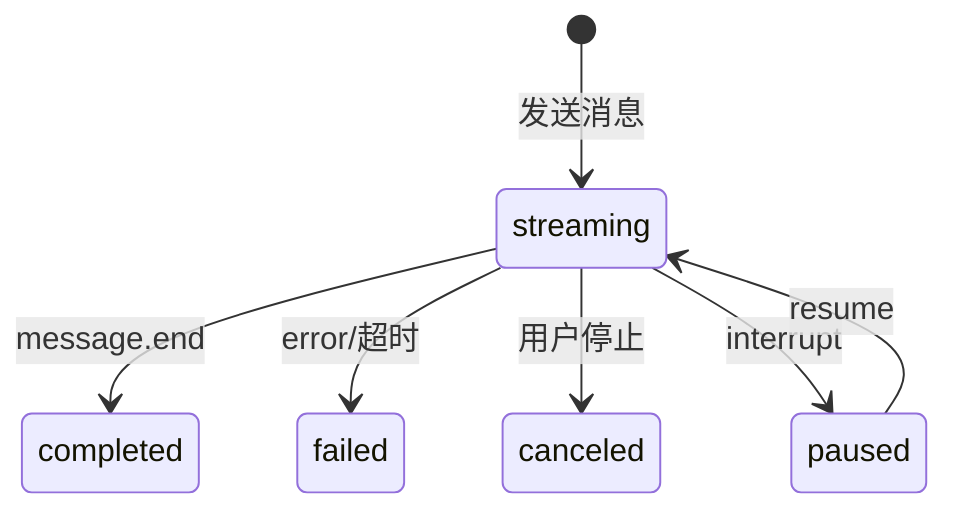

# AI 对话模块 - 前端实现设计（公共）

## 1. 文档概述

本文档描述 AI 对话模块**用户端与管理端共用的消息数据视图层与流式基础设施**：会话/消息数据视图组件（`scope` 驱动数据范围：用户端 `scope=self` 本人 / 管理端会话审计 `scope=admin` 全量）、SSE 流式状态机、会话级 Store 与消息操作。核心设计是**视图同构、数据范围可切换**——两端渲染同一套消息组件，仅查询参数与操作入口不同。

页面结构与交互规范见 [需求规格.md](../需求规格.md) §3，接口契约见 [API接口.md](../API接口.md) §2.1-2.2。用户端对话页见 [前端实现-用户端.md](前端实现-用户端.md)，管理端四页见 [前端实现-管理端-会话管理.md](前端实现-管理端-会话管理.md)/[前端实现-管理端-智能体管理.md](前端实现-管理端-智能体管理.md)/[前端实现-管理端-MCP管理.md](前端实现-管理端-MCP管理.md)/[前端实现-管理端-SKILL管理.md](前端实现-管理端-SKILL管理.md)。

> 本公共文档仅承载**消息数据视图层与流式基础设施**（会话列表/消息流/消息操作/SSE 状态机）。输入区、会话设置、记忆面板等用户端交互与市场、命名空间、评测等管理端交互为端内特有，见各端文档；Markdown/代码高亮/图表等组件属项目公共组件库。

---

## 2. 公共组件树设计

| 组件 | 职责 |
|------|------|
| MessageViews | 消息数据视图层容器（无独立路由），仅透传 props / 转发 emit、不读写任何 store，供用户端/管理端页面嵌入；滚动跟随经 `scrollFollowEnabled` prop 输入、`scroll-follow-toggle` emit 上抛 |
| MessageList | 消息列表渲染：按时间正序，支持流式增量、分支切换；超 100 条启用虚拟滚动；自动滚动跟随，用户上滑时暂停跟随并显示"回到底部"按钮 |
| UserMessage | 用户消息展示，支持编辑重发、复制；编辑后展示"已编辑"标识并可查看原文 |
| AssistantMessage | 助手消息展示，聚合 Markdown/思考过程/产物/推理链/引用记忆/反馈/操作栏；产物经 emit `load-artifacts(messageId)` 上抛、由绑定层按需拉取后回填（组件层零 SDK） |
| MessageActionBar | 消息操作栏（悬停出现）：复制、引用、重新生成、朗读、删除、反馈；复制成功切换完成态，代码块独立复制入口 |
| FeedbackBar | 渐进式反馈栏：点赞一键完成；点踩后展开 6 类问题标签单选，文字说明可选；已反馈状态高亮展示，支持撤销/修改 |
| ToolMessage | 工具调用消息，折叠展示工具名/参数/返回摘要，执行状态徽标更新 |
| ThinkingPanel | 思考过程卡（对标 DeepSeek/业界推理模型思考块）：折叠头部实时计时（"思考中…(Ns)"，思考结束定格"已深度思考（用时 Ns）"）；多段思考（思考→工具→再思考）按段累积、段间分隔；流式自动吸底（用户上滑暂停跟随）；正文开始输出后自动收起（用户手动操作过则不再干预）；历史消息从推理步骤记录（tool=NULL 纯思考段）合成同构数据 |
| ThoughtChain | 推理链折叠展示（仅承载工具步骤；纯思考段由 ThinkingPanel 展示），展开后按步骤显示，含子智能体并行执行 |
| ThoughtStep | 单个推理步骤（序号/耗时/thought/工具调用/observation/status） |
| SubAgentPanel | 子智能体并行执行面板：检测到子智能体步骤（`task` 工具）时展示并行步骤数；子 Agent 粒度 Token/积分用量取服务端下发的 `message.end.usage.subAgents`（见 §7）。**仅在有数据时渲染**（不把主 Agent 汇总用量误标为子智能体消耗），无 `subAgents` 数据则不展示 |
| InterruptCard | 中断交互卡片：confirm（按 `confirmKind` 路由算法推荐/工具授权/危险操作/写入冲突）、配额不足、异步等待、计划确认；决策经单一 `resume(payload: ChatResumeFormVM)` 事件上抛，`plan_approve` 计划干预的 `planEdit.add` 为单对象（wire `plan_edit.add` 仅接受单条） |
| ArtifactCard | 产物卡片（图片缩略图/指标报告/算法推荐/文件引用） |
| MemoryReferenceList | 助手回复引用的记忆清单（默认折叠） |
| SuggestionList | 类似问题推荐（`suggestions` 事件驱动），点击作为新消息发送，可忽略 |
| ProcessPanel | 过程面板（用户端过程透明，详见 [可观测性/前端实现.md](../可观测性/前端实现.md) §2）：由 `AssistantMessage` 在助手消息内渲染（`message.process` 存在时），默认折叠，"查看过程"展开后展示上下文构成 + 步骤时间线 + 摘要，不透出 raw 报文；props `steps: ChatTraceStepVM[]` / `summary: ChatTraceSummaryVM` / `chips?: ChatContextChipVM[]`，emit `context-open(chip)` / `step-select(step)` |
| ContextChip | 上下文构成标签：类别 + 占比条 + 详情入口；props `chip: ChatContextChipVM`，emit `open(chip)`；用户端占比/来源明细无 wire 数据源，故不出占比条（`ratio` 缺省） |
| StepTimeline | 推理步骤时间线：按 `kind` 分色节点、失败/中断步骤显著标注；props `steps: ChatTraceStepVM[]`，emit `select(step)` |
| TraceSummary | 过程摘要：步数/耗时/消耗，异常时显著标注失败环节；props `summary: ChatTraceSummaryVM` |
| BranchSwitcher | 消息分支切换器（`< 2/3 >`）：由 `AssistantMessage` 渲染（`message.branch` 存在时），总分支 < 2 不渲染、边界禁用；props `total` / `current`，emit `change(index)` → 经 `switch-branch` 上抛绑定层，由绑定层经 SDK `getBranches`/`switchBranch` 接入**真切换**（同步后端会话 `currentBranchMessageId`） |
| PlanPanel | 计划面板（Plan-and-Execute）：由 `AssistantMessage` 渲染（`message.plan` 存在时），阶段/状态 + 任务清单（状态徽标）+ 修订说明 + 待批准提示；props `plan: ChatPlanVM` |

> 组件只做展示编排（不取数），是否提供操作入口由宿主页面按 `scope` 决定。过程透明组件（`ProcessPanel` 组件族）与 `BranchSwitcher`/`PlanPanel` 同为无状态成员；`AssistantMessage` 按 `message.plan` / `message.branch` / `message.process` 是否注入决定渲染，三者均由**宿主绑定层**（`useChatVmBinding`）从既有 store/消息字段**前端派生**注入，交互（分支切换、上下文构成项详情）经 emit 上抛至页面层。

**派生数据来源（用户端，不新增接口）**：

| 组件 | 数据来源 | 说明 |
|------|---------|------|
| PlanPanel | `chatStore.planByMessage[messageId]`（`plan` SSE 事件累积） | 计划生成/更新/重规划可见，`awaitingApproval` 由 `plan_approve` 中断置位 |
| BranchSwitcher | 消息 `parentMessageId` 前端分叉派生 + SDK `getBranches`/`switchBranch` | 同一分叉点兄弟助手消息互为分支，默认展示最新；切换经 SDK `getBranches`/`switchBranch` 同步后端会话 `currentBranchMessageId` |
| ProcessPanel.steps | 消息 `steps`（`thoughts`） | 工具步骤归 `tool_exec`、纯思考步骤归 `llm_call`，计费节点由 `usage` 派生；`input`/`context`/`system_event` 用户端无数据源，不虚构 |
| ProcessPanel.summary | `usage`（积分）+ 步骤耗时合计 + 失败步数 | 无 wire 总耗时字段，`durationMs` 取步骤 `latencyMs` 合计 |
| ProcessPanel.chips | 消息 `usedMemoryIds`（wire 注入可见性） | 记忆引用；系统提示/历史/检索构成项属管理端 raw 口径，用户端不透出 |

### 2.1 前端分层与宿主绑定

前端按"依赖方向单一"分三层，越靠内越纯：

| 层 | 位置 | 职责 | 依赖 |
|----|------|------|------|
| 无状态组件层 | `src/components/ai-chat/`（`types.ts` + `vm/` + `adapters/fromSdk.ts` + `components/`） | 纯 props 进、事件出的消息视图与过程透明组件族；wire→VM 映射（`fromSdk`）与纯归约函数（`vm/`） | 零 store / 零 SDK / 零 router / 零 ElMessage |
| 宿主绑定层 | `src/composables/useChatVmBinding.ts` | 把 chatStore 的 wire 数据经适配层映射为 VM props，并把组件 emit 回接 store 方法；用户端（self）额外派生计划/分支/过程透明视图注入助手消息 VM；管理端（admin）共用同一映射，避免两页重复 | store + SDK（仅经适配层） |
| 宿主页面层 | `src/views/chat/index.vue`、`src/views/ai-conversations/components/ConversationDetailDrawer.vue` | 页面编排与端内副作用：产物详情对话框（`getArtifactDetail`）、复制（剪贴板 + `ElMessage`）、编辑/删除二次确认、路由与草稿 | 绑定层 |

**无状态组件层内部职责**（`src/components/ai-chat/`）：

| 文件 / 目录 | 职责 |
|------------|------|
| `types.ts` | 本地 VM（View Model）类型，零外部依赖（不 import `dehaze-sdk-js`/pinia/vue），是组件层与宿主的契约源 |
| `vm/` | 纯归约函数（`thinking`/`steps`/`suggestions`）：排序、过滤工具步骤、思考回退合成、推荐位判定，零副作用、可单测 |
| `adapters/fromSdk.ts` | 唯一的 wire→VM 翻译处，也是唯一允许 import `dehaze-sdk-js` 的文件 |
| `components/` | 无状态组件（纯 props 进、事件出），仅消费 `types.ts` |

**依赖方向（红线）**：宿主（store / 页面）单向依赖 `ai-chat` 的 `types`/`vm`/`adapters`/`components`——库即"契约源 + 适配器提供方"；`ai-chat` 反向依赖宿主（store / SDK / router / ElMessage）为红线，禁止出现。

**分层约束**：

- 组件层不得 import store / SDK / router / ElMessage；数据一律经绑定层以 VM props 注入，交互一律经 emit 上抛。
- 绑定层负责 `scope` 语义：`scope=self` 读取 store 的流式/思考/推理步骤/反馈/记忆/推荐等本地态；`scope=admin` 显式固定 `streamingMessageId=null`、`interrupts=[]`、`scrollFollowEnabled=true`，不读取用户端流式/滚动本地态、不拉取反馈，杜绝管理端被动依赖用户端流式语义；管理端审计同样回放产物卡片（产物按需拉取，不按 `scope` 裁剪）。
- 助手消息产物不经 store 预取：`AssistantMessage` 在消息进入终态后 emit `load-artifacts(messageId)`，由绑定层调用 SDK 拉取并回填（组件层零 SDK）。
- `InterruptCard` 决策经单一 `resume(payload: ChatResumeFormVM)` 事件上抛；`plan_approve` 计划干预的 `planEdit.add` 为单对象（wire `plan_edit.add` 仅接受单条，数组会被后端静默忽略）。
- `MessageViews` 为纯透传容器：不读写任何 store，滚动跟随经 `scrollFollowEnabled` prop 输入、`scroll-follow-toggle` emit 上抛（状态归 store，由绑定层回接）。
- wire `edited`/`originalContent` 与工具消息 `status` 由适配层（`adapters/fromSdk.ts`）补齐为 VM 字段；助手消息 `usedMemoryIds` 由绑定层补齐。
- 计划 / 分支 / 过程透明视图由绑定层**前端派生**注入助手消息 VM（`plan`/`branch`/`process`），组件层仅按下发字段渲染（不取数、零 store/SDK）：计划取自 `chatStore.planByMessage`，分支由 `parentMessageId` 分叉派生（切换经 SDK `getBranches`/`switchBranch` 同步后端），过程透明由消息 `steps`/`usage`/`usedMemoryIds` 派生（不透出 raw 报文）。该派生现置于绑定层，**待下沉适配层**：若后端提供过程透明 wire 数据，wire→VM 映射应归入 `adapters/fromSdk.ts`。
- 会话列表 `ConversationList` 为用户端页面侧组件（`src/views/chat/components/`）；管理端审计用 `ConversationAuditTable`。

> 用户端 emit 回接：`resume-interrupt→resumeInterrupt`、`reach-top→loadMoreMessages`（以当前列表最早消息 `id` 作 `before` 续拉、`hasMore` 取服务端）、`apply-suggestion→applySuggestion`、`regenerate/retry/edit/delete/speak/quote/feedback/scroll-follow-toggle` → 对应 store 操作；`switch-branch→经 SDK getBranches/switchBranch 真切换（同步后端 currentBranchMessageId）`；`open-artifact`/`copy`/`edit`/`delete`/`context-open` 的弹窗与剪贴板副作用留在页面层。

---

## 3. 状态管理

### 3.1 Store 模块划分

| Store 模块 | 职责 | 生命周期 |
|-----------|------|---------|
| 会话级 Store（chatStore） | 当前会话 ID、消息列表、流式输出状态、推理步骤、中断点、分支状态；数据范围由 `scope`（self/admin）区分 | 宿主页面级，随嵌入的用户端/管理端页面初始化，离开销毁 |

### 3.2 核心状态

| 状态 | 说明 |
|------|------|
| `scope` | 数据范围（`self`=本人 / `admin`=全量含异常标注），由宿主页面注入 |
| `conversations` | 会话列表，含未读消息数（`scope=admin` 含用户/消耗/异常标注） |
| `currentConversationId` | 当前会话 ID |
| `messages` | 当前会话消息列表 |
| `streamingMessageId` | 正在流式输出的消息 ID（null 表示空闲） |
| `interrupts` | 当前会话未处理的中断点 |
| `suggestions` | 当前回复的类似问题推荐（切换消息时清空） |
| `selectionMode` | 会话列表批量选择模式（勾选集合 + 目标操作：归档/删除；`scope=admin` 不提供内容操作） |
| `scrollFollowEnabled` | 流式自动滚动跟随开关（用户上滑时置 false，点击"回到底部"恢复） |

> Message 完整数据结构属 API 契约，见 [API接口.md](../API接口.md)；前端关注 `role`（选择渲染组件）、`status`（驱动流式状态机）、`agentThoughts`（推理过程）、`artifacts`（产物卡片）、`parentMessageId`（分支渲染）等字段。

### 3.3 核心操作

| 操作 | 说明 |
|------|------|
| `fetchConversations` | 按查询条件拉取会话列表（`scope=self` 默认可见性过滤，`scope=admin` 带 `view=admin`） |
| `fetchMessages` | 进入会话时按 `before` 游标加载最新一页消息（`limit` 默认 50，展示时反转回时间正序）；切换会话时取消未完成请求 |
| `sendMessage` | 发送消息，建立 SSE 连接，携带 `Idempotency-Key` 防重复；引用预填充内容合并为消息内容后发送 |
| `stopStreaming` | 停止流式输出 / 取消当前推理 |
| `regenerate` | 重新生成助手回复，创建分支消息 |
| `editMessage` | 编辑用户消息并重新触发回复，创建分支 |
| `resumeInterrupt` | 恢复中断的推理（`POST /messages/{id}/resume` 独立流式端点） |
| `submitFeedback` | 提交/更新/撤销点赞点踩（渐进式：点赞一键提交；点踩携带问题标签 + 可选文字说明） |
| `deleteMessage` | 删除助手回复消息（软删除，删除后该分支"重新生成"入口不再展示） |
| `quoteMessage` | 将消息内容填充至输入区（本地操作，发起引用预填充） |
| `speakMessage` | 朗读助手回复（调用语音模块 [VoicePlayback](../../../基础模块/语音交互/前端实现.md)，播报中再次点击停止） |
| `applySuggestion` | 点击推荐问题，作为新消息发送并清空推荐列表 |
| `reconnectStream` | 断线重连，携带 `Last-Event-ID` 从断点恢复 |

---

## 4. 数据流

### 4.1 数据获取策略

| 场景 | 策略 |
|------|------|
| 会话列表 | 分页加载，前端缓存减少重复请求；按最后活跃时间倒序 |
| 消息列表 | 进入会话时按 `before` 游标加载最新一页（`limit` 默认 50，展示反转回时间正序）；向上滚动以本页最早消息 `id` 作 `before` 加载更早页；切换会话时取消未完成请求 |
| 中断点 | 进入会话时查询未处理中断，渲染对应 InterruptCard |

### 4.2 流式接收与更新策略

| 阶段 | 处理方式 |
|------|---------|
| 发送 | 创建 user 消息立即渲染；创建 assistant 占位（status=streaming）；建立 SSE 连接 |
| 增量更新 | `content_block.delta` 事件经 `requestAnimationFrame` 批量更新；Markdown 增量解析仅重渲染变化段；ThoughtChain 默认折叠降低渲染压力 |
| 中断 | `interrupt` 事件暂停流式（status=paused），渲染 InterruptCard |
| 完成 | `message.end` 标记完成，更新 token 统计与积分消耗 |
| 推荐问题 | `suggestions` 事件（在 `message.end` 后推送）填充 `suggestions` 状态，渲染 SuggestionList |
| 断线重连 | 网络断连后自动重连（携带 `Last-Event-ID` + 流式会话 ID，最大 3 次间隔 3 秒）从断点恢复 |

> 引用、复制、朗读、删除等消息操作为本地交互或依赖语音模块，不经过 SSE 数据流。SSE 事件类型与 data 结构见 [API接口.md](../API接口.md) §2.2。

### 4.3 流式输出状态机

单次流式超 120 秒无新 token 判定超时失败；同一会话同一时间仅允许一个流式输出进行中。

---

## 5. 公共交互设计决策

| 交互点 | 技术选型 | 理由 |
|--------|---------|------|
| 视图同构、scope 驱动数据范围 | 组件/Store 统一以 `scope` 决定查询参数与操作入口 | 用户端=self、管理端审计=admin，同一份实现两端复用，杜绝重复开发 |
| 流式接收 | SSE（自定义事件） | 单向推送契合 LLM 输出；复用 HTTP 连接与认证；断线重连携带 `Last-Event-ID` 从断点恢复，比 WebSocket 轻；`EventSource` API 零依赖 |
| 流式增量批量更新 | `requestAnimationFrame` 批量更新 | 逐 token 更新会触发同一帧多次 DOM 写入；批量更新让写入节奏与渲染帧对齐，渲染成本降一个数量级 |
| 消息分支管理 | parentMessageId 树 + 分支切换器 | 重新生成/编辑重发创建新分支，原消息保留；切换器（< 2/3 >）切换查看，不破坏历史 |
| 推理中断恢复 | interrupt 事件 + `POST /messages/{id}/resume` 独立流式端点 | 暂停推理展示确认卡片，用户操作后调用独立 `resume` 端点续流 |
| 推理过程展示 | ThinkingPanel 默认展开跟随、正文出现自动收起；ThoughtChain 默认折叠 | 思考流实时可见满足过程透明，正文出现即收起保证答案直达（collapseOnAnswer，用户手动操作过则不再干预）；工具步骤是"过程信息"，默认折叠避免长思考链压过最终回复。思考段增量经 rAF 批量刷入当前段（段状态由 content_block.start/stop 驱动，跨帧不切段） |
| 滚动跟随控制 | 自动跟随 + 上滑暂停 + "回到底部" | 流式中自动滚动跟随最新内容；用户上滑阅读时暂停跟随，避免打断阅读 |
| 工具调用可见 | ToolMessage 折叠展示生命周期 | 让用户看到"AI 刚才做了什么"，执行状态（待执行/执行中/成功/失败）实时呈现 |
| 异步等待挂起 | async_wait 中断 + 消息状态轮询 | `message.end` 仅表示本轮流式通道关闭，消息 status 未变 2 前轮询拉取最终 content |
| XSS 防护 | MarkdownRenderer 转义 | LLM 输出经 Markdown 渲染自动转义 HTML；产物卡片 URL 校验白名单 |
| 渲染性能 | 虚拟滚动 + 增量渲染 | 消息列表超 100 条虚拟滚动；token 增量批量更新；产物缩略图懒加载 |

---

## 6. 两端差异

| 差异点 | 用户端（scope=self） | 管理端会话审计（scope=admin） |
|--------|---------------------|------------------------------|
| 数据范围 | 本人会话/消息 | 全量用户会话/消息（含用户、Token 与积分消耗、异常标注） |
| 列表组织 | 按最后活跃倒序 + 置顶 + 未读数 | 全量列表 + 用户/时间/状态/关键词筛选 + 异常会话标注 |
| 会话操作 | 创建/归档/删除/导出/置顶 | 仅只读浏览与链路追踪，无内容操作 |
| 消息交互 | 发送/停止/重新生成/编辑/反馈/引用 | 只读查看，推理链下钻 |
| 端内特有 | 输入区/会话设置/记忆面板/EmptyState | 链路追踪面板/异常筛选/审计口径展示 |

> 流式状态机、中断恢复等为发送侧能力，仅在用户端触发；管理端审计以只读消费消息视图（不发送消息）。

---

## 7. 实现口径与待裁决

> 以下登记"文档口径 vs 代码现状"的**收敛状态**：**已解决**项按裁决结论收敛并说明处置；**仍待**项（待立项 / 待裁决 / 架构改进提案）保持登记，待统一口径后再收敛。

| # | 口径项 | 文档口径 | 代码现状 | 状态 / 处理 |
|---|--------|---------|---------|------|
| 1 | 消息历史加载 / 分页口径 | `before` 游标 + limit（`reach-top` 向上增量加载更早历史） | 三端后端 + SDK 均已实现 `before`/`limit` 游标分页（`id` 倒序，`limit` 默认 50、`1..100`，响应 `{list,total,hasMore}`）；`pageNum`/`pageSize` 已移除 | **已实现**：文档口径与代码一致（游标分页）；前端 `loadMoreMessages` 以当前列表最早消息 `id` 作 `before`、`hasMore` 取服务端（`reach-top` emit 回接）。原「聊天历史游标分页属跨端架构改进提案」表述作废。**仍待**：java 服务级并发用例建议补 IT |
| 2 | plan 命名不一致（后端隐患） | 事件与中断沿用同一 plan 键名 | `plan` 事件与 `plan_approve` 中断的 `data.plan` 统一为**同一 camelCase 形状**（`PlanTask.dependsOn`/`toolHint`、`PlanRevision{revisionNo, reason, changedTaskIds}`），两条下发路径**共用 `plan_execute.to_wire_plan` 单一出口**；Redis 中断点内的 plan 任务项保持内部 snake_case（`depends_on`/`tool_hint`）供执行器消费，修订项内外同名同形 | **已统一**：对外契约一律 camelCase + `to_wire_plan` 单一出口，唯一定义见 [API接口.md](../API接口.md) §2.2「计划统一形状」；SDK 与前端按统一形状单路径消费（不区分来源、不 `??` 双读）。内部存储与对外契约的键名差异按"内部存储、非对外契约"登记，仅任务项在 SSE 出口/上行入口归一 |
| 3 | 中断载荷键名与 SDK 类型（`InterruptData`） | `InterruptData` 应如实对齐 wire 键名 | SSE 中断载荷全 camelCase：confirm 的 `confirmKind`/`artifactId`/`resource`/`previousWriter`、quota 的 `upgradeTip`/`usedDaily`/`dailyLimit`/`usedMonthly`/`monthlyLimit`/`quotaDataError`、async_wait 的 `taskId`/`taskType`/`estDuration`/`imageCount` | **已解决**：唯一定义见 [API接口.md](../API接口.md) §2.2「中断载荷键名清单」；SDK `InterruptData` 与前端均按 camelCase 单键名消费，不做双键名兜底 |
| 4 | `confirmKind` 落点 | 端点文案 `interrupt.data.data.*` | SSE 载荷为扁平 `interrupt.data.confirmKind` | **已澄清**：前端按 SSE 扁平结构消费；`data.data.*` 指 Redis 落库结构（`ai:interrupt:{threadId}` 的 `{type, data: {data: {...}}}`），属内部存储、非报文层级 |
| 5 | 子智能体并行消耗展示 | 推理过程面板展示各子智能体累计 Token 与积分 | 后端已在 `message.end` 的 `usage.subAgents` 下发子 Agent 粒度用量（`{agentCode, inputTokens, outputTokens, cachedInputTokens, credits}`，仅存在子智能体调用时下发）；运行期 ContextVar 归属、内存聚合（非 DB join）；`agentCode` 取子 Agent 名称；`SubAgentPanel` 已恢复展示 | **已解决**：数据来源为服务端下发的真实子 Agent 粒度用量（不造假、无数据不渲染，无 `subAgents` 时 `SubAgentPanel` 不展示）；口径见 [API接口.md](../API接口.md) §2.2。**仍待**：稳定 `agentCode` 需 `schema` 加列（独立立项） |
| 6 | 分支切换接入 | 切换分支需同步后端 | 三端均实现端点（`GET /conversations/{conv}/messages/{msg}/branches`、`PUT /conversations/{conv}/branches/{msg}`），SDK 补 `getBranches`/`switchBranch` | **已解决**：前端经 `getBranches`/`switchBranch` 接入**真切换**（不再仅本地选中态） |
| 7 | 参考库（agentOS / O-Admin）对齐 | 流式状态迁移与 SSE transport 对齐参考库 | 前端 `stream.ts` SSE 状态迁移收敛为**纯函数 reduce**；SDK `fetchSSE` 支持**可注入 transport**（`SSERequestConfig.fetchImpl` / 流式方法可选 `options` 尾参） | **已解决**：两项均已对齐参考库 |
