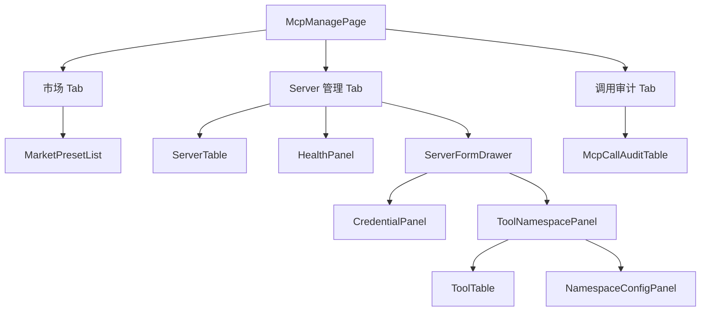

# AI 对话模块 - 前端实现设计（管理端-MCP 管理）

## 1. 文档概述

本文档描述 AI 对话模块**管理端 MCP 管理页**的 Web 端（React）前端实现方案，聚焦外部 MCP Server 的接入中心（市场 + 管理）页面编排与交互。页面结构与交互规范见 [需求规格.md](../需求规格.md) §3.3.3，接口契约见 [API接口.md](../API接口.md) §2.11。Android / Flutter / Taro 等多端参考本 Web 端的组件结构与状态管理方案按各自技术栈适配。

管理端 MCP 管理页承担"外部 MCP Server 的通用接入中心"：市场（内置预设一键接入）+ 管理（注册表/工具与命名空间/凭据/健康/调用审计），让任何符合 MCP 规范的服务可接入、可授权、可审计。

---

## 2. 组件树设计

| 组件 | 职责 |
|------|------|
| McpManagePage | MCP 管理页容器与路由入口，`el-tabs` 编排市场/Server 管理/调用审计三区 |
| MarketPresetList | 市场预设列表，一键接入（install 后转注册并拉取工具清单） |
| ServerTable | Server 表格：名称/传输协议/端点/鉴权方式/启用状态/健康状态/工具数 |
| ServerFormDrawer | Server 注册/编辑抽屉，内分 配置 / 工具与命名空间 / 凭据 三 Tab；创建模式仅「配置」可用 |
| CredentialPanel | 凭据配置（外部服务 API Key + 可选扩展字段，仅录入/更新不回显明文） |
| ToolNamespacePanel | 工具与命名空间面板：查看 Server 工具清单，工具分组为命名空间供 Agent 关联 |
| ToolTable | Server 工具清单（工具名/描述/参数 schema 概要） |
| NamespaceConfigPanel | 命名空间配置（覆盖式更新） |
| HealthPanel | 健康探测结果（连通性/延迟，异常显著标注） |
| McpCallAuditTable | 调用审计表（调用者/时间/Server/工具/结果/耗时，分页） |

**组件拆分取舍**：

- 三个 Section（McpMarketSection / McpServerSection / McpCallAuditSection）不单独建组件，由 `McpManagePage` 的 `el-tab-pane` 直接承载——分区仅为布局容器，无独立状态与复用场景
- `ProtocolConfigForm` 不单独建组件：仅含传输协议与端点两个字段，内联在 `ServerFormDrawer` 的「配置」Tab 内（含端点 URL 校验：非 stdio 必填且必须为 http/https）
- 启用开关不放在表单内，而是置于 `ServerFormDrawer` 页脚并标注"预览工具清单后再启用"，与「接入即发现」流程衔接

> 系统内部 MCP 能力网关（元工具）作为内置工具来源保留，不通过本页管理；命名空间预筛选机制见 [需求规格-能力扩展](../能力扩展/需求规格.md) §2.6.13 与 [后端实现-能力扩展](../能力扩展/后端实现.md) §5。

---

## 3. 状态管理

### 3.1 Store 模块划分

| Store 模块 | 职责 | 生命周期 |
|-----------|------|---------|
| 管理端 MCP Store（adminMcpStore） | 市场目录、Server 列表/表单/健康、工具与命名空间、调用审计 | 页面级，进入 MCP 管理页初始化，离开销毁 |

### 3.2 核心状态

| 状态 | 说明 |
|------|------|
| `marketPresets` | MCP 市场预设目录（含已接入状态） |
| `servers` | 已接入 Server 分页列表（含启用/健康状态/工具数） |
| `serverForm` | Server 抽屉状态（`{visible, mode, server, tab}`，`tab` 为 配置/工具与命名空间/凭据） |
| `credentialsConfigured` | Server 凭据"已配置"标记（`serverId → boolean`，见下方说明） |
| `tools` | 当前 Server 工具清单 |
| `namespaces` | 当前 Server 命名空间配置 |
| `health` | Server 健康探测结果（`serverId → {status, latencyMs}`） |
| `mcpCalls` | 外部 MCP 调用审计列表 |

> **凭据"已配置"状态**：后端 `McpServerResult` 不返回凭据相关字段（加密存储且不回显明文），前端无法在挂载时得知是否已配置。`credentialsConfigured` 为**前端会话级标记**，仅在凭据 PUT 成功后置位，刷新页面回到"未配置"。若需持久化，需后端在 Server VO 增加 `credential_configured` 类字段（牵动三端 + SDK，已记录为后端增强遗留）。

### 3.3 核心操作

| 操作 | 说明 |
|------|------|
| `switchTab` | 切换页面主 Tab，各区数据按需首次加载 |
| `openCreateDrawer` / `openServerDrawer` | 打开 Server 抽屉（指定 Tab），工具 Tab 打开时按需拉取工具与命名空间 |
| `switchDrawerTab` | 切换抽屉 Tab，切到工具 Tab 时按需拉取工具与命名空间 |
| `fetchMarketPresets` | 拉取 MCP 市场目录 |
| `installPreset` | 市场一键接入预设 Server（注册并拉取工具清单） |
| `fetchServers` | 拉取已接入 Server 列表 |
| `registerServer` | 注册/更新外部 MCP Server（注册后自动拉取工具清单） |
| `switchServerStatus` | 启停 Server（禁用后不参与命名空间预筛选） |
| `deleteServer` | 删除 Server（校验 Agent 关联，有则提示先解绑） |
| `configureCredentials` | 配置凭据（加密存储，仅录入/更新） |
| `fetchTools` | 拉取 Server 工具清单 |
| `configureNamespaces` | 配置命名空间（覆盖式更新） |
| `probeHealth` | 健康探测 |
| `fetchMcpCalls` | 拉取外部 MCP 调用审计 |

---

## 4. 路由设计

| 路由路径 | 页面组件 | 页面 name | 权限控制 |
|---------|---------|-----------|---------|
| `/admin/ai-mcp` | `views/ai-mcp/index.vue` | `AiMcp` | 管理员（`ai:mcp:manage`） |

> 路由守卫校验 `ai:mcp:manage`，无权限跳转 403；市场目录浏览需登录，接入操作需权限。页面内写操作（注册/更新/启停/删除/凭据/命名空间/健康探测）均以 `v-hasPerm="['ai:mcp:manage']"` 二次收敛。
>
> **组件 name 约定**：动态路由名由 component 路径推导（`ai-mcp/index` → `AiMcp`），SFC `defineOptions({ name })` 必须与之完全一致，否则 `<keep-alive :include>` 匹配不到该组件，页面缓存静默失效。

---

## 5. 数据流

### 5.1 数据获取策略

| 区块 | 数据来源 | 获取时机 | 缓存策略 |
|------|---------|---------|---------|
| 市场目录 | `GET /api/v1/ai/mcp/market` | 进入页面 + 切换市场 Tab | 当前结果缓存；接入后刷新已接入状态 |
| Server 列表 | `GET /api/v1/ai/mcp/servers` | 进入页面 + 筛选/分页变更 | 当前筛选结果缓存；注册/启停/删除后失效 |
| Server 表单 | 列表行 `McpServerVO` 直接回显 | 打开抽屉时 | 抽屉会话级缓存 |
| 工具清单 | `GET /api/v1/ai/mcp/servers/{id}/tools` | 注册成功/打开工具 Tab | 当前结果缓存；注册后拉取 |
| 命名空间 | `GET /api/v1/ai/mcp/servers/{id}/namespaces` | 打开命名空间面板 | 保存后刷新 |
| 健康探测 | `GET /api/v1/ai/mcp/servers/{id}/health` | 手动触发（列表行「健康探测」/ HealthPanel 重新探测） | 无（实时性优先）；结果回写列表行 `health` |
| 调用审计 | `GET /api/v1/ai/mcp/calls` | 切换审计 Tab + 筛选/分页变更 | 当前筛选结果缓存 |

### 5.2 更新策略

- **接入即发现**：注册/市场接入成功后自动拉取工具清单，ToolNamespacePanel 可预览工具定义再启用
- **健康联动**：HealthPanel 探测结果实时展示，异常 Server 在列表显著标注
- **凭据不回显**：CredentialPanel 仅支持录入/更新，已配置状态以"已配置"标识展示，不回显明文

---

## 6. 交互设计决策

| 交互点 | 技术选型 | 理由 |
|--------|---------|------|
| 市场-管理分区 | 市场（预设一键接入）+ 管理（注册表/工具/凭据/健康/审计）Tab 组织 | 先"发现可用 Server"，再"管理已接入 Server"，降低接入门槛 |
| 接入即预览再启用 | 注册后拉取工具清单，管理员预览工具定义后启用 | 避免"接入即生效"带来的未知能力暴露，接入可控（需求规格 §2.6.13） |
| 凭据安全录入 | CredentialPanel 仅录入/更新，不回显明文 | 外部服务密钥属高敏信息，防泄露（需求规格 §2.6.10） |
| 命名空间授权内联 | ToolNamespacePanel 工具分组 → 命名空间 → 与 Agent 配置关联 | 最小权限在工具源头显性配置，Agent 仅可访问关联命名空间 |
| 健康状态可见 | HealthPanel 实时探测 + 列表状态标注 | Server 可用性是外部能力接入的信任底座，异常可发现可处置 |

---

## 7. 公共组件使用

| 公共组件 | 配置要点 |
|---------|---------|
| 分页表格 | Server 列表、工具清单、调用审计表 |
| 弹窗/抽屉（Drawer） | Server 注册/编辑抽屉（配置/工具与命名空间/凭据三 Tab） |
| 标签页（Tabs） | 市场/Server 管理/调用审计切换；抽屉内三 Tab |
| 状态标签 | Server 启用/禁用、健康状态（在线/异常/未探测）、市场已接入状态、凭据已配置 |
| 表单校验组件 | 端点 URL 格式校验（非 stdio 必填且须 http/https）、名称必填、命名空间标识非空且不重复 |

**接口消费约定**：

- SDK 入口为 `AiMCPAPI`（dehaze-sdk-js 导出名，MCP 全大写），页面统一 `import { AiMCPAPI } from "dehaze-sdk-js"`
- 调用审计查询仅下发 `serverId` / `toolName` 与分页参数：后端 `McpCallQuery` 只认这两个筛选字段（SDK 类型中的 `startTime` / `endTime` 后端未实现，不下发）
- 删除 Server 不预检关联关系，由后端返回 `A0504`（存在关联数据）触发全局错误提示，前端在删除确认弹窗中提示"若已被 Agent 关联需先解绑"
- 市场目录 `GET /market` 后端实际也要求 `ai:mcp:manage`（与 [API接口.md](../API接口.md) §2.11 标注"-"不一致），前端按文档口径不挂权限校验，仅接入操作校验
