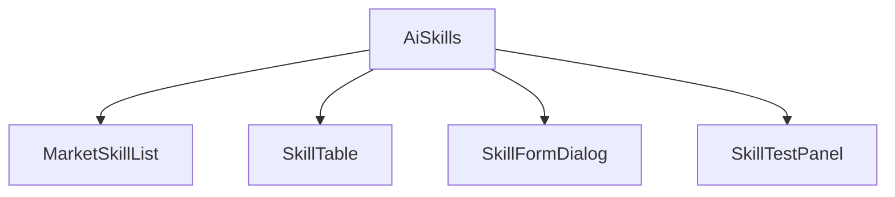

# AI 对话模块 - 前端实现设计（管理端-SKILL 管理）

## 1. 文档概述

本文档描述 AI 对话模块**管理端 SKILL 管理页**的 Web 端（React）前端实现方案，聚焦工作流指令包（Skill）的市场分发与管理页面编排与交互。页面结构与交互规范见 [需求规格.md](../需求规格.md) §3.3.4，接口契约见 [API接口.md](../API接口.md) §2.12。Android / Flutter / Taro 等多端参考本 Web 端的组件结构与状态管理方案按各自技术栈适配。

管理端 SKILL 管理页承担"工作流指令包的市场分发与管理"：市场（预设/共享 Skill 目录一键启用）+ 管理（创建/编辑/启停/删除/试运行），让平台沉淀的标准化流程可复用、可治理。

---

## 2. 组件树设计

| 组件 | 职责 |
|------|------|
| AiSkills | SKILL 管理页容器与路由入口，el-tabs 编排市场/管理两区，承载表单与试运行弹窗。组件名由路由组件路径推导（`ai-skills/index` → `AiSkills`），须与动态路由名一致，否则 keep-alive 缓存失效 |
| MarketSkillList | 市场 Skill 列表（名称/描述/适用场景/已关联 Agent 数），一键启用 |
| SkillTable | Skill 表格：名称/描述/适用场景/启用状态/被 Agent 关联数/步骤数 + 编辑/试运行/共享/删除 |
| SkillFormDialog | Skill 表单弹窗：Markdown 指令 + 可选脚本/模板，提交前校验指令长度与危险操作 |
| SkillTestPanel | Skill 试运行面板：输入测试数据 → 预览指令执行效果（不入库不推送） |

> 市场/管理两区以 `el-tabs` 的 `el-tab-pane` 直接承载，不再额外抽 Section 容器组件；指令编辑与脚本配置收敛进 SkillFormDialog（表单字段量小，拆分反而增加跨组件同步成本）。市场目录接口不返回指令全文，故市场区不做步骤预览；管理表步骤数由指令的 Markdown 有序行统计。

> Skill 的渐进式加载（会话启动仅加载名称描述，需要时加载完整指令）与执行机制见 [后端实现-能力扩展](../能力扩展/后端实现.md) §4；管理操作业务规则见 [需求规格-能力扩展](../能力扩展/需求规格.md) §2.6.11/§2.6.14。

---

## 3. 状态管理

### 3.1 Store 模块划分

| Store 模块 | 职责 | 生命周期 |
|-----------|------|---------|
| 管理端 SKILL Store（adminSkillStore） | 市场目录、Skill 列表/表单/试运行 | 页面级，进入 SKILL 管理页初始化，离开销毁 |

### 3.2 核心状态

| 状态 | 说明 |
|------|------|
| `marketSkills` | SKILL 市场目录（预设/共享，含启用状态与已关联 Agent 数） |
| `skills` | Skill 分页列表（含启用状态/被 Agent 关联数/步骤数） |
| `skillForm` | Skill 表单状态（`{skill, visible}`，含指令与脚本配置） |
| `testResult` | Skill 试运行结果（执行效果预览） |

### 3.3 核心操作

| 操作 | 说明 |
|------|------|
| `fetchMarketSkills` | 拉取 SKILL 市场目录 |
| `installMarketSkill` | 市场一键启用预设 Skill |
| `fetchSkills` | 拉取 Skill 列表（管理员全量含停用） |
| `saveSkill` | 创建/更新 Skill（指令内容校验：长度限制、危险操作拦截） |
| `switchSkillStatus` | 启停 Skill（禁用后 LLM 不再自动选择） |
| `deleteSkill` | 删除 Skill（软删除；校验 Agent 关联，有则提示先解绑） |
| `testSkill` | 试运行 Skill（输入测试数据，不入库不推送） |
| `shareSkillToMarket` | 将自建 Skill 共享至市场（需先启用） |

---

## 4. 路由设计

| 路由路径 | 页面 | 权限控制 |
|---------|------|---------|
| `/admin/ai-skills` | SKILL 管理页（市场 + 管理） | 管理员（`ai:skill:manage`） |

> 路由守卫校验 `ai:skill:manage`，无权限跳转 403；市场目录浏览需登录，启停/共享需权限。

---

## 5. 数据流

### 5.1 数据获取策略

| 区块 | 数据来源 | 获取时机 | 缓存策略 |
|------|---------|---------|---------|
| 市场目录 | `GET /api/v1/ai/skills/market` | 进入页面 + 切换市场 Tab | 当前结果缓存；启用/共享后刷新 |
| Skill 列表 | `GET /api/v1/ai/skills`（管理员全量） | 进入页面 + 筛选/分页变更 | 当前筛选结果缓存；创建/启停/删除后失效 |
| Skill 表单 | `GET /api/v1/ai/skills/{id}`（编辑回显） | 打开表单时 | 弹窗会话级缓存 |
| 试运行 | `POST /api/v1/ai/skills/{id}/test` | 用户触发 | 无 |

### 5.2 更新策略

- **市场-管理联动**：市场启用/共享后刷新两端列表，已关联 Agent 数实时展示
- **删除解绑校验**：删除 Skill 时校验是否被 Agent 关联，有则提示先解绑（前端引导 + 后端强校验）
- **试运行不入库**：SkillTestPanel 试运行结果仅预览，不写入数据、不推送

---

## 6. 交互设计决策

| 交互点 | 技术选型 | 理由 |
|--------|---------|------|
| 市场-管理分区 | 市场（预设/共享目录一键启用）+ 管理（CRUD/启停/试运行）Tab 组织 | 先"发现可用 Skill"，再"管理平台 Skill"，复用与治理分层 |
| 创建即试用 | SkillFormDialog 保存后引导进入 SkillTestPanel 试运行 | 验证指令效果后再启用，避免无效 Skill 上架（需求规格 §2.6.14） |
| 指令校验前置 | SkillInstructionEditor 提交前校验长度与危险操作 | 指令内容合规在入口拦截，降低运行时风险 |
| 启停即消费 | SkillTable 状态开关直接决定用户端会话可用能力 | 配置结果即消费结果，状态可见防"配了不可用" |
| 渐进式加载透明 | 管理端标注 Skill 加载方式（启动仅名称描述） | 让管理员理解 Skill 不挤占上下文，避免误解为"未生效" |

---

## 7. 公共组件使用

| 公共组件 | 配置要点 |
|---------|---------|
| 分页表格 | Skill 列表、市场目录 |
| 弹窗（Dialog） | Skill 表单、删除解绑确认 |
| 标签页（Tabs） | 市场/管理切换 |
| 状态标签 | Skill 启用/禁用、市场已启用状态 |
| 多行文本框 | Skill 指令编辑（等宽字体 textarea，含指令长度与危险操作校验提示，规则与后端 `DANGEROUS_PATTERN`/100KB 上限一致） |
| 折叠面板 | Skill 步骤预览、试运行结果展示 |
