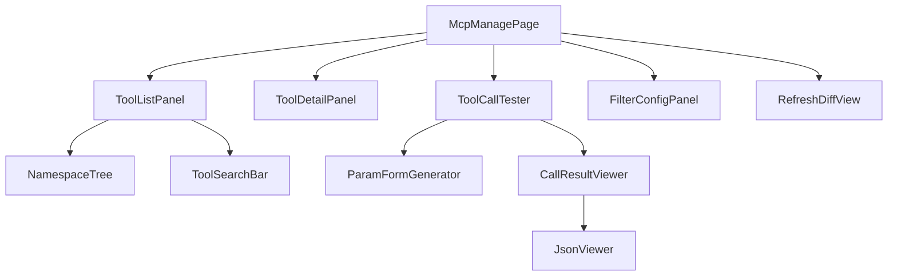

# MCP 能力网关模块 - 前端实现设计

## 1. 文档概述

本文档描述 MCP 能力网关模块的 Web 管理端（React）前端实现方案。MCP 能力网关本身为后端 JSON-RPC 网关，协议交互（`tools/list`、`tools/call` 等）由 AI 对话模块的 MCP 客户端完成，非本前端职责；本前端聚焦后台管理（F-M07-008）：工具注册表查看、过滤规则在线配置、刷新 diff 展示、工具调用测试。功能需求见 [需求规格.md](./需求规格.md) §2.8，管理接口见 [API接口.md](./API接口.md) §2.2。

---

## 2. 组件树设计

| 组件 | 职责 |
|------|------|
| McpManagePage | 管理页面容器，路由入口，编排子组件 |
| ToolListPanel | 工具列表展示，按命名空间（OpenAPI tags）分组树形展示 tool/resource/prompt，默认折叠为摘要（name + description + tool_count） |
| NamespaceTree | 命名空间分组树，展开查看组内工具 |
| ToolSearchBar | 按自然语言关键字搜索工具（对应 `tools/search`），返回 top-5 匹配工具完整定义 |
| ToolDetailPanel | 工具详情：name / description / inputSchema / 对应后端 API 路径 / 命名空间归属 |
| ToolCallTester | 工具调用测试，经 `/mcp` 端点 `tools/call`（JSON-RPC 2.0）真实调用，验证工具可达性与参数转换 |
| ParamFormGenerator | 基于 inputSchema（JSON Schema）动态生成参数表单 |
| CallResultViewer | 调用结果展示，成功展示 JSON、业务错误展示 isError 描述、异步展示 task_id |
| FilterConfigPanel | 过滤规则在线配置：路径白名单、标签过滤、显式排除列表；保存后触发即时刷新 |
| RefreshDiffView | 手动刷新后展示新增/删除/变更 API 的 before/after 对比 |

### 2.2 MCP 基元分类管理

| 基元 | 来源 | 管理端展示 |
|------|------|-----------|
| tool | POST/PUT 有副作用的 API | 工具列表 + 调用测试 |
| resource | GET 列表/详情查询（无副作用） | resource URI 列表，可读取内容预览 |
| prompt | 管理员维护的固定文本模板 | 模板列表，可查看完整内容与参数填充 |

> 一个 API 只归属一种基元，不做双重暴露；GET 查询类仅暴露为 resource，不参与命名空间分组压缩。

---

## 3. 状态管理

### 3.1 Store 模块划分

| Store 模块 | 职责 |
|-----------|------|
| toolRegistryStore | 工具注册表、命名空间分组、过滤规则配置 |
| toolCallStore | 调用测试状态：当前测试工具、参数、结果、加载态 |

### 3.2 核心状态

| 状态 | 说明 |
|------|------|
| `tools` | 已注册 tool/resource/prompt 列表（含 name、description、对应 API 路径、命名空间） |
| `namespaces` | 按 OpenAPI tags 聚合的命名空间分组摘要 |
| `filterConfig` | 过滤规则配置（路径白名单、标签过滤、显式排除列表） |
| `selectedTool` | 当前选中查看/测试的工具 |
| `callParams` | 调用测试参数（由 inputSchema 动态生成） |
| `callResult` | 调用结果（成功 JSON / 业务错误 / 异步 task_id） |
| `callLoading` | 调用中状态 |
| `refreshDiff` | 最近一次刷新的 diff（新增/删除/变更） |

### 3.3 核心操作

| 操作 | 说明 |
|------|------|
| `fetchTools` | 拉取已注册工具列表（REST `/admin/mcp/tools`），前端按 tags 聚合为命名空间树 |
| `searchTools` | 按关键字搜索工具（`tools/search`） |
| `refreshRegistry` | 手动刷新注册表，返回 diff（`POST /admin/mcp/refresh`） |
| `saveFilterConfig` | 保存过滤规则，保存后触发即时刷新 |
| `testCallTool` | 调用工具测试（`tools/call`，JSON-RPC 2.0） |

---

## 4. 路由设计

| 路由路径 | 页面 | 权限控制 | 守卫说明 |
|---------|------|---------|---------|
| `/admin/mcp` | McpManagePage | 管理员（`mcp:tool:manage`） | 全局导航守卫校验管理员角色，非管理员重定向并提示无权限 |

> MCP 协议方法（`initialize` / `tools/list` / `tools/call` 等）仅需 Bearer Token 认证，由 AI 对话模块 MCP 客户端调用，不走本管理端路由。

---

## 5. 数据流

### 5.1 数据获取策略

| 场景 | 策略 |
|------|------|
| 工具列表 | 进入页面拉取全量已注册工具，前端按 tags 聚合为命名空间树 |
| 过滤规则 | 进入配置面板时拉取当前配置 |
| 工具搜索 | 按需调用 `tools/search`，返回匹配工具完整定义 |

### 5.2 缓存策略

| 对象 | 策略 |
|------|------|
| 工具列表 | 内存缓存，刷新后失效重拉 |
| 过滤规则 | 配置面板内缓存，保存后即时刷新注册表 |

### 5.3 更新策略

| 场景 | 策略 |
|------|------|
| 手动刷新 | 调用刷新接口返回 diff，前端展示新增/删除/变更；无变更时 diff 为空 |
| 过滤规则变更 | 保存后后端即时重新读取 OpenAPI 并更新注册表，前端重拉工具列表 |

> API 变更的 `notifications/tools/list_changed` 推送面向 AI 对话模块的 MCP 客户端，非本管理端关注范围。

### 5.4 工具调用测试流程

| 调用类型 | 判断依据 | 前端处理 |
|---------|---------|---------|
| 同步调用 | 后端直接返回结果 | JSON 查看器展示结果 |
| 异步调用 | 后端返回 task_id | 展示 task_id（本测试端仅透传展示，不维护会话映射） |
| 业务错误 | `content + isError: true` | 展示错误类型 + 描述 + LLM 可做的操作 |
| 协议错误 | JSON-RPC error code | 展示错误码与说明（如 `-32002` 工具不存在、`-32003` VIP 不足、`-32004` 限流） |

---

## 6. 交互设计决策

| 交互点 | 技术选型 | 理由 |
|--------|---------|------|
| 工具调用测试 | 经 `/mcp` 端点 `tools/call`（JSON-RPC 2.0） | 真实模拟 LLM 调用路径，验证工具可达性与参数转换，比直接调后端 REST 更能暴露网关层问题 |
| 参数表单动态生成 | 基于 tool inputSchema（JSON Schema）动态渲染 | 工具由 OpenAPI 自动注册，参数 schema 动态变化，静态表单无法覆盖；按类型映射控件（string->输入框、integer->数字输入、boolean->开关、enum->下拉） |
| 调用结果展示 | 成功->JSON 查看器；业务错误->isError 标识；异步->task_id | 区分工具调用成功派发与后端业务错误（HTTP 400/403 等走 content+isError，非 JSON-RPC error），与网关响应转换策略一致 |
| 命名空间分组展示 | 按 OpenAPI tags 树形分组，默认折叠摘要 | 上百工具全量展开认知负担过重；摘要（name + description + tool_count）降低认知成本，与三层上下文压缩策略一致 |
| VIP 可见性预览 | 管理端可切换用户 VIP 视角查看可见工具范围 | 验证 `tools/list` 按 VIP 等级过滤效果，确认工具可见性配置正确 |
| 刷新 diff | before/after 对比展示 | 确认自动发现/过滤规则变更的影响范围，避免误删工具 |

---

## 7. 公共组件使用

| 公共组件 | 配置要点 |
|---------|---------|
| JSON 查看器 | 调用结果与 inputSchema 展示，支持折叠/展开/语法高亮 |
| 参数表单生成器 | JSON Schema -> 表单控件映射；必填校验；enum 渲染下拉；支持嵌套对象与数组 |
| 代码编辑器 | 过滤规则配置（路径白名单/排除列表）编辑，支持语法校验 |
| Diff 对比组件 | 刷新结果 before/after 并排对比，高亮新增/删除/变更行 |
| 树形组件 | 命名空间分组树，支持折叠/展开/搜索过滤 |
