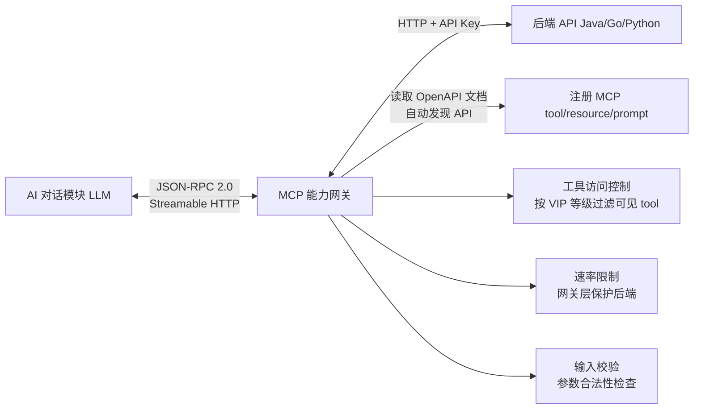

# MCP 能力网关模块需求规格

## 1. 模块概述

### 1.1 模块定位

MCP（Model Context Protocol）能力网关是 AI 工作平台的能力层核心，遵循 [MCP 2025 规范](https://modelcontextprotocol.io)，采用 Streamable HTTP 传输协议和 JSON-RPC 2.0 消息格式。网关自动发现后端 API（通过 OpenAPI 文档），将其转换为 MCP tool/resource/prompt 暴露给 AI 对话模块调用。新增 API 后无需手动配置，网关自行接入。

### 1.2 核心价值

| 价值维度 | 具体内容 |
|---------|---------|
| **自动发现** | 读取后端 OpenAPI 文档，自动将 API 接口注册为 MCP tool/resource/prompt |
| **零配置接入** | 后端新增 API 后网关自动发现并暴露，无需修改 MCP 层代码或配置 |
| **统一转换** | 将不同风格的 API 统一转换为标准 MCP data 格式（tool 参数 schema、resource URI、prompt 模板） |
| **认证复用** | 复用现有 API Key 认证（`dhak_` 前缀），MCP 层透传用户身份，不另建认证体系 |
| **能力扩展** | 除 tools 外，补充 resources（数据暴露）和 prompts（预定义提示词模板），覆盖 LLM 上下文增强的全部协议基元 |
| **上下文压缩** | 自动将工具按 OpenAPI tags 分组为命名空间，LLM 仅看到命名空间摘要（~20 tokens/组）而非全量工具定义（~500 tokens/个），减少 93% 上下文开销 |

### 1.3 工作原理



1. 网关启动时读取各后端 OpenAPI 文档，分类注册为 tool / resource / prompt
2. LLM 通过 `tools/call` 调用 tool 时，网关校验参数后用用户 API Key 向后端发起请求
3. 后端返回结果，网关转换为 JSON-RPC 2.0 响应格式返回
4. 网关层统一处理速率限制、VIP 工具可见性过滤、参数合法性校验

> Java/Go/Python 三端后端 API 完全相同，网关只需读取 Java 端（业务主端）的 OpenAPI 文档即可覆盖全部 API。

### 1.4 MCP 规范对齐

网关完全遵循 MCP 2025 规范的客户端/服务器模型：

| 规范要求 | 网关实现 |
|---------|---------|
| Streamable HTTP 传输 | `POST /mcp` 单一端点，支持 JSON 响应和 SSE 流式 |
| JSON-RPC 2.0 消息格式 | 请求/响应/错误均使用 `jsonrpc:"2.0"` 包裹 |
| `initialize` 握手 | 启动时协商能力（`tools`、`resources`、`prompts`） |
| `tools/list` / `tools/call` | 工具发现和调用 |
| `resources/list` / `resources/read` | 数据资源暴露和读取 |
| `prompts/list` / `prompts/get` | 预定义提示词模板 |
| `notifications/tools/list_changed` | API 变更时主动通知 LLM 工具列表已更新 |
| Authorization 框架 | API Key Bearer Token（`dhak_` 前缀），遵循 MCP 资源服务器认证模型 |

### 1.5 依赖模块

| 模块 | 依赖说明 |
|------|---------|
| **认证管理** | 复用 API Key 认证（`dhak_` 前缀），网关用用户的 API Key 向后端发起请求 |
| **AI 对话模块** | 调用方，通过标准 MCP 客户端连接网关 |
| **会员管理** | 获取用户 VIP 等级，控制 tool 可见性 |

---

## 2. 功能需求

### 2.1 协议服务 (F-M07-001)

#### 2.1.1 传输层

采用 Streamable HTTP（MCP 2025 推荐的远程传输），单一端点 `POST /mcp`。

#### 2.1.2 标准方法

| 方法 | 名称 | 说明 |
|------|------|------|
| `initialize` | 能力协商 | 服务端返回支持的 capabilities（`tools`/`resources`/`prompts`） |
| `tools/list` | 工具列表 | 返回当前用户可见的全部 MCP tool list（默认仅返回命名空间摘要，展开时返回完整定义） |
| `tools/call` | 工具调用 | 调用指定 tool，传入参数，执行后端 API 并返回结果 |
| `resources/list` | 资源列表 | 返回所有可用 resource URI |
| `resources/read` | 读取资源 | 按 URI 读取 resource 内容（如算法文档内容、系统配置） |
| `prompts/list` | 提示词模板列表 | 返回所有预定义 prompt 模板 |
| `prompts/get` | 获取提示词模板 | 获取指定 prompt 模板的完整内容（含参数填充） |
| `notifications/*` | 变更通知 | 由网关主动推送（如 `tools/list_changed`） |

#### 2.1.3 网关扩展方法

| 方法 | 名称 | 说明 |
|------|------|------|
| `tools/search` | 工具搜索 | 网关扩展方法（非 MCP 标准方法）。LLM 按自然语言关键字搜索匹配的工具，返回匹配工具的完整定义（按需加载，避免全量注入上下文） |

### 2.2 API 自动发现与工具注册 (F-M07-002)

#### 2.2.1 API 发现机制

| 机制 | 说明 |
|------|------|
| **启动时全量发现** | 网关启动时读取 OpenAPI 文档，全量解析并注册 |
| **定时增量发现** | 每 5 分钟重新读取 OpenAPI 文档，diff 新增/删除/变更的 API，自动更新 tool 列表 |
| **手动刷新** | 管理端手动触发刷新（API 发布后立即生效） |
| **变更通知** | API 列表变化后主动推送 `notifications/tools/list_changed` |

#### 2.2.2 API 过滤

并非所有 API 都适合暴露给 LLM。网关通过多级过滤规则控制：

| 过滤规则 | 说明 |
|---------|------|
| **路径前缀白名单** | 只注册业务 API（如 `/api/v1/`），排除管理端（`/api/admin/`） |
| **认证方式过滤** | 只注册支持 API Key 认证的 API |
| **标签过滤** | 按 OpenAPI `tags` 过滤（如排除 `internal` 内部接口） |
| **参数类型过滤** | 排除参数含 `binary`/`file` 类型的 API（二进制上传不适合 LLM 调用） |
| **HTTP 方法过滤** | 排除 `DELETE` 等危险操作（除非白名单） |
| **显式排除** | 配置文件维护排除列表 |

#### 2.2.3 API 分类：tool / resource / prompt

每种 API 根据语义自动分类为 MCP 基元，**一个 API 只归属一种基元，不做双重暴露**：

| API 特征 | MCP 基元 | 示例 |
|---------|---------|------|
| `GET` 列表/详情查询（无副作用） | `resource`（仅） | `GET /algorithms` → `algo://list`；`GET /algorithms/{id}` → `algo://{id}` |
| `POST`/`PUT` + 有副作用（创建/更新/执行） | `tool` | `POST /predict/dehaze` |
| 管理员维护的固定文本模板 | `prompt` | 评估报告模板、算法对比模板 |

> GET 列表/详情查询只暴露为 resource，不同时注册为 tool。resource 通过 `resources/list` + `resources/read` 访问，其轻量描述（URI + name + description）不显著占用上下文，无需命名空间分组压缩。

#### 2.2.4 Tool 生成规则

| OpenAPI 字段 | MCP tool 字段 | 转换说明 |
|-------------|--------------|---------|
| `paths.{path}.{method}` | `name` | 语义化命名（如 `predict_dehaze`） |
| `summary` + `description` | `description` | 自然语言描述供 LLM 理解用途 |
| `parameters`（query/path） | `inputSchema` | JSON Schema，含类型、必填、默认值 |
| `requestBody` | `inputSchema.properties` | 展平到 input schema 中 |
| `responses.200.content` | 用于工具描述增强 | 返回值结构帮助 LLM 理解输出 |

#### 2.2.5 Resource 生成规则

| API 端点 | Resource URI | 说明 |
|---------|-------------|------|
| `GET /algorithms` | `algo://list` | 算法列表 |
| `GET /algorithms/{id}` | `algo://{id}` | 单个算法详情 |
| `GET /algorithms/{id}/docs` | `algo://{id}/docs` | 算法文档 |
| Knowledge base documents | `kb://{kbId}/doc/{docId}` | 知识库文档内容 |

#### 2.2.6 描述增强

| 增强方式 | 说明 |
|---------|------|
| **标签注入** | 从 OpenAPI `tags` 生成 tool 分类标签，帮助 LLM 按能力域理解 |
| **示例注入** | 从 OpenAPI `examples` 提取调用示例，注入 tool 描述 |
| **参数描述完善** | 利用参数的 `description` 完整说明，含取值范围和单位 |
| **覆盖配置** | 配置文件可为指定 API 覆盖自动生成的描述 |

### 2.3 认证与访问控制 (F-M07-003)

#### 2.3.1 认证流程

AI 对话模块的 MCP 客户端携带用户 API Key 作为 Bearer Token 发起请求，网关 AuthMiddleware 直接校验解析：

```
LLM 调用 tool（通过 AI 对话模块的 MCP 客户端）
    ↓
MCP 请求携带 API Key（Authorization: Bearer dhak_xxx）
    ↓
网关 AuthMiddleware 解析 Bearer Token → 查询 sys_api_key 校验有效性（revoked_at 为空）→ 注入 userId 到请求上下文
    ↓
向后端 API 发起 HTTP 请求，Authorization: Bearer dhak_xxx（透传同一 Token）
    ↓
后端识别 dhak_ 前缀 → 校验 → 鉴权 + 配额扣减
    ↓
返回结果
```

> 网关不校验后端权限和配额，由底层 API 统一负责。网关的认证层负责：(1) 验证 API Key 格式和存在性；(2) 确保未吊销（`revoked_at` 为空）。

#### 2.3.2 工具级访问控制

按用户 VIP 等级过滤可见 tool：

| 控制维度 | 说明 |
|---------|------|
| **VIP 工具可见性** | `tools/list` 返回结果按用户 VIP 等级过滤——VIP 用户能看到更多 tool |
| **VIP 等级配置** | 在 `sys_member_benefit` 中定义各等级可访问的 API 范围（按 OpenAPI tags 或 URL prefix） |

### 2.4 请求转发与响应转换 (F-M07-004)

#### 2.4.1 请求转换

| LLM 参数位置 | HTTP 请求位置 |
|-------------|-------------|
| `inputSchema.properties` 中标记 `in: query` | URL query parameter |
| `inputSchema.properties` 中标记 `in: path` | 替换 URL path `{placeholder}` |
| `inputSchema.properties` 中标记 `in: body` | JSON request body |

#### 2.4.2 响应转换

| 后端响应 | MCP 响应（JSON-RPC 2.0 result） |
|---------|------|
| HTTP 200 + JSON | 提取 JSON body |
| HTTP 200 + 大体积响应（如图片处理结果） | 返回引用（URL + 摘要元数据），与 AI 对话 artifacts 引用化策略一致 |
| HTTP 400/401/403/404/429 | `content: [{type:"text", text:"错误类型+描述+LLM 可以做什么"}]` + `isError: true`（工具调用成功派发，后端返回业务错误） |
| HTTP 500/超时 | JSON-RPC error(-32005, "Backend unavailable")，GET 方法可重试 1 次 |

#### 2.4.3 同步调用与异步调用

| 调用类型 | 判断依据 | 行为 |
|---------|---------|------|
| 同步调用 | 后端 API 直接返回结果 | 立即返回 JSON-RPC 2.0 result |
| 异步调用 | 后端请求返回 task_id | 网关透传 task_id，AI 对话模块持久化 checkpoint（task_id → 会话映射）后中断推理，等待回调恢复 |

#### 2.4.4 异步回调机制

网关无状态，不维护 task_id → 会话映射。异步调用的回调流程：

```
1. 后端 API 返回 task_id → 网关透传给 AI 对话模块
2. AI 对话模块持久化 checkpoint（task_id → 会话 ID 映射），Agent 进入 async_wait 中断
3. 任务完成后，任务管理模块/算法服务通过回调端点通知 AI 对话模块（携带 task_id + 结果）
4. AI 对话模块根据 task_id 恢复对应会话，将结果注入 LLM 上下文，继续推理
```

> task_id → 会话映射由 AI 对话模块维护，网关仅负责透传 task_id，不参与回调恢复。

### 2.5 安全与工程化 (F-M07-005)

| 能力 | 说明 |
|------|------|
| **输入校验** | 网关层根据 tool input schema 对 LLM 传入的参数做 JSON Schema 校验，不合法参数拒绝调用（不消耗后端资源） |
| **速率限制** | 按用户 + tool 维度配置速率限制（如每分钟 N 次工具调用），防止 LLM 循环调用耗尽后端资源 |
| **超时与重试** | HTTP 调用默认 30 秒超时，GET 请求可重试 1 次（幂等操作） |
| **查询结果缓存** | resource 读取结果和幂等 tool 调用结果缓存 5 分钟，缓存 key 含 userId 隔离用户数据（`mcp:cache:{userId}:{toolName}:{argsHash}`） |
| **高可用** | 无状态多实例部署，`tools/list` 内存缓存定期同步，单实例故障不丢数据 |

### 2.6 工具分组与上下文压缩 (F-M07-007)

#### 2.6.1 问题

系统 API 多达上百个，每个 tool 的 `name + description + inputSchema` 平均约 500 tokens。全量注入 LLM 上下文会导致：

- 100 个工具 × 500 tokens = **50,000 tokens** 上下文占用
- 对于 128K 窗口模型占 40%，对于 16K 模型直接撑爆
- 每次对话都传输全量工具定义，token 成本和延迟线性增长

#### 2.6.2 三层架构

参考 OpenAI Agents SDK `ToolSearchTool`（按需搜索加载）、Anthropic MCP 代码执行模式（文件树探索 + `search_tools`，减少 98.7% 上下文开销）、Claude Skills 渐进式披露，设计三层上下文压缩方案：

```
Layer 1: 命名空间摘要（默认可见，~80 tokens/4 组）
  ├─ 工具按 OpenAPI tags 自动分组为命名空间
  ├─ 每个命名空间仅含 name + description + tool_count
  └─ 效果：4 个分组摘要 = 80 tokens（vs 50,000 tokens 全量）

Layer 2: 意图匹配预过滤（AI 对话模块 before_model 钩子）
  ├─ 用户发送消息后，根据意图提取关键词
  ├─ 仅加载匹配的 1-2 个命名空间的工具完整定义
  └─ 效果：1-2 组 × 5-8 个工具 × 500 tokens = 2,500-8,000 tokens

Layer 3: tools/search 按需发现（LLM 主动搜索）
  ├─ tools/search 扩展方法始终可用
  ├─ LLM 用自然语言搜索："找评估图像质量的工具"
  └─ 返回匹配的 top-5 工具完整定义（~2,500 tokens），跨命名空间
```

**效果对比**：

| 场景 | 全量注入 | 三层架构 | 节省 |
|------|---------|---------|------|
| 简单查询（"PSNR是什么"） | 50,000 | 80（摘要） | 99.8% |
| 单领域任务（"帮这张图去雾"） | 50,000 | 80 + 4,000 = 4,080 | 91.8% |
| 跨领域任务（"去雾并评估"） | 50,000 | 80 + 8,000 = 8,080 | 83.8% |
| 罕见需求（需 tools/search） | 50,000 | 80 + 2,500 + 4,000 = 6,580 | 86.8% |

#### 2.6.3 分组策略

命名空间分组仅针对 tool（POST/PUT 类有副作用操作）。GET 查询类 API 暴露为 resource，不参与工具命名空间分组。

| 命名空间 | OpenAPI tags | 典型工具数 | 代表工具 |
|---------|-------------|-----------|---------|
| `image_processing` | `predict` / `dehaze` | 5-8 | `predict_dehaze`、`predict_enhance`、`predict_super_resolution` |
| `evaluation` | `evaluation` / `metric` | 3-5 | `evaluate_image`、`compare_algorithms` |
| `algorithm` | `algorithm` / `algorithm-version` | 2-3 | `recommend_algorithm`（list/detail 查询为 resource） |
| `knowledge` | `knowledge-base` | 2-3 | `search_knowledge`（get_document 为 resource） |

> 工具分组由网关自动完成（按 OpenAPI tags 聚合），无需手动配置。分组变化时通过 `notifications/tools/list_changed` 通知 AI 对话模块。GET 查询类 resource 通过 `resources/list` 返回全部 URI，其轻量描述不显著占用上下文。

### 2.7 调用可观测性 (F-M07-006)

网关复用现有日志架构，不单独建表：

- **trace_id 透传**：网关调用后端 API 时透传 `trace_id`，串联完整调用链路
- **审计日志**：业务操作类 API 走后端时，由后端的审计日志记录，无需网关层重复记录
- **应用日志**：后端的 NDJSON 日志记录调用详情，通过 Filebeat → ELK 检索

### 2.8 后台管理 (F-M07-008)

| 功能项 | 说明 |
|--------|------|
| **API/Tool 列表查看** | 管理端查看当前已注册的全部 tool/resource/prompt 列表，含 name、description、对应后端 API 路径、命名空间归属 |
| **过滤规则在线配置** | 管理端在线编辑路径白名单、标签过滤、显式排除列表等过滤规则，保存后触发即时刷新（无需重启网关） |
| **刷新结果 diff 展示** | 手动刷新或定时同步后，展示新增/删除/变更的 API diff（before/after 对比），便于确认变更影响 |
| **手动刷新** | 管理端一键触发 `POST /admin/mcp/refresh`，立即重新读取 OpenAPI 并更新注册表，返回 diff 结果 |

---

## 3. 相关文档

| 文档类型 | 文档路径 |
|---------|---------|
| **API 接口** | [API接口](./API接口.md) |
| **后端实现-架构与公共** | [后端实现-架构与公共](./后端实现-架构与公共.md) |
| **后端实现-工具注册** | [后端实现-工具注册](./后端实现-工具注册.md) |
| **后端实现-请求转发** | [后端实现-请求转发](./后端实现-请求转发.md) |
| **AI 对话模块** | [AI对话/需求规格](../AI对话/需求规格.md) |
| **数据库设计** | [03-数据库设计.md](../../02-系统架构/03-数据库设计.md) |
