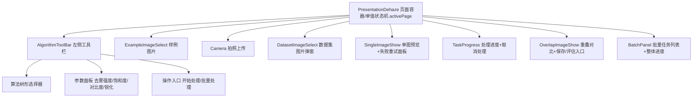

# 去雾处理模块 - 前端实现设计

## 1. 文档概述

本文档描述去雾处理模块的前端实现方案（dehaze-front-vue），聚焦组件架构、页面状态机、状态管理、路由与关键交互决策（进度展示、取消/重试、批量处理、结果保存）。功能需求与接口契约详见 [需求规格.md](./需求规格.md) 与 [API接口.md](./API接口.md)。

---

## 2. 组件树设计

### 2.1 组件树

### 2.2 组件职责

| 组件 | 职责 |
|------|------|
| PresentationDehaze | 页面容器（views/presentation/dehaze/index.vue），承载单值状态机与子组件编排 |
| AlgorithmToolBar | 左侧工具栏，聚合算法选择（树形选择器）、参数面板与操作入口 |
| ExampleImageSelect | 样例图片选择（NH-HAZE-2023 数据集 haze/clean 配对） |
| Camera | 拍照上传 |
| DatasetImageSelect | 数据集图片选择（弹窗） |
| SingleImageShow | 单图展示（上传后原图预览，含失败重试面板叠加） |
| OverlapImageShow | 重叠对比展示（原图+结果图，复用效果对比模块组件） |
| TaskProgress | 处理进度展示（步骤指示器+百分比）与取消处理入口 |
| BatchPanel | 批量任务列表（表格+整体进度+单张操作） |

> 参数面板提供去雾强度/色彩饱和度/对比度/锐化四项配置（默认值 50/50/50/30），随预测请求以 JSON 字符串提交。

### 2.3 页面状态机

页面通过**单值状态机**（`activePage`）管理交互，替代多个布尔标志：

| 状态 | 触发场景 | 说明 |
|------|---------|------|
| `example` | 默认/重置后 | 展示样例图片 |
| `camera` | 点击拍照 | 拍照上传 |
| `singleImage` | 上传/选择图片后 | 单图预览（失败时展示重试面板，见 §2.2） |
| `loading` | 点击开始处理 | 处理进度展示 + 取消处理入口 |
| `overlap` | 处理完成 | 重叠对比展示 + 保存/评估入口 |
| `batch` | 批量任务列表有数据 | 批量处理面板（任务列表、整体进度、单张操作） |

各状态对应独立页面视图，进度展示/重试/批量/结果操作分别归属 `loading`/`singleImage`/`batch`/`overlap` 状态，不作为同一容器内的内嵌面板混用。

---

## 3. 状态管理

### 3.1 imageShow Store（跨模块共享）

| 状态字段 | 说明 |
|---------|------|
| imageInfo.images.urls | 图片列表（HAZE/PRED/CLEAN，含标签与颜色） |
| imageInfo.brightness/contrast/saturate | 滤镜参数（对比页展示） |
| modelId | 当前选中算法 ID |
| magnifierInfo | 放大镜配置（形状/倍数/大小） |

### 3.2 页面局部状态

去雾参数（dehazeStrength/colorSaturation/contrast/sharpen）由 `AlgorithmToolBar` 通过 `onParamChange` emit 传递给 `PresentationDehaze` 本地管理，跳转评估页时经路由 query 传入，不再入 store。页面局部状态（activePage、处理进度、批量任务、配额）在组件内管理，不单独抽取预测 Store。

---

## 4. 路由设计

| 路由路径 | 页面 | 说明 |
|---------|------|------|
| `/presentation/dehaze` | PresentationDehaze | 图像去雾处理工作台（keepAlive 缓存） |

- **受保护路由**：登录用户路由，导航守卫校验登录态与处理配额（配额校验也可在提交处理时由后端执行，错误码 `A0515`）。
- **keepAlive 缓存 + query 参数**：图像输入页通过 `route.query.imageUrl` 传入图片 URL，页面 keepAlive 缓存，`onActivated` 时重新检查 query 参数并加载后清空 query，避免刷新重复触发。
- **跨页跳转**：处理完成 -> 跳转效果评估页 `/evaluation/index`（携带 logId 与去雾参数 `route.query.params`）；"评估结果"入口同样跳转 `/evaluation/index`。

---

## 5. 数据流

### 5.1 单张处理流程

| 阶段 | 前端响应 |
|------|---------|
| 提交 | 配额检查 -> 确认对话框 -> 提交预测任务 -> `activePage=loading` |
| 轮询 | 轮询任务状态接口展示进度 |
| 完成 | 置原图+结果图 -> `activePage=overlap` |
| 失败 | 展示重试面板 -> `activePage=singleImage` |

### 5.2 批量处理流程

| 阶段 | 前端响应 |
|------|---------|
| 入口 | 弹窗多选图片 -> 确认添加至任务列表（每张 pending） |
| 执行 | 前端串行逐张处理（上传原图 -> 提交预测并轮询结果 -> 标记成功/失败），单张失败不影响后续 |
| 进度 | 整体进度为各任务进度平均值，列表展示名称/状态/进度/错误信息 |
| 完成 | 可查看单张结果、重试失败任务、移除单张、清空列表 |

> 批量执行策略与上限由 [需求规格 §2.2.3/§2.2.5](./需求规格.md) 定义；前端不强制限制批量数量，由后端接口校验（错误码 `A0500`）。

### 5.3 模块间数据交互

| 交互方向 | 数据 | 说明 |
|---------|------|------|
| 图像输入 -> 去雾处理 | imageUrl | 上传/拍照/样例/历史记录选择图片后跳转 |
| 去雾处理 -> 效果评估 | modelId + 图片 + 去雾参数 | "评估结果"跳转 `/evaluation/index`，图片走 store，参数经 `route.query.params` 传入 |
| 去雾处理 -> 文件存储 | 原图/结果图/清晰图 | 上传与保存走文件存储接口 |

---

## 6. 交互设计决策

### 6.1 处理确认与配额检查

点击"开始处理"后先调用配额查询接口检查剩余次数，`remaining === 0` 时弹窗引导升级（错误码 `A0515`），再弹确认对话框展示图片文件名、算法名称、参数值，用户确认后提交预测任务。确认对话框不展示预估耗时（计算密集型任务无法预估）。

### 6.2 进度展示与轮询

| 交互点 | 设计决策 |
|--------|---------|
| 进度来源 | 轮询任务状态接口（2s 间隔）获取真实任务状态，详见 [API接口.md](./API接口.md) |
| 展示形式 | 步骤指示器高亮当前阶段 + 进度百分比，阶段定义与命名见 [需求规格 §2.1.5](./需求规格.md) |
| 完成响应 | 停止轮询，进度置 100%，跳转 `overlap` 页面 |
| 失败响应 | 停止轮询，展示失败重试面板 |

### 6.3 取消处理

`loading` 页面提供"取消处理"按钮：用户点击 -> 调用后端取消接口（幂等，终止推理 + 回滚配额）-> 收到响应后停止轮询，更新任务状态为已取消，返回 `singleImage` 页面。确认对话框阶段（未提交）的取消为前端本地行为，无需调用后端接口。

### 6.4 失败重试（渐进退避）

处理失败后展示重试面板：错误提示 + 重试按钮，自动重试状态可视化。自动重试策略与参数见 [需求规格 §2.1.5](./需求规格.md)，前端仅保留手动重试入口展示。

### 6.5 预设配置管理

参数预设接口 `/api/v1/presets`（系统预设只读 + 用户自定义 CRUD）支持预设复用，预设入口由前端统一规划，用于快速复用历史参数组合。

### 6.6 结果保存与评估

| 操作 | 设计决策 |
|------|---------|
| 保存结果 | 下载结果图 -> 转 Blob -> 调用文件存储接口重新上传（固定格式，无格式/质量选项） |
| 评估结果 | 跳转 `/evaluation/index`，携带当前模型 ID、图片（原图/结果图/清晰图）与去雾参数 |

### 6.7 错误处理

| 错误类型 | 处理方式 |
|---------|---------|
| 配额不足（`A0515`） | 弹窗提示已用/剩余次数，引导升级 |
| 处理失败 | 重试面板（指数退避自动重试 + 手动重试） |
| 图片格式/大小 | 上传前校验（仅 JPG/PNG，≤20MB） |
| 网络异常 | 轮询抛错 -> 走失败重试面板 |

---

## 7. 公共组件使用

| 公共组件 | 用途 | 配置要点 |
|---------|------|---------|
| OverlapImageShow | 复用效果对比模块组件 | `overlap` 状态下展示，提供保存/评估入口 |
| 步骤指示器/进度组件 | 5 阶段步骤条 + 百分比 | 阶段名按 taskType 动态化 |
| SingleImageShow | 单图预览 | 失败时叠加重试面板 |
| FavoriteButton | 收藏管理模块组件 | 收藏入口由前端统一规划 |
