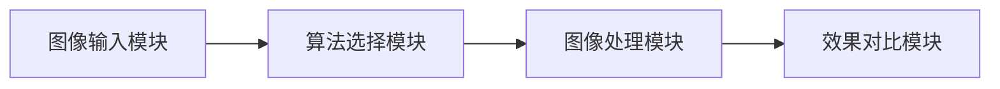
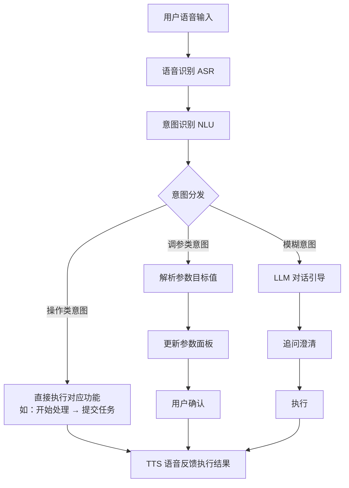

# 图像处理模块需求规格

> **文档分层说明**：本文档按"已实现（现状）/ 本次改造目标（规划中）/ 远期规划"三层组织。
>
> - **已实现**：当前代码已落地、可直接验证的功能
> - **本次改造目标（规划中）**：已列入[近期改造计划总览](../../05-改造计划/近期改造计划总览.md)，尚未实现的演进方向
> - **远期规划**：已列入[远期改造计划总览](../../05-改造计划/远期改造计划总览.md)，依赖后续阶段的基础设施

## 1. 模块概述

### 1.1 模块定位

图像处理模块是AI图像处理平台的核心处理引擎，负责对用户输入的图像执行 AI 图像处理任务并管理处理过程与结果。该模块承接图像输入和算法选择，输出处理结果至效果对比模块，是整个系统业务流程的关键环节。

> **任务类型（taskType，必填，单选）**：提交处理时必须指定单一任务类型（去雾 dehaze / 去雨 derain / 去雪 desnow / 低光增强 lowlight / 超分辨率 super_resolution / 去噪 denoise / 图像修复 inpainting），系统按 taskType 路由到对应算法集合（见 [近期改造计划总览 §3.1 任务类型路由](../../05-改造计划/近期改造计划总览.md)）。

### 1.2 核心价值

| 价值维度     | 具体内容                                          |
| -------- | --------------------------------------------- |
| **高效处理** | 支持单张与批量处理，满足不同规模的处理需求                         |
| **进度可见** | 处理过程展示 5 阶段进度（预处理/算法初始化/任务处理/后处理/保存），阶段名按 taskType 动态化，接入任务管理真实进度推送（WebSocket） |
| **参数可控** | 提交处理时可携带参数（记录于日志用于参数对比展示），主流算法按默认参数执行         |
| **快速返回** | 相同图片重复处理命中缓存（WPXNet 预查询 / Redis MD5 缓存）直接返回结果 |
| **结果管理** | 图像输入历史支持重新处理、删除，处理结果可保存                       |
| **会员差异** | 基于会员等级提供差异化的处理配额和批量上限                         |

### 1.3 用户角色分析

| 用户类型      | 特征          | 使用偏好      | 功能需求             |
| --------- | ----------- | --------- | ---------------- |
| **轻度用户**  | 偶尔使用，对参数不了解 | 默认参数，一键处理 | 单张处理、样例图片、自动保存   |
| **中度用户**  | 定期使用，有一定了解  | 参考推荐+微调参数 | 单张/批量处理、参数调节     |
| **重度用户**  | 高频使用，专业需求   | 精确控制参数    | 批量处理、参数预设（后端已实现） |
| **VIP用户** | 付费用户，更高权益   | 高效批量处理    | 更多配额、批量上限、处理优先   |

### 1.4 模块依赖关系



### 1.5 依赖的基础模块

| 模块       | 依赖说明                                                                                                          | 状态                |
| -------- | ------------------------------------------------------------------------------------------------------------- | ----------------- |
| **会员管理** | 处理前校验会员次数配额（Python 算法服务侧接入 `check_and_deduct_quota`）；`GET /quota` 查询剩余次数；批量上限按会员等级校验                          | ✅ 已实现（Python 端配额） |
| **算法管理** | 获取算法元数据（名称/权重路径/import\_path），调用 Python 算法服务执行推理                                                              | ✅ 已实现             |
| **文件存储** | 原图/结果图对象存储（URL 运行时拼接、不落库），结果文件 MD5 去重注册                                                                       | ✅ 已实现             |
| **收藏管理** | 处理结果收藏（targetType="result"），后端能力已具备；**前端页面未接入收藏入口**（`FavoriteButton` 组件已封装未使用）                                | ⏳ 前端待接入           |
| **消息通知** | 处理完成/失败告警/配额提醒，**当前未接入**（预测流程无消息发送）                                                                           | ⏳ 规划中             |
| **推荐管理** | 算法选择页推荐（F-REC-002）一键使用，预测请求可携带 `recommendedBy` 追踪采纳率                                                          | ✅ 已实现             |
| **任务管理** | 当前图像处理使用独立异步执行（预测日志状态机）；本次改造后迁移至任务管理模块的 `image_processing` 任务类型（见 [近期改造计划总览 §3.1](../../05-改造计划/近期改造计划总览.md)） | ⏳ 改造目标            |

***

## 2. 功能需求

### 2.1 单张处理 (F-M04-001)

#### 2.1.1 功能描述

对单张图片进行图像处理。处理任务以异步方式执行，用户提交后无需等待，可随时查看处理进度和结果。

#### 2.1.2 处理流程

```
上传/选择/拍照/样例选择图片
    ↓
选择算法（算法树）
    ↓
点击"开始处理"
    ↓
显示确认对话框（图片信息、算法信息、参数）
    ↓
用户确认处理
    ↓
校验配额 → 任务提交 → 立即返回任务标识
    ↓
异步执行阶段（后端执行算法推理，前端展示真实进度推送）
    ↓
处理完成 → 跳转重叠对比页面
处理失败 → 展示错误信息 + 重试面板（指数退避自动重试 + 手动重试）
```

> **说明**：确认对话框展示图片文件名、算法名称、参数值，**不展示预估耗时**（计算密集型任务无法预估）。

#### 2.1.3 任务状态

| 状态  | 说明     | UI 表现                                 |
| --- | ------ | ------------------------------------- |
| 处理中 | 任务正在执行 | 5 阶段进度条（预处理/算法初始化/任务处理/后处理/保存，阶段名按 taskType 动态化）+ 百分比 |
| 已完成 | 任务成功完成 | 自动跳转效果对比页面（重叠展示原图+结果图）                |
| 已失败 | 任务失败   | 错误提示 + 重试面板（指数退避自动重试，最大 3 次 + 手动重试）        |

#### 2.1.4 处理控制

**开始处理**：确认对话框展示图片信息（文件名）、算法信息（名称、参数配置）和处理提示，用户可选择取消或开始处理。前端处理前先检查剩余次数，配额为 0 时弹窗引导升级。

**取消处理**：确认对话框阶段可取消（未提交）。提交后前端提供"取消处理"按钮，调用后端取消接口终止推理并回滚配额（见 §2.1.7）。

#### 2.1.5 进度反馈

**现状（技术债）**：前端展示模拟进度（5 阶段步骤条 + 百分比，定时递增至 95%，完成后跳至 100%），无后端真实进度推送，违反"禁止虚假百分比"原则。

**改造目标**：接入任务管理模块真实进度推送（WebSocket），后端按推理阶段上报进度，前端据实展示。5 阶段定义为：预处理 / 算法初始化 / 任务处理（阶段名按 taskType 动态化，如 dehaze→"去雾处理"、super_resolution→"超分辨率重建"）/ 后处理 / 保存。

| 事件   | 触发时机   | 前端响应                                      |
| ---- | ------ | ----------------------------------------- |
| 任务完成 | 任务成功完成 | 停止进度展示，跳转重叠对比页面                           |
| 任务失败 | 任务失败   | 停止进度展示，展示错误信息，弹出重试面板（指数退避自动重试 + 手动重试） |

UI 展示规则：

- 改造后进度由后端真实推送（任务管理模块 WebSocket），阶段名按 taskType 动态化
- 不展示耗时计时器与预估剩余时间

**失败重试机制**：自动重试采用指数退避（间隔 2s → 4s → 8s），最大重试次数 3 次；超过最大次数后仅保留手动重试入口，手动重试不受次数限制。

#### 2.1.6 快速返回优化

对于已有预计算结果的场景，系统跳过算法推理直接返回结果，将响应时延从秒级降至毫秒级。实际包含两层缓存：

| 缓存层           | 实现方式                                           | 命中条件                          |
| ------------- | ---------------------------------------------- | ----------------------------- |
| WPXNet 预查询拦截器 | `sys_wpx_file` 表（原图 MD5 → 已处理图文件映射）            | 算法为 WPXNet 系列且原图 MD5 命中映射     |
| Redis MD5 缓存  | `prediction:{algorithmId}:{imageMd5}`（24h TTL） | 相同算法 + 相同图片 MD5（Python 算法服务侧） |

> 命中缓存时直接写入已完成日志（`sys_pred_log` status=2）并返回结果 URL，不调用算法推理。

#### 2.1.7 后端取消接口

提交处理后，用户可通过取消接口终止任务。后端取消接口执行：终止推理进程 → 回滚已扣减配额 → 更新任务状态为已取消。取消接口幂等，对已完成/已失败任务返回当前状态，不重复回滚配额。

***

### 2.2 批量处理 (F-M04-002)

#### 2.2.1 功能描述

支持一次性处理多张图片，提高处理效率。**已实现**（前端批量任务面板 + 后端 `/prediction/batch` 接口）。

#### 2.2.2 处理流程

```
点击"批量处理" → 弹窗选择多张图片
    ↓
确认添加 → 图片进入批量任务列表（每张 pending）
    ↓
选择统一算法（左侧工具栏）
    ↓
点击"开始批量处理"
    ↓
前端逐张处理：上传原图 → 提交预测 → 轮询结果 → 标记成功/失败
    ↓
展示整体进度 + 每张独立进度与状态
    ↓
完成 → 可查看单张结果、重试失败任务、移除/清空
```

#### 2.2.3 批量处理策略

**批量执行方式（统一为后端 `/batch` 接口）**：

- **改造目标**：统一由后端 `/batch` 接口承接批量提交，校验批量上限后循环提交预测子任务，返回各子任务的 logId/status（Java/Python 均已实现，SDK 已封装 `batchPredict`）。整体进度由任务管理模块聚合推送。
- **现状（技术债，待移除）**：前端串行逐张调用单张预测接口（上传原图 → `predictAndWait`），与后端 `/batch` 重复实现。改造后前端串行逻辑移除，统一走 `/batch`。
- 单张失败不影响其他图片，可单独重试

#### 2.2.4 失败处理

- 单张失败不影响其他图片处理，任务标记失败并记录失败原因
- 失败的图片可**单独重试**
- 批量处理可**取消全部**、**移除**单张、**清空列表**

#### 2.2.5 批量上限

批量数量受会员等级限制（见 §4.1），后端接口校验超限返回业务错误；批量上限以 `sys_member_benefit` 配置为权威（现状存在硬编码，见 §4.1 实现状态说明）。

***

### 2.3 参数调节 (F-M04-003)

#### 2.3.1 功能描述

为用户提供算法参数调节能力，实现个性化处理效果。

#### 2.3.2 参数调节

- 前端参数面板提供去雾强度/色彩饱和度/对比度/锐化四项参数（默认值 50/50/50/30），随预测请求以 JSON 字符串提交
- **当前实现**：参数**不传递到算法执行**（算法 `dehaze(haze_image, model_path)` 仅接收图片与权重路径，按自身默认参数推理）；参数记录于前端状态与日志，用于效果对比模块的**参数对比展示**（处理参数 vs 默认值）
- 参数仅影响本次处理展示，不支持实时预览调参效果

> **本次改造目标（规划中）**：不同 taskType 提供专属参数配置并真正作用于算法推理（如超分辨率放大倍数、去噪强度、低光增强亮度），上传提示/参数配置按 taskType 独立配置（见 [近期改造计划总览 §3.1](../../05-改造计划/近期改造计划总览.md)）。

#### 2.3.3 参数预设（后端已实现，前端未接入）

> **现状**：后端参数预设能力**已实现**——`/api/v1/presets` 接口（系统预设 system 只读 + 用户自定义 custom CRUD，归属校验），SDK 已封装。**前端页面尚未接入预设入口**，待后续迭代补充。VIP 预设数量上限尚未差异化。

***

### 2.4 处理结果管理 (F-M04-004)

#### 2.4.1 功能描述

管理处理结果，支持保存、重新处理、评估等操作。

#### 2.4.2 自动保存

处理完成后后端自动注册结果文件并关联预测日志。结果文件存储于对象存储，命名与存储策略由文件管理模块统一管理。

#### 2.4.3 手动保存

处理完成后前端提供\*\*"保存结果"按钮\*\*：下载结果图 → 转为 Blob 文件 → 再次上传至文件系统。保存格式为结果图原始格式，**无格式/质量/元数据选项**。

| 选项   | 说明                            |
| ---- | ----------------------------- |
| 保存方式 | 结果图 Blob 重新上传（FileAPI.upload） |
| 保存格式 | 沿用结果图格式，无 JPG/PNG 选择          |

#### 2.4.4 结果分享（规划中）

> 结果分享（社交平台分享、分享链接、二维码、邮件发送）**尚未实现**，待后续迭代补充。

#### 2.4.5 结果导出

| 格式   | 说明         | 适用场景            |
| ---- | ---------- | --------------- |
| 单张图片 | 结果图直接保存    | 日常使用            |
| 对比图  | 原图+结果并排/上下 | 效果展示（由效果对比模块生成） |

> PDF 报告、批量打包（ZIP）导出**尚未实现**，批量打包将随批量处理能力扩展补充。

***

### 2.5 处理队列管理 (F-M04-005，规划中)

> 用户侧处理任务队列（查看队列、优先级调整、暂停/恢复/清空）**尚未实现**。当前处理任务为提交后异步执行，无用户可见队列。本功能待本次改造将图像处理迁移至任务管理模块（`image_processing` 任务类型）后，由任务管理模块统一提供（见 [近期改造计划总览 §3.1](../../05-改造计划/近期改造计划总览.md)）。

***

### 2.6 错误处理与恢复 (F-M04-006)

#### 2.6.1 错误类型及处理

| 错误类型         | 处理方式                                         |
| ------------ | -------------------------------------------- |
| 图片文件损坏/格式不支持 | 上传前校验（仅 JPG/PNG，≤20MB），提示文件损坏                |
| 算法模块加载失败     | 提示加载失败，可重新发起（重试面板）                           |
| 处理超时         | 现状 Python 算法轮询超时 300s（技术债，与单图 ≤30s 目标矛盾）；改造目标将超时阈值降至 30s（见 §9 非功能需求），超时任务标记失败并回滚配额，提示建议更换算法或降低图片分辨率 |
| 网络异常         | 提示网络连接异常，失败重试                                |
| 次数配额不足       | 处理前校验配额，提示次数已达上限，引导升级会员                      |

#### 2.6.2 断点续传（规划中）

> 处理阶段的断点续传（服务端保存阶段进度、应用重启后恢复）**尚未实现**。当前处理为一次性异步执行，失败需重新发起。本功能待任务管理模块承载图像处理后补充。

***

### 2.7 图像输入历史 (F-M04-007)

#### 2.7.1 功能描述

记录用户的图片输入（上传/拍照/样例）并支持重新处理。**已实现**（前端本地历史 + 后端 `sys_input_history` 接口）。

#### 2.7.2 存储内容

**前端本地历史**（localStorage，key `dehaze:image-history`）：最多保留 **20 条**，字段含图片 URL、缩略图、时间戳、来源（upload/camera/sample）。

**后端** **`sys_input_history`**（同步接口已实现，前端当前未接入）：原图 URL/缩略图、结果图 URL/缩略图、算法 ID/名称、算法参数、处理耗时、状态（1成功/2失败/3处理中）、来源、同步状态。

> 早期需求稿中的"评估指标、用户评价"字段**不在**图像输入历史中（用户评分通过 `RatingCard` 组件对预测日志提交，属评价能力）。

#### 2.7.3 查询与筛选

**前端本地历史**：按时间分组展示（今天/昨天/最近7天/更早），无筛选条件。

**后端接口**（`/api/v1/image-input/history`）：分页查询，支持**状态筛选**（1成功/2失败/3处理中）与**来源筛选**（upload/camera/sample）。

> 早期需求稿中的"时间范围、算法筛选、评分筛选、关键字搜索"**未实现**（预测日志接口 `/prediction/logs` 支持按算法筛选）。

#### 2.7.4 展示形式

**卡片列表**：每条记录展示缩略图、处理时间、来源标签，操作按钮为**重新处理**（按记录的 taskType 跳转对应处理页）与**删除**（二次确认）。

> 早期需求稿中的"列表/网格视图切换、评分、评估指标展示"**未实现**。

#### 2.7.5 数据管理

- 前端本地历史最多保留 20 条（超出自动裁剪最早的记录），支持单条删除（二次确认）
- 后端 `sys_input_history` 支持单删/批量删除/清空，以及**同步本地与云端**（`POST /sync`，将 localStorage 记录上传至后端）
- 会员权益 `history_retention`（100/500/2000/10000）为配置字段，**历史清理逻辑尚未按等级接入**

#### 2.7.6 重新处理

从历史记录可发起重新处理（按记录的 taskType 跳转对应处理页，复用原图 URL），无需重新上传。

#### 2.7.7 历史记录对比（规划中）

> 从历史记录发起效果对比（结果图并排、指标对比、参数对比）**当前未提供入口**，对比能力由[效果对比模块](../../核心模块/效果对比/需求规格.md)提供。

***

### 2.8 语音与多模态交互 (F-M04-008，远期规划)

> **远期规划**：本功能依赖语音交互模块与 AI 对话能力，当前**尚未实现**（见 [产品拓展升级规划 §3.1](../../05-改造计划/产品拓展升级规划.md) 与 [AI 对话模块](../../03-模块设计/核心模块/AI对话/需求规格.md)）。以下内容为规划蓝图，不纳入本次改造范围。

#### 2.8.1 功能描述

将图像处理模块的操作能力从纯 GUI 交互扩展为语音 + 多模态混合交互，用户可通过语音指令完成全流程操作，也可通过"图片 + 文字描述"的组合方式更自然地表达处理意图。

#### 2.8.2 语音工作流

##### 2.8.2.1 语音指令范围

| 操作类别 | 语音指令示例                 | 对应功能   |
| ---- | ---------------------- | ------ |
| 上传图片 | "上传这张照片"               | 触发图片上传 |
| 选择算法 | "用暗通道先验去雾" / "用最快的算法"  | 算法选择   |
| 调整参数 | "去雾强度调到 70" / "默认参数就行" | 参数调节   |
| 发起处理 | "开始处理" / "帮我处理这张图"     | 提交处理任务 |
| 查看结果 | "看看效果" / "对比一下原图"      | 跳转效果对比 |
| 保存导出 | "保存结果" / "导出 PDF 报告"   | 结果管理   |

##### 2.8.2.2 语音交互流程



##### 2.8.2.3 设计原则

- **关键操作需确认**：发起处理、删除结果等操作在执行前通过语音或视觉提示确认
- **可打断可纠错**：支持用户随时打断语音播报，纠正错误指令
- **视觉 + 语音双重反馈**：语音播报的同时界面同步展示操作结果
- **降级兼容**：语音识别失败时自动退化为文字输入，不影响核心流程

#### 2.8.3 多模态输入

##### 2.8.3.1 组合交互模式

用户可同时提供图片和文字描述，系统综合理解处理意图：

| 输入组合      | 示例                        | 处理逻辑               |
| --------- | ------------------------- | ------------------ |
| 图片 + 指令   | 上传夜景图 + "调亮一点"            | 识别为低光增强任务，自动匹配算法   |
| 图片 + 需求描述 | 上传雾霾图 + "要去雾但要保留远处山峰的朦胧感" | 理解"保留朦胧感"→推荐保守参数方案 |
| 多图 + 对比意图 | 上传两张图 + "把第一张处理成第二张的风格"   | 以参考图为目标，风格迁移或参数对齐  |

##### 2.8.3.2 处理参数的自然语言调整

在已完成的处理结果上，用户可通过自然语言微调参数：

- "再调亮一点" → 亮度参数 +10
- "颜色太鲜艳了，淡一点" → 饱和度参数 -15
- "边缘有点糊" → 锐化参数 +10
- "回到默认值" → 重置所有参数

LLM 负责将模糊的自然语言描述映射到具体参数调整量，并结合当前参数值给出合理建议。

#### 2.8.4 智能对话引导

处理过程中，系统通过 LLM 主动引导用户：

| 场景    | 引导内容                                   |
| ----- | -------------------------------------- |
| 图片上传后 | "这张照片看起来雾霾较重，建议使用暗通道先验算法，需要我帮您处理吗？"    |
| 参数配置时 | "当前去雾强度为 50，对于重度雾霾场景建议调至 70-80，需要调整吗？" |
| 处理完成后 | "处理完成！雾霾已去除，但天空区域略有偏暗。需要我微调天空亮度吗？"     |
| 用户犹豫时 | "您似乎不确定选哪个算法，需要我根据图片特征推荐吗？"            |

#### 2.8.5 技术依赖

| 能力        | 依赖                                    |
| --------- | ------------------------------------- |
| 语音识别（ASR） | 浏览器 Web Speech API / 第三方 ASR 服务       |
| 语音合成（TTS） | 浏览器 Speech Synthesis API / 第三方 TTS 服务 |
| 意图识别与对话   | LLM                                   |
| 多模态理解     | 多模态 LLM（支持图片 + 文字联合推理）                |

***

## 3. 用户交互流程

### 3.1 单张处理完整流程

用户选择或上传图片（上传/拍照/样例/历史）→ 选择算法 → 可选调整参数 → 点击开始处理 → 显示确认对话框（图片/算法/参数）→ 配额检查 → 用户确认 → 展示真实进度（5 阶段，阶段名按 taskType 动态化）→ 处理完成 → 自动跳转重叠对比页面 → 用户可保存结果、评估结果。

### 3.2 批量处理完整流程

选择多张图片 -> 确认添加至批量任务列表 -> 选择统一算法 -> 点击开始批量处理 -> 前端逐张处理并展示整体进度/单张进度 -> 全部完成 -> 查看单张结果、重试失败任务、移除/清空任务。

***

## 交互规范

### 页面布局

| 页面 | 布局要点 |
|------|---------|
| 处理工作台 | 左侧图像选择区，右侧参数配置区，底部"开始处理"按钮 |
| 处理进度 | 5 阶段进度条（预处理/算法初始化/任务处理/后处理/保存），阶段名按任务类型动态化 |
| 结果预览 | 原图与结果图重叠对比展示，提供下载按钮 |
| 批量任务面板 | 批量任务列表，每张展示独立进度与状态，支持重试/移除/清空 |

### 关键交互行为

| 场景 | 交互行为 |
|------|---------|
| 开始处理 | 确认对话框展示图片/算法/参数，用户确认后提交 |
| 取消处理 | 确认对话框阶段可取消；提交后提供取消按钮终止推理并回滚配额 |
| 进度展示 | 按推理阶段真实推送进度，不展示预估耗时 |
| 失败重试 | 自动重试（指数退避，最大 3 次）后保留手动重试入口 |
| 配额不足 | 处理前检查，配额为 0 时弹窗引导升级会员 |
| 批量处理 | 单张失败不影响其他，可单独重试 |

### 操作反馈

| 场景 | 反馈行为 |
|------|---------|
| 处理完成 | 自动跳转效果对比页面 |
| 处理失败 | 展示错误信息与重试面板 |
| 配额不足 | 提示"本月次数已达上限"，引导升级会员 |
| 缓存命中 | 直接返回结果，无需等待 |
| 批量完成 | 展示整体成功率，失败项可重试 |

***

## 4. 会员权益

### 4.1 等级差异

图像处理模块的会员权益由[会员管理模块](../../基础模块/会员管理/需求规格.md)统一管理，各等级差异如下：

| 权益项         | 普通用户  | VIP1  | VIP2   | SVIP    |
| ----------- | ----- | ----- | ------ | ------- |
| 每月处理次数      | 20 次  | 100 次 | 500 次  | 3000 次  |
| 批量处理上限      | 10 张  | 50 张  | 200 张  | 1000 张  |
| 处理优先级       | 普通    | 优先    | 高优先    | 最高      |
| 历史记录保留      | 100 条 | 500 条 | 2000 条 | 10000 条 |
| 高级参数调节      | 支持    | 支持    | 支持     | 支持      |
| 高清图导出       | 支持    | 支持    | 支持     | 支持      |

> 权益数值与 [会员管理模块 §2.2.1](../../基础模块/会员管理/需求规格.md) 一致，以 `sys_member_benefit` 配置为权威；高级参数/高清导出为能力开关，当前各等级均开启。
>
> **实现状态说明**：
>
> - **批量上限**：VIP 等级（VIP1/VIP2/SVIP）按配置生效；普通用户（level_0）Java 端 `getBatchLimit` 硬编码返回 5（未读配置的 10），Python 端另有单次 20 张硬编码上限——均为技术债，改造目标统一以配置为权威，移除全部硬编码。
> - **历史记录保留**：配置字段已定义，历史清理逻辑尚未按等级接入（技术债）。

### 4.2 次数扣减

用户每次发起图像处理，系统校验会员等级对应的月度配额。配额校验与扣减由 **Python 算法服务侧**接入（`check_and_deduct_quota("dehaze")`，Redis 原子操作，失败恢复）；**Java 端** **`deductQuota`** **已实现但预测流程尚未接入**，`GET /quota` 仅统计展示剩余次数。

月度配额每月 1 日自动重置。

***

## 5. 消息通知集成

图像处理模块通过[消息通知模块](../../基础模块/消息通知/需求规格.md)（F-MN-001）推送通知的能力**当前未接入**：

| 触发事件      | 消息类型 | 通知内容            | 状态    |
| --------- | ---- | --------------- | ----- |
| 单张/批量处理完成 | 业务通知 | 任务完成，点击查看效果     | ⏳ 未接入 |
| 处理失败      | 业务通知 | 任务失败，说明失败原因     | ⏳ 未接入 |
| 月度配额即将用尽  | 业务通知 | 本月剩余次数不足，建议升级会员 | ⏳ 未接入 |

> 当前预测流程无消息发送（`PredLogAsyncTask` 仅更新日志与指标），前端通过页面轮询获取结果。

***

## 6. 收藏管理集成

处理结果收藏由[收藏管理模块](../../基础模块/收藏管理/需求规格.md)统一管理（收藏类型 `result`）。**当前前端页面未接入收藏入口**（`FavoriteButton` 组件已封装但未在图像处理/历史/对比页面使用），收藏能力通过收藏管理模块独立页面使用。

> **本次改造目标（规划中）**：处理历史列表与对比页面接入收藏按钮。

***

## 7. 推荐管理集成

图像处理模块与[推荐管理模块](../../基础模块/推荐管理/需求规格.md)集成：

- 算法选择页面的"推荐"Tab 展示推荐管理模块生成的算法推荐（F-REC-002）✅ 已实现
- 预测请求可携带 `recommendedBy`（推荐记录 ID）用于追踪推荐采纳率 ✅ 已实现
- 推荐策略指导默认参数方案：⏳ 规划中

***

## 8. 任务管理对齐

当前图像处理采用独立异步执行（预测日志状态机：处理中→已完成/已失败），**未接入任务管理模块**（技术债）。改造目标将图像处理迁移至任务管理模块的 `image_processing` 任务类型（见 [近期改造计划总览 §3.1 任务类型路由](../../05-改造计划/近期改造计划总览.md)），迁移后：

- 处理任务统一由任务管理模块承载（任务状态、进度追踪、失败重试、取消回滚）
- 图像处理按 `params.taskType`（必填，单选）路由到对应算法集合
- 进度由任务管理模块通过 WebSocket 真实推送（替代现状前端模拟进度）

***

## 9. 非功能需求

| 指标         | 目标值             | 说明                                                    |
| ---------- | --------------- | ----------------------------------------------------- |
| 单图处理时延     | ≤ 30s           | 含上传 + 推理 + 结果回写；现状 300s 轮询超时为技术债，改造目标降至 30s          |
| 并发处理能力     | 100 并发          | 单实例同时处理的图像处理任务数                                       |
| 可用性        | 99.9%           | 模块年度可用率                                               |
| GPU 加速与降级  | GPU 优先，失败回退 CPU | GPU 推理失败时自动回退 CPU 降级执行，保障可用性；回退事件记录日志                 |
| 超时阈值       | 30s             | 单图推理超时阈值（替代现状 300s 轮询超时）；超时任务标记失败并回滚配额                |
| 并发限流       | 按会员等级 + 实例容量    | 超过并发上限时排队等待或返回限流提示，优先保障 VIP 任务                        |

---

## 待确认事项

1. **任务超时阈值差异化**：单图推理超时阈值（当前 30s）是否需要按算法类型或图片大小差异化？
2. **失败重试策略区分**：自动重试是否需要按失败原因区分（网络异常可重试 vs 算法错误不重试）？
3. **处理结果保留期限**：处理结果文件的保留期限与清理策略（当前无明确策略）？
4. **参数预设 VIP 差异化**：参数预设数量上限是否需要按会员等级差异化？
5. **缓存结果标注**：缓存命中的处理结果是否需要标注"缓存结果"以区分实时处理？

