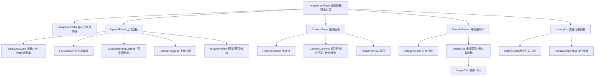

# 图像输入模块 - 前端实现设计

## 1. 文档概述

本文档描述图像输入模块的前端架构决策，聚焦组件树、状态管理、路由与关键交互设计。业务规则、文件限制、错误提示、交互流程详见 [需求规格.md](./需求规格.md)（功能点编号 F-M01-001 ~ F-M01-004）；接口契约详见 [API接口.md](./API接口.md)。

---

## 2. 组件树设计

### 2.1 组件树

### 2.2 组件职责

| 组件 | 职责 |
|---------|------|
| ImageInputPage | 页面容器，路由入口，托管 Tab 状态与各面板 |
| ImageInputTabs | 输入方式切换（上传/拍照/样例/历史） |
| UploadPanel | 上传流程编排：选择/粘贴/拖拽 -> 校验 -> MD5 去重 -> 上传 |
| DragDropZone | 拖拽上传交互（Web/桌面端，移动端禁用） |
| FileSelector | 文件选择器，触发格式与大小校验 |
| ClipboardPasteListener | 监听剪贴板粘贴，提取图片接入上传流程 |
| UploadProgress | 上传进度、速度、剩余时间展示 |
| CameraPanel | 相机流程编排：权限 -> 取流 -> 拍摄 -> 预览 -> 上传 |
| CameraStream | 相机流渲染 |
| CameraControls | 前后切换/闪光灯/对焦/网格线/变焦控制 |
| SampleGallery | 样例库展示与选择，对接数据集管理与推荐管理模块 |
| CategoryFilter | 按任务类型/场景过滤样例 |
| ImageGrid | 虚拟滚动 + 懒加载的缩略图网格 |
| HistoryList | 历史记录列表，时间分组 |
| HistoryCard | 单条历史记录展示与操作入口 |
| ResultActions | 结果操作菜单（重新处理/更换算法/下载/分享/收藏/删除） |

### 2.3 组件通信

统一使用 Pinia 管理跨组件状态，不引入 EventBus。理由：Tab 内组件树固定，状态变更均可由 Store 驱动，无一次性全局事件需求，避免 Pinia 与 EventBus 职责重叠。

| 通信场景 | 方式 |
|---------|---------|
| 父子组件 | Props + Emits（单向数据流） |
| 跨层级/兄弟组件 | Pinia Store |
| 配置注入 | Provide/Inject |

---

## 3. 状态管理

### 3.1 Store 划分

模块级 Store 精简为 3 个，跨模块引用用户管理模块的 `useUserStore`：

| Store | 职责 | 核心状态 |
|---------|------|---------|
| useImageInputStore | 输入流程总状态 | activeTab、selectedImage（输出给去雾处理）、uploadQueue/progress/results、sampleFilter、md5Cache（已查询 MD5 -> 文件 URL 映射） |
| useHistoryStore | 历史记录 | localRecords、cloudRecords、quota(used/total)、分页游标 |
| useCameraStore | 相机 | permission、stream、deviceCapability（前后摄像头/闪光灯） |
| useUserStore（引用用户管理模块） | 用户配额 | 用户类型、文件大小/数量配额 |

---

## 4. 路由设计

| 路由路径 | 页面 | 说明 |
|---------|------|------|
| `/image-input` | ImageInputPage | 图像输入主页（keepAlive 缓存） |

- **受保护路由**：`/image-input` 为登录用户路由，导航守卫校验登录态，未登录跳转登录页。游客仅可访问本地历史记录，云端历史与上传配额需登录后可用。
- **Tab 状态切换而非子路由**：4 个输入方式（上传/拍照/样例/历史）通过 Tab 组件状态切换，不拆分为子路由。理由：Tab 切换高频，子路由切换会销毁/重建组件并丢失本地状态（已选拍照预览、上传队列、样例筛选），改用组件状态切换缓存各面板实例以保留状态。
- **响应式断点**（对齐 UI-UX 规范 sm 640/md 768/lg 1024/xl 1280）：<640px 单列全屏 Tab，拖拽禁用、优先拍照；640~1024px 双列网格，支持拖拽与粘贴；≥1280px 三列网格，完整功能与快捷键。

---

## 5. 数据流

**上传流程状态流转**（业务规则见 F-M01-001）：

| 阶段 | 状态变更 |
|---------|---------|
| 选择/粘贴/拖入文件 | uploadQueue 新增项 |
| MD5 去重查询 | md5Cache 命中 -> 直接产出 selectedImage，跳过上传；未命中 -> 进入上传 |
| 上传中 | progress 更新 |
| 上传成功 | results 记录，selectedImage 就绪，跳转算法选择页 |
| 上传失败 | 记录错误，保留队列项供重试 |

**模块间数据交互**：

| 交互方向 | 数据 | 说明 |
|---------|------|------|
| 数据集管理 -> 图像输入 | 样例图片、文件上传/查询 | 样例来源与上传走数据集管理接口 |
| 图像输入 -> 去雾处理 | imageUrl + taskType + source | 输出契约见需求规格 §1.4.2 |
| 去雾处理 -> 图像输入 | 历史记录回写 | 回写契约见需求规格 §1.4.3 |

---

## 6. 交互设计决策

### 6.1 多触发方式上传（F-M01-001）

| 触发方式 | 实现决策 |
|---------|---------|
| 上传按钮 / 文件选择器 | FileSelector，全平台 |
| 拖拽上传 | DragDropZone，Web/桌面端；移动端禁用 |
| 剪贴板粘贴（Ctrl+V） | ClipboardPasteListener 监听 paste 事件，Web/桌面端，提取图片后复用上传流程 |

文件格式、大小、数量、分辨率校验规则及错误提示见需求规格 F-M01-001，前端按 `useUserStore` 用户类型动态读取配额（游客/VIP/高级VIP/企业版），不在前端硬编码限制值。分辨率低于 640×480 时给出"效果可能不佳"警告但允许继续（对应 F-M01-001 §2.1.4 分辨率建议）。

### 6.2 MD5 去重（F-M01-001 §2.1.7）

上传前由前端计算文件 MD5 并调用文件查询接口校验，命中则复用已有文件 URL 跳过上传并 Toast 提示，未命中则正常上传并写入 md5Cache。去重契约见需求规格 §2.1.7。

### 6.3 拍照（F-M01-002）

调用浏览器原生相机能力（getUserMedia），权限状态由 `useCameraStore` 持有，授权失败引导跳转系统设置；拍摄结果复用上传流程（含 MD5 去重）。相机能力（前后切换/闪光灯/对焦/网格线/变焦）见需求规格 F-M01-002 §2.2.2。

### 6.4 样例图片与懒加载（F-M01-003）

样例数据来源于数据集管理模块公开数据项，推荐算法由推荐管理模块动态获取，前端不静态配置。ImageGrid 采用虚拟滚动 + Intersection Observer 懒加载优化大量缩略图渲染，缩略图进入视口后才请求加载。

### 6.5 历史记录与结果操作（F-M01-004）

历史记录展示、分组、清理见需求规格 F-M01-004。结果操作交互决策：

| 操作 | 实现决策 |
|---------|---------|
| 重新处理 | 携带原图 + 算法 ID 跳转去雾处理页，自动开始 |
| 更换算法 | 携带原图跳转算法选择页 |
| 下载结果 | 由结果图 URL 触发浏览器下载，前端不中转文件流 |
| 分享结果 | 调用分享能力生成分享链接/图片，复制到剪贴板 |
| 添加收藏 | 复用收藏管理模块，targetType="result" |
| 删除记录 | 二次确认后调用历史记录删除接口（本地 + 云端） |

### 6.6 拖拽上传交互状态

| 状态 | 交互行为 |
|---------|---------|
| idle | 显示上传引导，接受拖入 |
| hover | 鼠标悬停高亮提示 |
| dragover | 拖入时提示"释放以上传" |
| disabled | 移动端禁用，不响应拖拽事件 |

---

## 7. 公共组件使用

| 公共组件 | 用途 | 配置要点 |
|---------|------|---------|
| ImagePreview | 图片预览、裁剪、旋转 | 拍照后简单裁剪与 90° 旋转（F-M01-002 §2.2.3）；上传/样例预览复用 |
| ImageGrid | 缩略图网格布局 | 虚拟滚动 + 懒加载，自适应列数，样例库与历史记录网格复用 |
| EmptyState | 空状态提示 | 历史无记录、样例无数据、搜索无结果场景 |
| FavoriteButton | 收藏按钮 | 复用收藏管理模块（配置见 §6.5） |

按钮级权限控制见 [API接口.md](./API接口.md) §3：上传图片需 `sys:dataset:edit`，无权限隐藏入口并显示升级提示；查看样例所有用户可见；查看历史游客仅本地记录、登录用户云端存储。数据权限（历史记录用户隔离、样例公开、上传配额按用户类型）见需求规格 §5.1。
