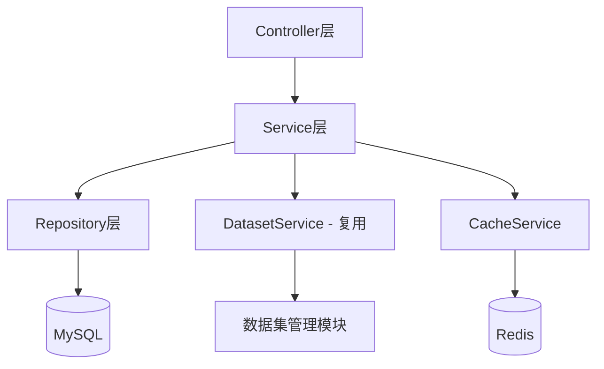
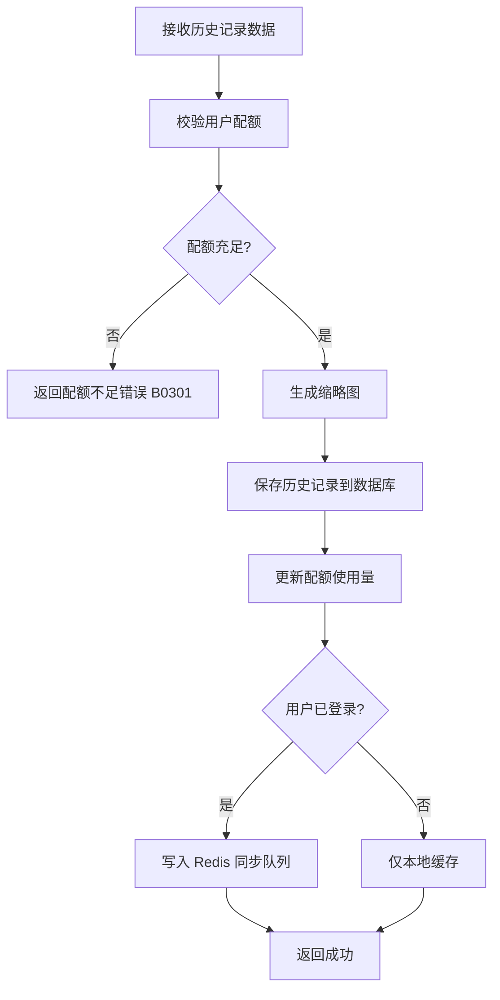
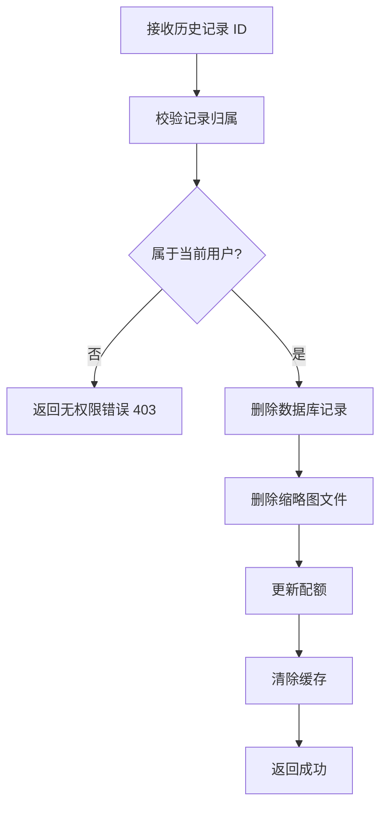
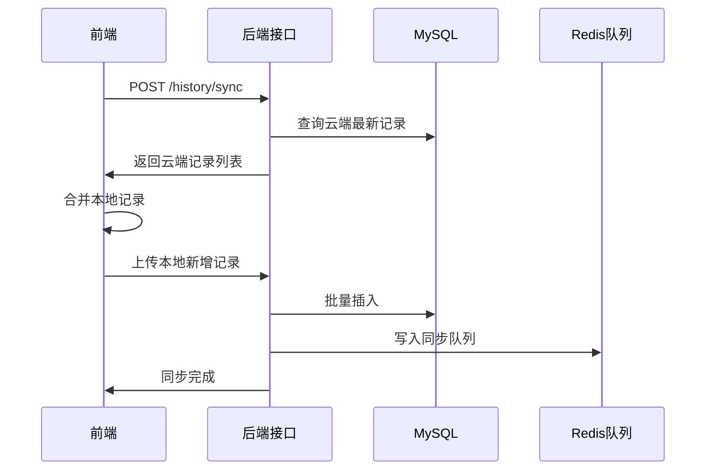

# 图像输入模块 - 后端实现设计

## 1. 文档概述

### 1.1 文档目的

本文档描述图像输入模块的后端实现方案，重点设计历史记录管理功能。图片上传和样例图片库功能复用数据集管理模块。

### 1.2 相关文档

- **需求规格**：[需求规格.md](./需求规格.md)
- **API 接口**：[API接口.md](./API接口.md)
- **数据库设计**：[03-数据库设计.md](../../../02-系统架构/03-数据库设计.md)
- **前端实现**：[前端实现.md](./前端实现.md)
- **测试用例**：[测试用例.md](./测试用例.md)
- **收藏管理**：[收藏管理/后端实现.md](../../基础模块/收藏管理/后端实现.md)
- **推荐管理**：[推荐管理/后端实现.md](../../基础模块/推荐管理/后端实现.md)

## 2. 架构设计

### 2.1 模块分层架构

### 2.2 核心组件职责

| 组件 | 职责描述 |
|------|---------|
| ImageInputController | 历史记录 CRUD 接口 |
| HistoryService | 历史记录业务逻辑、同步策略 |
| HistoryRepository | 历史记录数据访问 |
| DatasetService（复用） | 图片上传、样例查询（复用数据集管理） |
| CacheService | Redis 缓存管理 |
| SyncService | 本地与云端同步逻辑 |

### 2.3 依赖基础模块

| 模块 | 依赖说明 |
|------|---------|
| 收藏管理 | 收藏状态由收藏管理模块统一管理（`sys_favorite` 表），本模块历史列表通过 JOIN `sys_favorite` 获取收藏状态 |
| 推荐管理 | 样例图片的推荐算法由推荐引擎动态生成，替代历史记录中的静态算法推荐 |

## 3. 功能复用说明

### 3.1 图片上传（复用数据集管理）

**复用接口**：
- `POST /api/v1/dataset-items/upload`：上传配对图片
- `POST /api/v1/item-files`：单独上传图片文件

**复用功能**：
- 文件格式验证（JPG/PNG/WEBP/HEIC）
- 文件大小限制（免费用户 10MB，VIP 20MB）
- 分辨率检测
- 智能压缩
- MinIO 文件存储
- 缩略图生成

**参考文档**：
- [数据集管理 API 接口 § 2.2](../数据集管理/API接口.md#22-数据项接口)
- [数据集管理后端实现 § 4.6](../数据集管理/后端实现.md#46-创建数据项并上传配对图片)

### 3.2 样例图片库（复用数据集管理）

**复用接口**：
- `GET /api/v1/dataset-items`：查询公开数据项

**查询参数**：
- `isPublic=true`：过滤公开展示的图片
- `sceneType`：场景类型筛选
- `hazeLevel`：雾霾程度筛选
- `sortBy=usageCount`：按使用次数排序

**复用功能**：
- 数据项查询
- 分页支持
- 分类筛选
- 相关度排序

**参考文档**：
- [数据集管理后端实现 § 4.5](../数据集管理/后端实现.md#45-分页查询数据项列表)

## 4. 核心业务逻辑设计

### 4.1 历史记录管理（新增功能）

#### 数据模型

> 表结构定义详见 [数据库设计文档](../../../02-系统架构/03-数据库设计.md)

**sys_input_history**（历史记录表）：

| 字段 | 类型 | 说明 |
|-----|------|------|
| id | BIGINT | 主键 |
| user_id | BIGINT | 用户 ID |
| original_image_url | VARCHAR | 原始图片 URL |
| original_thumbnail_url | VARCHAR | 原始缩略图 URL |
| result_image_url | VARCHAR | 处理结果 URL |
| result_thumbnail_url | VARCHAR | 结果缩略图 URL |
| algorithm_id | BIGINT | 使用的算法 ID |
| algorithm_name | VARCHAR | 算法名称（冗余字段） |
| algorithm_params | JSON | 算法参数 |
| processing_time | INT | 处理耗时（秒） |
| status | TINYINT | 处理状态（1=成功，2=失败，3=处理中） |
| input_source | VARCHAR | 图片来源（upload/camera/sample） |
| sync_status | TINYINT | 同步状态（0=未同步，1=已同步） |
| create_time | DATETIME | 创建时间 |
| update_time | DATETIME | 更新时间 |

**索引设计**：

| 索引名 | 字段 | 说明 |
|-------|------|------|
| idx_user_time | (user_id, create_time DESC) | 用户历史记录查询 |
| idx_sync | (sync_status, update_time) | 同步任务查询 |

#### 历史记录创建

**业务流程**：

**配额规则**：

| 用户类型 | 本地存储 | 云端存储 | 保留时长 |
|---------|---------|---------|---------|
| 游客 | 最近 20 条 | 不存储 | 清除浏览器数据后删除 |
| 注册用户 | 最近 20 条 | 最近 100 条 | 30 天 |
| VIP 会员 | 最近 50 条 | 最近 500 条 | 90 天 |
| 企业版 | 最近 100 条 | 全部记录 | 永久保存 |

#### 历史记录查询

**业务规则**：

| 规则 | 实现方式 |
|-----|---------|
| 用户隔离 | WHERE user_id = :userId |
| 时间分组 | 按 create_time 分组（今天/昨天/最近7天/更早） |
| 默认排序 | ORDER BY create_time DESC |
| 分页查询 | LIMIT :offset, :pageSize |

**查询参数**：

| 参数 | 类型 | 说明 |
|-----|------|------|
| pageNum | Integer | 页码（默认 1） |
| pageSize | Integer | 每页数量（默认 20） |
| status | Integer | 状态筛选（1=成功，2=失败，3=处理中） |
| inputSource | String | 来源筛选（upload/camera/sample） |
| isFavorite | Boolean | 仅查收藏（通过 LEFT JOIN sys_favorite WHERE target_type='result' AND target_id=sys_input_history.id 过滤） |
| startTime | DateTime | 开始时间 |
| endTime | DateTime | 结束时间 |

#### 历史记录删除

**单条删除**：

**批量删除**：

- 遍历 ID 列表，逐个校验归属
- 事务保证：数据库删除成功后再删除文件
- 异步删除文件，避免阻塞接口

**清空历史**：

- 删除当前用户所有历史记录
- 二次确认：前端必须传递确认参数 `confirm=true`
- 异步任务：大量数据删除使用异步任务

### 4.2 数据同步机制

#### 同步策略

**同步时机**：

| 触发时机 | 同步内容 | 同步方式 |
|---------|---------|---------|
| 用户登录 | 云端 → 本地 | 全量同步 |
| 创建记录 | 本地 → 云端 | 增量同步 |
| 更新记录 | 本地 → 云端 | 增量同步 |
| 删除记录 | 本地 → 云端 | 增量同步 |
| 手动同步 | 双向同步 | 全量同步 |
| 网络恢复 | 离线队列 → 云端 | 队列同步 |

**同步流程**：

#### 冲突处理

**冲突检测规则**：

| 冲突类型 | 检测条件 | 处理策略 |
|---------|---------|---------|
| 同一记录被修改 | 本地和云端 update_time 不一致 | 保留最新（按 update_time） |
| 重复创建 | original_image_url 相同 | 去重，保留最早记录 |
| 删除冲突 | 本地删除，云端已修改 | 云端优先，恢复记录 |

**冲突解决流程**：

1. 检测冲突记录
2. 按 update_time 比较
3. 保留最新记录
4. 更新本地或云端数据
5. 标记同步状态为已解决

#### 离线队列

**队列设计**：

- Redis List 存储离线操作
- Key：`history:offline:{userId}`
- 元素：JSON 格式的操作记录

**操作类型**：

| 操作 | 存储内容 |
|-----|---------|
| 创建 | 完整历史记录数据 |
| 更新 | ID + 更新字段 |
| 删除 | ID |

**队列处理**：

- 网络恢复后，依次执行队列中的操作
- 失败操作重新入队，最多重试 3 次
- 超过 3 次失败，记录错误日志

### 4.3 缩略图生成

**生成策略**：

| 场景 | 触发时机 | 生成方式 |
|-----|---------|---------|
| 上传图片 | 上传成功后 | 异步生成（复用数据集管理） |
| 处理完成 | 处理成功后 | 同步生成（结果图） |
| 历史记录 | 创建记录时 | 使用已有缩略图 |

**缩略图规格**：

| 类型 | 尺寸 | 质量 | 格式 |
|-----|------|------|------|
| 列表缩略图 | 150×150px | 80% | WebP/JPEG |
| 详情预览图 | 600×600px | 85% | WebP/JPEG |

**生成路径**：

- 原图：`/{rootPath}/history/{userId}/{recordId}/original.jpg`
- 缩略图：`/{rootPath}/history/{userId}/{recordId}/thumb_original.jpg`
- 结果图：`/{rootPath}/history/{userId}/{recordId}/result.jpg`
- 结果缩略图：`/{rootPath}/history/{userId}/{recordId}/thumb_result.jpg`

### 4.4 配额管理

**配额检查逻辑**：配额检查时，查询用户当前记录数。如已达会员等级对应的存储上限，自动删除最旧的非收藏记录后再执行写入。收藏状态通过 JOIN `sys_favorite`（`target_type='result'`）判断。

**配额清理策略**：

| 清理类型 | 触发条件 | 清理规则 |
|---------|---------|---------|
| 自动清理 | 配额达到上限 | 删除最旧的非收藏记录（LEFT JOIN sys_favorite 判断是否已收藏） |
| 定时清理 | 每天凌晨 2 点 | 删除过期记录（按保留时长） |
| 手动清理 | 用户主动触发 | 按用户选择删除 |

## 5. 数据访问与数据依赖

> 表结构定义详见 [数据库设计.md](../../../02-系统架构/03-数据库设计.md)

### 5.1 依赖表清单

| 表名 | 关联方式 | 说明 |
|-----|---------|------|
| sys_input_history | 主表 | 历史记录核心数据 |
| sys_user | 外键 user_id | 用户信息 |
| sys_algorithm | 外键 algorithm_id | 算法信息 |
| sys_file | 关联 original_image_url | 原始图片文件（复用数据集管理） |

### 5.2 关键字段约束

| 字段 | 约束 | 说明 |
|-----|------|------|
| user_id | NOT NULL | 必须关联用户 |
| original_image_url | NOT NULL | 必须有原始图片 |
| status | NOT NULL, DEFAULT 3 | 默认为处理中 |
| sync_status | NOT NULL, DEFAULT 0 | 默认未同步 |
| create_time | NOT NULL, DEFAULT CURRENT_TIMESTAMP | 自动记录创建时间 |

### 5.3 核心 Mapper 方法

**HistoryMapper**：

| 方法名 | 说明 |
|--------|------|
| selectByUserId | 查询用户历史记录（分页，含 LEFT JOIN sys_favorite 获取收藏状态） |
| selectByUserIdAndTimeRange | 按时间范围查询 |
| selectFavorites | 查询收藏记录（JOIN sys_favorite WHERE target_type='result'） |
| countByUserId | 统计用户记录数量 |
| deleteOldestNonFavorite | 删除最旧的非收藏记录（LEFT JOIN sys_favorite 过滤已收藏记录） |
| updateSyncStatus | 更新同步状态 |
| selectUnsynced | 查询未同步记录 |

### 5.4 查询优化要点

| 优化项 | 实现方式 |
|--------|---------|
| 分页查询 | 使用覆盖索引（idx_user_favorite），避免回表 |
| 统计查询 | 利用 idx_user_time 索引覆盖 COUNT 操作 |

## 6. 缓存设计

### 6.1 缓存 Key 规范

| 缓存对象 | 缓存 Key | TTL | 更新策略 |
|---------|---------|------|---------|
| 用户历史列表 | `history:list:{userId}:{page}` | 30 分钟 | 增删改时失效 |
| 历史记录详情 | `history:detail:{id}` | 1 小时 | 更新时失效 |
| 用户配额 | `history:quota:{userId}` | 1 小时 | 创建/删除时更新 |
| 离线队列 | `history:offline:{userId}` | 7 天 | 同步完成后清除 |
| 同步锁 | `history:sync:lock:{userId}` | 5 秒 | 同步完成后释放 |

### 6.2 缓存更新规则

| 操作 | 失效的缓存 Key |
|------|--------------|
| 创建记录 | `history:list:{userId}:*`, `history:quota:{userId}` |
| 更新记录 | `history:list:{userId}:*`, `history:detail:{id}` |
| 删除记录 | `history:list:{userId}:*`, `history:detail:{id}`, `history:quota:{userId}` |
| 同步记录 | `history:list:{userId}:*` |

### 6.3 缓存一致性策略

**双删策略**：

1. 删除缓存
2. 更新数据库
3. 延迟 100ms 再次删除缓存（防止并发导致的脏数据）

**分布式锁**：

- 同步操作使用 Redis 分布式锁，防止并发冲突
- 锁定时间：5 秒
- 锁定粒度：按用户 ID

## 7. 安全设计

### 7.1 数据权限

**用户隔离**：

- 所有查询和操作必须校验 `user_id = currentUserId`
- 防止越权访问其他用户的历史记录
- 权限校验：查询历史记录时校验 record.userId === currentUserId，不匹配返回 403

### 7.2 安全防护

| 防护项 | 实现方式 |
|--------|---------|
| SQL 注入 | 参数化查询，MyBatis 参数绑定 |
| 越权访问 | 用户 ID 校验，用户隔离 |
| 数据泄露 | 敏感字段加密存储（如有需要） |
| 重复提交 | Redis 分布式锁，防止重复创建 |
| 配额限制 | 创建前校验配额，超限拒绝 |

## 8. 异步任务设计

### 8.1 定时任务

| 任务 | 执行频率 | 处理内容 |
|------|---------|---------|
| 过期记录清理 | 每天凌晨 2 点 | 删除超过保留期限的历史记录 |
| 未同步记录处理 | 每 10 分钟 | 重试失败的同步操作 |
| 缓存预热 | 每天凌晨 3 点 | 预加载活跃用户的历史记录 |

### 8.2 异步处理

**缩略图生成**：

- 事件：`HistoryCreatedEvent`
- 处理：异步生成缩略图，更新记录
- 失败策略：重试 3 次，记录失败日志

**文件删除**：

- 事件：`HistoryDeletedEvent`
- 处理：异步删除 MinIO 文件
- 失败策略：记录到清理队列，定时重试

## 9. 性能目标

| 接口 | 目标 P99 | 优化手段 |
|------|----------|----------|
| 创建历史记录 | 300ms | 异步生成缩略图 |
| 查询历史列表 | 200ms | 分页查询 + 缓存 |
| 查询历史详情 | 100ms | 缓存 |
| 删除历史记录 | 200ms | 异步删除文件 |
| 同步历史记录 | 1s | 批量操作 + 异步处理 |

**优化措施**：

| 优化项 | 实现方式 |
|--------|---------|
| 查询优化 | 覆盖索引，避免回表 |
| 缓存策略 | Redis 缓存热点数据 |
| 异步处理 | 缩略图生成、文件删除异步化 |
| 批量操作 | 批量插入、批量删除 |

## 10. 配置项

| 配置项 | 说明 | 默认值 |
|--------|------|--------|
| history.quota.guest | 游客配额 | 20 |
| history.quota.user | 注册用户配额 | 100 |
| history.quota.vip | VIP 配额 | 500 |
| history.quota.enterprise | 企业版配额 | -1（不限） |
| history.retention.guest | 游客保留时长（天） | -1（清除浏览器数据后删除） |
| history.retention.user | 注册用户保留时长（天） | 30 |
| history.retention.vip | VIP 保留时长（天） | 90 |
| history.retention.enterprise | 企业版保留时长（天） | -1（永久） |
| history.thumbnail.width | 缩略图宽度 | 150px |
| history.thumbnail.quality | 缩略图质量 | 80% |
| history.sync.batch-size | 同步批次大小 | 100 |
| history.sync.retry-times | 同步重试次数 | 3 |
| history.cache.list-ttl | 列表缓存时间 | 30 分钟 |
| history.cache.detail-ttl | 详情缓存时间 | 1 小时 |

---

**文档版本**：v1.0.0
**最后更新**：2026-01-27
**维护者**：技术文档团队
