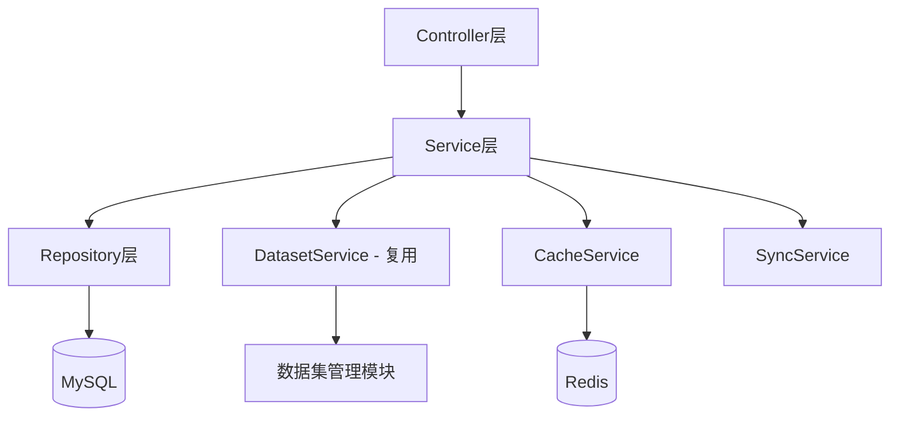
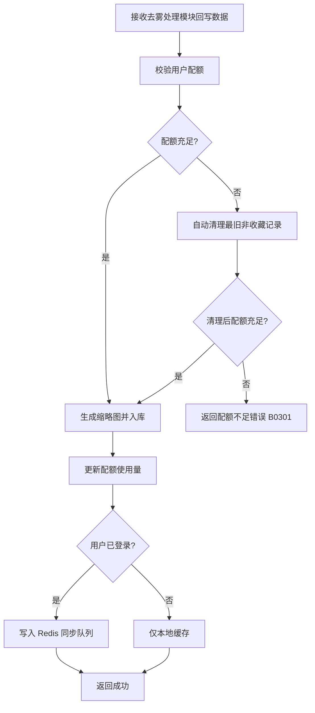
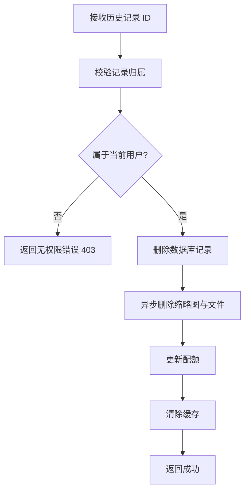
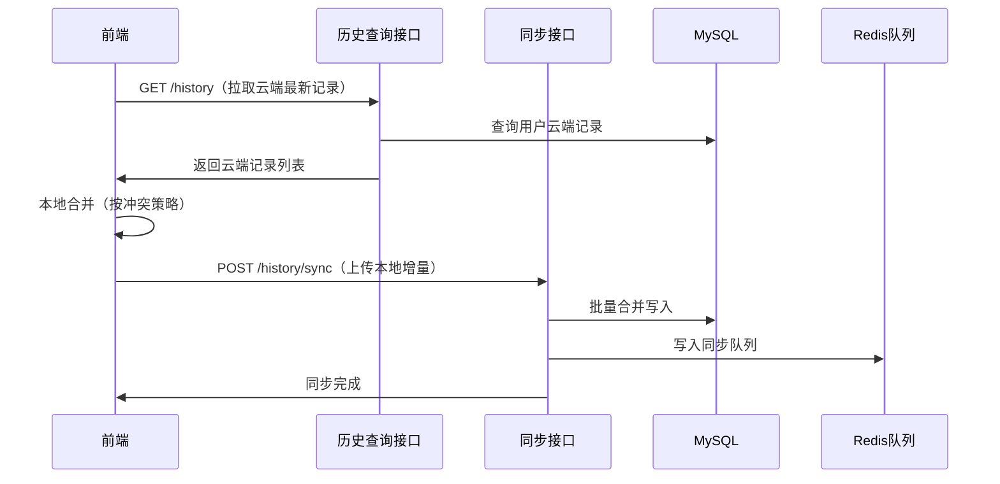

# 图像输入模块 - 后端实现设计

## 1. 文档概述

### 1.1 文档目的

本文档描述图像输入模块的后端实现方案，重点设计历史记录管理功能。图片上传和样例图片库功能复用数据集管理模块。

### 1.2 相关文档

- **需求规格**：[需求规格.md](./需求规格.md)
- **API 接口**：[API接口.md](./API接口.md)
- **数据库设计**：[02-系统架构/03-数据库设计.md](../../../02-系统架构/03-数据库设计.md)
- **收藏管理**：[收藏管理/后端实现.md](../../基础模块/收藏管理/后端实现.md)
- **推荐管理**：[推荐管理/后端实现.md](../../基础模块/推荐管理/后端实现.md)

## 2. 架构设计

### 2.1 模块分层架构

### 2.2 核心组件职责

| 组件 | 职责描述 |
|------|---------|
| ImageInputController | 历史记录 CRUD 接口 |
| HistoryService | 历史记录业务逻辑、配额管理 |
| HistoryRepository | 历史记录数据访问 |
| DatasetService（复用） | 图片上传、样例查询（复用数据集管理） |
| CacheService | Redis 缓存管理 |
| SyncService | 本地与云端同步逻辑 |

### 2.3 依赖基础模块

| 模块 | 依赖说明 |
|------|---------|
| 收藏管理 | 收藏状态由收藏管理模块统一管理（`sys_favorite` 表），本模块历史列表通过 JOIN `sys_favorite` 获取收藏状态 |
| 推荐管理 | 样例图片的推荐算法由推荐引擎动态生成，替代历史记录中的静态算法推荐 |

## 3. 功能复用说明

### 3.1 图片上传（复用数据集管理）

**复用接口**：
- `POST /api/v1/dataset-items/upload`：上传配对图片
- `POST /api/v1/item-files`：单独上传图片文件

**复用功能**：
- 文件格式验证（JPG/PNG/WEBP/HEIC）
- 文件大小限制（免费用户 10MB，VIP 20MB）
- 分辨率检测
- 智能压缩
- 对象存储文件存储
- 缩略图生成
- MD5 去重：复用数据集管理模块的文件管理能力，前端上传前计算文件 MD5 并查询，命中已有文件时复用文件引用跳过重复上传（详见 [需求规格 §2.1.7](./需求规格.md#217-md5-去重策略)）

**参考文档**：
- [数据集管理 API 接口 § 2.2](../数据集管理/API接口.md#22-数据项接口)
- [数据集管理后端实现 § 4.6](../数据集管理/后端实现.md#46-创建数据项并上传配对图片)

### 3.2 样例图片库（复用数据集管理）

**复用接口**：
- `GET /api/v1/dataset-items`：查询公开数据项

**复用功能**：数据项查询、分页、分类筛选、相关度排序。查询参数（isPublic/sceneType 等）由数据集管理模块定义，详见 [数据集管理后端实现 § 4.5](../数据集管理/后端实现.md#45-分页查询数据项列表)。

## 4. 核心业务逻辑设计

### 4.1 历史记录管理

> 表结构定义详见 [02-系统架构/03-数据库设计.md](../../../02-系统架构/03-数据库设计.md)。本模块涉及表：`sys_input_history`、`sys_user`、`sys_algorithm`、`sys_file`、`sys_favorite`。

#### 模块间协作

历史记录由**去雾处理模块**在处理完成/失败时通过本模块 `POST /api/v1/image-input/history` 接口回写（详见 [需求规格 §1.4.3 历史记录回写契约](./需求规格.md#143-历史记录回写契约)）；前端本地历史（localStorage）由前端在上传成功后自行创建，不走后端接口。

#### 历史记录创建

**业务流程**：

**配额规则**：用户配额（本地存储/云端存储/保留时长）按会员等级区分，详见 [需求规格 §2.4.2 存储策略](./需求规格.md#242-记录内容)。

#### 历史记录更新

| 项目 | 说明 |
|------|------|
| 触发场景 | 去雾处理状态变更（处理中 → 成功/失败）、结果图回写、算法参数修正 |
| 服务层设计 | HistoryService.updateById：校验记录归属 → 更新指定字段 → 失效相关缓存 → 触发增量同步 |
| 业务规则 | 仅允许更新本人记录；更新后向云端同步 |

#### 历史记录查询

**业务规则**：

| 规则 | 实现方式 |
|-----|---------|
| 用户隔离 | 仅返回当前用户的历史记录 |
| 时间分组 | 按 create_time 分组（今天/昨天/最近7天/更早） |
| 默认排序 | 按创建时间倒序 |
| 分页查询 | 支持分页 |
| 收藏过滤 | 通过 JOIN `sys_favorite`（target_type='result'）判断收藏状态，支持仅查收藏 |

**查询参数**：pageNum、pageSize、status（处理状态筛选）、inputSource（来源筛选）、isFavorite（仅查收藏）、startTime/endTime（时间范围）。

#### 历史记录删除

**单条删除**：

**批量删除**：遍历 ID 列表逐个校验归属，事务保证数据库删除成功后再删除文件，文件删除异步执行。

**清空历史**：删除当前用户所有历史记录，需前端传递 `confirm=true` 二次确认，大量数据删除走异步任务。

### 4.2 数据同步机制

#### 同步策略

**同步时机**：

| 触发时机 | 同步内容 | 同步方式 |
|---------|---------|---------|
| 用户登录 | 云端 → 本地 | 全量同步 |
| 创建记录 | 本地 → 云端 | 增量同步 |
| 更新记录 | 本地 → 云端 | 增量同步 |
| 删除记录 | 本地 → 云端 | 增量同步 |
| 手动同步 | 双向同步 | 全量同步 |
| 网络恢复 | 离线队列 → 云端 | 队列同步 |

**sync 接口职责边界**：`POST /api/v1/image-input/history/sync` 仅负责**接收前端上传的本地变更**（新增/更新/删除）并合并到云端；云端 → 本地的全量同步由 `GET /api/v1/image-input/history` 完成。同步流程如下：

#### 冲突处理

**冲突检测规则**：

| 冲突类型 | 检测条件 | 处理策略 |
|---------|---------|---------|
| 同一记录被修改 | 本地和云端 update_time 不一致 | 保留最新（按 update_time） |
| 重复创建 | original_image_url 相同 | 去重，保留最早记录 |
| 删除冲突 | 本地删除，云端已修改 | 以本地删除为准，不恢复记录，避免撤销用户删除意图 |

**冲突解决流程**：

1. 检测冲突记录
2. 按 update_time 比较
3. 保留最新记录
4. 更新本地或云端数据
5. 标记同步状态为已解决

#### 离线队列

**队列设计**：

- Redis List 存储离线操作
- Key：`history:offline:{userId}`
- 元素：JSON 格式的操作记录

**操作类型**：

| 操作 | 存储内容 |
|-----|---------|
| 创建 | 完整历史记录数据 |
| 更新 | ID + 更新字段 |
| 删除 | ID |

**队列处理**：

- 网络恢复后，依次执行队列中的操作
- 失败操作重新入队，最多重试 3 次
- 超过 3 次失败，记录错误日志

### 4.3 缩略图生成

**生成策略**：

| 场景 | 触发时机 | 生成方式 |
|-----|---------|---------|
| 上传图片 | 上传成功后 | 异步生成（复用数据集管理） |
| 处理完成 | 处理成功后 | 同步生成（结果图） |
| 历史记录 | 创建记录时 | 使用已有缩略图 |

**缩略图规格**：

| 类型 | 尺寸 | 质量 | 格式 |
|-----|------|------|------|
| 列表缩略图 | 150×150px | 80% | WebP/JPEG |
| 详情预览图 | 600×600px | 85% | WebP/JPEG |

**生成路径**：

- 原图：`/{rootPath}/history/{userId}/{recordId}/original.jpg`
- 缩略图：`/{rootPath}/history/{userId}/{recordId}/thumb_original.jpg`
- 结果图：`/{rootPath}/history/{userId}/{recordId}/result.jpg`
- 结果缩略图：`/{rootPath}/history/{userId}/{recordId}/thumb_result.jpg`

### 4.4 配额管理

**配额检查与自动清理逻辑**：

1. 创建历史记录前，查询用户当前记录数与会员等级对应上限对比
2. 配额充足 → 直接写入
3. 配额不足 → 触发自动清理：按 create_time 升序删除**非收藏**记录（通过 LEFT JOIN `sys_favorite` WHERE target_type='result' 过滤已收藏记录），删除数量 = 当前记录数 - 上限 + 1
4. 清理后仍不足（如所有记录均已收藏）→ 返回 B0301

**配额清理策略**：

| 清理类型 | 触发条件 | 清理规则 |
|---------|---------|---------|
| 自动清理 | 配额达到上限 | 删除最旧的非收藏记录（LEFT JOIN sys_favorite 判断是否已收藏） |
| 定时清理 | 每天凌晨 2 点 | 删除过期记录（按保留时长） |
| 手动清理 | 用户主动触发 | 按用户选择删除 |

## 5. 数据访问与数据依赖

> 表结构定义详见 [02-系统架构/03-数据库设计.md](../../../02-系统架构/03-数据库设计.md)

### 5.1 依赖表清单

| 表名 | 关联方式 | 说明 |
|-----|---------|------|
| sys_input_history | 主表 | 历史记录核心数据 |
| sys_user | 外键 user_id | 用户信息 |
| sys_algorithm | 外键 algorithm_id | 算法信息 |
| sys_file | 关联 original_image_url | 原始图片文件（复用数据集管理） |
| sys_favorite | JOIN target_type='result' AND target_id | 收藏状态（复用收藏管理） |

### 5.2 核心 Mapper 方法

**HistoryMapper**：

| 方法名 | 说明 |
|--------|------|
| selectByUserId | 查询用户历史记录（分页，LEFT JOIN sys_favorite 获取收藏状态） |
| selectByUserIdAndTimeRange | 按时间范围查询 |
| selectFavorites | 查询收藏记录（关联 sys_favorite，target_type='result'） |
| countByUserId | 统计用户记录数量 |
| deleteOldestNonFavorite | 删除最旧的非收藏记录（排除已收藏记录） |
| updateSyncStatus | 更新同步状态 |
| selectUnsynced | 查询未同步记录 |

## 6. 缓存设计

### 6.1 缓存 Key 规范

| 缓存对象 | 缓存 Key | TTL | 更新策略 |
|---------|---------|------|---------|
| 用户历史列表 | `history:list:{userId}:{page}` | 30 分钟 | 增删改时失效 |
| 历史记录详情 | `history:detail:{id}` | 1 小时 | 更新时失效 |
| 用户配额 | `history:quota:{userId}` | 1 小时 | 创建/删除时更新 |
| 离线队列 | `history:offline:{userId}` | 7 天 | 同步完成后清除 |
| 同步锁 | `history:sync:lock:{userId}` | 5 秒 | 同步完成后释放 |

### 6.2 缓存更新规则

| 操作 | 失效的缓存 Key |
|------|--------------|
| 创建记录 | `history:list:{userId}:*`, `history:quota:{userId}` |
| 更新记录 | `history:list:{userId}:*`, `history:detail:{id}` |
| 删除记录 | `history:list:{userId}:*`, `history:detail:{id}`, `history:quota:{userId}` |
| 同步记录 | `history:list:{userId}:*` |

### 6.3 缓存一致性策略

**双删策略**：

1. 删除缓存
2. 更新数据库
3. 延迟 100ms 再次删除缓存（防止并发导致的脏数据）

**分布式锁**：

- 同步操作使用 Redis 分布式锁，防止并发冲突
- 锁定时间：5 秒
- 锁定粒度：按用户 ID

## 7. 安全设计

### 7.1 数据权限

**用户隔离**：

- 所有查询和操作必须校验 `user_id = currentUserId`
- 防止越权访问其他用户的历史记录
- 权限校验：查询历史记录时校验 record.userId === currentUserId，不匹配返回 403

### 7.2 安全防护

| 防护项 | 实现方式 |
|--------|---------|
| SQL 注入 | 参数化查询（通用约束） |
| 越权访问 | 用户 ID 校验，用户隔离 |
| 数据泄露 | 敏感字段加密存储（如有需要） |
| 重复提交 | Redis 分布式锁，防止重复创建 |
| 配额限制 | 创建前校验配额，超限拒绝 |

## 8. 异步任务设计

### 8.1 定时任务

| 任务 | 执行频率 | 处理内容 |
|------|---------|---------|
| 过期记录清理 | 每天凌晨 2 点 | 删除超过保留期限的历史记录 |
| 未同步记录处理 | 每 10 分钟 | 重试失败的同步操作 |
| 缓存预热 | 每天凌晨 3 点 | 预加载活跃用户的历史记录 |

### 8.2 异步处理

**缩略图生成**：

- 事件：`HistoryCreatedEvent`
- 处理：异步生成缩略图，更新记录
- 失败策略：重试 3 次，记录失败日志

**文件删除**：

- 事件：历史删除事件
- 处理：异步删除存储文件
- 失败策略：记录到清理队列，定时重试

## 9. 性能目标

| 接口 | 目标 P99 | 优化手段 |
|------|----------|----------|
| 创建历史记录 | 300ms | 异步生成缩略图 |
| 查询历史列表 | 200ms | 分页查询 + 缓存 |
| 查询历史详情 | 100ms | 缓存 |
| 删除历史记录 | 200ms | 异步删除文件 |
| 同步历史记录 | 1s | 批量操作 + 异步处理 |

## 10. 配置项

| 配置项 | 说明 | 默认值 |
|--------|------|--------|
| history.quota.guest | 游客配额 | 20 |
| history.quota.user | 注册用户配额 | 100 |
| history.quota.vip | VIP 配额 | 500 |
| history.quota.enterprise | 企业版配额 | -1（不限） |
| history.retention.guest | 游客保留时长（天） | -1（清除浏览器数据后删除） |
| history.retention.user | 注册用户保留时长（天） | 30 |
| history.retention.vip | VIP 保留时长（天） | 90 |
| history.retention.enterprise | 企业版保留时长（天） | -1（永久） |
| history.thumbnail.width | 缩略图宽度 | 150px |
| history.thumbnail.quality | 缩略图质量 | 80% |
| history.sync.batch-size | 同步批次大小 | 100 |
| history.sync.retry-times | 同步重试次数 | 3 |
| history.cache.list-ttl | 列表缓存时间 | 30 分钟 |
| history.cache.detail-ttl | 详情缓存时间 | 1 小时 |

---

**文档版本**：v1.1.0
**最后更新**：2026-08-08
**维护者**：技术文档团队
