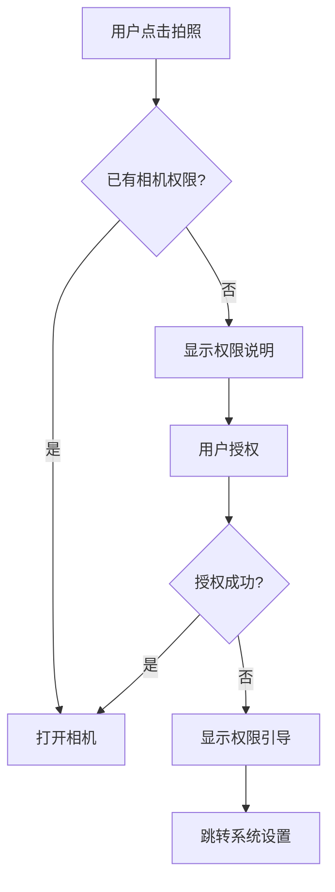

# 图像输入模块需求规格

## 1. 模块概述

### 1.1 模块定位

图像输入模块是用户使用系统的第一个接触点，负责提供多种图像输入方式，满足不同场景下的图像采集需求。作为整个图像处理流程的起点，本模块直接影响用户的首次体验和后续处理质量。

### 1.2 核心价值

| 价值维度 | 具体内容 |
|---------|---------|
| **多样化输入** | 支持上传、拍照、样例、历史记录4种输入方式 |
| **便捷体验** | 快速体验流程，10秒内完成样例选择 |
| **智能优化** | 自动压缩大图片，优化上传体验 |
| **历史管理** | 按会员等级保存处理记录，支持快速重新处理 |
| **跨平台支持** | Web、移动端、桌面端统一体验 |

### 1.3 业务目标

#### 用户体验目标
- **首次使用成功率**: ≥95%
- **平均完成时间**: &lt;30秒（从进入到选择完成）
- **快速体验流程**: &lt;10秒（样例图片流程）
- **用户满意度**: ≥4.5分（5分制）

#### 技术性能目标
- **图片上传速度**: &lt;3秒（5MB，WiFi环境）
- **相机启动时间**: &lt;1秒
- **历史记录加载**: &lt;500ms
- **样例库加载**: &lt;1秒

### 1.4 跨模块数据契约

图像输入模块作为处理流程起点，向上游数据集管理模块获取样例数据，向下游去雾处理模块输出图片输入，并从去雾处理日志回写历史记录。各输入方式的数据流转契约如下：

#### 1.4.1 输入方式数据来源

| 输入方式 | 数据来源 | 获取方式 | 关联接口 |
|---------|---------|---------|---------|
| **上传** | 用户本地文件 | 前端选择文件 → 调用数据集管理上传接口获取文件 URL | `POST /api/v1/item-files`（复用数据集管理） |
| **拍照** | 设备相机采集 | 前端调用相机能力 → 生成图片文件 → 走上传接口获取文件 URL | 复用上传接口 |
| **样例图片** | 数据集管理模块公开数据项 | 查询标记为"公开展示"的数据项 | `GET /api/v1/dataset-items`（复用数据集管理） |
| **历史记录** | 去雾处理模块预测日志（`sys_pred_log`） | 去雾处理完成后回写历史记录，本模块查询展示 | `GET /api/v1/image-input/history`（本模块） |

#### 1.4.2 输出给去雾处理的数据契约

无论哪种输入方式，最终输出给去雾处理模块的数据结构统一为：

| 字段 | 类型 | 说明 |
|------|------|------|
| **imageUrl** | String | 原始图片文件 URL（上传/拍照/样例/历史复用） |
| **taskType** | String | 任务类型（dehaze/derain/desnow/lowlight/super_resolution/denoise/inpainting），去雾处理按此路由算法集合 |
| **source** | String | 输入来源标识（upload/camera/sample/history），用于历史记录追溯 |
| **algorithmId** | Long | 可选，从样例推荐或历史记录携带的算法 ID |

> 去雾处理接口：`POST /api/v1/prediction`（见 [算法管理 API § 2.4 模型预测接口](../算法管理/API接口.md)）。

#### 1.4.3 历史记录回写契约

去雾处理完成后，处理结果数据回写至本模块历史记录：

| 回写字段 | 来源 | 说明 |
|---------|------|------|
| 原图 URL/缩略图 | 上传/拍照/样例阶段已生成 | 处理输入图片 |
| 结果图 URL/缩略图 | 去雾处理输出 | 处理完成后的结果图片 |
| 算法 ID/名称/参数 | 去雾处理请求参数 | 记录本次处理使用的算法与参数 |
| 处理状态 | 去雾处理结果（1 成功 / 2 失败 / 3 处理中） | 历史记录创建时确定，不随处理进度更新 |
| 处理耗时 | 去雾处理日志 | 单位：秒 |
| 来源标识 | 输入方式 | upload/camera/sample |

> 历史记录由去雾处理模块在处理完成/失败时通过本模块接口创建（`POST /api/v1/image-input/history`），前端本地历史（localStorage）由前端在上传成功后创建。

## 2. 功能需求详解

### 2.1 图像上传功能 (F-M01-001)

#### 2.1.1 功能描述

支持用户从本地相册/文件系统选择图片上传到系统，提供多种触发方式和智能处理能力。上传提示按任务类型区分：去雾提示上传有雾图片，超分辨率提示上传低分辨率图片，低光增强提示上传暗光图片，去雨提示上传带雨纹图片等。

#### 2.1.2 触发方式

| 触发方式 | 适用平台 | 说明 |
|---------|---------|------|
| **"上传图片"按钮** | 全平台 | 主界面明显位置的主要入口 |
| **拖拽上传** | Web/桌面端 | 拖拽图片到指定区域直接上传 |
| **快捷操作菜单** | 全平台 | 右键菜单或长按菜单快捷入口 |
| **剪贴板粘贴** | Web/桌面端 | Ctrl+V粘贴剪贴板图片 |

#### 2.1.3 支持格式

| 格式 | 说明 | 优先级 | 兼容性 |
|------|------|--------|--------|
| **JPG/JPEG** | 最常用格式，压缩率高 | P0 | 全平台支持 |
| **PNG** | 支持透明通道，无损压缩 | P0 | 全平台支持 |
| **WEBP** | 现代格式，体积更小 | P1 | 现代浏览器支持 |
| **HEIC** | iOS默认格式 | P1 | 需转码处理 |
| **BMP** | 无压缩位图 | P2 | 仅支持读取 |

**格式处理策略**：
- HEIC格式自动转换为JPEG
- BMP格式自动转换为PNG
- WEBP在不支持的平台自动转换为JPEG

#### 2.1.4 文件限制

| 限制项 | 免费用户 | VIP会员 | 高级VIP | 企业版 |
|--------|---------|---------|---------|--------|
| **单张大小** | 10MB | 20MB | 50MB | 不限 |
| **最大分辨率** | 4K (3840×2160) | 8K (7680×4320) | 不限 | 不限 |
| **最小分辨率** | 640×480 | 320×240 | 不限 | 不限 |
| **批量上传** | 5张 | 20张 | 100张 | 不限 |

> **批量上传与单图流程区分**：批量上传面向多图处理场景（如算法研究员批量测试、用户一次性处理相册），走独立的批量处理流程（选择多图 → 统一算法 → 逐张处理），不适用"完整流程 &lt;1 分钟"的单图体验目标。单图上传面向快速体验场景，从上传到查看结果完整流程 &lt;1 分钟（见 [产品概述 §10.1 核心体验指标](../../01-产品设计/01-产品概述.md)）。

**分辨率建议**：
- 最佳效果：1920×1080 ~ 3840×2160
- 可接受：640×480 ~ 7680×4320
- 不推荐：&lt;640×480（处理效果不明显）

#### 2.1.5 上传体验优化

##### 进度显示

**显示内容**：
- 上传进度条（0-100%）
- 已上传大小/总大小
- 预估剩余时间
- 上传速度（KB/s）

##### 取消与重试机制

| 场景 | 策略 | 说明 |
|------|------|------|
| **用户主动取消** | 立即终止上传 | 清理临时文件，释放资源 |
| **网络超时** | 自动重试3次 | 间隔：2秒、5秒、10秒 |
| **服务器错误** | 自动重试1次 | 间隔5秒，超时则提示用户 |
| **格式错误** | 不重试 | 直接提示错误原因 |

##### 智能压缩策略

根据原始图片大小自动调整压缩策略，优化上传体验：

| 原始大小 | 压缩策略 |
|---------|---------|
| &lt;2MB | 不压缩 |
| 2-5MB | 轻度压缩 |
| 5-10MB | 标准压缩 |
| >10MB | 强力压缩 |

**压缩流程**：
1. 检测原始图片大小
2. 判断是否需要压缩
3. 显示压缩预览对比
4. 用户确认后开始压缩
5. 上传压缩后的图片

#### 2.1.6 错误处理

| 错误类型 | 错误代码 | 错误提示 | 处理方式 | 恢复建议 |
|---------|---------|---------|---------|---------|
| **文件过大** | A0702 | "图片大小超过{limit}MB，请选择较小的图片" | 阻止上传 | 提供压缩选项 |
| **格式不支持** | A0701 | "不支持该图片格式，请选择JPG/PNG/WEBP/HEIC格式" | 阻止上传 | 显示支持格式列表 |
| **网络异常** | B0002 | "网络连接失败，请检查网络后重试" | 提供重试按钮 | 检查网络状态 |
| **上传失败** | B0003 | "上传失败，已自动重试(X/3)" | 自动重试 | 重试3次后人工介入 |
| **分辨率不足** | A0703 | "图片分辨率过低（{width}×{height}），建议使用≥640×480的图片" | 警告但允许 | 提示可能效果不佳 |
| **权限不足** | A0301 | "暂无上传权限，请联系管理员" | 阻止上传 | 引导升级VIP |

#### 2.1.7 MD5 去重策略

为实现产品战略要求的"图像文件去重处理（MD5 校验）"（见 [产品概述 §4.2](../../01-产品设计/01-产品概述.md)），上传前对文件计算 MD5 指纹，命中已有文件时直接复用文件引用，跳过重复存储与传输。

##### 去重流程

```
用户选择文件
    ↓
前端计算文件 MD5（Web Crypto API / spark-md5）
    ↓
调用文件查询接口校验 MD5 是否已存在
    ↓
┌── 命中：直接复用已有文件 URL，跳过上传
└── 未命中：正常上传文件 → 后端注册文件记录（含 MD5）
```

##### 去重规则

| 规则项 | 说明 |
|--------|------|
| **拦截点** | 上传请求发起前（文件选择/预览阶段计算 MD5 并查询） |
| **命中处理** | 跳过重复存储，复用已存在文件引用（返回已有文件 URL），前端无需重复上传文件流 |
| **未命中处理** | 正常上传，后端注册文件记录时写入 MD5 指纹供后续去重查询 |
| **去重粒度** | 文件内容级（相同二进制内容即视为重复，与文件名无关） |
| **适用范围** | 上传、拍照两种输入方式（拍照生成的图片同样走上传接口） |

> **说明**：MD5 去重的文件查询与注册复用数据集管理模块的文件管理能力（见 [跨模块数据契约 §1.4](#14-跨模块数据契约)），本模块不单独维护文件指纹存储。

---

### 2.2 拍照功能 (F-M01-002)

#### 2.2.1 功能描述

支持用户使用设备相机实时拍摄图片，适用于移动端和桌面端（带摄像头）。

#### 2.2.2 相机能力

##### 基础功能

| 功能 | 说明 | 适用平台 |
|------|------|---------|
| **前后摄像头切换** | 点击切换按钮切换摄像头 | 移动端 |
| **闪光灯控制** | 自动/开启/关闭三种模式 | 移动端 |
| **对焦点选择** | 点击屏幕任意位置对焦 | 全平台 |
| **网格线辅助** | 九宫格构图辅助线 | 全平台 |
| **变焦控制** | 双指缩放或滑块调节 | 全平台 |

##### 拍照模式

仅提供**标准模式**，满足图像处理输入的基本采集需求。图像质量增强（去雾/低光增强等）由后端 AI 算法处理，不在采集阶段介入，避免与处理算法职责重叠。

#### 2.2.3 预览功能

##### 拍照后操作

| 操作 | 说明 | 快捷键 |
|------|------|--------|
| **预览查看** | 查看刚拍摄的照片 | - |
| **确认使用** | 使用当前照片进行处理 | Enter |
| **重新拍摄** | 放弃当前照片重新拍 | Esc |
| **简单裁剪** | 裁剪不需要的区域 | - |
| **旋转调整** | 90度旋转图片 | R |

#### 2.2.4 权限处理

##### 相机权限请求流程



##### 权限说明文案

**首次请求**：
> 📷 **需要相机权限**
>
> 为了拍摄需要处理的图片，我们需要访问您的相机。
>
> 您的隐私很重要，我们不会存储或共享您的照片，除非您明确选择上传。
>
> [允许] [稍后]

**被拒绝后**：
> 🚫 **相机权限被拒绝**
>
> 无法访问相机功能。请在系统设置中允许相机权限。
>
> [跳转设置] [返回]

---

### 2.3 样例图片库 (F-M01-003)

#### 2.3.1 功能描述

提供预置的样例图片，供用户快速体验系统功能。样例图片来源于【数据集管理模块】中标记为"公开展示"的图片，按任务类型（task_type）分类。

#### 2.3.2 样例图片分类

样例图片按任务类型组织，用户先选择任务类型再浏览对应样例。以去雾任务为例：

| 分类 | 图片数量 | 场景描述 | 推荐算法 |
|------|---------|---------|---------|
| **城市建筑** | 15张 | 城市街景、高楼大厦、桥梁道路 | WPXNet、RIDCP |
| **自然风景** | 15张 | 山川、湖泊、森林、海洋 | Dehamer、FFA-Net |
| **人像场景** | 5张 | 户外人物摄影 | GridDehazeNet |
| **夜景雾霾** | 5张 | 夜间灯光下的雾霾场景 | MSBDN |

**退化程度标签（按任务类型区分）**：

去雾(dehaze)：
- 🟢 **轻度雾霾**：能见度>3km，图像对比度略微下降
- 🟡 **中度雾霾**：能见度1-3km，图像明显模糊
- 🔴 **重度雾霾**：能见度&lt;1km，图像严重退化

其他任务类型同理（如去雨：小雨/中雨/大雨；低光增强：轻度/中度/极暗等）。

#### 2.3.3 展示方式

样例图片采用网格布局展示，支持：
- 自动适应屏幕宽度
- 延迟加载（Lazy Load）
- 下拉刷新更多样例

##### 交互操作

| 交互操作 | 响应效果 |
|---------|---------|
| **点击缩略图** | 放大查看详情 |
| **长按显示信息** | 显示图片元数据 |
| **滑动浏览** | 切换同类别图片 |
| **一键选择** | 自动加载到处理区 |
| **对比查看** | 显示处理前后对比 |

#### 2.3.4 快速体验流程

用户可快速体验系统功能：
1. 点击"快速体验"进入样例图片库
2. 选择任务类型（去雾/去雨/去雪/低光/超分/去噪/修复）
3. 选择分类（可选）
4. 点击样例图片
5. 自动加载到处理区
6. 自动应用推荐算法
7. 显示处理进度
8. 直接查看对比结果

**目标用时**：&lt;10秒

**优化措施**：
- 样例图片预加载
- 推荐算法预配置
- 自动开始处理

#### 2.3.5 样例图片元数据

每张样例图片包含以下信息：

| 字段 | 说明 | 示例 |
|------|------|------|
| **图片名称** | 便于识别的名称 | "城市建筑-轻度雾霾01" |
| **任务类型** | task_type | "dehaze" |
| **场景类型** | 分类标签 | "城市建筑" |
| **退化程度** | 按任务类型区分的退化程度 | 去雾："轻度/中度/重度" |
| **难度等级** | 处理难度 | ⭐⭐⭐⭐⭐ (1-5星) |
| **推荐算法** | 最佳算法 | "RIDCP" |
| **图片尺寸** | 分辨率 | "1920×1080" |
| **拍摄地点** | 可选 | "北京市海淀区" |
| **拍摄时间** | 可选 | "2023-11-15" |

---

### 2.4 历史记录 (F-M01-004)

#### 2.4.1 功能描述

保存用户最近的处理记录，支持快速重新处理、更换算法、分享结果等操作。

#### 2.4.2 记录内容

##### 基本信息

| 字段 | 说明 | 存储位置 |
|------|------|---------|
| **原始图片缩略图** | 150×150px | 本地缓存 |
| **处理结果缩略图** | 150×150px | 本地缓存 |
| **处理时间** | YYYY-MM-DD HH:mm:ss | 数据库 |
| **算法名称** | 使用的算法 | 数据库 |
| **算法参数** | JSON格式 | 数据库 |
| **处理状态** | 成功/失败/处理中 | 数据库 |
| **处理耗时** | 秒为单位 | 数据库 |
| **图片来源** | 上传/拍照/样例 | 数据库 |

##### 存储策略

| 用户类型 | 本地存储 | 云端存储 | 保留时长 |
|---------|---------|---------|---------|
| **游客** | 最近20条 | 不存储 | 清除浏览器数据后删除 |
| **注册用户** | 最近20条 | 最近100条 | 30天 |
| **VIP会员** | 最近50条 | 最近500条 | 90天 |
| **企业版** | 最近100条 | 全部记录 | 永久保存 |

#### 2.4.3 展示方式

历史记录按时间分组显示：
- 今天：当日0点后的记录，时间倒序
- 昨天：昨日0点到今日0点的记录，时间倒序
- 最近7天：过去7天的记录，按天分组
- 更早：7天前的记录，按月分组

#### 2.4.4 快速操作

| 操作 | 说明 | 预期效果 |
|------|------|---------|
| **重新处理** | 使用相同图片和算法重新处理 | 跳转到处理页面，自动开始 |
| **更换算法** | 使用相同图片，更换算法处理 | 跳转到算法选择页面 |
| **查看详情** | 查看完整的处理信息和对比结果 | 全屏显示对比效果 |
| **下载结果** | 下载处理后的图片 | 保存到本地 |
| **分享结果** | 分享处理结果 | 生成分享链接或图片 |
| **删除记录** | 删除该条历史记录 | 确认后删除 |
| **添加收藏** | 收藏优秀的处理结果 | 加入收藏夹 |

#### 2.4.5 数据管理

##### 清理策略

| 清理类型 | 触发方式 | 确认提示 | 可恢复性 |
|---------|---------|---------|---------|
| **手动清理** | 点击"清空历史记录" | 二次确认弹窗 | 无法恢复 |
| **自动清理** | 超过存储上限 | 无 | 无法恢复 |
| **选择性清理** | 多选→删除 | 批量确认 | 无法恢复 |
| **过期清理** | 定时任务（每天） | 无 | 无法恢复 |

---

## 3. 交互流程设计

### 3.1 主要交互流程

用户进入主界面后，可选择以下4种输入方式：
1. **上传图片**：选择本地图片 → 预览确认 → 算法选择 → 处理
2. **拍照**：打开相机 → 拍摄 → 预览确认 → 算法选择 → 处理
3. **样例图片**：浏览样例库 → 选择图片 → 自动加载 → 处理
4. **历史记录**：查看历史 → 选择记录 → 重新处理或更换算法

### 3.2 异常处理流程

针对不同操作类型的异常处理：
- **上传**：异常类型、错误码与处理方式见 §2.1.6 错误处理表
- **拍照**：检查权限 → 无权限则请求授权 → 失败则引导系统设置
- **样例**：加载样例 → 失败则提示重新加载
- **历史**：加载历史 -> 失败则提示检查网络

---

## 交互规范

### 页面布局

| 页面 | 布局要点 |
|------|---------|
| 上传页 | 拖拽上传区域居中，支持剪贴板粘贴，移动端展示拍照入口，按任务类型区分上传提示 |
| 历史记录页 | 网格展示处理记录缩略图，按时间分组（今天/昨天/最近7天/更早），支持批量选择 |
| 样例图片库 | 按任务类型分类，网格布局展示，延迟加载，支持一键选择 |
| 预览交互 | 点击图片打开抽屉预览，展示元数据（名称/尺寸/格式/来源） |

### 关键交互行为

各交互行为（拖拽/粘贴上传、上传进度与取消、智能压缩、历史记录操作）的行为细节见 §2.1.5/§2.1.2 与 §2.4.4，本节仅列出交互增量：

| 场景 | 交互行为 |
|------|---------|
| 拖拽上传 | 拖拽图片到指定区域，高亮提示释放上传 |

### 操作反馈

| 场景 | 反馈行为 |
|------|---------|
| 上传成功/失败、拍照权限被拒 | 反馈行为见 §2.1.6 错误处理表与 §2.2.4 权限处理 |
| 历史记录清空 | 二次确认"确认清空历史记录？此操作不可恢复" |
| 文件过大 | 提示"图片大小超过{limit}MB，请选择较小的图片" |

---

## 4. 非功能性需求

### 4.1 性能指标

| 性能指标 | 目标值 | 适用场景 |
|---------|--------|---------|
| **图片上传时间** | &lt;3秒 | 5MB，WiFi环境 |
| **图片压缩时间** | &lt;1秒 | 10MB→2MB |
| **拍照响应时间** | &lt;500ms | 从点击到拍摄 |
| **相机启动时间** | &lt;1秒 | 从请求到显示 |
| **历史记录加载** | &lt;500ms | 20条记录 |
| **样例库加载** | &lt;1秒 | 40张缩略图 |
| **图片预览加载** | &lt;300ms | 单张预览 |

### 4.2 平台支持

| 平台 | 最低版本 |
|------|---------|
| **Android** | 8.0+ |
| **iOS** | 13.0+ |
| **Web - Chrome** | 90+ |
| **Web - Firefox** | 88+ |
| **Web - Safari** | 14+ |
| **Web - Edge** | 90+ |
| **macOS** | 11.0+ |
| **Windows** | 10+ |

### 4.3 屏幕适配

支持以下屏幕尺寸范围：
- 手机竖屏：360×640 ~ 428×926
- 手机横屏：640×360 ~ 926×428
- 平板竖屏：768×1024 ~ 1024×1366
- 平板横屏：1024×768 ~ 1366×1024
- 桌面端：1280×720 ~ 3840×2160

---

## 5. 安全与隐私

### 5.1 数据安全

#### 图片数据保护

| 保护措施 | 说明 |
|---------|------|
| **传输加密** | 数据传输需加密 |
| **存储加密** | 敏感图片加密存储 |
| **访问控制** | 用户隔离，每个用户只能访问自己的图片 |
| **临时文件清理** | 处理完成后定时删除临时文件 |
| **水印保护** | 可选水印，防止图片被盗用 |

#### 权限控制

1. 检查文件大小限制
2. 检查上传配额
3. 检查格式权限

### 5.2 隐私保护

#### 隐私政策要点

1. **数据收集说明**
   - 明确告知收集哪些数据
   - 说明数据用途和保留时长
   - 提供数据删除选项

2. **用户控制**
   - 用户可查看所有已上传图片
   - 用户可随时删除任何图片
   - 提供数据导出功能

3. **第三方共享**
   - 不向第三方共享用户图片
   - 仅在法律要求时提供数据

#### 隐私设置选项

| 设置项 | 默认值 | 说明 |
|--------|--------|------|
| **自动删除临时文件** | 开启 | 处理完成24小时后自动删除 |
| **保存处理历史** | 开启 | 关闭后不保存历史记录 |
| **允许样例展示** | 关闭 | 是否允许将处理结果作为样例 |

---

## 6. 多平台适配

### 6.1 Web端特性

| 特性 | 说明 |
|------|------|
| **拖拽上传** | 支持拖拽图片到指定区域直接上传 |
| **剪贴板粘贴** | 支持Ctrl+V粘贴剪贴板图片 |
| **PWA支持** | 支持离线使用和桌面安装 |
| **离线缓存** | 支持离线缓存数据 |
| **文件系统访问** | 支持直接访问文件系统 |

### 6.2 移动端特性

#### iOS特性

| 特性 | 说明 |
|------|------|
| **HEIC格式处理** | 支持处理HEIC格式图片（自动转换为JPEG） |

#### Android特性

| 特性 | 说明 |
|------|------|
| **相机能力** | 调用系统相机能力提供标准拍照功能 |
| **存储规范** | 遵循移动端系统存储规范 |

### 6.3 桌面端特性

| 特性 | Windows | macOS | Linux |
|------|---------|-------|-------|
| **文件关联** | 支持 | 支持 | 支持 |
| **右键菜单** | 支持 | 支持 | 支持 |
| **系统托盘** | 支持 | 支持 | 支持 |
| **开机启动** | 支持 | 支持 | 支持 |
| **快捷键** | 支持 | 支持 | 支持 |

---

## 待确认事项

1. **历史记录保留期限**：历史记录保留期限（当前按用户类型 30/90天/永久）是否需要统一或可配置？
2. **本地与云端同步冲突**：本地历史（localStorage）与云端历史的同步冲突如何处理（如多设备操作）？
3. **样例图片更新**：样例图片库的更新频率与来源审核流程？
4. **拍照隐私合规**：拍照功能采集的图片是否上传服务器？隐私政策是否需明确说明？
5. **批量上传体验**：批量上传的并发控制与失败重试策略是否需要用户可见？

---

## 8、附录

### 8.1 术语表

| 术语 | 英文 | 说明 |
|------|------|------|
| **去雾** | Dehazing | 去除图像中雾霾影响的处理过程 |
| **PSNR** | Peak Signal-to-Noise Ratio | 峰值信噪比，图像质量评价指标 |
| **SSIM** | Structural Similarity Index | 结构相似性指标 |
| **RAW格式** | RAW Format | 相机原始数据格式 |
| **瀑布流** | Waterfall Layout | 不规则的多列布局方式 |
| **懒加载** | Lazy Loading | 延迟加载，按需加载资源 |
