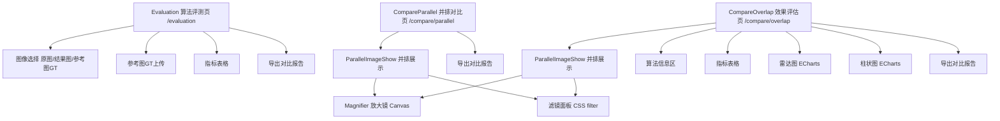

# 效果对比模块 - 前端实现设计

## 1. 文档概述

本文档描述效果对比模块的前端实现方案（dehaze-front-vue），聚焦组件结构、状态管理、路由与关键交互决策。效果对比模块承接去雾处理模块的输出，提供并排对比、放大镜、滤镜调节、量化评估与报告导出能力。功能需求与业务规则详见 [需求规格.md](./需求规格.md)，API 契约详见 [API接口.md](./API接口.md)。

---

## 2. 组件树设计

### 2.1 组件树

### 2.2 组件职责

| 组件 | 职责 | 复用性 |
|------|------|--------|
| Evaluation | 算法评测页容器：图像选择 + 参考图上传 + 指标计算 + 报告导出 | 页面 |
| CompareParallel | 并排对比页容器：并排展示 + 导出 HTML 报告 | 页面 |
| CompareOverlap | 效果评估页容器：并排展示 + 算法信息 + 量化指标 + 导出 HTML 报告 | 页面 |
| ParallelImageShow | 并排图片展示核心：自适应布局、同步缩放、放大镜、滤镜、标签 | 高度可复用 |
| Magnifier | 放大镜 Canvas 渲染（形状/倍数/大小） | 可复用 |
| DraggableLine | 拖拽分隔线（通用组件） | 通用组件 |

---

## 3. 状态管理

### 3.1 imageShow Store（核心）

| 状态字段 | 类型 | 说明 |
|---------|------|------|
| imageInfo.images.urls | array | 图片列表（url/label/id），用于并排展示 |
| imageInfo.brightness/contrast/saturate | number | 滤镜参数 |
| imageInfo.width/height | number | 图片显示尺寸 |
| magnifierInfo | object | 放大镜配置（enabled/shape/width/height/zoomLevel） |
| scaleX/scaleY | number | 原图与显示尺寸的比例（放大镜绘制用） |
| mouse.x/mouse.y | number | 鼠标位置 |
| modelId | number | 当前算法 ID |

### 3.2 页面局部状态

去雾参数（dehazeParams：去雾强度/色彩饱和度/对比度/锐化程度）从去雾处理页经 `route.query.params` 传入，默认 50/50/50/30，页面局部持有用于参数对比展示。评估任务状态（taskId/status/指标结果）为页面局部状态。

---

## 4. 路由设计

| 路由路径 | 页面 | 说明 |
|---------|------|------|
| `/compare/parallel` | CompareParallel | 并排对比页（keepAlive） |
| `/compare/overlap` | CompareOverlap | 效果评估页（keepAlive） |
| `/evaluation` | Evaluation | 算法评测页（keepAlive） |

- **受保护路由**：三个页面均为登录用户路由，导航守卫校验登录态。评估接口的会员配额校验由后端执行，配额不足返回业务错误前端展示提示。
- **跨页跳转**：去雾处理完成 -> 跳转 `/evaluation`（携带 logId 与去雾参数）；不满意结果 -> 返回算法选择页更换算法。

---

## 5. 数据流

### 5.1 评估流程

页面加载自动提交评估任务，轮询状态（1 处理中 / 2 已完成 / 3 失败），完成后将指标写入表格与图表。轮询契约详见 [API接口.md](./API接口.md) §2.1。

### 5.2 对比报告导出流程

点击"导出对比报告" -> 提交报告生成请求（仅 logId 参数）-> 立即返回 taskId + status=1 -> 轮询报告状态（间隔 2s）-> status=2 触发 HTML 文件下载 / status=3 展示失败原因。轮询契约详见 [API接口.md](./API接口.md) §2.2。

### 5.3 模块间数据交互

| 交互方向 | 数据 | 说明 |
|---------|------|------|
| 去雾处理 -> 效果对比 | logId + 去雾参数 | 处理完成跳转至评估页 |
| 效果对比 -> 算法选择 | 原图信息 | 不满意结果时返回算法选择重新处理 |

---

## 6. 交互设计决策

### 6.1 放大镜 Canvas 渲染

按住鼠标拖动显示放大镜画布，实时绘制鼠标附近区域。放大镜参数（形状/倍数/宽高）通过 Store 管理，多张图片同步显示放大镜窗口。绘制使用 Canvas `drawImage`，按 `scaleX/scaleY` 换算原图像素坐标，仅重绘鼠标附近区域以优化性能。

### 6.2 滤镜实时预览

滤镜参数变更后使用 CSS filter 属性直接应用于图片（`contrast() brightness() saturate()`），无需重新请求后端。滤镜参数范围与默认值详见 [需求规格.md §2.4.2](./需求规格.md)。

### 6.3 评估指标可视化

使用 ECharts 渲染雷达图和柱状图。雷达图各维度使用固定指标上限，保证不同评估结果横向可比、禁止动态缩放；柱状图展示各项指标数值；指标表格展示指标名、数值、方向标记与描述。固定上限与表格展示格式详见 [需求规格.md §2.5.3](./需求规格.md)。

### 6.4 对比报告导出

报告格式固定为 HTML，不提供 PDF/PNG 导出选项。报告内容含图片对比区、处理信息区、评估指标区、处理参数与默认值对比。请求体仅 logId，指标与处理参数默认纳入报告。

### 6.5 性能优化

| 优化项 | 实现方式 |
|--------|---------|
| 图片预加载 | 图片 onload 后统一调整尺寸布局 |
| Canvas 放大镜 | 局部绘制，仅重绘鼠标附近区域 |
| 滤镜 CSS 实现 | 滤镜参数直接映射 CSS filter，无后端请求 |
| 图表按需渲染 | 指标区域渲染时初始化 ECharts |

---

## 7. 公共组件使用

| 公共组件 | 用途 | 配置要点 |
|---------|------|---------|
| ECharts 图表组件 | 雷达图/柱状图 | 按需渲染 |
| 指标表格组件 | 指标名/数值/方向标记/描述 | 数值保留 4 位小数，方向标记区分越高/越低越好 |
| 报告导出组件 | 异步生成 HTML 报告 | 提交后轮询状态，完成后触发文件下载 |
| ParallelImageShow | 并排图片展示 | 跨三个页面复用（职责见 §2.2） |
