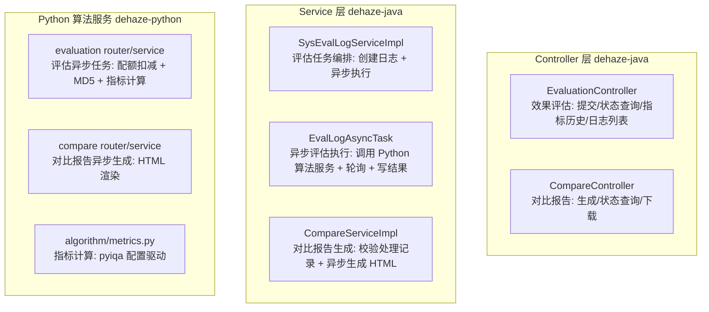

# 效果对比模块 - 后端实现设计

## 1. 文档概述

### 1.1 文档目的

本文档描述效果对比模块的后端实现方案，包括服务层设计、核心业务流程（效果评估、对比报告生成）、评估指标计算、异步任务设计与模块间协作。该模块在 dehaze-java、dehaze-python 两端实现。

---

## 2. 架构设计

### 2.1 模块分层架构

### 2.2 核心组件职责

| 组件 | 职责描述 | 关键能力 |
|------|---------|---------|
| SysEvalLogServiceImpl | 评估任务编排 | 校验算法、解析图片 URL、创建 sys_eval_log、触发异步执行 |
| EvalLogAsyncTask | 异步评估执行 | 调用 Python 评估、轮询 Python 任务（2s/300s）、回写指标结果、监控埋点 |
| CompareServiceImpl | 对比报告生成 | 校验处理记录完成态、创建报告任务（复用 sys_eval_log）、异步生成 HTML |
| evaluation_service (Python) | 评估执行 | 权益配额扣减、并行下载图片、MD5 计算、指标计算、任务状态流转 |
| compare_service (Python) | 报告生成 | 校验处理记录、异步渲染 HTML 报告、任务状态流转 |

---

## 3. 核心业务流程

### 3.1 效果评估流程

效果评估为计算密集型任务，采用异步任务模式避免长耗时请求超时。

#### 3.1.1 Java 端编排（SysEvalLogServiceImpl.evaluate）

| 步骤 | 说明 |
|------|------|
| 校验算法 | 确认 algorithmId 对应算法存在 |
| 解析图片 URL | 支持 predFileId/gtFileId 转 URL |
| 创建日志 | 写入 sys_eval_log，status=1 处理中 |
| 触发异步执行 | 交由 EvalLogAsyncTask 异步处理 |
| 立即返回 | { logId, status=1 } |

#### 3.1.2 Java 端异步执行（EvalLogAsyncTask.execute）

| 步骤 | 说明 |
|------|------|
| 调用 Python 评估 | 异步调用 /evaluation 接口 |
| 轮询任务状态 | 2s 间隔，300s 超时 |
| 完成回写 | 从 Python 获取 metrics 写入 result 字段，status=2 |
| 失败回写 | 写入 errorMessage，status=3 |
| 监控埋点 | 上报 dehaze_evaluation_total{status} |

#### 3.1.3 Python 端评估执行（evaluation_service）

| 步骤 | 说明 |
|------|------|
| 配额扣减 | check_and_deduct_quota("evaluate")，Redis 原子操作，失败恢复配额 |
| 并行下载图片 | 下载预测图/参考图，计算并记录 pred_md5 / gt_md5 |
| 后台执行 | asyncio.create_task 异步执行 |
| 指标计算 | 调用 algorithm/metrics.py，线程池执行避免阻塞事件循环 |
| 任务状态流转 | 维护 Python 侧任务状态（completed/failed），供 Java 端轮询 |

#### 3.1.4 日志归属与失败回写

sys_eval_log 由 Java 端统一管理，评估日志与配额扣减的分工如下：

| 关注点 | 设计决策 |
|--------|---------|
| 日志归属 | sys_eval_log 由 Java 端创建（status=1）并统一回写终态；Python 端不写 sys_eval_log，仅维护任务状态供 Java 端轮询 |
| 配额扣减 | 集中在 Python 算法服务侧（与去雾处理模块一致），扣减失败时 Python 任务状态置为 failed |
| 失败回写 | Java 端轮询到 failed 状态后回写 sys_eval_log status=3 并写入 errorMessage |
| 超时处理 | Java 端轮询 300s 超时未获终态时回写 status=3，避免 processing 状态残留 |

### 3.2 对比报告生成流程

对比报告为耗时操作，通过异步任务实现。

#### 3.2.1 报告任务创建（CompareServiceImpl.generateReport）

| 步骤 | 说明 |
|------|------|
| 校验处理记录 | 查询 sys_pred_log，确认存在且已完成 |
| 创建报告任务 | 复用 sys_eval_log 表，status=1 处理中；pred_url=处理结果图 URL，gt_url=原图 URL；result 字段存请求元数据（logId 等） |
| 触发异步生成 | 交由 generateReportAsync 异步执行 |
| 立即返回 | { taskId, status=1 } |

#### 3.2.2 异步生成 HTML（generateReportAsync）

| 步骤 | 说明 |
|------|------|
| 查询算法名称 | 用于报告头部展示 |
| 渲染 HTML | 原图+结果图并排、算法名称/ID、生成时间 |
| 完成回写 | status=2，result 写入报告 HTML 与生成时间（JSON 结构见 §5.3） |
| 失败回写 | status=3，写入 errorMessage |

### 3.3 报告下载与查询

报告状态查询与下载接口契约（含 `?download=true` 返回 HTML 文件流）以 [API接口.md §2.2](./API接口.md) 为准。实现侧：`download=true` 且任务已完成时，后端读取 `result.reportHtml` 并以 `Content-Type: text/html` 返回 HTML 文件流。

---

## 4. 评估指标计算

### 4.1 指标体系

评估指标体系（PSNR/SSIM/LPIPS/NIQE/NIMA/BRISQUE 的定义、是否需参考图、方向、合格阈值、计算规则）详见[需求规格.md §2.5.2](./需求规格.md)。

指标计算由 Python 算法服务 `algorithm/metrics.py` 统一配置（`METRICS_CONFIG`），基于 pyiqa 计算，模型按需延迟加载，线程池执行避免阻塞事件循环。

### 4.2 计算流程

| 步骤 | 说明 |
|------|------|
| 下载图片 | Python 端并行下载预测图/参考图 |
| 指标计算 | 调用 algorithm/metrics.py calculate()，遍历 METRICS_CONFIG，按 requires_clear 与 clear 是否提供决定是否计算 |
| 返回指标列表 | [{label, value, better, description}] |
| 写入日志 | 写入 sys_eval_log.result（JSON），status=2 |

### 4.3 评估缓存

评估计算结果按 `{algorithmId}:{predMd5}:{refMd5}` 缓存，相同图对重复评估命中缓存直接返回（≤ 2s），对齐[需求规格.md §9.2](./需求规格.md) 评估 SLA。

| 项目 | 说明 |
|------|------|
| 缓存对象 | 评估指标计算结果 |
| 缓存 Key | {algorithmId}:{predMd5}:{refMd5} |
| Key 数据来源 | pred_md5 / gt_md5 在 Python 端图片下载阶段计算并记录 |
| 命中处理 | 服务层命中缓存直接返回（≤ 2s），跳过指标计算，回写 sys_eval_log 为 status=2 |

---

## 5. 对比报告

### 5.1 报告内容

报告为服务端渲染的 HTML，内容模块（报告头部、图片对比区、处理信息区、评估指标区、处理参数区）详见[需求规格.md §2.8.3](./需求规格.md)。报告 HTML 直接存于 `sys_eval_log.result` JSON 字段。

### 5.2 异步生成

| 配置项 | 说明 |
|--------|--------|
| 任务载体 | sys_eval_log 表（taskId 即评估日志 ID） |
| 执行模式 | Java：@Async("datasetTaskExecutor")；Python：asyncio.create_task |
| 状态流转 | 1 处理中 → 2 已完成 / 3 失败 |
| 报告保留 | 无固定保留时长，随 sys_eval_log 记录保留 |

### 5.3 结果存储与访问安全

| 项目 | 说明 |
|------|------|
| 存储位置 | sys_eval_log.result（JSON：{"reportHtml": "...", "generatedAt": "..."}） |
| 下载方式 | GET /api/v1/compare/report/{taskId}?download=true 返回 HTML 文件流 |
| 用户隔离 | 报告查询/下载按 userId 校验归属，仅报告归属用户可访问，防越权下载 |

---

## 6. 模块间协作

### 6.1 与算法管理模块的集成

| 调用场景 | 调用接口 | 说明 |
|---------|---------|------|
| 校验算法存在 | 算法查询接口 | 评估与报告生成前校验算法 |
| 获取算法信息 | 算法详情接口 | 展示算法名称/类型/权重/参数量，报告头部展示算法名称 |

### 6.2 与会员管理模块的集成

| 集成点 | 实现方式 |
|--------|---------|
| 评估配额扣减 | Python 端 MemberService.check_and_deduct_quota("evaluate")，Redis 原子扣减，失败恢复 |
| 报告导出开关 | 权益表 `report_export` 各等级均开启，接口层不按等级差异化校验（见[需求规格.md §4.1](./需求规格.md)） |

> **说明**：Java 端评估不接入配额扣减（与去雾处理模块一致，配额扣减集中在 Python 算法服务侧）。

### 6.3 与收藏管理模块的集成

对比页面不集成收藏入口，收藏能力通过收藏管理模块独立使用（见[需求规格.md §6](./需求规格.md)）。

### 6.4 与消息通知模块的集成

报告生成完成、评估完成均无消息通知，前端通过轮询获取结果（见[需求规格.md §5](./需求规格.md)）。

### 6.5 与任务管理模块的集成

对比报告不经过任务管理模块，报告任务直接复用 `sys_eval_log` 表（见[需求规格.md §8](./需求规格.md)）。

---

## 7. 缓存策略

| 缓存对象 | 缓存 Key | TTL | 更新策略 |
|---------|---------|------|---------|
| 评估结果 | `eval:result:{evaluationId}` | 1 小时 | 评估完成时写入 |
| 任务状态 | `eval:status:{taskId}` | 5 分钟 | 状态变更时更新 |

---

## 8. 安全设计

### 8.1 数据隔离

- 评估任务与对比报告仅返回当前用户记录，所有操作校验资源归属
- 报告查询/下载按 userId 校验归属，仅报告归属用户可访问（见 §5.3）

### 8.2 任务状态机约束

评估与报告任务状态遵循三态状态机：1 处理中 -> 2 已完成 / 3 已失败。状态流转校验拒绝非法跳跃，终态任务不可重复执行。

### 8.3 配额校验

| 校验项 | 规则 |
|--------|------|
| 评估配额 | 提交评估前校验会员月度评估次数配额（20/100/500/3000，按会员等级），配额不足返回 A0515 |
| 配额扣减 | 见 §6.2 |
| 报告导出 | 当前无配额限制（各等级均开启 report_export） |

### 8.4 资源回收

| 场景 | 回收策略 |
|------|---------|
| 失败任务 | 清理评估过程产生的临时文件，保留失败日志记录 |
| 超时任务 | 轮询超时（300s）后标记失败，触发资源回收流程 |

---

## 9. 常量

以下均为代码常量，不可配置：

| 常量 | 说明 | 实际值 |
|------|------|--------|
| EvalLogAsyncTask.POLL_INTERVAL_MS | Python 评估任务轮询间隔 | 2000ms |
| EvalLogAsyncTask.POLL_TIMEOUT_MS | Python 评估任务轮询超时 | 300000ms |
| QUALIFIED_THRESHOLDS | 评估合格阈值（psnr/ssim/lpips/niqe），随算法版本演进调整 | 30.0 / 0.8 / 0.3 / 5.0 |
| 评估线程池 | Java 异步执行线程池 | datasetTaskExecutor |

> 轮询间隔/超时、线程池为纯技术参数，无运营调整动机，固化为代码常量；评估合格阈值属算法质量标准，随算法版本演进在代码中调整。
