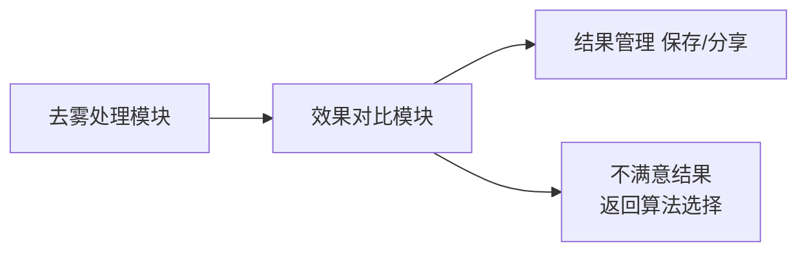
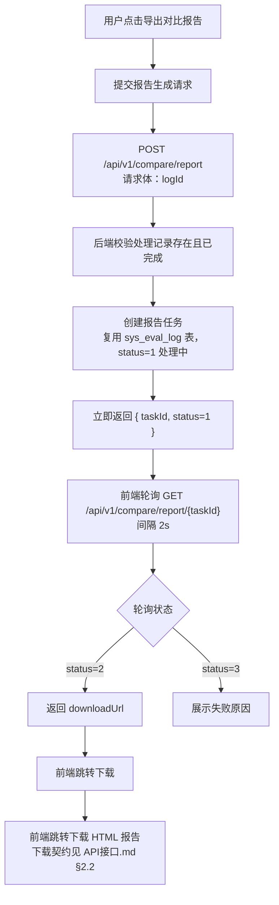

# 效果对比模块需求规格

## 1. 模块概述

### 1.1 模块定位

效果对比模块是用户评估图像处理效果的核心工具，承接图像处理模块（去雾处理）的输出结果，提供并排对比、放大镜、滤镜调节、量化指标评估和对比报告导出能力，帮助用户全面了解处理效果。

### 1.2 核心价值

| 价值维度 | 具体内容 |
|---------|---------|
| **直观对比** | 原图与处理结果并排展示（自适应横/竖布局） |
| **局部检查** | 放大镜工具查看局部细节，支持形状/倍数/大小调节 |
| **视觉调节** | 亮度/对比度/饱和度滤镜实时预览 |
| **专业评估** | PSNR/SSIM/LPIPS/NIQE/NIMA/BRISQUE 量化指标（异步计算） |
| **信息透明** | 算法信息（名称/类型/权重/参数量/描述）与处理参数展示 |
| **报告导出** | 对比分析报告（HTML）异步生成与下载 |

### 1.3 用户角色分析

| 用户类型 | 特征 | 使用偏好 | 功能需求 |
|---------|------|---------|---------|
| **轻度用户** | 对图像处理不了解 | 直观视觉对比 | 并排对比、放大镜、滤镜调节 |
| **中度用户** | 有一定图像处理经验 | 细节检查、效果调整 | 指标评估、算法信息展示 |
| **专业用户** | 图像处理专家 | 量化数据分析 | 指标表格/图表、对比报告导出 |

### 1.4 模块依赖关系

### 1.5 依赖的基础模块

| 模块 | 依赖说明 |
|------|---------|
| **会员管理** | 评估功能扣减会员"评估次数"配额（`evaluate`，Python 算法服务侧接入） |
| **算法管理** | 获取算法信息（名称/类型/权重/参数量等）用于效果评估与报告展示 |
| **文件存储** | 预测结果图、参考图的 URL 存储与访问 |

---

## 2. 功能需求

### 2.1 并排对比 (F-M02-001)

#### 2.1.1 功能描述

将原图和处理后的图片并排显示，方便整体效果对比，是最基础也是最常用的对比方式（前端 `CompareParallel` 页面）。

#### 2.1.2 布局

- **自适应布局**：根据容器宽高比自动选择左右并排（宽屏）或上下排列（窄屏/移动端），多张图片等宽分配
- 图片按原始宽高比等比缩放，`object-fit: contain` 完整展示

#### 2.1.3 交互功能

| 交互操作 | 触发方式 | 效果说明 |
|---------|---------|---------|
| 同步缩放 | 滚轮（按住时） | 两张图片同步缩放，倍率 1-10x |
| 放大镜查看 | 按住并拖动 | 显示放大镜画布（Canvas），实时放大鼠标附近区域，松开隐藏 |
| 滤镜调节 | 参数面板滑块 | 亮度/对比度/饱和度实时应用（CSS filter），范围 -100~+100（内部映射 0-200） |
| 标签显示 | 自动 | 每张图片左上角显示标签（原图/处理结果） |

### 2.2 效果评估 (F-M02-002)

#### 2.2.1 功能描述

效果评估页面（前端 `CompareOverlap`）是效果对比模块的综合评估入口，并排展示原图与处理结果图，同步提供量化评估指标、算法信息、放大镜/滤镜调节与对比报告导出能力。

#### 2.2.2 能力

| 能力 | 说明 |
|------|------|
| 并排图片展示 | 复用并排组件（`ParallelImageShow`），支持放大镜与滤镜调节 |
| 量化评估 | 页面加载时自动提交评估任务，展示指标表格（见 §2.5） |
| 算法信息 | 展示算法名称、类型、权重大小、浮点数量、参数量、描述 |
| 导出报告 | 导出对比报告（HTML，见 §2.8） |

### 2.3 放大镜对比 (F-M02-003)

#### 2.3.1 功能描述

使用放大镜工具查看局部细节，精确对比处理效果，适合检查纹理、边缘等细节（作为并排/评估页的通用工具组件）。

#### 2.3.2 放大镜参数

| 参数项 | 选项/范围 | 默认值 | 说明 |
|--------|------|--------|------|
| 放大倍数 | 2-20（滑块）/ 1-10（滚轮） | 2x | 不同页面调节方式不同 |
| 放大镜形状 | 圆形 / 正方形 | 正方形 | 圆形通过圆角实现 |
| 放大镜宽度 | 100-1000 px | - | 可调 |
| 放大镜高度 | 100-1000 px | - | 可调 |

> **说明**：放大镜**无会员等级限制**。放大镜基于 Canvas 实现，绘制区域跟随鼠标位置，多张图片同时显示对应放大镜窗口。

### 2.4 滤镜调节对比 (F-M02-004)

#### 2.4.1 功能描述

对展示的图片进行滤镜参数微调，实时预览调节效果（基于 CSS filter 属性，前端本地生效，无后端请求）。

#### 2.4.2 滤镜参数

| 滤镜名称 | 调节范围 | 默认值 | 说明 |
|---------|---------|--------|------|
| 亮度 | -100 ~ +100 | 0 | 调整图片整体明暗 |
| 对比度 | -100 ~ +100 | 0 | 调整明暗对比程度 |
| 饱和度 | -100 ~ +100 | 0 | 调整色彩鲜艳度 |

### 2.5 指标对比 (F-M02-005)

#### 2.5.1 功能描述

通过量化指标客观评估图像处理效果，提供专业的数据分析，适合专业用户和算法评测场景。评估为计算密集型任务，以**异步任务模式**执行（提交后立即返回任务 ID，前端轮询终态）。

独立"图像效果评估"页面 `Evaluation` + 评估 API。

#### 2.5.2 评估指标

指标由 Python 算法服务的 `algorithm/metrics.py` 统一配置（pyiqa 计算，模型延迟加载），共 6 项：

| 指标名称 | 说明 | 是否需要参考图(GT) | 越高越好 |
|---------|------|------|---------|
| PSNR | 峰值信噪比，基于 MSE 定义，越高表示质量越好 | 是 | 越高越好 |
| SSIM | 结构相似性，范围 0-1，越接近 1 越相似 | 是 | 越高越好 |
| LPIPS | 深度学习感知相似度，值越低表示越相似 | 是 | 越低越好 |
| NIQE | 无参考图像空间质量评估 | 否 | 越低越好 |
| NIMA | 无参考图像质量预测 | 否 | 越高越好 |
| BRISQUE | 无参考图像质量评估（基于统计特征） | 否 | 越低越好 |

**计算规则**：
- 需要参考图的三项（PSNR/SSIM/LPIPS）在提供参考图时计算
- 无参考指标（NIQE/NIMA/BRISQUE）始终计算
- 合格判定阈值（评估服务内置）：PSNR ≥ 30、SSIM ≥ 0.8、LPIPS ≤ 0.3、NIQE ≤ 5.0

**参考图来源**（PSNR/SSIM/LPIPS 依赖参考图 GT，评估接口 `gtUrl` 必填）：

| 来源 | 说明 |
|------|------|
| 用户上传参考图 | 用户在评估页手动上传清晰参考图（GT），经文件存储上传后获得 URL 传入评估接口（前端 `MetricsFragment.uploadGtImage`） |

> **说明**：当前评估接口要求 `gtUrl` 必填，缺少参考图返回业务错误 `B0001`（缺少清晰图进行对比）。无参考指标项不依赖 `gtUrl`，但接口仍要求传入以保持契约统一。

#### 2.5.3 指标展示

| 展示形式 | 说明 |
|---------|------|
| 指标表格 | 指标名、数值（保留 4 位小数）、方向标记（↑越高越好 / ↓越低越好）、指标描述 |
| 雷达图 | ECharts 雷达图，各维度使用**固定指标上限**（PSNR=100、SSIM=1、LPIPS=1、NIQE=10、NIMA=10、BRISQUE=100），保证不同评估结果横向可比（禁止按当前值动态缩放最大值，否则失去横向比较意义） |
| 柱状图 | ECharts 柱状图，展示各项指标数值 |
| 参数对比 | 处理参数（去雾强度/色彩饱和度/对比度/锐化程度）与默认值对比表，标注"一致/已调整" |

#### 2.5.4 对比分析

| 对比形式 |
|---------|
| 原图 vs 处理结果（单次处理效果评估） |

### 2.6 算法信息展示 (F-M02-006)

#### 2.6.1 功能描述

展示本次处理使用的算法详细信息，帮助用户了解处理过程（效果评估页，即原 `CompareOverlap` 页面）。

#### 2.6.2 展示内容

| 类别 | 内容 |
|------|------|
| 算法基本信息 | 算法名称、类型（标签）、权重大小 |
| 性能参数 | 浮点数量（FLOPs）、参数量（Params） |
| 算法描述 | 算法简介文本 |
| 网络架构 | 网络架构图（图片） |

### 2.7 对比工具栏 (F-M02-007)

#### 2.7.1 功能描述

对比页面提供常用操作入口：导出对比报告。

| 操作 | 说明 |
|------|------|
| 导出报告 | 生成并下载对比分析报告（HTML） |
| 更换算法 | 返回算法选择页更换算法（去雾处理结果页入口） |

### 2.8 对比报告导出 (F-M02-008)

#### 2.8.1 功能描述

将对比结果导出为结构化报告。报告生成以**异步任务方式**执行，避免长时间等待（前端对比页 + 后端对比报告 API）。

#### 2.8.2 导出格式（HTML）

| 格式 | 说明 |
|------|------|
| HTML 报告 | 内嵌原图与结果图并排展示、处理信息、评估指标、处理参数，可在浏览器查看或保存 |

#### 2.8.3 报告内容

HTML 报告内容：

| 模块 | 内容 |
|------|------|
| 报告头部 | 报告标题（去雾效果对比报告）、算法名称、生成时间 |
| 图片对比区 | 原图与处理结果图并排展示 |
| 处理信息区 | 算法名称、算法 ID、生成时间、任务状态（已完成） |
| 评估指标区 | PSNR/SSIM/LPIPS/NIQE/NIMA/BRISQUE 数值表（含方向标记与合格判定），数据来源为本处理的评估结果 |
| 处理参数区 | 本次处理参数（去雾强度/色彩饱和度/对比度/锐化程度）与默认值对比，标注"一致/已调整" |

#### 2.8.4 导出流程

> **说明**：
> - 报告任务**复用 `sys_eval_log` 表**存储（`taskId` 即评估日志 ID），`result` 字段存 `{"reportHtml": "...", "generatedAt": "..."}`
> - 报告无固定保留时长，随 `sys_eval_log` 记录保留
> - 报告生成请求体仅含 `logId`，格式固定为 HTML，指标与处理参数默认纳入报告

---

## 3. 用户交互流程

### 3.1 标准对比流程

处理完成进入对比/评估页面 → 并排展示原图与结果图 → 用户查看整体效果（可调节放大镜/滤镜）→ 触发量化评估查看指标（表格/雷达图/柱状图/参数对比）→ 导出对比报告（HTML）或返回算法选择重新处理。

---

## 交互规范

### 页面布局

| 页面 | 布局要点 |
|------|---------|
| 效果评估页 | 原图与结果图并排展示，右侧/下方展示评估指标表格、雷达图、柱状图、参数对比 |
| 报告预览 | 报告内容预览（图片对比/算法信息/评估指标/处理参数），导出按钮 |

### 关键交互行为

| 场景 | 交互行为 |
|------|---------|
| 并排对比 | 自适应横/竖布局，支持同步缩放与放大镜 |
| 滤镜调节 | 亮度/对比度/饱和度滑块实时预览 |
| 指标评估 | 页面加载时自动提交评估任务，异步计算后展示指标 |
| 报告导出 | 提交报告生成请求，轮询状态，完成后下载 |

### 操作反馈

| 场景 | 反馈行为 |
|------|---------|
| 评估计算中 | 展示加载状态，完成后展示指标表格与图表 |
| 评估失败 | 展示失败原因 |
| 报告生成中 | 展示生成进度，完成后出现下载按钮 |
| 报告生成失败 | 展示失败原因，提供重试 |
| 配额不足 | 提示"评估次数已达上限"，引导升级会员 |

---

## 4. 会员权益

### 4.1 等级差异

效果对比模块的会员权益由[会员管理模块](../../基础模块/会员管理/需求规格.md)统一管理。**各会员等级在效果对比模块无功能差异**：

| 功能项 | 现状 |
|--------|------|
| 并排对比/放大镜/滤镜/指标展示/报告导出 | 所有登录用户一致可用，**无等级限制** |
| 评估配额 | 效果评估扣减会员"评估次数"配额（每月 20/100/500/3000，见[会员管理需求规格 §2.2](../../基础模块/会员管理/需求规格.md)），配额扣减由 Python 算法服务侧统一完成，配额不足返回业务错误 |
| 报告导出开关 | 会员权益表 `report_export` 字段各等级均开启，评估/报告接口不按等级差异化校验 |

---

## 5. 消息通知集成

效果对比模块**不集成**消息通知模块（F-MN-001）的推送能力：对比报告生成完成、评估完成均无通知，通知经前端轮询获取进度，不推送。

---

## 6. 收藏管理集成

处理结果收藏由[收藏管理模块](../../基础模块/收藏管理/需求规格.md)统一管理（收藏类型 `result`）。对比页面**不集成收藏入口**，收藏能力通过收藏管理模块独立使用。

---

## 7. 推荐管理集成

效果对比模块**不集成**推荐管理模块的替代算法推荐，替代算法推荐由 AI 对话模块承载。用户对处理结果不满意时，通过"返回算法选择"页更换算法。

---

## 8. 任务管理对齐

对比报告导出**不依赖**任务管理模块：

- 报告任务复用 `sys_eval_log` 表，`taskId` 即评估日志 ID，状态（1 处理中 / 2 已完成 / 3 失败）沿用日志状态机
- 无任务列表展示、无消息通知、无结果文件保留策略（报告 HTML 随日志记录保留）

---

## 9. 非功能需求

### 9.1 性能要求

| 场景 | 指标 | 目标 |
|------|------|------|
| 评估任务提交 | POST `/api/v1/evaluation` 接口响应时间 | ≤ 2s（立即返回 taskId，不阻塞计算） |
| 评估任务计算 | 异步计算完成耗时（含六项指标，首次加载模型） | ≤ 30s（P95）；模型已加载时 ≤ 10s（P95） |
| 报告生成提交 | POST `/api/v1/compare/report` 接口响应时间 | ≤ 2s（立即返回 taskId） |
| 报告异步生成 | HTML 报告生成完成耗时 | ≤ 10s（P95） |
| 操作响应 | 放大镜拖拽、滤镜滑块 | ≤ 100ms 视觉响应（前端本地，无后端请求） |
| 状态轮询 | 评估/报告状态轮询间隔 | 2s |

### 9.2 评估计算 SLA

- 评估任务以异步任务模式执行，提交即返回 `taskId`，前端轮询终态（2 已完成 / 3 失败）
- 计算结果按 `{algorithmId}:{predMd5}:{refMd5}` 缓存，相同图对重复评估命中缓存直接返回（≤ 2s）
- 评估指标模型（pyiqa）在 Python 算法服务侧**延迟加载**，首次计算需加载模型（计入首次耗时）
- 评估失败时返回 `errorMessage`，前端展示失败原因

### 9.3 并发与可用性

- 评估功能受会员"评估次数"配额限制，配额不足返回业务错误 `A0515`
- 报告导出当前无配额限制（各等级均开启 `report_export`）
- 并发评估任务数受 Python 算法服务 GPU 资源约束，超出时排队等待

---

## 待确认事项

1. **报告保留期限**：对比报告是否需要固定保留期与到期清理（当前随评估日志保留，无清理策略）？
2. **报告模板定制化**：报告是否需要支持企业定制（Logo/水印/字段选择）？
3. **报告格式扩展**：报告格式是否需要扩展 PDF/CSV（当前仅 HTML）？
4. **评估指标阈值配置**：评估指标的合格阈值（PSNR≥30 等）是否可配置？
