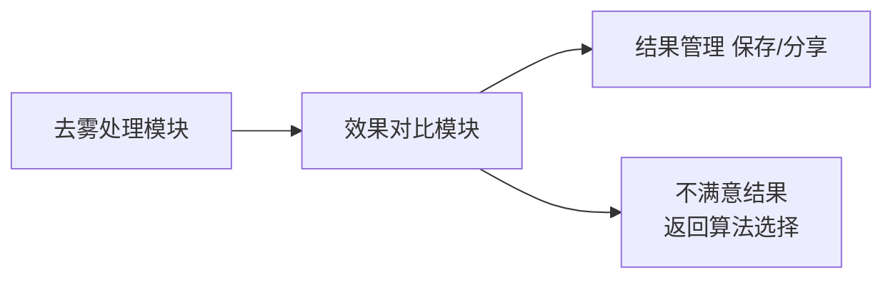
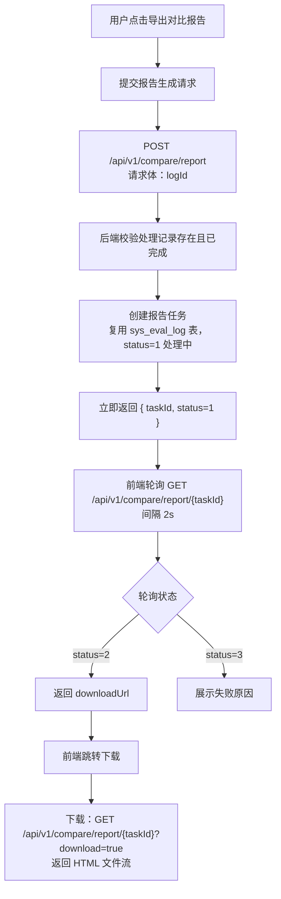

# 效果对比模块需求规格

> **文档分层说明**：本文档按"已实现（现状）/ 本次改造目标（规划中）/ 远期规划"三层组织。
> - **已实现**：当前代码已落地、可直接验证的功能
> - **本次改造目标（规划中）**：已列入[近期改造计划总览](../../05-改造计划/近期改造计划总览.md)，尚未实现的演进方向
> - **远期规划**：已列入[远期改造计划总览](../../05-改造计划/远期改造计划总览.md)，依赖后续阶段的基础设施

## 1. 模块概述

### 1.1 模块定位

效果对比模块是用户评估图像处理效果的核心工具，承接图像处理模块（去雾处理）的输出结果，提供并排对比、放大镜、滤镜调节、量化指标评估和对比报告导出能力，帮助用户全面了解处理效果。

### 1.2 核心价值

| 价值维度 | 具体内容 | 状态 |
|---------|---------|------|
| **直观对比** | 原图与处理结果并排展示（自适应横/竖布局） | ✅ 已实现 |
| **局部检查** | 放大镜工具查看局部细节，支持形状/倍数/大小调节 | ✅ 已实现 |
| **视觉调节** | 亮度/对比度/饱和度滤镜实时预览 | ✅ 已实现 |
| **专业评估** | PSNR/SSIM/LPIPS/NIQE/NIMA/BRISQUE 量化指标（异步计算） | ✅ 已实现 |
| **信息透明** | 算法信息（名称/类型/权重/参数量/描述）与处理参数展示 | ✅ 已实现 |
| **报告导出** | 对比分析报告（HTML）异步生成与下载 | ✅ 已实现 |

### 1.3 用户角色分析

| 用户类型 | 特征 | 使用偏好 | 功能需求 |
|---------|------|---------|---------|
| **轻度用户** | 对图像处理不了解 | 直观视觉对比 | 并排对比、放大镜、滤镜调节 |
| **中度用户** | 有一定图像处理经验 | 细节检查、效果调整 | 指标评估、算法信息展示 |
| **专业用户** | 图像处理专家 | 量化数据分析 | 指标表格/图表、对比报告导出 |

> **说明**：当前各会员等级在效果对比模块**无功能差异**，仅评估功能接入会员"评估次数"配额（见 §4.1）。多算法对比、历史对比等 VIP 差异化能力为**规划中**（见 §2.5.4）。

### 1.4 模块依赖关系

### 1.5 依赖的基础模块

| 模块 | 依赖说明 | 状态 |
|------|---------|------|
| **会员管理** | 评估功能扣减会员"评估次数"配额（`evaluate`，Python 算法服务侧接入） | ✅ 已实现（Python 端） |
| **算法管理** | 获取算法信息（名称/类型/权重/参数量等）用于效果评估与报告展示 | ✅ 已实现 |
| **文件存储** | 预测结果图、参考图的 URL 存储与访问 | ✅ 已实现 |
| **收藏管理** | 处理结果收藏（targetType="result"），对比页面**当前未提供收藏入口** | ⏳ 规划中 |
| **消息通知** | 对比报告生成完成通知，**当前未实现** | ⏳ 规划中 |
| **推荐管理** | 对比页面跳转获取替代算法推荐，**当前未实现**（算法选择模块提供更换算法入口） | ⏳ 规划中 |
| **任务管理** | 对比报告导出**不依赖**任务管理模块，报告任务复用 `sys_eval_log` 表（见 §2.8.4） | ✅ 已实现 |

---

## 2. 功能需求

### 2.1 并排对比 (F-M05-001)

#### 2.1.1 功能描述

将原图和处理后的图片并排显示，方便整体效果对比，是最基础也是最常用的对比方式。**已实现**（前端 `CompareParallel` 页面）。

#### 2.1.2 布局

- **自适应布局**：根据容器宽高比自动选择左右并排（宽屏）或上下排列（窄屏/移动端），多张图片等宽分配
- 图片按原始宽高比等比缩放，`object-fit: contain` 完整展示

#### 2.1.3 交互功能（已实现）

| 交互操作 | 触发方式 | 效果说明 |
|---------|---------|---------|
| 同步缩放 | 滚轮（按住时） | 两张图片同步缩放，倍率 1-10x |
| 放大镜查看 | 按住并拖动 | 显示放大镜画布（Canvas），实时放大鼠标附近区域，松开隐藏 |
| 滤镜调节 | 参数面板滑块 | 亮度/对比度/饱和度实时应用（CSS filter），范围 -100~+100（内部映射 0-200） |
| 标签显示 | 自动 | 每张图片左上角显示标签（原图/处理结果） |

> **本次改造目标（规划中）**：双击放大/还原、双指捏合、标签点击切换原图/处理后等手势交互，见近期改造计划"功能补全"。

### 2.2 效果评估 (F-M05-002)

#### 2.2.1 功能描述

效果评估页面（前端 `CompareOverlap`）是效果对比模块的综合评估入口，并排展示原图与处理结果图，同步提供量化评估指标、算法信息、放大镜/滤镜调节与对比报告导出能力。**已实现**。

> **命名说明**：原"重叠对比"命名名不副实——该页面实为"并排展示 + 评估 + 报告"的综合页，未实现真正的滑动分隔线重叠对比。本次改造将该页面正名为"效果评估"，真正的滑动分隔线重叠对比独立为 F-M05-009（见 §2.9）作为本期落地目标，以消除认知混乱。

#### 2.2.2 已实现能力

| 能力 | 说明 |
|------|------|
| 并排图片展示 | 复用并排组件（`ParallelImageShow`），支持放大镜与滤镜调节 |
| 量化评估 | 页面加载时自动提交评估任务，展示指标表格（见 §2.5） |
| 算法信息 | 展示算法名称、类型、权重大小、浮点数量、参数量、描述 |
| 导出报告 | 导出对比报告（HTML，见 §2.8） |

### 2.3 放大镜对比 (F-M05-003)

#### 2.3.1 功能描述

使用放大镜工具查看局部细节，精确对比处理效果，适合检查纹理、边缘等细节。**已实现**（作为并排/评估页的通用工具组件）。

#### 2.3.2 放大镜参数（已实现）

| 参数项 | 选项/范围 | 默认值 | 说明 |
|--------|------|--------|------|
| 放大倍数 | 2-20（滑块）/ 1-10（滚轮） | 2x | 不同页面调节方式不同 |
| 放大镜形状 | 圆形 / 正方形 | 正方形 | 圆形通过圆角实现 |
| 放大镜宽度 | 100-1000 px | - | 可调 |
| 放大镜高度 | 100-1000 px | - | 可调 |

> **说明**：放大镜**无会员等级限制**（需求稿早期规划的"倍数受会员等级限制"未落地）。放大镜基于 Canvas 实现，绘制区域跟随鼠标位置，多张图片同时显示对应放大镜窗口。

### 2.4 滤镜调节对比 (F-M05-004)

#### 2.4.1 功能描述

对展示的图片进行滤镜参数微调，实时预览调节效果。**已实现**（基于 CSS filter 属性，前端本地生效，无后端请求）。

#### 2.4.2 滤镜参数（已实现）

| 滤镜名称 | 调节范围 | 默认值 | 说明 |
|---------|---------|--------|------|
| 亮度 | -100 ~ +100 | 0 | 调整图片整体明暗 |
| 对比度 | -100 ~ +100 | 0 | 调整明暗对比程度 |
| 饱和度 | -100 ~ +100 | 0 | 调整色彩鲜艳度 |

> **本次改造目标（规划中）**：色温、锐化、降噪三项滤镜，以及内置预设（自然/鲜艳/柔和/清晰/复古）与自定义预设管理，见近期改造计划"功能补全"。

### 2.5 指标对比 (F-M05-005)

#### 2.5.1 功能描述

通过量化指标客观评估图像处理效果，提供专业的数据分析，适合专业用户和算法评测场景。评估为计算密集型任务，以**异步任务模式**执行（提交后立即返回任务 ID，前端轮询终态）。

**已实现**（独立"图像效果评估"页面 `Evaluation` + 评估 API）。

#### 2.5.2 评估指标（已实现）

指标由 Python 算法服务的 `algorithm/metrics.py` 统一配置（pyiqa 计算，模型延迟加载），共 6 项：

| 指标名称 | 说明 | 是否需要参考图(GT) | 越高越好 |
|---------|------|------|---------|
| PSNR | 峰值信噪比，基于 MSE 定义，越高表示质量越好 | 是 | 越高越好 |
| SSIM | 结构相似性，范围 0-1，越接近 1 越相似 | 是 | 越高越好 |
| LPIPS | 深度学习感知相似度，值越低表示越相似 | 是 | 越低越好 |
| NIQE | 无参考图像空间质量评估 | 否 | 越低越好 |
| NIMA | 无参考图像质量预测 | 否 | 越高越好 |
| BRISQUE | 无参考图像质量评估（基于统计特征） | 否 | 越低越好 |

**计算规则**：
- 需要参考图的三项（PSNR/SSIM/LPIPS）在提供参考图时计算
- 无参考指标（NIQE/NIMA/BRISQUE）始终计算
- 合格判定阈值（评估服务内置）：PSNR ≥ 30、SSIM ≥ 0.8、LPIPS ≤ 0.3、NIQE ≤ 5.0

**参考图来源**（PSNR/SSIM/LPIPS 依赖参考图 GT，评估接口 `gtUrl` 必填）：

| 来源 | 说明 | 状态 |
|------|------|------|
| 用户上传参考图 | 用户在评估页手动上传清晰参考图（GT），经文件存储上传后获得 URL 传入评估接口（前端 `MetricsFragment.uploadGtImage`） | ✅ 已实现 |
| 样例库 GT 图 | 系统样例库内置去雾前后图对，处理样例图时自动匹配对应 GT 图参与评估 | ⏳ 规划中 |
| 数据集 GT | 用户从数据集选择带 GT 标注的图进行批量评估（数据集管理模块提供） | ⏳ 规划中 |

> **说明**：当前评估接口要求 `gtUrl` 必填，缺少参考图返回业务错误 `B0001`（缺少清晰图进行对比）。无参考指标项不依赖 `gtUrl`，但接口仍要求传入以保持契约统一。

> **说明**：早期需求稿中的 MSE、信息熵（Entropy）、去雾专属指标（暗通道值/对比度提升/饱和度提升）**均未落地**。
>
> **本次改造目标（规划中）**：评估指标按任务类型（`task_type`）独立配置——不同任务类型（去雾/去雨/去雪/低光/超分/去噪/修复）使用不同的指标组合。该能力依赖 `sys_algorithm.task_type` 维度落地（见[近期改造计划总览 §3.1](../../05-改造计划/近期改造计划总览.md)）。

#### 2.5.3 指标展示（已实现）

| 展示形式 | 说明 |
|---------|------|
| 指标表格 | 指标名、数值（保留 4 位小数）、方向标记（↑越高越好 / ↓越低越好）、指标描述 |
| 雷达图 | ECharts 雷达图，各维度使用**固定指标上限**（PSNR=100、SSIM=1、LPIPS=1、NIQE=10、NIMA=10、BRISQUE=100），保证不同评估结果横向可比（禁止按当前值动态缩放最大值，否则失去横向比较意义） |
| 柱状图 | ECharts 柱状图，展示各项指标数值 |
| 参数对比 | 处理参数（去雾强度/色彩饱和度/对比度/锐化程度）与默认值对比表，标注"一致/已调整" |

#### 2.5.4 对比分析（部分规划中）

| 对比形式 | 状态 |
|---------|------|
| 原图 vs 处理结果（单次处理效果评估） | ✅ 已实现 |
| 多算法对比（同一图片不同算法，VIP 差异化） | ⏳ 规划中（算法选择模块已提供同图多算法预测入口，效果对比页内的多算法指标横向对比待落地） |
| 历史记录对比（与历史评估结果对比） | ⏳ 规划中 |

### 2.6 算法信息展示 (F-M05-006)

#### 2.6.1 功能描述

展示本次处理使用的算法详细信息，帮助用户了解处理过程。**已实现**（效果评估页，即原 `CompareOverlap` 页面）。

#### 2.6.2 展示内容（已实现）

| 类别 | 内容 |
|------|------|
| 算法基本信息 | 算法名称、类型（标签）、权重大小 |
| 性能参数 | 浮点数量（FLOPs）、参数量（Params） |
| 算法描述 | 算法简介文本 |
| 网络架构 | 网络架构图（图片） |

> **说明**：早期需求稿中的"版本、适用场景、推荐指数、本次处理参数与默认值对比、处理时间/内存占用"等**部分未落地**——参数对比能力已通过评估页"参数对比"Tab 实现（见 §2.5.3），其余项待后续迭代。

### 2.7 对比工具栏 (F-M05-007)

#### 2.7.1 功能描述

对比页面提供常用操作入口。**已实现部分**：导出对比报告。

| 操作 | 说明 | 状态 |
|------|------|------|
| 导出报告 | 生成并下载对比分析报告（HTML） | ✅ 已实现 |
| 保存结果 | 保存处理后的图片 | ⏳ 规划中（去雾处理模块结果页提供） |
| 分享图片 | 分享到社交平台或生成分享链接 | ⏳ 规划中 |
| 重新处理 | 使用相同参数重新处理 | ⏳ 规划中 |
| 更换算法 | 返回算法选择页更换算法 | ✅ 已实现（去雾处理结果页入口） |
| 添加收藏 | 收藏本次处理结果 | ⏳ 规划中（收藏管理模块已实现，对比页未接入入口） |

### 2.8 对比报告导出 (F-M05-008)

#### 2.8.1 功能描述

将对比结果导出为结构化报告。报告生成以**异步任务方式**执行，避免长时间等待。**已实现**（前端对比页 + 后端对比报告 API）。

#### 2.8.2 导出格式（已实现：HTML）

| 格式 | 说明 | 状态 |
|------|------|------|
| HTML 报告 | 内嵌原图与结果图并排展示、处理信息、评估指标、处理参数，可在浏览器查看或保存 | ✅ 已实现（指标/参数纳入为本期改造目标，见 §2.8.3） |

> **格式统一说明**：报告格式**仅保留 HTML**。前端报告弹窗原展示的"PDF / 图片(PNG)"格式选项与后端实现矛盾（后端统一生成 HTML），本次改造**移除未实现的 PDF/PNG UI 选项**，避免对用户产生误导。PDF/PNG/CSV/JSON 等格式若后续有需求，再按远期规划单独落地（见 §2.8.5）。

#### 2.8.3 报告内容

HTML 报告内容（已实现 + 本期改造目标）：

| 模块 | 内容 | 状态 |
|------|------|------|
| 报告头部 | 报告标题（去雾效果对比报告）、算法名称、生成时间 | ✅ 已实现 |
| 图片对比区 | 原图与处理结果图并排展示 | ✅ 已实现 |
| 处理信息区 | 算法名称、算法 ID、生成时间、任务状态（已完成） | ✅ 已实现 |
| 评估指标区 | PSNR/SSIM/LPIPS/NIQE/NIMA/BRISQUE 数值表（含方向标记与合格判定），数据来源为本处理的评估结果 | ⏳ 本期改造目标 |
| 处理参数区 | 本次处理参数（去雾强度/色彩饱和度/对比度/锐化程度）与默认值对比，标注"一致/已调整" | ⏳ 本期改造目标 |

> **内容统一说明**：原报告仅含图片+算法信息却称"对比报告"，与命名矛盾。本次改造将**核心评估指标（PSNR/SSIM 等）与处理参数纳入报告**，使报告名副其实。原报告生成请求中预留的 `includeMetrics`/`includeFilters` 参数未生效，本次改造**移除该预留参数**——指标与处理参数默认纳入报告，无需开关控制（见 §2.8.4）。

#### 2.8.4 导出流程（已实现）

> **说明**：
> - 报告任务**复用 `sys_eval_log` 表**存储（`taskId` 即评估日志 ID），`result` 字段存 `{"reportHtml": "...", "generatedAt": "..."}`，**未走任务管理模块**
> - 报告无固定保留时长，随 `sys_eval_log` 记录保留
> - **无消息通知推送**，前端通过轮询获取生成结果
> - **请求体精简**：移除原 `format`/`includeMetrics`/`includeFilters` 参数——格式固定 HTML（无需 format），指标与处理参数默认纳入报告（无需开关）。三端后端 `CompareReportForm` 与前端调用需同步精简（仅保留 `logId`）

#### 2.8.5 智能报告生成（远期规划）

> **远期规划**：在现有量化指标评估和报告导出基础上，引入 LLM 自然语言能力，自动生成包含专业技术解读和优化建议的智能对比报告（含指标解读、参数说明、效果视觉评价、优化建议、批量处理摘要、对话式追问、PDF/Markdown 导出等），见[远期改造计划总览 §3](../../05-改造计划/远期改造计划总览.md)（步骤 2 核心交付物之一）。

### 2.9 重叠对比（滑动分隔线） (F-M05-009)

#### 2.9.1 功能描述

真正的"重叠对比"——原图与处理结果**重叠显示在同一坐标空间**，通过滑动分隔线在两张图之间切换查看，精细对比局部差异（如边缘、纹理、天空区域去雾程度）。

> **本次改造目标（规划中）**：本期落地目标。通用拖拽组件（`DraggableLine`）已具备，对比页尚未接入。落地后该能力与 §2.2 效果评估（并排+评估）并列，作为效果对比模块的局部精细对比工具。

#### 2.9.2 交互设计（本期落地目标）

| 交互操作 | 触发方式 | 效果说明 |
|---------|---------|---------|
| 拖动分隔线 | 鼠标/触摸拖拽 | 分隔线左侧（或上侧）显示原图，右侧（或下侧）显示处理结果，实时切换 |
| 切换方向 | 方向按钮 | 在垂直分隔线（左右对比）与水平分隔线（上下对比）间切换 |
| 自动对齐中心 | 双击分隔线 / "居中"按钮 | 分隔线回到容器中心（50/50） |
| 同步缩放 | 滚轮 | 两张图同步缩放（复用并排对比的缩放逻辑），保证重叠对齐 |

#### 2.9.3 实现约束

- 原图与处理结果**尺寸必须一致**（不一致时以原图为基准对处理结果等比缩放并对齐）
- 分隔线拖拽基于 `DraggableLine` 组件，渲染层使用 CSS `clip-path` 或 `overflow:hidden` 控制两侧图可见区域
- 该页面**不承载评估指标/算法信息/报告导出**（这些能力在 §2.2 效果评估页），保持单一职责：局部视觉对比

---

## 3. 用户交互流程

### 3.1 标准对比流程（已实现）

处理完成进入对比/评估页面 → 并排展示原图与结果图 → 用户查看整体效果（可调节放大镜/滤镜）→ 触发量化评估查看指标（表格/雷达图/柱状图/参数对比）→ 导出对比报告（HTML）或返回算法选择重新处理。

### 3.2 多算法对比流程（规划中）

> **本次改造目标（规划中）**：选择 2-4 个算法 → 系统依次执行处理 → 网格展示各算法处理结果 → 查看各算法指标对比 → 选择最优结果保存。当前算法选择模块已提供"同图多算法预测"能力（`/api/v1/algorithm-select/compare`），效果对比页内的多算法指标横向对比待落地。

---

## 4. 会员权益

### 4.1 等级差异

效果对比模块的会员权益由[会员管理模块](../../基础模块/会员管理/需求规格.md)统一管理。**当前各等级在效果对比模块无功能差异**：

| 功能项 | 现状 |
|--------|------|
| 并排对比/放大镜/滤镜/指标展示/报告导出 | 所有登录用户一致可用，**无等级限制** |
| 评估配额 | 效果评估扣减会员"评估次数"配额（每月 20/100/500/3000，见[会员管理需求规格 §2.2](../../基础模块/会员管理/需求规格.md)），Python 算法服务侧已接入扣减，配额不足返回业务错误 |
| 报告导出开关 | 会员权益表 `report_export` 字段已配置（当前各等级均开启），评估/报告接口**尚未按等级差异化校验** |

> **说明**：早期需求稿中的"放大镜倍数、滤镜项数、多算法对比数、历史对比、报告导出格式"等级差异**均未落地**，属规划中。

### 4.2 权限提示（规划中）

当用户尝试使用超出权限的功能时，展示升级引导提示，列出需升级才能使用的功能项。**当前未实现**。

---

## 5. 消息通知集成

效果对比模块通过[消息通知模块](../../基础模块/消息通知/需求规格.md)（F-MN-001）推送通知的能力**当前未接入**（对比报告生成完成、评估完成均无通知，前端通过轮询获取结果）。

> **本次改造目标（规划中）**：接入报告生成完成通知（业务通知：报告已生成，点击下载）。

---

## 6. 收藏管理集成

处理结果收藏由[收藏管理模块](../../基础模块/收藏管理/需求规格.md)统一管理（收藏类型 `result`）。对比页面**当前未提供收藏入口**，收藏能力通过收藏管理模块独立使用。

> **本次改造目标（规划中）**：对比页面接入收藏按钮（收藏/取消收藏、从收藏列表跳转对比）。

---

## 7. 推荐管理集成

效果对比模块与[推荐管理模块](../../基础模块/推荐管理/需求规格.md)的替代算法推荐集成**当前未实现**。用户对处理结果不满意时，通过"返回算法选择"页更换算法。

> **远期规划**：不满意结果时可获取替代算法推荐（推荐管理模块），推荐结果可一键进入图像处理流程。

---

## 8. 任务管理对齐

对比报告导出**不依赖**任务管理模块：

- 报告任务复用 `sys_eval_log` 表，`taskId` 即评估日志 ID，状态（1 处理中 / 2 已完成 / 3 失败）沿用日志状态机
- 无任务列表展示、无消息通知、无结果文件保留策略（报告 HTML 随日志记录保留）

---

## 9. 非功能需求

### 9.1 性能要求

| 场景 | 指标 | 目标 |
|------|------|------|
| 评估任务提交 | POST `/api/v1/evaluation` 接口响应时间 | ≤ 2s（立即返回 taskId，不阻塞计算） |
| 评估任务计算 | 异步计算完成耗时（含六项指标，首次加载模型） | ≤ 30s（P95）；模型已加载时 ≤ 10s（P95） |
| 报告生成提交 | POST `/api/v1/compare/report` 接口响应时间 | ≤ 2s（立即返回 taskId） |
| 报告异步生成 | HTML 报告生成完成耗时 | ≤ 10s（P95） |
| 操作响应 | 放大镜拖拽、滤镜滑块、滑动分隔线拖动 | ≤ 100ms 视觉响应（前端本地，无后端请求） |
| 状态轮询 | 评估/报告状态轮询间隔 | 2s |

> **战略对齐**：评估计算与报告生成均为异步任务模式，POST 接口响应需满足"操作响应 < 2s"的战略要求；异步任务本身耗时通过轮询对用户透明。

### 9.2 评估计算 SLA

- 评估任务以异步任务模式执行，提交即返回 `taskId`，前端轮询终态（2 已完成 / 3 失败）
- 计算结果按 `{algorithmId}:{predMd5}:{refMd5}` 缓存，相同图对重复评估命中缓存直接返回（≤ 2s）
- 评估指标模型（pyiqa）在 Python 算法服务侧**延迟加载**，首次计算需加载模型（计入首次耗时）
- 评估失败时返回 `errorMessage`，前端展示失败原因

### 9.3 报告生成 SLA

- 报告生成以异步任务模式执行，提交即返回 `taskId`
- 报告任务复用 `sys_eval_log` 表，状态机：1 处理中 → 2 已完成 / 3 失败
- 报告 HTML 随 `sys_eval_log` 记录保留，无固定保留时长、无清理策略
- 生成失败时返回 `errorMessage`，前端展示失败原因

### 9.4 并发与可用性

- 评估功能受会员"评估次数"配额限制，配额不足返回业务错误 `A0515`
- 报告导出当前无配额限制（各等级均开启 `report_export`）
- 并发评估任务数受 Python 算法服务 GPU 资源约束，超出时排队等待
