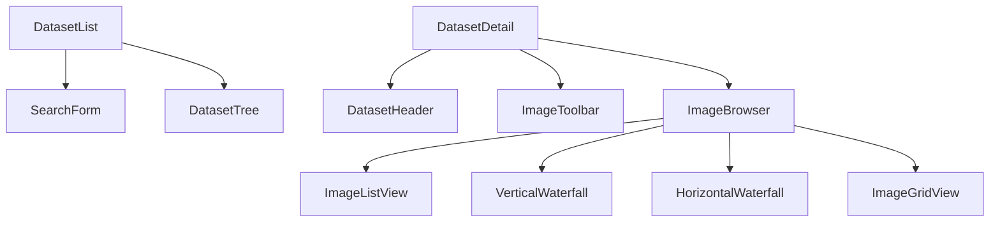

# 数据集管理模块 - 前端实现设计

## 1. 文档概述

本文档描述数据集管理模块的前端架构决策，适用于 Vue3 与 React 两端，两端通过 Composable / Custom Hooks 复用核心逻辑。聚焦组件结构、状态管理、虚拟滚动、上传配对、任务轮询等架构决策。业务功能与交互行为见 [需求规格.md](./需求规格.md)，接口契约见 [API接口.md](./API接口.md)。

---

## 2. 组件树设计

弹窗与抽屉组件：

| 组件 | 职责 |
|------|------|
| DatasetFormDialog | 数据集新增/编辑表单（task_type 必填） |
| ImagePreviewModal | 大图查看、配对切换、信息面板、导航底栏 |
| SingleUploadDialog | 单张图片上传 |
| PairedUploadDialog | 配对上传（清晰图 + 多张退化图，均非必填） |
| BatchUploadDialog | 批量上传（按文件名自动配对） |
| AnnotationDialog | 图片标注编辑（场景类型、haze_level、描述、图片类型） |
| StatisticsDialog | 统计图表（场景类型/退化程度/文件格式分布） |
| TaskCenterDrawer | 异步任务（导出/导入）状态集中管理 |

页面组件职责：

| 组件 | 职责 |
|------|------|
| DatasetList | 列表页容器，承载搜索与树形表格 |
| SearchForm | 名称搜索 + task_type 筛选 |
| DatasetTree | 树形表格，第一级按 task_type 分组，子节点懒加载 |
| DatasetHeader | 基本信息 + 统计摘要入口 |
| ImageToolbar | 模式切换 + 类型筛选 Tab + 搜索 + 操作按钮 |
| ImageBrowser | 图片展示容器，按展示模式切换子视图 |
| ImageListView | 列表模式，支持批量选择与虚拟滚动 |

---

## 3. 状态管理

### 3.1 Store 模块划分

| Store | 职责 |
|-----------|------|
| datasetStore | 数据集树、查询参数、当前详情 |
| datasetItemStore | 数据项分页列表、查询参数、选中状态、展示模式偏好、当前查看图片 |
| taskStore | 异步任务（导出/导入）状态与轮询 |

### 3.2 核心状态

| 状态 | 说明 |
|------|------|
| `datasetTree` | 数据集树（根节点分页，子节点懒加载） |
| `datasetQuery` | 数据集查询参数（keyword、task_type、status） |
| `currentDetail` | 当前数据集详情（含统计信息） |
| `items` | 数据项分页列表 |
| `itemQuery` | 数据项查询参数（含 haze_level 关键字、图片类型 Tab） |
| `selectedItems` | 选中集合（批量操作） |
| `displayMode` | 展示模式偏好（localStorage 持久化） |
| `tasks` | 异步任务列表与轮询中任务 ID 集合 |

### 3.3 核心操作

| 操作 | 说明 |
|------|------|
| `fetchDatasetTree` | 拉取数据集树，子节点展开时懒加载 |
| `createDataset` / `updateDataset` / `deleteDataset` | 数据集 CRUD |
| `fetchItems` / `loadMore` | 数据项分页加载与无限滚动 |
| `createItemWithImages` / `batchCreateItems` | 单张/配对/批量上传 |
| `deleteItem` / `batchDeleteItems` | 数据项删除 |
| `createTask` | 创建异步任务（type 区分 dataset_export / dataset_import） |
| `pollTaskProgress` | 轮询任务状态至完成 |

---

## 4. 路由设计

| 路由路径 | 页面 | 权限控制 | 守卫说明 |
|---------|------|---------|---------|
| `/dataset` | DatasetList | 登录用户 | 查看 default；新增/编辑/删除按 `sys:dataset:add/edit/delete` 控制按钮显隐 |
| `/dataset/:id` | DatasetDetail | 登录用户 | 进入时加载数据集详情与首批数据项 |

---

## 5. 数据流

### 5.1 数据获取策略

| 场景 | 策略 |
|------|------|
| 数据集树 | 根节点分页加载，子节点展开时懒加载 |
| 数据项列表 | 无限滚动，每页 20 条，支持预加载下一屏 |
| 统计信息 | 随详情接口返回（后端缓存 <200ms），数据变更后主动失效 |
| 展示模式偏好 | localStorage 持久化 |

### 5.2 图片 URL 拼接

图片访问约束以 [需求规格 §2.3.4](./需求规格.md) 为准。实现侧：后端仅返回相对路径，前端拼接 `http://{host}:9000{相对路径}` 访问 nginx-dataset（端口 9000）静态服务，禁止经 Java 后端代理图片流；上传仍走 Java 后端 `/api/v1/item-files`。

### 5.3 导入导出任务流

依据 [API接口 §2.4](./API接口.md)，导出/导入统一经任务管理模块 `/api/v1/tasks` 异步执行：创建任务 -> 加入 TaskCenterDrawer -> 轮询状态 -> 完成后下载（导出）或刷新数据集树（导入）。导入完成展示导入报告（报告内容见 [需求规格 §2.2.4](./需求规格.md)）。

### 5.4 请求优化

| 优化项 | 决策 |
|--------|------|
| 搜索防抖 | 300ms |
| 滚动节流 | 200ms |
| 请求取消 | 切换数据集时取消未完成请求 |
| 虚拟滚动 | 列表模式启用 |
| 图片懒加载 | 所有模式启用，仅加载可视区域 |

---

## 6. 交互设计决策

| 交互点 | 技术选型 | 理由 |
|--------|---------|------|
| 大数量图像浏览 | 列表模式虚拟滚动 + 所有模式图片懒加载（见 §5.4） | 数据集图片可达上千张，全量渲染卡顿；虚拟滚动仅渲染可视区域，懒加载降低带宽 |
| 上传进度展示 | 单张/配对/批量分模式；MD5 去重命中在配对预览列表标记"已跳过" | 去重反馈前置到上传前预览，避免用户上传后才知重复 |
| 任务状态轮询 | TaskCenterDrawer 集中轮询导出/导入任务 | 异步任务耗时不确定，集中管理避免分散轮询；完成后统一通知 |
| 图像预览 | 大图查看（缩放/拖动/旋转）+ 配对 Tab 切换 + 上一张/下一张导航 | 配对图按 haze_level 排序展示 |
| task_type 分组 | 树形表格第一级按 task_type 分组 | task_type 为必填维度，支撑算法按任务类型路由 |
| haze_level 多规范 | 类型 Tab 按是否标注二分 + haze_level 关键字模糊搜索 | 多种标注规范（人工分级/β参数/A+β），按值枚举 Tab 会爆炸；二分 + 关键字兼顾筛选灵活 |
| 配对上传校验 | 清晰图/退化图为可选字段，仅校验分辨率一致性/格式/大小 | 适配多种数据集规范（GT+退化配对型/仅退化无 GT 型/多退化对一 GT 型） |
| 批量上传命名解析 | 按文件名前导数字分组 + 关键字识别图片类型 + haze_level 自动解析 | 自动配对降低人工成本；支持 RESIDE/Haze4K 等多种命名规范 |

---

## 7. 公共组件使用

| 公共组件 | 配置要点 |
|---------|---------|
| 虚拟滚动列表 | 列表模式启用，仅渲染可视区域 + 缓冲区 |
| 文件上传组件 | 拖拽 + 点击上传；上传前校验格式（jpg/png/gif）、大小（≤10MB）、分辨率一致性（配对） |
| 图像预览组件 | 缩放/拖动/旋转/配对切换/导航 |
| 进度条组件 | 上传进度与任务轮询进度展示 |
| 瀑布流组件 | 纵向（2-4 列自适应）/横向（2-3 行）两种模式，保持原始宽高比 |
