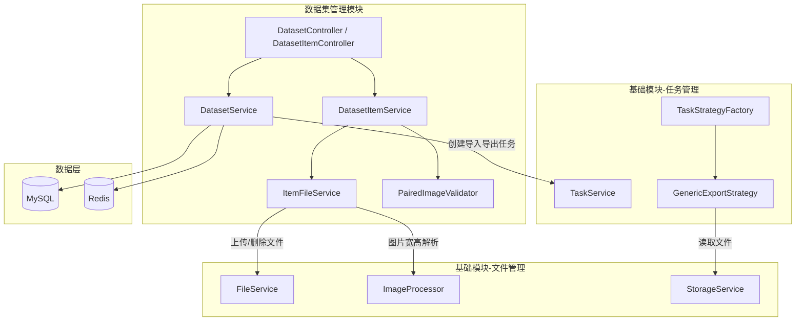
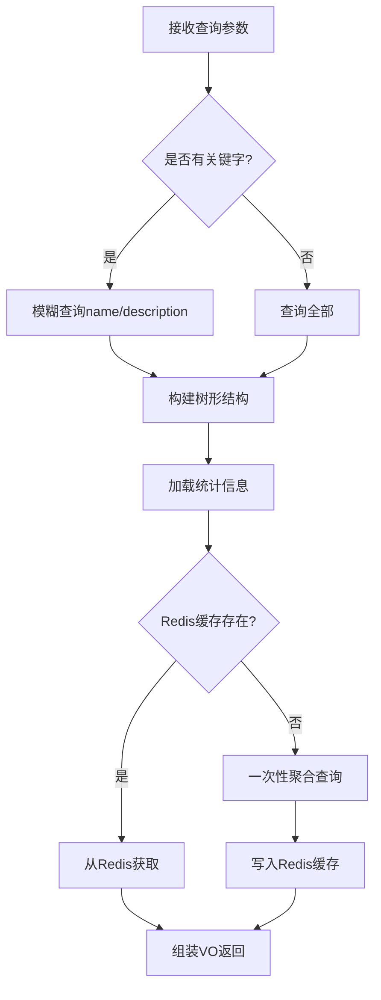
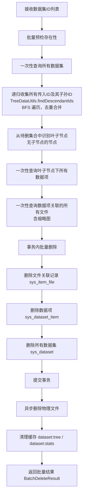
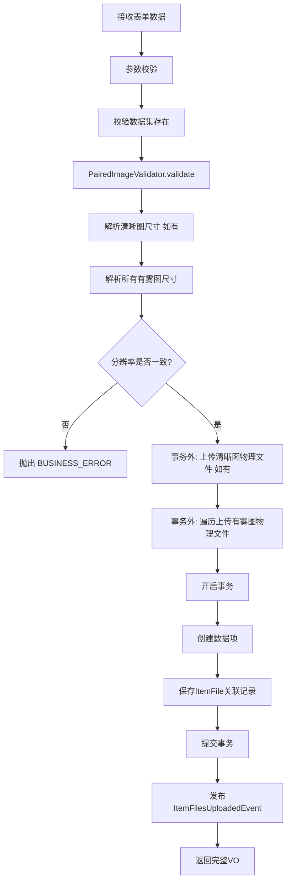

# 数据集管理模块 - 后端实现设计

## 1. 文档概述

### 1.1 文档目的

本文档描述数据集管理模块的后端实现方案，包括分层架构设计、核心业务逻辑（配对图片校验、级联删除、批量上传）、数据访问层设计、缓存策略及性能优化方案。


## 2. 架构设计

### 2.1 模块分层架构

数据集管理模块依赖文件管理和任务管理两个基础模块。文件物理存储委托给文件管理模块的 `FileService`，导入导出任务通过任务管理模块的策略模式注册执行：



**设计考量**：

- **ItemFileService 保留独立性**：数据集文件具有领域特殊性（配对关系、分辨率一致性校验、缩略图关联、场景/雾霾程度元数据），不同于通用文件管理。ItemFileService 负责 `sys_item_file` 关联表的 CRUD 和领域校验，物理文件操作委托给 FileService
- **导入导出整合到通用框架**：数据集导入导出的处理逻辑由 `DatasetExportHandler` 与 `DatasetImportHandler` 承载，注册到通用导入导出框架的 `GenericExportStrategy`，由任务管理模块的 TaskStrategyFactory 统一调度
- **事件驱动解耦**：数据集创建/删除/上传等操作通过领域事件触发缓存失效和异步处理

### 2.2 核心组件职责

| 组件 | 职责描述 | 关键能力 |
|------|---------|---------|
| DatasetService | 数据集 CRUD 与树形结构管理 | 树形构建、统计聚合、级联删除 |
| DatasetItemService | 数据项 CRUD 与配对上传 | 配对校验、批量上传、文件名解析 |
| ItemFileService | 数据项-文件关联管理 | 关联表 CRUD、缩略图关联、领域元数据管理 |
| PairedImageValidator | 配对图片校验器 | 分辨率一致性、格式/大小限制（不做雾霾程度枚举校验） |
| DatasetExportHandler | 数据集导出处理器（注册到通用导入导出框架） | ZIP 打包、文件组织、进度回调 |
| DatasetImportHandler | 数据集导入处理器（注册到通用导入导出框架） | ZIP 解析、层级还原、MD5 去重、导入报告 |

### 2.3 核心实体关系

> 表结构定义详见 [数据库设计.md](../../../02-系统架构/03-数据库设计.md)

| 实体 | 说明 |
|------|------|
| `sys_dataset` | 数据集表（支持树形结构） |
| `sys_dataset_item` | 数据项表 |
| `sys_item_file` | 数据项文件关联表（含领域元数据：场景类型、雾霾程度、宽高等） |
| `sys_file` | 文件表（由文件管理模块管理） |

**关系说明**：
- 数据集支持父子关系（树形结构）
- 一个数据集包含多个数据项
- 一个数据项包含多个文件（清晰图、有雾图等），通过 `sys_item_file` 关联
- 文件通过 MD5 去重（文件管理模块能力），多个数据项可引用同一物理文件

**数据集文件登记（nginx-static 后端）**：

通过 `scripts/init_dataset.py` 导入的数据集文件，物理文件已存在于 nginx 静态服务目录下，不经过 MinIO 上传流程。文件登记调用文件管理模块的 `saveFileRecord(object_name, storage=nginx-static)`，与托管文件（用户上传走 MinIO）同构登记元数据：

- `object_name`：含 `datasets/` 资源前缀（如 `datasets/AECR-Net/clear/01.jpg`），对齐 nginx-static 后端根地址拼接
- `storage`：`nginx-static`
- 访问 URL 由 `storage.baseUrl + object_name` 运行时拼接，`sys_file` 仅存储 `object_name` 与 `storage` 字段

详见 [文件管理/后端实现.md](../../基础模块/文件管理/后端实现.md) §2.3 与 §6.3。

---

## 3. 内部领域对象

> 本章节仅描述 Service 层内部使用的领域对象。

### 3.1 DatasetStatistics（统计信息聚合对象）

Service 层内部使用，封装数据集统计聚合查询结果：

| 字段 | 类型 | 说明 |
|------|------|------|
| itemCount | Integer | 数据项数量 |
| fileCount | Integer | 文件总数 |
| totalSize | Long | 总大小（字节） |
| usageCount | Integer | 使用次数（被用于图像处理的次数，支撑使用次数排序，见需求规格 §2.1.3/§2.5.2/§2.7.3） |
| annotatedCount | Integer | 已标注图片数量（haze_level 非空） |
| unannotatedCount | Integer | 未标注图片数量（haze_level 为空） |
| sceneDistribution | Map&lt;String, Integer&gt; | 场景分布 |
| hazeDistribution | Map&lt;String, Integer&gt; | 雾霾程度分布 |
| formatDistribution | Map&lt;String, Integer&gt; | 格式分布 |

---

## 4. 核心业务逻辑

### 4.1 关键流程

#### 4.1.1 数据集列表查询



**性能优化**：
- 树形结构构建：一次性查询所有数据集，内存构建父子关系（BFS 算法，避免 N+1）
- 统计信息优先从 Redis 获取（Key: `dataset:stats:{id}`，TTL: 30 分钟）

#### 4.1.2 新增数据集

**业务规则**：
- 父数据集存在性校验：`parentId` 不为空时必须存在对应记录
- 名称唯一性校验：同一父数据集下 `name` 不能重复
- 存储目录生成规则：使用数据集 ID（不可变标识）构建路径，如 `/datasets/{datasetId}`。数据集名称可编辑（需求规格 §2.2.2），存储路径不随名称变更而变化，避免重命名导致文件引用失效

**事件驱动**：创建成功后发布 `DatasetCreatedEvent`，异步触发：
- 失效树形结构缓存 `dataset:tree`
- 失效父数据集统计缓存

#### 4.1.3 数据集批量级联删除



**核心设计要点**：

1. **递归收集子孙节点**：三端统一使用 `TreeDataUtils.findDescendantIds`（Java）/ `GetDescendant_IDS`（Go）/ `bfs_collect_ids`（Python）进行 BFS 遍历，从每个传入的 datasetId 出发逐层入队子节点，收集任意深度的子孙节点 ID，去重后合并到待删集合。**支持父子节点同时被选中**，通过 Set 去重避免子节点重复删除导致的错误。
2. **叶子节点识别**：数据项只存在于叶子节点下，从待删集合中过滤出"无子节点"的节点作为叶子节点，仅查询这些节点的数据项，避免对父节点的无效查询。
3. **批量查询优化**：所有数据项、文件查询均使用 `IN (...)` 一次性查询，将 O(n) 数据库操作降为 O(1)。
4. **事务边界**：数据库删除操作（item_file、dataset_item、dataset）在同一事务中，事务提交后通过 `DatasetDeletedEvent` 异步删除物理文件，避免长事务持有外部资源。

**级联删除范围**：
1. 所有传入数据集及其子孙数据集（递归，去重）
2. 所有关联的数据项（`sys_dataset_item`，仅叶子节点下）
3. 所有关联的文件关联记录（`sys_item_file`，含缩略图关联）
4. 所有物理文件（原图+缩略图）→ 异步删除，通过事件通知文件管理模块

**Java 实现位置**：`DatasetOperationServiceImpl.batchDeleteDatasets(List<Long> datasetIds)`
**Go 实现位置**：`DatasetOperationService.BatchDeleteDatasets(ctx, req)`
**Python 实现位置**：`DatasetService.delete_datasets(db, redis, dataset_ids)`

#### 4.1.4 创建数据项并上传配对图片



**与文件管理模块的协作**：
- 图片物理存储：调用 `FileService.saveFile(FileBO)` 完成上传和 MD5 去重
- 图片宽高解析：调用 `ImageProcessor` 获取分辨率信息
- 存储路径：使用数据集专用路径规则 `/{rootPath}/{datasetId}/{itemId}/{filename}`（通过 PathBuilder 扩展点或自定义路径参数实现），路径基于数据集 ID 与数据项 ID 等不可变标识，不依赖名称
- 缩略图：数据集模块在上传完成后通过 `ItemFilesUploadedEvent` 异步触发缩略图生成，生成结果关联到 `sys_item_file.thumbnail_file_id`

**事务边界**：物理文件上传在事务外执行，避免长事务持有外部资源；事务仅包裹数据项与文件关联记录的 DB 写入。若事务提交失败，已上传的物理文件成为孤儿文件，由补偿任务定期校验 `sys_file` 与 `sys_item_file` 关联一致性并清理孤儿文件（见 §8.2）。

#### 4.1.5 导入导出任务

数据集的导入导出均通过通用导入导出框架实现，由任务管理模块异步执行。数据集模块仅需实现 Handler 处理器并注册到框架。

**任务类型**：

| 任务类型 | type 值 | 处理器 | 说明 |
|---------|---------|--------|------|
| 数据集导出 | `dataset_export` | DatasetExportHandler | 将数据集文件按选项打包为 ZIP |
| 数据集导入 | `dataset_import` | DatasetImportHandler | 解析上传的 ZIP，按原结构还原数据集层级与配对关系 |

> 任务创建/查询/取消等通用接口、DTO 定义、状态流转、重试机制由任务管理模块统一提供。

**DatasetExportHandler**：

| 方法 | 说明 |
|------|------|
| getModule | 返回 `"dataset"` |
| estimateCount | 根据查询条件估算数据项数量 |
| export | 将数据集文件按选项打包为 ZIP，写入 OutputStream，通过 callback 回写进度 |
| getFieldConfigs | 返回空（数据集导出为 ZIP，不使用字段配置） |

**DatasetImportHandler**：

| 方法 | 说明 |
|------|------|
| getModule | 返回 `"dataset"` |
| estimateCount | 根据上传 ZIP 内文件数量估算处理量 |
| import | 解析 ZIP 元数据 JSON，按原层级创建数据集/数据项，图片文件走 MD5 去重后登记入库 |
| buildReport | 生成导入报告（成功数、跳过数含 MD5 命中、失败数及原因） |

**导出范围与选项**：导出请求须在 queryParams 中指定导出范围之一（`datasetId` 导出整个数据集、`itemId` 导出单个数据项、`itemIds` 批量导出多个数据项），未指定任何范围时返回 RESOURCE_NOT_FOUND「未找到可导出的数据项」。导出选项参数（文件组织方式、包含图片类型、是否含缩略图等）属于 API 契约范畴。

**导入流程**：调用 `ImportExportService.import("dataset", params)` 提交导入任务（params 含上传 ZIP 的 `fileUrl` 与目标 `parentId`），框架调度 `DatasetImportHandler` 解析 ZIP、按原层级还原数据集并做 MD5 去重、生成导入报告。业务规则详见 [需求规格.md §2.2.4](./需求规格.md)，导入图片的 MD5 去重策略与上传一致（见 [需求规格.md §2.8.1](./需求规格.md)）。

### 4.2 配对图片校验器

配对校验规则（清晰图可选、格式、大小、分辨率一致、haze_level 多规范）以 [需求规格.md §2.8.2](./需求规格.md) 为准。实现侧由 `PairedImageValidator` 承载，对输入图片批量校验分辨率一致性、格式与大小。

### 4.3 批量上传文件名解析

**图片类型识别（文件名关键字匹配，大小写不敏感）**：

- 清晰图（type=clear）：文件名含 `clear`、`gt`、`GT`、`clean` 之一
- 有雾图（type=hazy）：文件名含 `hazy`、`haze`、`Hazy`、`Haze` 之一
- 透射率图（type=trans）：文件名含 `trans`、`Transmission` 之一

**配对分组规则**：按文件名前导数字分组（如 `01_GT.png` 与 `01_hazy.png` 归为 "01" 组），无前导数字时按完整文件名 stem 分组。

**haze_level 自动解析规则**（从有雾图文件名提取，无法解析则为空）：规则以 [需求规格.md §2.8.3](./需求规格.md) 为准，实现侧按文件名模式匹配提取。

示例：
```
01_GT.png
01_hazy.png
→ 识别为同一组（前导数字 01），清晰图 + 有雾图，haze_level 为空
```

### 4.4 数据项列表相关度计算

仅在有关键字搜索时启用：

| 匹配规则 | 得分 |
|---------|------|
| 名称完全匹配 | 100 分 |
| 名称包含关键字 | 50 分 |
| 场景类型匹配 | 20 分 |
| 描述包含关键字 | 10 分 |

### 4.5 事务管理

| 操作类型 | 事务级别 | 说明 |
|---------|---------|------|
| 查询操作 | 只读事务 | 优化数据库性能 |
| 创建数据集/数据项 | 读写事务 | 主表 + 关联表需事务保证 |
| 删除数据集 | 读写事务 | 级联删除需事务保证，物理文件删除在事务外异步执行 |
| 上传图片 | 读写事务 | 物理文件上传在事务外，事务仅包裹文件记录与关联记录的 DB 写入 |

### 4.6 事件驱动机制

| 事件类型 | 触发时机 | 异步处理内容 |
|---------|---------|-------------|
| DatasetCreatedEvent | 数据集创建成功后 | 失效树缓存、更新父节点统计 |
| DatasetUpdatedEvent | 数据集更新成功后 | 失效相关缓存 |
| DatasetDeletedEvent | 数据集删除成功后 | 异步删除物理文件、清理缓存 |
| ItemFilesUploadedEvent | 图片上传成功后 | 异步生成缩略图（固定宽度 200px，等比缩放）、失效统计缓存 |
| ItemDeletedEvent | 数据项删除成功后 | 异步删除物理文件、更新统计 |

### 4.7 测试集选项查询

支撑算法评估入口（F-M06-011）选择测试数据集，供算法管理模块按任务类型过滤可选测试集：

| 项 | 说明 |
|---|------|
| 查询参数 | taskType（按任务类型过滤，与算法 task_type 对齐） |
| 返回字段 | datasetId、datasetName、taskType、itemCount |
| 过滤规则 | 仅返回含清晰图 GT（type=clear）的数据集，无 GT 的数据集不参与有参考评估 |
| 缓存 | 复用数据集统计缓存（`dataset:stats:{id}`）判断是否含 GT |

> 该接口的 API 契约（路径、请求/响应结构）见 [API接口.md §2.1](./API接口.md)，本节仅描述后端服务层设计。

---

## 5. 数据访问与数据依赖

> 表结构定义详见 [数据库设计.md](../../../02-系统架构/03-数据库设计.md)，实体关系详见 [§2.3 核心实体关系](#23-核心实体关系)

### 5.1 核心查询方法

| 方法名 | 说明 |
|--------|------|
| selectDatasetTree | 查询数据集树形结构（一次性加载，内存构建） |
| selectChildIds | 查询所有子数据集 ID（递归） |
| aggregateStatistics | 聚合统计查询（数据项数、文件数、大小、分布、使用次数等） |
| searchWithRelevance | 带相关度的数据项搜索查询 |
| selectWithFiles | 查询数据项及关联文件（LEFT JOIN 一次性加载，避免 N+1） |
| selectPairedFiles | 查询配对图片（按数据项分组） |

核心查询通过 LEFT JOIN 一次性加载数据项与关联文件，避免 N+1 查询。`sys_file` 仅取 `object_name` 与 `storage`，由 Service 层组装 VO 时按 `storage.baseUrl + object_name` 拼接访问 URL。

---

## 6. 缓存设计

### 6.1 缓存 Key 规范

| 缓存对象 | 缓存 Key | TTL | 更新策略 |
|---------|---------|------|---------|
| 数据集树 | `dataset:tree` | 1 小时 | 增删改时失效 |
| 数据集统计 | `dataset:stats:{datasetId}` | 30 分钟 | 数据变更时失效 |
| 用户偏好 | `user:dataset:pref:{userId}` | 7 天 | 用户修改时更新 |

> 任务相关缓存（任务状态、进度、取消标志）由任务管理模块统一管理。

### 6.2 缓存更新规则

| 操作 | 失效的缓存 Key |
|------|--------------|
| 创建数据集 | `dataset:tree`、父节点 `dataset:stats:{parentId}` |
| 更新数据集 | `dataset:tree`、`dataset:stats:{id}` |
| 删除数据集 | `dataset:tree`、`dataset:stats:{id}`、父节点统计 |
| 上传图片 | `dataset:stats:{datasetId}` |
| 删除数据项 | `dataset:stats:{datasetId}` |

### 6.3 业务数据缓存

| 缓存对象 | 缓存 Key | TTL | 更新策略 |
|---------|---------|------|---------|
| 数据集列表 | `dataset:list:{userId}` | 10 分钟 | 数据集创建/删除时失效 |
| 数据集详情 | `dataset:detail:{datasetId}` | 30 分钟 | 数据集更新时失效 |
| 图像列表 | 不缓存 | - | 分页实时查询，数据高频变更不适合缓存 |

---

## 7. 安全设计

> 权限标识详见 [API接口.md](./API接口.md)

### 7.1 安全防护

| 防护项 | 实现方式 |
|--------|---------|
| SQL 注入 | 参数化查询，排序字段白名单 |
| 文件上传安全 | 格式白名单（jpg/jpeg/png/gif）、单张 ≤ 10MB、内容嗅探校验 |
| 防重复提交 | Redis 分布式锁，锁定时间 3 秒 |
| 并发任务限制 | 由任务管理模块的 `MAX_CONCURRENT_PER_USER` 常量控制（见任务管理模块） |

### 7.2 数据隔离

- 数据集接口按 `create_by` 字段隔离用户数据，用户只能操作自己创建的数据集
- 删除/编辑操作校验数据集归属（`create_by = 当前用户`）或持有 `sys:dataset:*` 权限
- 数据项和文件操作通过所属数据集间接校验归属，不可跨数据集访问

### 7.3 存储安全

| 防护项 | 说明 |
|--------|------|
| 路径遍历防护 | 存储路径基于数据集 ID 和数据项 ID 等不可变标识构建，不接受用户输入的路径参数 |
| 文件名转义 | 上传文件名经净化处理（去除 `../`、空字节、特殊字符），存储时使用系统生成的唯一文件名 |
| 存储路径不可变 | 数据集名称可编辑但存储路径不随名称变更，避免重命名导致路径遍历或引用失效 |

### 7.4 标注安全

| 防护项 | 说明 |
|---------|------|
| 标注完整性校验 | `haze_level` 字段支持多种规范格式，写入时校验格式合法性（非空时须匹配支持的格式模式） |
| 标注归属校验 | 标注操作校验数据项所属数据集的归属权，仅数据集创建者或持权用户可标注 |
| 批量标注限制 | 单次批量操作上限 100 张，防止误操作大规模覆盖标注数据 |

---

## 8. 异步任务设计

### 8.1 事件处理

事件在事务提交后发布（`AFTER_COMMIT` 语义），处理器异步执行，处理失败记录日志由补偿任务兜底。事件类型与触发时机见 §4.6。

### 8.2 定时任务

| 任务 | 执行频率 | 处理内容 |
|------|---------|---------|
| 缩略图补偿 | 每天凌晨 | 重试缩略图生成失败的文件（`thumbnail_file_id IS NULL` 且创建时间超过 1 小时） |
| 孤儿文件清理 | 每天凌晨 | 校验 `sys_file` 与 `sys_item_file` 关联一致性，清理无关联记录的孤儿物理文件（事务失败遗留） |

> 导入导出任务的过期清理、僵尸任务修复由任务管理模块统一处理。

---

## 9. 性能目标

### 9.1 性能指标

| 接口 | 目标 P99 | 优化手段 |
|------|----------|----------|
| 数据集列表 | 300ms | Redis 缓存 + 内存构建树形结构 |
| 数据项列表 | 800ms | 组合索引 + LEFT JOIN 避免 N+1 |
| 数据项详情 | 100ms | LEFT JOIN 一次加载 |
| 上传配对图片 | 1s | 缩略图异步生成 |
| 批量上传 | 5s | 并发上传 + 异步处理 |
| 导入导出任务创建 | 100ms | 异步执行（委托任务管理模块） |

### 9.2 优化措施

各项性能优化的实现方式见 §4 核心业务逻辑与 §6 缓存设计，性能目标见 §9.1。

---

## 10. 常量

以下均为代码常量，不可配置（缓存 TTL、分页大小、上传限制、缩略图规格、导出参数均属纯技术参数，无运营调整动机）：

| 常量 | 说明 | 实际值 |
|------|------|--------|
| dataset.cache.tree-ttl | 树形结构缓存时间 | 1 小时 |
| dataset.cache.stats-ttl | 统计信息缓存时间 | 30 分钟 |
| dataset.item.default-page-size | 默认分页大小 | 20 |
| dataset.item.max-page-size | 最大分页大小 | 200 |
| dataset.upload.max-file-size | 单文件最大大小 | 10MB |
| dataset.upload.allowed-formats | 允许的文件格式 | jpg,jpeg,png,gif |
| dataset.thumbnail.width | 缩略图宽度 | 200px |
| dataset.thumbnail.quality | 缩略图质量 | 80% |
| dataset.export.base-dir | 导出文件临时目录 | /tmp/dataset-export |
| dataset.export.expire-hours | 导出链接有效期 | 24 小时 |
