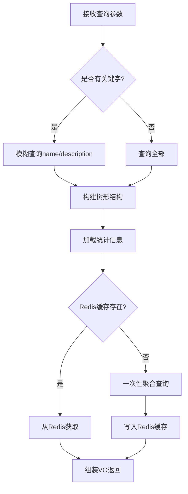
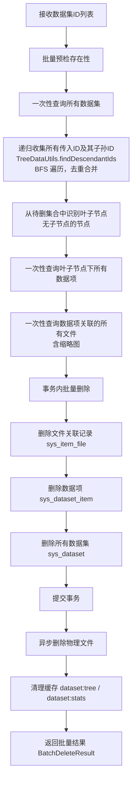
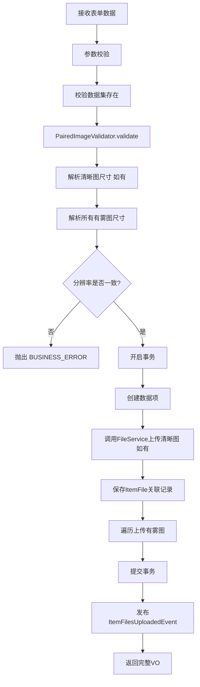

# 数据集管理模块 - 后端实现设计

## 1. 文档概述

### 1.1 文档目的

本文档描述数据集管理模块的后端实现方案，包括分层架构设计、核心业务逻辑（配对图片校验、级联删除、批量上传）、数据访问层设计、缓存策略及性能优化方案。

### 1.2 相关文档

- **需求规格**：[需求规格.md](./需求规格.md)
- **API 接口**：[API接口.md](./API接口.md)
- **数据库设计**：[03-数据库设计.md](../../../02-系统架构/03-数据库设计.md)
- **测试用例**：[测试用例.md](./测试用例.md)
- **文件管理**：[文件管理/后端实现.md](../../基础模块/文件管理/后端实现.md)（文件存储、MD5 去重）
- **任务管理**：[任务管理/后端实现.md](../../基础模块/任务管理/后端实现.md)（导出/下载任务的调度与执行）

## 2. 架构设计

### 2.1 模块分层架构

数据集管理模块依赖文件管理和任务管理两个基础模块。文件物理存储委托给文件管理模块的 `FileService`，导出/下载任务通过任务管理模块的策略模式注册执行：


**设计考量**：

- **ItemFileService 保留独立性**：数据集文件具有领域特殊性（配对关系、分辨率一致性校验、缩略图关联、场景/雾霾程度元数据），不同于通用文件管理。ItemFileService 负责 `sys_item_file` 关联表的 CRUD 和领域校验，物理文件操作委托给 FileService
- **导出整合到通用框架**：数据集导出的 ZIP 打包逻辑迁移到 `DatasetExportHandler`，由通用导入导出框架的 `GenericExportStrategy` 统一调度，注册到任务管理模块的 TaskStrategyFactory。旧的 `DatasetExportStrategy`/`ItemDownloadStrategy`/`BatchDownloadStrategy`/`CustomExportStrategy` 已删除
- **事件驱动解耦**：数据集创建/删除/上传等操作通过领域事件触发缓存失效和异步处理

### 2.2 核心组件职责

| 组件 | 职责描述 | 关键能力 |
|------|---------|---------|
| DatasetService | 数据集 CRUD 与树形结构管理 | 树形构建、统计聚合、级联删除 |
| DatasetItemService | 数据项 CRUD 与配对上传 | 配对校验、批量上传、文件名解析 |
| ItemFileService | 数据项-文件关联管理 | 关联表 CRUD、缩略图关联、领域元数据管理 |
| PairedImageValidator | 配对图片校验器 | 分辨率一致性、格式/大小限制（不做雾霾程度枚举校验） |
| DatasetExportHandler | 数据集导出处理器（注册到通用导入导出框架） | ZIP 打包、文件组织、进度回调 |

### 2.3 核心实体关系

> 表结构定义详见 [数据库设计.md](../../../02-系统架构/03-数据库设计.md)

| 实体 | 说明 |
|------|------|
| `sys_dataset` | 数据集表（支持树形结构） |
| `sys_dataset_item` | 数据项表 |
| `sys_item_file` | 数据项文件关联表（含领域元数据：场景类型、雾霾程度、宽高等） |
| `sys_file` | 文件表（由文件管理模块管理） |

**关系说明**：
- 数据集支持父子关系（树形结构）
- 一个数据集包含多个数据项
- 一个数据项包含多个文件（清晰图、有雾图等），通过 `sys_item_file` 关联
- 文件通过 MD5 去重（文件管理模块能力），多个数据项可引用同一物理文件

---

## 3. 内部领域对象

> API 层 DTO（Query/Form/VO）定义详见 [API接口.md](./API接口.md)，本章节仅描述 Service 层内部使用的领域对象。

### 3.1 DatasetStatistics（统计信息聚合对象）

Service 层内部使用，封装数据集统计聚合查询结果：

| 字段 | 类型 | 说明 |
|------|------|------|
| itemCount | Integer | 数据项数量 |
| fileCount | Integer | 文件总数 |
| totalSize | Long | 总大小（字节） |
| annotatedCount | Integer | 已标注图片数量（haze_level 非空） |
| unannotatedCount | Integer | 未标注图片数量（haze_level 为空） |
| sceneDistribution | Map&lt;String, Integer&gt; | 场景分布 |
| hazeDistribution | Map&lt;String, Integer&gt; | 雾霾程度分布 |
| formatDistribution | Map&lt;String, Integer&gt; | 格式分布 |

---

## 4. 核心业务逻辑

### 4.1 关键流程

#### 4.1.1 数据集列表查询



**性能优化**：
- 树形结构构建：一次性查询所有数据集，内存构建父子关系（BFS 算法，避免 N+1）
- 统计信息优先从 Redis 获取（Key: `dataset:stats:{id}`，TTL: 30 分钟）

#### 4.1.2 新增数据集

**业务规则**：
- 父数据集存在性校验：`parentId` 不为空时必须存在对应记录
- 名称唯一性校验：同一父数据集下 `name` 不能重复
- 存储目录生成规则：`/数据集根目录/父数据集名称/当前数据集名称`

**事件驱动**：创建成功后发布 `DatasetCreatedEvent`，异步触发：
- 失效树形结构缓存 `dataset:tree`
- 失效父数据集统计缓存

#### 4.1.3 数据集批量级联删除



**核心设计要点**：

1. **递归收集子孙节点**：三端统一使用 `TreeDataUtils.findDescendantIds`（Java）/ `GetDescendantIDs`（Go）/ `bfs_collect_ids`（Python）进行 BFS 遍历，从每个传入的 datasetId 出发逐层入队子节点，收集任意深度的子孙节点 ID，去重后合并到待删集合。**支持父子节点同时被选中**，通过 Set 去重避免子节点重复删除导致的错误。
2. **叶子节点识别**：数据项只存在于叶子节点下，从待删集合中过滤出"无子节点"的节点作为叶子节点，仅查询这些节点的数据项，避免对父节点的无效查询。
3. **批量查询优化**：所有数据项、文件查询均使用 `IN (...)` 一次性查询，将 O(n) 数据库操作降为 O(1)。
4. **事务边界**：数据库删除操作（item_file、dataset_item、dataset）在同一事务中，事务提交后通过 `DatasetDeletedEvent` 异步删除物理文件，避免长事务持有外部资源。

**级联删除范围**：
1. 所有传入数据集及其子孙数据集（递归，去重）
2. 所有关联的数据项（`sys_dataset_item`，仅叶子节点下）
3. 所有关联的文件关联记录（`sys_item_file`，含缩略图关联）
4. 所有物理文件（原图+缩略图）→ 异步删除，通过事件通知文件管理模块

**事务控制**：数据库删除操作在同一事务中，事务提交后通过 `DatasetDeletedEvent` 异步删除物理文件。

**Java 实现位置**：`DatasetOperationServiceImpl.batchDeleteDatasets(List<Long> datasetIds)`
**Go 实现位置**：`DatasetOperationService.BatchDeleteDatasets(ctx, req)`
**Python 实现位置**：`DatasetService.delete_datasets(db, redis, dataset_ids)`

#### 4.1.4 创建数据项并上传配对图片



**说明**：流程图取消了"清晰图必填/有雾图必填"的硬性校验步骤（E、F、G、H 节点），因为实际数据集规范多样（详见需求规格 2.6.2）。清晰图和有雾图均为可选，至少上传一张图片即可。

**与文件管理模块的协作**：
- 图片物理存储：调用 `FileService.saveFile(FileBO)` 完成上传和 MD5 去重
- 图片宽高解析：调用 `ImageProcessor` 获取分辨率信息
- 存储路径：使用数据集专用路径规则 `/{rootPath}/{datasetName}/{itemId}/{filename}`（通过 PathBuilder 扩展点或自定义路径参数实现）
- 缩略图：数据集模块在上传完成后通过 `ItemFilesUploadedEvent` 异步触发缩略图生成，生成结果关联到 `sys_item_file.thumbnail_file_id`

#### 4.1.5 导出任务

数据集的导出功能通过通用导入导出框架实现，数据集模块仅需实现 `DatasetExportHandler` 处理器：

1. **实现处理器**：实现 `ExportHandler` 接口，`getModule()` 返回 `"dataset"`，注册到 `ExportHandlerRegistry`
2. **创建任务**：调用 `ImportExportService.export("dataset", params, ...)` 提交导出任务
3. **策略执行**：由通用框架的 `GenericExportStrategy` 统一调度，通过注册表查找 `DatasetExportHandler` 执行 ZIP 打包逻辑

> 任务创建/查询/取消等通用接口、DTO 定义、状态流转、重试机制详见 [任务管理/后端实现.md](../../基础模块/任务管理/后端实现.md) 和 [任务管理/API接口.md](../../基础模块/任务管理/API接口.md)

**DatasetExportHandler 处理器**：

| 方法 | 说明 |
|------|------|
| getModule | 返回 `"dataset"` |
| estimateCount | 根据查询条件估算数据项数量 |
| export | 将数据集文件按选项打包为 ZIP，写入 OutputStream，通过 callback 回写进度 |
| getFieldConfigs | 返回空（数据集导出为 ZIP，不使用字段配置） |

**导出选项**（queryParams）：

| 参数 | 类型 | 说明 |
|------|------|------|
| structure | String | 文件组织方式：`by_item`（按数据项分目录）/ `flat`（扁平） |
| includeTypes | List&lt;String&gt; | 包含的图片类型（clear/hazy/depth/segment） |
| includeThumbnail | Boolean | 是否包含缩略图 |

> **说明**：旧的 `DatasetExportStrategy`、`ItemDownloadStrategy`、`BatchDownloadStrategy`、`CustomExportStrategy`、`AbstractExportStrategy` 已全部删除，导出逻辑统一由 `DatasetExportHandler` + 通用框架承载。

### 4.2 配对图片校验器

| 规则 | 说明 |
|------|------|
| 清晰图可选 | 数据项可只有清晰图、只有有雾图、或两者都有（适配不同数据集规范） |
| 格式校验 | 仅支持 jpg/jpeg/png/gif |
| 大小限制 | 单张不超过 10MB |
| 分辨率一致 | 同一数据项下所有图片分辨率必须完全一致（如上传了清晰图） |
| 雾霾程度格式 | haze_level 可空；非空时支持多种规范（light/medium/heavy、beta=X、A=X,beta=Y 等），不做硬性枚举校验 |

**取消硬性校验的说明**：实际数据集规范多样（详见需求规格.md 2.6.2），部分数据集无清晰图（如 RESIDE/RTTS），部分有雾图无雾霾参数标注，因此取消"清晰图必填/有雾图必填/雾霾程度仅限 light/medium/heavy"的硬性校验。

### 4.3 批量上传文件名解析

**图片类型识别（文件名关键字匹配，大小写不敏感）**：

- 清晰图（type=clear）：文件名含 `clear`、`gt`、`GT`、`clean` 之一
- 有雾图（type=hazy）：文件名含 `hazy`、`haze`、`Hazy`、`Haze` 之一
- 透射率图（type=trans）：文件名含 `trans`、`Transmission` 之一

**配对分组规则**：按文件名前导数字分组（如 `01_GT.png` 与 `01_hazy.png` 归为 "01" 组），无前导数字时按完整文件名 stem 分组。

**haze_level 自动解析规则**（从有雾图文件名提取，无法解析则为空）：

| 文件名模式 | 解析出的 haze_level | 适用数据集 |
|-----------|---------------------|-----------|
| `xxx_hazy_light.{ext}` | `light` | 自定义数据集 |
| `xxx_hazy_medium.{ext}` | `medium` | 自定义数据集 |
| `xxx_hazy_heavy.{ext}` | `heavy` | 自定义数据集 |
| `{id}_{idx}_{beta}.png`（如 `1000_1_0.74905.png`） | `beta=0.74905` | RESIDE/ITS、RSHAZE |
| `{id}_{A}_{beta}.jpg`（如 `0025_0.8_0.2.jpg`） | `A=0.8,beta=0.2` | RESIDE/OTS |
| `{id}_{beta}_{A}.png`（如 `1012_0.85_1.28.png`） | `beta=0.85,A=1.28` | Haze4K |
| 无参数后缀（如 `01_hazy.png`） | 空（NULL） | Dense-Haze、O-HAZE 等 |

示例：
```
01_GT.png
01_hazy.png
→ 识别为同一组（前导数字 01），清晰图 + 有雾图，haze_level 为空
```

### 4.4 数据项列表相关度计算

仅在有关键字搜索时启用：

| 匹配规则 | 得分 |
|---------|------|
| 名称完全匹配 | 100 分 |
| 名称包含关键字 | 50 分 |
| 场景类型匹配 | 20 分 |
| 描述包含关键字 | 10 分 |

### 4.5 事务管理

| 操作类型 | 事务级别 | 说明 |
|---------|---------|------|
| 查询操作 | 只读事务 | 优化数据库性能 |
| 创建数据集/数据项 | 读写事务 | 主表 + 关联表需事务保证 |
| 删除数据集 | 读写事务 | 级联删除需事务保证，物理文件删除在事务外异步执行 |
| 上传图片 | 读写事务 | 文件记录 + 关联记录需事务保证 |

### 4.6 事件驱动机制

| 事件类型 | 触发时机 | 异步处理内容 |
|---------|---------|-------------|
| DatasetCreatedEvent | 数据集创建成功后 | 失效树缓存、更新父节点统计 |
| DatasetUpdatedEvent | 数据集更新成功后 | 失效相关缓存 |
| DatasetDeletedEvent | 数据集删除成功后 | 异步删除物理文件、清理缓存 |
| ItemFilesUploadedEvent | 图片上传成功后 | 异步生成缩略图（固定宽度 200px，等比缩放）、失效统计缓存 |
| ItemDeletedEvent | 数据项删除成功后 | 异步删除物理文件、更新统计 |

---

## 5. 数据访问与数据依赖

> 表结构定义详见 [数据库设计.md](../../../02-系统架构/03-数据库设计.md)

### 5.1 依赖表清单

| 表名 | 关联方式 | 说明 |
|------|---------|------|
| sys_dataset | 主表 | 数据集信息，支持父子关系（parent_id 自关联） |
| sys_dataset_item | 外键关联 | 数据项，通过 dataset_id 关联数据集 |
| sys_item_file | 外键关联 | 数据项-文件关联，通过 item_id 关联数据项，file_id 关联文件 |
| sys_file | 引用（文件管理模块） | 文件元数据，由文件管理模块管理 |

### 5.2 关键字段约束

| 字段 | 约束 | 业务含义 |
|------|------|---------|
| sys_dataset.parent_id | 默认 0（根节点） | 树形结构自关联 |
| sys_dataset.(parent_id, name) | 联合唯一 | 同一父节点下名称不重复 |
| sys_item_file.type | VARCHAR(64)，取值：clear/hazy/trans/depth/segment | 图片类型（不做 ENUM 硬约束，支持扩展） |
| sys_item_file.thumbnail_file_id | 可空外键 | 关联缩略图文件 |
| sys_item_file.haze_level | VARCHAR(32)，可空 | 雾霾程度标识，支持多种规范（详见需求规格 2.6.2），仅 type=hazy 时有值 |

### 5.3 核心查询方法

| 方法名 | 说明 |
|--------|------|
| selectDatasetTree | 查询数据集树形结构（一次性加载，内存构建） |
| selectChildIds | 查询所有子数据集 ID（递归） |
| aggregateStatistics | 聚合统计查询（数据项数、文件数、大小、分布等） |
| searchWithRelevance | 带相关度的数据项搜索查询 |
| selectWithFiles | 查询数据项及关联文件（LEFT JOIN 避免 N+1） |
| selectPairedFiles | 查询配对图片（按数据项分组） |

### 5.4 查询优化要点

**避免 N+1 查询**：使用 LEFT JOIN 一次性加载数据项和文件

```xml
<select id="selectWithFiles" resultMap="DatasetItemWithFilesMap">
    SELECT di.*, sif.*, sf.url, sf.size_bytes
    FROM sys_dataset_item di
    LEFT JOIN sys_item_file sif ON di.id = sif.item_id
    LEFT JOIN sys_file sf ON sif.file_id = sf.id
    WHERE di.dataset_id = #{datasetId}
    ORDER BY di.create_time DESC
    LIMIT #{offset}, #{limit}
</select>
```

**索引依赖**：本模块核心查询依赖的索引设计详见 [数据库设计.md](../../../02-系统架构/03-数据库设计.md) 第 5.3 节。

---

## 6. 缓存设计

### 6.1 缓存 Key 规范

| 缓存对象 | 缓存 Key | TTL | 更新策略 |
|---------|---------|------|---------|
| 数据集树 | `dataset:tree` | 1 小时 | 增删改时失效 |
| 数据集统计 | `dataset:stats:{datasetId}` | 30 分钟 | 数据变更时失效 |
| 用户偏好 | `user:dataset:pref:{userId}` | 7 天 | 用户修改时更新 |

> 任务相关缓存（任务状态、进度、取消标志）由任务管理模块统一管理，Key 规范详见 [任务管理/后端实现.md](../../基础模块/任务管理/后端实现.md)

### 6.2 缓存更新规则

| 操作 | 失效的缓存 Key |
|------|--------------|
| 创建数据集 | `dataset:tree`、父节点 `dataset:stats:{parentId}` |
| 更新数据集 | `dataset:tree`、`dataset:stats:{id}` |
| 删除数据集 | `dataset:tree`、`dataset:stats:{id}`、父节点统计 |
| 上传图片 | `dataset:stats:{datasetId}` |
| 删除数据项 | `dataset:stats:{datasetId}` |

---

## 7. 安全设计

> 权限标识详见 [API接口.md](./API接口.md)

### 7.1 权限控制

| 权限标识 | 说明 |
|---------|------|
| sys:dataset:add | 新增数据集/数据项 |
| sys:dataset:edit | 编辑数据集/数据项/图片 |
| sys:dataset:delete | 删除数据集/数据项/图片 |
| sys:dataset:export | 导出数据集 |

### 7.2 安全防护

| 防护项 | 实现方式 |
|--------|---------|
| SQL 注入 | 参数化查询，排序字段白名单 |
| 文件上传安全 | 格式白名单（jpg/jpeg/png/gif）、单张 ≤ 10MB、内容嗅探校验 |
| 防重复提交 | Redis 分布式锁，锁定时间 3 秒 |
| 并发任务限制 | 委托任务管理模块控制（同用户同类型最大并发数） |

---

## 8. 异步任务设计

### 8.1 事件处理

数据集模块的异步处理通过领域事件实现：

1. 事件在事务提交后发布（`AFTER_COMMIT` 语义）
2. 事件处理器异步执行
3. 处理失败记录日志，由补偿任务兜底

### 8.2 定时任务

| 任务 | 执行频率 | 处理内容 |
|------|---------|---------|
| 缩略图补偿 | 每天凌晨 | 重试缩略图生成失败的文件（`thumbnail_file_id IS NULL` 且创建时间超过 1 小时） |

> 导出任务的过期清理、僵尸任务修复由任务管理模块统一处理，详见 [任务管理/后端实现.md](../../基础模块/任务管理/后端实现.md)

---

## 9. 性能目标

### 9.1 性能指标

| 接口 | 目标 P99 | 优化手段 |
|------|----------|----------|
| 数据集列表 | 300ms | Redis 缓存 + 内存构建树形结构 |
| 数据项列表 | 800ms | 组合索引 + LEFT JOIN 避免 N+1 |
| 数据项详情 | 100ms | LEFT JOIN 一次加载 |
| 上传配对图片 | 1s | 缩略图异步生成 |
| 批量上传 | 5s | 并发上传 + 异步处理 |
| 导出任务创建 | 100ms | 异步执行（委托任务管理模块） |

### 9.2 优化措施

| 优化项 | 实现方式 |
|--------|---------|
| 统计信息缓存 | Redis 缓存，TTL 30 分钟 |
| 树形结构缓存 | 一次性查询 + 内存构建 |
| 缩略图异步生成 | 事件驱动，上传后异步处理 |
| 文件删除异步化 | 事务提交后通过事件异步执行 |
| 批量操作优化 | 批量 SQL + 并发处理 |

---

## 10. 配置项

| 配置项 | 说明 | 默认值 |
|--------|------|--------|
| dataset.cache.tree-ttl | 树形结构缓存时间 | 1 小时 |
| dataset.cache.stats-ttl | 统计信息缓存时间 | 30 分钟 |
| dataset.item.default-page-size | 默认分页大小 | 20 |
| dataset.item.max-page-size | 最大分页大小 | 200 |
| dataset.upload.max-file-size | 单文件最大大小 | 10MB |
| dataset.upload.allowed-formats | 允许的文件格式 | jpg,jpeg,png,gif |
| dataset.thumbnail.width | 缩略图宽度 | 200px |
| dataset.thumbnail.quality | 缩略图质量 | 80% |
| dataset.export.base-dir | 导出文件临时目录 | /tmp/dataset-export |
| dataset.export.expire-hours | 导出链接有效期 | 24 小时 |
