# 算法管理模块 - 前端实现设计

## 1. 文档概述

本文档描述算法管理模块的前端实现方案，聚焦组件架构、状态管理、路由设计等架构决策。字段级业务规则、校验规则、评估指标定义、权限标识等见 [需求规格.md](./需求规格.md) 与 [API接口.md](./API接口.md)。

---

## 2. 组件树设计

### 2.1 组件树

```mermaid
graph TD
    AlgorithmList[AlgorithmList 算法列表页 左右布局]
    AlgorithmList --> CategoryTree[CategoryTree 分类树 parent_id层级+task_type分组]
    AlgorithmList --> AlgorithmTable[AlgorithmTable 算法表格 搜索+task_type筛选+操作]
    AlgorithmDetail[AlgorithmDetail 算法详情页]
    AlgorithmDetail --> DetailHeader[DetailHeader 基本信息+操作工具栏]
    AlgorithmDetail --> DetailTabs[DetailTabs 基本信息/技术信息/运营信息]
    AlgorithmForm[AlgorithmForm 新增/编辑表单]
    AlgorithmForm --> ConfigEditor[ConfigEditor JSON配置参数编辑器]
    AlgorithmAudit[AlgorithmAudit 审核页]
    AlgorithmAudit --> AuditForm[AuditForm 审核表单 通过/驳回]
    VersionManage[VersionManage 版本管理页]
    AlgorithmMonitor[AlgorithmMonitor 性能监控页]
    AlgorithmMonitor --> MetricsChart[MetricsChart 监控图表]
    PredictionTest[PredictionTest 预测测试页]
    PredictionTest --> ImageCompare[ImageCompare 图片对比]
    EvaluationResult[EvaluationResult 效果评估页]
    EvaluationResult --> MetricsDisplay[MetricsDisplay 评估指标展示]
    ImportExportToolbar[ImportExportToolbar 导入导出 通用组件]
```

### 2.2 组件职责

| 组件 | 职责 | 复用性 |
|------|------|--------|
| AlgorithmList | 列表页容器，左右布局编排分类树与表格 | 页面 |
| CategoryTree | 算法分类树，按 parent_id 层级组织，支持 task_type 分组筛选 | 列表页左侧 |
| AlgorithmTable | 算法列表表格，支持关键字搜索、task_type 筛选、状态展示、操作按钮 | 列表页右侧 |
| AlgorithmDetail | 详情页容器，头部信息 + 工具栏，主体 Tab 切换 | 页面 |
| AlgorithmForm | 新增/编辑表单，含基本信息/技术信息/运营信息分区 | 页面 |
| ConfigEditor | JSON 配置参数编辑器（动态表单） | 通用组件 |
| AuditForm | 审核表单（通过/驳回 + 驳回原因） | 审核页专用 |
| MetricsChart | 监控指标图表（调用次数趋势等） | 可复用 |
| ImageCompare | 图片对比展示（去雾前后） | 可复用于效果对比 |
| ImportExportToolbar | 导入导出工具栏，`module="algorithm"` 接入通用框架 | 通用组件 |

### 2.3 组件通信

| 通信场景 | 方式 |
|---------|---------|
| 父子组件 | Props / Events |
| 跨层级/兄弟组件 | 状态管理 Store |

组件分层：页面组件（对应路由，负责布局与数据获取）、业务组件（分类树/审核表单等）、通用组件（图表/配置编辑器/导入导出）。

---

## 3. 状态管理

### 3.1 Store 划分

| Store | 职责 |
|-------|------|
| algorithmStore | 算法列表、详情、版本管理、审核、导入导出 |
| predictionStore | 预测任务、结果、日志 |
| evaluationStore | 评估任务、结果、日志 |
| monitorStore | 监控数据、统计报表 |

### 3.2 核心 Actions

**algorithmStore**：fetchAlgorithmTree（支持 keywords/task_type 筛选）、getAlgorithmDetail、createAlgorithm、updateAlgorithm、deleteAlgorithm、updateStatus（状态变更）、auditAlgorithm（通过/驳回）、fetchVersionHistory、createVersion、rollbackVersion、exportAlgorithm/batchExportAlgorithms、downloadImportTemplate、importAlgorithm。

**predictionStore**：submitPrediction、getTaskStatus、fetchPredictionLogs。

**evaluationStore**：submitEvaluation、getTaskStatus、fetchEvaluationLogs。评估结果含 PSNR/SSIM 等指标，指标定义详见 [需求规格.md §2.10.2](./需求规格.md)。

**monitorStore**：fetchMonitorData、fetchStatsReport(algorithmId, timeRange)、startRealtimePolling/stopRealtimePolling。

### 3.3 推荐指数数据流

算法推荐指数由 [推荐管理模块](../../基础模块/推荐管理/需求规格.md) 计算并提供，本模块负责展示与初始值录入：列表/详情展示推荐指数（星级）；新增/编辑表单支持手动设置初始值（0-5 星），后续由推荐管理模块动态更新；导入/导出模板包含推荐指数字段。

---

## 4. 路由设计

| 路由路径 | 页面 | 说明 |
|---------|------|------|
| `/algorithm`（重定向 `/algorithm/list`） | AlgorithmList | 算法列表 |
| `/algorithm/:id` | AlgorithmDetail | 算法详情 |
| `/algorithm/create` | AlgorithmForm | 新增算法 |
| `/algorithm/:id/edit` | AlgorithmForm | 编辑算法 |
| `/algorithm/:id/audit` | AlgorithmAudit | 算法审核 |
| `/algorithm/:id/version` | VersionManage | 版本管理 |
| `/algorithm/:id/monitor` | AlgorithmMonitor | 性能监控 |
| `/algorithm/prediction` | PredictionTest | 预测测试 |
| `/algorithm/evaluation` | EvaluationResult | 效果评估 |

- **管理员路由**：算法管理为后台管理路由，操作类功能（新增/编辑/审核/删除/版本/导入/导出）需对应权限标识（权限标识清单见 [API接口.md §3](./API接口.md)），前端按权限标识控制按钮显隐，无权限隐藏对应操作按钮。查看算法详情/监控为登录用户默认权限，无独立权限标识；停用/启用通过编辑权限执行状态变更。
- **数据范围**：超级管理员/算法管理员可见全部算法；算法开发者仅可见本人创建；普通用户仅可见已发布算法。

---

## 5. 数据流

### 5.1 新增算法流程

填写基本信息 -> 配置模型文件路径 -> 配置技术参数（动态表单）-> 上传样例图片 -> 测试验证 -> 测试通过提交审核 -> 审核通过发布上线 -> 刷新算法列表。

### 5.2 修改算法流程

选择算法 -> 编辑 -> 修改信息 -> 判断是否升级版本：升级则上传新模型文件 + 更新版本号 + 记录变更日志；不升级则直接保存 -> 刷新列表。

### 5.3 算法状态流转

草稿(1) -> 测试中(2) -> 待审核(3) -> 已发布(4) -> 已停用(5)/已归档(6)。状态流转由后端状态机校验保证，非法流转被拒绝，前端按返回错误提示。活跃版本唯一，新增版本/回滚时新活跃版本立即生效，旧版本停止对外服务并触发该算法历史预测缓存失效。

---

## 6. 交互设计决策

### 6.1 树表格展示

列表页左右布局：左侧 CategoryTree 按 parent_id 层级 + task_type 分组组织（任务类型为分组维度），右侧 AlgorithmTable 支持关键字搜索、task_type 筛选、状态展示与操作按钮。分类树展开节点时按需懒加载子节点；大数据量时表格使用虚拟滚动。

### 6.2 算法状态切换

状态变更（停用/启用/归档）通过编辑权限执行，操作前弹确认对话框显示影响范围（停用后用户端不可见、不可选择；删除仅限草稿/已停用/已归档状态，二次确认不可恢复）。审核驳回时动态显示驳回原因输入框并置为必填。

### 6.3 模型文件管理

模型权重文件存储路径输入框（系统自动生成或用户指定），提交时由后端 HTTP HEAD 校验路径有效性。版本升级时上传新模型文件至文件存储模块后记录路径。模型导入路径（Python import_path）格式由前端预校验，减少无效提交。

### 6.4 参数配置动态表单

技术信息中"支持的参数列表"采用动态表单（ConfigEditor），支持添加多个参数项，参数名称不可重复。版本号格式前端按 vX.Y.Z 正则预校验。

### 6.5 校验交互

| 校验场景 | 交互设计 |
|---------|---------|
| 表单字段 | 失焦时触发同步校验，提交时统一校验所有字段 |
| 算法名称唯一性 | 提交时异步校验（调用后端），避免每次输入请求 |
| 导入文件 | 上传前前端校验文件格式与大小，行级数据校验由后端完成 |

### 6.6 错误处理

算法模块复用系统通用错误码体系（A 系列），不单独定义算法专属业务码。业务错误（如 A0501 数据已存在、A0502 状态不允许、A0701 文件格式不支持）显示后端返回的错误信息；未认证跳转登录页；禁止访问显示权限不足提示；资源不存在显示资源不存在提示。

### 6.7 性能优化

| 优化项 | 实现方式 |
|--------|---------|
| 分类树懒加载 | 展开节点时按需加载子节点 |
| 虚拟滚动 | 大数据量时使用虚拟列表 |
| 搜索防抖 | 输入防抖 300ms |
| 图表懒加载 | 进入视口后加载图表 |
| 轮询控制 | 页面不可见时停止监控轮询 |
| 请求取消 | 切换页面时取消未完成请求 |

---

## 7. 公共组件使用

组件职责见 §2.2，本节仅列复用公共组件时的配置增量：

| 公共组件 | 配置要点 |
|---------|---------|
| 树表格组件 | parent_id 层级 + task_type 分组，懒加载子节点，虚拟滚动 |
| 表单组件 | 动态参数表单，分区（基本/技术/运营信息），失焦校验 + 提交统一校验 |
| ImportExportToolbar | `module="algorithm"` 接入通用框架，支持模板下载、同步/异步导出、批量导入 |
| MetricsChart | 调用次数趋势，进入视口懒加载 |
| ImageCompare | 去雾前后对比，可复用于效果对比模块 |
