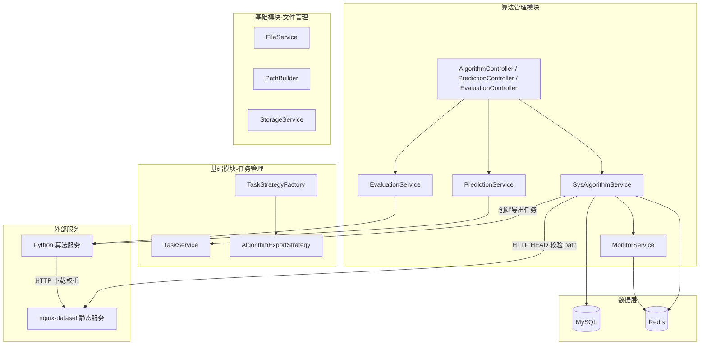
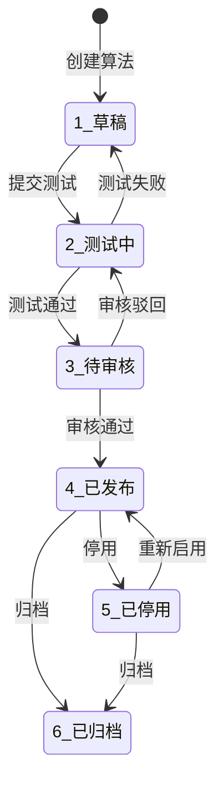
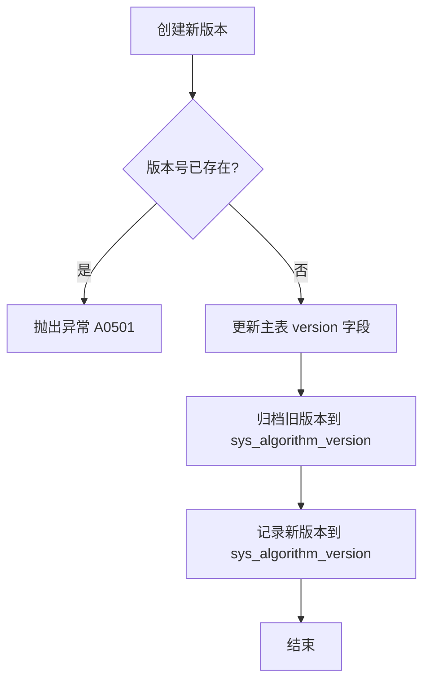
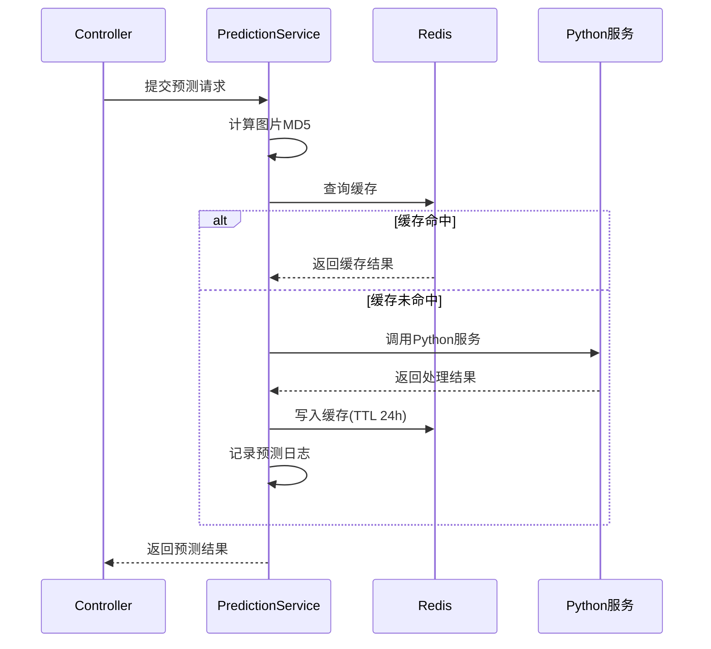

# 算法管理模块 - 后端实现设计

## 1. 文档概述

### 1.1 文档目的

本文档描述算法管理模块的后端实现方案，包括分层架构设计、核心业务逻辑（生命周期状态机、版本控制、审核机制、导入导出）、外部服务集成（Python 算法服务调用与熔断降级）、性能监控采集、缓存策略及安全设计。

### 1.2 相关文档

- **需求规格**：[需求规格.md](./需求规格.md)
- **API 接口**：[API接口.md](./API接口.md)（接口契约 SSOT）
- **数据库设计**：[03-数据库设计.md](../../../02-系统架构/03-数据库设计.md)（表结构 SSOT）
- **文件管理**：[文件管理/后端实现.md](../../基础模块/文件管理/后端实现.md)（用户上传文件存储、PathBuilder 路径生成）
- **任务管理**：[任务管理/后端实现.md](../../基础模块/任务管理/后端实现.md)（导出任务的调度与执行）

---

## 2. 架构设计

### 2.1 模块分层架构

算法管理模块依赖文件管理和任务管理两个基础模块。模型权重文件统一托管在 nginx-dataset 静态服务，Java 后端通过 HTTP HEAD 校验 `sys_algorithm.path` 字段可访问性并回填 `size`；Python 算法服务通过 `model_loader.resolve_model_path` 按需 HTTP 下载到本地缓存后由 `torch.load` 加载。算法的导入导出（Excel/CSV 元数据）通过通用导入导出框架统一实现：



**设计考量**：

- **模型权重 Nginx 静态托管**：算法权重文件不复用 `FileService`/MinIO，而是统一挂载到 nginx-dataset 容器 `/usr/share/nginx/html/models/` 下，访问 URL = `{algorithm.model.baseUrl}/{algorithm.path}`（如 `http://{DEHAZE_HOST}:9000/models/AECR-Net/NH_train.pk`）。`sys_algorithm.path` 字段为相对路径，是预测流程的单一真实来源
- **导入导出整合到通用框架**：`AlgorithmExportHandler`/`AlgorithmImportHandler` 实现通用框架的 Handler 接口，注册到 `ExportHandlerRegistry`/`ImportHandlerRegistry`，由 `GenericExportStrategy`/`GenericImportStrategy` 统一调度。旧的 JSON 导入导出和 `AlgorithmExportStrategy` 已删除，统一为 Excel/CSV 元数据导入导出（不含权重文件）
- **Python 服务直连**：预测和评估调用 Python 算法服务，具备独立的熔断/降级/重试机制，是算法模块特有的外部依赖

### 2.2 核心组件职责

| 组件 | 职责描述 | 关键能力 |
|------|---------|---------|
| SysAlgorithmService | 算法生命周期管理 | 状态流转、版本控制、审核处理 |
| PredictionService | 模型预测处理 | 调用 Python 服务、结果缓存、预测日志 |
| EvaluationService | 效果评估计算 | 多指标评估（PSNR/SSIM/LPIPS/NIQE/Entropy） |
| MonitorService | 性能监控采集 | 实时指标 → Redis HyperLogLog → MySQL 聚合 |
| AlgorithmExportHandler | 算法导出处理器（注册到通用导入导出框架） | Excel/CSV 元数据导出、进度回调 |
| AlgorithmImportHandler | 算法导入处理器（注册到通用导入导出框架） | Excel/CSV 元数据导入、校验 |

### 2.3 核心实体关系

> 表结构定义详见 [数据库设计.md](../../../02-系统架构/03-数据库设计.md)

| 实体 | 说明 |
|------|------|
| `sys_algorithm` | 算法主表，含 version/status/config_json/audit_by/audit_time/audit_remark 字段 |
| `sys_algorithm_version` | 版本历史表，支持版本回滚 |
| `sys_pred_log` | 预测日志，`idx_pred_cache` 复合索引用于缓存查询 |
| `sys_eval_log` | 评估日志，result JSON 存储多维评估指标 |
| `sys_file` | 文件表（由文件管理模块管理） |

---

## 3. 内部领域对象

> API 层 DTO（Query/Form/VO）定义详见 [API接口.md](./API接口.md)，本章节仅描述 Service 层内部使用的领域对象。

### 3.1 AlgorithmStatusContext（状态流转上下文）

封装状态转换的前置校验和后置操作：

| 字段 | 类型 | 说明 |
|------|------|------|
| currentStatus | Integer | 当前状态值 |
| targetStatus | Integer | 目标状态值 |
| operator | Long | 操作人 ID |
| auditRemark | String | 审核备注（驳回时必填） |
| requiredPermission | String | 所需权限标识 |

### 3.2 EvaluationResult（评估结果聚合）

评估服务内部使用，封装 Python 服务返回的多维指标：

| 字段 | 类型 | 说明 |
|------|------|------|
| psnr | Double | 峰值信噪比 |
| ssim | Double | 结构相似性 (0-1) |
| lpips | Double | 学习感知相似度 |
| niqe | Double | 自然图像质量 |
| entropy | Double | 信息熵 |
| processTime | Long | 处理时间（毫秒） |
| qualified | Boolean | 是否达标（基于阈值判定） |

---

## 4. 核心业务逻辑

### 4.1 算法生命周期管理

#### 状态流转图



#### 状态转换规则

| 当前状态 | 可转换状态 | 转换条件 | 权限要求 |
|---------|-----------|---------|---------|
| 1(草稿) | 2(测试中) | 完成基本信息填写和模型上传 | edit |
| 2(测试中) | 3(待审核) | 测试通过，评估指标达标 | edit |
| 2(测试中) | 1(草稿) | 测试失败或需要修改 | edit |
| 3(待审核) | 4(已发布) | 管理员审核通过 | audit |
| 3(待审核) | 2(测试中) | 审核驳回（需填写原因） | audit |
| 4(已发布) | 5(已停用) | 算法性能问题或维护需求 | stop |
| 5(已停用) | 4(已发布) | 问题修复完成 | stop |
| 4(已发布)/5(已停用) | 6(已归档) | 算法不再使用 | delete |

> 状态枚举定义见 `AlgorithmStatusEnum`（Java）/ `bo.AlgorithmStatus`（Go），状态值为 1-6。Java 和 Go 后端的状态流转校验规则已统一（Java `validateStatusTransition` / Go `bo.AllowedTransitions`），均不允许非法状态跳跃。

#### 发布前校验规则

| 校验项 | 规则 | 错误码 |
|--------|------|--------|
| 状态校验 | 必须为待审核(3)状态 | A0502 |
| 模型文件 | 模型文件必须存在且有效 | A0401 |

### 4.2 审核处理

| 操作 | 前置状态 | 后置状态 | 必填参数 |
|------|---------|---------|---------|
| 通过 | 待审核(3) | 已发布(4) | `approved=true` |
| 驳回 | 待审核(3) | 测试中(2) | `approved=false`、`remark`（驳回原因） |

审核操作需更新 `sys_algorithm` 表字段：
- `audit_by`：审核人 ID
- `audit_time`：审核时间
- `audit_remark`：审核备注（驳回时必填）

### 4.3 版本控制机制

#### 版本号规则

采用语义化版本号：`主版本.次版本.修订号`

| 版本类型 | 说明 | 示例 |
|---------|------|------|
| Major | 不兼容的 API 修改 | v2.0.0 |
| Minor | 向下兼容的功能新增 | v1.1.0 |
| Patch | 向下兼容的问题修正 | v1.0.1 |

#### 版本创建流程



> 模型权重文件不参与版本创建流程：`sys_algorithm.path` 直接指向 nginx-dataset 静态服务下的相对路径，版本升级通过替换 `trained_model/` 下同名文件实现，旧版本通过 Git 历史回滚恢复。当前阶段（v1）不支持同算法多版本权重并行。

### 4.4 导入/导出处理

算法模块的导入导出由通用导入导出框架统一调度，模块侧实现 `AlgorithmExportHandler` 和 `AlgorithmImportHandler`。导入导出范围为算法元数据（Excel/CSV），**不含模型权重文件**。通用框架负责文件生成/解析、进度回调、结果上传、任务状态管理，详见[任务管理/后端实现.md](../../基础模块/任务管理/后端实现.md)。

> **说明**：旧的 JSON 导入导出（`algorithm.json` + 模型文件 ZIP 打包）已删除，统一为 Excel/CSV 元数据导入导出。模型权重文件的上传/下载仍通过算法详情接口单独处理，不在导入导出范围。

#### AlgorithmExportHandler

实现 `ExportHandler` 接口，`getModule()` 返回 `"algorithm"`。

| 方法 | 说明 |
|------|------|
| estimateCount | 根据查询条件估算算法数据量 |
| export | 分批查询算法元数据，通过 callback 回写进度 |
| getFieldConfigs | 返回导出字段配置：算法名称、类型、版本、状态、导入路径、配置 JSON、创建时间 |

#### AlgorithmImportHandler

实现 `ImportHandler` 接口，`getModule()` 返回 `"algorithm"`。

| 方法 | 说明 |
|------|------|
| getFieldConfigs | 返回导入字段配置（算法名称、类型必填） |
| importBatch | 批量导入算法元数据：校验算法名称唯一性、创建算法记录（状态=草稿） |
| getTemplateSampleData | 返回模板示例数据 |

#### 导入校验规则

| 校验项 | 规则 | 错误码 |
|--------|------|--------|
| 文件格式 | 必须为 Excel/CSV | A0701 |
| 必填字段 | name、type 不能为空 | A0706 |
| 名称唯一 | 算法名称不能与已有算法重复 | A0707 |
| 字段格式 | type 必须为合法算法类型枚举 | A0707 |

### 4.5 模型预测处理



### 4.6 效果评估计算

| 指标 | 说明 | 合格阈值 |
|------|------|---------|
| PSNR | 峰值信噪比，越高越好 | ≥ 30.0 dB |
| SSIM | 结构相似性，0-1 | ≥ 0.8 |
| LPIPS | 学习感知相似度，越低越好 | ≤ 0.3 |
| NIQE | 自然图像质量，越低越好 | ≤ 5.0 |
| Entropy | 信息熵，越高越好 | 仅统计展示 |
| 处理时间 | 单张图片处理耗时 | ≤ 10s |

### 4.7 性能监控采集

#### 统计数据架构

```
实时指标 → Redis（HyperLogLog/Counter）
              ↓ 定时任务（5分钟）
历史归档 → MySQL（预聚合表）
```

#### 定时聚合任务

| 任务 | 执行频率 | 处理内容 |
|------|---------|---------|
| 实时聚合 | 5分钟 | Redis → MySQL 聚合 |
| 小时统计 | 每小时 | 聚合过去1小时数据 |
| 日统计 | 每天凌晨 | 聚合过去24小时数据 |

#### 统计报表接口（`GET /{id}/monitor/stats`）

独立实现，不复用 `getMonitorData`。基于 `sys_pred_log` 按日聚合查询，返回最近 N 天（默认 7 天）的统计数据，每天包含 `date`、`callCount`、`avgTime`、`successRate` 四个字段。支持 `days` 查询参数自定义天数。

### 4.8 事务管理

| 操作类型 | 事务级别 | 说明 |
|---------|---------|------|
| 查询操作 | 只读事务 | 优化数据库性能 |
| 创建算法 | 读写事务 | 主表 + 版本表需事务保证 |
| 版本回滚 | 读写事务 | 更新主表版本 + 写入版本记录 |
| 删除算法 | 读写事务 | 级联删除子孙算法 + 主表 + 版本记录，物理文件异步删除（三端统一使用 TreeDataUtils 递归收集子孙 ID 后批量删除，支持父子节点同时选中去重）。删除前校验状态：仅草稿(1)/已停用(5)/已归档(6)可删除（`AlgorithmStatusEnum.DELETABLE_STATUSES` / `bo.IsDeletableStatus`），其他状态返回 A0502 |
| 审核操作 | 读写事务 | 状态变更 + 审核字段更新 |

### 4.9 事件驱动机制

| 事件类型 | 触发时机 | 异步处理内容 |
|---------|---------|-------------|
| AlgorithmCreatedEvent | 算法创建成功后 | 失效列表缓存 |
| AlgorithmUpdatedEvent | 算法更新成功后 | 失效相关缓存 |
| AlgorithmDeletedEvent | 算法删除成功后 | 异步删除模型文件（通知文件管理模块）、清理缓存 |
| AlgorithmAuditedEvent | 审核操作完成后 | 发送审核结果通知 |
| VersionCreatedEvent | 新版本创建成功后 | 失效预测结果缓存 |
| PredictionCompletedEvent | 预测执行成功后 | 更新监控统计缓存 |

---

## 5. 数据访问与数据依赖

> 表结构定义详见 [数据库设计.md](../../../02-系统架构/03-数据库设计.md)

### 5.1 依赖表清单

| 表名 | 关联方式 | 说明 |
|------|---------|------|
| sys_algorithm | 主表 | 算法信息，含状态、配置、审核字段 |
| sys_algorithm_version | 外键关联 | 版本历史，通过 algorithm_id 关联主表 |
| sys_pred_log | 外键关联 | 预测日志，通过 algorithm_id 关联主表 |
| sys_eval_log | 外键关联 | 评估日志，result JSON 存储多维指标 |
| sys_file | 引用（文件管理模块） | 模型文件元数据，由文件管理模块管理 |

### 5.2 关键字段约束

| 字段 | 约束 | 业务含义 |
|------|------|---------|
| sys_algorithm.name | 唯一 | 算法名称不能重复 |
| sys_algorithm.status | ENUM(0-5) | 6 种生命周期状态 |
| sys_algorithm.version | 非空 | 语义化版本号 |
| sys_algorithm_version.(algorithm_id, version) | 联合唯一 | 同一算法下版本号不能重复 |
| sys_pred_log.(algorithm_id, image_md5) | 复合索引 | 预测结果缓存查询 |

### 5.3 核心查询方法

| 方法名 | 说明 |
|--------|------|
| selectAlgorithmTree | 算法树形表格查询（支持关键字筛选） |
| selectVersionHistory | 查询算法版本历史（按版本号倒序） |
| selectPredLogByCache | 根据算法 ID + 图片 MD5 查询预测缓存 |
| selectEvalLogs | 查询评估日志列表（分页） |
| aggregateMonitorStats | 聚合监控统计（按时间维度） |

---

## 6. 外部服务集成

### 6.1 Python 算法服务调用

| 配置项 | 值 | 说明 |
|--------|---|------|
| 协议 | HTTP/REST | 基于 HTTP 协议 |
| 超时时间 | 10秒 | 同步预测超时（MVP） |
| 重试次数 | 3次 | 失败自动重试 |
| 熔断阈值 | 失败率>30% + 最少10次请求 | 触发熔断保护 |

### 6.2 降级策略

| 场景 | 降级行为 | 用户提示 |
|------|---------|---------|
| Python 服务熔断（有缓存）| 返回缓存结果 | "服务繁忙，返回历史处理结果" |
| Python 服务熔断（无缓存）| 返回错误码 503 | "算法服务暂不可用，请稍后重试" |
| 评估服务超时 | 任务入队等待重试 | "评估任务已提交，结果稍后通知" |
| 模型文件加载失败 | 跳过该算法，标记异常 | "该算法暂不可用" |

### 6.3 文件存储路径规则

模型权重文件不复用 `FileService`/MinIO，统一托管在 nginx-dataset 静态服务下；用户主动上传的文件（图片、Excel 等）仍走 `FileService` → MinIO。两类文件路径规则如下：

| 文件类型 | 路径格式 | 存储介质 | 说明 |
|---------|---------|---------|------|
| 模型权重 | `{algorithm.path}`（相对路径，如 `AECR-Net/NH_train.pk`） | nginx-dataset 静态服务 | 访问 URL = `{algorithm.model.baseUrl}/{path}`；CRUD 时 Java/Python 后端通过 HTTP HEAD 校验可访问性并回填 `size`；预测时 Python 服务通过 `model_loader.resolve_model_path` HTTP 下载到 `MODEL_CACHE_DIR` 后 `torch.load` 加载 |
| 预测结果 | `/predictions/{date}/{taskId}/{filename}` | MinIO（`FileService` + `PathBuilder`） | 按日期/任务分目录 |
| 评估图片 | `/evaluations/{algorithmId}/{taskId}/` | MinIO（`FileService` + `PathBuilder`） | 按算法/任务分目录 |

**`sys_algorithm.path` 字段约束**：

- 子节点（叶子算法）：必须指向具体文件（含扩展名 `.pk`/`.pkl`/`.pth`/`.pt`），如 `AECR-Net/NH_train.pk`
- 父节点（算法分类）：可为目录名或空字符串
- 字段值为预测流程定位模型权重的**单一真实来源**，CRUD 时通过 HTTP HEAD 校验，预测时通过 `model_loader.resolve_model_path` 解析

**相关配置**：

- Java `algorithm.model.baseUrl`（[application-dev.yml](file:///e:/DehazeSystem/dehaze-java/src/main/resources/application-dev.yml)）：默认 `http://${DEHAZE_HOST}:9000/models`
- Python `MODEL_BASE_URL` / `MODEL_CACHE_DIR` / `MODEL_FALLBACK_TO_LOCAL`（[app/config.py](file:///e:/DehazeSystem/dehaze-python/app/config.py)）
- nginx-dataset 卷挂载：[docker-compose.yml](file:///e:/DehazeSystem/docker-compose.yml) 中 `./models:/usr/share/nginx/html/models:ro`

---

## 7. 缓存设计

### 7.1 缓存 Key 规范

| 缓存对象 | 缓存 Key | TTL | 更新策略 |
|---------|---------|------|---------|
| 算法列表 | `algorithm:list` | 30分钟 | 增删改时失效 |
| 算法详情 | `algorithm:detail:{id}` | 1小时 | 更新时失效 |
| 预测结果 | `prediction:{algorithmId}:{imageMd5}` | 24小时 | 版本更新时失效 |
| 实时监控 | `algorithm:monitor:{id}` | 5分钟 | 定时刷新 |

> 任务相关缓存（任务状态、进度、取消标志）由任务管理模块统一管理，Key 规范详见 [任务管理/后端实现.md](../../基础模块/任务管理/后端实现.md)

### 7.2 缓存更新规则

| 操作 | 失效的缓存 Key |
|------|--------------|
| 新增算法 | `algorithm:list` |
| 修改算法 | `algorithm:list`、`algorithm:detail:{id}` |
| 删除算法 | `algorithm:list`、`algorithm:detail:{id}` |
| 版本更新 | `algorithm:detail:{id}`、`prediction:{algorithmId}:*` |

---

## 8. 安全设计

> 权限标识详见 [API接口.md](./API接口.md#3-权限标识汇总)

### 8.1 权限控制

| 权限标识 | 说明 |
|---------|------|
| sys:algorithm:add | 新增算法 |
| sys:algorithm:edit | 编辑算法 |
| sys:algorithm:audit | 审核算法（通过/驳回） |
| sys:algorithm:stop | 停用/启用算法 |
| sys:algorithm:delete | 删除算法 |
| sys:algorithm:view | 查看算法 |
| sys:algorithm:version | 版本管理 |
| sys:algorithm:import | 导入算法 |
| sys:algorithm:export | 导出算法 |
| sys:algorithm:monitor | 性能监控 |

### 8.2 安全防护

| 防护项 | 实现方式 |
|--------|---------|
| SQL注入 | 参数化查询，排序字段白名单 |
| 文件上传 | 格式白名单(.pt/.pth/.onnx/.h5)、大小限制(≤500MB) |
| 导入包校验 | 格式(.zip)、大小(≤1GB)、结构完整性校验 |
| 防重复提交 | Redis 分布式锁，锁定时间3秒 |

---

## 9. 异步任务设计

### 9.1 事件处理

算法模块的异步处理通过领域事件实现：

1. 事件在事务提交后发布（`AFTER_COMMIT` 语义）
2. 事件处理器异步执行
3. 处理失败记录日志，由补偿任务兜底

### 9.2 定时任务

| 任务 | 执行频率 | 处理内容 |
|------|---------|---------|
| 实时监控聚合 | 5分钟 | Redis 实时指标 → MySQL 聚合 |
| 小时统计 | 每小时 | 聚合过去1小时监控数据 |
| 日统计 | 每天凌晨 | 聚合过去24小时监控数据 |
| 预测/评估僵尸任务恢复 | 60秒 | 扫描 `sys_pred_log`/`sys_eval_log` 中 `status=processing AND update_time < NOW() - INTERVAL 10 MINUTE` 的记录，标记为 `failed` 并写 `error_message='任务执行超时，服务可能已重启'` |

> 导出任务的过期清理、僵尸任务修复由任务管理模块统一处理，详见 [任务管理/后端实现.md](../../基础模块/任务管理/后端实现.md)

---

## 10. 性能目标

| 接口 | 目标 P99 | 优化手段 |
|------|----------|----------|
| 算法列表 | 300ms | 缓存 + 索引 |
| 算法详情 | 100ms | 缓存 |
| 模型预测（POST） | 200ms | 异步任务模式：保存 processing 日志后立即返回，计算在 `@Async` 线程池中执行 |
| 模型预测（GET 轮询） | 100ms | 基于日志表 status 字段查询，命中 Redis 缓存直接返回 |
| 效果评估（POST） | 200ms | 异步任务模式：同预测 |
| 效果评估（GET 轮询） | 100ms | 同预测 |
| 监控数据 | 500ms | 预聚合 + 时间索引 |

---

## 11. 配置项

| 配置项 | 说明 | 默认值 |
|--------|------|--------|
| **Python 服务** | | |
| algorithm.python.base-url | Python 服务地址 | http://localhost:8991 |
| algorithm.python.timeout | 请求超时时间 | 10s |
| algorithm.python.retry-count | 重试次数 | 3 |
| algorithm.python.circuit-breaker.failure-rate | 熔断失败率阈值(%) | 30 |
| algorithm.python.circuit-breaker.min-calls | 熔断最小请求数 | 10 |
| **缓存** | | |
| algorithm.cache.prediction-ttl | 预测结果缓存时间 | 24h |
| **文件上传** | | |
| algorithm.upload.max-model-size | 模型文件最大大小 | 500MB |
| algorithm.upload.max-import-size | 导入包最大大小 | 1GB |
| algorithm.upload.allowed-formats | 允许的模型格式 | .pt,.pth,.onnx,.h5 |
| **评估阈值** | | |
| algorithm.evaluation.psnr-threshold | PSNR 合格阈值 | 30.0 |
| algorithm.evaluation.ssim-threshold | SSIM 合格阈值 | 0.8 |
| algorithm.evaluation.lpips-threshold | LPIPS 合格阈值 | 0.3 |
