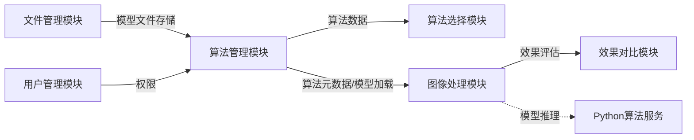
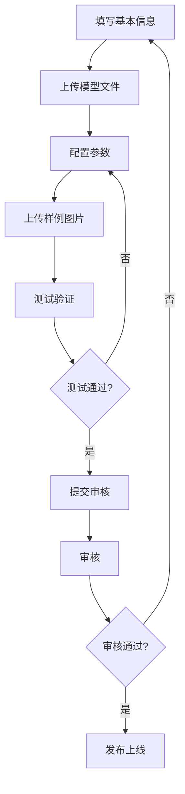
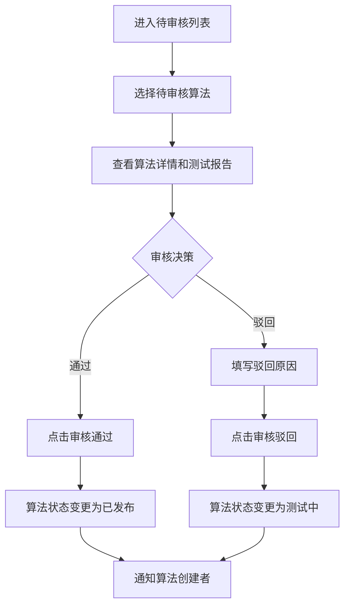
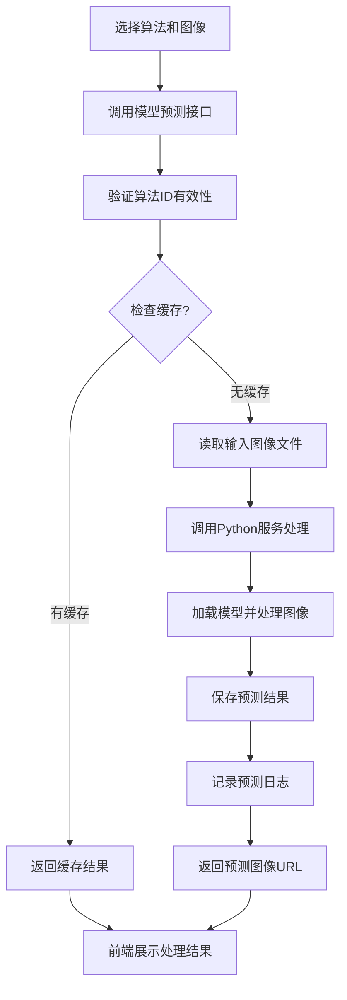
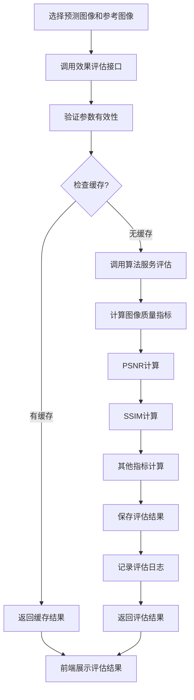
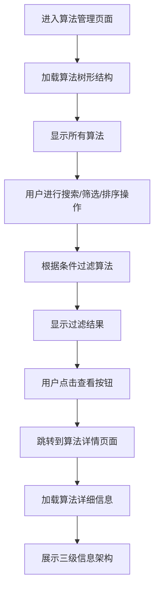
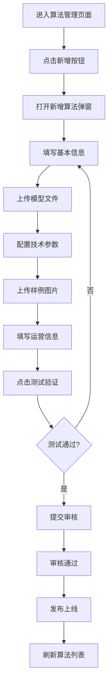
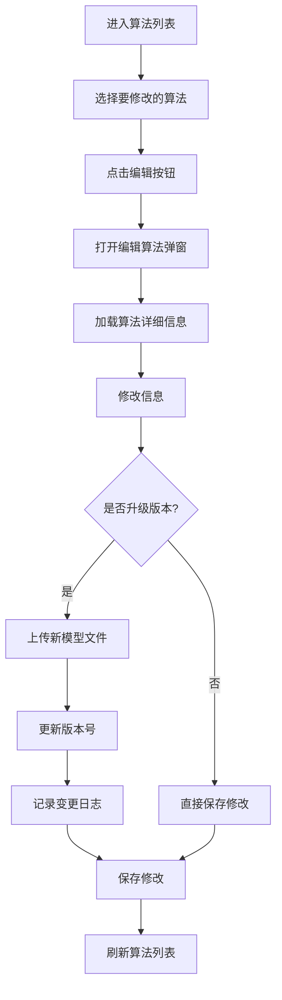
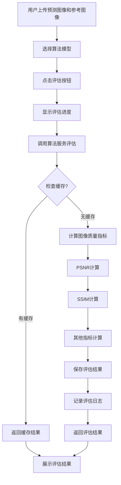

# 算法管理模块需求规格

## 1. 模块概述

### 1.1 模块定位

算法管理模块是AI图像处理平台的核心管理模块，负责管理系统中图像处理算法模型的全生命周期，提供算法的创建、浏览、编辑、删除、发布、停用等完整管理功能，包括算法的版本控制、性能监控、导入导出等核心能力。

作为系统核心模块之一，算法管理模块为【算法选择模块】提供算法数据源，向【图像处理模块】与【效果对比模块】提供算法元数据与模型加载能力（预测调用入口归属【图像处理模块】，效果评估入口归属【效果对比模块】，本模块仅保留算法侧契约），是整个系统算法资产管理的中枢。

> **任务类型（task_type）维度**：算法按 `type` 字段分类（自由字符串，经算法分类树组织），并按 `task_type` 维度归类（必填单选）（去雾/去雨/去雪/低光/超分/去噪/修复），Python 算法服务按 `task_type` 路由到对应算法集合。

### 1.2 核心价值

| 价值维度 | 具体内容 |
|---------|---------|
| **全生命周期管理** | 支持算法从创建、测试、审核到发布、停用、归档的完整流程管理 |
| **版本控制** | 支持算法多版本管理（历史版本、活跃版本标记）与版本回滚 |
| **性能监控** | 监控调用次数、处理时间、成功率与今日调用趋势 |
| **效果评估** | 支持 PSNR/SSIM 质量指标计算与展示 |
| **权限管理** | 细粒度的操作权限控制和数据权限隔离 |
| **缓存机制** | 基于MD5的处理结果缓存，避免重复计算，提升系统性能 |

### 1.3 用户角色分析

| 用户类型 | 特征 | 使用偏好 | 功能需求 |
|---------|------|---------|---------|
| **算法研究员** | 负责算法开发、测试和优化，熟悉深度学习模型 | 频繁上传/管理模型 | 模型上传+版本控制+效果评估+性能监控 |
| **系统管理员** | 拥有完整操作权限，管理全局算法配置 | 权限控制+数据清理 | 全量管理+权限配置+审计+发布审核 |
| **算法开发者** | 负责新算法的集成和配置 | 快速集成+调试 | 模型新增+参数配置+测试验证 |
| **运营人员** | 关注算法使用情况和用户反馈 | 数据分析+报表 | 使用统计+性能监控+用户反馈管理 |
| **普通用户** | 使用公开算法进行图像处理 | 浏览+选择+使用 | 算法浏览+参数调整+结果预览 |

### 1.4 模块依赖关系



---

## 2. 功能需求

### 2.1 算法列表展示 (F-M05-001)

#### 2.1.1 功能描述

以树形结构展示所有算法列表，支持查看算法基本信息、技术信息和统计数据，提供搜索、筛选和排序功能。

#### 2.1.2 算法类型与任务类型

**算法类型**：算法通过 `type` 字段标识类型，为自由字符串，常用取值如下（类型随算法分类树组织，可扩展）：

| 类型值 | 类型标签 | 说明 | 典型模型 |
|--------|----------|------|---------|
| `traditional` | 传统算法 | 基于物理模型的算法 | DCP, CAP |
| `deep_learning` | 深度学习 | 基于深度学习的算法 | RIDCP, WPXNet, Dehamer |
| `transformer` | Transformer | 基于 Transformer 的算法 | Dehamer, ViT |
| `custom` | 用户自定义 | 用户上传的私有算法模型 | - |

**任务类型（task_type）**：

| task_type 值 | 任务名称 | 说明 |
|-------------|---------|------|
| `dehaze` | 去雾 | 去除图像雾霾 |
| `derain` | 去雨 | 去除图像雨纹/雨滴 |
| `desnow` | 去雪 | 去除图像雪花 |
| `lowlight` | 低光增强 | 增强低光照图像 |
| `super_resolution` | 超分辨率 | 提升图像分辨率 |
| `denoise` | 去噪 | 去除图像噪声 |
| `inpaint` | 图像修复 | 修复图像缺失区域 |

> 每个算法关联一个任务类型（`sys_algorithm.task_type`），用于算法归类与处理路由（见 §1.1）。

#### 2.1.3 算法状态

> 对应数据库字段：详见 [数据库设计](../../../02-系统架构/03-数据库设计.md)

| 状态值 | 状态名称 | 说明 | 可执行操作 |
|--------|---------|------|-----------|
| 1 | 草稿 | 新创建，尚未完成配置 | 编辑、删除、提交测试 |
| 2 | 测试中 | 正在进行功能测试 | 编辑、提交审核 |
| 3 | 待审核 | 已提交审核，等待审核员处理 | 审核通过、审核驳回 |
| 4 | 已发布 | 审核通过，对外可用 | 停用、编辑（生成新版本） |
| 5 | 已停用 | 暂时下线，不可使用 | 启用、删除 |
| 6 | 已归档 | 永久归档，只读 | 查看、删除 |

**状态流转规则**

```
草稿(1) ──提交测试──▶ 测试中(2)
测试中(2) ──提交审核──▶ 待审核(3)
测试中(2) ──回退──▶ 草稿(1)
待审核(3) ──审核通过──▶ 已发布(4)
待审核(3) ──审核驳回──▶ 测试中(2)
已发布(4) ──停用──▶ 已停用(5)
已发布(4) ──归档──▶ 已归档(6)
已停用(5) ──启用──▶ 已发布(4)
已停用(5) ──归档──▶ 已归档(6)
已归档(6) ──▶ 终态（不可变更）
草稿(1)/已停用(5)/已归档(6) ──删除──▶ [逻辑删除]
```

> 状态流转由三端统一的状态机校验（`validateStatusTransition`）保证，非法流转被拒绝。

#### 2.1.4 列表信息展示

**基本信息**

| 字段 | 说明 | 示例 |
|------|------|------|
| 算法ID | 系统唯一标识 | 1001 |
| 算法名称 | 支持中英文，支持树形展示 | "AOD-Net" |
| 算法类型 | 传统/深度学习/用户自定义/实验性 | "深度学习" |
| 任务类型 | 去雾/去雨/去雪/低光/超分/去噪/修复 | "去雾" |
| 算法状态 | 草稿/测试中/待审核/已发布/已停用/已归档 | 🟢 已发布 |
| 版本号 | 格式：主版本.次版本.修订号 | "v2.1.3" |
| 创建时间 | YYYY-MM-DD HH:mm | 2025-01-15 10:30 |
| 最后更新时间 | YYYY-MM-DD HH:mm | 2025-01-17 14:20 |

**统计信息（缓存）**

列表页展示简要统计（使用次数、平均评分、成功率、平均处理时间、平均PSNR/SSIM），完整运营信息见 §2.2.3。

**技术信息**

| 字段 | 说明 | 示例 |
|------|------|------|
| 模型大小 | 权重文件大小 | "45.6MB" |
| 参数量 | 模型参数总数 | "5.2M" |
| FLOPs | 浮点运算量 | "12.3G" |

#### 2.1.5 树形结构管理

**功能要求**

算法列表页面需提供：
- 搜索功能：按算法名称关键字搜索（`keywords`），支持重置
- 操作功能：新增算法（权限：sys:algorithm:add）
- 展示内容：算法树（parent_id 层级）、算法名称、算法类型、算法状态、版本号
- 操作按钮：查看、编辑、停用/启用、删除、版本管理、审核（各需对应权限控制）

**树形结构规则**

- 算法按 `parent_id` 层级组织为树形（算法分类为顶级节点，具体算法为其子节点），支持展开/收起
- 算法名称在系统中必须唯一
- 支持按关键字搜索过滤

> 支持按任务类型（task_type）搜索筛选，算法选择模块的树形结构增加任务类型维度（见 §1.1）。

---

### 2.2 算法详情查看 (F-M05-002)

#### 2.2.1 功能描述

点击算法"查看"按钮，进入算法详情页面，展示算法的完整详细信息，包括三级信息架构：基本信息、技术信息、运营信息。

#### 2.2.2 页面内容

**头部信息区域**

展示算法的基本信息：
- 算法名称、类型、状态、版本号
- 创建时间、创建人、最后更新时间
- 标签、推荐指数

**工具栏区域**

提供以下功能：
- 操作按钮：编辑、状态变更（停用/启用/归档）、删除、版本管理、审核（待审核状态）

**详情信息区域**

#### 2.2.3 三级信息架构

**一级信息：基本信息**

| 字段 | 说明 |
|------|------|
| 算法ID | 系统唯一标识 |
| 算法名称（中英文） | 名称标识 |
| 算法类型 | 传统/深度学习/用户自定义/实验性 |
| 任务类型 | 去雾/去雨/去雪/低光/超分/去噪/修复（单选） |
| 算法版本 | 版本号 |
| 算法状态 | 草稿/测试中/待审核/已发布/已停用/已归档 |
| 创建时间 | 创建时间 |
| 更新时间 | 最后更新时间 |
| 创建人 | 创建者姓名 |
| 描述信息 | 算法描述 |
| 适用场景 | 算法适用场景 |
| 标签 | 算法标签（多个） |
| 推荐指数 | 0-5星 |

**二级信息：技术信息**

| 字段 | 说明 |
|------|------|
| 模型存储路径 | 模型权重文件存储路径（nginx-dataset 相对路径，经 HTTP HEAD 校验存在性） |
| 模型导入路径 | 模型Python代码导入路径 |
| 模型大小 | 权重文件大小 |
| 参数量 | 模型参数总数 |
| FLOPs | 浮点运算量 |
| 算法描述 | 算法说明 |

**三级信息：运营信息**

**使用统计**
- 总使用次数
- 日使用次数
- 月使用次数
- 使用趋势图（近7天/30天）

**性能统计**
- 平均处理时间
- 最大/最小处理时间
- 处理时间分布
- 成功率
- 失败率
- 平均PSNR（见 §2.8.2）
- 平均SSIM（见 §2.8.2）
- 性能趋势图

**用户反馈**
- 平均评分
- 评分分布（5星到1星的占比）
- 用户评论列表
- 问题反馈列表

---

### 2.3 新增算法 (F-M05-003)

#### 2.3.1 功能描述

添加新的去雾算法到系统中，支持完整的算法上传、配置、测试、审核、发布流程。

#### 2.3.2 新增流程



#### 2.3.3 必填信息

**基本信息**

| 字段 | 类型 | 必填 | 校验规则 | 说明 |
|------|------|------|---------|------|
| 算法名称（中文） | 输入框 | ✅ | 不能为空，唯一 | - |
| 算法名称（英文） | 输入框 | ✅ | 不能为空，唯一 | - |
| 任务类型 | 下拉选择 | ✅ | 不能为空 | 去雾/去雨/去雪/低光/超分/去噪/修复（单选） |
| 算法类型 | 下拉选择 | ✅ | 不能为空 | 传统/深度学习/用户自定义/实验性 |
| 算法版本 | 输入框 | ✅ | 格式：vX.Y.Z | - |
| 算法描述 | 文本域 | ✅ | 不能为空 | - |
| 适用场景 | 输入框 | ✅ | 不能为空 | - |

**技术信息**

| 字段 | 类型 | 必填 | 校验规则 | 说明 |
|------|------|------|---------|------|
| 模型文件路径 | 输入框 | ✅ | 不能为空 | 系统自动生成或用户指定 |
| 模型导入路径 | 输入框 | ✅ | 不能为空 | Python导入路径 |
| 算法原理 | 文本域 | ❌ | - | - |
| 支持的参数列表 | 动态表单 | ❌ | - | 支持添加多个参数 |
| 输入输出规格 | 文本域 | ❌ | - | - |
| 硬件要求 | 文本域 | ❌ | - | - |
| 输入分辨率 | 输入框 | ❌ | - | 例如：512×512 |

**运营信息**

| 字段 | 类型 | 必填 | 校验规则 | 说明 |
|------|------|------|---------|------|
| 推荐指数 | 星级评分 | ❌ | 0-5星 | 默认0星 |
| 标签 | 标签选择 | ❌ | - | 多选 |
| 样例图片 | 文件上传 | ❌ | - | 上传多张样例图片 |
| 使用说明 | 文本域 | ❌ | - | - |

#### 2.3.4 验证规则

| 校验项 | 规则 | 错误提示 |
|--------|------|---------|
| 算法名称 | 中文和英文名称都不能为空，且不能与已有算法重复 | "算法名称不能为空或重复" |
| 模型文件路径 | 路径必须有效且可访问 | "模型文件路径无效" |
| 模型导入路径 | 导入路径格式必须有效 | "模型导入路径格式错误" |
| 版本号 | 格式必须为vX.Y.Z（例如：v2.1.3） | "版本号格式错误，应为vX.Y.Z" |
| 参数配置 | 参数名称不能重复 | "参数名称不能重复" |
| 测试验证 | 必须通过测试才能提交审核 | "请先完成测试验证" |

---

### 2.4 审核算法 (F-M05-004)

#### 2.4.1 功能描述

对提交审核的算法进行审核，支持审核通过和审核驳回操作。

#### 2.4.2 审核角色

| 角色 | 权限 | 说明 |
|------|------|------|
| 算法管理员 | `sys:algorithm:audit` | 可审核所有待审核算法 |
| 超级管理员 | `sys:algorithm:audit` | 可审核所有待审核算法 |

#### 2.4.3 审核操作

**审核通过**

| 项目 | 说明 |
|------|------|
| 前置状态 | 待审核(3) |
| 后置状态 | 已发布(4) |
| 操作效果 | 算法对外可见，可被用户选择使用 |

**审核驳回**

| 项目 | 说明 |
|------|------|
| 前置状态 | 待审核(3) |
| 后置状态 | 测试中(2) |
| 必填信息 | 驳回原因（文本，必填） |
| 操作效果 | 算法返回测试阶段，开发者可修改后重新提交 |

#### 2.4.4 审核标准

| 检查项 | 标准 | 必须通过 |
|--------|------|---------|
| 测试验证 | 算法已通过功能测试 | ✅ |
| 基本信息完整 | 名称、描述、类型等必填项完整 | ✅ |
| 模型文件可用 | 模型文件存在且可正常加载 | ✅ |

> 审核为人工决策（`/algorithms/{id}/audit` 填写审核结论），当前无成功率/耗时的自动校验门槛。

#### 2.4.5 审核流程



---

### 2.5 修改算法 (F-M05-005)

#### 2.5.1 功能描述

修改已有算法的信息，支持版本控制和变更日志记录。

#### 2.5.2 可修改内容

**基本信息修改**

- 算法描述
- 适用场景
- 标签
- 推荐指数
- 使用说明

**技术信息修改**

- 参数配置
- 样例图片
- 算法原理
- 硬件要求

**版本升级**

- 上传新模型文件
- 更新版本号
- 记录变更日志
- 保留历史版本

#### 2.5.3 版本控制

**版本号规则**

- 格式：主版本.次版本.修订号
- 示例：v2.1.3
- 主版本（Major）：不兼容的API修改
- 次版本（Minor）：向下兼容的功能性新增
- 修订号（Patch）：向下兼容的问题修正

**版本管理**

- 查看历史版本：展示所有历史版本列表（`/algorithms/{id}/versions`）
- 新增版本：上传新版本（版本号 + 变更日志 + 配置快照），标记活跃版本
- 版本回滚：回滚到指定的历史版本（`/algorithms/{id}/rollback`）

**活跃版本规则**

- 唯一性约束：每个算法同一时间仅有一个活跃版本对外服务；新增版本或版本回滚时，新活跃版本立即生效，原活跃版本转为历史版本
- 旧版本下线策略：已发布算法编辑生成新版本时，旧版本立即停止对外服务（保留为历史版本，可供回滚），不再接收新的预测请求
- 缓存失效：活跃版本切换（新增版本/回滚）触发该算法历史预测缓存自动失效（缓存 Key 含版本号，见 §2.9.3）

**变更日志**

每次修改算法时，需记录变更日志：

| 字段 | 说明 |
|------|------|
| 变更类型 | 新增/修改/删除 |
| 变更字段 | 修改的字段名 |
| 修改前值 | 修改前的值 |
| 修改后值 | 修改后的值 |
| 变更时间 | 变更发生时间 |
| 变更人 | 执行变更的用户 |
| 变更说明 | 变更说明文本 |

---

### 2.6 停用/删除算法 (F-M05-006)

#### 2.6.1 停用算法

**停用条件**

- 算法存在问题（性能不达标、处理失败率高）
- 需要维护升级
- 不再推荐使用

**停用效果**

- 用户端不可见
- 不可选择使用
- 保留历史数据和模型文件
- 可以重新启用

**停用流程**

1. 用户触发停用操作
2. 系统弹出确认对话框，显示影响范围
3. 用户确认后执行停用
4. 刷新算法列表并显示成功提示

#### 2.6.2 删除算法

**删除条件**

- 算法状态为草稿(1)/已停用(5)/已归档(6)
- 确认不再使用
- 管理员权限

**删除效果**

- 从系统中移除
- 删除模型文件
- 保留使用记录
- 不可恢复（需二次确认）

**删除流程**

1. 用户触发删除操作
2. 系统弹出确认对话框，明确提示：
   - 删除后将不可恢复
   - 删除影响的范围（使用次数、关联任务等）
3. 用户确认后执行删除
4. 刷新算法列表并显示成功提示

---

### 2.7 算法导入/导出 (F-M05-007)

#### 2.7.1 功能描述

支持算法配置元数据的导入导出，便于批量管理和数据迁移。导入导出由通用导入导出框架统一调度（`/algorithms/_export`、`/algorithms/_import`、`/algorithms/template`），范围为算法**元数据**（Excel/CSV），**不含模型权重文件**，支持同步/异步导出与模板导入。

#### 2.7.2 导出功能

**导出内容**

| 内容 | 格式 | 说明 |
|------|------|------|
| 算法元数据 | Excel/CSV | 基本信息、类型、版本、状态、导入路径、配置、创建时间 |

**导出格式**：`.xlsx`（默认）或 `.csv`（通过 `format` 参数指定）

**导出限制**
- 支持同步导出（数据量小，直接返回文件流）和异步导出（数据量大，返回任务 ID）
- 仅支持导出自己创建的算法或已发布的公开算法

#### 2.7.3 导入功能

**导入流程**

1. 下载导入模板（Excel/CSV）
2. 按模板填写算法元数据
3. 上传 Excel/CSV 文件
4. 系统校验数据（格式、必填、唯一性）
5. 批量创建算法（状态=草稿）

**导入校验**

导入校验规则（文件格式、必填字段、名称唯一、文件大小及对应错误码）以 [API接口.md §4](./API接口.md) 契约为准。任务类型（task_type）字段纳入导入模板与校验（见 §1.1）。

**冲突处理**
- 名称冲突：该行数据校验失败，跳过或中止（按导入模式 `mode` 配置）

---

### 2.8 算法性能监控 (F-M05-008)

#### 2.8.1 功能描述

展示算法的性能指标和使用情况，提供监控数据与统计报表，支撑算法迭代决策。

#### 2.8.2 监控指标

**核心指标**（`/algorithms/{id}/monitor`）：

| 指标名称 | 说明 | 计算方式 |
|---------|------|---------|
| 调用次数 | 算法被调用的总次数 | 预测日志计数 |
| 平均处理时间 | 平均处理一张图像的时间 | 所有处理时间的平均值 |
| 成功率 | 处理成功的比例 | 成功次数 / 总次数 |
| 今日调用次数 | 当天的调用次数 | 今日预测日志计数 |

**统计报表**（`/algorithms/{id}/monitor/stats`）：

- 按天统计（默认近 7 天，可指定天数），返回每日调用次数等趋势数据
- 支持自定义统计天数

#### 2.8.3 监控展示

**展示内容**

- 核心指标卡片（调用次数、平均耗时、成功率、今日调用）
- 每日调用趋势图（统计报表数据）

**历史统计**

- 支持按天数查看历史统计（默认 7 天，可配置）

---

### 2.9 模型预测处理 (F-M05-009)

#### 2.9.1 功能描述

根据指定算法模型对输入图像进行图像处理，返回处理后的图像结果，支持处理结果缓存机制。处理类型由所选算法决定（`algorithmId` 路由）。

#### 2.9.2 处理流程



#### 2.9.3 缓存机制

**缓存策略**：Redis 缓存，TTL 24 小时过期，算法变更时主动失效

**缓存 Key**：包含算法 ID + 版本号 + 输入图像哈希，确保版本切换或配置变更后历史缓存自动隔离

**验收口径**：
- 相同图像 + 相同算法 + 相同版本的重复请求应命中缓存，不重复调用算法服务
- 算法版本升级、配置变更（含不升级版本的直接保存修改）均触发该算法历史缓存失效
- 缓存空间不足时，自动淘汰最久未使用的缓存条目

#### 2.9.4 预测日志

记录字段：日志ID、算法ID、用户ID、原始文件信息、预测文件信息、处理时间、创建时间

---

### 2.10 效果评估计算 (F-M05-010)

#### 2.10.1 功能描述

根据预测图像和参考图像计算图像质量指标，支持多种评估指标的计算，提供评估结果的可视化展示。

#### 2.10.2 评估指标

| 指标名称 | 英文名称 | 说明 | 取值范围 |
|---------|---------|------|---------|
| 峰值信噪比 | PSNR | 衡量图像质量的常用指标 | 越高越好（通常>30dB为好） |
| 结构相似性 | SSIM | 衡量结构相似性的指标 | 0-1，越接近1越好 |
| 学习感知图像块相似度 | LPIPS | 基于深度学习的感知相似度指标 | 0-1，越低越好 |
| 信息熵 | Entropy | 衡量信息丰富度 | 越高越好 |
| 自然图像质量评价 | NIQE | 无参考质量评价 | 越低越好 |

#### 2.10.3 评估流程



#### 2.10.4 缓存机制

**缓存策略**：LRU（最近最少使用）淘汰机制

**验收口径**：
- 相同预测图像 + 相同参考图像的重复评估请求应命中缓存
- 评估结果应永久有效
- 缓存空间不足时，自动淘汰最久未使用的缓存条目

#### 2.10.5 评估日志

记录字段：日志ID、算法ID、用户ID、预测文件信息、参考文件信息、处理时间、评估结果JSON、创建时间

---

## 3. 用户交互流程

### 3.1 算法浏览流程



### 3.2 新增算法流程



### 3.3 修改算法流程



### 3.4 效果评估流程



---

## 4. 权限与数据范围

### 4.1 操作权限点清单

| 操作 | 权限标识 | 说明 |
|------|---------|------|
| 新增算法 | `sys:algorithm:add` | 创建新算法 |
| 编辑算法 | `sys:algorithm:edit` | 修改算法信息、状态变更（停用/启用/归档） |
| 审核算法 | `sys:algorithm:audit` | 审核通过/驳回算法 |
| 删除算法 | `sys:algorithm:delete` | 删除算法（仅草稿/停用/归档状态） |
| 版本管理 | `sys:algorithm:version` | 新增版本、版本回滚 |
| 导入算法 | `sys:algorithm:import` | 导入算法元数据、下载模板 |
| 导出算法 | `sys:algorithm:export` | 导出算法元数据 |

> 查看算法详情/监控数据为登录用户默认权限，无独立权限标识；停用/启用通过编辑权限（`sys:algorithm:edit`）执行状态变更。

### 4.2 数据范围规则

| 数据范围 | 适用角色 | 说明 |
|---------|---------|------|
| 全部算法 | 超级管理员、算法管理员 | 可查看/管理系统中所有算法 |
| 本人创建 | 算法开发者 | 仅查看/管理自己创建的算法 |
| 已发布算法 | 普通用户 | 仅查看/使用已发布状态的算法 |

### 4.3 角色权限矩阵

| 角色 | add | edit | audit | delete | version | import | export |
|------|-----|------|-------|--------|---------|--------|--------|
| 超级管理员 | ✅ | ✅ | ✅ | ✅ | ✅ | ✅ | ✅ |
| 算法管理员 | ✅ | ✅ | ✅ | ✅ | ✅ | ✅ | ✅ |
| 算法开发者 | ✅ | ✅ | ❌ | ✅* | ✅ | ✅ | ✅ |
| 运营人员 | ❌ | ❌ | ❌ | ❌ | ❌ | ❌ | ✅ |
| 普通用户 | ❌ | ❌ | ❌ | ❌ | ❌ | ❌ | ❌ |

> *算法开发者仅能删除自己创建的算法；普通用户可查看已发布的算法（默认权限，无 `view` 标识）。

---

## 5. 页面与交互（验收口径）

> 通用 UI-UX 规范（断点、控件样式、布局原则）引用：[UI-UX设计规范](../../../01-产品设计/02-UI-UX设计规范.md)

### 5.1 页面结构

**算法列表页**：左右布局
- 左侧：算法分类树（按 `parent_id` 层级组织，算法分类为顶级节点）
- 右侧：算法列表表格（支持按关键字搜索，操作按钮按权限标识控制）

> 任务类型分组（task_type 两级分类）见 §1.1。

**算法详情页**：垂直布局
- 头部：基本信息 + 操作工具栏
- 主体：Tab 切换（基本信息/技术信息/运营统计）

### 5.2 本模块差异点

| 场景 | 差异规则 |
|------|---------|
| 小屏幕（&lt;992px） | 算法列表切换为卡片展示模式 |
| 详情页小屏 | Tab 内容区垂直堆叠，统计图表支持横向滚动 |

### 5.3 操作反馈与错误提示

| 场景 | 反馈行为与提示文案 |
|------|----------------|
| 算法上架/下架 | 二次确认弹窗，展示影响范围（关联任务/使用次数），确认后执行并提示"已下架"或"已上架" |
| 算法删除 | 二次确认弹窗，明确提示"删除后不可恢复"；有关联数据（已有处理记录/收藏）时阻止删除并提示"该算法存在关联数据，无法删除" |
| 审核通过 | 提示"审核通过，算法已发布" |
| 审核驳回 | 需填写驳回原因，提示"已驳回，算法退回测试中" |
| 版本升级 | 提示"新版本已生效，旧版本已归档" |
| 版本回滚 | 二次确认，提示"已回滚至 v{版本号}" |
| 算法名称重复 | 提示"算法名称已存在" |
| 模型文件无效 | 提示"模型文件路径无效或不可访问" |
| 测试未通过 | 提示"请先完成测试验证" |
| 停用算法有关联进行中任务 | 提示"该算法有进行中的处理任务，无法停用" |

---

## 6. 待确认事项

1. **算法下架对历史任务的影响**：算法停用/归档后，历史预测结果是否保留可查看？基于已停用算法的历史任务是否支持重新处理？
2. **版本兼容性策略**：算法版本升级后旧版本缓存结果的失效策略是否满足业务需求？版本回滚是否需要审核？多版本并存的灰度发布是否需要支持？
3. **模型文件清理时机**：算法删除后模型权重文件是立即清理还是延迟清理（避免误删）？
4. **审核 SLA**：待审核算法是否需要规定审核时限（如 3 个工作日内完成）？
5. **导入冲突默认策略**：算法元数据导入时名称冲突的默认处理（跳过/中止）是否需要支持用户选择？
6. **任务类型迁移**：存量算法（无 task_type）补录任务类型的迁移策略与校验规则？
