# 算法选择模块 - 前端实现设计

## 1. 文档概述

本文档描述算法选择模块的前端实现方案，聚焦组件架构、状态管理、路由设计等架构决策。算法选择模块是用户选择算法的核心入口，提供任务类型切换、树形浏览、智能推荐、关键词/拼音搜索和算法对比功能。会员权益见 [需求规格 §4.1](./需求规格.md)，本文档不重复。

---

## 2. 组件树设计

### 2.1 组件树

```mermaid
graph TD
    AlgorithmSelectionPage[AlgorithmSelectionPage 算法选择主页]
    AlgorithmSelectionPage --> TaskTypeTab[TaskTypeTab 任务类型 Tab]
    AlgorithmSelectionPage --> RecommendationPanel[RecommendationPanel 智能推荐面板]
    RecommendationPanel --> ImageUploadArea[ImageUploadArea 上传图片获取推荐]
    RecommendationPanel --> FeatureAnalysis[FeatureAnalysis 图像特征分析]
    RecommendationPanel --> RecommendList[RecommendList Top3 推荐卡片]
    AlgorithmSelectionPage --> AlgorithmTree[AlgorithmTree 算法树形导航]
    AlgorithmSelectionPage --> AlgorithmSearchBar[AlgorithmSearchBar 搜索栏]
    AlgorithmSelectionPage --> AlgorithmListView[AlgorithmListView 列表/网格视图]
    AlgorithmListView --> AlgorithmCard[AlgorithmCard 算法卡片]
    AlgorithmListView --> ViewModeToggle[ViewModeToggle 列表/网格切换]
    AlgorithmListView --> SearchEmptyState[SearchEmptyState 搜索无结果态]
    AlgorithmListView --> RecommendMatchList[RecommendMatchList 推荐匹配卡片]
    AlgorithmSelectionPage --> AlgorithmDetail[AlgorithmDetail 算法详情弹窗]
    AlgorithmDetail --> BasicInfoSection[BasicInfoSection 基本信息]
    AlgorithmDetail --> SampleGallery[SampleGallery 效果样例图]
    AlgorithmDetail --> ActionButtons[ActionButtons 操作按钮]
    AlgorithmSelectionPage --> AlgorithmComparison[AlgorithmComparison 算法对比面板]
    AlgorithmComparison --> ComparisonSelector[ComparisonSelector 对比选择 上限3]
    AlgorithmComparison --> ResultComparison[ResultComparison 结果并排对比]
    AlgorithmSelectionPage --> FavoriteButton[FavoriteButton 收藏按钮]
    AlgorithmSelectionPage --> CustomTestDialog[CustomTestDialog 自定义测试弹窗]
```

### 2.2 组件职责

| 组件 | 职责 | 复用性 |
|------|------|--------|
| AlgorithmSelectionPage | 页面容器，路由入口，管理任务类型/推荐/搜索/对比全局状态 | 不可复用 |
| TaskTypeTab | 任务类型单选 Tab，切换后联动算法树与搜索范围 | 可复用 |
| RecommendationPanel | 上传图片获取智能推荐（F-M03-002），展示特征分析与 Top 3 | 可复用于图像输入模块 |
| AlgorithmTree | 按 taskType 过滤的算法树形导航（仅已发布），复用算法管理模块组件 | 复用算法管理模块 |
| AlgorithmSearchBar | 关键词/拼音/类型/描述搜索，联动当前 taskType | 可复用 |
| AlgorithmListView | 算法列表/网格视图切换，含搜索无结果态与推荐匹配结果 | 可复用 |
| AlgorithmCard | 算法卡片信息展示，长按进入对比多选模式 | 可复用 |
| SearchEmptyState | 搜索无结果态，提供"试试智能推荐"入口与缩写提示 | 可复用 |
| RecommendMatchList | F-M03-007 关键词/样例推荐匹配卡片列表 | 可复用 |
| AlgorithmDetail | 算法详情弹窗，含样例、评分、使用次数 | 可复用 |
| AlgorithmComparison | 多算法处理结果对比（2-3 个），长按多选触发 | 不可复用 |
| FavoriteButton | 收藏按钮 | 复用收藏管理模块 |
| CustomTestDialog | 上传自定义图片测试算法效果 | 不可复用 |

### 2.3 页面布局

采用**顶部任务类型 + 左侧导航 + 右侧内容**布局：顶部任务类型 Tab 自适应；左侧导航 260px 算法树形导航（可折叠，按 taskType 过滤）；右侧自适应填充推荐面板（可收起）+ 算法列表。桌面端（≥992px）左侧固定宽度右侧自适应；移动端（<992px）左侧导航抽屉式展开，算法列表切换为卡片视图。

---

## 3. 状态管理

### 3.1 algorithmSelectionStore 核心状态

| 状态字段 | 类型 | 说明 |
|---------|------|------|
| taskType | string | 当前任务类型（默认上次使用/dehaze），联动算法树与搜索 |
| selectedAlgorithm | object | 当前选中的算法 |
| imageFeatures | object | 图像特征分析结果（如有上传图片） |
| recommendResults | array | Top 3 图像推荐算法列表（F-M03-002） |
| recommendMatchResults | array | 关键词/样例推荐匹配结果（F-M03-007） |
| searchKeyword | string | 当前搜索关键词 |
| searchResults | array | 搜索结果列表（当前 taskType 范围内） |
| algorithmTree | array | 当前 taskType 下算法树形数据 |
| viewMode | list/grid | 列表/网格视图 |
| comparisonList | array | 对比列表（2-3 个算法） |

### 3.2 核心 Actions

| 方法 | 说明 |
|------|------|
| selectTaskType(taskType) | 切换任务类型，刷新算法树与搜索范围 |
| fetchAlgorithmTree(taskType) | 获取指定任务类型的算法树 |
| fetchRecommendations(imageId) | 上传图片获取图像推荐（F-M03-002） |
| fetchRecommendMatch(params) | 关键词/样例推荐匹配（F-M03-007） |
| searchAlgorithms(keyword, taskType) | 当前任务类型范围内搜索算法 |
| getAlgorithmDetail(id) | 获取算法详情 |
| testAlgorithm(id, imageFile) | 上传自定义图片测试算法效果 |
| compareAlgorithms(algorithmIds, testImage) | 提交算法对比请求 |
| addToComparison(algorithm) / clearComparison() | 对比列表管理（长按触发，上限 3） |
| useAlgorithm(algorithmId) | 确认使用算法，跳转处理页面 |

---

## 4. 路由设计

| 路由路径 | 页面 | 说明 |
|---------|------|------|
| `/algorithm-select` | AlgorithmSelectionPage | 算法选择主页 |
| `/algorithm-select?imageId=xxx` | AlgorithmSelectionPage | 携带图片 ID，自动触发图像推荐（F-M03-002） |

- **受保护路由**：登录用户路由，导航守卫校验登录态。当前无会员等级差异，所有用户仅可见已发布算法。
- **query 参数**：`imageId` 从图像输入模块传入，页面加载后自动分析图片特征并展示推荐结果。

---

## 5. 数据流

### 5.1 任务类型切换流程

用户切换任务类型 Tab -> selectTaskType -> 并行刷新 fetchAlgorithmTree + searchAlgorithms -> 算法树与搜索结果仅展示该任务类型下的已发布算法。

### 5.2 图像智能推荐流程（F-M03-002）

用户上传图片（或从 imageId 加载）-> fetchRecommendations（推荐管理模块接口）-> 返回特征分析结果 + Top 3 推荐算法 -> 展示特征摘要与推荐卡片（匹配度/推荐理由/预期耗时/一键使用 + 有用/无用反馈）。用户点击"立即使用"跳转处理页面（携带 algorithmId + recommendedBy），点击"查看详情"打开详情弹窗。

### 5.3 搜索与推荐匹配流程

用户输入关键词（防抖 300ms）-> searchAlgorithms -> 有结果展示搜索结果；无结果展示 SearchEmptyState，提供"试试智能推荐"入口调用 fetchRecommendMatch（F-M03-007）展示推荐匹配卡片，关键词疑似英文缩写（全大写且 ≤6）时提示输入全名。

### 5.4 算法对比流程

用户长按算法卡片进入多选模式 -> addToComparison（上限 3 个）-> 底部对比栏显示已选算法 -> 选择测试图片点击"开始对比" -> compareAlgorithms -> 并排展示各算法处理结果图 + 耗时 + 评估指标 -> 选择最优算法点击"立即使用"跳转处理页面。

### 5.5 模块间数据交互

| 交互方向 | 数据 | 说明 |
|---------|------|------|
| 图像输入 -> 算法选择 | imageId | 上传/拍照/样例/历史记录后跳转 |
| 算法选择 -> 图像处理 | algorithmId | 选择算法后跳转处理页面 |
| 算法选择 -> 收藏管理 | FavoriteButton | targetType=algorithm |
| 推荐管理 -> 算法选择 | 图像推荐结果 | 推荐面板数据由推荐管理模块提供（F-REC-001/002） |
| 算法管理 -> 算法选择 | 算法列表 | 已发布算法作为数据源 |

---

## 6. 交互设计决策

| 决策点 | 方案 | 理由 |
|--------|------|------|
| 任务类型切换 | 顶部 Tab 单选，与算法树/搜索联动（需求 §2.1.2） | 支撑算法按任务类型路由分发，切换即刷新数据范围 |
| 推荐结果展示 | 卡片形式展示 Top 3 | 视觉突出，信息密度适中，每个推荐独立呈现匹配度+理由+操作 |
| 推荐反馈 | 推荐卡片提供有用/无用按钮（F-REC-003） | 反哺推荐引擎持续优化，反馈由推荐管理模块采集 |
| 对比进入方式 | 长按卡片进入多选模式（需求 §2.6.2） | 避免误触，与单击查看详情区分 |
| 对比结果展示 | 并排卡片 + 耗时/指标数值 | 同一测试图片下直观对比各算法效果 |
| 自定义测试展示 | 与原图并排对比，复用效果对比模块组件 | 统一对比交互，避免重复实现 |
| 搜索无结果引导 | "试试智能推荐"调用 F-M03-007 + 缩写提示 | 关键词搜索无果时降级为推荐匹配，提升算法发现率 |
| 性能优化 | 搜索防抖 300ms、样例图片懒加载、切换页面时取消未完成请求 | 减少无效请求与渲染开销 |

### 6.1 错误处理交互

空态文案、提示文案与降级路径见 [需求规格 §7](./需求规格.md)。前端特有处理：接口加载失败（推荐/详情/对比/测试）展示错误态与重试按钮；对比执行部分失败保留已加载对比列，仅标记失败列并支持单列重试。

---

## 7. 公共组件使用

| 公共组件 | 用途 | 配置要点 |
|---------|------|---------|
| AlgorithmCard | 算法卡片展示 | 基础信息 + 评分/使用次数 + 快捷操作（查看详情/收藏/立即使用），长按进入对比多选 |
| AlgorithmTree | 算法树形导航 | 复用算法管理模块组件，按 taskType 过滤仅展示已发布算法 |
| AlgorithmComparison | 算法对比组件 | 长按多选触发（上限 3），并排展示结果图 + 耗时 + 指标 |
| FavoriteButton | 收藏按钮 | 复用收藏管理模块，targetType=algorithm |
| 效果对比组件 | 自定义测试结果并排对比 | 复用效果对比模块 ParallelImageShow |
