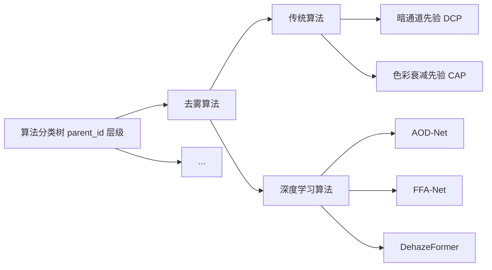

# 算法选择模块需求规格

## 1. 模块概述

### 1.1 模块定位

算法选择模块帮助用户从众多图像处理算法中快速找到合适的算法。通过树形分类、智能推荐、搜索等方式，降低用户的选择门槛。

### 1.2 核心价值

| 价值维度 | 具体内容 |
|---------|---------|
| **智能化** | 基于图像特征分析自动推荐算法（推荐能力由推荐管理模块提供） |
| **结构化** | 树形算法分类，清晰展示算法层级与分类 |
| **可搜索** | 支持关键词、拼音（全拼/首字母）、算法类型、描述等多种搜索方式 |
| **个性化** | 支持算法收藏（由收藏管理模块统一管理） |

### 1.3 用户角色分析

| 用户类型 | 特征 | 使用偏好 | 功能需求 |
|---------|------|---------|---------|
| **轻度用户** | 对算法不了解 | 完全依赖推荐 | 一键使用推荐算法 |
| **中度用户** | 了解基本类型 | 参考推荐+自主浏览 | 推荐+分类浏览+简单筛选 |
| **重度用户** | 算法专家 | 精准搜索+对比 | 高级筛选+参数调优+性能对比 |

### 1.4 依赖的基础模块

| 模块 | 依赖说明 |
|------|---------|
| **推荐管理** | 算法推荐（F-REC-001、F-REC-002）替代原有的内置智能推荐逻辑 |
| **收藏管理** | 算法收藏，targetType="algorithm" |
| **会员管理** | 会员权益（当前无算法选择相关等级差异，见 §4.1） |

---

## 2. 功能需求

### 2.1 树形算法结构 (F-M03-001)

#### 2.1.1 算法分类体系

算法树基于算法管理的分类体系（`sys_algorithm` 的 `parent_id` 层级）构建，分类节点与算法节点按层级组织。以去雾算法为例：



#### 2.1.2 树形展示

- 仅展示**已发布**算法（过滤草稿/测试中/待审核/停用/归档）
- 算法树第一级按任务类型（`task_type`，枚举 `dehaze`/`derain`/`desnow`/`lowlight`/`super_resolution`/`denoise`/`inpaint`）分类，与 `sys_algorithm.task_type` 对齐，支撑"算法按任务类型路由分发"战略
- 任务类型以下按 `parent_id` 层级组织分类节点与算法节点，分类节点无子节点时自动隐藏
- 顶部提供任务类型 Tab（单选必填，默认选中上次使用的任务类型，首次进入默认 `dehaze`），切换后仅展示该任务类型下的算法
- 点击展开/收起子节点，选中节点高亮显示
- 数据来源：`GET /api/v1/algorithms/select/tree?taskType=`

#### 2.1.3 算法卡片信息

| 类别 | 内容 |
|------|------|
| 基础信息 | 算法名称、算法类型标签 |
| 数据信息 | 算法评分（平均分）、使用次数 |
| 快捷操作 | 查看详情、收藏、立即使用

---

### 2.2 算法推荐 (F-M03-002)

#### 2.2.1 功能描述

算法推荐能力由[推荐管理模块](../../基础模块/推荐管理/需求规格.md)提供。用户上传图片后，系统分析图像特征并生成 Top 3 推荐算法列表。

推荐功能引用推荐管理模块的以下功能点：
- F-REC-001：图像特征分析（雾霾浓度、场景类型、光照条件等特征维度，当前为规则引擎分析）
- F-REC-002：算法推荐（基于特征与推荐规则匹配，输出 Top 3 推荐列表含匹配度和推荐理由）

#### 2.2.2 推荐展示

推荐区域显示：
- 图像分析结果（特征维度值，如雾霾程度、场景类型）
- Top 3 推荐算法列表（`TOP_N=3` 固定数量）
- 每个推荐算法展示：匹配度、算法名称、评分、推荐理由、预期效果（预计耗时）、操作按钮（一键使用 + 有用/无用反馈）
- 推荐字段说明详见 [推荐管理需求规格 §4.2](../../基础模块/推荐管理/需求规格.md)

> **推荐展示数据来源（待实现）**：
> - **评分**：来自算法管理元数据 + 用户评价聚合（当前推荐接口返回硬编码 `3.5`，待接入真实评分聚合）
> - **预计耗时**：来自该算法预测历史耗时的均值（当前推荐接口返回硬编码 `5000ms`，待接入预测日志统计）
> - **匹配度/推荐理由**：由推荐管理模块的规则引擎生成（已实现）

---

### 2.3 搜索与筛选 (F-M03-003)

#### 2.3.1 搜索功能

| 搜索方式 | 说明 |
|---------|------|
| 名称匹配 | 算法名称包含关键词（精确子串匹配） |
| 拼音全拼 | 算法名称拼音全拼包含关键词 |
| 拼音首字母 | 算法名称拼音首字母匹配 |
| 类型/描述匹配 | 算法类型或描述包含关键词 |

> 搜索范围限定为**已发布**算法；搜索数据来源 `GET /api/v1/algorithms/select/search?keyword=`。搜索默认在当前任务类型 Tab 范围内执行（与 §2.1.2 Tab 联动）。

**搜索无结果态**：展示空态文案"未找到匹配「{keyword}」的算法"，并提供引导操作：
- 显示输入关键词，提供"修改关键词"快捷入口
- 提供"试试智能推荐"跳转入口
- 当关键词疑似英文缩写（全大写且长度 ≤ 6）时，额外提示"暂不支持缩写搜索，可输入算法全名或关键词"

**演进路径**：

| 能力 | 优先级 | 说明 |
|------|:----:|------|
| 英文缩写搜索（如 DCP） | P1 | 按算法 `code`/缩写字段匹配，需算法管理补充缩写字段 |
| 组合搜索（多关键词 AND） | P2 | 关键词按空格拆分，结果取交集 |
| 搜索历史 | P3 | 本地存储最近 10 条，支持快捷回填与清空 |

#### 2.3.2 筛选功能

筛选通过任务类型 Tab + 关键词搜索组合实现：

| 筛选维度 | 交互方式 | 状态 |
|---------|---------|:----:|
| 任务类型 | 顶部 Tab 单选必填，与算法树联动（见 §2.1.2） | ✅ 当前需求 |
| 关键词 | 搜索框输入（名称/拼音/类型/描述） | ✅ 已实现 |
| 算法类型/处理速度/效果质量/评分范围 | 独立筛选面板 | ⏳ 远期规划 |

> 切换任务类型 Tab 时同步刷新算法树与搜索结果范围；其他筛选维度后续按需迭代。

---

### 2.4 算法详情页 (F-M03-004)

#### 2.4.1 详情页结构

详情页展示：算法基本信息（名称/类型/描述/版本/模型大小/参数量/FLOPs）、评分与评价数、使用次数、效果样例图。数据来源 `GET /api/v1/algorithms/select/{id}`。

#### 2.4.2 效果样例展示

- 展示该算法最近 3 条成功预测的结果图（`sampleImages`，从预测日志取最近成功记录）
- 支持点击放大查看

> 样例对比方式（并排/上下/滑动/叠加）、按场景/退化程度组织样例等**尚未实现**。

#### 2.4.3 上传自定义图片测试

用户可在算法详情页上传自定义图片进行效果预览（`POST /api/v1/algorithms/select/{id}/test`）。系统使用该算法对上传图片执行处理并展示结果，帮助用户在正式使用前评估算法效果。

---

### 2.5 算法收藏 (F-M03-005)

#### 2.5.1 功能描述

算法收藏能力由[收藏管理模块](../../基础模块/收藏管理/需求规格.md)统一管理：

- 收藏类型：`algorithm`（算法）
- 收藏入口：算法卡片收藏按钮、算法详情页收藏按钮
- 取消收藏：再次点击已收藏图标或收藏列表中操作
- 收藏列表：可在"我的收藏"聚合页按类型筛选查看

#### 2.5.2 交互规则

| 场景 | 行为 |
|------|------|
| 未收藏 → 点击收藏 | 图标变为实心，提示"已添加到收藏" |
| 已收藏 → 点击取消 | 图标变为空心，提示"已取消收藏" |
| 收藏容量已满 | 提示上限并引导升级会员 |
| 算法已失效 | 收藏列表中标记为"已失效"，支持一键清理 |

---

### 2.6 算法对比 (F-M03-006)

#### 2.6.1 功能描述

支持同时选择 2-3 个算法进行对比，帮助用户在多个候选算法中做出选择（`POST /api/v1/algorithms/select/compare`）。

#### 2.6.2 对比方式

长按算法卡片进入多选模式，最多选择 3 个算法，点击"对比"按钮进入对比页面。

#### 2.6.3 对比内容

对比使用同一张测试图片分别执行预测，展示各算法的处理结果与指标：

| 维度 | 展示形式 |
|------|---------|
| 处理结果图 | 并排展示 |
| 处理耗时 | 数值对比 |
| 评估指标 | PSNR/SSIM 等指标数值对比（含清晰参考图时） |

> 基本信息/适用性/用户反馈的多维对比（柱状图/雷达图/饼图）与"综合对比/效果对比/评价"Tab 视图**尚未实现**，当前对比维度为实际预测结果 + 指标。

---

### 2.7 算法推荐匹配入口 (F-M03-007)

#### 2.7.1 功能定位

本模块提供**基于关键词/样例的算法推荐匹配入口**，供 AI 对话模块通过 MCP 调用，也供算法选择页面的"智能推荐"场景使用。本模块**只做算法推荐匹配**（基于关键词、任务类型、样例算法的规则匹配），**不实现 LLM 对话与意图理解**——自然语言意图理解、多轮对话、需求细化等由 [AI 对话模块](../AI对话/需求规格.md)（F-M08-004 智能算法推荐）承载。

#### 2.7.2 职责边界

| 能力 | 归属模块 | 说明 |
|------|---------|------|
| 自然语言意图理解 | AI 对话（F-M08-004） | LLM 解析用户描述，提取任务类型、效果偏好、约束条件 |
| 多轮对话与需求细化 | AI 对话（F-M08-004） | 追问"有没有更快的方案"等 |
| 算法推荐匹配 | **本模块（F-M03-007）** | 基于关键词/任务类型/样例算法匹配候选算法，返回推荐列表 |
| 图像特征分析推荐 | 推荐管理（F-REC-001/002） | 上传图片后的图像特征分析推荐 |
| 推荐反馈采纳 | 推荐管理（F-REC-003） | 有用/无用反馈 |

调用关系：AI 对话模块的 LLM 理解用户自然语言意图后，通过 MCP 调用本模块的推荐匹配接口（传入提取出的关键词、任务类型、参考算法等结构化参数），本模块返回匹配算法列表；AI 对话模块再用自然语言向用户解释推荐理由。本模块不感知上游是否为 LLM，仅按结构化参数返回匹配结果。

#### 2.7.3 匹配规则

```
输入：keyword（可选） + taskType（可选） + sampleAlgorithmId（可选） + topN（默认3）
    ↓
按 taskType 过滤候选算法（已发布）
    ↓
keyword 匹配（名称/拼音/类型/描述，复用搜索逻辑）
    ↓
sampleAlgorithmId 相似匹配（同 task_type + 同分类 + 标签重合）
    ↓
综合评分排序（匹配度 + 算法评分 + 使用次数）
    ↓
返回 Top N 推荐列表（含匹配度、推荐理由、预期耗时）
```

#### 2.7.4 降级策略

| 场景 | 降级策略 |
|------|---------|
| LLM 不可用（AI 对话模块降级） | AI 对话模块直接以用户原始输入作为 keyword 调用本接口，本模块按关键词搜索逻辑返回结果 |
| keyword 为空且无 sampleAlgorithmId | 返回该 taskType 下评分 Top N 算法（兜底推荐） |
| taskType 为空 | 跨所有任务类型匹配，按综合评分排序 |
| 匹配结果为空 | 返回空列表，调用方（AI 对话）展示空态并引导用户细化需求 |
| 接口超时 | 调用方降级为关键词搜索（`/api/v1/algorithms/select/search`） |

#### 2.7.5 API 契约

详见 [API 接口 §5](./API接口.md)。

> 与 F-M03-002（图像特征分析推荐）的关系：F-M03-002 面向"上传图片一键推荐"场景，由推荐管理模块的图像特征分析驱动；F-M03-007 面向"关键词/样例/LLM 提取意图"场景，由结构化参数匹配驱动。两者互补，不互相替代。

---

## 3. 用户交互流程

### 3.1 快捷流程（智能推荐）

用户上传图像 → 自动分析图像特征 → 生成 Top 3 推荐 → 用户点击"立即使用" → 跳转到处理页面。端到端推荐链路目标 < 5 秒（图像特征分析 < 2s + 推荐生成 < 500ms + 前端渲染），仅需 2 次点击。

> 注：此处的"端到端 < 5 秒"指推荐链路整体耗时目标，与 §2.2.2 中单个算法的"预计耗时"（来自预测历史均值）是不同概念，不应混淆。

### 3.2 标准流程（浏览选择）

用户上传图像 → 进入算法选择页面 → 查看推荐（可选） → 浏览算法树（展开分类节点） → 点击算法卡片 → 查看详情和样例 → 确认使用 → 跳转到处理页面。

### 3.3 专家流程（对比选择）

用户上传图像 -> 使用搜索（关键词/拼音） -> 长按进入多选模式 -> 选择 2-3 个算法 -> 查看处理结果与指标对比 -> 确认使用 -> 跳转到处理页面。

---

## 交互规范

### 页面布局

| 页面 | 布局要点 |
|------|---------|
| 推荐页 | 上传图片后展示图像分析结果与 Top 3 推荐算法卡片（匹配度/评分/推荐理由/预期效果/一键使用） |
| 算法树页 | 顶部任务类型 Tab，左侧算法分类树，右侧算法卡片列表 |
| 对比页 | 2-3 个算法的处理结果并排展示，指标对比表格 |
| 收藏列表 | 在"我的收藏"中按类型筛选查看收藏的算法 |

### 关键交互行为

| 场景 | 交互行为 |
|------|---------|
| 任务类型切换 | 顶部 Tab 单选，切换后刷新算法树与搜索范围 |
| 算法搜索 | 支持名称/拼音全拼/首字母/类型/描述匹配，无结果展示空态引导 |
| 算法对比 | 长按卡片进入多选模式，最多 3 个，点击"对比"进入对比页 |
| 算法收藏 | 卡片/详情页收藏按钮，状态实时同步 |
| 推荐反馈 | 推荐卡片提供"有用/无用"反馈 |

### 操作反馈

| 场景 | 反馈行为 |
|------|---------|
| 推荐生成中 | 展示分析进度 |
| 推荐失败 | 提示"图像分析失败，请稍后重试"，降级为手动选择 |
| 搜索无结果 | 展示"未找到匹配算法"，提供修改关键词/智能推荐引导 |
| 对比执行中 | 展示各算法处理进度 |
| 对比失败 | 提示"对比执行失败：{原因}"，提供重试/减少数量 |
| 算法已下线 | 提示"该算法已不可用" |

---

## 4. 会员权益

### 4.1 等级差异

算法选择模块的会员权益由[会员管理模块](../../基础模块/会员管理/需求规格.md)统一管理。**当前无会员等级差异**：

| 权益项 | 当前状态 |
|--------|---------|
| 可访问算法范围 | 所有用户仅可见**已发布**算法（无实验性算法 VIP 专属） |
| 推荐候选数量 | Top 3（`TOP_N=3` 固定，无 VIP Top 5） |
| 算法对比数量 | 2-3 个（所有用户一致，`@Size(2,3)` 校验） |
| 自定义图片测试 | 所有用户可用 |

> 实验性算法 VIP 专属、推荐候选数量差异化等**尚未实现**，待后续迭代补充。

---

## 5. 收藏管理集成

算法收藏由[收藏管理模块](../../基础模块/收藏管理/需求规格.md)统一管理：

- 收藏类型：`algorithm`（算法）
- 收藏操作：引用 F-FAV-001
- 收藏列表：在"我的收藏"聚合页中按类型筛选查看

---

## 6. 推荐管理集成

算法推荐由[推荐管理模块](../../基础模块/推荐管理/需求规格.md)统一管理：

- 图像特征分析：F-REC-001
- 算法推荐生成：F-REC-002
- 推荐反馈：F-REC-003
- 推荐效果持续优化，用户采纳和评价数据反哺推荐引擎

---

## 7. 边界场景与降级

| 场景 | 空态/提示文案 | 引导操作 | 降级路径 |
|------|-------------|---------|---------|
| 任务类型下无已发布算法 | "该任务类型暂无可用算法" | 切换任务类型 Tab / 查看其他分类 | - |
| 搜索无结果 | "未找到匹配「{keyword}」的算法" | 修改关键词 / 试试智能推荐 | 缩写疑似时提示输入全名（见 §2.3.1） |
| 推荐匹配失败（F-M03-007 接口异常或空结果） | "暂无推荐算法" | 手动浏览算法树 / 使用搜索 | 降级为关键词搜索 |
| 图像推荐失败（F-REC-002 接口异常） | "图像分析失败，请稍后重试" | 重新上传 / 手动选择算法 | 降级为算法树浏览 |
| 算法对比失败（对比预测执行失败） | "对比执行失败：{原因}" | 重试 / 更换测试图片 / 减少对比数量 | 单算法详情查看 |
| 自定义图片测试超时 | "算法测试超时，请稍后重试或更换图片" | 重试 / 更换小尺寸图片 / 查看算法详情样例 | 展示算法历史样例图 |
| 算法详情加载失败（算法已下线） | "该算法已不可用" | 返回算法树 / 查看相似算法 | 跳转算法树 |

---

## 待确认事项

1. **推荐结果更新频率**：推荐结果是实时计算还是定期刷新？推荐列表的缓存时效？
2. **推荐冷启动策略**：新上线算法（无使用数据）如何进入推荐池？新用户的推荐冷启动策略？
3. **算法对比测试图片**：对比使用的测试图片是否需要统一预置（当前用户上传）？
4. **搜索扩展**：英文缩写搜索、组合搜索（多关键词 AND）的优先级与排期？
5. **任务类型默认值**：任务类型 Tab 是否支持用户自定义默认任务类型（当前默认 dehaze）？
