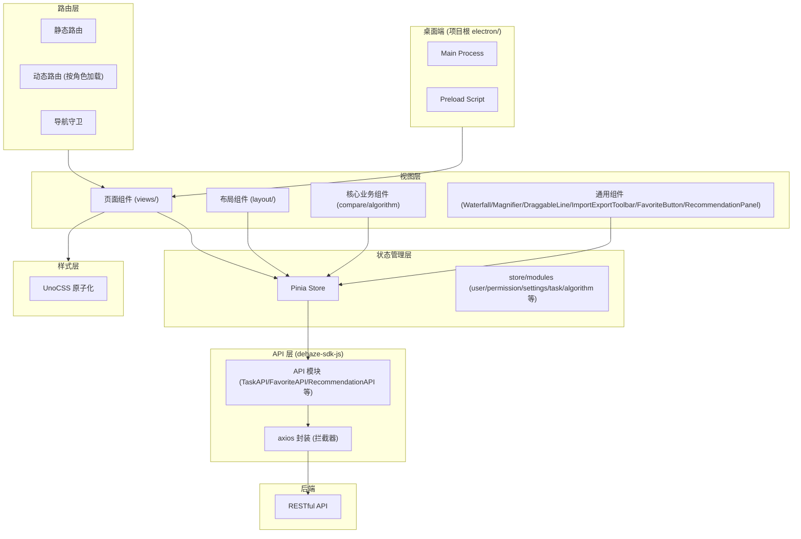
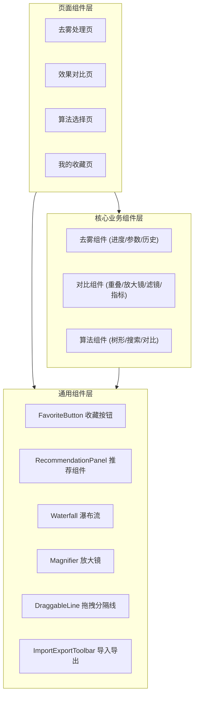

# Vue3 前端 (dehaze-front-vue)

基于深度学习的在线实时响应的图像去雾系统 Web 前端，主要功能是改善受到雾霾影响的图像质量，从而实现图像去雾的目标。通过 Electron 提供桌面端应用。

> 构建运行、测试命令、部署说明见项目根目录 [README](/README.md)。

## 1. 架构图

## 2. 目录结构

- 分层清晰：
  - `views` - 存放页面组件
  - `components` - 封装复用组件
  - `layout` - 布局组件（NavBar/Sidebar/TagsView/Settings）
  - `composables` - 组合式 API（usePagination/useTableSelection/useDebounce/useAsyncTask/useConfirm/useImportExport）
  - `router` - 路由配置与导航守卫
  - `store/modules` - 按业务领域拆分 Pinia 模块（user/permission/settings/task/algorithm/imageShow/notification/tagsView/app）
  - `enums` - 集中管理枚举类型
  - `typings` - 类型声明文件
  - `directive` - 自定义指令（权限指令等）
  - `lang` - 国际化资源
  - `plugins` - 插件注册（i18n/icons/permission）
- API 统一由 `dehaze-sdk-js` 提供，项目内不维护独立 api 目录
- 组件复用：
  - `Waterfall` - 瀑布流布局
  - `Magnifier` - 画布缩放
  - `DraggableLine` - 对比图层拖拽
  - `ImportExportToolbar` - 通用导入导出工具栏（含导入弹窗、导出弹窗、任务列表抽屉）
  - `FavoriteButton` - 跨模块可复用收藏按钮
  - `RecommendationPanel` - 图像分析推荐面板
- 组合式 API：
  - `usePagination` - 通用分页逻辑
  - `useTableSelection` - 表格多选逻辑
  - `useDebounce` / `useDebouncedRef` - 防抖函数与响应式防抖
  - `useAsyncTask` - 异步任务 loading/error/data 三态管理
  - `useConfirm` / `useDeleteConfirm` - 二次确认弹窗

## 3. 核心模块

| 模块 | 功能描述 | 技术要点 |
|--------|-----------------------------------------------------|---------|
| 用户系统 | 支持角色/权限管理、多级部门树、Session 认证与自动续期 | Pinia + localStorage Token 持久化 |
| 数据集管理 | 瀑布流展示 + 懒加载、图片 MD5 校验、图片数量统计 | 缩略图 + 瀑布流 + 懒加载 |
| 去雾处理 | 单张/批量去雾、参数调节（通用+算法专属）、参数预设管理、处理历史 | 轮询 TaskAPI.getStatus 获取异步处理进度 |
| 算法选择 | 树形算法结构、关键词/拼音搜索、多算法对比（最多3个）、自定义图片测试 | 拼音预计算字段 + 雷达图/柱状图可视化对比 |
| 效果对比 | 多种对比模式（并排/重叠/放大镜/滤镜/指标/算法信息）、对比报告导出 | CSS clip-path 重叠对比 + ECharts 指标可视化 |
| 收藏管理 | 跨模块统一收藏（算法/处理结果/数据集/图片/预设）、"我的收藏"聚合页 | FavoriteButton 组件直接调用 SDK FavoriteAPI |
| 推荐管理 | 图像特征分析推荐（7维特征）、管理员规则配置、推荐效果报表 | RecommendationPanel 组件调用 SDK RecommendationAPI |
| 通用导入导出 | 为各列表页面提供统一的 Excel/CSV 导入导出能力，复用任务列表查看进度 | ImportExportToolbar 组件 |
| 系统配置 | 主题色切换、暗黑模式、布局模式（侧边/顶部/混合）、水印开关 | CSS 变量 + 组件化管理 |

## 4. 组件分层

## 5. 关键技术决策

| 决策 | 选择 | 理由 |
|------|------|------|
| 状态管理 | Pinia | Vue3 官方推荐，模块化 Store，支持 DevTools |
| 认证方案 | Session + Token 持久化 | localStorage 持久化 Token，请求拦截器自动注入 |
| 路由方案 | 静态路由 + 动态路由 | 登录后动态获取用户菜单，按角色展示不同菜单 |
| 响应式布局 | CSS 变量 + 弹性盒子 | 同一套代码适配桌面端和移动端，支持多种布局模式切换 |
| 图片上传 | 前端 MD5 校验 + 并发上传 | 前端预校验减轻后端压力，并发请求提升速度 |
| 图像对比 | CSS clip-path + Canvas | 重叠对比 + 放大镜细节查看 |
| 组件分层 | 页面组件 / 业务组件 / 通用组件 | 清晰分层，提高可维护性 |
| 样式方案 | UnoCSS | 原子化 CSS，按需生成，无运行时开销 |
| 桌面端 | Electron | 提供跨平台桌面应用能力，与 React 端对齐 |
| 收藏功能 | FavoriteButton 直接调用 SDK API | 收藏为无状态操作，组件内直接请求并维护局部状态即可 |
| 推荐组件可嵌入设计 | RecommendationPanel 独立组件 | 可嵌入算法选择页、去雾处理页、效果对比页，通过 props 接收场景参数控制推荐策略 |
| 处理进度获取 | 轮询 TaskAPI.getStatus | 异步去雾任务通过定时轮询获取状态，实现简单且满足实时性要求 |

## 6. 设计原则与约束

- **单一数据源**：所有 API 调用统一通过 `dehaze-sdk-js`，项目内不重复封装接口层
- **组件分层约束**：页面组件不直接调用 API，通过 Store 或组合式 API 间接访问；通用组件不耦合具体业务逻辑
- **组合式 API 优先**：跨组件复用的逻辑抽取为 composables，避免 mixin 造成的数据来源不清晰
- **按需组合对比能力**：对比模式以独立组件形式存在（OverlapImageShow/ParallelImageShow/Magnifier 等），页面按需组合，而非单一切换器

## 7. 模块间交互

- 通过 RESTful API 调用 Java/Go/Python 后端
- 异步去雾任务通过轮询 TaskAPI 获取处理进度
- 与 React 前端共享同一套后端 API
