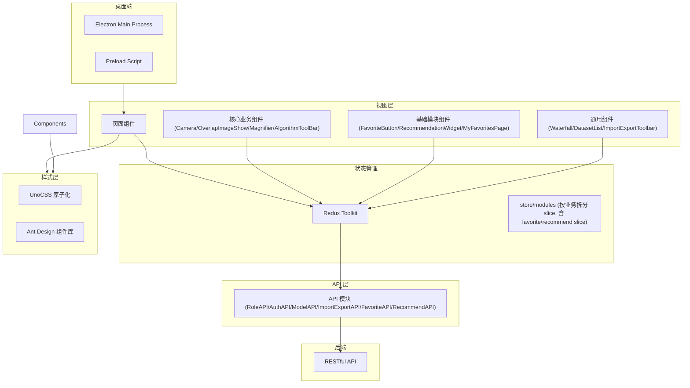

# React 前端 (dehaze-front-react)

基于深度学习的在线实时响应的图像去雾系统 Web 前端，采用 React + TypeScript + Vite + Ant Design + Redux Toolkit 构建，并通过 Electron 提供桌面端应用。

> 构建运行、测试命令、部署说明见项目根目录 [README](/README.md)。

## 1. 架构图

## 2. 目录结构

- **状态管理**：Redux Toolkit 模块化划分，`store/modules` 下按业务领域拆分多个 slice
- **桌面端集成**：通过 Electron 集成桌面端能力，相关代码位于 `electron` 目录
- **样式方案**：UnoCSS 原子化 + Ant Design 实现统一视觉风格
- **组件化**：Camera、OverlapImageShow、Magnifier、AlgorithmToolBar、DatasetList、Waterfall、ImportExportToolbar 等独立可复用组件

## 3. 技术栈

| 类别 | 技术 |
|------|------|
| 框架 | React 18 + TypeScript |
| 构建 | Vite |
| UI | Ant Design |
| 状态管理 | Redux Toolkit（模块化 slice） |
| 样式 | UnoCSS 原子化方案 |
| 桌面端 | Electron |

## 4. 核心模块

### 4.1 用户管理模块

- 支持用户注册/登录/权限管理
- 角色-权限-菜单三级权限控制
- Token 认证机制

### 4.2 数据集管理

- 数据集分页展示（DatasetList 组件）
- 数据集详情页支持图片瀑布流展示（Waterfall 组件）
- 数据集导出通过通用导入导出框架实现

### 4.3 通用导入导出

- ImportExportToolbar 组件为各列表页面提供统一的导入/导出/模板下载按钮
- 支持用户/角色/部门/菜单/字典/数据集/算法模块的 Excel/CSV 导入导出
- 复用任务列表查看异步导入导出任务进度

### 4.4 图像处理功能

- 实时摄像头捕获（Camera 组件）
- 图像叠加对比（OverlapImageShow 组件）
- 放大镜效果（Magnifier 组件）
- 图像参数调节（对比度/亮度控制）

### 4.5 算法集成

- 算法工具栏支持参数配置（AlgorithmToolBar 组件）
- 模型选择与预测结果可视化

### 4.6 去雾处理模块

- 单张/批量去雾处理，参数调节（通用参数 + 算法专属参数）
- 参数预设管理（管理员预设 + 用户自定义预设）
- 处理历史列表/网格视图切换，支持筛选和重新处理
- WebSocket 实时推送处理进度（Electron 桌面端支持系统通知）

### 4.7 效果对比模块

- 6 种对比模式切换：并排、重叠、放大镜、滤镜、指标、算法信息
- ECharts 指标可视化（雷达图 + 柱状图）
- 对比报告异步导出（复用任务管理模块）

### 4.8 算法选择模块

- 树形算法结构展示，关键词/拼音多维度搜索
- 最多 3 个算法多维度对比（表格 + 柱状图 + 雷达图）
- 自定义图片测试，临时预览不入历史记录

### 4.9 收藏管理模块

- FavoriteButton 可复用组件，通过 `targetType` prop 适配算法/处理结果/数据集
- MyFavoritesPage 收藏聚合页，按类型筛选 + 排序 + 搜索
- Redux favoriteSlice 管理全局收藏状态，useFavorite Hook 封装收藏操作

### 4.10 推荐管理模块

- RecommendationWidget 可嵌入组件，通过 `imageId`/`imageUrl` prop 接入图像
- 调用 `RecommendationAPI.analyze()` 进行 7 维图像特征分析（雾霾浓度/场景类型/光照/复杂度/分辨率/噪声）
- Top 3 推荐算法展示（匹配度进度条 + 推荐理由 + 评分），支持一键选用
- 推荐效果反馈（有用/无用）通过 `RecommendationAPI.submitFeedback()` 上报
- 管理员推荐规则管理页（`/recommendation/rules`），支持权重/启用/算法多选配置

### 4.11 算法管理详情页

- 算法详情页（`/algorithm/detail`），Tab 三级信息架构（基本/技术/运营信息）
- 调用 `AlgorithmAPI.getAlgorithmInfoById()` + `AlgorithmAPI.getMonitorData()` 获取详情和监控数据

### 4.12 算法选择推荐集成

- 算法选择页支持图像分析推荐（Tab 切换：快速推荐 / 图像分析推荐）
- 输入图片 URL → `RecommendationAPI.analyze()` → `getAlgorithmRecommendations()` → Top 3 匹配算法
- 推荐算法可一键选用，与手动选择流程一致

## 5. 关键技术决策

| 决策 | 选择 | 理由 |
|------|------|------|
| 框架 | React 18 | 与 Vue3 前端形成对照，验证 React 生态等价能力 |
| 状态管理 | Redux Toolkit | 模块化 slice，与 React 生态深度集成 |
| 样式方案 | UnoCSS | 原子化 CSS，按需生成，无运行时开销 |
| 桌面端 | Electron | 提供跨平台桌面应用能力 |
| 构建工具 | Vite | 快速开发服务器，HMR 热更新 |
| 跨模块收藏状态同步 | Redux favoriteSlice + useFavorite Hook | Hooks 模式封装收藏操作，组件通过 useSelector 订阅收藏状态，与 Vue Pinia Store 方案对齐 |
| 6种对比模式切换 | 条件渲染 + 独立组件 | React 无动态组件指令，使用条件渲染切换对比模式，每个模式组件独立管理状态 |
| 推荐组件可嵌入设计 | RecommendationWidget + props 驱动 | 通过 scene prop 控制推荐策略，可嵌入算法选择/去雾处理/效果对比页面 |

## 6. 模块间交互

- 通过 RESTful API 调用 Java/Go/Python 后端
- 与 Vue3 前端共享同一套后端 API，功能完整度对照实现
