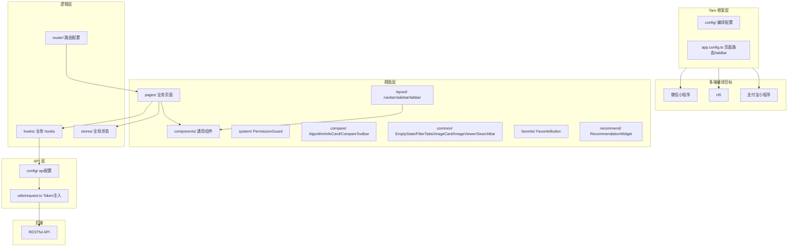

# Taro 多端 (dehaze-taro)

基于 Taro 4 + React + TypeScript 构建的多端图像去雾应用，一份代码可编译到微信小程序、H5、支付宝小程序等多个平台。

> 构建运行、测试命令、部署说明见项目根目录 [README](/README.md)。

## 1. 架构图



## 2. 项目结构

```
dehaze-taro/
├── config/                        # Taro 编译配置
├── src/
│   ├── app.tsx                    # 应用入口
│   ├── app.config.ts              # 应用配置（页面路由、tabBar）
│   ├── components/                # 通用组件
│   │   ├── common/                # EmptyState/FilterTabs/ImageCard/ImageViewer/SearchBar
│   │   ├── compare/               # AlgorithmInfoCard/CompareToolbar
│   │   └── system/                # PermissionGuard
│   ├── config/                    # api、menu 配置
│   ├── hooks/                     # 业务 hooks（auth/permission/dept/role/menu/user/dict/layout/system）
│   ├── layout/                    # navbar/sidebar/tabbar 布局
│   ├── pages/                     # 业务页面
│   │   ├── home/                  # 首页（Hero/算法/工具/工作流/技术规格/CTA）
│   │   ├── login/                 # 登录注册
│   │   ├── image-input/           # 图像输入（上传/拍照/样张/历史）
│   │   ├── algorithm-select/      # 算法选择
│   │   ├── processing/            # 去雾处理
│   │   ├── side-by-side/          # 并排对比
│   │   ├── overlay/               # 重叠对比
│   │   ├── magnifier/             # 放大镜
│   │   ├── filter/                # 滤镜调节
│   │   ├── metrics/               # 指标评估
│   │   ├── algorithm/             # 算法列表
│   │   ├── dataset/               # 数据集管理
│   │   ├── task/                  # 任务历史
│   │   ├── dashboard/             # 仪表盘
│   │   └── system/                # 系统管理（user/dept/role/menu/dict）
│   ├── router/                    # 路由配置
│   ├── stores/                    # 全局状态
│   ├── utils/                     # permission/request/storage/upload
│   └── types/                     # 类型定义
└── package.json
```

## 3. 核心功能

- Session 认证：登录/注册/验证码/权限校验
- 首页展示：算法介绍、工具矩阵、工作流演示、技术规格
- 图像输入：本地上传、相机拍照、样张画廊、历史记录
- 算法选择：算法列表、参数配置、算法说明、智能推荐
- 去雾处理：实时进度、结果预览、参数调节、处理历史
- 效果对比：并排对比、重叠对比、放大镜、滤镜、指标评估、算法信息
- 收藏管理：跨模块统一收藏（算法/处理结果/数据集）、"我的收藏"聚合页
- 推荐管理：算法推荐展示、推荐理由、一键使用
- 数据集管理：列表、详情、图片瀑布流、类型筛选
- 系统管理：用户、部门、角色、菜单、字典管理

## 4. 关键技术决策

| 决策 | 选择 | 理由 |
|------|------|------|
| 跨端框架 | Taro 4 | 一份代码编译微信小程序/H5/支付宝小程序等多端 |
| UI 框架 | React 18 + TypeScript | 类型安全，生态丰富 |
| 状态管理 | Context + 自定义 hooks | 轻量级，避免引入额外状态库 |
| 样式方案 | Less + 全局变量 | 支持多端样式适配 |
| 权限控制 | PermissionGuard 组件 + usePermission hook | 按钮级权限控制 |
| 网络层 | utils/request.ts 封装 | 统一 Token 注入与错误处理 |
| 收藏按钮适配 | FavoriteButton 组件 + Taro.touchEvent | 小程序端使用 Taro 触摸事件替代 Web click，左滑删除收藏适配小程序手势 |
| 推荐图片上传限制 | Taro.chooseImage + wx.uploadFile | 小程序端图片上传受 10MB 限制和格式约束（jpg/png），推荐管理图像特征分析前需压缩；H5 端无此限制 |

## 5. 多端适配

- 移动端竖屏优化，适配手机和平板
- 微信小程序、H5、支付宝小程序等多端编译
- 通过 `app.config.ts` 配置各端差异
