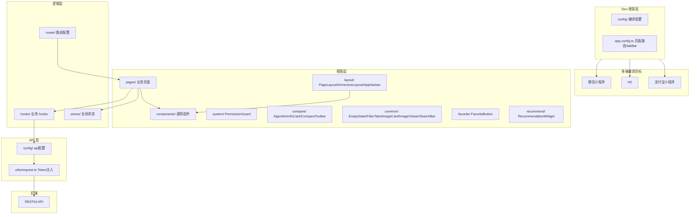

# Taro 多端 (dehaze-taro)

基于 Taro 4 + React + TypeScript 构建的多端图像去雾应用，一份代码可编译到微信小程序、H5、支付宝小程序等多个平台。

> 构建运行、测试命令、部署说明见项目根目录 [README](/README.md)。

## 1. 架构图



## 2. 项目结构

```
dehaze-taro/
├── config/                        # Taro 编译配置
├── src/
│   ├── app.tsx                    # 应用入口
│   ├── app.config.ts              # 应用配置（页面路由、tabBar）
│   ├── components/                # 通用组件
│   │   ├── common/                # EmptyState/FilterTabs/ImageCard/ImageViewer/SearchBar
│   │   ├── compare/               # AlgorithmInfoCard/CompareToolbar
│   │   ├── favorite/              # FavoriteButton
│   │   ├── recommend/             # RecommendationWidget
│   │   └── system/                # PermissionGuard
│   ├── config/                    # api、menu 配置
│   ├── hooks/                     # 业务 hooks（auth/permission/dept/role/menu/user/dict/layout/system）
│   ├── layout/                    # 布局组件
│   │   ├── index.tsx              # PageLayout（L0-L3 层级路由布局）
│   │   ├── navbar/                # AppNavbar 导航栏
│   │   └── immersive/             # ImmersiveLayout（L3 沉浸页骨架）
│   ├── pages/                     # 业务页面（按视角拆分，详见 §3）
│   │   ├── home/                  # 首页（L1 Tab：品牌 Hero + 快捷入口 + 数据统计 + 特色能力）
│   │   ├── tools/                 # 工具（L1 Tab：页内搜索 + 快捷入口 + 功能网格）
│   │   ├── dehaze/                # 去雾（L1 Tab：步骤流引导 上传→算法→参数→处理→对比）
│   │   ├── messages/              # 消息（L1 Tab：消息列表 + 分类 + 未读角标 + 设置入口）
│   │   ├── profile/               # 我的（L1 Tab：用户卡 + VIP 横幅 + 数据统计 + 四组入口）
│   │   ├── login/                 # 登录（L0 认证页）
│   │   ├── register/              # 注册（L0 认证页）
│   │   ├── image-input/           # 图像输入（上传/拍照/样例/历史）
│   │   ├── algorithm-select/      # 算法选择（带入去雾流程）
│   │   ├── processing/            # 去雾处理（实时进度）
│   │   ├── algorithm/             # 算法库浏览（个人视角：列表 + 推荐 + 详情 + 使用）
│   │   ├── dataset/               # 数据集浏览（个人视角：公开/共享浏览 + 图片网格）
│   │   ├── task/                  # 处理历史（个人视角）
│   │   ├── batch/                 # 批量处理（批量上传 + 进度 + 结果对比）
│   │   ├── metrics-manage/        # 指标管理（评估指标历史查询/筛选/对比）
│   │   ├── favorite/              # 我的收藏
│   │   ├── notify/                # 消息设置
│   │   ├── side-by-side/          # 并排对比（L3 沉浸页）
│   │   ├── overlay/               # 叠加对比（L3 沉浸页）
│   │   ├── metrics/               # 指标对比（L3 沉浸页）
│   │   ├── magnifier/             # 放大镜对比（L3 沉浸页）
│   │   ├── filter/                # 滤镜对比（L3 沉浸页）
│   │   ├── personal/              # 个人侧页面（我的会员/套餐/订单/文件/额度/设置等）
│   │   ├── system/                # 管理模块（工作台 + 14 个管理子模块）
│   │   └── dashboard/             # 管理入口工作台
│   ├── router/                    # 路由配置
│   ├── stores/                    # 全局状态
│   ├── utils/                     # permission/request/storage/upload
│   └── types/                     # 类型定义
└── package.json
```

## 3. 页面层级与布局体系

页面按《移动端界面设计规范》分为四个层级，每级对应不同的导航形态：

| 层级 | 导航形态 | 典型页面 | 布局组件 |
|------|---------|---------|---------|
| L0 | 无导航栏，无 TabBar | 登录、注册 | 页面自身 |
| L1 | 顶部标题栏 + 底部 TabBar | 首页、工具、去雾、消息、我的 | PageLayout（level="L1"）|
| L2 | 顶部导航栏（返回+标题+操作区），无 TabBar | 图像输入、算法选择、处理、个人侧页面、管理页面 | PageLayout（level="L2"）|
| L3 | 深色沉浸导航栏 + 底部工具栏，全屏内容 | 并排对比、叠加对比、放大镜、滤镜、指标对比、消息详情 | ImmersiveLayout |

### 3.1 PageLayout

通用页面布局组件（`src/layout/index.tsx`），根据 `level` 属性决定导航形态：

- **L1**：渲染 AppNavbar 标题栏，内容区预留原生 TabBar 高度
- **L2**：渲染 AppNavbar（返回按钮 + 标题 + 可选右侧操作区），内容区全高
- **L3**：不渲染 AppNavbar，由 ImmersiveLayout 接管

### 3.2 AppNavbar

顶部导航栏组件（`src/layout/navbar/`），按层级差异化：

- **L1**：品牌名"去雾"仅在首页显示，其他 Tab 仅显示 Tab 标题；右侧操作区通过 props 传入
- **L2**：左侧返回按钮 + 页面标题 + 可选右侧操作区（`rightActions` 插槽），无操作时不显示

### 3.3 ImmersiveLayout

L3 沉浸页统一骨架（`src/layout/immersive/`），提供三区域插槽：

- **顶部**：深色半透明导航栏（返回按钮 + 标题 + 右侧操作插槽）
- **底部**：深色工具栏（操作按钮插槽，可选）
- **内容区**：全屏沉浸，无全局导航

不预设业务逻辑，5 个对比页（side-by-side / overlay / metrics / magnifier / filter）统一迁移至此骨架。

### 3.4 rpx 单位规范

全局样式采用 rpx 单位（750 设计稿基准），转换规则：1px = 2rpx。`src/**/*.less` 与内联 style 中的 px 全部迁移为 rpx，仅 `@media` 断点保留 px。

## 4. 完整页面清单

### 4.1 L0 认证页

| 页面路径 | 功能 |
|---------|------|
| pages/login/index | 登录 |
| pages/register/index | 注册 |

### 4.2 L1 Tab 根页面（底部 TabBar）

| Tab | 页面路径 | 功能要点 |
|-----|---------|---------|
| 首页 | pages/home/index | 品牌 Hero + 快捷入口 + 数据统计 + 特色能力（融合设计稿保留 8 区块） |
| 工具 | pages/tools/index | 页内搜索 + 快捷入口横滑 + 功能网格 ≤3 列，接入真实跳转 |
| 去雾 | pages/dehaze/index | 步骤流 5 步：上传 → 算法 → 参数 → 处理 → 对比入口 |
| 消息 | pages/messages/index | 消息列表 + 分类筛选（全部/系统/处理/活动）+ 未读角标 + 设置入口 |
| 我的 | pages/profile/index | 用户卡 + VIP 横幅 + 数据统计 + 四组入口（个人数据/商业服务/其他/管理入口）+ 退出 |

### 4.3 L2 工具/业务页面

| 页面路径 | 功能 | 对接 API |
|---------|------|---------|
| pages/image-input/index | 图像输入：上传/拍照/样例/历史 4 Tab | — |
| pages/algorithm-select/index | 算法选择，带入去雾流程 | RecommendationAPI.analyze |
| pages/processing/index | 去雾处理，实时进度 | ModelAPI.predictAndWait |
| pages/algorithm/index | 算法库浏览：列表 + 智能推荐 + 详情 + "使用该算法"带入流程 | — |
| pages/dataset/index | 数据集浏览：公开/共享浏览 + 图片网格 | — |
| pages/batch/index | 批量处理：批量上传 ≤20 张 + 进度 + 结果对比/下载 | ModelAPI.batchPredict |
| pages/metrics-manage/index | 指标管理：评估指标历史查询/筛选/对比 | ModelAPI.getEvalMetrics / getEvalLogs |
| pages/favorite/index | 我的收藏 | FavoriteAPI |
| pages/task/index | 处理历史（个人视角） | TaskAPI.getPage |
| pages/notify/index | 消息设置 | NotificationSettingAPI |

### 4.4 L2 个人侧页面（pages/personal/）

归入"我的"页面底部个人数据/商业服务/其他入口组：

| 页面路径 | 功能 | 对接 API | 迁移来源 |
|---------|------|---------|---------|
| pages/personal/files/index | 我的文件 | — | — |
| pages/personal/orders/index | 我的订单 | OrderAPI.listMy | — |
| pages/personal/quota/index | 我的额度 | ModelAPI.getQuota | — |
| pages/personal/member/index | 我的会员 | MemberAPI.getProfile | 旧 pages/member |
| pages/personal/package/index | 我的套餐 | — | 旧 pages/package |
| pages/personal/feedback/index | 反馈评价 | — | 旧 pages/feedback |
| pages/personal/settings/index | 系统设置 | — | — |
| pages/personal/help/index | 帮助中心 | — | — |
| pages/personal/about/index | 关于我们 | — | — |

### 4.5 L3 沉浸对比页

均使用 ImmersiveLayout 骨架：

| 页面路径 | 功能 |
|---------|------|
| pages/side-by-side/index | 并排对比 |
| pages/overlay/index | 叠加对比 |
| pages/metrics/index | 指标对比模式 |
| pages/magnifier/index | 放大镜对比 |
| pages/filter/index | 滤镜对比 |

### 4.6 管理模块（pages/system/）

归入"我的"页面底部管理入口组，受权限过滤（无 `sys:module:*` 权限的用户整组不显示）。

**管理入口工作台**：

| 页面路径 | 功能 |
|---------|------|
| pages/dashboard/index | 工作台 |

**管理子模块**：

| 页面路径 | 功能 | 权限码 |
|---------|------|-------|
| pages/system/user/index + detail | 用户管理 | sys:user:* |
| pages/system/role/index + detail + permission | 角色管理 | sys:role:* |
| pages/system/dict/index | 字典管理 | sys:dict:* |
| pages/system/menu/index | 菜单管理 | sys:menu:* |
| pages/system/dept/index | 部门管理 | sys:dept:* |
| pages/system/algorithm/index | 算法管理（审计上下架） | sys:algorithm:* |
| pages/system/dataset/index | 数据集管理（CRUD） | sys:dataset:* |
| pages/system/task/index | 任务管理（全用户视角） | sys:task:* |
| pages/system/member/index | 会员管理（列表/等级/成长日志） | sys:member:* |
| pages/system/package/index | 套餐管理（CRUD/上下架） | sys:package:* |
| pages/system/order/index | 订单管理（后台列表/退款审核/统计） | sys:order:* |
| pages/system/feedback/index | 反馈评价管理（回复/处理） | sys:feedback:* |
| pages/system/message/index | 消息管理（公告/模板/群发） | sys:notify:* |
| pages/system/recommend/index | 推荐管理（规则编辑） | sys:recommendation:* |

## 5. 视角拆分

以下模块从"个人+管理混用"严格拆分为两套独立页面：

| 业务域 | 个人视角页面 | 管理视角页面 |
|--------|-------------|-------------|
| 算法 | pages/algorithm（算法库浏览） | pages/system/algorithm（审计上下架） |
| 数据集 | pages/dataset（公开/共享浏览） | pages/system/dataset（CRUD） |
| 会员 | pages/personal/member（我的会员） | pages/system/member（会员管理） |
| 套餐 | pages/personal/package（我的套餐） | pages/system/package（套餐管理） |
| 反馈 | pages/personal/feedback（反馈评价） | pages/system/feedback（反馈评价管理） |
| 推荐 | —（无个人视角） | pages/system/recommend（推荐管理） |
| 任务 | pages/task（个人处理历史） | pages/system/task（全用户管理） |
| 订单 | pages/personal/orders（我的订单） | pages/system/order（订单管理） |
| 消息 | pages/messages（消息列表，个人）+ pages/notify（消息设置，个人） | pages/system/message（消息管理） |

## 6. 权限模型

管理模块采用 `PermissionGuard` 组件 + `usePermission` hook 实现按钮级权限控制。权限标识格式为 `sys:模块:*`，各模块对应权限码如下：

| 权限码 | 模块 |
|--------|------|
| sys:user:* | 用户管理 |
| sys:role:* | 角色管理 |
| sys:dict:* | 字典管理 |
| sys:menu:* | 菜单管理 |
| sys:dept:* | 部门管理 |
| sys:algorithm:* | 算法管理 |
| sys:dataset:* | 数据集管理 |
| sys:task:* | 任务管理 |
| sys:member:* | 会员管理 |
| sys:package:* | 套餐管理 |
| sys:order:* | 订单管理 |
| sys:feedback:* | 反馈评价管理 |
| sys:notify:* | 消息管理 |
| sys:recommendation:* | 推荐管理 |

无 `sys:module:*` 权限的用户，管理入口组整组不显示。

## 7. 设计稿还原策略

本次改造对齐《移动端界面设计规范》与 dehaze-mobile 设计稿，采用差异化还原策略：

| 页面 | 策略 | 说明 |
|------|------|------|
| 首页（home） | 融合策略 | 保留现有 8 区块丰富度，仅做 rpx 迁移与品牌显示优化，不照搬设计稿 |
| 工具/去雾/消息/我的 | 重构策略 | 按设计稿（tools-v2/dehaze-flow/messages/profile.html）重构布局与交互 |
| 登录/注册 | 视觉对齐 | 对照 login-optimized/register-optimized.html 视觉规范对齐 |

全局约束：
- 复用 `app.less` 令牌（`--color-*` / `--radius-*` / `--shadow-*` / `--spacing-*` / `--font-*`），不引入设计稿 `--dehaze-*` token
- 排除设计稿元信息（交互说明、占位文本、注释框）

## 8. 防迷失设计

- **主入口唯一**：首页、工具快捷区仅作引用跳转，不重复实现功能
- **管理功能不裸露**：管理入口统一归入"我的"页面底部管理入口组，受权限过滤
- **主链路 ≤2 步**：工具选图/选算法通过"开始去雾/使用该算法"直接带入流程
- **带入衔接**：工具页与算法浏览页通过明确的操作按钮将用户带入去雾处理流程
- **返回路径完整**：所有 L2/L3 页面均提供返回按钮，L2 通过 AppNavbar、L3 通过 ImmersiveLayout 内置返回

## 9. 核心功能

- Session 认证：登录/注册/验证码/权限校验
- 首页展示：品牌 Hero、快捷入口、数据统计、特色能力（融合设计稿保留 8 区块）
- 图像输入：本地上传、相机拍照、样张画廊、历史记录
- 算法选择：算法列表、参数配置、算法说明、智能推荐
- 去雾处理：实时进度、结果预览、参数调节、处理历史
- 效果对比：并排对比、叠加对比、放大镜、滤镜、指标评估（均使用 ImmersiveLayout 骨架）
- 批量处理：批量上传（≤20 张）、批量进度、结果对比/下载
- 指标管理：评估指标历史查询、筛选、对比
- 收藏管理：跨模块统一收藏（算法/处理结果/数据集）、"我的收藏"聚合页
- 推荐管理：算法推荐展示、推荐理由、一键使用（个人）+ 规则编辑（管理）
- 数据集：公开/共享浏览 + 图片网格（个人）+ CRUD（管理）
- 系统管理：用户、部门、角色、菜单、字典、算法审计、数据集管理、任务管理、会员管理、套餐管理、订单管理、反馈管理、消息管理、推荐管理

## 10. 关键技术决策

| 决策 | 选择 | 理由 |
|------|------|------|
| 跨端框架 | Taro 4 | 一份代码编译微信小程序/H5/支付宝小程序等多端 |
| UI 框架 | React 18 + TypeScript | 类型安全，生态丰富 |
| 状态管理 | Context + 自定义 hooks | 轻量级，避免引入额外状态库 |
| 样式方案 | Less + 全局变量 | 支持多端样式适配 |
| 样式单位 | rpx（750 设计稿基准） | 多端自适应，统一视觉产出 |
| 布局体系 | PageLayout（L0-L3）+ ImmersiveLayout（L3） | 按层级差异化导航，沉浸页统一骨架 |
| 权限控制 | PermissionGuard 组件 + usePermission hook | 按钮级权限控制，管理模块权限过滤 |
| 视角拆分 | 个人/管理严格分离为独立页面 | 避免条件渲染混乱，职责清晰 |
| 网络层 | utils/request.ts 封装 | 统一 Token 注入与错误处理 |
| 收藏按钮适配 | FavoriteButton 组件 + Taro.touchEvent | 小程序端使用 Taro 触摸事件替代 Web click，左滑删除收藏适配小程序手势 |
| 推荐图片上传限制 | Taro.chooseImage + wx.uploadFile | 小程序端图片上传受 10MB 限制和格式约束（jpg/png），推荐管理图像特征分析前需压缩；H5 端无此限制 |

## 11. 多端适配

- 移动端竖屏优化，适配手机和平板
- 微信小程序、H5、支付宝小程序等多端编译
- 通过 `app.config.ts` 配置各端差异
- 5 个 L1 Tab：首页、工具、去雾、消息、我的（通过原生 tabBar 实现）
