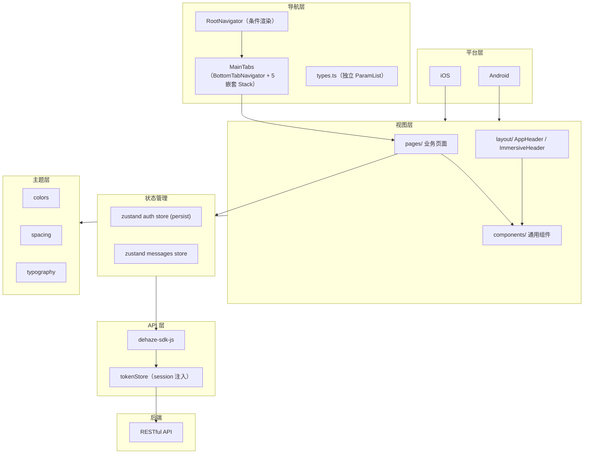

# React Native (dehaze-react-native)

基于 React Native 0.81 + React 19 + TypeScript 构建的移动端图像去雾应用，支持 iOS 和 Android 双平台。

> 构建运行、测试命令、部署说明见项目根目录 [README](/README.md)。

## 1. 架构图



## 2. 项目结构

```
dehaze-react-native/
├── android/                       # Android 原生工程
├── ios/                           # iOS 原生工程
├── src/
│   ├── App.tsx                    # 应用入口（直接渲染 RootNavigator，无 Provider）
│   ├── components/                # 通用组件
│   │   ├── Badge/                 # 角标组件
│   │   ├── Button/                # 按钮组件
│   │   ├── Card/                  # 卡片容器
│   │   ├── CompareEmptyState/     # 对比空状态
│   │   ├── EmptyState/            # 通用空状态
│   │   ├── Icon/                  # 图标组件
│   │   ├── ImageLoader/           # 图片加载器
│   │   ├── LoadingSpinner/        # 加载指示器
│   │   ├── Modal/                 # 模态弹窗
│   │   ├── Section/               # 区块容器
│   │   └── SliderControl/         # 滑块控制
│   ├── config/                    # env、sdk 配置
│   ├── enums/                     # 枚举（CacheEnum）
│   ├── hooks/                     # 通用 hooks
│   │   ├── useProcessing.ts       # 去雾处理流程 hook（predict/cancel/retry + 状态）
│   │   ├── useSectionScroll.ts    # algorithm 详情页章节锚点滚动测量
│   │   ├── useResponsive.ts       # 响应式容器间距
│   │   └── useAnimation.ts        # 动画 hook
│   ├── layout/                    # 布局组件
│   │   ├── components/
│   │   │   ├── AppHeader.tsx      # 通用导航栏（L1/L2）
│   │   │   └── ImmersiveHeader.tsx # 沉浸式导航栏（L3）
│   │   └── index.ts
│   ├── pages/                     # 业务页面（按视角拆分）
│   │   ├── home/                  # 首页（L1 Tab）
│   │   ├── tools/                 # 工具（L1 Tab）
│   │   ├── dehaze/                # 去雾（L1 Tab）
│   │   ├── messages/              # 消息（L1 Tab）
│   │   ├── profile/               # 我的（L1 Tab）
│   │   ├── login/                 # 登录（L0）
│   │   ├── register/              # 注册（L0）
│   │   ├── image-input/           # 图像输入（L2）
│   │   ├── algorithm-select/      # 算法选择（L2）
│   │   ├── algorithm/            # 算法详情页（L2，F-M03-004；内联组件拆至 components/，样式拆至 styles.ts）
│   │   ├── processing/            # 去雾处理（L2，消费 useProcessing hook）
│   │   ├── algorithm-browse/      # 算法库浏览（L2）
│   │   ├── dataset-browse/        # 数据集浏览（L2）
│   │   ├── dataset/              # 数据集管理（L2，list 与 detail 独立路由：index=列表，detail.tsx=详情）
│   │   ├── batch/                 # 批量处理（L2）
│   │   ├── metrics-manage/        # 指标管理（L2）
│   │   ├── task/                  # 处理历史（L2）
│   │   ├── notify/                # 消息设置（L2）
│   │   ├── compare/               # 沉浸对比页（L3）
│   │   │   ├── SideBySide/        # 并排对比
│   │   │   ├── Overlay/           # 叠加对比
│   │   │   ├── Magnifier/         # 放大镜对比
│   │   │   ├── Filter/            # 滤镜对比
│   │   │   └── Metrics/           # 指标对比
│   │   ├── personal/              # 个人侧页面（L2）
│   │   ├── dashboard/             # 管理工作台（L2）
│   │   └── system/                # 管理模块（L2）
│   ├── routes/                    # 导航配置
│   │   ├── RootNavigator.tsx      # 根导航（条件渲染）
│   │   ├── MainTabs.tsx           # 底部 Tab + 嵌套 Stack
│   │   ├── types.ts               # 类型定义（各 Stack 独立 ParamList）
│   │   └── index.tsx
│   ├── store/                     # 全局状态（zustand）
│   │   ├── auth.ts                # 认证状态（persist + AsyncStorage）
│   │   └── messages.ts            # 未读消息数（TabBar 角标）
│   ├── theme/                     # 主题令牌
│   │   ├── colors.ts              # 颜色令牌
│   │   ├── spacing.ts             # 间距令牌
│   │   └── typography.ts          # 排版令牌
│   ├── types/                     # 类型定义
│   ├── utils/                     # storage / tokenStore
│   └── assets/                    # 静态资源
├── index.js                       # 应用入口文件
└── package.json
```

## 3. 导航架构

导航采用 @react-navigation v7 的"BottomTabNavigator + 嵌套 Stack"原生方案。

### 3.1 导航树

```mermaid
flowchart TB
    Root["NavigationContainer"]
    Root --> AuthStack["AuthStack（L0）"]
    AuthStack --> Login["Login"]
    AuthStack --> Register["Register"]
    Root --> MainTabs["MainTabs（L1 BottomTabNavigator）"]
    MainTabs --> HomeStack["HomeStack"]
    MainTabs --> ToolsStack["ToolsStack"]
    MainTabs --> DehazeStack["DehazeStack"]
    MainTabs --> MessagesStack["MessagesStack"]
    MainTabs --> ProfileStack["ProfileStack"]
    HomeStack --> Home["Home (L1)"]
    ToolsStack --> Tools["Tools (L1)"]
    ToolsStack --> ImageInput["图像输入 (L2)"]
    ToolsStack --> AlgoBrowse["算法库浏览 (L2)"]
    ToolsStack --> Algo["算法详情 (L2)"]
    ToolsStack --> DatasetBrowse["数据集浏览 (L2)"]
    ToolsStack --> Dataset["数据集管理 (L2)"]
    ToolsStack --> Batch["批量处理 (L2)"]
    ToolsStack --> MetricsManage["指标管理 (L2)"]
    DehazeStack --> Dehaze["去雾 (L1)"]
    DehazeStack --> AlgoSelect["算法选择 (L2)"]
    DehazeStack --> Processing["去雾处理 (L2)"]
    DehazeStack --> Compare["沉浸对比 (L3)"]
    MessagesStack --> Messages["消息 (L1)"]
    MessagesStack --> MsgDetail["消息详情 (L2)"]
    ProfileStack --> Profile["我的 (L1)"]
    ProfileStack --> Personal["个人侧页面 (L2)"]
    ProfileStack --> System["管理模块 (L2)"]
    ProfileStack --> Notify["消息设置 (L2)"]
```



### 3.2 关键文件

| 文件 | 职责 |
|------|------|
| `src/routes/RootNavigator.tsx` | NavigationContainer 容器 + 根据 sessionId 条件渲染 AuthStack 或 MainTabs；loading 态显示启动屏 |
| `src/routes/MainTabs.tsx` | BottomTabNavigator + 5 个嵌套 Stack Navigator，配置 TabBar 图标和颜色 |
| `src/routes/types.ts` | 每个 Tab Stack 独立 ParamList 类型定义；**无全局 `RootStackParamList` 交叉类型**，跨 Stack 共享页面用 `CompositeNavigationProp` 组成其注册的多个 Stack 类型，保证导航类型安全 |

### 3.3 TabBar 配置

- 使用内置 BottomTabBar，不自定义渲染函数
- `tabBarActiveTintColor: '#3B82F6'`（colors.primary），`tabBarInactiveTintColor: '#9CA3AF'`（colors.text.tertiary）
- Ionicons outline/fill 图标切换：`home/home-outline`、`grid/grid-outline`、`color-wand/color-wand-outline`、`notifications/notifications-outline`、`person/person-outline`
- Messages Tab 通过 `navigation.setOptions({ tabBarBadge })` 动态设置未读消息角标，订阅 `useMessagesStore(s => s.unreadCount)`

### 3.4 导航分层说明

| 层级 | 导航形态 | 典型页面 | 头部组件 |
|------|---------|---------|---------|
| L0 | 无 TabBar，无通用头部 | 登录、注册 | 页面自身 |
| L1 | 底部 TabBar + 顶部标题栏 | 首页、工具、去雾、消息、我的 | AppHeader（isHome / 纯标题） |
| L2 | 无 TabBar，顶部导航栏（返回+标题+操作区） | 图像输入、算法选择、个人侧页面、管理页面 | AppHeader（showBack + rightActions） |
| L3 | 无 TabBar，深色沉浸导航栏 | 并排对比、叠加对比、放大镜、滤镜、指标对比 | ImmersiveHeader |

## 4. 页面层级与布局体系

### 4.1 AppHeader（通用导航栏）

`src/layout/components/AppHeader.tsx`，按层级差异化渲染：

- **L1（isHome）**：品牌 Logo（渐变色图标 + "图像去雾系统"）+ 标题，仅首页显示 Logo
- **L1（其他 Tab）**：仅标题居左
- **L2（showBack）**：左侧返回按钮 + 居中标题 + 右侧操作 slot（`rightActions`），不传 `rightActions` 时不显示
- 使用 `useSafeAreaInsets().top` 适配状态栏安全区
- StatusBar 暗色内容 + 透明背景

### 4.2 ImmersiveHeader（沉浸式导航栏）

`src/layout/components/ImmersiveHeader.tsx`，用于 L3 沉浸对比页：

- 深色半透明工具栏，返回按钮 + 标题 + 右侧操作 slot
- 5 个对比页（SideBySide / Overlay / Magnifier / Filter / Metrics）统一使用

## 5. 完整页面清单

### 5.1 L0 认证页（AuthStack，无 TabBar）

| 页面路径 | 功能 |
|---------|------|
| pages/login/index | 登录 |
| pages/register/index | 注册 |

### 5.2 L1 Tab 根页面（BottomTabNavigator，内置 TabBar）

| Tab | 页面路径 | 功能要点 |
|-----|---------|---------|
| 首页 | pages/home/index | 品牌 Hero + 快捷入口 + 数据统计 + 特色能力（融合设计稿保留 8 区块） |
| 工具 | pages/tools/index | 页内搜索 + 快捷入口横滑 + 功能网格 ≤3 列 |
| 去雾 | pages/dehaze/index | 步骤流 5 步：上传 → 算法 → 参数 → 处理 → 对比入口 |
| 消息 | pages/messages/index | 消息列表 + 分类 + 未读角标 + 设置入口，MessageAPI |
| 我的 | pages/profile/index | 用户卡 + VIP 横幅 + 数据统计 + 四组入口 + 管理入口权限过滤 + 退出 |

### 5.3 L2 工具/业务页面（归 ToolsStack / DehazeStack）

| 页面路径 | 归属 Stack | 功能 | 对接 API |
|---------|-----------|------|---------|
| pages/image-input/index | ToolsStack | 图像输入：上传/拍照/样例/历史 | — |
| pages/algorithm-select/index | ToolsStack / DehazeStack | 算法选择，带入去雾流程 | RecommendationAPI.analyze |
| pages/processing/index | DehazeStack | 去雾处理，实时进度 | ModelAPI.predictAndWait |
| pages/algorithm-browse/index | ToolsStack / DehazeStack | 算法库浏览：列表 + 推荐 + 详情 + "使用该算法"带入流程 | — |
| pages/algorithm/index | ToolsStack / DehazeStack | 算法详情页：Hero + 监控指标 + 版本时间线 + 底部操作栏（立即使用/收藏/分享），由 algorithm-browse / algorithm-select 经 navigate('Algorithm', { algorithmId }) 进入 | AlgorithmAPI.getAlgorithmInfoById / getMonitorData / getVersions |
| pages/dataset-browse/index | ToolsStack | 数据集浏览：公开/共享浏览 + 图片网格，点击跳转 `DatasetDetail` 路由 | — |
| pages/dataset/index（list）+ pages/dataset/detail | ToolsStack / ProfileStack | 数据集管理：list 与 detail 独立路由（detail 经 `navigate('DatasetDetail',{datasetId})` 进入），返回键可回列表，为 dataset-browse 提供共享组件（DatasetDetailSection/SearchBar） | — |
| pages/batch/index | ToolsStack / DehazeStack | 批量处理：≤20 张 + 进度 + 结果 | ModelAPI.batchPredict |
| pages/metrics-manage/index | ToolsStack | 指标管理：评估指标历史 + 对比 | ModelAPI.getEvalMetrics / getEvalLogs |

### 5.4 L2 个人侧页面（pages/personal/，归 ProfileStack）

| 页面路径 | 功能 | 对接 API |
|---------|------|---------|
| pages/personal/files/index | 我的文件 | — |
| pages/personal/orders/index | 我的订单 | OrderAPI.listMy |
| pages/personal/quota/index | 我的额度 | ModelAPI.getQuota |
| pages/personal/member/index | 我的会员 | MemberAPI.getProfile |
| pages/personal/package/index | 我的套餐 | — |
| pages/personal/feedback/index | 反馈评价 | — |
| pages/personal/favorites/index | 我的收藏 | FavoriteAPI |
| pages/personal/settings/index | 系统设置 | — |
| pages/personal/help/index | 帮助中心 | — |
| pages/personal/about/index | 关于我们 | — |
| pages/task/index | 处理历史（归位 ProfileStack） | TaskAPI.getPage |
| pages/notify/index | 消息设置 | NotificationSettingAPI |

### 5.5 L3 沉浸对比页（ImmersiveHeader，归 DehazeStack）

| 页面路径 | 功能 |
|---------|------|
| pages/compare/SideBySide | 并排对比 |
| pages/compare/Overlay | 叠加对比 |
| pages/compare/Magnifier | 放大镜对比 |
| pages/compare/Filter | 滤镜对比 |
| pages/compare/Metrics | 指标对比模式 |

### 5.6 管理模块（pages/system/，归 ProfileStack，权限过滤）

管理入口统一归入"我的"页面底部管理入口组，受权限过滤（无 `sys:module:*` 权限的用户整组不显示）。

**管理工作台**：

| 页面路径 | 功能 |
|---------|------|
| pages/dashboard/index | 工作台 |

**管理子模块**（权限码见 [§8](#8-权限模型)）：

| 页面路径 | 功能 |
|---------|------|
| pages/system/user/index + form | 用户管理 |
| pages/system/role/index + form + perm | 角色管理 |
| pages/system/menu/index + form | 菜单管理 |
| pages/system/dept/index + form | 部门管理 |
| pages/system/dict/index + type-form + items + item-form | 字典管理 |
| pages/system/algorithm/index + form + audit | 算法管理（审计上下架） |
| pages/system/dataset/index + form | 数据集管理（CRUD） |
| pages/system/task/index | 任务管理（全用户视角） |
| pages/system/member/index + detail + growth-log | 会员管理（列表/详情/成长日志） |
| pages/system/package/index + form | 套餐管理（CRUD/上下架） |
| pages/system/order/index + detail + refund | 订单管理（列表/详情/退款审核） |
| pages/system/feedback/index + detail | 反馈评价管理（回复/处理） |
| pages/system/message/index + announcement + template + send | 消息管理（公告/模板/群发） |
| pages/system/recommend/index + rule-form | 推荐管理（规则编辑） |

## 6. 视角拆分

遵循 [05-菜单与页面层级规划.md §6 视角拆分原则](../../01-产品设计/05-菜单与页面层级规划.md#6-视角拆分原则)，各业务域拆分为两套独立页面。React Native 端页面路径对照：

| 业务域 | 个人视角页面 | 管理视角页面 |
|--------|-------------|-------------|
| 算法 | pages/algorithm-browse（算法库浏览） | pages/system/algorithm（审计上下架） |
| 数据集 | pages/dataset-browse（公开/共享浏览） | pages/system/dataset（CRUD） |
| 会员 | pages/personal/member（我的会员） | pages/system/member（会员管理） |
| 套餐 | pages/personal/package（我的套餐） | pages/system/package（套餐管理） |
| 反馈 | pages/personal/feedback（反馈评价） | pages/system/feedback（反馈评价管理） |
| 任务 | pages/task（个人处理历史） | pages/system/task（全用户管理） |
| 订单 | pages/personal/orders（我的订单） | pages/system/order（订单管理） |
| 消息 | pages/messages（消息列表）+ pages/notify（消息设置） | pages/system/message（消息管理） |
| 推荐 | —（无个人视角） | pages/system/recommend（推荐管理） |

## 7. 状态管理

状态管理采用 zustand，配合 persist 中间件实现持久化。

### 7.1 认证状态（src/store/auth.ts）

- `zustand create` + `persist` 中间件，`createJSONStorage(() => AsyncStorage)` 持久化
- 持久化字段：`sessionId`、`userInfo`
- `onRehydrateStorage`：水合后恢复 `sessionStore`（SDK 层 session 注入）
- 接口：
  - `login(data)`：调用 AuthAPI.login，写入 sessionStore + AsyncStorage，获取用户信息
  - `logout()`：调用 AuthAPI.logout（容错），清除存储
  - `refreshUserInfo()`：刷新用户信息
  - `hasPerm(perm)` / `hasRole(role)`：权限/角色判断
- Session 失效处理：模块加载时注册 `setOnSessionInvalid` 回调，弹出 Alert 提示"登录已失效"

### 7.2 消息状态（src/store/messages.ts）

- `unreadCount` 状态，供 Messages TabBar 角标订阅
- 通过 `navigation.setOptions({ tabBarBadge })` 动态更新

## 8. 权限模型

管理模块权限码（sys:user:* 等 14 个）见 [05-菜单与页面层级规划.md §2.4](../../01-产品设计/05-菜单与页面层级规划.md#24-移动端管理模块我的-tab-底部管理入口内l2-级子页面)。无 `sys:module:*` 权限的用户，管理入口组整组不显示。

前端实现：通过 `useAuthStore(s => s.hasPerm)` 实现按钮级权限控制。

## 9. 设计稿还原策略

对齐《移动端界面设计规范》与 dehaze-mobile 设计稿，采用差异化还原策略：

| 页面 | 策略 | 说明 |
|------|------|------|
| 首页（home） | 融合策略 | 保留现有 8 区块丰富度，仅做视觉优化，不照搬设计稿 |
| 工具/去雾/消息/我的 | 重构策略 | 按设计稿（tools-v2/dehaze-flow/messages/profile）重构布局与交互 |
| 登录/注册 | 视觉对齐 | 对照 login-optimized/register-optimized 视觉规范对齐 |

全局约束：
- 复用 `src/theme/` 令牌（`colors.ts` / `spacing.ts` / `typography.ts`），不引入设计稿 `--dehaze-*` token
- 排除设计稿元信息（交互说明、占位文本、注释框）
- 主题令牌为 JS 对象常量，非 CSS 变量；StyleSheet.create 内联引用

## 10. 防迷失设计

通用原则（主入口唯一、管理功能不裸露、主链路 ≤2 步、带入衔接、返回路径完整）见 [05-菜单与页面层级规划.md §5](../../01-产品设计/05-菜单与页面层级规划.md#5-关键交互规则)。

端实现补充：
- **返回路径**：L2 通过 AppHeader（showBack）、L3 通过 ImmersiveHeader 内置返回
- **跨 Stack 跳转**：ToolsStack 和 DehazeStack 共享 algorithm-select、algorithm-browse、algorithm、batch、processing 等页面，通过各自 ParamList 类型安全路由；跨 Tab 跳转用 `getParent<BottomTabNavigationProp<TabParamList>>()?.navigate('Tools', { screen: 'ImageInput' })` 形式，共享页面用 `CompositeNavigationProp` 组合其注册的多个 Stack 类型，全程无 `as any`

## 11. 关键技术决策

| 决策 | 选择 | 理由 |
|------|------|------|
| 框架 | React Native 0.81 + React 19 + TypeScript | iOS/Android 双平台原生体验，类型安全 |
| 导航 | @react-navigation v7（bottom-tabs + native-stack） | 原生 TabBar 与 Stack 导航，性能优于自绘方案 |
| 状态管理 | zustand + persist（AsyncStorage） | 无 Provider 依赖，persist 中间件实现持久化，API 简洁 |
| 样式方案 | StyleSheet + theme 令牌（JS 对象） | RN 原生样式系统，无 CSS 变量，令牌直接引用 |
| 图标 | react-native-vector-icons/Ionicons | Ionicons 提供丰富的 outline/fill 双态图标，适配 TabBar 选中态切换 |
| 安全区适配 | react-native-safe-area-context | 适配刘海屏和底部指示条，AppHeader 使用 insets.top |
| 导航头部 | AppHeader（L1/L2）+ ImmersiveHeader（L3） | 按层级差异化，L3 沉浸页深色半透明工具栏 |
| 处理流程复用 | useProcessing hook（predict/cancel/retry + 状态） | dehaze 与 processing 两页同源处理流程抽取为 hook，仅封装核心调用链，避免复制粘贴；各页 historyStorage 写入、确认弹窗与 UI 渲染保留在页面内 |
| 视角拆分 | 个人/管理严格分离为独立页面 | 避免条件渲染混乱，职责清晰 |
| 网络层 | dehaze-sdk-js + tokenStore | 统一 Token 注入与错误处理 |
| Session 失效 | setOnSessionInvalid + Alert 弹窗 | 全局监听 session 过期，弹出原生 Alert 引导重新登录 |
| TabBar 角标 | messages store + navigation.setOptions | zustand 管理未读数，通过 setOptions 动态更新 TabBarBadge |
