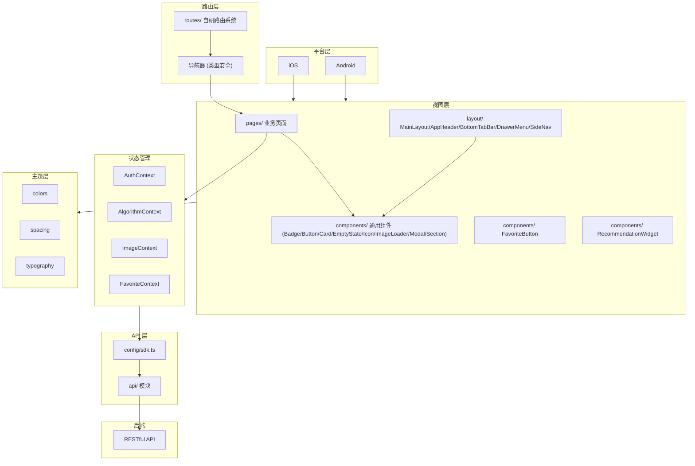

# React Native (dehaze-react-native)

基于 React Native + TypeScript 构建的移动端图像去雾应用，支持 iOS 和 Android 双平台。

> 构建运行、测试命令、部署说明见项目根目录 [README](/README.md)。

## 1. 架构图



## 2. 项目结构

```
dehaze-react-native/
├── android/                       # Android 原生工程
├── ios/                           # iOS 原生工程
├── src/
│   ├── App.tsx                    # 应用入口
│   ├── api/                       # API 接口封装
│   ├── components/                # 通用组件（Badge/Button/Card/EmptyState/Icon/ImageLoader/Modal/Section）
│   ├── config/                    # env、sdk 配置
│   ├── enums/                     # 枚举（CacheEnum）
│   ├── hooks/                     # 通用 hooks（useAnimation/useResponsive）
│   ├── layout/                    # 主布局（MainLayout/AppHeader/BottomTabBar/DrawerMenu/SideNav/MenuConfig）
│   ├── pages/                     # 业务页面
│   │   ├── home/                  # 首页（Hero/Algorithm/Features/FinalCTA/Showcase/TechSpecs）
│   │   ├── login/                 # 登录
│   │   ├── image-input/           # 图像输入（CameraCapture/UploadArea/SampleGallery/HistoryList）
│   │   ├── algorithm-select/      # 算法选择（AlgorithmCard/AlgorithmTree/CompareBar/CompareModal）
│   │   ├── processing/            # 去雾处理（ParamsPanel/ProcessingProgress/ResultPreview）
│   │   ├── compare/               # 效果对比（Filter/Magnifier/Metrics/Overlay/SideBySide）
│   │   ├── dataset/               # 数据集管理（DatasetListSection/ImageGrid/ImageViewer/TypeFilter）
│   │   ├── algorithm/             # 算法列表
│   │   └── task/                  # 任务历史
│   ├── routes/                    # 路由配置（config/navigator/types/utils）
│   ├── store/                     # 全局状态（AuthContext/AlgorithmContext/ImageContext）
│   ├── theme/                     # 主题（colors/spacing/typography）
│   ├── types/                     # 类型定义（algorithm/evaluation/image/processing）
│   └── utils/                     # storage/tokenStore
├── index.js                       # 应用入口文件
└── package.json
```

## 3. 核心功能

- Session 认证：登录/Token 管理/权限校验
- 首页展示：Hero 区、算法介绍、功能特性、工作流、技术规格、CTA
- 图像输入：本地上传、相机拍照、样张画廊、快速开始、历史记录
- 算法选择：算法卡片、算法树、对比栏、对比弹窗、智能推荐
- 去雾处理：参数面板、处理进度、结果预览、处理历史
- 效果对比：并排对比、重叠对比、放大镜、滤镜、指标评估
- 收藏管理：跨模块统一收藏、收藏聚合页、左滑删除
- 推荐管理：推荐算法展示、推荐理由、一键使用
- 数据集管理：列表、详情、图片网格、类型筛选、图片查看器
- 任务历史：历史任务列表与详情

## 4. 关键技术决策

| 决策 | 选择 | 理由 |
|------|------|------|
| 框架 | React Native + TypeScript | iOS/Android 双平台原生体验 |
| 状态管理 | Context API（AuthContext/AlgorithmContext/ImageContext/FavoriteContext） | 轻量级，无额外依赖 |
| 路由 | 自研路由系统 | 类型安全导航，支持导航器配置 |
| 网络层 | config/sdk.ts + api/ 封装 | 统一 Token 注入 |
| 主题 | 统一设计令牌（colors/spacing/typography） | 全局一致视觉风格 |
| 响应式适配 | useResponsive hook | 移动端/平板/桌面端自适应布局 |
| 布局 | BottomTabBar（移动端） + SideNav/DrawerMenu（桌面端） | 按设备类型切换导航模式 |
| 收藏状态同步 | FavoriteContext + AsyncStorage 持久化 | RN 端通过 Context 共享收藏状态，AsyncStorage 持久化离线可用；收藏按钮使用 TouchableOpacity + 触觉反馈（HapticFeedback）|
| 推荐图片上传 | react-native-image-picker + 压缩 | RN 端通过原生模块访问相册/相机，上传前通过 react-native-image-resizer 压缩至 5MB 内，适配弱网环境 |

## 5. 模块间交互

- 通过 RESTful API 调用 Java/Go/Python 后端
- 完整的移动端去雾业务链路：输入 -> 选算法 -> 处理 -> 对比 -> 历史
