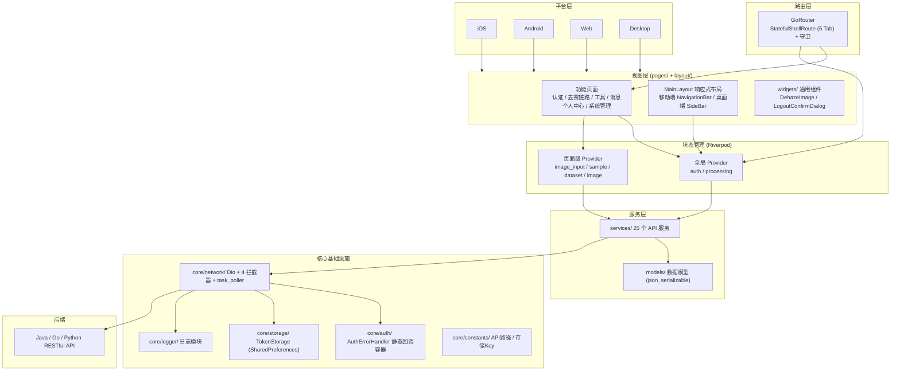
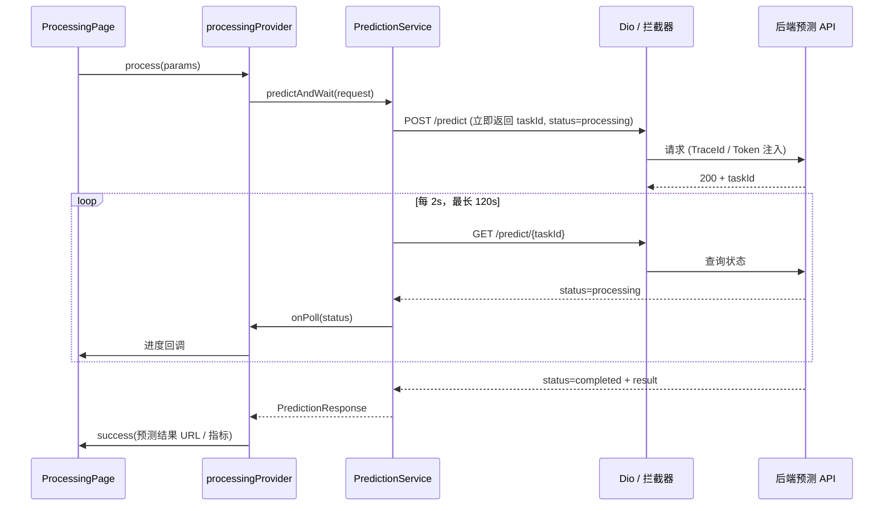
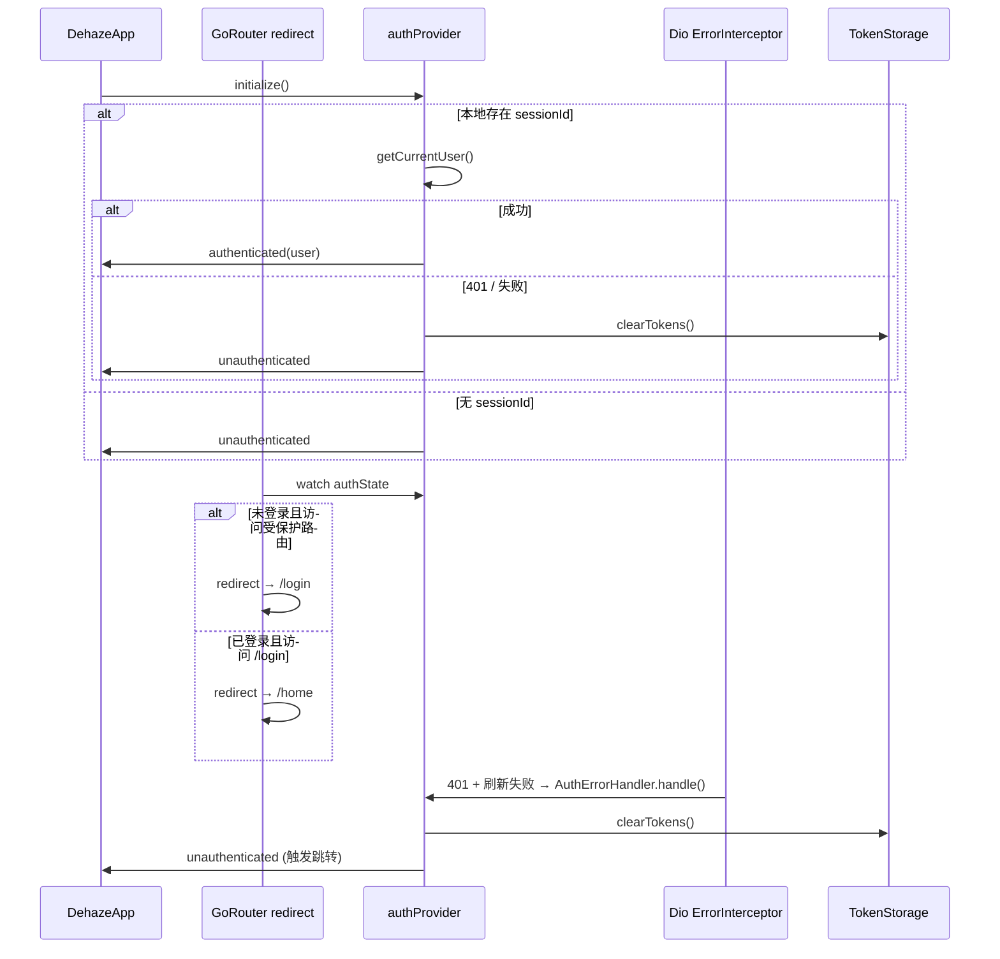

# Flutter (dehaze_flutter)

图像去雾系统的 Flutter 客户端，提供 iOS/Android/Web/Desktop 全平台支持。

> 构建运行、测试命令、部署说明见项目根目录 [README](/README.md)。

## 1. 架构图

### 1.1 分层架构



### 1.2 去雾处理数据流



### 1.3 认证状态流



## 2. 项目结构

```
lib/
├── main.dart                          # 入口：runZonedGuarded + 崩溃捕获 + ProviderScope
├── core/                              # 核心基础设施
│   ├── auth/                          # AuthErrorHandler 静态回调容器（打破 Provider 循环依赖）
│   ├── constants/                     # api_constants / storage_constants
│   ├── logger/                        # Logger + transports + log_entry
│   ├── network/                       # Dio + 4 拦截器 + task_poller + api_result/page_result
│   ├── storage/                       # TokenStorage（基于 SharedPreferences）
│   └── types/                         # option_type 通用类型
├── models/                            # 共享数据模型（24 个，json_serializable 生成 .g.dart）
├── services/                          # 25 个 API 服务（一行 dio 调用 / 模块）
├── providers/                         # Riverpod Providers
│   ├── providers.dart                 # 基础设施 + 全部 service Provider
│   ├── auth_provider.dart             # AuthState / AuthNotifier（登录态 + 权限）
│   └── processing_provider.dart       # 去雾处理流程状态
├── router/                            # GoRouter 配置（StatefulShellRoute + 守卫）
├── layout/                            # MainLayout 响应式 + menu_config + immersive_scaffold
├── theme/                             # AppTheme（light/dark）
├── widgets/                           # 通用组件（DehazeImage / LogoutConfirmDialog）
├── utils/                             # format_utils / responsive_utils / ui_utils
├── constants/                         # app_constants
└── pages/                             # 功能页面（18 个模块）
    ├── home/                          # 首页（hero / workflow / algorithm / showcase / cta / tools_grid）
    ├── login/                         # 登录
    ├── register/                      # 注册
    ├── image_input/                   # 图像输入（upload / camera / sample / preview）
    ├── algorithm_select/             # 去雾流程中的算法选择
    ├── algorithm/                     # 算法浏览页
    ├── processing/                    # 去雾处理（轮询结果）
    ├── comparison/                    # 效果对比（side_by_side / overlay / magnifier / filter / metrics / algorithm_info）
    ├── batch/                         # 批量处理
    ├── dataset/                       # 数据集管理（providers + widgets）
    ├── metrics_manage/               # 指标评估管理
    ├── messages/                      # 消息中心 + 详情
    ├── notify/                        # 通知
    ├── task_history/                  # 处理历史
    ├── profile/                       # 个人中心入口
    ├── personal/                      # 个人中心子页（10 个：settings/quota/package/orders/member/files/feedback/favorites/help/about）
    ├── dev_logs/                      # 日志浏览与导出（仅 debug）
    ├── dashboard/                     # 管理后台首页
    ├── dehaze/                        # 去雾 Tab 容器
    ├── tools/                         # 工具 Tab 容器
    └── system/                        # 系统管理（14 个：user/role/menu/dept/dict/algorithm/dataset/task/member/package/order/feedback/message/recommend）
```

## 3. 核心模块说明

| 模块 | 职责 | 技术要点 |
|------|------|---------|
| 认证 (auth_provider) | 登录/注册/登出/Session 续期/权限判定 | AuthState 持有 user + sessionId，`hasPerm/hasRole` 供 UI 与路由守卫查询 |
| 去雾处理 (processing_provider) | 选图 → 选算法 → 异步预测 → 结果回填 | 后端异步任务，前端 `predictAndWait` 轮询（2s/次，120s 超时） |
| 效果对比 (comparison/) | 6 种对比模式独立路由 | side_by_side / overlay / magnifier / filter / metrics / algorithm_info，ShellRoute 外沉浸页 |
| 任务轮询 (task_poller) | 预测与评估共用 | `pollTask<T>` 泛型轮询器，`PollOptions` 配置间隔/超时/回调 |
| 收藏管理 | 跨模块统一收藏（算法/处理结果/数据集） | favoriteProvider + Dismissible 左滑删除 |
| 推荐管理 | 推荐算法展示与一键使用 | recommendation_service |
| 数据集管理 (dataset/) | 列表 / 详情 / 图片浏览 / 类型筛选 | 模块内 providers/ + widgets/ 自治 |
| 系统管理 (system/) | 14 个后台管理页 | user/role/menu/dept/dict/algorithm/dataset/task/member/package/order/feedback/message/recommend |
| 个人中心 (personal/) | 10 个用户子页 | settings/quota/package/orders/member/files/feedback/favorites/help/about |
| 消息中心 (messages/) | 消息列表 + 详情 | announcement + message + notification_settings |
| 响应式布局 (MainLayout) | 单代码库适配全平台 | `MediaQuery.width >= 768` 切换：移动端 NavigationBar 5 Tab / 桌面端 248px 侧边栏 + 面包屑 |
| 日志 (core/logger/) | 文件 + 远程 + 控制台多 transport | 详见 §7 |

## 4. 关键技术决策

| 决策 | 选择 | 理由 |
|------|------|------|
| 框架 | Flutter | 单代码库支持 iOS/Android/Web/Desktop 全平台 |
| 状态管理 | Riverpod (StateNotifier) | 编译时安全，Provider 依赖注入；StateNotifier 承载可变状态 |
| 网络层 | Dio + 4 拦截器 | TraceInterceptor（trace_id）/ AuthInterceptor（Token 注入）/ ResponseInterceptor（统一拆包）/ ErrorInterceptor（401 处理） |
| 路由 | GoRouter (StatefulShellRoute) | 声明式路由，5 Tab 状态保持，支持深层链接与 ShellRoute 外沉浸页 |
| 存储 | SharedPreferences | Token (sessionId) 持久化，跨平台一致性，无平台特有依赖 |
| 响应式布局 | 移动端 NavigationBar + 桌面端 SideBar | `MediaQuery.sizeOf` 实时切换，单 Widget 树双布局 |
| 认证错误解耦 | AuthErrorHandler 静态容器 | 打破 `dioClientProvider → authProvider → authServiceProvider → dioClientProvider` 循环依赖 |
| 数据模型 | json_serializable + .g.dart | 编译时类型安全，避免手写 fromJson/toJson |
| 异步任务 | 泛型轮询器 pollTask | 预测与评估共用同一轮询机制，配置化间隔/超时 |

## 5. 路由设计

### 5.1 路由结构

采用 GoRouter `StatefulShellRoute.indexedStack`，5 个 Tab 分支保持独立导航栈：

| 分支 | 路径 | 子页面 |
|------|------|--------|
| 首页 | `/home` | - |
| 工具 | `/tools` | image-input / algorithm-browse / dataset (含 :id 详情) / batch / metrics-manage |
| 去雾 | `/dehaze` | algorithm-select / processing |
| 消息 | `/messages` | :id 详情 / notify |
| 我的 | `/profile` | task-history / files / orders / quota / member / package / feedback / favorites / settings / help / about / notify / dashboard / system/* (14 管理页) |

ShellRoute 外的沉浸页（无 Tab 框架）：`/compare/side-by-side`、`/compare/overlay`、`/compare/magnifier`、`/compare/filter`、`/compare/metrics`、`/algorithm`。

### 5.2 导航守卫

`goRouterProvider` watch `authProvider`，redirect 规则：

- 未登录访问非公开路由 → 重定向 `/login`
- 已登录访问 `/login` 或 `/register` → 重定向 `/home`
- 公开路由白名单：`/login`、`/register`、`/home`

### 5.3 错误处理

`errorBuilder` 渲染 404 页，提供返回首页入口。

## 6. 状态管理与模块间交互

### 6.1 Provider 分层

| 层级 | 位置 | 职责 |
|------|------|------|
| 基础设施 Provider | providers.dart | sharedPreferences / tokenStorage / dioClient / authErrorCallback |
| 服务 Provider | providers.dart | 25 个 service Provider，一行 dio 注入 |
| 全局业务 Provider | auth_provider.dart / processing_provider.dart | 跨页面共享的认证态与处理流程态 |
| 页面级 Provider | pages/{module}/providers/ | image_input_provider / sample_provider / dataset_provider / image_provider，仅模块内使用 |

### 6.2 模块间交互

- **后端通信**：通过 Dio 调用 Java/Go/Python 三端 RESTful API，4 拦截器统一处理 trace_id 注入、Token 注入、响应拆包、401 错误
- **认证错误传播**：`ErrorInterceptor` 检测 401 → `AuthErrorHandler.handle()` → `authProvider.onAuthError()` 清空 Token 并切换状态 → GoRouter 守卫触发跳转 `/login`。静态容器设计避免 Provider 循环依赖
- **去雾处理流程**：UI → `processingProvider.process()` → `PredictionService.predictAndWait()` → POST 立即返回 taskId → `pollTask` 轮询 GET 直至 completed/failed → 状态回填 UI
- **跨模块状态共享**：如收藏状态通过 favoriteProvider 全局共享，任意页面收藏按钮变更后自动重建

## 7. 日志模块

Flutter 端日志实现位于 `lib/core/logger/`（`logger.dart` / `transports.dart` / `log_entry.dart`），行为契约（字段 schema、接收链路、采样限流）见 [02-系统架构/07-日志架构设计.md](../../02-系统架构/07-日志架构设计.md) §3.5，与 [08-SDK架构文档.md](./08-SDK架构文档.md) 的 JS SDK 行为对齐，共享同一后端接收 API。

Flutter 端特有决策：

- **崩溃捕获**：`main()` 包裹 `runZonedGuarded` + `FlutterError.onError` + `PlatformDispatcher.onError`，error_type=dart
- **不调用 `FlutterError.presentError`**：其默认 `dumpErrorToConsole` 输出与 Logger 的 `ConsoleTransport` 重复；Logger 的 `error_stack` 使用 `FlutterErrorDetails.toString()`（同源，含 library + widget 上下文 + RenderObject 诊断），信息不丢失
- **trace_id 透传**：`TraceInterceptor` 注入 `X-Trace-Id` 请求头，响应头回写对齐
- **API 失败上报**：`TraceInterceptor.onError` 构造 `method/path/status/duration/code` 交 Logger（error_type=api）
- **路由自动填充 url**：根 Widget build 时 `Logger.instance.attachRouter(goRouter)`，`log()` 自动取 `routerDelegate.currentConfiguration.last.matchedLocation`（调用点显式传 url 优先）
- **ERROR 去重**：相同 `message + errorStack` fingerprint 在 10s 窗口内只记录一次，防止布局错误（如 RenderFlex overflow 60fps）触发日志风暴；不同 trace_id 的 API 错误 fingerprint 不同，不误去重
- **开发者面板**：`lib/pages/dev_logs/` 日志浏览与导出（仅 debug）
- **不暴露 user_id**：前端 SDK 不上报 user_id，由三端后端从会话统一解析注入

文件切割、保留策略、远程上报批量化等通用策略见日志架构设计文档。
