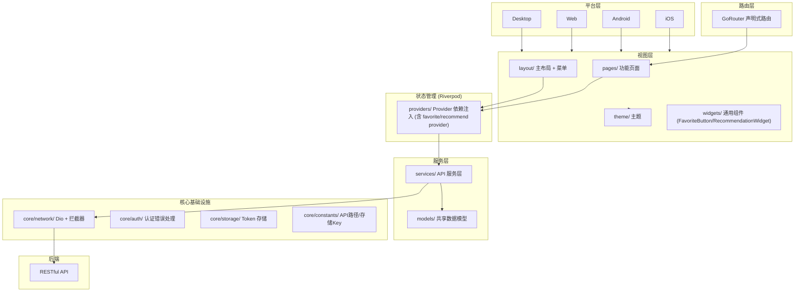

# Flutter (dehaze_flutter)

图像去雾系统的 Flutter 客户端，提供 iOS/Android/Web/Desktop 全平台支持。

> 构建运行、测试命令、部署说明见项目根目录 [README](/README.md)。

## 1. 架构图



## 2. 项目结构

```
lib/
├── main.dart                          # 入口
├── core/                              # 核心基础设施
│   ├── auth/                          # 认证错误处理
│   ├── constants/                     # 常量（API路径、存储Key）
│   ├── logger/                        # 日志模块（Logger + Transport）
│   ├── network/                       # 网络层（Dio + 拦截器 + 响应模型）
│   └── storage/                       # Token 存储
├── models/                            # 共享数据模型
├── services/                          # API 服务层
├── providers/                         # Riverpod Providers
├── router/                            # 路由配置
├── layout/                            # 主布局 + 菜单
├── theme/                             # 主题
└── pages/                             # 功能页面
    ├── home/                          # 首页
    ├── login/                         # 登录页
    ├── image_input/                   # 图像输入
    ├── algorithm_select/              # 算法选择
    ├── processing/                    # 去雾处理
    ├── comparison/                    # 效果对比（6个子页面）
    ├── dataset/                       # 数据集管理
    ├── profile/                       # 用户中心
    ├── task_history/                  # 处理历史
    └── dev_logs/                      # 日志浏览与导出面板（仅 debug）
```

## 3. 核心功能

- Session 认证：完整的登录/登出/验证码/Session 续期流程
- 去雾处理：图像输入 -> 算法选择 -> 去雾处理 -> 效果对比 完整链路
- 效果对比：并排对比、重叠对比、放大镜、滤镜调节、指标评估、算法信息
- 收藏管理：跨模块统一收藏（算法/处理结果/数据集）、收藏聚合页、Dismissible 左滑删除
- 推荐管理：推荐算法展示、推荐理由、一键使用
- 数据集管理：数据集列表、详情、图片浏览、类型筛选
- 用户中心：用户信息、角色权限、处理历史
- 响应式布局：移动端底部导航 + 桌面端侧边栏

## 4. 关键技术决策

| 决策 | 选择 | 理由 |
|------|------|------|
| 框架 | Flutter | 单代码库支持 iOS/Android/Web/Desktop 全平台 |
| 状态管理 | Riverpod | 编译时安全，Provider 依赖注入 + 状态托管 |
| 网络层 | Dio + 拦截器 | Token 自动注入、错误统一处理 |
| 路由 | GoRouter | 声明式路由，支持深层链接 |
| 存储 | SharedPreferences / FlutterSecureStorage | Token 持久化 |
| 响应式布局 | 移动端底部导航 + 桌面端侧边栏 | 单代码库适配全平台 |
| 收藏状态同步 | Riverpod favoriteProvider + ChangeNotifier | Flutter 端通过 Riverpod Provider 管理收藏状态，自动触发 UI 重建；收藏按钮使用 IconButton + HapticFeedback 触觉反馈 |
| 推荐图片上传 | image_picker + flutter_image_compress | Flutter 端通过 image_picker 访问相册/相机，上传前通过 flutter_image_compress 压缩，跨平台一致性优于原生方案 |

## 5. 模块间交互

- 通过 RESTful API 调用 Java/Go/Python 后端
- Dio 拦截器统一处理 Token 注入与 401 响应

## 6. 日志模块

Flutter 端日志实现位于 `lib/core/logger/`（`logger.dart` / `transports.dart` / `log_entry.dart`），行为契约（字段 schema、接收链路、采样限流）见 [02-系统架构/07-日志架构设计.md](../../02-系统架构/07-日志架构设计.md) §3.5，与 [sdk架构文档.md](./sdk架构文档.md) 的 JS SDK 行为对齐，共享同一后端接收 API。

- **Logger 单例 + 多 transport**：`ConsoleTransport`（debugPrint）+ `FileTransport`（path_provider 写 `logs/{yyyy-MM-dd}/{level}.log`，NDJSON，100MB 切割，开发 7 天 / 生产兜底 3 天保留）+ `RemoteTransport`（生产批量上报）
- **崩溃捕获**：`main()` 包裹 `runZonedGuarded` + `FlutterError.onError` + `PlatformDispatcher.onError`，error_type=dart
- `FlutterError.onError` **不调用 `FlutterError.presentError`**：与 Logger 的 `ConsoleTransport` 输出会重复，且 Logger 的 `error_stack` 已使用 `FlutterErrorDetails.toString()`（与 `dumpErrorToConsole` 同源，含 library + widget 上下文 + RenderObject 诊断），信息不丢失
- **trace_id 透传**：`TraceInterceptor`（Dio）注入 `X-Trace-Id` 请求头，响应头 `X-Trace-Id` 回写对齐
- **API 失败上报**：`TraceInterceptor.onError` 构造 `method/path/status/duration/code` 字段交 Logger（error_type=api）
- **路由自动填充 `url`**：根 Widget build 时调用 `Logger.instance.attachRouter(goRouter)`，`log()` 自动取 `routerDelegate.currentConfiguration.last.matchedLocation` 作为 `url` 字段（调用点显式传 url 时优先用调用点的）
- **ERROR 级别去重**：相同 `message + errorStack` fingerprint 在 10s 窗口内只记录一次（同时作用于 transports / 本地文件 / ELK 上报），防止布局/渲染错误在 layout 阶段每帧触发日志风暴（RenderFlex overflow 60fps 下每秒 60 条相同日志）。不同 trace_id 的 API 错误 fingerprint 不同，不会被误去重
- **开发者面板**：`lib/pages/dev_logs/` 提供日志文件浏览与导出（仅 debug 显示）
- **不暴露 `user_id` 字段**：前端 SDK 不上报 `user_id`，由三端后端从会话统一解析注入
