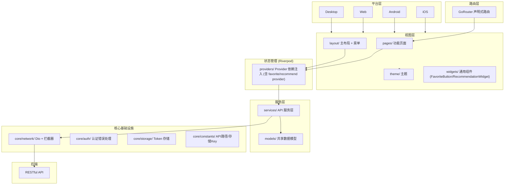

# Flutter (dehaze_flutter)

图像去雾系统的 Flutter 客户端，提供 iOS/Android/Web/Desktop 全平台支持。

> 构建运行、测试命令、部署说明见项目根目录 [README](/README.md)。

## 1. 架构图



## 2. 项目结构

```
lib/
├── main.dart                          # 入口
├── core/                              # 核心基础设施
│   ├── auth/                          # 认证错误处理
│   ├── constants/                     # 常量（API路径、存储Key）
│   ├── network/                       # 网络层（Dio + 拦截器 + 响应模型）
│   └── storage/                       # Token 存储
├── models/                            # 共享数据模型
├── services/                          # API 服务层
├── providers/                         # Riverpod Providers
├── router/                            # 路由配置
├── layout/                            # 主布局 + 菜单
├── theme/                             # 主题
└── pages/                             # 功能页面
    ├── home/                          # 首页
    ├── login/                         # 登录页
    ├── image_input/                   # 图像输入
    ├── algorithm_select/              # 算法选择
    ├── processing/                    # 去雾处理
    ├── comparison/                    # 效果对比（6个子页面）
    ├── dataset/                       # 数据集管理
    ├── profile/                       # 用户中心
    └── task_history/                  # 处理历史
```

## 3. 核心功能

- Session 认证：完整的登录/登出/验证码/Session 续期流程
- 去雾处理：图像输入 -> 算法选择 -> 去雾处理 -> 效果对比 完整链路
- 效果对比：并排对比、重叠对比、放大镜、滤镜调节、指标评估、算法信息
- 收藏管理：跨模块统一收藏（算法/处理结果/数据集）、收藏聚合页、Dismissible 左滑删除
- 推荐管理：推荐算法展示、推荐理由、一键使用
- 数据集管理：数据集列表、详情、图片浏览、类型筛选
- 用户中心：用户信息、角色权限、处理历史
- 响应式布局：移动端底部导航 + 桌面端侧边栏

## 4. 关键技术决策

| 决策 | 选择 | 理由 |
|------|------|------|
| 框架 | Flutter | 单代码库支持 iOS/Android/Web/Desktop 全平台 |
| 状态管理 | Riverpod | 编译时安全，Provider 依赖注入 + 状态托管 |
| 网络层 | Dio + 拦截器 | Token 自动注入、错误统一处理 |
| 路由 | GoRouter | 声明式路由，支持深层链接 |
| 存储 | SharedPreferences / FlutterSecureStorage | Token 持久化 |
| 响应式布局 | 移动端底部导航 + 桌面端侧边栏 | 单代码库适配全平台 |
| 收藏状态同步 | Riverpod favoriteProvider + ChangeNotifier | Flutter 端通过 Riverpod Provider 管理收藏状态，自动触发 UI 重建；收藏按钮使用 IconButton + HapticFeedback 触觉反馈 |
| 推荐图片上传 | image_picker + flutter_image_compress | Flutter 端通过 image_picker 访问相册/相机，上传前通过 flutter_image_compress 压缩，跨平台一致性优于原生方案 |

## 5. 模块间交互

- 通过 RESTful API 调用 Java/Go/Python 后端
- Dio 拦截器统一处理 Token 注入与 401 响应
