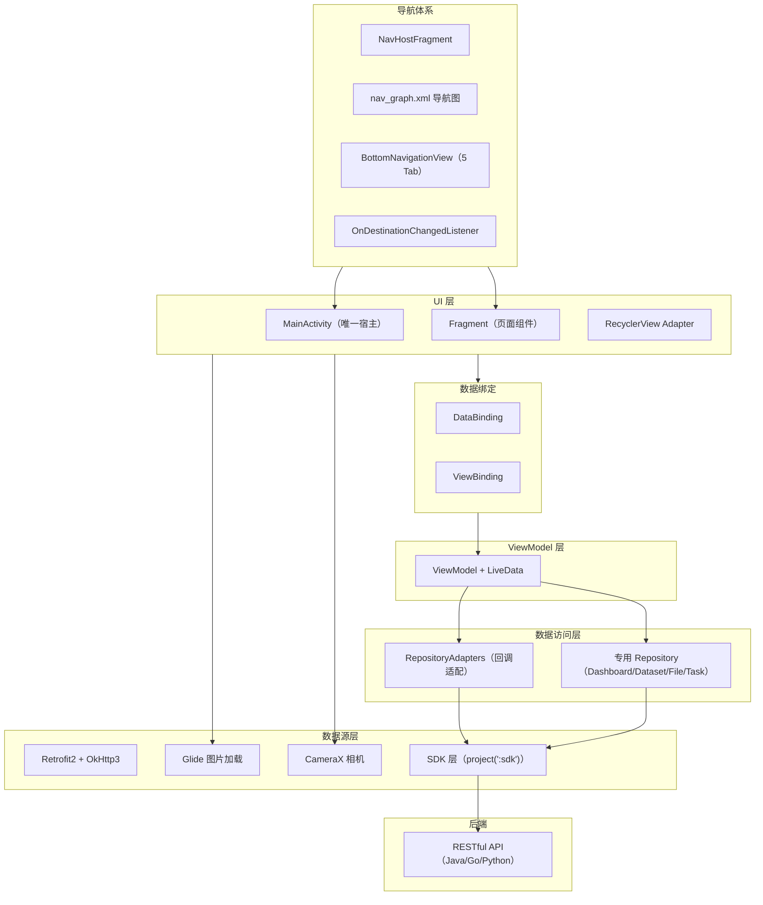

# Android 原生 (dehaze-android)

基于 Java + MVVM + Jetpack Navigation Component 构建的原生 Android 图像去雾应用，对标 dehaze-front-vue 核心业务功能，提供移动端去雾处理、算法浏览、数据集管理、图像对比等完整能力。

> 构建运行、测试命令、部署说明见项目根目录 [README](/README.md)。

## 1. 架构图



## 2. 技术栈

| 类别 | 选型 | 说明 |
|------|------|------|
| 开发语言 | Java | 非 Kotlin，与项目整体风格一致 |
| 架构模式 | MVVM | ViewModel + LiveData + DataBinding/ViewBinding |
| 导航方案 | Navigation Component（Jetpack）+ BottomNavigationView | Material Design 3 内置底部导航组件 |
| 网络层 | Retrofit2 + OkHttp3 | 成熟稳定的 HTTP 客户端 |
| 图片加载 | Glide | 高性能图片加载与缓存 |
| 相机 | CameraX | Jetpack 相机库，向后兼容 |
| UI 设计 | Material Design 3 | 遵循 Google 人机交互指南 |
| 编译目标 | compileSdk 36 / minSdk 23 / targetSdk 34 | Android 6.0 至 14 全覆盖 |

## 3. 项目结构

```
dehaze-android/
├── app/src/main/
│   ├── java/com/pei/dehaze/
│   │   ├── MainActivity.java                    # 唯一宿主 Activity，导航控制中心
│   │   ├── DehazeApplication.java               # Application，全局初始化
│   │   ├── ui/                                   # UI 层（按业务模块分包）
│   │   │   ├── login/                            # 登录（L0 认证页）
│   │   │   ├── register/                         # 注册（L0 认证页）
│   │   │   ├── home/                             # 首页（L1 Tab1：品牌 Hero + 快捷入口 + 统计 + 特色能力）
│   │   │   ├── tools/                            # 工具（L1 Tab2：搜索 + 快捷入口 + 功能网格）
│   │   │   ├── dehaze/                           # 去雾（L1 Tab3：5 步步内流程）
│   │   │   ├── messages/                         # 消息（L1 Tab4：列表 + 分类 + 未读角标）
│   │   │   │   └── detail/                       # MessagesDetailActivity 消息详情
│   │   │   ├── profile/                          # 我的（L1 Tab5：用户卡 + VIP + 统计 + 入口）
│   │   │   │   └── viewmodel/                    # ProfileViewModel
│   │   │   ├── algorithm_select/                 # 算法选择（L2 Activity，带入去雾流程）
│   │   │   ├── input/                            # 图像输入历史（L2 Activity）
│   │   │   ├── algorithm/                        # 算法库浏览（L2 Fragment：列表 + 推荐 + 详情 + 使用）
│   │   │   ├── dataset/                          # 数据集浏览（L2 Fragment：公开/共享浏览 + 图片网格）
│   │   │   ├── batch/                            # 批量处理（L2 Activity：≤20 张 + 进度 + 结果）
│   │   │   ├── metrics_manage/                   # 指标管理（L2 Activity：评估日志 + 对比表格）
│   │   │   ├── compare/                          # 对比（L3 Activity：5 种对比模式）
│   │   │   ├── evaluation/                       # 评估操作（L3 Activity）
│   │   │   ├── presentation/                     # 图像展示（L3 Activity）
│   │   │   ├── task/                             # 处理历史（L2 Activity，个人视角）
│   │   │   ├── notify/                           # 消息设置（L2 Activity）
│   │   │   ├── dashboard/                        # 工作台（L2 Fragment，归 Profile 管理入口）
│   │   │   ├── personal/                         # 个人侧页面（10 个独立 Activity）
│   │   │   ├── system/                           # 管理模块（15 个独立 Activity，权限过滤）
│   │   │   ├── common/                           # 公共 UI 组件
│   │   │   └── file/                             # 文件相关
│   │   ├── repository/                           # 数据仓库层
│   │   ├── security/                             # 安全相关
│   │   └── utils/                                # 工具类
│   └── res/
│       ├── navigation/nav_graph.xml              # 导航图（统一声明所有 Fragment 目的地）
│       ├── menu/bottom_navigation_menu.xml        # 5 Tab 菜单配置
│       ├── layout/                                # 布局文件（activity/fragment/dialog/item 四类）
│       │   └── activity_main.xml                  # CoordinatorLayout + Toolbar + NavHostFragment + BottomNavigationView
│       ├── drawable/                              # 矢量图标（含 Tab 图标 outline/filled 双态）
│       └── values/                                # 资源令牌（colors / strings / themes 等）
└── sdk/                                           # 自带 Java SDK（project(':sdk')）
    ├── src/main/java/com/pei/dehaze/sdk/
    │   ├── api/                                   # API 接口层（24 个 API 类）
    │   ├── service/                               # Retrofit Service 接口（24 个）
    │   ├── model/                                 # 数据模型（按业务域分包：auth/algorithm/dataset/order/member/message/...）
    │   ├── network/                               # 网络配置（OkHttp 拦截器、Token 注入）
    │   ├── logger/                                # 日志模块（Logger + Transport + TraceManager）
    │   └── utils/                                 # SDK 工具类
    └── build.gradle
```

## 4. 导航体系（核心架构）

Android 端采用 **单 Activity + NavHostFragment + BottomNavigationView + Navigation Component** 的统一导航方案，通过 `OnDestinationChangedListener` 实现页面层级感知的导航栏显隐控制。

### 4.1 导航树

```
MainActivity（唯一宿主 Activity）
├── MaterialToolbar（顶部导航栏，L0 隐藏）
├── NavHostFragment（Navigation Component，由 nav_graph.xml 驱动）
│   ├── L0 认证页
│   │   ├── loginFragment（登录）
│   │   └── registerFragment（注册）
│   ├── L1 Tab 根页面（Top-Level Destinations，5 个）
│   │   ├── homeFragment（首页 Tab1）
│   │   ├── toolsFragment（工具 Tab2）
│   │   ├── dehazeFragment（去雾 Tab3）
│   │   ├── messagesFragment（消息 Tab4）
│   │   └── profileFragment（我的 Tab5）
│   ├── L2 Fragment（非顶级目的地，nav_graph 内声明）
│   │   ├── dashboardFragment（工作台）
│   │   ├── datasetFragment（数据集浏览）
│   │   ├── datasetDetailFragment（数据集详情）
│   │   ├── algorithmFragment（算法库浏览）
│   │   └── systemManagementFragment（系统管理入口）
│   └── L2/L3 Activity（独立 Activity，不经过 NavHost）
│       ├── compareActivity（对比，L3）
│       ├── evaluationActivity（评估，L3）
│       ├── presentationActivity（展示，L3）
│       ├── inputHistoryActivity（图像输入历史，L2）
│       ├── MessagesDetailActivity（消息详情，L2）
│       └── personal/system 下全部独立 Activity（L2）
└── BottomNavigationView（5 Tab，Material Design 3 内置组件）
```

### 4.2 关键机制

**OnDestinationChangedListener（页面层级感知）**

`MainActivity.java` 注册全局目的地变化监听器，根据当前目的地类型动态控制导航栏显隐：

| 目的地类型 | Toolbar | BottomNavigationView | 返回箭头 |
|-----------|---------|---------------------|---------|
| L0 认证页（loginFragment / registerFragment） | 隐藏 | 隐藏 | — |
| L1 顶级目的地（5 Tab） | 显示 | 显示 | 无（AppBarConfiguration 控制） |
| L2/L3 非顶级目的地 | 显示 | 隐藏 | 有（ActionBar 自动管理） |

监听器依据 `AppBarConfiguration.getTopLevelDestinations()` 判定是否顶级目的地，并识别 login/register 两个认证目的地：认证页隐藏 Toolbar；非顶级目的地或认证页隐藏 BottomNavigationView。

**AppBarConfiguration**

通过 `AppBarConfiguration.Builder` 声明 5 个顶级目的地，NavigationUI 自动处理：
- 顶级目的地不显示返回箭头
- 非顶级目的地自动显示 ActionBar 返回按钮
- `onSupportNavigateUp()` 委托给 `NavigationUI.navigateUp()` 统一处理返回逻辑

**BottomNavigationView 关联**

`NavigationUI.setupWithNavController()` 绑定底部导航与 NavController，实现 Tab 切换时自动导航到对应 Fragment，并保持返回栈状态。

**Tab 角标**

使用 `BottomNavigationView.getOrCreateBadge()` 支持消息 Tab 未读角标显示，Material Design 3 内置能力。

### 4.3 关键文件

| 文件 | 用途 |
|------|------|
| `MainActivity.java` | 导航宿主，OnDestinationChangedListener 注册，Session 失效处理 |
| `nav_graph.xml` | 导航图，声明所有 Fragment 目的地及 Action 跳转关系 |
| `bottom_navigation_menu.xml` | 5 Tab 菜单配置（id / icon / title） |
| `activity_main.xml` | CoordinatorLayout + MaterialToolbar + NavHostFragment + BottomNavigationView |

## 5. 页面层级与布局体系

页面按层级分为三级，每级对应不同的导航形态：

| 层级 | 导航形态 | 实现方式 | 典型页面 |
|------|---------|---------|---------|
| L0 | 无 Toolbar，无 TabBar | Fragment，OnDestinationChangedListener 隐藏全部导航 | 登录、注册 |
| L1 | Toolbar + BottomNavigationView（5 Tab） | Fragment（Top-Level Destination），Toolbar 显示 Tab 标题 | 首页、工具、去雾、消息、我的 |
| L2 | Toolbar + 返回箭头，无 TabBar | Fragment（nav_graph 内）或独立 Activity | 算法浏览、数据集、工作台、个人侧页面、管理页面 |
| L3 | 独立 Activity，全屏沉浸 | Activity | 对比、评估、图像展示 |

**独立 Activity（L2/L3）说明**：由于部分页面需要独立的生命周期、过渡动画或全屏沉浸体验，采用独立 Activity 而非 Fragment 实现。这些 Activity 通过 `startActivity()` 从 Fragment 中启动，自身维护 ActionBar 返回按钮。

## 6. 完整页面清单

### 6.1 L0 认证页（无 Toolbar，无 TabBar）

| 页面 | 类路径 | 功能 |
|------|--------|------|
| 登录 | `ui/login/LoginFragment` | 用户名密码登录、记住我、跳转注册 |
| 注册 | `ui/register/RegisterFragment` | 新用户注册、跳转登录 |

### 6.2 L1 Tab 根页面（BottomNavigationView + Toolbar）

| Tab | 类路径 | 功能要点 |
|-----|--------|---------|
| 首页 | `ui/home/HomeFragment` | 品牌 Hero + 快捷入口 + 数据统计 + 特色能力（融合设计稿保留 8 区块） |
| 工具 | `ui/tools/ToolsFragment` | 页内搜索 + 快捷入口横滑 + 功能网格 ≤3 列，接入真实跳转 |
| 去雾 | `ui/dehaze/DehazeFragment` | 页内步骤流 5 步：上传 → 算法 → 参数 → 处理 → 对比 |
| 消息 | `ui/messages/MessagesFragment` | 消息列表 + 分类筛选（全部/系统/处理/活动）+ 未读角标 + 设置入口 |
| 我的 | `ui/profile/ProfileFragment` | 用户卡 + VIP 横幅 + 数据统计 + 四组入口（个人数据/商业服务/其他/管理入口）+ 退出 |

### 6.3 L2 个人侧页面（独立 Activity，`ui/personal/`）

| 页面 | 类路径 | 功能 |
|------|--------|------|
| 我的文件 | `ui/personal/FilesActivity` | 用户文件管理 |
| 我的订单 | `ui/personal/OrdersActivity` | 订单列表与详情 |
| 我的额度 | `ui/personal/QuotaActivity` | 处理额度查询 |
| 我的会员 | `ui/personal/MemberActivity` | 会员信息与等级 |
| 我的套餐 | `ui/personal/PackageActivity` | 套餐信息查看 |
| 反馈评价 | `ui/personal/FeedbackActivity` | 提交反馈与评价 |
| 我的收藏 | `ui/personal/FavoritesActivity` | 跨模块统一收藏聚合页 |
| 系统设置 | `ui/personal/SettingsActivity` | 应用设置 |
| 帮助中心 | `ui/personal/HelpActivity` | 使用帮助 |
| 关于我们 | `ui/personal/AboutActivity` | 应用信息 |

### 6.4 L2 工具/业务页面

| 页面 | 类路径 | 类型 | 功能 | 对接 API |
|------|--------|------|------|---------|
| 算法选择 | `ui/algorithm_select/AlgorithmSelectActivity` | Activity | 算法列表 + 推荐，带入去雾流程 | RecommendationAPI.analyze |
| 图像输入历史 | `ui/input/InputHistoryActivity` | Activity | 历史图像浏览与选择 | InputHistoryAPI |
| 算法库浏览 | `ui/algorithm/AlgorithmFragment` | Fragment（nav_graph） | 列表 + 智能推荐 + 详情 + "使用该算法"带入流程 | AlgorithmAPI |
| 算法详情 | `ui/algorithm/AlgorithmDetailActivity` | Activity | 算法详细信息 | AlgorithmAPI |
| 数据集浏览 | `ui/dataset/DatasetFragment` | Fragment（nav_graph） | 公开/共享浏览 + 图片网格 | DatasetAPI |
| 数据集详情 | `ui/dataset/DatasetDetailFragment` | Fragment（nav_graph） | 数据集详情 + 图片列表 | DatasetAPI |
| 批量处理 | `ui/batch/BatchActivity` | Activity | 批量上传 ≤20 张 + 进度 + 结果 | ModelAPI.batchPredict |
| 指标管理 | `ui/metrics_manage/MetricsManageActivity` | Activity | 评估日志 + 对比表格 | ModelAPI.getEvalMetrics |
| 工作台 | `ui/dashboard/DashboardFragment` | Fragment（nav_graph） | 管理入口工作台，归 Profile 管理入口 | — |
| 消息设置 | `ui/notify/NotifyActivity` | Activity | 消息通知设置 | NotificationSettingAPI |
| 消息详情 | `ui/messages/detail/MessagesDetailActivity` | Activity | 消息内容详情 | — |
| 处理历史 | `ui/task/TaskListActivity` | Activity | 个人处理记录列表 | TaskAPI.getPage |

### 6.5 L3 沉浸/对比页（独立 Activity）

| 页面 | 类路径 | 功能 |
|------|--------|------|
| 对比 | `ui/compare/CompareActivity` | 5 种对比模式：并排/叠加/放大镜/滤镜/指标 |
| 评估 | `ui/evaluation/EvaluationActivity` | 图像评估操作 |
| 图像展示 | `ui/presentation/PresentationActivity` | 全屏图像展示 |

### 6.6 管理模块（独立 Activity，`ui/system/`，权限过滤）

管理入口统一归入"我的"页面底部管理入口组，无 `sys:module:*` 权限的用户整组不显示。

| 页面 | 类路径 | 功能 | 权限码 |
|------|--------|------|-------|
| 用户管理 | `ui/system/UserListActivity` | 用户列表与操作 | sys:user:* |
| 角色管理 | `ui/system/RoleListActivity` | 角色列表与权限分配 | sys:role:* |
| 菜单管理 | `ui/system/MenuListActivity` | 菜单配置 | sys:menu:* |
| 部门管理 | `ui/system/DeptListActivity` | 部门组织管理 | sys:dept:* |
| 字典管理 | `ui/system/DictTypeListActivity` + `DictItemListActivity` | 字典类型与字典项 | sys:dict:* |
| 算法管理 | `ui/system/AlgorithmManageActivity` | 算法审计上下架 | sys:algorithm:* |
| 数据集管理 | `ui/system/DatasetManageActivity` | 数据集 CRUD | sys:dataset:* |
| 任务管理 | `ui/system/TaskManageActivity` | 全用户任务管理 | sys:task:* |
| 会员管理 | `ui/system/MemberManageActivity` | 会员列表/等级调整/状态切换/禁用 | sys:member:* |
| 套餐管理 | `ui/system/PackageManageActivity` | 套餐列表/新增/编辑/上下架/删除 | sys:package:* |
| 订单管理 | `ui/system/OrderManageActivity` | 订单列表/统计/取消/退款申请 | sys:order:* |
| 反馈评价管理 | `ui/system/FeedbackManageActivity` | 反馈列表/回复/关闭 | sys:feedback:* |
| 消息管理 | `ui/system/MessageManageActivity` | 公告列表管理 | sys:notify:* |
| 推荐管理 | `ui/system/RecommendManageActivity` | 推荐规则列表 | sys:recommendation:* |

## 7. 视角拆分

以下模块从"个人+管理混用"严格拆分为两套独立页面：

| 业务域 | 个人视角页面 | 管理视角页面 |
|--------|-------------|-------------|
| 算法 | `ui/algorithm/AlgorithmFragment` + `AlgorithmDetailActivity`（算法库浏览） | `ui/system/AlgorithmManageActivity`（审计上下架） |
| 数据集 | `ui/dataset/DatasetFragment` + `DatasetDetailFragment`（公开/共享浏览） | `ui/system/DatasetManageActivity`（CRUD） |
| 会员 | `ui/personal/MemberActivity`（我的会员） | `ui/system/MemberManageActivity`（会员管理） |
| 套餐 | `ui/personal/PackageActivity`（我的套餐） | `ui/system/PackageManageActivity`（套餐管理） |
| 反馈 | `ui/personal/FeedbackActivity`（反馈评价） | `ui/system/FeedbackManageActivity`（反馈评价管理） |
| 推荐 | —（无个人视角） | `ui/system/RecommendManageActivity`（推荐管理） |
| 任务 | `ui/task/TaskListActivity`（个人处理历史） | `ui/system/TaskManageActivity`（全用户管理） |
| 订单 | `ui/personal/OrdersActivity`（我的订单） | `ui/system/OrderManageActivity`（订单管理） |
| 消息 | `ui/messages/MessagesFragment`（消息列表）+ `ui/notify/NotifyActivity`（消息设置） | `ui/system/MessageManageActivity`（消息管理） |

## 8. 权限模型

管理模块通过权限码控制可见性。权限标识格式为 `sys:模块:*`，各模块对应权限码如下：

| 权限码 | 模块 |
|--------|------|
| sys:user:* | 用户管理 |
| sys:role:* | 角色管理 |
| sys:menu:* | 菜单管理 |
| sys:dept:* | 部门管理 |
| sys:dict:* | 字典管理 |
| sys:algorithm:* | 算法管理 |
| sys:dataset:* | 数据集管理 |
| sys:task:* | 任务管理 |
| sys:member:* | 会员管理 |
| sys:package:* | 套餐管理 |
| sys:order:* | 订单管理 |
| sys:feedback:* | 反馈评价管理 |
| sys:notify:* | 消息管理 |
| sys:recommendation:* | 推荐管理 |

无 `sys:module:*` 权限的用户，ProfileFragment 中的管理入口组整组不显示。

## 9. 设计稿还原策略

本次改造对齐《移动端界面设计规范》与 dehaze-mobile 设计稿，采用差异化还原策略：

| 页面 | 策略 | 说明 |
|------|------|------|
| 首页（home） | 融合策略 | 保留现有 8 区块丰富度，仅做视觉对齐，不照搬设计稿 |
| 工具/去雾/消息/我的 | 重构策略 | 按设计稿 tools-v2 / dehaze-flow / messages / profile 重构布局与交互 |
| 登录/注册 | 视觉对齐 | 对照 login-optimized / register-optimized 视觉规范对齐 |

全局约束：
- 复用 `res/values/colors.xml` 令牌，不引入设计稿 `--dehaze-*` token
- 排除设计稿元信息（交互说明、占位文本、注释框）

## 10. 防迷失设计

- **主入口唯一**：首页、工具快捷区仅作引用跳转，不重复实现功能
- **管理功能不裸露**：管理入口统一归入"我的"页面底部管理入口组，受权限过滤
- **主链路 ≤2 步**：去雾 Tab 常驻底部导航 + 首页 CTA，工具选图/选算法通过"开始去雾/使用该算法"直接带入流程
- **带入衔接**：工具页选图、算法浏览页"使用该算法"按钮，均将上下文带入去雾处理流程
- **返回路径完整**：所有 L2 Fragment 通过 ActionBar 返回箭头返回，所有独立 Activity 通过 `finish()` 返回，L3 沉浸页内置返回按钮

## 11. 核心功能

- **Session 认证**：登录/注册/记住我（7 天免登录），TokenManager 持久化 SessionId，SDK 拦截器自动注入 X-Session-Id
- **Session 失效处理**：ApiCallback 收到 401/A0230 时触发全局监听，MainActivity 弹出"登录已失效"对话框并跳转登录页
- **首页展示**：品牌 Hero、快捷入口、数据统计、特色能力（融合设计稿保留 8 区块）
- **图像输入**：本地上传、相机拍照（CameraX）、样张画廊、历史记录
- **算法选择**：算法列表、参数配置、算法说明、智能推荐
- **去雾处理**：实时进度、结果预览、参数调节、处理历史
- **效果对比**：5 种对比模式——并排、叠加、放大镜、滤镜、指标评估（均通过 CompareActivity 统一承载）
- **批量处理**：批量上传（≤20 张）、批量进度、结果对比/下载
- **指标管理**：评估指标历史查询、筛选、对比
- **收藏管理**：跨模块统一收藏（算法/处理结果/数据集）、"我的收藏"聚合页
- **推荐管理**：算法推荐展示、推荐理由、一键使用（个人）+ 推荐规则列表（管理）
- **数据集**：公开/共享浏览 + 图片网格（个人）+ CRUD（管理）
- **系统管理**：用户、部门、角色、菜单、字典、算法审计、数据集管理、任务管理、会员管理、套餐管理、订单管理、反馈管理、消息管理、推荐管理

## 12. 核心模块架构

### 12.1 去雾处理流程（步骤状态机）

去雾 Tab 的 5 步流程（上传 → 算法 → 参数 → 处理 → 对比）由 `DehazeViewModel` 统一承载跨步骤状态，`StepPagerAdapter` 按 viewType 0–4 渲染对应步骤布局（step_upload / step_algorithm / step_params / step_process / step_compare）。

| 状态字段 | 用途 |
|---------|------|
| currentStep | 当前步骤索引（0–4） |
| uploadedFile | 上传图像 FileInfo |
| selectedAlgorithmId / selectedAlgorithmName | 选定算法 |
| strength / brightness / contrast | 参数调节值 |
| predictionResult | 处理结果 PredResult |
| isProcessing | 处理中态 |

步骤间通过 `setCurrentStep` 推进，上下文由 ViewModel 持有而非 Intent 传递；`reset()` 清空全部状态回到首步。

### 12.2 效果对比模块

`CompareActivity` 通过 ViewPager2 + TabLayout 承载 5 种对比模式，每种模式为独立 Fragment，共享 `CompareViewModel`：

| 对比模式 | Fragment | 说明 |
|---------|----------|------|
| 并排 | ParallelFragment | 左右分屏对比 |
| 叠加 | OverlapFragment | 上下叠加 |
| 放大镜 | MagnifierFragment + MagnifierView | 自定义 View 实现局部放大 |
| 滤镜 | FilterFragment | 滤镜切换 |
| 指标 | MetricsFragment | 指标评估 |
| — | AlgorithmInfoFragment | 算法信息辅助页 |

### 12.3 管理模块通用基类

各管理模块的 ViewModel 均继承泛型基类 `BaseManageViewModel<T>`，统一封装列表/分页/搜索/操作结果能力，子类仅实现 `loadData()` 及各自操作方法。Activity 侧复用 `activity_manage_list.xml` 通用列表布局，差异通过 Adapter 与表单 Dialog 体现，避免 15 个管理页重复样板代码。

## 13. 关键技术决策

| 决策 | 选择 | 理由 |
|------|------|------|
| 开发语言 | Java | 与项目整体技术栈一致，非 Kotlin |
| 架构模式 | MVVM（ViewModel + LiveData） | Android Jetpack 推荐，数据驱动 UI |
| 数据绑定 | DataBinding + ViewBinding | 减少 findViewById，类型安全 |
| 导航方案 | Navigation Component + BottomNavigationView | Jetpack 官方导航方案，Material Design 3 内置底部导航 |
| 导航显隐控制 | OnDestinationChangedListener | 页面层级感知，L0 隐藏全部导航，L2/L3 隐藏 TabBar |
| 顶级目的地 | AppBarConfiguration（5 个） | 自动管理返回箭头显隐，无需手动处理 |
| 页面实现 | Fragment + 独立 Activity 混合 | Fragment 用于 nav_graph 内导航流页面；独立 Activity 用于需要独立生命周期、过渡动画或全屏沉浸的页面 |
| 数据访问 | RepositoryAdapters 回调适配 + 4 个专用 Repository | 统一 ApiCallback→RepositoryCallback 适配与错误解析；仅 Dashboard/Dataset/File/Task 设独立 Repository，其余 ViewModel 经 RepositoryAdapters 直调 SDK |
| 对象装配 | ViewModelProvider（无 DI 框架） | 标准 Jetpack 方式创建 ViewModel，SDK API 为静态方法调用 |
| 网络层 | Retrofit2 + OkHttp3 | 成熟稳定的 HTTP 客户端 |
| 图片加载 | Glide | 高性能图片加载、缓存、自动压缩 |
| 相机 | CameraX | Jetpack 相机库，Android 5.0+ 兼容 |
| UI 设计 | Material Design 3 + VectorDrawable | 遵循 Google 人机交互指南，矢量图标适配多分辨率 |
| Tab 图标 | VectorDrawable（outline/filled 双态），24dp viewport | Material Icons 风格，支持选中态切换 |
| 认证方案 | Session 认证（X-Session-Id） | 与后端三端统一 |
| 视角拆分 | 个人/管理严格分离为独立页面 | 避免条件渲染混乱，职责清晰 |
| SDK 架构 | 自带 Java SDK（project(':sdk')） | 统一网络层、Token 注入、错误处理，与 App 模块解耦 |
| 测试 | JUnit4 + Mockito + Robolectric + Jacoco | 单元测试（含 LiveData/ViewModel 测试）+ 覆盖率采集 |

## 14. SDK 说明

Android 端自带 Java SDK 模块（`project(':sdk')`），位于 `sdk/` 目录，与 App 模块分离，统一封装网络层逻辑。

### 已封装 API

| API 类 | 对应业务 |
|--------|---------|
| AuthAPI | 登录/注册/验证码 |
| UserAPI | 用户信息 |
| MenuAPI | 菜单配置 |
| RoleAPI | 角色管理 |
| DeptAPI | 部门管理 |
| DictAPI | 字典管理 |
| AlgorithmAPI | 算法浏览/搜索 |
| AlgorithmSelectAPI | 算法选择与推荐 |
| DatasetAPI | 数据集浏览与管理 |
| TaskAPI | 任务/处理历史 |
| FavoriteAPI | 收藏管理 |
| FileAPI | 文件管理 |
| ModelAPI | 去雾处理/评估/指标 |
| InputHistoryAPI | 图像输入历史 |
| RecommendationAPI | 算法推荐 |
| ApiKeyAPI | API Key 管理 |
| MemberAPI | 会员管理（列表/等级/状态） |
| PackageAPI | 套餐管理（CRUD/上下架） |
| OrderAPI | 订单管理（列表/统计/取消/退款） |
| FeedbackAPI | 反馈评价管理（列表/回复/关闭） |
| MessageAPI | 消息列表/已读 |
| MessageTemplateAPI | 消息模板 |
| AnnouncementAPI | 公告管理 |
| NotificationSettingAPI | 消息通知设置 |

### 14.1 日志模块

Android 端日志实现位于 SDK `com.pei.dehaze.sdk.logger` 包（`Logger.java` / `ConsoleTransport.java` / `FileTransport.java` / `RemoteTransport.java` / `LogEntry.java` / `LogLevel.java` / `LogTransport.java` / `TraceManager.java`），行为契约（字段 schema、接收链路、采样限流）见 [02-系统架构/07-日志架构设计.md](../../02-系统架构/07-日志架构设计.md) §3.5，与 [08-SDK架构文档.md](./08-SDK架构文档.md) 的 JS SDK 行为对齐，共享同一后端接收 API。

- **Logger 单例 + 多 transport**：`ConsoleTransport`（System.out）+ `FileTransport`（写 `filesDir/logs/{yyyy-MM-dd}/{level}.log`，NDJSON，100MB 切割，7 天保留）+ `RemoteTransport`（OkHttp POST）
- **崩溃捕获**：`DehazeApplication.onCreate` 注册 `Thread.setDefaultUncaughtExceptionHandler`，error_type=native
- **trace_id 透传**：SDK `TraceInterceptor`（OkHttp）注入 `X-Trace-Id` 请求头，`TraceManager` 管理请求级 trace_id
- **API 失败上报**：`TraceInterceptor`（HTTP/网络失败）+ `ApiCallback`（业务失败）构造 `method/path/status/duration/code` 字段交 Logger
- **ERROR 去重**：相同 `message + error_stack` fingerprint 在 10s 窗口内只输出首条，窗口结束时补发汇总条目（`dedupCount` 标记总命中次数，message 标注 `(10s 内重复 N 次)`），防止崩溃处理器高频触发日志风暴且不丢失次数信息；与 JS/Flutter 端范式一致
- **离线缓存/崩溃补报**：生产环境 `RemoteTransport` + `FileTransport`（3 天保留）双写，崩溃后下次启动调用 `flushFromDisk()` 从本地文件补报
- **不暴露 `user_id` 字段**：前端 SDK 不上报 `user_id`，由三端后端从会话统一解析注入

## 15. 认证架构

采用 Session 认证，与后端三端统一：

- **SessionId 存储**：TokenManager 通过 TokenStorage 实现持久化，应用启动时自动恢复
- **请求鉴权**：SDK 拦截器自动为非公开端点注入 `X-Session-Id` 请求头
- **7 天免登录**：登录页"记住我"复选框，勾选时 `LoginRequest.rememberMe = true`
- **Session 失效处理**：`ApiCallback` 在收到 401 或 A0230 业务码时触发 `TokenManager.triggerSessionInvalid()`，全局监听器通知 `MainActivity` 弹出"登录已失效"对话框并跳转登录页
- **未登录态展示**：个人中心页面在 `TokenManager.hasToken() == false` 时显示"未登录"入口卡片，点击跳转登录/注册页

## 16. 权限说明

Android 系统权限（AndroidManifest.xml 声明）：

| 权限 | 用途 |
|------|------|
| INTERNET | 访问网络接口 |
| ACCESS_NETWORK_STATE | 网络状态检测 |
| POST_NOTIFICATIONS | 消息推送通知（Android 13+） |
| CAMERA | 相机拍照 |
| READ_EXTERNAL_STORAGE | 读取图像文件 |
| WRITE_EXTERNAL_STORAGE | 保存处理结果图像 |

## 17. 兼容性

- 最低支持 Android 6.0（API Level 23）
- 目标版本 Android 14（API Level 34）
- 编译版本 Android 15（API Level 36）
- 屏幕适配：支持各种屏幕尺寸和分辨率，含多 density 资源目录
