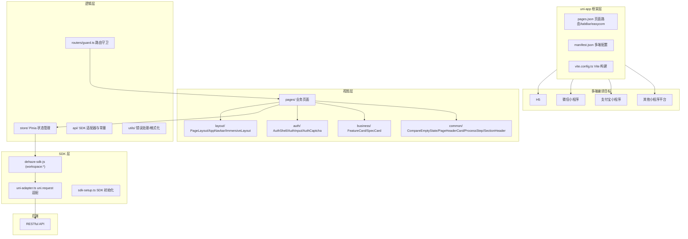

# Uniapp 多端 (dehaze-uniapp)

基于 uni-app (Vue 3 + Vite) 构建的多端图像去雾应用，一份代码可编译到 H5、微信小程序、支付宝小程序、抖音小程序、快手小程序等 15+ 个平台。

> 构建运行、测试命令、部署说明见项目根目录 [README](/README.md)。

## 1. 架构图



## 2. 项目结构

```
dehaze-uniapp/
├── vite.config.ts                 # Vite 构建配置
├── tsconfig.json                  # TypeScript 配置
├── eslint.config.mjs              # ESLint 配置
├── package.json
├── index.html                     # H5 入口 HTML
├── src/
│   ├── main.ts                    # 应用入口（createSSRApp + Pinia + SDK 初始化）
│   ├── App.vue                    # 根组件
│   ├── pages.json                 # 页面路由、tabBar、easycom（单一路由来源）
│   ├── manifest.json              # 多端打包配置
│   ├── uni.scss                   # uni-app 全局 SCSS 变量入口
│   ├── api/                       # SDK 适配层
│   │   ├── sdk-setup.ts           # SDK 初始化（token/request adapter/baseURL）
│   │   ├── uni-adapter.ts         # uni.request → SDK request adapter
│   │   ├── constants.ts           # API 常量（SESSION_INVALID_EVENT 等）
│   │   └── file.ts                # 文件上传封装
│   ├── components/                # 通用组件
│   │   ├── auth/                  # AuthShell / AuthInput / AuthCaptcha
│   │   ├── business/              # FeatureCard / SpecCard
│   │   └── common/                # CompareEmptyState / PageHeaderCard / ProcessStep / SectionHeader
│   ├── layout/                    # 布局组件
│   │   ├── index.vue              # PageLayout（L1/L2/L3 层级路由布局）
│   │   ├── Navbar.vue             # AppNavbar 导航栏（L1/L2 差异化）
│   │   └── ImmersiveLayout.vue    # L3 沉浸页骨架
│   ├── pages/                     # 业务页面（按视角拆分，详见 §4）
│   │   ├── home/                  # 首页（L1 Tab：品牌 Hero + 快捷入口 + 数据统计 + 特色能力）
│   │   ├── tools/                 # 工具（L1 Tab：页内搜索 + 快捷入口横滑 + 功能网格）
│   │   ├── dehaze/                # 去雾（L1 Tab：步骤流引导 上传→算法→参数→处理→对比）
│   │   ├── messages/              # 消息（L1 Tab：消息列表 + 分类 + 未读角标 + 设置入口）
│   │   ├── profile/               # 我的（L1 Tab：用户卡 + VIP 横幅 + 数据统计 + 四组入口）
│   │   ├── login/                 # 登录（L0 认证页，AuthShell/AuthInput/AuthCaptcha）
│   │   ├── register/              # 注册（L0 认证页）
│   │   ├── image-input/           # 图像输入（上传/拍照/样例/历史 4 Tab）
│   │   ├── algorithm-select/      # 算法选择（带入去雾流程，RecommendationAPI.analyze）
│   │   ├── processing/            # 去雾处理（实时进度，ModelAPI.predictAndWait）
│   │   ├── algorithm/             # 算法库浏览（个人视角：列表 + 推荐 + 详情 + "使用该算法"）
│   │   ├── dataset/               # 数据集浏览（个人视角：公开/共享浏览 + 图片网格）
│   │   ├── task-history/          # 处理历史（个人视角，TaskAPI.getPage）
│   │   ├── file-manage/           # 文件管理
│   │   ├── batch/                 # 批量处理（批量上传 ≤20 张 + 进度 + 结果对比）
│   │   ├── metrics-manage/        # 指标管理（评估指标历史查询/筛选/对比）
│   │   ├── notify/                # 消息设置（NotificationSettingAPI）
│   │   ├── side-by-side/          # 并排对比（L3 沉浸页）
│   │   ├── overlay/               # 叠加对比（L3 沉浸页）
│   │   ├── metrics/               # 指标对比（L3 沉浸页）
│   │   ├── magnifier/             # 放大镜对比（L3 沉浸页）
│   │   ├── filter/                # 滤镜对比（L3 沉浸页）
│   │   ├── personal/              # 个人侧页面（我的会员/套餐/订单/文件/额度/设置等）
│   │   ├── system/                # 管理模块（用户/角色/字典/菜单/部门/算法/数据集/任务/会员/套餐/订单/反馈/消息/推荐）
│   │   └── dashboard/             # 管理入口工作台
│   ├── routers/                   # 路由守卫
│   │   └── guard.ts               # 登录拦截 + 白名单 + 路由常量
│   ├── store/                     # Pinia 状态管理
│   │   ├── auth.ts                # 认证 store（登录/注册/登出/hasPerm/hasRole）
│   │   └── processing.ts          # 处理 store（任务状态）
│   ├── styles/                    # 全局样式
│   │   └── variables.scss         # 设计令牌（颜色/间距/圆角/字号/阴影/安全区域）
│   ├── utils/                     # 工具函数
│   │   ├── error.ts               # 错误处理
│   │   └── format.ts              # 格式化
│   └── types/                     # TypeScript 类型定义
└── dist/                          # 构建产物
```

## 3. 页面层级与布局体系

页面按《移动端界面设计规范》分为四个层级，每级对应不同的导航形态：

| 层级 | 导航形态 | 典型页面 | 布局组件 |
|------|---------|---------|---------|
| L0 | 无导航栏，无 TabBar | 登录、注册 | 页面自身 |
| L1 | 顶部标题栏 + 底部 TabBar | 首页、工具、去雾、消息、我的 | PageLayout（level="L1"） |
| L2 | 顶部导航栏（返回+标题+操作区），无 TabBar | 图像输入、算法选择、处理、个人侧页面、管理页面 | PageLayout（level="L2"） |
| L3 | 深色沉浸导航栏 + 底部工具栏，全屏内容 | 并排对比、叠加对比、放大镜、滤镜、指标对比 | ImmersiveLayout |

所有页面统一设置 `navigationStyle: "custom"`，由项目自定义导航栏组件接管顶部区域，不依赖系统原生导航栏。

### 3.1 PageLayout

通用页面布局组件（`src/layout/index.vue`），根据 `level` 属性决定导航形态：

- **L1**：渲染 AppNavbar（品牌标题栏），内容区预留原生 TabBar 底部安全高度
- **L2**：渲染 AppNavbar（返回按钮 + 居中标题 + `#navbar-actions` 右侧操作区），内容区全高
- **L3**：不渲染 AppNavbar，由 ImmersiveLayout 接管

透传 `isHome` / `showSearch` / `title` props 到 AppNavbar，实现差异化品牌展示。

### 3.2 AppNavbar

顶部导航栏组件（`src/layout/Navbar.vue`），通过 `level` 和 `isHome` 属性差异化渲染：

- **L1 首页**：品牌渐变 logo（photo-fill 图标）+ 应用标题 + 右侧搜索按钮（`showSearch` 控制）
- **L1 非首页**：仅 Tab 标题（居左），无品牌 logo
- **L2**：左侧返回按钮 + 居中页面标题 + 右侧 `#actions` 插槽（自定义操作区）
- 状态栏高度自适应：通过 `uni.getSystemInfoSync().statusBarHeight` 动态获取并设置占位高度
- 返回逻辑：有页面历史时 `uni.navigateBack`，无历史时回首页 Tab

### 3.3 ImmersiveLayout

L3 沉浸页统一骨架（`src/layout/ImmersiveLayout.vue`），提供三区域插槽：

- **顶部**：深色半透明渐变导航栏（返回按钮 + 居中标题 + `#actions` 插槽），黑色背景
- **底部**：深色工具栏（`#toolbar` 插槽，仅当有内容时渲染）
- **内容区**：全屏沉浸，无全局导航，黑色背景

不预设业务逻辑，5 个对比页（side-by-side / overlay / magnifier / filter / metrics）统一迁移至此骨架。

### 3.4 路由导航方式

| 场景 | 方法 | 说明 |
|------|------|------|
| Tab 间切换 | `uni.switchTab` | L1 五个 Tab 页互相跳转 |
| L2 页面跳转 | `uni.navigateTo` | 压栈式跳转，保留返回路径 |
| 页面返回 | `uni.navigateBack` | 出栈返回上一页 |
| 登录重定向 | `uni.reLaunch` | 路由守卫拦截时清空页面栈并跳转登录 |

### 3.5 rpx 单位规范

全局样式采用 rpx 单位（750 设计稿基准），`src/styles/variables.scss` 中所有间距、圆角、字号、阴影变量全部使用 rpx。仅 `@media` 断点和 1px 边框保留 px，禁止 px/rpx 混用。

## 4. 完整页面清单

### 4.1 L0 认证页

| 页面路径 | 功能 |
|---------|------|
| pages/login/index | 登录（AuthShell + AuthInput + AuthCaptcha 组件） |
| pages/register/index | 注册 |

### 4.2 L1 Tab 根页面（底部 TabBar）

| Tab | 页面路径 | 功能要点 |
|-----|---------|---------|
| 首页 | pages/home/index | 品牌 Hero + 快捷入口 + 数据统计 + 特色能力（融合设计稿保留 8 区块） |
| 工具 | pages/tools/index | 页内搜索 + 快捷入口横滑 + 功能网格 ≤3 列，接入真实跳转 |
| 去雾 | pages/dehaze/index | 步骤流 5 步：上传 → 算法 → 参数 → 处理 → 对比入口 |
| 消息 | pages/messages/index | 消息列表 + 分类筛选（全部/系统/处理/活动）+ 未读角标 + 设置入口 |
| 我的 | pages/profile/index | 用户卡 + VIP 横幅 + 数据统计 + 四组入口（个人数据/商业服务/其他/管理入口）+ 退出 |

### 4.3 L2 工具/业务页面

| 页面路径 | 功能 | 对接 API |
|---------|------|---------|
| pages/image-input/index | 图像输入：上传/拍照/样例/历史 4 Tab | — |
| pages/algorithm-select/index | 算法选择，带入去雾流程 | RecommendationAPI.analyze |
| pages/processing/index | 去雾处理，实时进度 | ModelAPI.predictAndWait |
| pages/algorithm/index | 算法库浏览：列表 + 智能推荐 + 详情弹层 + "使用该算法"带入流程 | — |
| pages/dataset/index | 数据集浏览：公开/共享浏览 + 图片网格 | — |
| pages/batch/index | 批量处理：批量上传 ≤20 张 + 批量进度 + 结果对比 | ModelAPI.batchPredict |
| pages/metrics-manage/index | 指标管理：评估指标历史查询/筛选/对比 | ModelAPI.getEvalMetrics / getEvalLogs |
| pages/task-history/index | 处理历史（个人视角） | TaskAPI.getPage |
| pages/file-manage/index | 文件管理 | — |
| pages/notify/index | 消息设置：通知开关/免打扰时段 | NotificationSettingAPI.get / update |
| pages/messages/detail/index | 消息详情（L2） | — |

### 4.4 L2 个人侧页面（pages/personal/）

归入"我的"页面底部个人数据/商业服务/其他入口组：

| 页面路径 | 功能 | 对接 API |
|---------|------|---------|
| pages/personal/files/index | 我的文件 | — |
| pages/personal/orders/index | 我的订单 | OrderAPI.listMy |
| pages/personal/quota/index | 我的额度 | ModelAPI.getQuota |
| pages/personal/member/index | 我的会员 | MemberAPI.getProfile |
| pages/personal/package/index | 我的套餐 | PackageAPI.listOnSale |
| pages/personal/feedback/index | 反馈评价（双 Tab：我的反馈/我的评价） | — |
| pages/personal/favorites/index | 我的收藏 | FavoriteAPI.getPage |
| pages/personal/settings/index | 系统设置 | — |
| pages/personal/help/index | 帮助中心（FAQ） | — |
| pages/personal/about/index | 关于我们 | — |

### 4.5 L3 沉浸对比页

均使用 ImmersiveLayout 骨架：

| 页面路径 | 功能 |
|---------|------|
| pages/side-by-side/index | 并排对比 |
| pages/overlay/index | 叠加对比 |
| pages/metrics/index | 指标对比模式 |
| pages/magnifier/index | 放大镜对比 |
| pages/filter/index | 滤镜对比 |

### 4.6 管理模块（pages/system/）

归入"我的"页面底部管理入口组，受权限过滤（无 `sys:module:*` 权限的用户整组不显示）。

**管理入口工作台**：

| 页面路径 | 功能 |
|---------|------|
| pages/dashboard/index | 工作台（管理入口组顶部） |

**管理子模块**：

| 页面路径 | 功能 | 权限码 |
|---------|------|-------|
| pages/system/user/index + detail | 用户管理 | sys:user:* |
| pages/system/role/index + detail + permission | 角色管理 | sys:role:* |
| pages/system/dict/index + items | 字典管理 | sys:dict:* |
| pages/system/menu/index | 菜单管理 | sys:menu:* |
| pages/system/dept/index | 部门管理 | sys:dept:* |
| pages/system/algorithm/index | 算法管理（审核上下架） | sys:algorithm:* |
| pages/system/dataset/index | 数据集管理（CRUD） | sys:dataset:* |
| pages/system/task/index | 任务管理（全用户视角） | sys:task:* |
| pages/system/member/index + detail | 会员管理 | sys:member:* |
| pages/system/package/index | 套餐管理（CRUD/上下架） | sys:package:* |
| pages/system/order/index + detail | 订单管理（后台列表/退款审核/统计） | sys:order:* |
| pages/system/feedback/index + detail | 反馈评价管理 | sys:feedback:* |
| pages/system/message/index | 消息管理（公告/模板/群发） | sys:notify:* |
| pages/system/recommend/index | 推荐管理（规则编辑） | sys:recommendation:* |

## 5. 视角拆分

以下模块从"个人+管理混用"严格拆分为两套独立页面，杜绝条件渲染混用：

| 业务域 | 个人视角页面 | 管理视角页面 |
|--------|-------------|-------------|
| 算法 | pages/algorithm（算法库浏览） | pages/system/algorithm（审核上下架） |
| 数据集 | pages/dataset（公开/共享浏览） | pages/system/dataset（CRUD） |
| 会员 | pages/personal/member（我的会员） | pages/system/member（会员管理） |
| 套餐 | pages/personal/package（我的套餐） | pages/system/package（套餐管理） |
| 反馈 | pages/personal/feedback（反馈评价） | pages/system/feedback（反馈评价管理） |
| 推荐 | —（无个人视角） | pages/system/recommend（推荐管理） |
| 任务 | pages/task-history（个人处理历史） | pages/system/task（全用户管理） |
| 订单 | pages/personal/orders（我的订单） | pages/system/order（订单管理） |
| 消息 | pages/messages（消息列表）+ pages/notify（消息设置） | pages/system/message（消息管理） |

### 5.1 user-center → profile 重命名

原第 5 Tab "我的"路径 `pages/user-center/index` 统一改为 `pages/profile/index`，涉及：
- `pages.json` 中 pages 数组路径 + tabBar `list[4].pagePath`
- 目录从 `pages/user-center/` 迁移至 `pages/profile/`
- 全局所有引用该路径的跳转代码同步更新

tabBar 图标 `profile.png` / `profile-active.png` 保持不变。

## 6. 权限模型

管理模块采用 Pinia auth store 的 `hasPerm` / `hasRole` 方法实现权限判断。权限标识格式为 `sys:模块:*`，各模块对应权限码如下：

| 权限码 | 模块 |
|--------|------|
| sys:user:* | 用户管理 |
| sys:role:* | 角色管理 |
| sys:dict:* | 字典管理 |
| sys:menu:* | 菜单管理 |
| sys:dept:* | 部门管理 |
| sys:algorithm:* | 算法管理 |
| sys:dataset:* | 数据集管理 |
| sys:task:* | 任务管理 |
| sys:member:* | 会员管理 |
| sys:package:* | 套餐管理 |
| sys:order:* | 订单管理 |
| sys:feedback:* | 反馈评价管理 |
| sys:notify:* | 消息管理 |
| sys:recommendation:* | 推荐管理 |

权限判断基于 `AuthAPI.getCurrentUser()` 返回的 `perms` 数组，通过 `authStore.hasPerm('sys:user:*')` 进行页面级或操作级判断。无 `sys:module:*` 权限的用户，管理入口组整组不显示。

### 6.1 路由守卫

`src/routers/guard.ts` 通过 `uni.addInterceptor` 拦截 `navigateTo` / `redirectTo` / `reLaunch` / `switchTab` 四种跳转方法，实现未登录拦截：

- **白名单**：`pages/login/index`、`pages/register/index`、`pages/home/index` 无需登录即可访问
- **拦截逻辑**：非白名单页面且无有效 session 时，自动 `reLaunch` 到登录页
- **初始检查**：应用首启时调用 `checkInitialAuth()` 显式检查当前页是否需要登录（首页不经拦截器触发）

## 7. 设计稿还原策略

本次改造对齐《移动端界面设计规范》与 dehaze-mobile 设计稿，采用差异化还原策略：

| 页面 | 策略 | 说明 |
|------|------|------|
| 首页（home） | 融合策略 | 保留现有 8 区块丰富度，仅做品牌显示优化与跳转修正，不照搬设计稿 |
| 工具/去雾/消息/我的 | 重构策略 | 按设计稿（tools-v2/dehaze-flow/messages/profile.html）重构布局与交互 |
| 登录/注册 | 视觉对齐 | 已有 AuthShell 组件视觉已对齐设计稿，无需修改 |

全局约束：
- 复用 `variables.scss` 令牌（`$color-*` / `$spacing-*` / `$radius-*` / `$font-*` / `$shadow-*`），不引入设计稿 `--dehaze-*` token
- 排除设计稿元信息（交互说明、占位文本、注释框）

## 8. 防迷失设计

- **主入口唯一**：首页、工具快捷区仅作引用跳转，不重复实现功能
- **管理功能不裸露**：管理入口统一归入"我的"页面底部管理入口组，受权限过滤
- **主链路 ≤2 步**：工具选图/选算法通过"开始去雾/使用该算法"直接带入去雾处理流程
- **带入衔接**：工具页与算法浏览页通过明确的操作按钮将用户带入去雾处理流程
- **返回路径完整**：所有 L2 页面通过 AppNavbar 返回按钮返回，所有 L3 页面通过 ImmersiveLayout 内置返回按钮返回

## 9. 核心功能

- Session 认证：登录/注册/权限校验，基于 Pinia auth store + `dehaze-sdk-js` AuthAPI
- 首页展示：品牌 Hero、快捷入口、数据统计、特色能力（融合设计稿保留 8 区块）
- 图像输入：本地上传、相机拍照、样张画廊、历史记录
- 算法选择：算法列表、参数配置、算法说明、智能推荐
- 去雾处理：实时进度、结果预览、参数调节
- 效果对比：并排对比、叠加对比、放大镜、滤镜、指标评估（均使用 ImmersiveLayout 骨架）
- 批量处理：批量上传（≤20 张）、批量进度、结果对比/下载
- 指标管理：评估指标历史查询、筛选、对比
- 收藏管理：跨模块统一收藏、"我的收藏"聚合页
- 推荐管理：算法推荐展示、推荐理由、一键使用（个人）+ 规则编辑（管理）
- 数据集：公开/共享浏览 + 图片网格（个人）+ CRUD（管理）
- 消息系统：消息列表 + 分类筛选 + 未读角标 + 消息设置 + 公告/模板/群发（管理）
- 系统管理：用户、部门、角色、菜单、字典、算法审核、数据集管理、任务管理、会员管理、套餐管理、订单管理、反馈管理、消息管理、推荐管理

## 10. 关键技术决策

| 决策 | 选择 | 理由 |
|------|------|------|
| 跨端框架 | uni-app (Vue 3) + Vite | 一份代码编译 H5 / 微信 / 支付宝 / 抖音 / 快手等 15+ 平台 |
| UI 框架 | Vue 3 `<script setup>` SFC + TypeScript | Composition API 类型安全，代码组织清晰 |
| UI 组件库 | 自建业务组件 + SvgIcon（vite-plugin-svg-icons） | 已移除 uview-plus，仅保留业务自建组件；图标走本地 svg sprite（`src/assets/icons/`），按需引入零冗余 |
| 状态管理 | Pinia | Vue 3 官方推荐，模块化 store，支持 SSR |
| 样式方案 | SCSS + variables.scss 全局令牌 | 统一的颜色/间距/圆角/字号/阴影变量，保证视觉一致性 |
| 样式单位 | rpx（750 设计稿基准） | uni-app 原生响应式单位，多端自适应 |
| 布局体系 | PageLayout（L0-L3）+ ImmersiveLayout（L3） | 按层级差异化导航，沉浸页统一骨架，避免页面重复实现导航逻辑 |
| 路由配置 | pages.json 单一来源 | uni-app 标准路由配置，集中管理页面路径/tabBar/easycom |
| 权限控制 | Pinia auth store（hasPerm/hasRole） | 页面级和操作级权限判断，管理入口组整体过滤 |
| 视角拆分 | 个人/管理严格分离为独立页面 | 避免条件渲染混乱，职责清晰，代码可维护 |
| 网络层 | dehaze-sdk-js + uni-adapter | 通过 uni.request 适配器接入 SDK，禁止直接 axios/fetch |
| 路由守卫 | uni.addInterceptor 拦截 + 白名单 | 轻量级未登录拦截，无需引入额外路由库 |
| 组件导入 | easycom 自动导入 | u-* / up-* 组件和 App* 前缀组件按需自动导入，无需手动注册 |

## 11. 多端适配

- 移动端竖屏优化，适配手机和平板
- H5、微信小程序、支付宝小程序、百度小程序、抖音小程序、快手小程序等 15+ 平台编译
- 通过 `pages.json` 和 `manifest.json` 配置各端差异
- 5 个 L1 Tab：首页、工具、去雾、消息、我的（通过原生 tabBar 实现）
- 状态栏高度通过 `uni.getSystemInfoSync().statusBarHeight` 动态适配各端差异
