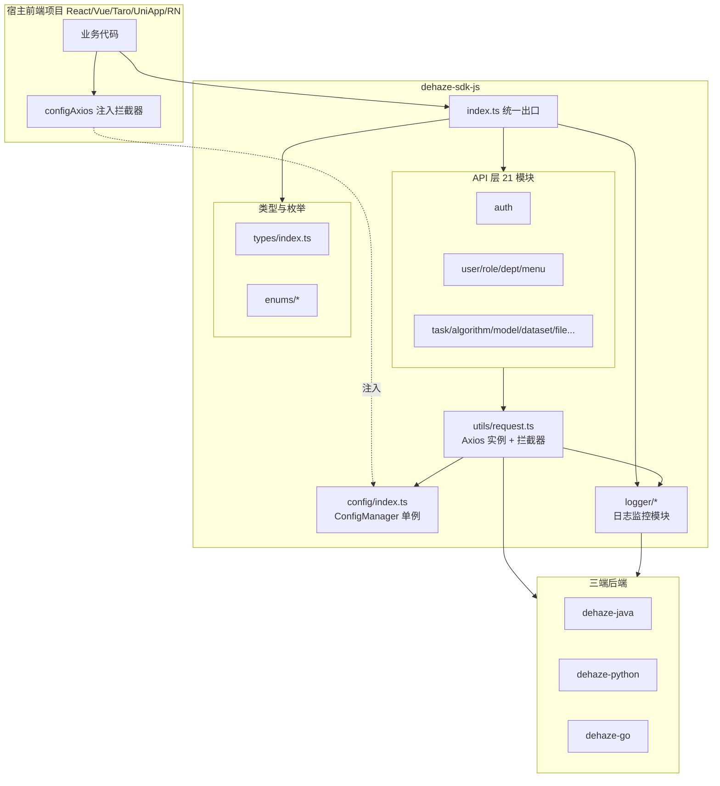

# JS SDK 架构文档

## 1. 文档概述

本文档描述 `dehaze-sdk-js` 的宏观架构与核心技术决策。`dehaze-sdk-js` 是面向 Web/React/Vue/Taro/UniApp/React Native 共用一套的 TypeScript SDK，封装 21 个业务 API 模块、Axios 请求基础设施、前端日志监控（Logger）与运行时配置注入机制，作为各前端项目与三端后端（Java/Python/Go）之间的统一接入层。

### 1.1 相关文档

- 日志架构契约：[02-系统架构/07-日志架构设计.md](../../02-系统架构/07-日志架构设计.md) §3.5（接收链路、字段 schema、采样限流）
- API 规范：[02-系统架构/04-API规范.md](../../02-系统架构/04-API规范.md)
- 各模块 API 契约：`03-模块设计/[模块]/API接口.md`

---

## 2. 架构总览



SDK 自上而下分为四层：

| 层 | 职责 | 关键文件 |
|----|------|---------|
| 出口层 | 统一导出 API 类、Logger、类型、配置函数、Axios 实例 | [index.ts](file:///e:/DehazeSystem/dehaze-sdk-js/index.ts) |
| API 层 | 21 个业务模块，每个模块封装一组 RESTful 接口 | `src/api/[模块]/index.ts`、`model.ts` |
| 基础设施层 | Axios 实例与请求/响应拦截器、trace_id 透传、慢请求/错误自动上报 | `src/utils/request.ts`、`src/config/index.ts` |
| 监控层 | 多 transport 日志、全局错误捕获、Web Vitals 采集 | `src/logger/*` |

### 2.1 关键技术决策

| 决策 | 选型 | 理由 |
|------|------|------|
| 单 SDK 多端共用 | 一份 TypeScript 源码覆盖 Web/React/Vue/Taro/UniApp/RN | 业务 API 契约与三端后端一一对应，避免每端重复封装；多端差异通过运行时探测降级 |
| HTTP 客户端 | Axios（`peerDependencies`） | 宿主项目已引入，避免重复打包；通过导出 `service` 实例支持宿主自定义 adapter |
| 环境隔离策略 | SDK 不感知 dev/prod | transports 由应用端按构建产物组装，SDK 不内建环境判断，保持纯粹 |
| 拦截器扩展点 | `configAxios(callback)` 注入宿主拦截器 | SDK 内建拦截器（trace_id/错误上报）不可替换，宿主通过回调追加鉴权、loading 等业务逻辑 |
| React 依赖 | SDK 不声明 react 依赖，宿主注入 | 避免多 React 实例冲突，ErrorBoundary 在未注入 React 时降级为透传 children |
| 构建产物 | tsup 双格式 ESM + CJS | 同时支持现代 bundler 与 CommonJS 消费场景 |

---

## 3. 目录结构

```
dehaze-sdk-js/
├── index.ts                  # 统一出口：导出 API 类、Logger、类型、配置、Axios 实例
├── src/
│   ├── api/                  # 业务 API 层（21 模块，每模块 index.ts + model.ts）
│   │   ├── auth/             # 认证：登录/注册/登出/当前用户/验证码
│   │   ├── user/             # 用户管理
│   │   ├── role/             # 角色管理
│   │   ├── dept/             # 部门管理
│   │   ├── menu/             # 菜单管理
│   │   ├── dict/             # 字典管理
│   │   ├── task/             # 去雾处理任务
│   │   ├── algorithm/        # 算法管理
│   │   ├── model/            # 模型管理
│   │   ├── dataset/          # 数据集管理（含 DatasetItem、ItemFile）
│   │   ├── file/             # 文件管理
│   │   ├── image-input/      # 图像输入历史
│   │   ├── import-export/    # 导入导出
│   │   ├── favorite/         # 收藏管理
│   │   ├── recommendation/   # 算法推荐
│   │   ├── feedback/         # 反馈管理
│   │   ├── message/          # 消息（含 Announcement/Template/NotificationSetting）
│   │   ├── member/           # 会员管理
│   │   ├── order/            # 订单管理
│   │   ├── package/          # 套餐管理（含 Coupon）
│   │   └── api-key/          # API Key 管理
│   ├── config/               # ConfigManager 单例：宿主拦截器注入入口
│   ├── enums/                # 公共枚举（CacheEnum/MenuTypeEnum/ResultEnum）
│   ├── logger/               # 日志监控模块（详见 §5）
│   ├── types/                # 跨模块公共类型（如 ResponseData）
│   └── utils/
│       └── request.ts        # Axios 实例 + 请求/响应拦截器
├── test/                     # 测试（详见 §7）
├── tsup.config.ts            # 构建配置
├── vitest.config.ts          # 集成测试配置（默认连 Java 后端）
└── vitest.unit.config.ts     # 单元测试配置（无后端依赖）
```

### 3.1 API 模块组织约定

每个业务模块遵循统一结构：

| 文件 | 职责 |
|------|------|
| `index.ts` | 导出该模块的 API 类，静态方法封装单条接口调用，统一走 `request()` 发起请求 |
| `model.ts` | 该模块的请求/响应 TypeScript 类型定义 |

API 类采用静态方法风格（如 `AuthAPI.login(data)`、`UserAPI.list(params)`），方法返回 `Promise<响应数据>`，响应拦截器已解包 `Result<T>.data`，业务码非成功时 reject 为 `AxiosError`。

---

## 4. 基础设施层

### 4.1 Axios 实例与拦截器

`service` 为预配置的 Axios 实例（`baseURL` 空、`timeout` 120s、`withCredentials`），通过 `index.ts` 导出供宿主直接使用。请求/响应拦截器由 SDK 内建，承载三类横切逻辑：

| 拦截器 | 时机 | 职责 |
|--------|------|------|
| 请求拦截器 1 | 请求最前 | 记录 `startTime` 到 `config.metadata`，供错误/慢请求计算耗时 |
| 请求拦截器 2 | 出站前 | 调 `Logger.ensureTraceId()` 生成/复用 trace_id 写入 `X-Trace-Id` 头；调宿主 `onRequest` |
| 响应拦截器 | 成功路径 | 回读响应头 `X-Trace-Id` 对齐本地 trace_id；慢请求（>3s）WARN 上报；解包 `Result.data`；二进制响应特殊处理（Blob/arraybuffer 携带 JSON 错误体时转 reject） |
| 响应拦截器 | 失败路径 | 回读失败响应头对齐 trace_id；构造 API 错误日志（method/path/status/duration/code）ERROR 上报；调宿主 `onResponseError` |

**响应解包约定**：业务码 `code !== SUCCESS` 时统一 reject 为 `AxiosError`（携带后端 `msg`），宿主只需 `try/catch` 处理错误，无需重复判断 `code`。

### 4.2 配置注入机制

`configAxios(callback)` 是宿主扩展 SDK 请求行为的唯一入口，通过 `ConfigManager` 单例持有回调。宿主可注入四类回调：

| 回调 | 时机 | 典型用途 |
|------|------|---------|
| `onRequest` | SDK 内建请求拦截器之后 | 追加 Authorization 头、loading 开关、参数转换 |
| `onRequestError` | 请求发出失败 | 统一请求错误预处理 |
| `onResponse` | SDK 解包之后、返回业务数据之前 | 业务数据后处理、全局错误提示 |
| `onResponseError` | 响应拦截器失败路径 | 全局错误提示、401 跳转登录 |

宿主拦截器与 SDK 内建拦截器为**追加**关系，SDK 不允许替换 trace_id 注入与错误上报逻辑，保证监控链路完整性。

---

## 5. 日志监控模块（Logger）

### 5.1 模块结构

日志模块位于 `src/logger/`，是 SDK 监控层的核心：

| 文件 | 职责 |
|------|------|
| `Logger.ts` | Logger 单例：日志组装、采样限流、队列管理、多 transport 分发、trace_id 生成与请求上下文管理（`ensureTraceId` / `alignTraceId` / `getTraceId`） |
| `transports.ts` | `ConsoleTransport`（逐条 console 输出，不受采样影响）/ `RemoteTransport`（批量 `POST /api/v1/logs/client`） |
| `ErrorBoundary.ts` | React 错误边界工厂（依赖宿主注入的 React 实例），捕获渲染异常以 ERROR 上报 |
| `performance.ts` | Web Vitals 性能采集（LCP/INP/CLS、页面加载 FP/FCP/TTFB、长任务、资源错误、SPA 路由切换） |
| `env.ts` | 运行环境探测（`isBrowser` / `isRN`），支撑 Web/RN/小程序多端降级（RN 无 DOM API，不能用 `typeof window` 判断） |
| `types.ts` | `LogEntry` 字段 schema、`LogTransport` 接口、`InstallConfig` 配置类型 |

### 5.2 设计原则

| 原则 | 说明 |
|------|------|
| 多 transport | Logger 单例按需组装 transport（Console / Remote），SDK 不感知 dev/prod，由应用端按构建产物组装 |
| trace_id 透传 | 请求拦截器注入 `X-Trace-Id`，响应拦截器回读对齐，与后端端到端串联 |
| 采样限流 | ERROR 100% / WARN 50% / INFO 不上报；单设备 60s 内最多 20 条（参数见 [07-日志架构设计.md §3.5.4](../../02-系统架构/07-日志架构设计.md)） |
| ERROR 去重 | 相同 `message + error_stack` fingerprint 在 10s 窗口内只记录一次，防止渲染错误每帧触发日志风暴 |
| 不暴露 user_id | 前端 SDK 不上报 `user_id`，由三端后端从会话统一解析注入（避免前端伪造身份） |
| 崩溃补报 | 生产环境 Remote + 本地存储双写，刷新/重启后从本地队列恢复补报 |

### 5.3 核心行为

- **全局错误捕获**：`window.onerror`（js / 资源 resource）、`unhandledrejection`（promise）、`online`（网络恢复补报）。
- **批量上报**：队列满 10 条立即上报；30s 定时器；`online` 事件触发。失败指数退避重试（1s → … → 最长 60s）。
- **离线缓存**：`localStorage` key=`dehaze_logs`，队列上限 100 条（超出丢弃最旧），刷新后 `loadQueue` 恢复。
- **性能采集**：`PerformanceObserver` 不存在的环境（部分小程序/RN）降级跳过，由各端在平台层实现等价采集。

### 5.4 对外 API 契约

`index.ts` 导出的日志相关符号：

| 导出 | 类型 | 用途 |
|------|------|------|
| `Logger` | 类 | `Logger.install(config)` 安装单例，返回 Logger 实例 |
| `ConsoleTransport` / `RemoteTransport` | 类 | transport 实现，应用端按需组装 |
| `ErrorBoundary` | 函数 | React 错误边界组件，依赖 `Logger.install({ react })` 注入的 React 实例；未注入时直接渲染 children |
| `bindReact` | 函数 | 显式绑定 React 实例（替代 install 时注入） |
| `generateTraceId` / `getCurrentTraceId` / `setCurrentTraceId` | 函数 | trace_id 工具，供非 SDK 请求链路手动管理 |
| `defaultStorage` | 函数 | 默认存储适配器（Web 用 localStorage） |
| `LogEntry` / `LogLevel` / `LoggerStorage` / `LogTransport` / `InstallConfig` | 类型 | 日志相关类型 |

`Logger.install(config)` 参数：

| 参数 | 类型 | 说明 |
|------|------|------|
| `app` | string | 前端项目标识：react/vue/taro/uniapp/rn |
| `appVersion?` | string | 应用版本号，构建时注入 |
| `transports?` | LogTransport[] | transport 列表，缺省仅 `ConsoleTransport` |
| `storage?` | LoggerStorage | 自定义存储，缺省用 localStorage |
| `react?` | unknown | React 实例（ErrorBoundary 依赖） |
| `rateLimitMax?` | number | 单设备限流窗口内最大上报条数，默认 20 |
| `rateLimitWindowMs?` | number | 限流窗口毫秒，默认 60000 |

错误日志字段：`error_type`（js/promise/api/resource）、`error_source`、`error_stack`；API 失败日志含 `method/path/status/duration/code`；性能日志含 `metric_name/metric_value/navigation_type/resource_url`。

---

## 6. 多端兼容策略

SDK 一份源码覆盖 Web/React/Vue/Taro/UniApp/RN，差异通过运行时探测降级，不引入条件编译：

| 场景 | 适配方式 |
|------|---------|
| 环境识别 | `env.ts` 的 `isBrowser()`（window + addEventListener）/ `isRN()`（navigator.product === "ReactNative"），不用 `typeof window` 区分浏览器与 RN |
| 当前 URL | 优先 `wx.getCurrentPages()` / `uni.getCurrentPages()` 取小程序路由，降级 `window.location`，RN 返回空 |
| User-Agent | 优先 `wx/uni.getSystemInfoSync()`，降级 `navigator.userAgent`，RN 返回 "ReactNative" |
| 本地存储 | `LoggerStorage` 接口抽象，`defaultStorage()` 适配 localStorage，小程序/RN 由宿主传入等价实现 |
| 性能采集 | `PerformanceObserver` 不存在时跳过，由各端在平台层实现等价采集，字段名对齐 |
| Axios | `platform: "neutral"` 构建，RN 通过宿主自定义 adapter 适配 |

移动端原生 SDK（Flutter / Android）有独立的日志实现，行为契约与 JS SDK 对齐（采样限流、字段 schema、后端接收 API 共用），具体实现见各自架构文档：

- Flutter 端：[05-Flutter架构文档.md](./05-Flutter架构文档.md)
- Android 端：[06-Android架构文档.md](./06-Android架构文档.md)

---

## 7. 构建与测试架构

### 7.1 构建

| 项 | 配置 |
|----|------|
| 工具 | tsup（基于 esbuild） |
| 入口 | `index.ts` |
| 产物格式 | ESM + CJS 双格式（`dist/index.js` / `dist/index.cjs`） |
| 类型声明 | `dts: true` 生成 `dist/index.d.ts` |
| target | es2020 |
| external | `axios`（peerDependency，不打包） |
| platform | neutral（多端中立） |
| 路径别名 | `@` → `./src`、`#` → `./test`（esbuild alias） |

### 7.2 测试架构

测试分三层，覆盖单元、集成、跨后端验证：

| 层 | 配置 | 目录 | 用途 |
|----|------|------|------|
| 单元测试 | `vitest.unit.config.ts` | `test/unit/` | 无后端依赖，测 Logger/性能采集/环境探测等纯逻辑 |
| 集成测试 | `vitest.config.ts`（默认连 Java 后端） | `test/modules/` | 按 API 模块组织，对接真实后端验证契约 |
| 跨后端测试 | `test:java` / `test:python` / `test:go` 脚本 | 复用 `test/modules/` | 通过 `BACKEND_URL` 环境变量切换三端后端，验证 SDK 对三端一致性 |
| 集成流程测试 | `vitest.config.ts` | `test/modules/integration/` | 跨模块业务流程（核心去雾流程、收藏、推荐）端到端验证 |

测试基础设施：`test/factories/`（基于 @faker-js/faker 的测试数据工厂）、`test/utils/`（auth/cleanup/localstorage/mysql/redis 工具）、`test/resources/`（去雾测试图片：hazy/clean/model 样本）。
