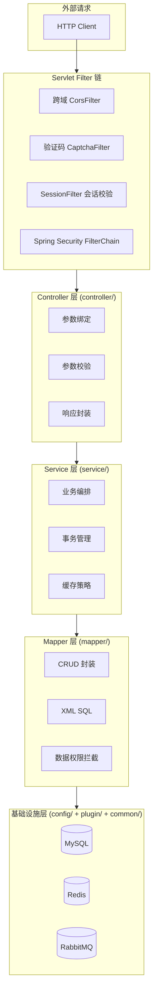
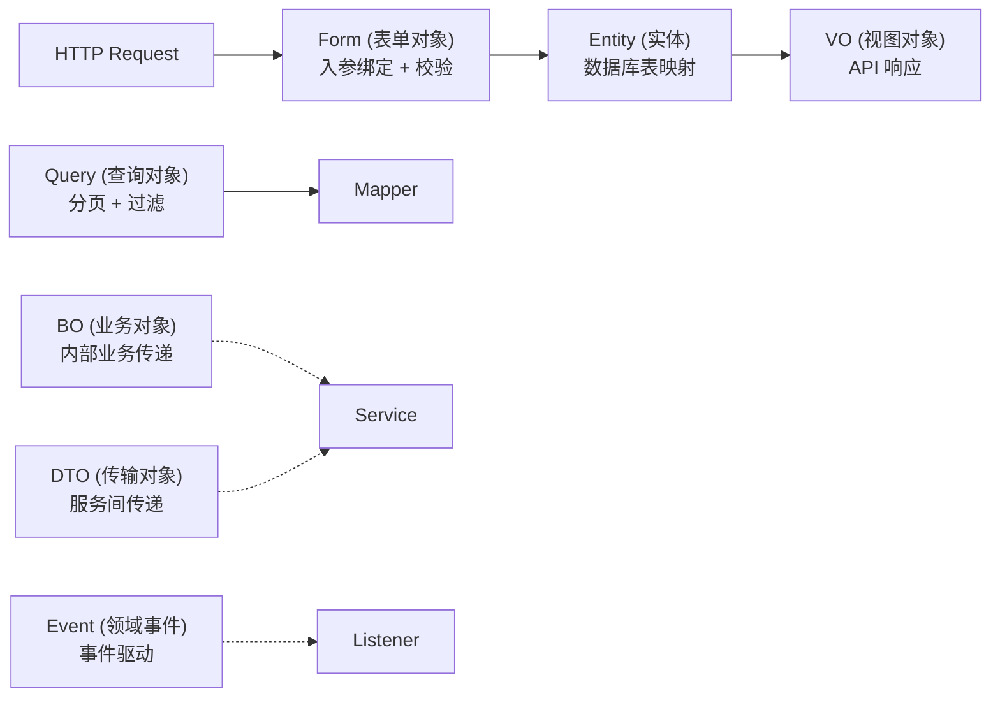
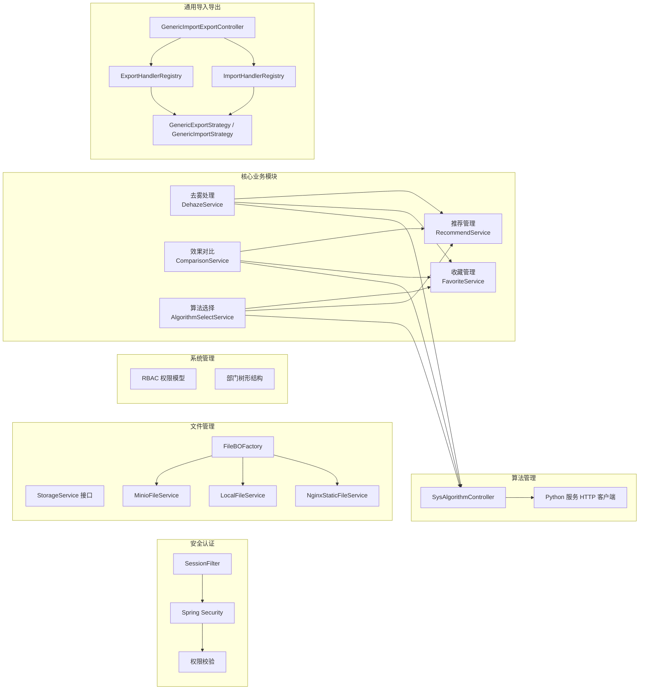
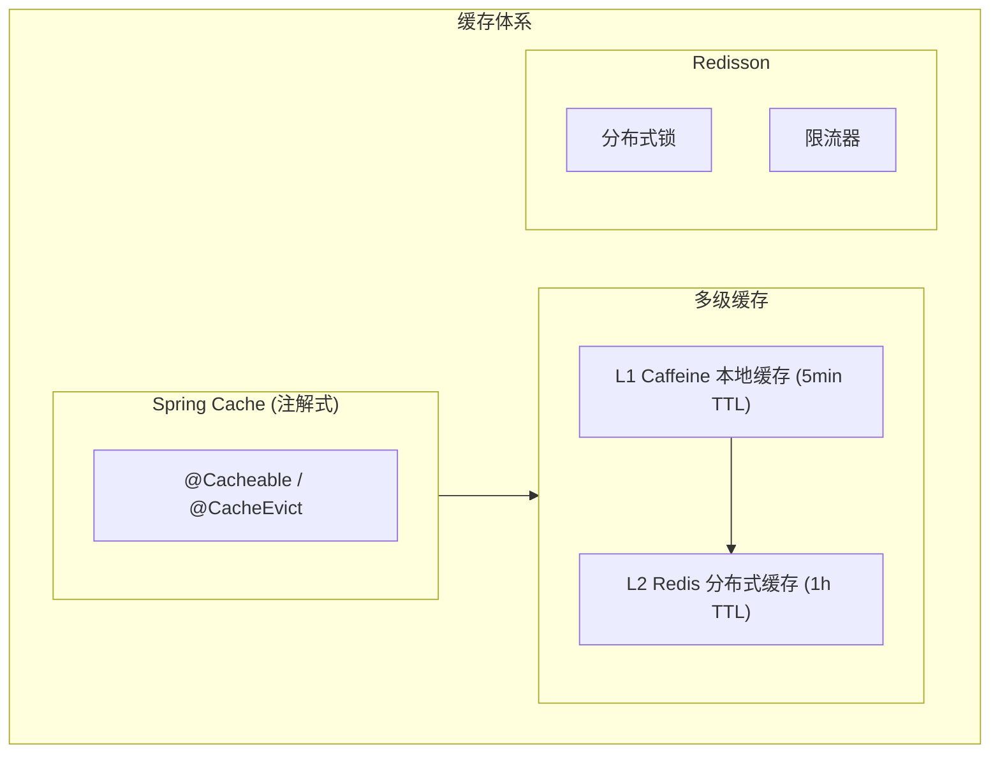
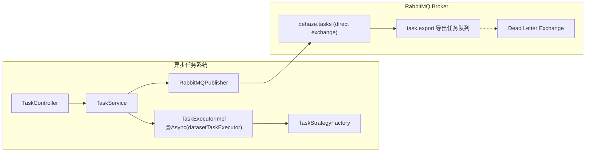
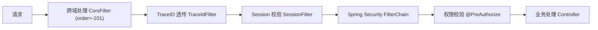
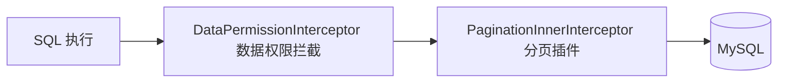
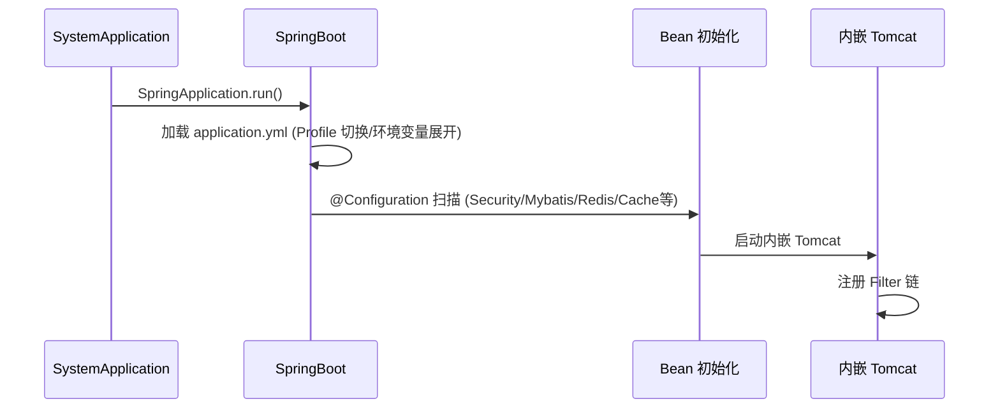

# Java 后端 (dehaze-java)

基于 JDK 17、Spring Boot 3.3、Spring Security 6、Redis、MyBatis-Plus 构建的前后端分离图像去雾系统后端，涵盖用户管理、角色管理、菜单管理、部门管理、字典管理等功能模块。

> 构建/运行/测试说明见项目根目录的 `README.md`。

## 一、分层架构



### 层级职责

| 层级 | 包路径 | 职责 | 依赖方向 |
|------|--------|------|----------|
| Filter 链 | `filter/` + Spring Security | 请求拦截、Session 校验、验证码、跨域 | 外部请求 |
| Controller 层 | `controller/` | 参数绑定与校验、调用 Service、统一响应 | -> Service |
| Service 层 | `service/` | 业务逻辑编排、事务边界、缓存交互 | -> Mapper + plugin |
| Mapper 层 | `mapper/` | 数据库 CRUD、SQL 构建、数据权限 | -> MyBatis-Plus |
| 基础设施层 | `config/` + `plugin/` + `common/` | 配置、缓存、安全、限流等基础能力 | 被所有层依赖 |

### 依赖注入策略

基于 Spring IoC 容器实现自动依赖装配：

- 使用 `@RequiredArgsConstructor` (Lombok) 生成构造函数注入，优先于字段注入
- 配置类使用 `@Configuration` + `@Bean` 显式声明基础组件
- 条件装配使用 `@ConditionalOnProperty` 控制组件按需加载（如 XXL-Job、Redis Cache）
- 属性绑定使用 `@ConfigurationProperties` + `@ConfigurationPropertiesScan`

### 数据模型分层



| 模型类型 | 包路径 | 职责 | 示例 |
|----------|--------|------|------|
| Entity | `model/entity/` | 数据库表映射，MyBatis-Plus 注解 | `SysUser` |
| Form | `model/form/` | 请求入参绑定、校验注解 | `UserForm` |
| VO | `model/vo/` | API 响应输出 | `UserPageVO` |
| Query | `model/query/` | 分页查询条件 | `UserPageQuery` |
| BO | `model/bo/` | 业务层内部传递 | `UserBO` |
| DTO | `model/dto/` | 服务间数据传输 | `LoginResult` |
| Event | `model/event/` | 领域事件载荷 | `ItemFileCreatedEvent` |

对象转换使用 MapStruct 编译期生成转换代码（`converter/` 包），避免运行时反射开销。

## 二、项目目录结构

```
dehaze-java/
├── pom.xml                             # Maven 依赖管理
├── src/
│   ├── main/
│   │   ├── java/com/pei/dehaze/
│   │   │   ├── SystemApplication.java  # SpringBoot 启动入口
│   │   │   ├── common/                 # 公共基础模块
│   │   │   │   ├── base/               # 基类（BaseEntity/BasePageQuery/IBaseEnum）
│   │   │   │   ├── constant/           # 常量定义（Security/Session/Task）
│   │   │   │   ├── enums/              # 业务枚举（状态/类型/权限范围）
│   │   │   │   ├── exception/          # 异常体系（BusinessException + 全局处理器）
│   │   │   │   ├── model/              # 公共模型（Option）
│   │   │   │   ├── result/             # 统一响应（Result/ResultCode/PageResult）
│   │   │   │   ├── util/               # 工具类（XSS/路径安全/文件/日期）
│   │   │   │   └── validator/          # 自定义校验注解
│   │   │   ├── config/                 # 配置类（Security/Mybatis/Redis/Cache/MQ/Resilience/WebSocket等）
│   │   │   ├── filter/                 # Servlet 过滤器（TraceId/RequestLog/JwtValidation）
│   │   │   ├── security/              # 安全组件（认证/授权/工具）
│   │   │   ├── mq/                     # 消息队列（RabbitMQ 生产者/消费者/DLX）
│   │   │   ├── plugin/                 # 插件化扩展组件
│   │   │   │   ├── mybatis/            # MyBatis 插件（数据权限/自动填充）
│   │   │   │   ├── dupsubmit/          # 防重复提交（AOP + Redisson）
│   │   │   │   ├── ratelimit/          # 接口限流（AOP + Redisson）
│   │   │   │   └── easyexcel/          # Excel 导入监听器
│   │   │   ├── controller/             # Controller 层
│   │   │   ├── service/                # Service 层（含 file/ 存储策略实现、strategy/ 任务策略）
│   │   │   ├── mapper/                 # Mapper 层
│   │   │   ├── converter/              # MapStruct 对象转换器
│   │   │   ├── model/                  # 数据模型（entity/bo/dto/vo/form/query/event）
│   │   │   ├── job/                    # 定时任务
│   │   │   └── listener/              # 事件监听器
│   │   └── resources/
│   │       ├── application.yml         # 主配置（profile 切换）
│   │       ├── application-dev.yml     # 开发环境
│   │       ├── application-prod.yml    # 生产环境
│   │       ├── logback-spring.xml      # 日志配置
│   │       ├── mapper/                 # MyBatis XML 映射文件
│   │       └── excel-templates/        # Excel 导入模板
│   └── test/
│       ├── java/com/pei/dehaze/
│       │   ├── base/                   # 测试基类
│       │   ├── controller/             # Controller 测试
│       │   ├── service/                # Service 测试
│       │   └── generator/              # 代码生成器
│       └── resources/                  # 测试配置（H2/TestContainers/SQL/模板）
```

## 三、核心模块



### 3.1 安全认证模块

| 组件 | 实现 | 说明 |
|------|------|------|
| Session 认证 | Redis `session:{sessionId}` | 存储 userId、username、authorities，TTL 7 天，剩余 < 24h 自动续期 |
| 密码加密 | BCryptPasswordEncoder | Spring Security 标准实现 |
| 验证码 | Hutool Captcha | 支持圆圈/GIF/干扰线/扭曲多种类型 |
| UserDetails | SysUserDetailsService | 从数据库加载用户信息 |

RBAC 权限模型：

```
用户 -> 角色（多对多） -> 权限标识（多对多）
权限格式: 模块:功能:操作（如 sys:user:add）
```

三层安全防护：SessionFilter 会话校验 -> Redis 权限校验 -> 方法级 @PreAuthorize + @DataPermission 注解。

权限缓存以逐角色独立 Key 存储：`role:perms:{roleCode}`，值为纯 JSON 字符串数组，使用 StringRedisTemplate 读写，三端（Java/Go/Python）格式统一。

### 3.2 文件管理模块

策略模式适配多存储后端（minio/local/nginx-static）：

- `sys_file` 表只存 `object_name` + `storage`（与环境无关）
- URL 运行时拼接不落库（`storage.baseUrl + object_name`）
- 下载按 `storage` 选后端读取，无前缀判断分支
- 环境迁移只改配置不改库

### 3.3 通用导入导出模块

Handler 模式 + 通用策略实现，各业务模块只需实现 ExportHandler/ImportHandler 接口：

| 模块 | ExportHandler | ImportHandler |
|------|--------------|--------------|
| 用户管理 | UserExportHandler | UserImportHandler |
| 角色管理 | RoleExportHandler | RoleImportHandler |
| 部门管理 | DeptExportHandler | DeptImportHandler |
| 菜单管理 | MenuExportHandler | MenuImportHandler |
| 字典管理 | DictExportHandler | DictImportHandler |
| 数据集管理 | DatasetExportHandler | -（仅导出） |
| 算法管理 | AlgorithmExportHandler | AlgorithmImportHandler |

### 3.4 插件化扩展组件

通过 `plugin/` 包实现可插拔的横切关注点：

| 插件 | 注解 | 实现方式 |
|------|------|----------|
| 防重复提交 | `@PreventDuplicateSubmit` | AOP + Redisson 分布式锁 |
| 接口限流 | `@RateLimit` | AOP + Redisson 令牌桶/固定窗口 |
| 数据权限 | `@DataPermission` | MyBatis-Plus 拦截器 |
| 字段自动填充 | `@TableField(fill=...)` | MetaObjectHandler |

### 3.5 去雾处理模块

| 组件 | 实现 | 说明 |
|------|------|------|
| DehazeService | `service/dehaze/DehazeService` | 预测编排服务，串联算法管理、会员配额、历史记录、收藏初始化 |
| QuotaService | `service/dehaze/QuotaService` | VIP 月度配额校验，Redis 原子扣减防止并发超扣 |
| PresetService | `service/dehaze/PresetService` | 参数预设管理（管理员预设 + 用户自定义预设） |
| DehazeHistoryService | `service/dehaze/DehazeHistoryService` | 处理历史分页查询、筛选、重新处理触发 |

模块本身不直接执行推理，而是委托算法管理模块的 PredictionService 调用 Python 算法服务。异步任务状态值（处理中/已完成/已失败）与任务管理模块语义对齐，状态存储在 `sys_input_history` 表而非 `sys_task` 表。

VIP 配额校验通过拦截器在预测请求入口执行：处理前预校验 -> 处理成功后实际扣减 -> 失败不扣减，保证配额与处理结果一致性。

### 3.6 效果对比模块

| 组件 | 实现 | 说明 |
|------|------|------|
| ComparisonService | `service/compare/ComparisonService` | 多模式对比数据聚合（并排/重叠/放大镜/指标） |
| EvaluationService | `service/compare/EvaluationService` | 评估任务编排，委托算法管理模块执行指标计算 |
| ReportService | `service/compare/ReportService` | 对比报告异步生成，复用任务管理模块框架 |

评估指标（PSNR/SSIM/LPIPS/NIQE/Entropy）计算通过算法管理模块委托 Python 算法服务完成，评估结果永久缓存（相同图片+相同算法命中即返回）。对比报告生成复用任务管理模块的异步任务框架，生成的报告文件存入 MinIO 对象存储并保留 24 小时。

### 3.7 算法选择模块

| 组件 | 实现 | 说明 |
|------|------|------|
| AlgorithmSelectService | `service/algorithm/AlgorithmSelectService` | 组合搜索/推荐/收藏状态，构建前端算法视图 |
| AlgorithmSearchService | `service/algorithm/AlgorithmSearchService` | 关键词、拼音、标签多维度搜索 |
| AlgorithmCompareService | `service/algorithm/AlgorithmCompareService` | 最多 3 个算法多维度对比（性能/适用性/用户反馈） |

搜索采用 MySQL LIKE + 全文索引 + 拼音预计算字段组合策略：算法创建时冗余存储名称拼音全拼和首字母缩写，搜索时同时匹配拼音和原始名称字段。实验性算法通过会员管理模块校验 VIP 可见性。

### 3.8 收藏管理模块

| 组件 | 实现 | 说明 |
|------|------|------|
| FavoriteService | `service/favorite/FavoriteService` | 收藏核心服务：添加/取消/列表/状态批量查询/计数 |
| FavoriteSyncService | `service/favorite/FavoriteSyncService` | is_favorite 字段同步维护，保证冗余缓存一致性 |

统一收藏表 `sys_favorite` 替代分散的收藏逻辑（旧 `sys_algorithm_favorite` 表、`sys_input_history.is_favorite` 字段），通过 `target_type` 字段区分收藏对象类型（algorithm/result/dataset）。收藏状态批量查询接口供各业务模块在加载列表时调用，标记每条记录的收藏状态。

VIP 收藏容量校验在收藏操作前执行，普通用户 200 条，VIP 用户 500 条。

### 3.9 推荐管理模块

| 组件 | 实现 | 说明 |
|------|------|------|
| RecommendService | `service/recommend/RecommendService` | 推荐编排：图像分析 -> 规则匹配 -> 排序 -> 结果构建 |
| ImageAnalysisService | `service/recommend/ImageAnalysisService` | 调用 Python 算法服务提取 7 维图像特征向量 |
| RuleMatchEngine | `service/recommend/RuleMatchEngine` | 场景 -> 算法映射规则匹配，输出候选算法集 |
| RecommendRankService | `service/recommend/RecommendRankService` | 综合得分排序（特征匹配度 40% + 用户评分 25% + 处理成功率 20% + 采纳率 15%） |
| FeedbackCollectService | `service/recommend/FeedbackCollectService` | 推荐采纳/拒绝/评分反馈收集，更新效果统计 |

当前阶段采用规则匹配引擎而非机器学习模型，规则可解释性强且管理员可通过配置界面调整场景 -> 算法映射关系。架构预留机器学习模型扩展点。冷启动策略为新算法赋予默认评分 3.5 星并随机曝光，7 天内匹配度权重提升 20%。

## 四、缓存体系



多级缓存后端类型为 Caffeine L1 + Redis L2，通过 MultiLevelCacheManager 管理。Spring Cache 注解使用覆盖 menu、dataset、role 等模块，共 10 处。

## 五、消息队列

### 双通道任务分发架构

采用 MQ 消费者 + @Async 线程池双通道架构：



### RabbitMQ 配置

| 组件 | 名称 | 说明 |
|------|------|------|
| Exchange | `dehaze.tasks` (direct) | 与 Go/Python 端一致 |
| Queue | `task.export` | 导出任务队列（durable, TTL=24h） |
| DLX Exchange | 死信交换机 | nack/超时消息转入 |

## 六、安全过滤器链



| 过滤器 | 功能 | 作用范围 |
|--------|------|----------|
| CorsFilter | 跨域资源共享 | 全局 |
| TraceIdFilter | TraceID 生成/透传/回写 MDC | 全局 |
| SessionFilter | Session 验证、SecurityContext 注入 | 受保护路由 |
| SecurityFilterChain | Spring Security 认证/授权链 | 全局 |

安全工具：XssUtils（XSS 过滤）、PathSecurityUtil（路径穿越检测）、SecurityUtils（获取当前用户上下文）。

## 七、数据访问层

| 组件 | 选型 | 说明 |
|------|------|------|
| ORM | MyBatis-Plus 3.5.5 | 通用 CRUD、分页、数据权限 |
| 连接池 | Druid 1.2.16 | 监控、防 SQL 注入、连接管理 |
| 数据库 | MySQL | 生产环境 |
| 测试数据库 | H2 / TestContainers(MySQL) | 单元测试 / 集成测试 |

MyBatis-Plus 插件链：



数据权限（DataScope）：基于 MyBatis-Plus DataPermissionHandler 实现行级数据权限控制，支持全部数据/本部门/本部门及下级/仅本人四种范围。

自动填充：INSERT/UPDATE 时自动填充 `createTime`/`updateTime`/`createBy`/`updateBy`。

逻辑删除：全局配置 `deleted` 字段（0=未删除，1=已删除）。

## 八、定时任务

| 调度方式 | 适用场景 | 当前状态 |
|----------|----------|----------|
| `@Scheduled` | 轻量级、单实例定时任务 | 已启用 |
| XXL-Job | 分布式调度、Web 管理 | 仅集成 Executor Bean |

内置定时任务：

| 任务 | 功能 |
|------|------|
| `cleanupExpiredTasks` | 每天凌晨 2 点清理过期任务 |
| `cleanupStuckTasks` | 每小时清理超过 24 小时的异常状态任务 |

## 九、配置管理

多环境支持：

| 环境 | Profile | 特性差异 |
|------|---------|----------|
| 开发 | dev | 慢SQL日志(>1s)、Swagger 启用、DevTools 热重载 |
| 测试 | test | H2 内存数据库 / TestContainers、缓存禁用 |
| 生产 | prod | Swagger 禁用、连接池优化、日志输出到文件 |

敏感信息通过环境变量注入，YAML 中使用 `${ENV_VAR}` 占位符。条件化装配通过 `@ConditionalOnProperty` 控制 XXL-Job、Redis Cache 等组件按需加载。

## 十、统一响应与错误处理

响应格式：

```json
{
  "code": "00000",
  "msg": "一切ok",
  "data": { ... },
  "traceId": "xxx",
  "timestamp": 1234567890,
  "errors": []
}
```

错误码采用 5 位字符串编码，与 Go/Python 端保持一致：

| 前缀 | 类别 | 示例 |
|------|------|------|
| `00` | 成功 | `00000` - 一切 ok |
| `A0` | 用户端错误 | `A0001` - 用户端错误, `A0200` - 登录异常, `A0400` - 参数错误 |
| `B0` | 系统执行错误 | `B0001` - 系统执行出错, `B0210` - 并发限流 |
| `C0` | 第三方服务错误 | `C0001` - 调用第三方服务出错, `C0300` - 数据库服务出错 |

全局异常处理通过 `@RestControllerAdvice` + `@ExceptionHandler` 统一拦截并格式化输出，共处理 18 类异常。

## 十一、应用生命周期

### 启动流程



### 优雅关闭

收到 SIGINT/SIGTERM -> Tomcat 停止接收新连接 -> 等待 in-flight 请求完成（默认 30s 超时） -> 销毁 Spring Bean -> 关闭数据源/Redis/线程池连接池。

本地开发统一通过项目根目录 `scripts/run.py` 管理三端后端的生命周期。

## 十二、三端对照

| 基础设施能力 | dehaze-java | dehaze-go | 一致性 |
|-------------|-------------|-----------|--------|
| HTTP 框架 | Spring MVC (Tomcat) | Gin | 接口语义一致 |
| ORM | MyBatis-Plus | GORM | 功能对等 |
| 缓存 | Spring Cache + Caffeine L1 + Redis L2 | 多级缓存 (gokit local + Redis) | 已对齐多级缓存 |
| 分布式锁 | Redisson | go-redis | 语义一致 |
| 消息队列 | RabbitMQ | RabbitMQ | 共享 Exchange/Queue |
| 定时任务 | @Scheduled + XXL-Job | Ticker + XXL-Job | 共享 XXL-Job Admin |
| 日志 | Logback | Zap | 格式/级别统一 |
| 认证 | Spring Security + Session | 自研中间件 + Session | Session ID 互通 |
| 权限 | RBAC (@PreAuthorize) | RBAC (中间件) | 权限标识一致 |
| 数据权限 | MyBatis-Plus 拦截器 | GORM Plugin | 语义一致 |
| 错误码 | 5 位字符串 (A0/B0/C0) | 5 位字符串 (A0/B0/C0) | 完全一致 |
| 响应格式 | `{code, msg, data}` | `{code, msg, data}` | 完全一致 |
| TraceID | TraceIdFilter + MDC | trace.go + Context | 语义一致 |

## 十三、关键技术决策

| 决策 | 选择 | 理由 |
|------|------|------|
| 框架 | Spring Boot 3.3 | Java 生态标准，自动配置 + 起步依赖 |
| 安全 | Spring Security + Redis Session | RBAC 细粒度权限控制 |
| ORM | MyBatis-Plus | 通用 CRUD、分页、数据权限插件 |
| 缓存 | Caffeine L1 + Redis L2 多级缓存 | 降低 Redis 压力，提升响应速度 |
| 消息队列 | RabbitMQ | 与 Go/Python 端统一中间件 |
| 文件存储 | 策略模式适配多后端 | minio/local/nginx-static 统一抽象 |
| 导入导出 | Handler 模式 + 通用策略 | 各模块只需实现接口，复用框架 |
| 对象转换 | MapStruct | 编译期生成，避免运行时反射开销 |
| 定时任务 | @Scheduled + XXL-Job | 轻量场景用 @Scheduled，分布式场景用 XXL-Job |
| 日志 | SLF4J + Logback | 详见 [日志架构设计](../../02-系统架构/07-日志架构设计.md) |
| 监控 | Micrometer + Prometheus | 指标采集，与 Go 端命名统一 |
| 收藏统一抽象 | `sys_favorite` 表 + `target_type` 区分 | 替代分散的 `sys_algorithm_favorite` 表和 `is_favorite` 字段，新模块接入收藏只需声明 targetType，无需重复开发表/接口/组件；is_favorite 作为冗余缓存由 FavoriteSyncService 同步维护，复用已有索引 |
| 推荐引擎选型 | 规则匹配引擎（当前） | 规则可解释性强、可快速上线、管理员可视化配置；架构预留机器学习模型扩展点，后续可在 RuleMatchEngine 位置替换为模型推理 |
| VIP 配额校验 | 拦截器模式 + Redis 原子扣减 | 处理前预校验、处理成功后实扣减、失败不扣减，保证配额与处理结果一致性；Redis 原子操作（DECR + 阈值判断）防止并发超扣 |
