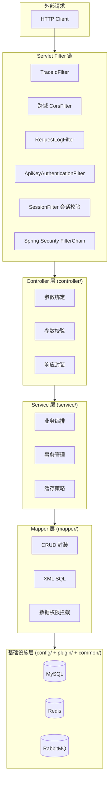
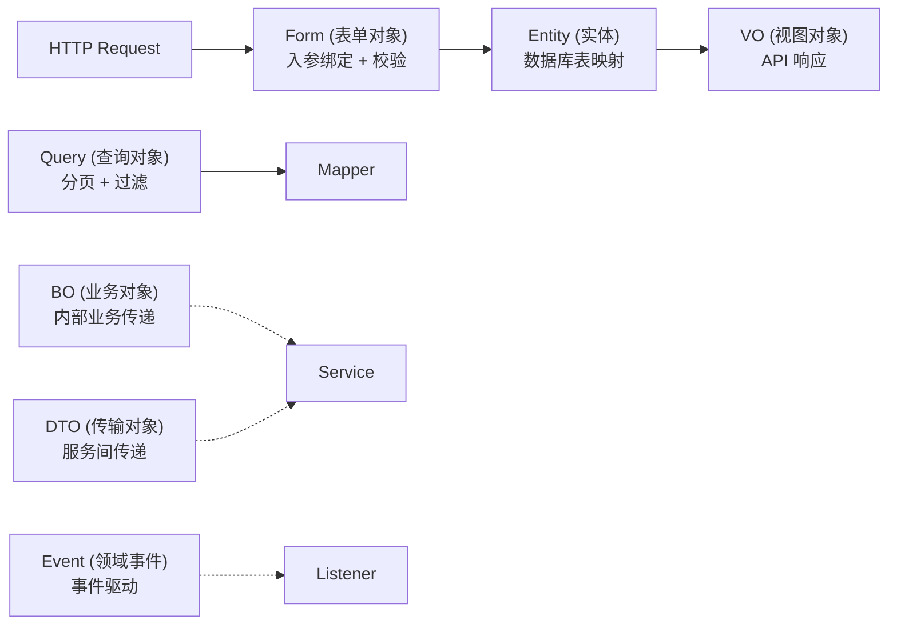
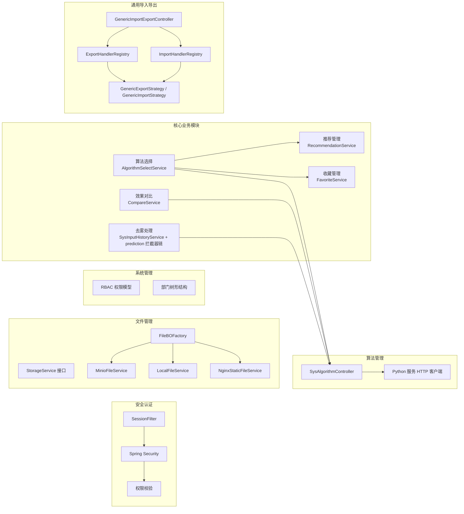
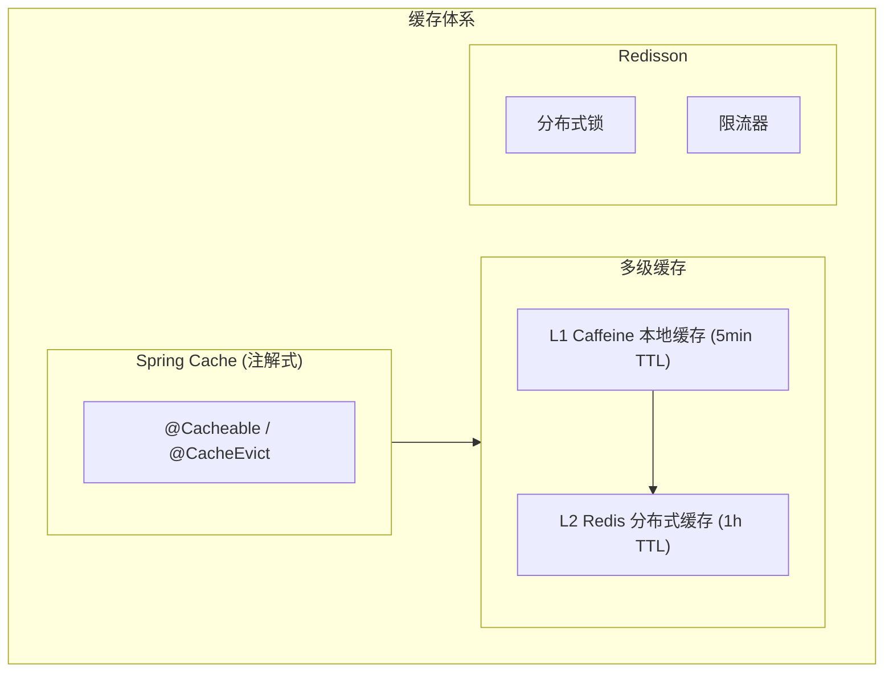
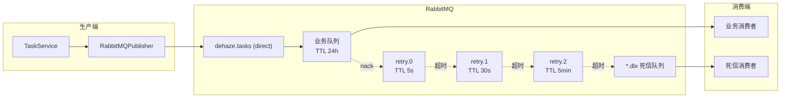
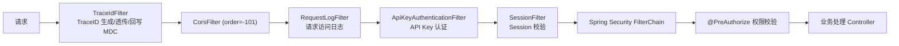
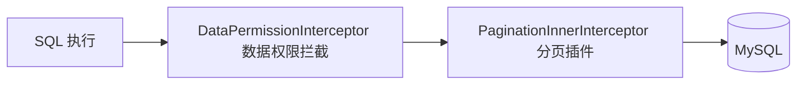
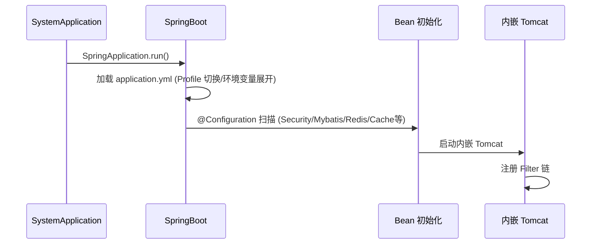

# Java 后端 (dehaze-java)

基于 Spring Boot 3.5、Spring Security 6、Redis、MyBatis-Plus 构建的前后端分离图像去雾系统后端，涵盖用户管理、角色管理、菜单管理、部门管理、字典管理等功能模块。字节码目标为 Java 17（`maven.compiler.release=17`），构建/运行工具链在 JDK 17~25 均验证通过（依赖版本：Lombok 1.18.48、MapStruct 1.6.3、Mockito 5.23.0 + ByteBuddy 1.18.14、Redisson 3.52.0）。

> 构建/运行/测试说明见项目根目录的 `README.md`。

## 一、分层架构



### 层级职责

| 层级 | 包路径 | 职责 | 依赖方向 |
|------|--------|------|----------|
| Filter 链 | `filter/` + Spring Security | 请求拦截、Session 校验、验证码、跨域 | 外部请求 |
| Controller 层 | `controller/` | 参数绑定与校验、调用 Service、统一响应 | -> Service |
| Service 层 | `service/` | 业务逻辑编排、事务边界、缓存交互 | -> Mapper + plugin |
| Mapper 层 | `mapper/` | 数据库 CRUD、SQL 构建、数据权限 | -> MyBatis-Plus |
| 基础设施层 | `config/` + `plugin/` + `common/` | 配置、缓存、安全、限流等基础能力 | 被所有层依赖 |

### 依赖注入策略

基于 Spring IoC 容器实现自动依赖装配：

- 使用 `@RequiredArgsConstructor` (Lombok) 生成构造函数注入，优先于字段注入
- 配置类使用 `@Configuration` + `@Bean` 显式声明基础组件
- 条件装配使用 `@ConditionalOnProperty` 控制组件按需加载（如 XXL-Job、Redis Cache）
- 属性绑定使用 `@ConfigurationProperties` + `@ConfigurationPropertiesScan`

### 数据模型分层



| 模型类型 | 包路径 | 职责 | 定位 |
|----------|--------|------|------|
| Entity | `model/entity/` | 数据库表映射，MyBatis-Plus 注解 | 主力模型 |
| Form | `model/form/` | 请求入参绑定、校验注解 | 主力模型 |
| VO | `model/vo/` | API 响应输出 | 主力模型 |
| Query | `model/query/` | 分页查询条件 | 主力模型 |
| BO | `model/bo/` | 业务层跨服务聚合传递 | 按需使用 |
| DTO | `model/dto/` | 跨层数据传输（如登录结果） | 按需使用 |
| Event | `model/event/` | 领域事件载荷 | 按需使用 |

对象转换使用 MapStruct 编译期生成转换代码（`converter/` 包），避免运行时反射开销。

## 二、项目目录结构

```
dehaze-java/
├── pom.xml                             # Maven 依赖管理
├── src/
│   ├── main/
│   │   ├── java/com/pei/dehaze/
│   │   │   ├── SystemApplication.java  # SpringBoot 启动入口
│   │   │   ├── common/                 # 公共基础模块
│   │   │   │   ├── base/               # 基类（BaseEntity/BasePageQuery/IBaseEnum）
│   │   │   │   ├── constant/           # 常量定义（Security/Session/Task）
│   │   │   │   ├── enums/              # 业务枚举（状态/类型/权限范围）
│   │   │   │   ├── exception/          # 异常体系（BusinessException + 全局处理器）
│   │   │   │   ├── model/              # 公共模型（Option）
│   │   │   │   ├── result/             # 统一响应（Result/ResultCode/PageResult）
│   │   │   │   ├── util/               # 工具类（XSS/路径安全/文件/日期）
│   │   │   │   └── validator/          # 自定义校验注解
│   │   │   ├── config/                 # 配置类（Security/Mybatis/Redis/Cache/MQ/Resilience/WebSocket等）
│   │   │   ├── filter/                 # Servlet 过滤器（TraceId/RequestLog/JwtValidation）
│   │   │   ├── security/              # 安全组件（认证/授权/工具）
│   │   │   ├── mq/                     # 消息队列（RabbitMQ 生产者/消费者/DLX）
│   │   │   ├── plugin/                 # 插件化扩展组件
│   │   │   │   ├── mybatis/            # MyBatis 插件（数据权限/自动填充）
│   │   │   │   ├── dupsubmit/          # 防重复提交（AOP + Redisson）
│   │   │   │   ├── ratelimit/          # 接口限流（AOP + Redisson）
│   │   │   │   └── easyexcel/          # Excel 导入监听器
│   │   │   ├── controller/             # Controller 层
│   │   │   ├── service/                # Service 层（含 file/ 存储策略实现、strategy/ 任务策略）
│   │   │   ├── mapper/                 # Mapper 层
│   │   │   ├── converter/              # MapStruct 对象转换器
│   │   │   ├── model/                  # 数据模型（entity/bo/dto/vo/form/query/event）
│   │   │   ├── job/                    # 定时任务
│   │   │   └── listener/              # 事件监听器
│   │   └── resources/
│   │       ├── application.yml         # 主配置（profile 切换）
│   │       ├── application-dev.yml     # 开发环境
│   │       ├── application-prod.yml    # 生产环境
│   │       ├── logback-spring.xml      # 日志配置
│   │       ├── mapper/                 # MyBatis XML 映射文件
│   │       └── excel-templates/        # Excel 导入模板
│   └── test/
│       ├── java/com/pei/dehaze/
│       │   ├── common/                 # 通用工具测试
│       │   ├── config/                 # 测试配置（TestConfig）
│       │   ├── generator/              # 代码生成器
│       │   ├── listener/               # 监听器测试
│       │   └── service/                # Service 单元/集成测试
│       └── resources/                  # 测试配置（MySQL 测试库 SQL/模板，测试规范见 src/test/README.md）
```

## 三、核心模块



### 3.1 安全认证模块

| 组件 | 实现 | 说明 |
|------|------|------|
| Session 认证 | Redis `session:{sessionId}` | 存储 userId、username、authorities，TTL 7 天，剩余 < 24h 自动续期 |
| 密码加密 | BCryptPasswordEncoder | Spring Security 标准实现 |
| 验证码 | Hutool Captcha | 支持圆圈/GIF/干扰线/扭曲多种类型 |
| UserDetails | SysUserDetailsService | 从数据库加载用户信息 |

RBAC 权限模型：

```
用户 -> 角色（多对多） -> 权限标识（多对多）
权限格式: 模块:功能:操作（如 sys:user:add）
```

三层安全防护：SessionFilter 会话校验 -> Redis 权限校验 -> 方法级 @PreAuthorize + @DataPermission 注解。

权限缓存以逐角色独立 Key 存储：`role:perms:{roleCode}`，值为纯 JSON 字符串数组，使用 StringRedisTemplate 读写，三端（Java/Go/Python）格式统一。

### 3.2 文件管理模块

策略模式适配多存储后端（minio/local/nginx-static）：

- `sys_file` 表只存 `object_name` + `storage`（与环境无关）
- URL 运行时拼接不落库（`storage.baseUrl + object_name`）
- 下载按 `storage` 选后端读取，无前缀判断分支
- 环境迁移只改配置不改库

### 3.3 通用导入导出模块

Handler 模式 + 通用策略实现，各业务模块只需实现 ExportHandler/ImportHandler 接口：

| 模块 | ExportHandler | ImportHandler |
|------|--------------|--------------|
| 用户管理 | UserExportHandler | UserImportHandler |
| 角色管理 | RoleExportHandler | RoleImportHandler |
| 部门管理 | DeptExportHandler | DeptImportHandler |
| 菜单管理 | MenuExportHandler | MenuImportHandler |
| 字典管理 | DictExportHandler | DictImportHandler |
| 数据集管理 | DatasetExportHandler | -（仅导出） |
| 算法管理 | AlgorithmExportHandler | AlgorithmImportHandler |

### 3.4 插件化扩展组件

通过 `plugin/` 包实现可插拔的横切关注点：

| 插件 | 注解 | 实现方式 |
|------|------|----------|
| 防重复提交 | `@PreventDuplicateSubmit` | AOP + Redisson 分布式锁 |
| 接口限流 | `@RateLimit` | AOP + Redisson 令牌桶/固定窗口 |
| 数据权限 | `@DataPermission` | MyBatis-Plus 拦截器 |
| 字段自动填充 | `@TableField(fill=...)` | MetaObjectHandler |

### 3.5 去雾处理模块

预测主流程通过 `prediction/` 包的拦截器链（`PredictionInterceptor`）实现可插拔扩展：拦截器命中则短路不调用 Python 算法服务，未命中则继续主流程委托算法管理模块执行推理。预测日志、输入历史、参数预设分别由 `SysPredLogService`、`SysInputHistoryService`、`SysPresetService` 承担。

异步任务状态（处理中/已完成/已失败）与任务管理模块语义对齐，但物理存储于 `sys_input_history` 表而非 `sys_task` 表——这是为保留用户维度的输入历史视图而做的存储分叉，状态查询走 `SysInputHistoryService` 而非统一任务接口。

VIP 配额校验在预测请求入口执行：处理前预校验、成功后实扣减、失败不扣减，Redis 原子操作防止并发超扣。组件实现详见 [去雾处理/后端实现.md](../../03-模块设计/核心模块/去雾处理/后端实现.md)。

### 3.6 效果对比模块

多模式对比（并排/重叠/放大镜/指标）与评估指标计算（PSNR/SSIM/LPIPS/NIQE/Entropy）由 `CompareService` 统一编排，指标计算委托算法管理模块调用 Python 服务完成。对比报告异步生成复用任务管理模块框架，报告文件存入 MinIO 保留 24 小时。组件实现详见 [效果对比/后端实现.md](../../03-模块设计/核心模块/效果对比/后端实现.md)。

### 3.7 算法选择模块

`AlgorithmSelectService` 组合搜索、推荐、收藏状态构建前端算法视图，委托算法管理模块完成算法检索。实验性算法通过会员管理模块校验 VIP 可见性。组件实现详见 [算法选择/后端实现.md](../../03-模块设计/核心模块/算法选择/后端实现.md)。

### 3.8 收藏管理模块

统一收藏表 `sys_favorite` 通过 `target_type` 区分收藏对象类型（algorithm/result/dataset），新模块接入收藏只需声明 targetType，无需重复开发表/接口。`FavoriteService` 提供添加/取消/列表/状态批量查询/计数，收藏状态批量查询接口供各业务模块在加载列表时标记每条记录收藏状态。VIP 收藏容量校验在收藏操作前执行（普通用户 200 条、VIP 用户 500 条）。组件实现详见 [收藏管理/后端实现.md](../../03-模块设计/基础模块/收藏管理/后端实现.md)。

### 3.9 推荐管理模块

`RecommendationService` 编排推荐流程：图像特征提取 → 规则匹配 → 排序 → 结果构建。当前采用规则匹配引擎（可解释性强、管理员可配置场景→算法映射），冷启动策略为新算法赋予默认评分并随机曝光。组件实现详见 [推荐管理/后端实现.md](../../03-模块设计/基础模块/推荐管理/后端实现.md)。

### 3.10 AI 能力转发（B 类端点）

AI 域接口按依赖性质分层：配置与 CRUD 类（A 类）由 java 原生实现，强依赖 deepagents / LLM / 向量检索的运行时端点（B 类）由 `AiProxyController` 转发至 dehaze-python(8991) 执行，**python 是唯一行为事实源**，java 不重实现推理链路。

| 关注点 | 实现 |
|--------|------|
| 转发入口 | `AiProxyController` 以 `/api/v1/**`、`/a2a`、`/.well-known/agent.json` 通配注册；A 类端点由各业务 Controller 以精确路径承接（精确映射优先于通配） |
| 白名单 | `AiProxyRoutes` 集中登记「方法 + 路径模板 + 端点性质」，未登记路径一律 404，禁止按客户端路径盲转发（SSRF 防线） |
| 身份透传 | 透传 `Authorization` / `Cookie` / `X-Session-Id` / `x-api-key`，python 凭共享 Redis session 或 API Key 鉴权并做权限终审，转发层不重复鉴权 |
| 凭据形态豁免 | 第三方协议端点（`POST /api/v1/chat/completions`、`POST /api/v1/messages`、`GET /api/v1/models`、`POST /a2a`、`GET /.well-known/agent.json`）的凭据形态（OpenAI Bearer / Claude x-api-key）java 过滤器不识别，须同时豁免 `AuthenticationFilter` 与 Security 授权规则，清单与白名单同源（`AiProxyRoutes.authExemptRoutes()`），否则合法第三方 Key 会被拦成 401 |
| 响应透传 | 状态码与 Content-Type 原样回传，信封 `{code,msg,data}` 不解包重包 |
| multipart | `AiProxyMultipartResolver` 使白名单内 multipart 请求绕过 Spring 解析，文件以原始字节流（含 boundary）转发、不落盘（大小上限由 python 侧校验） |
| SSE 管道 | `AiForwardClient` 基于 JDK HttpClient + Flow.Publisher 逐块 flush 转发 `text/event-stream`，心跳注释行原样透传；客户端断连即取消上游订阅，停止 python 侧推理 |
| 超时 | 响应头等待用 `algorithm.python.read-timeout`；流空闲超时用 `ai-proxy-stream-idle-timeout`（默认 300s），防转发线程被卡死 |
| 降级 | python 不可达且响应未提交时返回 `C0001` 信封 + 503（非裸 500）；SSE 已输出首块则断流，由前端按 `Last-Event-ID` 重连兜底 |
| 重试 | 不重试——SSE 与推理类 POST 非幂等，重试会导致重复推理与重复计费 |

B 类端点分组：AI 对话 SSE（发送/重连/重新生成/续流/编辑/停止）、Agent·Skill·模型·供应商试运行、MCP Server 健康与工具探测、智能体评测触发与任务查询、Agent 发布门禁（发布前需真实执行回归评测，判分依赖 LLM）、定时任务手动触发、知识库库级索引生命周期（创建/删除/索引状态）、知识库文档处理与向量检索、A2A 协议、OpenAI/Claude 兼容协议。端点清单与 python 侧路由见 [AI对话/API接口.md](../../03-模块设计/核心模块/AI对话/API接口.md)。

> 归属边界：知识库**库级创建/删除/索引统计必须转发 python**（`POST /api/v1/kb`、`DELETE /api/v1/kb/{id}`、`GET /api/v1/kb/{id}/index-stats`）——三者都依赖 ES 索引生命周期（python `ensure_kb_index` / `delete_kb_index` / `_stats`），java 原生实现会出现「库建了但 ES 索引不存在」的缺口；**文档版本更新与删除（`PUT|DELETE /api/v1/kb/documents/{id}`）同样必须转发 python**——须驱动 python 的文档处理流水线（`_process_document_guarded`）重建分块与索引，java 原生实现只改状态、无法驱动异步重解析，会使 `processingStatus` 永久停留 `pending`。挂载路径 Agent Card（`/api/v1/ai/agents/{id}/a2a/.well-known/agent.json`）由 java 原生实现（`AiA2aController`）；库列表/详情/编辑与文档读、测试集、低质分块等纯元数据端点仍为 java 原生（A 类）。文档处理管线、向量检索、A2A JSON-RPC 入口、全局 Agent Card 同样转发 python。两边不得重复注册同一「方法+路径」：启动级歧义由 `ControllerMappingUniquenessTest` 兜底，路径归属由 `AiProxyMappingTest` 双向锁定（原生侧不得声明该映射 + 通配须命中 `AiProxyController`）。

### 3.11 AI 域 A 类端点与跨端缓存互认

A 类端点由 java 原生实现并复用与 python 同一份表结构（软删 `deleted=id` + `delete_time`、错误码 A0400/A0401/A0500~A0504 三级分类一致）：

| 域 | Controller | 覆盖范围 |
|----|-----------|---------|
| 会话与消息 | `AiConversationController` | 会话 CRUD / 回收站（30 天窗口）/ 批量操作（删除需二次确认）/ 置顶（上限 + 用户级锁）/ 已读 / 导出 / 消息列表与详情 / 分支查询与切换 / 助手消息软删 |
| 消息反馈 | `AiMessageFeedbackController` | 点赞点踩（标签白名单 + 30 天时效）、查询、撤销（软删原行，再次反馈复活） |
| 产物 | `AiArtifactController` | 按会话/消息/引用定位与详情（归属经所属会话反查） |
| 长期记忆 | `AiMemoryController` | 分页/归档视图/检索重激活/清空与恢复（均需二次确认）/ 取消归档 / 导出（JSON·Markdown） |
| Agent | `AiAgentController` | CRUD / 启停 / 复制 / Skills·MCP 命名空间·子 Agent 覆盖式绑定（存在性 + 自引用 + DFS 环检测）/ 版本历史·差异·快照查询 / 回滚 / 推理参数默认值只读契约（**发布走转发域**） |
| A2A 端点注册 | `AiAgentEndpointController` | 外部 A2A 端点注册、更新、删除、分页 |
| 评测 | `AiAgentEvalController` / `AiEvalCenterController` | 评测集/样本 CRUD、执行记录列表、中心总览·趋势·对比·判分状态·复核队列与复核详情 |
| 定时任务 | `AiScheduleController` | CRUD / 启停 / 最近触发时间预览 / 执行历史 |
| 用量统计 | `AiUsageStatsController` | 会话·Token·积分维度统计与供应商健康快照 |
| AI 计费 | `AiBillingController` | 用户端余额/消耗汇总/计费明细/余额流水/月结账单（含下载）/退款申请；管理端退款审核与列表、多维度统计、手动调整积分、异常计费清单、成本单价 CRUD、成本-利润双口径统计、供应商对账导入 |
| AI 可观测性 | `AiObservabilityController` | 异常总览、过程链检索/详情/导出（CSV）、会话审计时间线（含 JSON 全量导出）、资源消耗聚合、性能趋势；除过程链详情与会话时间线（登录用户可查，普通用户仅自己会话）外均需 `ai:conversation:audit` |
| 兼容调用审计 | `AiCompatCallController` | 当前用户兼容端点调用日志分页（MongoDB `ai_api_call_log`，keyId/模型/时间筛选，时间格式非法按无过滤），分页参数为 `page/size` |

**分页参数校验**：AI 域分页端点一律以 `BasePageQuery` 派生 DTO 承载分页（无过滤条件的端点复用 `PageParamQuery`，带业务筛选的用各自 Query 类），Controller 参数上加 `@Valid` 触发校验：`pageNum ≥ 1`、`pageSize ≤ 100`，越界返回 400 + `A0400` —— 与 dehaze-python `BasePageQuery`（`ge=1` / `le=100`）同口径。仅声明 DTO 而漏 `@Valid` 会让约束退化成纯文档注解（超限请求会被静默放行），`AiPaginationValidationTest` 逐端点守卫边界与放行值。

> 跨端验收口径：两端均为 **HTTP 400 + `code=A0400`**（python 由 `RequestValidationError` 处理器返回，java 由 `GlobalExceptionHandler` 的 `BindException`/`MethodArgumentNotValidException` 分支返回）。`msg` 文案各自本地化（python 为英文校验描述、java 取注解 message 中文），**SDK 与跨端用例只断言 code 与状态码，不得断言 msg**。

**跨端缓存互认**：Agent 写操作按 python 键规范失效 Redis（`ai:agent:{agentCode}`、`ai:agent:{id}:skills|mcp|subagents|published`、`ai:agent:list:enabled`），并向 `cache:invalidation` 频道发布 `{type:"key",key,senderId}` 广播，由接收端清各自进程内 L1（java 域内自建 `AiCacheInvalidator`，与 python 键规范逐字对齐）；会话置顶用用户级锁 `ai:conv:pin:{userId}`（TTL 10s，Lua 校验 token 后释放），锁内完成名额校验与写入。

MongoDB 侧同理：`login_log`、`audit_log`、`ai_api_call_log` 三个集合由 java 与 python 共写共读，python 一律按 **snake_case** 写键，故 java 实体必须用 `@Field("user_id")` 一类显式映射、`Criteria`/`Sort` 一律用 snake_case（含 `MongoConfig` 的索引键），否则同集合内两端数据互不可见且不报错。三个实体（`LoginLog`/`AuditLog`/`AiApiCallLog`）已按此对齐，并由 `MongoLogKeyMappingTest` 守卫。

计费域同理直连同一批键（与 python 运行面共用，java 不新造键名）：`ai:balance:{userId}`（整数积分语义，TTL 1h，非整数历史坏值删除回源整数化回填）、`ai:arrears:{userId}`（欠费标记，人工调整后清除）、`ai:quota:daily|monthly:{userId}:{yyyy-MM-dd|yyyy-MM}`（日/月已用配额，限额取 `sys_member_benefit` 启用权益）、`ai:bill:{userId}:{yyyy-MM}`（月结账单缓存，TTL 90 天，**snake_case JSON**，沿用 `AiJsonUtils` 与 python 互认；非当前月的空账期不写缓存且查询返回 A0401）。

> 已知能力差异（诚实标注）：
> 1. **会话检索**：java 侧关键词搜索以 DB LIKE（标题 + 消息正文命中定位）替代 python 的 ES 全文检索，且不写会话 ES 索引，检索能力弱于 python；跨端不共享会话搜索语义，以各端自洽为准。
> 2. **发布 Agent 归转发域**：发布需真实执行回归评测并调用判分模型（LLM 能力），java 端无法产出评分——曾以"含考题即报 A0502"显式失败兜底，会让配了回归集的 Agent 在 java 环境完全无法发布。现已按"强依赖 LLM 的能力归 B 类"原则调整为：`POST /api/v1/ai/agents/{agentId}/publish` 登记入 `AiProxyRoutes` 白名单转发 python（`eval_service.run_regression(trigger_type="publish")` 真实评测后才发布），java 侧移除 `AiAgentVersionService.publish` 与 `AiEvalService.runPublishGate`；版本**查询与回滚**仍为 java 原生（回滚不评测）。该「方法+路径」只允许单边注册，由 `ControllerMappingUniquenessTest` 与 `AiAgentControllerPermissionTest#publishEndpointNotDeclaredLocally` 双重守卫。

### 3.12 查询参数校验口径（分页与标量）

- **分页参数**：`BasePageQuery` 派生 DTO + 参数级 `@Valid`（`pageNum ≥ 1`、`pageSize ∈ [1,100]`），越界 400 + A0400。校验载体必须是 DTO——裸 `@RequestParam` 无 `@Max` 时任意 `pageSize` 直达分页查询。
- **标量参数**（非分页的裸 `@RequestParam`）：类级 `@Validated` + 参数注解（方法级校验，生产环境由 Boot `ValidationAutoConfiguration` 注册 `MethodValidationPostProcessor` 生效），与 python `Query(ge=, le=)` 逐一对齐：评测中心 `limit ∈ [1,500]`、复核状态 `status ∈ [1,2]`、Cron 预览 `count ∈ [1,20]`；越界与类型错误统一 400 + A0400（经 `GlobalExceptionHandler` 的 `ConstraintViolationException` / `MethodArgumentTypeMismatchException` 处理器）。
- **时间参数**：`@DateTimeFormat(pattern = "yyyy-MM-dd HH:mm:ss")` + `LocalDateTime`。格式非法 → 400 + A0400；**空串视为未传（宽松口径）**，此点与 go 一致、与 python（空串 → A0400）不同，属已知跨端口径差异。

### 3.13 字段约束对齐与"触发条件"口径（2026-09-18）

- **数值范围（P0）**：AI 域 Form/Query 的 `status`/`enabled`/`sortOrder` 按 python 事实源补 `@Min/@Max`。**严格按 python 声明的边界加**：python 无上界的（`AgentCreate/AgentUpdate.sort_order` 仅 `ge=0`）**不得擅自加 `@Max`**；python 为 `None` 语义的（`EndpointUpdate.status`、`ScheduleUpdate.enabled`、`MemoryUpdate.status`、`AgentUpdate.sortOrder`）**只加范围、不加 `@NotNull`**，缺省必须放行。
- **字符串长度（P1）**：按 python `max_length` 补 `@Size`——会话 title 255 / model 64 / agentCode 64 / scene 32；Agent/Endpoint 的 `modelId` 64。
- **枚举白名单（P2）**：候选值集**不连续**的（`rating ∈ {1,-1}`，0 是洞）**不用区间注解**（区间必然放行洞中值），按既有裁决放 **service 层白名单**；值集**连续**的（`{0,1}`）`@Min/@Max` 即等价白名单。判据：`equals(1)` 二分 + 其余值静默归入另一分支是高复发脏数据模式（`AiFeedbackService`、`AiScheduleService`），凡见此写法须反查 python 是否 `Literal`/白名单。
- **触发条件（本次最易漏的一环）**：字段注解必须配合使用处 `@Valid` 才生效。本次同时补齐 **7 处** `@RequestBody` 端点的 `@Valid`（Agent/Endpoint/Schedule/Memory/Conversation 的 update + `AiAgentEvalController` 两处）。**核缺口必须核四层：注解 + 触发条件 + service 兜底 + 必填性**。
- **负值参数**：记忆检索 `limit < 1` 原拼出 `LIMIT -1` 触发 MySQL 语法错（500），现按 python `Query(ge=1)` 在**参数层**拒绝（类级 `@Validated` + `@Min(1)`，方法级校验）；三端统一 400 + A0400。
- **测试约定**：方法级校验（`@Validated` + 参数注解）在 standalone MockMvc 下**不生效**（controller 未经代理），须显式 `MethodValidationPostProcessor.postProcessAfterInitialization` 包装模拟 Boot 的 `ValidationAutoConfiguration`；字段级 `@Valid` 配 `LocalValidatorFactoryBean` 即可，**两档测法不可互抄**。越界断言统一配 `verifyNoInteractions(service)`（证拦截发生在进入方法前）；"补触发条件"须用**摘除反证**自证（移除 `@Valid` 后对应用例必须失败，再补回转绿）。

## 四、缓存体系



多级缓存后端类型为 Caffeine L1 + Redis L2，通过 MultiLevelCacheManager 管理。Spring Cache 注解使用覆盖 menu、dataset、role 等模块，共 10 处。

## 五、消息队列

异步任务通过 RabbitMQ 解耦：业务侧创建任务记录落库后，由 `taskExecutor.publishExportTask()` 发布消息，消费者调用 `taskExecutor.executeExportTask()` 执行。组件加载受 `@ConditionalOnProperty(rabbitmq.enabled)` 控制，与 Go/Python 端共享同一 Exchange/Queue 拓扑。



| 业务队列 | 用途 | 消费者 |
|---------|------|--------|
| `task.export` | 导出任务（数据集/用户/角色/部门/菜单/字典/算法） | ExportTaskConsumer |
| `feedback.low_rating` | 低分评价告警 | LowRatingAlertConsumer |

每条业务队列配套 3 级重试队列（`retry.0` 5s → `retry.1` 30s → `retry.2` 5min），通过 DLX 实现阶梯重试，最终进入 `*.dlx` 死信队列由 DlxConsumer 兜底处理。

可靠性机制：

| 机制 | 实现 |
|------|------|
| 消费确认 | 手动 ACK（`MANUAL`），`defaultRequeueRejected=false`：消费失败不入原队列，转入重试阶梯，避免毒消息阻塞 |
| 发送确认 | Publisher Confirm + Return 回调，发送失败/不可路由时记录日志 |
| 消费幂等 | 基于任务终态校验（`TERMINAL_STATUSES`），终态任务跳过重复消费 |
| 并发控制 | 消费者并发 3-10，prefetch 10 |

## 六、安全过滤器链



| 过滤器 | 功能 | 作用范围 |
|--------|------|----------|
| TraceIdFilter | TraceID 生成/透传/回写 MDC（`@Order(HIGHEST_PRECEDENCE)`，最先执行） | 全局 |
| CorsFilter | 跨域资源共享 | 全局 |
| RequestLogFilter | 每请求一条访问日志（status/duration） | 全局 |
| ApiKeyAuthenticationFilter | `dhak_*` 形式 API Key 认证，与 Session 认证解耦，优先于 SessionFilter | 受保护路由 |
| SessionFilter | Session 验证、SecurityContext 注入 | 受保护路由 |
| SecurityFilterChain | Spring Security 认证/授权链 | 全局 |

异步线程（`@Async`）通过 `AsyncConfig` 的 TaskDecorator 透传 MDC（traceId/method/path/ip/userId）与 SecurityContext，保证异步方法日志链路追踪和权限上下文不中断。

安全工具：XssUtils（XSS 过滤）、PathSecurityUtil（路径穿越检测）、SecurityUtils（获取当前用户上下文）。

## 七、数据访问层

| 组件 | 选型 | 说明 |
|------|------|------|
| ORM | MyBatis-Plus 3.5.5 | 通用 CRUD、分页、数据权限 |
| 连接池 | Druid 1.2.16 | 监控、防 SQL 注入、连接管理 |
| 关系数据库 | MySQL | 业务数据（生产环境） |
| 文档数据库 | MongoDB | 登录日志（LoginLog）、审计日志（AuditLog），启动时由 MongoConfig 自动建索引 |
| 测试数据库 | MySQL（`dehaze_test`，与开发同实例） | 集成测试走真实方言，schema/种子数据同源于 `config/sql`（2026-08-23 废弃 H2/TestContainers 方案） |

MyBatis-Plus 插件链：



数据权限（DataScope）：基于 MyBatis-Plus DataPermissionHandler 实现行级数据权限控制，支持全部数据/本部门/本部门及下级/仅本人四种范围。

自动填充：INSERT/UPDATE 时自动填充 `createTime`/`updateTime`/`createBy`/`updateBy`。

逻辑删除：全局配置 `deleted` 字段（0=未删除，1=已删除）。

## 八、定时任务

统一采用 XXL-Job 分布式调度（调度周期由 XXL-Job Admin 统一管理，与 Go/Python 端共享调度配置），`@Scheduled` 未使用。所有 Job 通过 `@XxlJob` 注解声明 handler，执行前注入 SystemSecurityContext 以系统身份运行，避免无用户上下文导致的权限校验失败。

| 业务域 | Handler | 功能 |
|--------|---------|------|
| 任务管理 | `cleanupExpiredTasks` | 每天 02:00 物理删除 7 天前已完成/取消任务、30 天前已终止任务 |
| 任务管理 | `cleanupStuckTasks` | 每小时将 PROCESSING 超 30min、PENDING 超 24h 的僵死任务标记为失败并清除缓存 |
| 任务管理 | `cleanupStuckPredEvalLogs` | 预测/评估日志过期清理 |
| 订单 | `expireOrders` | 待支付订单超 30 分钟自动取消 |
| 订单 | `completeExpiredOrders` | 过期订单自动完成 |
| 订单 | `retryFailedRefunds` | 退款失败记录重试 |
| 会员 | `resetMonthlyQuota` | 每月 1 日重置 VIP 月度配额 |
| 会员 | `sendExpireReminders` | 会员到期前提醒 |
| 会员 | `processExpiredMembers` | 会员过期状态处理 |
| 营销 | `expireUserCoupons` | 用户优惠券过期失效 |
| 营销 | `autoRenew` | 自动续费扣款 |
| 消息 | `cleanupExpiredMessages` | 过期消息清理 |
| 消息 | `refreshUnreadCountCache` | 未读数缓存刷新 |
| 消息 | `processDelayedPush` | 延迟消息推送（Java 独有：DND 免打扰期间消息入 Redis 队列，DND 结束后批量补发；Go/Python 仅简单 WebSocket 推送，无此机制） |
| 公告 | `sendScheduledAnnouncements` | 定时公告发送 |

## 九、配置管理

多环境支持：

| 环境 | Profile | 特性差异 |
|------|---------|----------|
| 开发 | dev | 慢SQL日志(>1s)、Swagger 启用、DevTools 热重载 |
| 测试 | test | 真实 MySQL 测试库 `dehaze_test`（`createDatabaseIfNotExist` 自动建库 + `config/sql` 全量重建）、缓存禁用 |
| 生产 | prod | Swagger 禁用、连接池优化、日志输出到文件 |

敏感信息通过环境变量注入，YAML 中使用 `${ENV_VAR}` 占位符。条件化装配通过 `@ConditionalOnProperty` 控制 XXL-Job、Redis Cache 等组件按需加载。

## 十、统一响应与错误处理

响应字段：

| 字段 | 类型 | 说明 |
|------|------|------|
| code | string | 5 位错误码，`00000` 表示成功 |
| msg | string | 提示信息 |
| data | object | 业务数据 |
| traceId | string | 链路追踪 ID，取自 MDC |
| timestamp | long | 服务器时间戳 |
| errors | array | 字段校验错误明细 |

错误码采用 5 位字符串编码，与 Go/Python 端保持一致：

| 前缀 | 类别 | 示例 |
|------|------|------|
| `00` | 成功 | `00000` - 一切 ok |
| `A0` | 用户端错误 | `A0001` - 用户端错误, `A0200` - 登录异常, `A0400` - 参数错误 |
| `B0` | 系统执行错误 | `B0001` - 系统执行出错, `B0210` - 并发限流 |
| `C0` | 第三方服务错误 | `C0001` - 调用第三方服务出错, `C0300` - 数据库服务出错 |

全局异常处理通过 `@RestControllerAdvice` + `@ExceptionHandler` 统一拦截并格式化输出，共处理 18 类异常。

## 十一、应用生命周期

### 启动流程



### 优雅关闭

收到 SIGINT/SIGTERM -> Tomcat 停止接收新连接 -> 等待 in-flight 请求完成（默认 30s 超时） -> 销毁 Spring Bean -> 关闭数据源/Redis/线程池连接池。

本地开发统一通过项目根目录 `scripts/run.py` 管理三端后端的生命周期。

## 十二、三端对照

| 基础设施能力 | dehaze-java | dehaze-go | 一致性 |
|-------------|-------------|-----------|--------|
| HTTP 框架 | Spring MVC (Tomcat) | Gin | 接口语义一致 |
| ORM | MyBatis-Plus | GORM | 功能对等 |
| 缓存 | Spring Cache + Caffeine L1 + Redis L2 | 多级缓存 (gokit local + Redis) | 已对齐多级缓存 |
| 分布式锁 | Redisson | go-redis | 语义一致 |
| 消息队列 | RabbitMQ | RabbitMQ | 共享 Exchange/Queue |
| 定时任务 | @Scheduled + XXL-Job | Ticker + XXL-Job | 共享 XXL-Job Admin |
| 日志 | Logback | Zap | 格式/级别统一 |
| 认证 | Spring Security + Session | 自研中间件 + Session | Session ID 互通 |
| 权限 | RBAC (@PreAuthorize) | RBAC (中间件) | 权限标识一致 |
| 数据权限 | MyBatis-Plus 拦截器 | GORM Plugin | 语义一致 |
| 错误码 | 5 位字符串 (A0/B0/C0) | 5 位字符串 (A0/B0/C0) | 完全一致 |
| 响应格式 | `{code, msg, data}` | `{code, msg, data}` | 完全一致 |
| TraceID | TraceIdFilter + MDC | trace.go + Context | 语义一致 |

## 十三、关键技术决策

| 决策 | 选择 | 理由 |
|------|------|------|
| 框架 | Spring Boot 3.3 | Java 生态标准，自动配置 + 起步依赖 |
| 安全 | Spring Security + Redis Session | RBAC 细粒度权限控制 |
| ORM | MyBatis-Plus | 通用 CRUD、分页、数据权限插件 |
| 缓存 | Caffeine L1 + Redis L2 多级缓存 | 降低 Redis 压力，提升响应速度 |
| 消息队列 | RabbitMQ | 与 Go/Python 端统一中间件 |
| 文件存储 | 策略模式适配多后端 | minio/local/nginx-static 统一抽象 |
| 导入导出 | Handler 模式 + 通用策略 | 各模块只需实现接口，复用框架 |
| 对象转换 | MapStruct | 编译期生成，避免运行时反射开销 |
| 定时任务 | XXL-Job | 分布式调度、Web 管理控制台，与 Go/Python 端共享调度配置 |
| 日志 | SLF4J + Logback | 详见 [日志架构设计](../../02-系统架构/07-日志架构设计.md) |
| 监控 | Micrometer + Prometheus | 指标采集，与 Go 端命名统一 |
| 收藏统一抽象 | `sys_favorite` 表 + `target_type` 区分 | 新模块接入收藏只需声明 targetType，无需重复开发表/接口/组件 |
| 推荐引擎选型 | 规则匹配引擎 | 规则可解释性强、可快速上线、管理员可视化配置场景→算法映射 |
| VIP 配额校验 | 拦截器模式 + Redis 原子扣减 | 处理前预校验、处理成功后实扣减、失败不扣减，保证配额与处理结果一致性；Redis 原子操作（DECR + 阈值判断）防止并发超扣 |
| AI 运行时端点 | controller 层转发 dehaze-python | B 类端点强依赖 deepagents/LLM/向量检索，java 重实现会形成第二套行为口径；python 为唯一事实源 |
| 转发 HTTP 客户端 | JDK HttpClient（非 RestTemplate） | 需逐块读取响应体并支持取消上游订阅，RestTemplate 无法流式；固定 HTTP/1.1 以匹配 uvicorn |

## 十四、可观测性

| 维度 | 实现 |
|------|------|
| 指标采集 | Micrometer + Prometheus，业务计数器由各 Service 通过 MeterRegistry 递增：`dehaze_prediction_total`、`dehaze_evaluation_total`、`dehaze_task_total`、`dehaze_file_upload_total`；Python 调用耗时 `dehaze_python_call_duration` |
| 链路追踪 | TraceIdFilter 生成 TraceID 写入 MDC，异步线程通过 TaskDecorator 透传（详见第六节） |
| 日志 | Logback 结构化日志（traceId/method/path/status/duration），详见 [日志架构设计](../../02-系统架构/07-日志架构设计.md) |
| 访问日志 | RequestLogFilter 每请求一条 INFO ACCESS 日志 |
