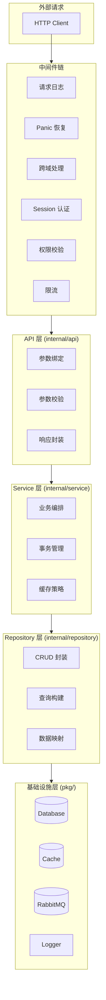
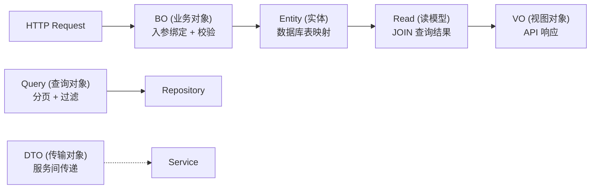
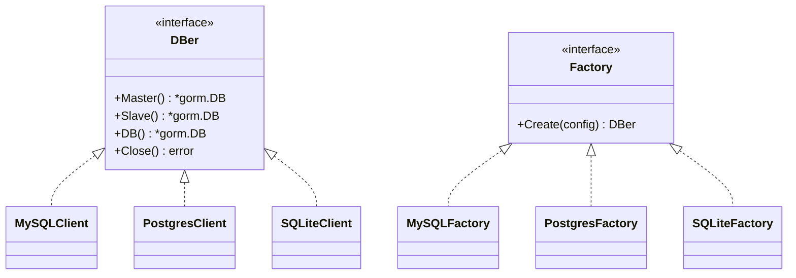
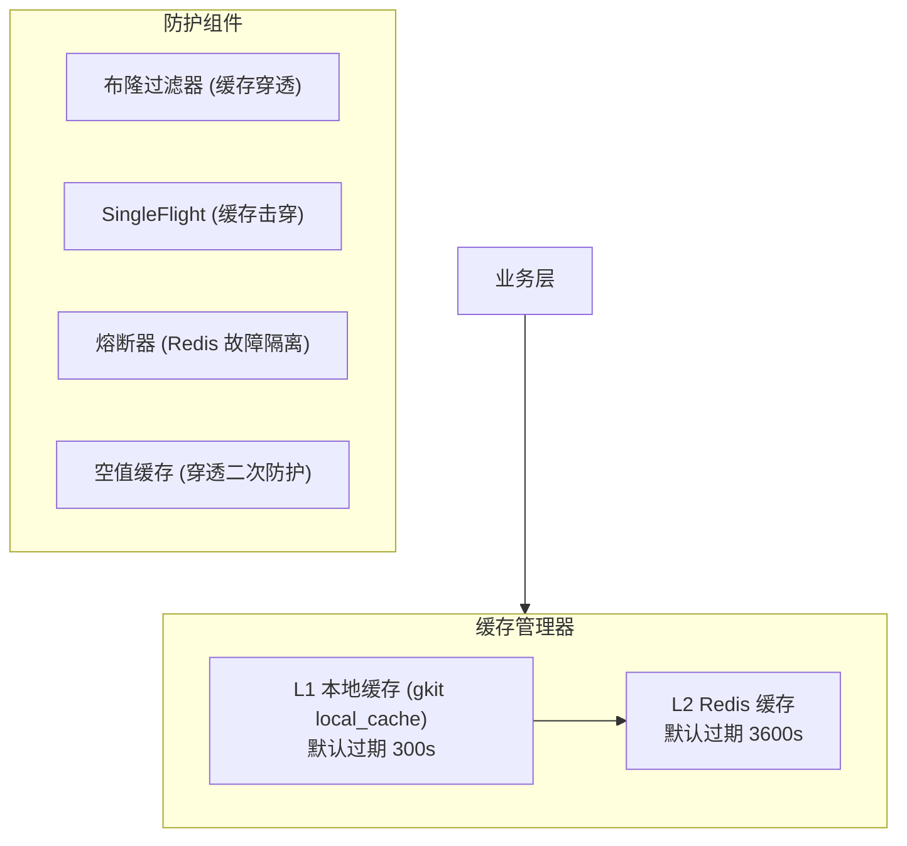
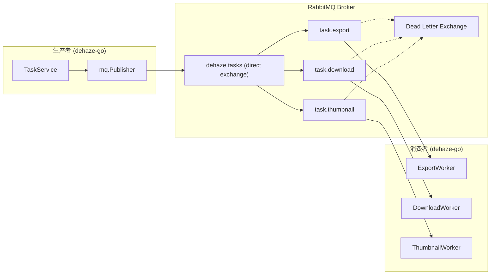
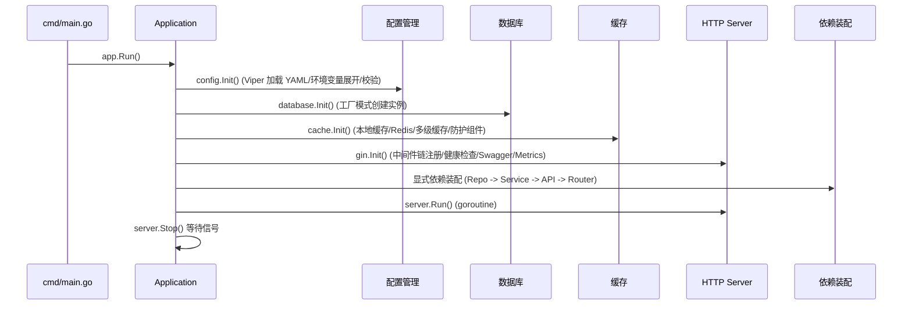

# Go 后端 (dehaze-go)

基于 Go 1.25、Gin、GORM、Redis 构建的前后端分离图像去雾系统后端，涵盖用户管理、角色管理、菜单管理、部门管理、字典管理等功能模块。

> 构建/运行/测试说明见项目根目录的 `README.md`。

## 一、分层架构



### 层级职责

| 层级 | 包路径 | 职责 | 依赖方向 |
|------|--------|------|----------|
| 中间件链 | `pkg/server/gin/middleware/` | 请求拦截、认证、鉴权、限流、日志 | 外部请求 |
| API 层 | `internal/api/` | 参数绑定与校验、调用 Service、统一响应 | -> Service |
| Service 层 | `internal/service/` | 业务逻辑编排、事务边界、缓存交互 | -> Repository + pkg |
| Repository 层 | `internal/repository/` | 数据库 CRUD、SQL 构建 | -> GORM |
| 基础设施层 | `pkg/` | 配置、数据库、缓存、MQ、日志等基础能力 | 被所有层依赖 |

### 依赖注入策略

采用构造函数注入，在 `pkg/app/app.go` 的 `Init()` 方法中完成全部 wiring：

```
配置初始化 -> 日志初始化 -> 数据库初始化 -> 缓存初始化
    -> HTTP Server 初始化 -> Validator 初始化
    -> Repository 实例化 -> Service 实例化 -> API 实例化 -> 路由注册
```

选择显式 wiring 而非 Wire/Dig 等 DI 框架，原因是项目规模适中，显式构造更易调试和理解。

### 数据模型分层



| 模型类型 | 包路径 | 职责 | 示例 |
|----------|--------|------|------|
| Entity | `model/` (根目录) | 数据库表映射，GORM 标签 | `SysUser` |
| BO | `model/bo/` | 请求入参绑定、校验标签 | `UserForm` |
| VO | `model/vo/` | API 响应输出 | `UserPageVO` |
| Query | `model/query/` | 分页查询条件 | `UserPageQuery` |
| Read | `model/read/` | 数据库 JOIN 查询映射 | `UserPageWithRoles` |
| DTO | `model/dto/` | 服务间数据传输 | `LoginResult` |
| Enum | `model/enum/` | 枚举常量定义 | `MenuType` |

## 二、项目目录结构

```
dehaze-go/
├── cmd/                        # 应用入口
│   └── main.go                 # 启动入口
├── config/                     # 配置文件
│   ├── config.yaml             # 主配置（开发环境）
│   └── config.test.yaml        # 测试环境配置
├── internal/                   # 内部业务代码（不对外暴露）
│   ├── api/                    # Controller 层（请求处理）
│   ├── service/                # Service 层（业务逻辑）
│   ├── repository/             # Repository 层（数据访问）
│   ├── model/                  # 数据模型（sys_*.go / bo/ / dto/ / vo/ / query/ / read/ / enum/）
│   ├── router/                 # 路由注册
│   └── app/                    # 应用初始化与路由装配
├── pkg/                        # 可复用基础设施包
│   ├── app/                    # 应用生命周期管理
│   ├── config/                 # 配置管理（Viper）
│   ├── database/               # 数据库抽象层
│   ├── cache/                  # 多级缓存体系
│   ├── mq/                     # 消息队列（RabbitMQ）
│   ├── job/                    # 定时任务
│   ├── logger/                 # 日志系统（Zap）
│   ├── security/               # 安全组件（Session/RBAC/验证码）
│   ├── server/                 # HTTP 服务器
│   │   └── gin/                # Gin HTTP 服务器
│   │       └── middleware/     # 中间件链
│   ├── common/                 # 公共类型（响应、错误码、分页）
│   ├── validator/              # 参数校验（中文翻译）
│   └── utils/                  # 工具函数
└── test/                       # 测试
    └── integration/            # 集成测试
```

## 三、核心模块

### 3.1 安全认证模块

| 组件 | 实现 | 说明 |
|------|------|------|
| Session 认证 | `pkg/server/gin/middleware/session.go` | Redis 存储 Session，TTL 7 天，剩余 < 24h 自动续期 |
| Claims | `pkg/security/claims.go` | 自定义 Claims 结构，从 `gin.Context` 获取 |
| 验证码 | `pkg/security/captcha.go` | base64Captcha，支持次数限制和超时 |

RBAC 权限模型：

```
用户 -> 角色（多对多） -> 权限标识（多对多）
权限格式: 模块:功能:操作（如 sys:user:add）
```

### 3.2 中间件链

```mermaid
flowchart LR
    Req["请求"] --> Logger["请求日志 DefaultLogger"]
    Logger --> Recovery["Panic 恢复 Recovery"]
    Recovery --> ErrorHandler["错误处理 ContextErrorHandler"]
    ErrorHandler --> Trace["TraceID Trace"]
    Trace --> Prometheus["指标采集 Prometheus"]
    Prometheus --> CORS["跨域处理 CORS"]
    CORS --> Session["Session 认证 SessionAuth"]
    Session --> Permission["权限校验 Permission"]
    Permission --> AntiRepeat["防重复提交 AntiRepeat"]
    AntiRepeat --> RateLimit["限流 RateLimit"]
    RateLimit --> Handler["业务处理"]
```



共 14 个中间件，包括 DefaultLogger、Recovery、ContextErrorHandler、Trace、Prometheus、CORS、SessionAuth、Permission、AntiRepeat、RateLimit、Captcha、AutoFillUser、TLS、Timeout。

### 3.3 数据访问层

| 组件 | 选型 | 说明 |
|------|------|------|
| ORM | GORM v2 | 自动迁移、Callback、Plugin（DataScope） |
| 数据库驱动 | MySQL / PostgreSQL / SQLite | 工厂模式，通过配置切换 |
| 连接池 | GORM 内置 | MaxIdleConns / MaxOpenConns 可配 |

数据库抽象层通过工厂模式 + 驱动注册机制实现多数据库支持：



各驱动通过 `init()` 调用 `database.RegisterFactory()` 完成自注册。DBer 接口提供 Master/Slave 语义，SQLite 的 Slave() 直接返回 Master() 实例。

GORM Callback 增强：

| Callback | 触发时机 | 功能 |
|----------|----------|------|
| `beforeCreate` | INSERT 前 | 自动填充 `create_time`、`create_by` |
| `beforeUpdate` | UPDATE 前 | 自动填充 `update_time`、`update_by` |
| `afterQuery` | SELECT 后 | 数据权限过滤（DataScope Plugin） |

数据权限（DataScope）基于 GORM Plugin 注册 Query/Row Callback 实现行级权限控制：

| 权限范围 | SQL 效果 |
|----------|----------|
| 全部数据 | 无附加条件 |
| 本部门数据 | `WHERE dept_id = ?` |
| 本部门及下级 | `WHERE dept_id IN (递归子部门)` |
| 仅本人数据 | `WHERE create_by = ?` |
| 自定义范围 | `WHERE dept_id IN (指定部门列表)` |

UserContextMiddleware 从 Session 上下文提取身份后注入到 request context，GORM 通过 `db.Statement.Context` 透传到 dataScopeCallback 实现行级数据权限过滤。

逻辑删除通过 `RegisterSoftDeleteCallback` 对所有包含 `Deleted` 字段的模型自动追加 `deleted = 0` 条件。

### 3.4 缓存体系



多级缓存读写流程：L1 -> L2 -> DB -> 回写 L2 -> 回写 L1。缓存写操作：写 DB -> 删除 L2 -> Pub/Sub 广播删除所有实例 L1。

### 3.5 消息队列



### 3.6 通用导入导出

Handler 模式 + 通用策略实现：

| 模块 | ExportHandler | ImportHandler |
|------|--------------|--------------|
| 用户管理 | UserExportHandler | UserImportHandler |
| 角色管理 | RoleExportHandler | RoleImportHandler |
| 部门管理 | DeptExportHandler | DeptImportHandler |
| 菜单管理 | MenuExportHandler | MenuImportHandler |
| 字典管理 | DictExportHandler | DictImportHandler |
| 数据集管理 | DatasetExportHandler | -（仅导出） |
| 算法管理 | AlgorithmExportHandler | AlgorithmImportHandler |

### 3.7 去雾处理模块

| 组件 | 实现 | 说明 |
|------|------|------|
| DehazeService | `internal/service/dehaze/DehazeService` | 预测编排，串联算法管理、会员配额、历史记录 |
| QuotaService | `internal/service/dehaze/QuotaService` | VIP 月度配额校验，go-redis 原子操作扣减 |
| PresetService | `internal/service/dehaze/PresetService` | 参数预设管理（管理员预设 + 用户自定义） |
| DehazeHistoryService | `internal/service/dehaze/DehazeHistoryService` | 处理历史分页查询、筛选、重新处理 |

Go 端通过 goroutine + channel 实现批量预测的并行调度，`dehaze.batch.max-parallel` 控制最大并发数。VIP 配额扣减使用 go-redis 的 Eval 执行 Lua 脚本保证原子性，避免并发超扣。

### 3.8 效果对比模块

| 组件 | 实现 | 说明 |
|------|------|------|
| ComparisonService | `internal/service/compare/ComparisonService` | 多模式对比数据聚合 |
| EvaluationService | `internal/service/compare/EvaluationService` | 评估任务编排，委托算法管理模块调用 Python 服务 |
| ReportService | `internal/service/compare/ReportService` | 对比报告异步生成，复用任务管理模块策略 |

评估指标（PSNR/SSIM/LPIPS/NIQE/Entropy）通过算法管理模块委托 Python 算法服务计算，Go 端不重复实现指标计算逻辑。对比报告生成通过实现 `TaskStrategy` 接口接入任务管理模块的异步框架。

### 3.9 算法选择模块

| 组件 | 实现 | 说明 |
|------|------|------|
| AlgorithmSelectService | `internal/service/algorithm/AlgorithmSelectService` | 组合搜索/推荐/收藏状态构建算法视图 |
| AlgorithmSearchService | `internal/service/algorithm/AlgorithmSearchService` | 关键词、拼音、标签多维度搜索 |
| AlgorithmCompareService | `internal/service/algorithm/AlgorithmCompareService` | 最多 3 个算法多维度对比 |

Go 端搜索通过 GORM 的预加载 + Joins 实现算法与分类的关联查询，拼音字段在算法创建/更新时通过 `pinyin` 库预计算并冗余存储。

### 3.10 收藏管理模块

| 组件 | 实现 | 说明 |
|------|------|------|
| FavoriteService | `internal/service/favorite/FavoriteService` | 收藏核心服务 |
| FavoriteSyncService | `internal/service/favorite/FavoriteSyncService` | is_favorite 字段同步维护 |

Go 端收藏管理通过 GORM 模型 `SysFavorite` 映射 `sys_favorite` 表，写入采用 `clause.OnConflict` 实现收藏的幂等复活：取消后再次收藏时走 `ON DUPLICATE KEY UPDATE` 复活原软删行（`deleted=0`、`is_invalid=0`），不插入新行，原 id 保持不变（详见 [数据库设计 §5.3.1](../../02-系统架构/03-数据库设计.md) 类别①）。收藏状态批量查询通过 `WHERE user_id=? AND target_type=? AND target_id IN (?)` 单次查询返回已收藏 ID 集合。

### 3.11 推荐管理模块

| 组件 | 实现 | 说明 |
|------|------|------|
| RecommendService | `internal/service/recommend/RecommendService` | 推荐编排：图像分析 -> 规则匹配 -> 排序 |
| ImageAnalysisService | `internal/service/recommend/ImageAnalysisService` | HTTP 调用 Python 算法服务提取特征向量 |
| RuleMatchEngine | `internal/service/recommend/RuleMatchEngine` | 场景 -> 算法映射规则匹配 |

Go 端规则引擎通过结构体切片存储规则配置，支持运行时热加载（Viper 文件监听触发重新解析）。排序计算使用 goroutine 并行查询各权重因子（用户评分、处理成功率、采纳率），通过 channel 汇聚结果后计算综合得分。

## 四、配置管理

| 组件 | 选型 | 说明 |
|------|------|------|
| 配置加载 | Viper | YAML 格式、环境变量覆盖、文件监听 |
| 环境变量 | godotenv + `os.ExpandEnv` | `.env` 文件 + `${VAR}` 语法展开 |
| 配置校验 | go-playground/validator | 结构体标签校验 |

多环境支持：

| 环境 | Gin Mode | 特性差异 |
|------|----------|----------|
| 开发 | debug | 控制台彩色日志、Swagger 启用 |
| 测试 | test | SQLite 内存数据库、本地缓存 |
| 生产 | release | Release 模式、Swagger 禁用 |

**`GIN_MODE` 环境变量决定配置文件名**：`debug`（默认）→ `config.yaml`、`release` → `config.prod.yaml`、`test` → `config.test.yaml`。配置文件加载发生在 `gin.SetMode` 之前，因此由 `GIN_MODE` 驱动，而非仅靠配置内 `system.env` 字段。

SQL 日志级别同样随环境切换（见 [日志架构设计 §5.5](../../02-系统架构/07-日志架构设计.md)）：生产部署设置 `GIN_MODE=release` 后，`config.prod.yaml` 中 `db.log-mode: warn` 即仅记录慢查询与 SQL 错误；`system.env: prod` 同时触发 Gin 生产行为（关闭 Swagger、禁用 debug 堆栈）。

敏感信息通过环境变量注入，YAML 中使用 `${ENV_VAR}` 占位符。

## 五、应用生命周期

### 启动流程



### 优雅关闭

收到 SIGINT/SIGTERM -> HTTP Server 5s 超时关闭 -> 缓存连接关闭 -> 数据库连接关闭 -> 日志 Sync。

配置热更新基于 `fsnotify` 文件监听，配置变更后自动触发 Viper 重新解析并通知各组件。

本地开发统一通过项目根目录 `scripts/run.py` 管理三端后端的生命周期。

## 六、统一响应与错误处理

错误码采用 5 位字符串编码，与 Java/Python 端保持一致：

| 前缀 | 类别 | 示例 |
|------|------|------|
| `00` | 成功 | `00000` - 操作成功 |
| `A0` | 用户端错误 | `A0001` - 用户端错误, `A0100` - 登录异常 |
| `B0` | 系统执行错误 | `B0001` - 系统执行出错 |
| `C0` | 第三方服务错误 | `C0001` - 调用第三方服务出错 |

通过 `BizError` 结构体承载业务错误，中间件 `ContextErrorHandler` 统一拦截并格式化输出。

## 七、技术栈总览

| 分类 | 技术 | 用途 |
|------|------|------|
| 语言 | Go 1.25.0 | 后端开发语言 |
| HTTP 框架 | Gin v1.11 | HTTP 路由、中间件 |
| ORM | GORM v1.31 | 数据库操作 |
| 缓存 | go-redis + gkit local_cache | Redis 客户端 + 本地缓存 |
| 消息队列 | amqp091-go | RabbitMQ 客户端 |
| 日志 | Zap v1.27 | 结构化日志 |
| 配置 | Viper v1.21 | 配置管理 |
| 认证 | Redis Session | Session 认证（TTL 7 天，自动续期） |
| 限流 | ulule/limiter | IP 限流 |
| 监控 | prometheus/client_golang | 指标采集 |
| 文档 | swag + gin-swagger | Swagger API 文档 |
| 校验 | go-playground/validator | 参数校验 |
| 安全 | bluemonday | XSS 过滤 |
| Excel | excelize v2.9 | Excel 导入导出 |

## 八、关键技术决策

| 决策 | 选择 | 理由 |
|------|------|------|
| 语言 | Go | 高并发场景性能优势，goroutine 轻量协程 |
| 框架 | Gin | 高性能 HTTP 框架，中间件生态丰富 |
| DI 策略 | 显式构造函数注入 | 项目规模适中，显式构造更易调试 |
| ORM | GORM | 自动迁移、Callback、Plugin 扩展机制 |
| 数据库抽象 | 工厂模式 + 驱动注册 | MySQL/PostgreSQL/SQLite 零修改切换 |
| 缓存 | 多级缓存 (gkit L1 + Redis L2) | 布隆过滤器 + SingleFlight + 熔断器多层防护 |
| 消息队列 | RabbitMQ | 与 Java/Python 端统一中间件 |
| 日志 | Zap | 高性能结构化日志 |
| 配置 | Viper | YAML + 环境变量 + 热更新 |
| 收藏统一抽象 | `sys_favorite` 表 + `target_type` 区分 | 与 Java 端统一设计，GORM `OnConflict` 实现幂等收藏，替代分散的 `sys_algorithm_favorite` 表和 `is_favorite` 字段 |
| 推荐引擎选型 | 规则匹配引擎 | 规则可解释、快速上线、Viper 热加载规则配置；goroutine 并行查询权重因子提升排序性能；架构预留机器学习扩展点 |
| VIP 配额校验 | 中间件拦截 + Lua 脚本原子扣减 | go-redis Eval 执行 Lua 保证并发安全，处理前预校验 + 处理后实扣减 + 失败不扣减 |
