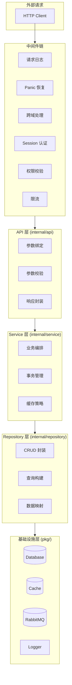
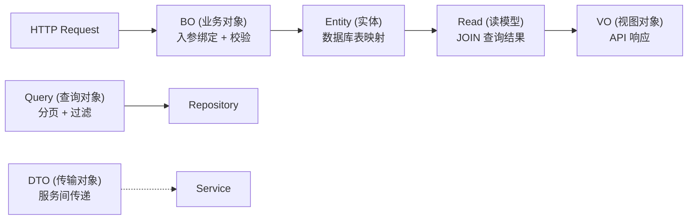
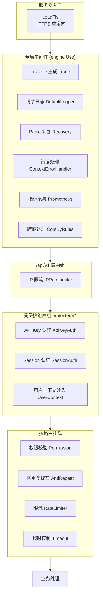
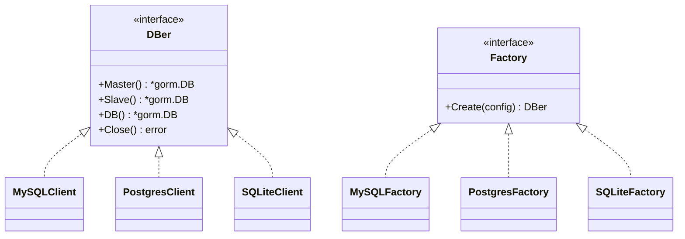
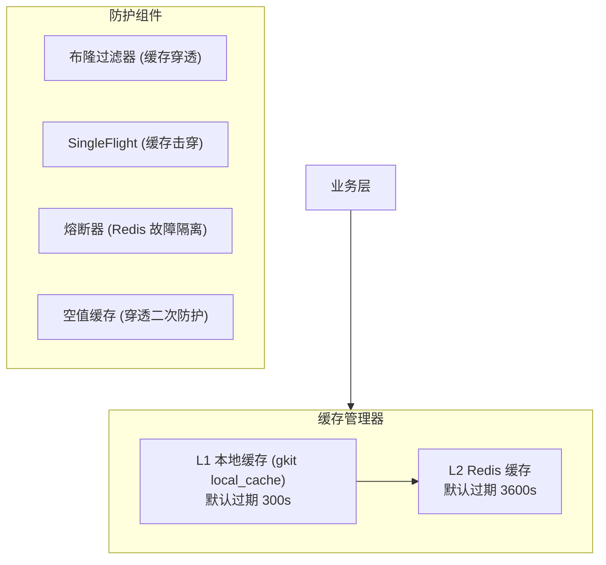
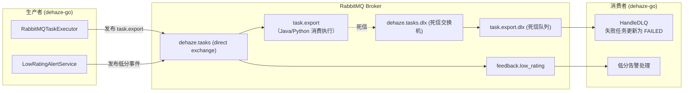
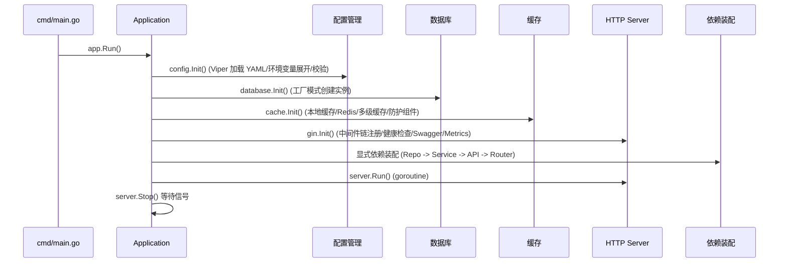

# Go 后端 (dehaze-go)

基于 Go 1.25、Gin、GORM、Redis 构建的前后端分离图像去雾系统后端，涵盖用户/角色/菜单/部门/字典等系统管理，以及去雾预测、效果评估、数据集、异步任务、会员配额、订单支付、算法选择、收藏、推荐、反馈评分、消息通知等核心业务模块。

> 构建/运行/测试说明见项目根目录的 `README.md`。

## 一、分层架构



### 层级职责

| 层级 | 包路径 | 职责 | 依赖方向 |
|------|--------|------|----------|
| 中间件链 | `pkg/server/gin/middleware/` | 请求拦截、认证、鉴权、限流、日志 | 外部请求 |
| API 层 | `internal/api/` | 参数绑定与校验、调用 Service、统一响应 | -> Service |
| Service 层 | `internal/service/` | 业务逻辑编排、事务边界、缓存交互 | -> Repository + pkg |
| Repository 层 | `internal/repository/` | 数据库 CRUD、SQL 构建 | -> GORM |
| 基础设施层 | `pkg/` | 配置、数据库、缓存、MQ、日志等基础能力 | 被所有层依赖 |

### 依赖注入策略

采用构造函数注入，在 `internal/app/app.go` 的 `Init()` 方法中完成全部 wiring：

```
配置初始化 -> 日志初始化 -> 数据库初始化 -> 缓存初始化
    -> HTTP Server 初始化 -> Validator 初始化
    -> Repository 实例化 -> Service 实例化 -> API 实例化 -> 路由注册
```

选择显式 wiring 而非 Wire/Dig 等 DI 框架，原因是项目规模适中，显式构造更易调试和理解。

### 数据模型分层



| 模型类型 | 包路径 | 职责 | 示例 |
|----------|--------|------|------|
| Entity | `model/` (根目录) | 数据库表映射，GORM 标签 | `SysUser` |
| BO | `model/bo/` | 请求入参绑定、校验标签 | `UserForm` |
| VO | `model/vo/` | API 响应输出 | `UserPageVO` |
| Query | `model/query/` | 分页查询条件 | `UserPageQuery` |
| Read | `model/read/` | 数据库 JOIN 查询映射 | `UserPageWithRoles` |
| DTO | `model/dto/` | 服务间数据传输 | `LoginResult` |
| Enum | `model/enum/` | 枚举常量定义 | `MenuType` |

## 二、项目目录结构

```
dehaze-go/
├── cmd/                        # 应用入口
│   └── main.go                 # 启动入口
├── config/                     # 配置文件
│   ├── config.yaml             # 主配置（开发环境）
│   └── config.test.yaml        # 测试环境配置
├── internal/                   # 内部业务代码（不对外暴露）
│   ├── api/                    # Controller 层（请求处理）
│   ├── service/                # Service 层（业务逻辑）
│   ├── repository/             # Repository 层（数据访问）
│   ├── model/                  # 数据模型（sys_*.go / bo/ / dto/ / vo/ / query/ / read/ / enum/）
│   ├── router/                 # 路由注册
│   └── app/                    # 应用初始化、生命周期与依赖装配
└── pkg/                        # 可复用基础设施包
    ├── algorithm/              # Python 算法服务 HTTP 客户端（重试/熔断/幂等）
    ├── cache/                  # 多级缓存体系（local/multilevel/protection/redis）
    ├── common/                 # 公共类型（响应、错误码、分页、BizError）
    ├── config/                 # 配置管理（Viper + 环境变量展开）
    ├── database/               # 数据库抽象层（工厂模式 + Callback + DataScope + 软删除）
    ├── job/                    # 定时任务（会员/订单/消息/公告/清理）
    ├── logger/                 # 日志系统（Zap）
    ├── metrics/                # 业务 Prometheus 指标
    ├── mongo/                  # MongoDB 初始化
    ├── mq/                     # 消息队列（RabbitMQ）
    ├── security/               # 安全组件（Session/RBAC/验证码）
    ├── server/                 # HTTP 服务器
    │   └── gin/                # Gin HTTP 服务器
    │       └── middleware/     # 中间件链
    ├── storage/                # 文件存储抽象（minio/local/nginx-static）
    ├── trace/                  # TraceID 生成与 context 传播
    ├── validator/              # 参数校验（中文翻译）
    ├── utils/                  # 工具函数（树形/哈希/XSS/SQL 注入防护）
    ├── websocket/              # WebSocket 连接管理（Redis Pub/Sub 跨实例广播）
    └── xxljob/                 # XXL-Job 执行器
```

测试以 `*_test.go` 形式分散在各包内，无独立 test 目录。

## 三、核心模块

### 3.1 安全认证模块

| 组件 | 实现 | 说明 |
|------|------|------|
| Session 认证 | `pkg/server/gin/middleware/session.go` | Redis 存储 Session（前缀 `session:`），TTL 7 天，剩余 < 24h 自动续期 |
| API Key 认证 | `pkg/server/gin/middleware/api_key_auth.go` + `internal/service/api_key/` | 处理 `Bearer dhak_*` 凭证，Key 以 sha256 哈希存储，在 SessionAuth 之前注册 |
| Claims | `pkg/security/claims.go` | 自定义 Claims 结构，从 `gin.Context` 获取 |
| 验证码 | `pkg/security/captcha.go` | base64Captcha，支持次数限制和超时 |

RBAC 权限模型：

```
用户 -> 角色（多对多） -> 权限标识（多对多）
权限格式: 模块:功能:操作（如 sys:user:add）
```

### 3.2 中间件链

中间件分两层挂载：全局中间件由 `engine.Use` 统一注册，作用于所有请求；路由组中间件按 `/api/v1` 与受保护路由组分级挂载。



| 中间件 | 文件 | 挂载位置 | 说明 |
|------|------|----------|------|
| Trace | `trace.go` | 全局 | 生成/提取 TraceID（`X-Trace-ID` / `traceparent` / `sw8`） |
| DefaultLogger | `logger.go` | 全局 | 请求访问日志 |
| Recovery | `recovery.go` | 全局 | panic 恢复 + zap 日志 |
| ContextErrorHandler | `error_handler.go` | 全局 | 统一处理 `c.Error`（含 validator 中文翻译） |
| Prometheus | `prometheus.go` | 全局 | HTTP 指标采集 + `/metrics` 端点 |
| CorsByRules | `cors.go` | 全局 | 白名单跨域，生产强制白名单 |
| IPRateLimiter | `rate_limit.go` | `/api/v1` 组 | 全局 IP 限流兜底 |
| ApiKeyAuth | `api_key_auth.go` | 受保护组 | `Bearer dhak_*` API Key 认证 |
| SessionAuth | `session.go` | 受保护组 | Redis Session 认证（TTL 7 天，自动续期） |
| UserContext | `auto_fill_user.go` | 受保护组 | 注入 userID/deptID/dataScope，供 GORM 回调与 DataScope 使用 |
| Permission | `permission.go` | 按路由 | RBAC 权限校验，超管放行 |
| AntiRepeat | `anti_repeat.go` | 按路由 | Redis 锁防重复提交 |
| RateLimiter | `rate_limit.go` | 按路由 | User/Global/Path 维度限流（Redis 后端） |
| Timeout | `timeout.go` | 按路由 | 请求超时控制 |
| LoadTls | `tls.go` | 服务器入口 | HTTP → HTTPS 重定向 |

中间件文件共 14 个，其中 `rate_limit.go` 同时提供 IPRateLimiter / UserRateLimiter / GlobalRateLimiter / PathRateLimiter 等多种限流器。

### 3.3 数据访问层

| 组件 | 选型 | 说明 |
|------|------|------|
| ORM | GORM v2 | 自动迁移、Callback、Plugin（DataScope） |
| 数据库驱动 | MySQL / PostgreSQL / SQLite | 工厂模式，通过配置切换 |
| 连接池 | GORM 内置 | MaxIdleConns / MaxOpenConns 可配 |

数据库抽象层通过工厂模式 + 驱动注册机制实现多数据库支持：



各驱动通过 `init()` 调用 `database.RegisterFactory()` 完成自注册。DBer 接口提供 Master/Slave 语义，SQLite 的 Slave() 直接返回 Master() 实例。

GORM Callback 增强（时间字段 `create_time`/`update_time` 由 GORM `autoCreateTime`/`autoUpdateTime` 标签处理，非 Callback 填充）：

| Callback | 注册点 | 功能 |
|----------|----------|------|
| `auto_fill_create_by` | `Create().Before("gorm:create")` | 从上下文填充 `create_by`、`update_by` |
| `auto_fill_update_by` | `Update().Before("gorm:update")` | 从上下文填充 `update_by`（兼容 struct/Map/slice） |
| `data_scope:query` / `data_scope:row` | `Query()/Row().Before("gorm:query"|"gorm:row")` | 行级数据权限过滤（DataScope Plugin） |
| `soft_delete:query` / `soft_delete:row` | `Query()/Row().Before("gorm:query"|"gorm:row")` | 自动追加 `deleted = 0` |

数据权限（DataScope）以 GORM Plugin 形式通过 `db.Use(plugin)` 注册，注册在 `Before("gorm:query")` 与 `Before("gorm:row")`，采用白名单模式：仅显式配置的表（当前 `sys_user`、`sys_dept`）被过滤。权限范围共 4 档：

| 权限范围 | 常量 | SQL 效果 |
|----------|------|----------|
| 全部数据 | `DataScopeAll(0)` | 无附加条件 |
| 部门及子部门 | `DataScopeDeptTree(1)` | `WHERE dept_id IN (递归子部门)` |
| 本部门数据 | `DataScopeDept(2)` | `WHERE dept_id = ?` |
| 本人数据 | `DataScopeSelf(3)` | `WHERE create_by = ?` |

UserContextMiddleware 从 Session 上下文提取身份后注入到 request context，GORM 通过 `db.Statement.Context` 透传到 dataScopeCallback 实现行级数据权限过滤；异步任务等无身份上下文的场景默认返回 `DataScopeAll` 避免误过滤，亦可通过 `db.InstanceSet("skip_data_scope", true)` 显式跳过。

逻辑删除通过 `RegisterSoftDeleteCallback` 对所有包含 `Deleted` 字段的模型自动追加 `deleted = 0` 条件，`Unscoped()` 可跳过该过滤。

### 3.4 缓存体系



多级缓存读写流程：L1 -> L2 -> DB -> 回写 L2 -> 回写 L1。缓存写操作：写 DB -> 删除 L2 -> Pub/Sub 广播删除所有实例 L1。

### 3.5 消息队列



默认交换机 `dehaze.tasks`（direct 类型），队列 TTL 24h，死信交换机 `dehaze.tasks.dlx`，死信队列为 `<queue>.dlx`。Go 端仅发布 `task.export` 任务消息（三端统一契约 `{db_task_id, task_id, task_type}`），**不消费 `task.export` 主队列**（由 Java/Python 执行任务），仅消费其死信队列 `task.export.dlx` 将失败任务状态更新为 FAILED；同时消费 `feedback.low_rating` 主队列处理低分告警。

### 3.6 通用导入导出

Handler 模式 + 通用策略实现：

| 模块 | ExportHandler | ImportHandler |
|------|--------------|--------------|
| 用户管理 | UserExportHandler | UserImportHandler |
| 角色管理 | RoleExportHandler | RoleImportHandler |
| 部门管理 | DeptExportHandler | DeptImportHandler |
| 菜单管理 | MenuExportHandler | MenuImportHandler |
| 字典管理 | DictExportHandler | DictImportHandler |
| 数据集管理 | DatasetExportHandler | -（仅导出） |
| 算法管理 | AlgorithmExportHandler | AlgorithmImportHandler |

### 3.7 去雾预测模块

| 组件 | 实现 | 说明 |
|------|------|------|
| PredictionService | `internal/service/prediction/` | 预测任务提交/异步执行/状态查询/批量预测/配额查询 |
| PresetService | `internal/service/preset/` | 参数预设管理（系统预设 + 用户自定义，按会员等级限制数量） |
| MemberService（配额） | `internal/service/member/` | 去雾与评估双配额校验/扣减/回补（详见 3.12） |

Predict 流程：校验算法 → `MemberService.CheckAndDeductQuota` 扣减去雾配额 → 以 `prediction:{algorithmID}:{imageMD5}` 为 key 查 Redis 缓存（TTL 24h）→ 写 `sys_pred_log`(processing) → 启动 goroutine 异步执行。异步执行通过 `pkg/algorithm` 的 HTTP 客户端调用 Python（POST `/api/v1/prediction`），返回 processing 则轮询状态（2s 间隔、5min 超时）；失败时 `RefundQuota` 回补配额，成功后回写缓存。

批量预测为顺序循环提交（每项各自启动 goroutine 异步执行），批量上限来自会员等级权益 `sys_member_benefit.batch_limit`，硬上限 20 张。Python 调用客户端内置连接池、指数退避重试、熔断器、幂等键（`X-Idempotency-Key`）与 traceID 透传、Bearer API Key 认证。

### 3.8 效果对比与评估模块

| 组件 | 实现 | 说明 |
|------|------|------|
| CompareService | `internal/service/compare/` | 对比报告生成与查询（本地拼装 HTML） |
| EvaluationService | `internal/service/evaluation/` | 评估指标计算（委托 Python） |

CompareService.GenerateReport 读取 `sys_pred_log` 完成记录，创建 `sys_eval_log`(processing) 后异步生成报告，HTML 在 Go 本地拼装（不调用 Python），结果以 JSON 存入 `sys_eval_log.result`。

EvaluationService 独立于 CompareService，通过 `pkg/algorithm` 调用 Python（POST `/api/v1/evaluation`）计算 PSNR/SSIM/LPIPS/NIQE/Entropy，返回 processing 则轮询（2s 间隔、5min 超时），扣减评估配额，失败回补；指标以 `map[string]float64` 存入 `sys_eval_log.result`。两者不互相调用，仅复用 evalRepo 存储任务记录。

### 3.9 算法管理与选择模块

| 组件 | 实现 | 说明 |
|------|------|------|
| AlgorithmService | `internal/service/algorithm/` | 算法元数据 CRUD、状态机校验、级联删除、监控统计 |
| AlgorithmSelectService | `internal/service/algorithm_select/` | 用户端算法选择（树形/详情/搜索/单图测试/多算法对比） |

AlgorithmService 面向管理端，通过 `TreeDataUtils` 收集子孙节点级联删除，`UpdateStatus` 用状态机校验流转合法性，`GetMonitorStatsReport` 按日聚合 `sys_pred_log` 填充无数据日期。

AlgorithmSelectService 面向用户端，仅暴露已发布算法（status=4），`GetDetail` 聚合基本信息、评分分布（`sys_rating`）、使用次数与样例效果图（最近 3 条完成记录）；`Test` 委托 PredictionService 执行单次预测；`Compare` 最多 3 个算法并行预测并计算平均耗时与成功率。搜索基于 GORM 预加载 + Joins 关联分类查询。

### 3.10 收藏管理模块

| 组件 | 实现 | 说明 |
|------|------|------|
| FavoriteService | `internal/service/favorite/` | 收藏管理（5 种 target_type、容量校验、状态查询） |

FavoriteService 通过 GORM 模型 `SysFavorite` 映射 `sys_favorite` 表，支持 algorithm/result/dataset/image/preset 五类目标，容量按会员等级限制（普通 200 / VIP 500）。写入采用 `clause.OnConflict` 实现收藏幂等复活：取消后再次收藏时走 `ON DUPLICATE KEY UPDATE` 复活原软删行（`deleted=0`、`is_invalid=0`），不插入新行，原 id 保持不变（详见 [数据库设计 §5.3.1](../../02-系统架构/03-数据库设计.md) 类别①）。收藏状态批量查询通过 `WHERE user_id=? AND target_type=? AND target_id IN (?)` 单次查询返回已收藏 ID 集合。

### 3.11 推荐管理模块

| 组件 | 实现 | 说明 |
|------|------|------|
| RecommendationService | `internal/service/recommendation/` | 图像分析 + 规则匹配 + 算法推荐 + 反馈报表 |

图像特征分析 `Analyze` 通过 `pkg/algorithm.Client.AnalyzeImage` 调用 Python 图像特征分析服务（POST `/api/v1/recommendations/analyze`），获取真实图像特征（雾浓度/场景类型/光照/分辨率/噪声等级/颜色分布/复杂度），Python 服务不可用时返回错误而非降级为伪特征，避免误导用户；`matchRulesByScene` 按 sceneType 过滤规则并按权重降序排序；`GetAlgorithmRecommendations` 顺序执行规则匹配 → 查询已发布算法 → 计分排序 → 取 topN=3。规则缓存用 `sync.RWMutex` 保护的内存切片，规则变更时整体刷新（非 Redis、非 Viper 热加载）。`GetReport` 统计采纳率/满意度/覆盖率与每日趋势。

### 3.12 会员与配额模块

| 组件 | 实现 | 说明 |
|------|------|------|
| MemberService | `internal/service/member/` | 会员资料/等级/权益/成长值/签到/配额/月度重置/到期降级 |

配额扣减 `CheckAndDeductQuota` 使用 Redis `DECR` 原子递减（key `member:quota:{userID}:{quotaType}`，TTL 35 天），缓存不可用或 DECR 失败时降级为数据库校验，成功后 `go asyncPersistQuotaUsed` 异步落库；`RefundQuota` 用 `INCR` 回补。覆盖去雾与评估双配额。月度配额重置用 Redis 分布式锁防多实例重复，分页（batchSize=500）处理并归档历史；签到在事务内写成长值流水并自动升级等级（每 7 天额外加成）。多级 Redis 缓存：profile(10min)、benefit(30min)、quota counter(35d)。

### 3.13 数据集模块

| 组件 | 实现 | 说明 |
|------|------|------|
| DatasetService | `internal/service/dataset/` | 数据集元数据树形管理与统计 |
| DatasetItemService | `internal/service/dataset/` | 数据集项 CRUD 与文件关联 |
| DatasetOperationService | `internal/service/dataset/` | 批量上传、级联删除、配对图片校验 |

复杂操作（批量上传/级联删除/配对校验）通过 `AsyncTaskExecutor` 发布异步任务，配对图片校验保证训练数据一致性。元数据多级 Redis 缓存（all/tree/stats，TTL 30min~1h）。

### 3.14 异步任务模块

| 组件 | 实现 | 说明 |
|------|------|------|
| TaskService | `internal/service/task/` | 通用异步任务创建/分页/取消/状态更新 |
| RabbitMQTaskExecutor | `internal/service/task/` | 任务消息发布（routingKey `task.export`） |

采用策略模式，`GenericExportStrategy`/`GenericImportStrategy` 委托 `ImportExportService` 执行导入导出，`NewAsyncTaskExecutor` 工厂按配置选择执行器（当前 rabbitmq，可扩展 kafka/local）。任务发布用 Redis 分布式锁防重复，幂等键 `idempotency:task:`（24h），进度节流（2s/5%）与三端对齐。Go 端仅消费 `task.export` 死信队列将失败任务更新为 FAILED（主队列由 Java/Python 消费执行）。

### 3.15 订单与支付模块

| 组件 | 实现 | 说明 |
|------|------|------|
| OrderService | `internal/service/order/` | 订单全生命周期（创建/支付回调/退款/自动续费/过期） |
| PaymentChannelService | `internal/service/payment/` | 统一支付网关（alipay/wechat 双通道） |
| PackageService / CouponService | `internal/service/pkgsale/` | 套餐与优惠券管理 |

PaymentChannelService 按 `adapters` map 路由到 `AlipayAdapter`（支付宝预下单二维码）/`WechatPayAdapter`（微信 v3 Native 支付），未启用渠道降级为 `MockChannelAdapter`。OrderService 用 Redis 锁防重复下单（`order:create:lock`）与回调重复处理（`payment:callback:lock`），30 分钟未支付过期，自动续费失败 3 次终止。

### 3.16 反馈与评分模块

| 组件 | 实现 | 说明 |
|------|------|------|
| FeedbackService | `internal/service/feedback/` | 用户反馈（每日 5 次限流） |
| RatingService | `internal/service/feedback/` | 算法评分（30 天内可评，奖励成长值） |
| LowRatingAlertService | `internal/service/feedback/` | 低分告警（rating≤2，RabbitMQ 发布事件） |

低分告警通过 RabbitMQ 队列 `feedback.low_rating` 发布事件，含 urgent/severe 阈值与 24h 窗口判定。评分奖励成长值 5（每日上限 5 次），含正向/负向标签集。

### 3.17 消息通知模块

| 组件 | 实现 | 说明 |
|------|------|------|
| MessageService | `internal/service/message/` | 站内信发送（模板变量、幂等去重、WebSocket 推送） |
| AnnouncementService | `internal/service/message/` | 公告管理（定时发送/过期/目标范围） |
| MessageTemplateService / NotificationSettingService | `internal/service/message/` | 消息模板 CRUD / 用户通知设置 |

站内信支持模板变量 `{var}` 正则替换与 `bizModule+bizID` 幂等去重，未读数 Redis 缓存（`msg:unread:` 1h），通过 `pkg/websocket` 推送实时通知（Redis Pub/Sub 频道 `dehaze:ws:broadcast` 实现跨实例广播）。

### 3.18 日志审计模块

| 组件 | 实现 | 说明 |
|------|------|------|
| AuditLogService | `internal/service/audit_log/` | 审计日志（MongoDB，同步 + 异步） |
| LoginLogService | `internal/service/login_log/` | 登录日志（MongoDB） |

审计日志与登录日志均存储于 MongoDB（由 `pkg/mongo` 初始化）。AuditLogService 支持异步记录（5s 超时 ctx + panic recover），避免阻塞主流程；LoginLogService 记录 userID/username/IP/location/browser/os/status/message。

## 四、配置管理

| 组件 | 选型 | 说明 |
|------|------|------|
| 配置加载 | Viper | YAML 格式、环境变量覆盖、文件监听 |
| 环境变量 | godotenv + `os.ExpandEnv` | `.env` 文件 + `${VAR}` 语法展开 |
| 配置校验 | go-playground/validator | 结构体标签校验 |

多环境支持：

| 环境 | Gin Mode | 特性差异 |
|------|----------|----------|
| 开发 | debug | 控制台彩色日志、Swagger 启用 |
| 测试 | test | SQLite 内存数据库、本地缓存 |
| 生产 | release | Release 模式、Swagger 禁用 |

**`GIN_MODE` 环境变量决定配置文件名**：`debug`（默认）→ `config.yaml`、`release` → `config.prod.yaml`、`test` → `config.test.yaml`。配置文件加载发生在 `gin.SetMode` 之前，因此由 `GIN_MODE` 驱动，而非仅靠配置内 `system.env` 字段。

SQL 日志级别同样随环境切换（见 [日志架构设计 §5.5](../../02-系统架构/07-日志架构设计.md)）：生产部署设置 `GIN_MODE=release` 后，`config.prod.yaml` 中 `db.log-mode: warn` 即仅记录慢查询与 SQL 错误；`system.env: prod` 同时触发 Gin 生产行为（关闭 Swagger、禁用 debug 堆栈）。

敏感信息通过环境变量注入，YAML 中使用 `${ENV_VAR}` 占位符。

## 五、应用生命周期

### 启动流程



### 优雅关闭

收到 SIGINT/SIGTERM -> `lifecycle.Manager` 取消应用级 context（异步 goroutine 感知退出） -> HTTP Server 5s 超时关闭 -> `lifecycle.Manager.Wait()` 等待异步 goroutine 完成 -> 缓存连接关闭 -> 数据库连接关闭 -> 日志 Sync。

应用级 context 与 `sync.WaitGroup` 由 `pkg/lifecycle/Manager` 统一管理：启动时创建 root context，异步 goroutine（预测执行、配额异步落库）派生该 context；shutdown 时 cancel，关键异步任务（配额落库）在 WaitGroup 中等待完成，避免静默丢失数据。

配置热更新基于 `fsnotify` 文件监听，配置变更后自动触发 Viper 重新解析并通知各组件。

本地开发统一通过项目根目录 `scripts/run.py` 管理三端后端的生命周期。

## 六、统一响应与错误处理

错误码采用 5 位字符串编码，与 Java/Python 端保持一致：

| 前缀 | 类别 | 示例 |
|------|------|------|
| `00` | 成功 | `00000` - 操作成功 |
| `A0` | 用户端错误 | `A0001` - 用户端错误, `A0100` - 登录异常 |
| `B0` | 系统执行错误 | `B0001` - 系统执行出错 |
| `C0` | 第三方服务错误 | `C0001` - 调用第三方服务出错 |

通过 `BizError` 结构体承载业务错误，中间件 `ContextErrorHandler` 统一拦截并格式化输出。

## 七、技术栈总览

| 分类 | 技术 | 用途 |
|------|------|------|
| 语言 | Go 1.25.0 | 后端开发语言 |
| HTTP 框架 | Gin v1.11 | HTTP 路由、中间件 |
| ORM | GORM v1.31 | 数据库操作 |
| 缓存 | go-redis + gkit local_cache | Redis 客户端 + 本地缓存 |
| 消息队列 | amqp091-go | RabbitMQ 客户端 |
| 文档存储 | mongo-driver v1.17 | 审计日志、登录日志 |
| 实时通信 | gorilla/websocket v1.5 | 站内信实时推送 |
| 任务调度 | xxl-job-executor-go v1.2 | 分布式定时任务 |
| 文件存储 | minio-go v7.2 | 对象存储（minio/local/nginx-static 多后端） |
| 日志 | Zap v1.27 | 结构化日志 |
| 配置 | Viper v1.21 | 配置管理 |
| 认证 | Redis Session + API Key | Session 认证（TTL 7 天，自动续期）+ `dhak_*` API Key |
| 限流 | ulule/limiter | IP/User/Global/Path 限流 |
| 监控 | prometheus/client_golang | 指标采集 |
| 文档 | swag + gin-swagger | Swagger API 文档 |
| 校验 | go-playground/validator | 参数校验 |
| 安全 | bluemonday | XSS 过滤 |
| Excel | excelize v2.9 | Excel 导入导出 |

## 八、关键技术决策

| 决策 | 选择 | 理由 |
|------|------|------|
| 语言 | Go | 高并发场景性能优势，goroutine 轻量协程 |
| 框架 | Gin | 高性能 HTTP 框架，中间件生态丰富 |
| DI 策略 | 显式构造函数注入 | 项目规模适中，显式构造更易调试 |
| ORM | GORM | 自动迁移、Callback、Plugin 扩展机制 |
| 数据库抽象 | 工厂模式 + 驱动注册 | MySQL/PostgreSQL/SQLite 零修改切换 |
| 缓存 | 多级缓存 (gkit L1 + Redis L2) | 布隆过滤器 + SingleFlight + 熔断器多层防护 |
| 消息队列 | RabbitMQ | 与 Java/Python 端统一中间件 |
| 日志 | Zap | 高性能结构化日志 |
| 配置 | Viper | YAML + 环境变量 + 热更新 |
| 收藏统一抽象 | `sys_favorite` 表 + `target_type` 区分 | 与 Java 端统一设计，GORM `OnConflict` 实现幂等收藏（取消后再收藏复活原软删行，原 id 不变） |
| 推荐引擎选型 | 规则匹配引擎 | 规则可解释、快速上线；规则缓存用 `sync.RWMutex` 内存切片，变更时整体刷新；图像特征分析通过 HTTP 调用 Python 算法服务提取真实特征（PyTorch 场景分类 + OpenCV 暗通道/直方图），Python 服务不可用时返回错误而非降级伪特征 |
| VIP 配额校验 | Redis `DECR` 原子扣减 + 异步落库 | go-redis DECR 保证并发安全，缓存不可用降级数据库校验，失败 `INCR` 回补，覆盖去雾与评估双配额 |

## 九、设计原则与约束

- **显式依赖装配**：构造函数注入，拒绝 DI 框架，wiring 集中于 `internal/app/app.go` 的 `Init()`，依赖关系一目了然、便于调试。
- **工厂模式 + 驱动自注册**：数据库、文件存储、支付渠道均通过 `init()` 注册工厂，配置切换实现零改码（如 MySQL/PostgreSQL/SQLite、minio/local/nginx-static、alipay/wechat）。
- **三端契约统一**：错误码（`00`/`A0`/`B0`/`C0` 五位字符串）、MQ 任务消息体（`{db_task_id, task_id, task_type}`）、配置文件名由 `GIN_MODE` 驱动，与 Java/Python 端对齐。
- **跨语言职责分工**：Go 负责业务编排与并发调度，预测/评估/指标计算委托 Python 算法服务，统一通过 `pkg/algorithm` 客户端（重试/熔断/幂等/traceID）调用。
- **防护纵深**：多级缓存（L1 local + L2 Redis）叠加布隆过滤器/SingleFlight/熔断器/空值缓存；配额扣减 DECR 原子 + 异步落库 + 失败回补；任务发布分布式锁防重复、幂等键去重。
- **数据安全**：行级数据权限（DataScope Plugin 白名单模式）+ 逻辑删除（`deleted=0` 自动追加）+ XSS/SQL 注入防护（`pkg/utils`）；异步任务等无身份上下文场景默认 `DataScopeAll` 避免误过滤。
- **配置驱动**：YAML + 环境变量 `${VAR}` 展开 + fsnotify 热更新，敏感信息通过环境变量注入、不入库。
