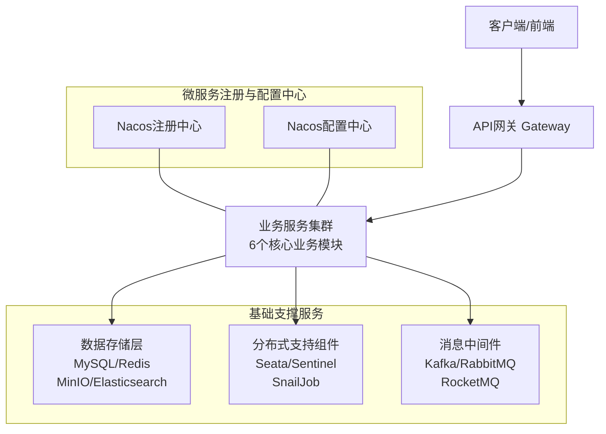
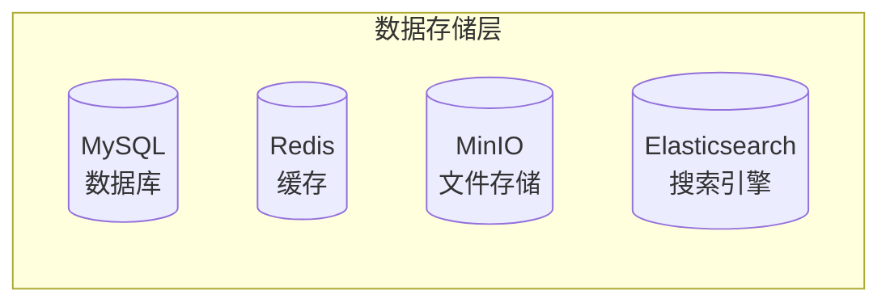
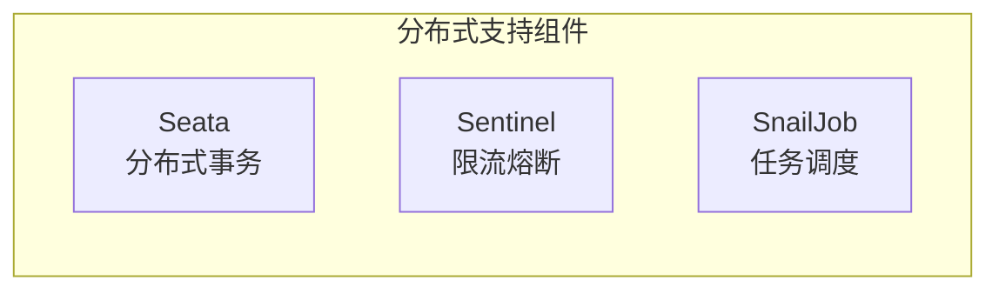
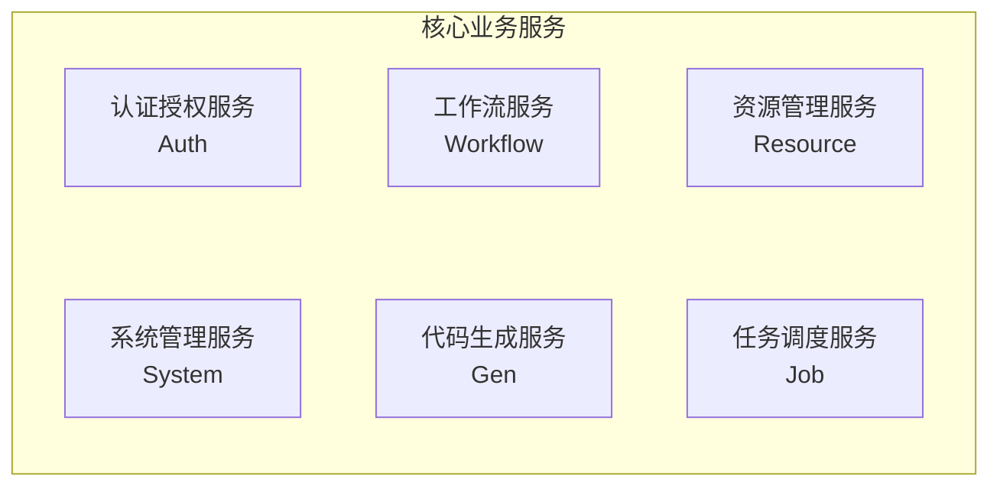

# Java 微服务版 (dehaze-java-cloud)

基于 RuoYi-Cloud-Plus 微服务架构构建的图像去雾系统，旨在提供一个高性能、可扩展的图像处理平台。系统采用现代化微服务技术架构，集成 34 种主流去雾算法，提供完整的端到端图像去雾解决方案。

> 构建/运行/测试说明见项目根目录的 `README.md`。

## 核心特性

- **🎯 智能去雾**: 集成 34 种主流去雾算法（RIDCP、WPXNet、Dehamer 等），基于深度学习实现高质量图像恢复
- **🌐 微服务架构**: 基于 Spring Cloud Alibaba 的微服务架构，支持服务治理、配置管理、熔断限流等企业级特性
- **⚡ 高性能处理**: 异步任务处理、Redis 缓存优化、GPU 加速推理，提高系统吞吐量
- **🔐 安全可靠**: JWT + RBAC 权限模型、Redisson 分布式锁、完善的安全防护机制
- **📱 多端支持**: Web 端管理后台，配合 Android App、React Native 等多端应用

## 系统架构图

### 微服务整体架构图

### 数据存储层详细架构图

### 分布式支持组件详细架构图

### 核心业务服务详细架构图

## 系统技术特性

| 功能 | 技术实现 |
|------|------|
| 前端项目 | 支持 Vue3、React、Taro 多技术栈，采用 TypeScript 语言，Element Plus / Ant Design 等 UI 库，Vite 构建工具，支持 Web、移动端、桌面端多端应用 |
| 微服务架构 | 基于 Spring Cloud Alibaba 微服务架构，服务拆分清晰，包含网关、认证、系统管理、资源管理等核心服务，支持服务注册发现、配置管理、负载均衡等微服务特性 |
| 代码规范 | 严格遵守 Alibaba 开发规范，采用统一的代码格式化标准，确保代码风格一致性和可维护性 |
| 分布式注册中心 | 集成 Alibaba Nacos 作为服务注册与发现中心，支持服务实例的自动注册与健康检查 |
| 分布式配置中心 | 基于 Alibaba Nacos 实现配置管理，支持配置的动态更新和多环境配置管理 |
| 服务网关 | 采用 Spring Cloud Gateway 作为 API 网关，提供路由转发、权限校验、请求限流、跨域处理、日志记录等功能 |
| 负载均衡 | 集成 Spring Cloud LoadBalancer 实现客户端负载均衡，支持服务实例的负载分发和故障转移 |
| RPC 远程调用 | 采用 Apache Dubbo 3.X 作为 RPC 框架，提供高性能的服务间通信能力 |
| 分布式限流熔断 | 集成 Alibaba Sentinel 实现流量控制、熔断降级、系统自适应保护等稳定性保障功能 |
| 分布式事务 | 集成 Alibaba Seata 实现分布式事务管理，支持 AT、TCC、Saga 等事务模式 |
| Web 容器 | 采用 Undertow 作为 Web 服务器，基于 XNIO 高性能异步 IO 框架，提供卓越的并发处理能力 |
| 权限认证 | 集成 Sa-Token 和 JWT 实现认证授权机制，支持 Token 签发、验证、续期、黑名单管理等功能 |
| 权限注解 | 基于 Sa-Token 提供细粒度权限控制注解，支持登录校验、角色校验、权限校验、二级认证校验等多种安全控制 |
| 关系数据库支持 | 基于 MyBatis-Plus 支持 MySQL、Oracle、PostgreSQL、SQLServer 等主流关系型数据库，支持多数据源和动态数据源切换 |
| 缓存数据库 | 集成 Redis 作为分布式缓存，支持数据缓存、分布式锁、会话存储、消息队列等高级功能 |
| Redis 客户端 | 采用 Redisson 作为 Redis 客户端，基于 Netty 的 NIO 框架，支持 Redis 大部分命令和高级特性，包括分布式锁、分布式集合等 |
| 缓存注解 | 基于 Spring Cache 提供注解式缓存支持，支持缓存过期时间、最大空闲时间、缓存容量控制等高级配置 |
| ORM 框架 | 采用 MyBatis-Plus 作为持久层框架，提供代码生成、分页插件、乐观锁、多租户等企业级特性 |
| SQL 监控 | 集成 p6spy 实现 SQL 执行监控，可实时查看 SQL 语句和执行时间 |
| 数据分页 | 基于 MyBatis-Plus 分页插件实现数据分页功能，支持多种参数传递方式和复杂排序需求 |
| 数据权限 | 采用 MyBatis-Plus 插件实现数据权限控制，通过 SQL 拦截器自动拼接数据权限过滤条件 |
| 数据脱敏 | 基于 Jackson 序列化期间实现数据脱敏处理，支持多种脱敏策略如身份证、手机号、地址等 |
| 数据加解密 | 采用 MyBatis 拦截器实现数据加解密处理，支持 BASE64、AES、RSA、SM2、SM4 等多种加密算法 |
| 数据翻译 | 基于 Jackson 序列化期间实现数据动态翻译，支持映射翻译、直接翻译等多种翻译模式 |
| 多数据源框架 | 集成 dynamic-datasource 支持多数据源管理，可通过 YAML 配置动态管理异构数据库，支持 SpEL 表达式动态切换数据源 |
| 多数据源事务 | 基于 dynamic-datasource 实现多数据源事务管理，支持跨数据源事务回滚 |
| 数据库连接池 | 采用 HikariCP 作为数据库连接池，提供高性能和稳定性 |
| 数据库主键 | 采用雪花算法生成全局唯一 ID，支持分布式环境下的主键唯一性 |
| WebSocket 协议 | 基于 Spring WebSocket 实现，支持 Token 鉴权和分布式会话同步 |
| SSE 推送 | 采用 Spring SSE 实现服务器推送功能，支持 Token 鉴权和分布式会话同步 |
| 序列化 | 采用 Jackson 作为 JSON 序列化框架，提供高性能和可靠的序列化能力 |
| 分布式幂等 | 基于 Redis 实现分布式幂等控制，防止重复提交和重复操作 |
| 分布式任务调度 | 集成 SnailJob 实现分布式任务调度，支持任务分片、重试、DAG 任务流等高级特性 |
| 分布式日志中心 | 集成 ELK 实现分布式日志收集和分析，支持实时日志查询和问题定位 |
| 分布式搜索引擎 | 集成 ElasticSearch 和 Easy-Es 实现全文检索功能，支持基于 MyBatis-Plus 风格的 ES 操作 |
| 分布式消息队列 | 支持 Kafka、RocketMQ、RabbitMQ 等主流消息中间件，支持延迟消息、事务消息、流式消息处理 |
| 分布式消息总线 | 集成 Spring Cloud Bus 实现事件总线功能，支持跨服务通知和配置刷新 |
| 分布式分库分表 | 集成 Apache Sharding-Proxy 实现分库分表功能，支持透明化数据库访问 |
| 文件存储 | 集成 Minio 实现分布式文件存储，支持多机、多硬盘、多分片、多副本存储，具备权限管理和文件加密功能 |
| 云存储 | 支持 AWS S3 协议，兼容七牛、阿里云、腾讯云等主流云存储服务 |
| 短信 | 集成阿里云、腾讯云短信服务，支持通过 YAML 配置实现多厂商适配 |
| 邮件 | 采用标准 mail-api 实现邮件发送功能，支持主流邮件服务商 |
| 接口文档 | 集成 SpringDoc 和 javadoc 实现接口文档自动生成，基于 Java 注释零注解入侵式文档生成 |
| 校验框架 | 采用 Validation 实现数据校验功能，支持注解校验和国际化支持 |
| Excel 框架 | 集成 Alibaba EasyExcel 实现 Excel 操作，支持大数据量导入导出和复杂格式处理 |
| 工作流支持 | 集成工作流引擎，支持复杂审批流程、转办、委派、加减签、会签、或签、票签等功能 |
| 工具类框架 | 集成 Hutool 和 Lombok 等工具库，提供丰富的工具类和代码简化功能 |
| 服务监控框架 | 集成 Spring Boot Admin 实现服务监控，基于 Actuator 探针机制，支持在线日志查看和应用状态监控 |
| 全方位监控报警 | 集成 Prometheus 和 Grafana 实现系统监控，支持多样化指标采集、可视化展示和实时报警 |
| 链路追踪 | 集成 Apache SkyWalking 实现分布式链路追踪，支持请求路径分析和性能瓶颈定位 |
| 代码生成器 | 提供代码生成器功能，支持基于表结构一键生成 CRUD 代码和页面，支持多数据源代码生成 |
| 部署方式 | 支持 Docker 容器化部署，提供一键环境搭建脚本，简化部署流程 |
| 国际化 | 支持基于请求头的动态语言切换，提供国际化工具类和注解支持 |
| 代码单例测试 | 提供单例测试支持，集成 Maven 多环境单测插件 |
| Demo 案例 | 提供丰富的功能演示案例，帮助开发者快速上手 |

## 系统业务模块

| 业务 | 功能说明 |
|------|------|
| 租户管理 | 系统内租户的管理 如：租户套餐、过期时间、用户数量、企业信息等 |
| 租户套餐管理 | 系统内租户所能使用的套餐管理 如：套餐内所包含的菜单等 |
| 用户管理 | 用户的管理配置 如：新增用户、分配用户所属部门、角色、岗位等 |
| 部门管理 | 配置系统组织机构（公司、部门、小组） 树结构展现支持数据权限 |
| 岗位管理 | 配置系统用户所属担任职务 |
| 菜单管理 | 配置系统菜单、操作权限、按钮权限标识等 |
| 角色管理 | 角色菜单权限分配、设置角色按机构进行数据范围权限划分 |
| 字典管理 | 对系统中经常使用的一些较为固定的数据进行维护 |
| 参数管理 | 对系统动态配置常用参数 |
| 通知公告 | 系统通知公告信息发布维护 |
| 操作日志 | 系统正常操作日志记录和查询 系统异常信息日志记录和查询 |
| 登录日志 | 系统登录日志记录查询包含登录异常 |
| 文件管理 | 系统文件展示、上传、下载、删除等管理（集成 MinIO） |
| 文件配置管理 | 系统文件上传、下载所需要的配置信息动态添加、修改、删除等管理 |
| 在线用户管理 | 已登录系统的在线用户信息监控与强制踢出操作 |
| 定时任务 | 运行报表、任务管理（添加、修改、删除）、日志管理、执行器管理等 |
| 代码生成 | 多数据源前后端代码的生成（java、html、xml、sql）支持 CRUD 下载 |
| 系统接口 | 根据业务代码自动生成相关的 api 接口文档 |
| 服务监控 | 监视集群系统 CPU、内存、磁盘、堆栈、在线日志、Spring 相关配置等 |
| 缓存监控 | 对系统的缓存信息查询，命令统计等 |
| 在线构建器 | 拖动表单元素生成相应的 HTML 代码 |
| 使用案例 | 系统的一些功能案例 |
| 算法管理 | 去雾算法模型管理、参数配置、动态加载等 |
| 数据集管理 | 去雾图像数据集的管理、上传、展示等 |
| 图像处理 | 图像去雾处理、批量处理、实时处理进度监控等 |

## 核心模块详解

### pei-workflow 工作流模块

**模块定位**：基于 **WarmFlow** 引擎实现的工作流模块，提供流程定义、流程实例管理、任务处理等业务流程自动化能力，是 dehaze-java-cloud 中支持审批流、请假流等业务场景的核心组件。

**核心功能**：

- **流程定义管理**：流程建模、发布、导入/导出（JSON），支持流程分类组织与权限控制
- **流程实例管理**：启动、终止、挂起流程实例，跟踪运行时状态
- **任务处理**：任务签收、完成、退回、指派，支持审批流转
- **流程监听**：监听流程启动、任务创建/完成、流程结束等生命周期事件并触发业务逻辑
- **节点扩展**：通过 `FlwNodeExt` 机制扩展节点属性与流程变量，并内置 TestLeave 请假流程示例

**技术栈**：

| 技术 | 用途 |
|------|------|
| Spring Boot | 微服务应用框架 |
| MyBatis-Plus | 数据库 ORM |
| Apache Dubbo | 服务间 RPC 通信 |
| WarmFlow | 流程引擎核心 |
| Hutool / Lombok | 工具类与代码简化 |

> 模块启动方式、接口文档、完整包结构等细节，详见子项目 `pei-modules/README.md`。
