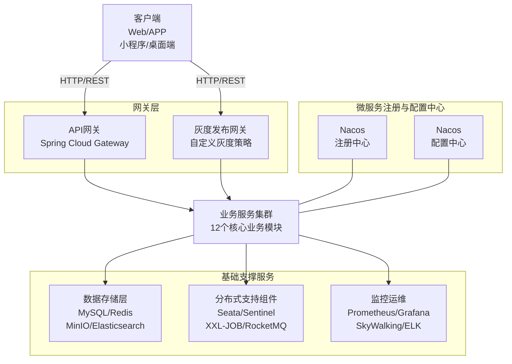
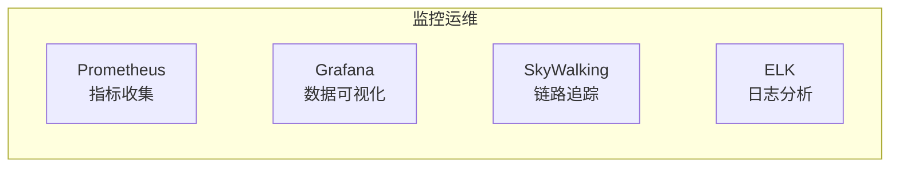
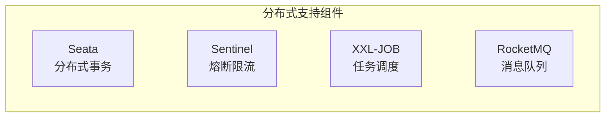
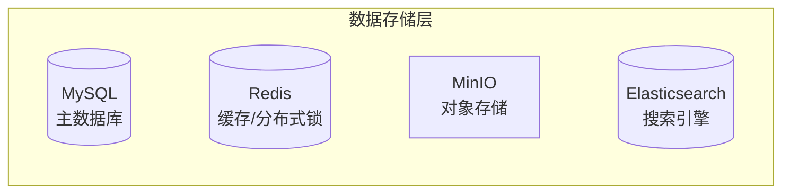
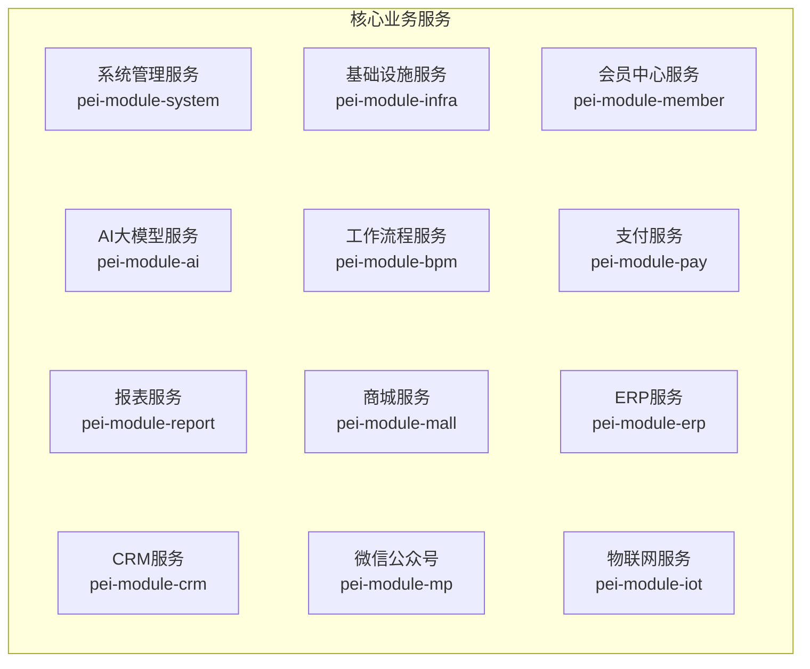

# Java 微服务增强版 (dehaze-java-cloud-plus)

> ⚠️ **本项目当前处于脚手架阶段，仅有 pom.xml 模块声明，src 源码尚未实现。以下模块介绍为规划内容。**

基于 Spring Cloud 2024 + Spring Boot 3.4 + Java 17 构建的分布式图像处理系统，采用现代化微服务架构设计，提供完整的端到端图像去雾解决方案。系统集成了 34 种主流去雾算法，基于深度学习实现高质量图像恢复，支持高并发、高可用的企业级部署。

> 构建/运行/测试说明见项目根目录的 `README.md`。

## 核心特性

- **🎯 智能去雾**: 集成 34 种主流去雾算法（RIDCP、WPXNet、Dehamer 等），基于深度学习实现高质量图像恢复
- **🌐 现代化微服务架构**: 基于 Spring Cloud 2024 + Spring Boot 3.4 + Java 17 构建，采用 yudao 架构风格，支持服务治理、配置管理、熔断限流
- **⚡ 高性能处理**: 异步任务处理、Redis 缓存优化、GPU 加速推理，提高系统吞吐量
- **🔐 安全可靠**: JWT + RBAC 权限模型、Redisson 分布式锁、完善的安全防护机制
- **📦 模块化设计**: 拆分 gateway / system / infra / ai / bpm / mall 等独立模块，各模块可独立部署与扩缩容

## 微服务整体架构图



### 监控运维详细架构图



### 分布式支持组件详细架构图



### 数据存储层详细架构图



### 业务服务详细架构图



## 技术栈详解

| 层级 | 技术栈 | 说明 |
|------|------|------|
| **微服务框架** | Spring Cloud 2024 + Spring Boot 3.4 + Java 17 | 微服务架构基础 |
| **服务注册与发现** | Nacos | 服务注册、发现与健康检查 |
| **配置中心** | Nacos | 动态配置管理 |
| **服务网关** | Spring Cloud Gateway | API 网关、权限校验、限流 |
| **负载均衡** | Spring Cloud LoadBalancer | 客户端负载均衡 |
| **RPC 调用** | Apache Dubbo 3.X | 高性能远程服务调用 |
| **熔断限流** | Sentinel | 流量控制、熔断降级 |
| **分布式事务** | Seata | 分布式事务管理 |
| **Web 容器** | Undertow | 高性能 Web 服务器 |
| **安全框架** | Sa-Token + JWT | 认证授权、权限控制 |
| **数据库** | MySQL 8.4 + MyBatis Plus | 数据持久化 |
| **缓存** | Redis 6 + Redisson | 分布式缓存、分布式锁 |
| **对象存储** | MinIO | 文件存储 |
| **消息队列** | RocketMQ | 异步消息处理 |
| **定时任务** | XXL-JOB | 分布式任务调度 |
| **监控** | Prometheus + Grafana | 系统监控与告警 |
| **链路追踪** | SkyWalking | 分布式链路追踪 |
| **日志系统** | ELK | 日志收集与分析 |

## 项目结构

```
dehaze-java-cloud-plus/
├── pei-dependencies/          # Maven依赖版本管理
├── pei-framework/             # Java框架拓展
│   ├── pei-common/           # 通用工具类
│   ├── pei-spring-boot-starter-* # 各种starter组件
│   └── ...                   # 其他框架拓展
├── pei-gateway/               # 网关服务
├── pei-server/                # 管理后台 + 用户 APP 的服务端
├── pei-module-system/         # 系统功能模块
├── pei-module-member/         # 会员中心模块
├── pei-module-infra/          # 基础设施模块
├── pei-module-bpm/            # 工作流程模块
├── pei-module-pay/            # 支付系统模块
├── pei-module-mall/           # 商城系统模块
├── pei-module-erp/            # ERP系统模块
├── pei-module-crm/            # CRM系统模块
├── pei-module-ai/             # AI大模型模块
├── pei-module-mp/             # 微信公众号模块
├── pei-module-report/         # 大屏报表模块
├── pei-module-iot/            # 物联网模块
└── sql/                       # 数据库脚本
```

## 核心模块介绍

### pei-module-ai（AI 大模型模块）

AI 模块是系统的核心智能处理模块，支持多种大模型平台接入，包括通义千问、文心一言、讯飞星火、智谱 GLM、DeepSeek、OpenAI、Ollama、Midjourney、StableDiffusion、Suno 等。

#### 主要功能

- 聊天助手（Chat）
- 图像生成（Image Generation）
- 音乐创作（Music Creation）
- 思维导图（Mind Map）
- 写作辅助（Writing Assistant）
- 工作流引擎（Workflow Engine）
- 知识库管理（Knowledge Base）

#### 技术实现

- 使用 Spring AI 封装各大模型平台
- 支持多模型平台配置管理（API Key、模型类型）
- 实现聊天对话记录与历史回溯
- 提供知识库导入与检索增强
- 支持图像/音乐生成任务管理
- 内置思维导图自动生成
- 提供可扩展的工作流引擎

### pei-module-system（系统功能模块）

系统功能模块提供基础的用户管理、权限控制、菜单管理、部门管理、角色管理等功能。

#### 主要功能

- 用户管理：用户注册、登录、信息维护
- 权限管理：RBAC 权限模型，菜单权限、按钮权限控制
- 部门管理：组织架构管理，支持树形结构
- 角色管理：角色分配，权限配置
- 字典管理：系统字典维护
- 通知公告：系统消息发布
- 操作日志：用户操作记录
- 登录日志：用户登录记录

### pei-module-infra（基础设施模块）

基础设施模块提供文件管理、代码生成、系统监控等基础功能。

#### 主要功能

- 文件管理：支持本地、MinIO、阿里云 OSS 等多种存储方式
- 代码生成：基于数据库表结构自动生成前后端代码
- 系统监控：服务状态监控、缓存监控、操作日志等
- API 文档：自动生成接口文档，支持在线调试
- 定时任务：分布式任务调度管理

### pei-module-member（会员中心模块）

会员中心模块提供用户注册、登录、个人信息管理等功能。

#### 主要功能

- 会员注册：支持手机号、邮箱注册
- 会员登录：支持多种登录方式
- 个人信息：头像、昵称、联系方式等信息维护
- 会员等级：会员等级体系管理
- 积分管理：积分获取、消费、兑换

### pei-gateway（网关服务）

网关服务是系统的统一入口，负责请求路由、权限校验、限流等功能。

#### 主要功能

- 请求路由：根据 URL 将请求转发到对应服务
- 权限校验：统一鉴权，防止未授权访问
- 限流控制：防止系统被恶意请求压垮
- 跨域处理：解决前后端跨域问题
- 日志记录：记录请求日志，便于问题排查

## 核心模块详解

> 以下内容迁移自各模块独立文档，提炼模块定位、核心职责、关键组件等精华信息。详细实现、启动方式、运维配置等请参见各子项目根目录的 `README.md`。

### pei-gateway 网关模块

**模块定位**：基于 Spring Cloud Gateway + Spring Cloud LoadBalancer + Nacos + Reactor 构建的微服务统一入口，承担所有进入微服务架构的 HTTP 请求的入口处理、路由转发、认证、日志、灰度等通用职责；不负责具体业务逻辑与数据持久化。

**核心职责**：

1. **请求路由**：依据 `application.yaml` 中配置的 `grayLb://` 路由规则，将 `/admin-api/system/**` 等路径请求转发到对应微服务，并支持路径重写以适配 Swagger 文档。
2. **身份认证**：`TokenAuthenticationFilter` 从 `Authorization` Header 提取 Token，调用 OAuth2 `/oauth2/check-token` 校验，将 `LoginUser`（含 `userId`/`userType`/`tenantId`）注入 `exchange` 属性与 `login-user` 请求头，供下游服务消费。
3. **灰度发布**：`GrayReactiveLoadBalancerClientFilter` + `GrayLoadBalancer` 根据请求头 `version` 字段匹配 Nacos 服务实例 `metadata.version`，无匹配则退化为随机+权重策略。
4. **访问日志**：`AccessLogFilter` 拦截请求/响应，记录方法、URL、QueryParams、RequestBody、用户上下文、响应体、状态码、耗时，支持控制台打印或异步入库。
5. **跨域与异常**：`CorsFilter` 统一添加 `Access-Control-*` 响应头；`GlobalExceptionHandler`（`@Order(-1)`）捕获所有异常，统一返回 `CommonResult` 标准错误响应。

**关键组件**：

| 组件 | 作用 |
|------|------|
| `CorsFilter` | 跨域处理，设置标准 CORS 响应头 |
| `TokenAuthenticationFilter` | Token 验证 + 用户上下文注入 |
| `GrayReactiveLoadBalancerClientFilter` | 灰度路由选择 |
| `AccessLogFilter` | 访问日志记录 |
| `GlobalExceptionHandler` | 全局异常统一响应 |

**分层结构**：`filter/{cors,grey,logging,security}` + `handler/`（异常）+ `jackson/`（序列化）+ `route/`（动态路由，可从 Nacos 加载）+ `util/`（IP/Token 工具）。

> 详细实现（路由配置、灰度算法、日志写入细节等）请参见子项目 `pei-gateway/README.md`。

### pei-module-system 系统管理模块

**模块定位**：基于 Spring Boot 3.4 + Java 17 + MyBatis Plus + OAuth2 + JWT 构建的系统管理模块，为微服务架构下的权限、用户、部门、角色、社交、短信、邮件、租户、站内信等基础能力提供统一管理后台，适用于管理后台权限控制、多租户 SaaS 平台、用户注册登录与安全控制等场景。

**核心能力**：

1. **RBAC 权限模型**：基于 `RoleMenuMapper`（角色-菜单）+ `UserRoleMapper`（用户-角色）实现细粒度权限控制；`RoleServiceImpl` 等服务通过 `@PreAuthorize("@ss.hasPermission(...)")` + `@LogRecord` 完成权限校验与操作日志记录。
2. **用户与组织**：用户管理（注册/登录/信息维护）、部门管理（树形组织结构）、角色管理（权限配置），统一通过 `/admin-api/system/**` 暴露。
3. **多租户 SaaS**：所有业务 DO 继承 `TenantBaseDO`（含 `tenant_id`），MyBatis Plus 租户拦截器自动追加 SQL 过滤；`TenantContextHolder` 基于 ThreadLocal 维护租户上下文；`TenantPackageServiceImpl` 使用 `@DSTransactional` 管理跨数据源事务。
4. **消息通知**：短信服务 `SmsSendServiceImpl` 通过 `SmsProducer` 将消息投递到 MQ 异步发送，支持腾讯云、七牛云等多渠道（`SmsClientFactory` 按渠道编码分发）；邮件服务 `MailAccountServiceImpl` 配合 `@CacheEvict` 维护 Redis 缓存；站内信 `NotifyMessageServiceImpl` 提供分页查询与已读标记。
5. **社交登录**：`api.social` 包对外暴露授权 URL 获取、微信 JSAPI 签名、小程序手机号与二维码等 RESTful 接口，支持微信、QQ、微博等第三方登录。

**架构设计**：分层结构 `api/`（对外 API）+ `controller/admin/`（管理后台 REST）+ `convert/`（MapStruct VO/DO 转换）+ `dal/{dataobject,mysql}`（MyBatis Plus 持久层）+ `framework/{sms,mail}`（渠道封装）+ `service/{permission,user,dept,role,tenant,social,sms,mail,notify}`（业务实现）+ `job/`（定时任务）+ `mq/`（消息消费）。

**关键设计点**：

| 能力 | 技术实现 |
|------|---------|
| VO/DO 转换 | MapStruct `@Mapper` 单例接口，避免手写 set/get |
| 多租户隔离 | `TenantBaseDO` + MyBatis Plus 拦截器 + `TenantContextHolder` |
| 短信异步发送 | MQ + `SmsProducer` + `SmsClient` 工厂模式 |
| 邮件缓存 | `@CacheEvict` + `RedisKeyConstants.MAIL_ACCOUNT` |
| 跨数据源事务 | `@DSTransactional`（租户套餐场景） |
| 操作日志 | `@LogRecord` 注解 + AOP |

> 详细实现（各 Service 代码示例、流程图、API 用法等）请参见子项目 `pei-module-system/README.md`。

## 开源协议

本项目采用 **Apache License 2.0** 开源协议。

- ✅ 允许商业使用
- ✅ 允许修改和分发
- ✅ 提供专利授权
- ⚠️ 需保留版权声明和许可证
- ⚠️ 修改需说明变更

详见 [LICENSE](LICENSE) 文件。
