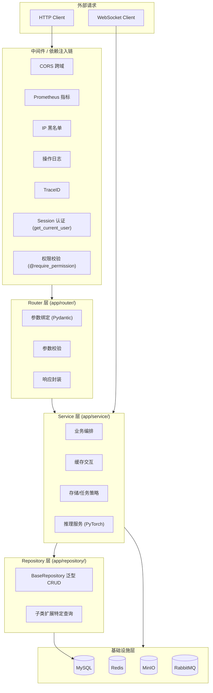
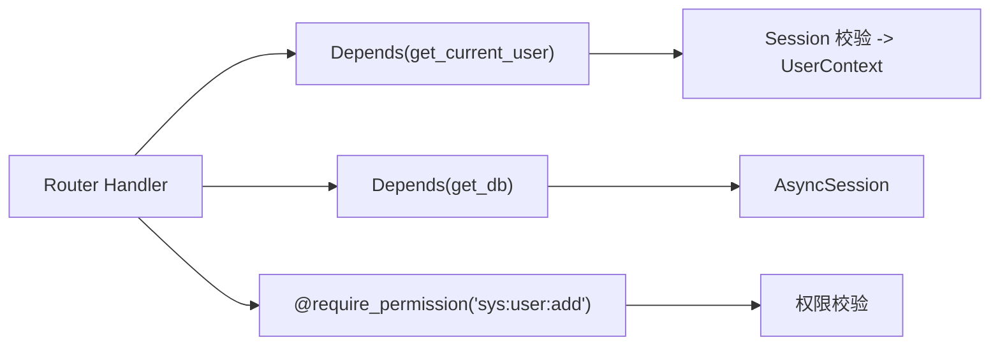
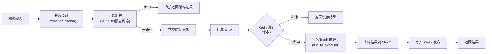
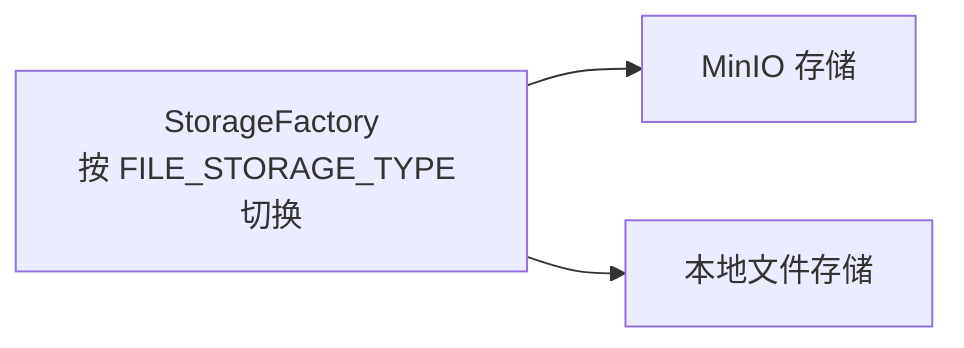
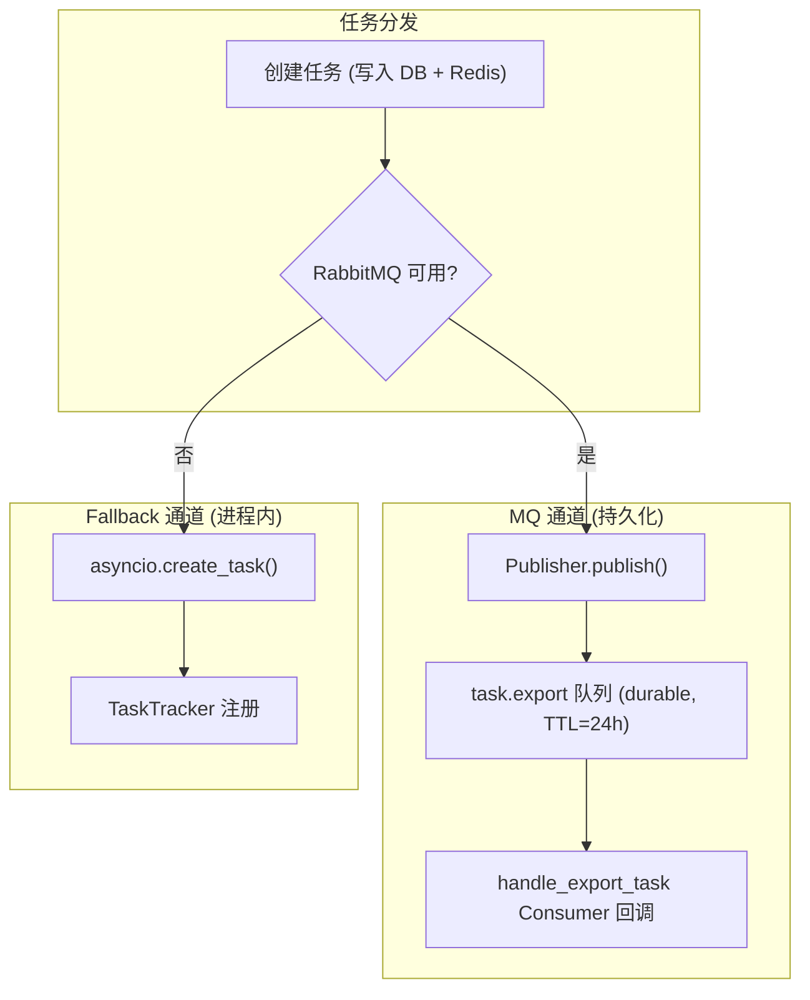
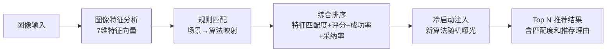
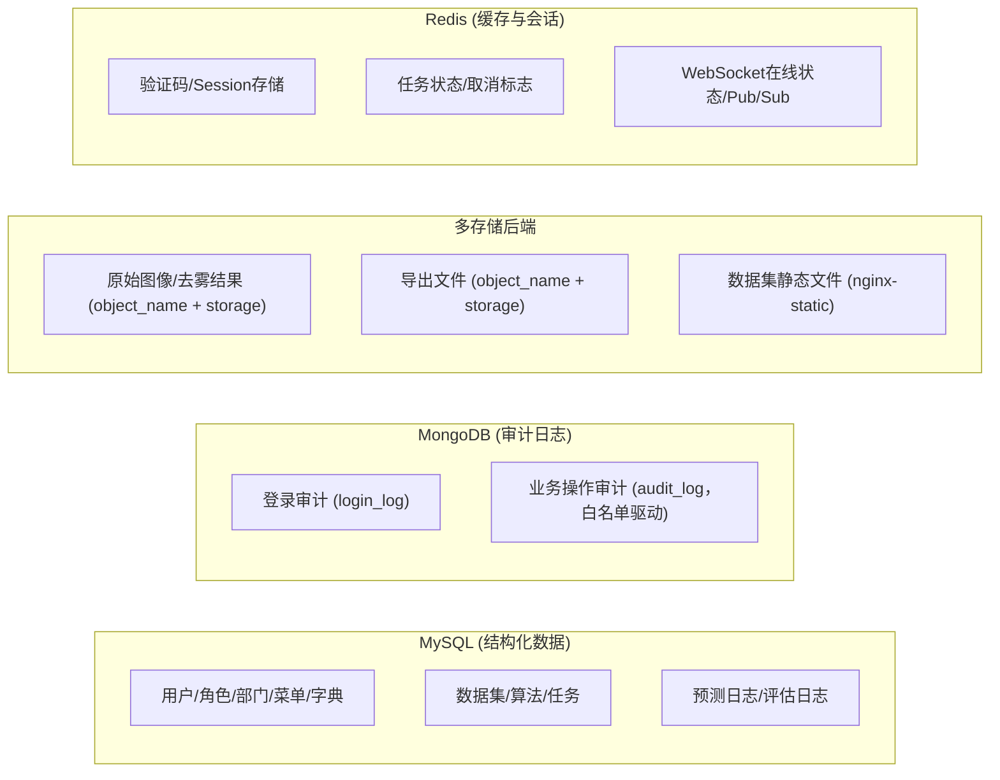
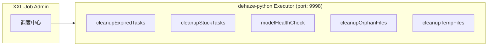
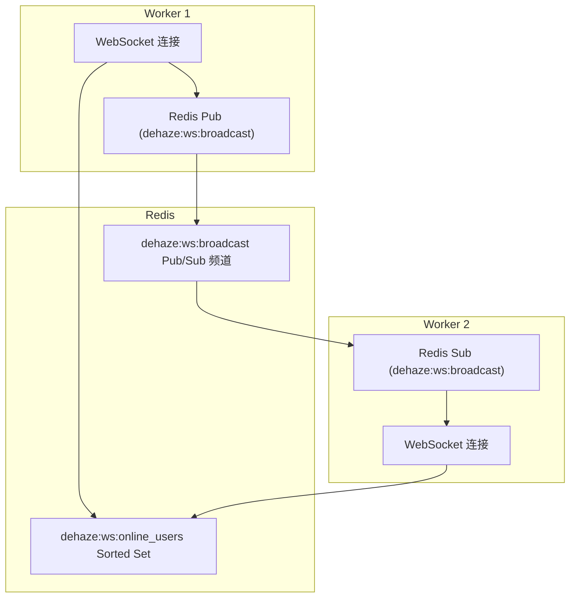
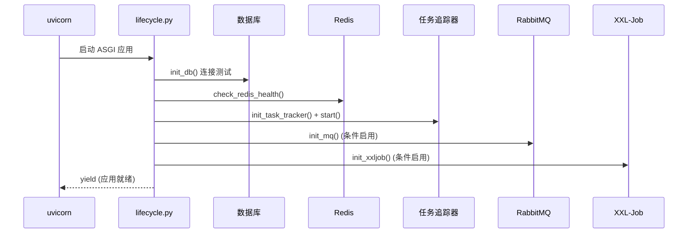

# Python 后端架构 (dehaze-python)

图像去雾系统的 Python 后端，基于 FastAPI + Uvicorn 构建，承担**双重角色**：一是与 Java/Go 对等的业务后端（提供用户/权限/订单/会员/数据集/算法管理等完整业务 API），二是算法服务（基于 PyTorch 承载深度学习推理与图像质量评估）。两种职责同进程部署，共用同一套分层架构与基础设施。

> 构建/运行/测试说明见项目根目录的 `README.md`。

## 一、分层架构



### 层级职责

| 层级 | 包路径 | 职责 |
|------|--------|------|
| 中间件/依赖注入 | `middleware/` + `dependencies/` + `decorators/` | 请求拦截、认证、鉴权、限流、防重提交、操作日志、TraceID、IP 黑名单 |
| Router 层 | `router/` | 参数绑定与校验（Pydantic）、调用 Service、统一响应封装 |
| Service 层 | `service/` | 业务逻辑编排、缓存交互、存储/任务策略选择、异步任务分发 |
| Repository 层 | `repository/` | 数据库 CRUD 封装、分页、模糊搜索、批量操作、复杂查询 |
| Models 层 | `models/` | ORM 实体、Schema 定义、Enum 常量 |
| Core 层 | `core/` | 统一错误码、响应封装、业务异常 |
| 基础设施层 | `infrastructure/` | 日志、缓存、消息队列、定时任务、指标采集 |

### 依赖注入策略

基于 FastAPI 原生依赖注入系统：

- 使用 `Depends()` 声明依赖关系，由框架自动解析
- 数据库 Session 通过 `get_db` 异步生成器注入，自动管理生命周期
- Redis 连接通过 `get_redis` 生成器注入
- 权限校验通过 `@require_permission` 装饰器实现



### 数据模型分层

| 模型类型 | 包路径 | 职责 | 示例 |
|----------|--------|------|------|
| Entity | `models/entity/` | 数据库表映射，SQLAlchemy Column 定义 | `SysUser` |
| Schema | `models/schema/` | API 请求/响应 Schema，Pydantic 校验 + OpenAPI 自动生成 | `UserPageQuery` |
| Enum | `models/enum/` | 枚举常量定义 | `TaskStatus` |

## 二、项目目录结构

```
dehaze-python/
├── app/                               # 主应用目录
│   ├── __init__.py                    # 延迟导入入口
│   ├── main.py                        # FastAPI 应用入口
│   ├── lifecycle.py                   # Lifespan 上下文管理器
│   ├── config.py                      # 多环境配置（Pydantic Settings）
│   ├── database.py                    # SQLAlchemy 2.0 异步引擎 & Session 工厂
│   ├── core/                          # 核心通用层（错误码/响应封装/异常）
│   ├── dependencies/                  # FastAPI 依赖注入（auth/redis）
│   ├── decorators/                    # 横切关注点装饰器（permission/rate_limit/repeat_submit）
│   ├── middleware/                    # ASGI 中间件（trace/operation_log/ip_blacklist/non_null_response）
│   ├── infrastructure/               # 基础设施层（logging/cache/metrics/mq/job）
│   ├── models/                        # 数据模型（entity/schema/enum）
│   ├── repository/                    # Repository 层（BaseRepository 泛型基类）
│   ├── router/                        # 路由层（30+ 个业务 APIRouter + health/metrics + WebSocket）
│   ├── service/                       # 服务层（prediction/task_tracker/file/storage/import_export/member/order 等）
│   └── utils/                         # 工具层（password/file/datetime/tree 等）
├── algorithm/                         # 去雾算法模块（30 种算法，平铺结构）
├── config.py                          # 算法模块配置
├── migrations/                        # Alembic 数据库迁移
├── tests/                             # 测试
├── pyproject.toml                     # 项目依赖（uv 管理）
├── Dockerfile                         # GPU 推理容器化
└── logs/                              # 运行时日志目录
```

## 三、核心模块

### 3.1 业务模块概览

Python 端实现与 Java/Go 对等的完整业务层，按领域分组如下（各模块的需求规格、API 契约与实现详见 [03-模块设计](../../03-模块设计/)）：

| 领域 | 覆盖模块 |
|------|---------|
| 认证授权 | 登录/登出、Session、API Key、验证码 |
| 系统管理 | 用户、角色、部门、菜单、字典 |
| 去雾业务 | 图像输入、算法选择、预测处理、效果对比、评估指标、任务、收藏、预设、推荐 |
| 数据与算法管理 | 数据集、数据项、算法管理、导入导出 |
| 商业化 | 会员、订单、套餐、优惠券、支付、退款、通知设置 |
| 消息通知 | 站内消息、消息模板、公告、反馈、WebSocket 推送 |
| 文件与运维 | 文件管理、健康检查、监控指标、客户端日志 |

### 3.2 算法模块

`algorithm/` 目录平铺 30 种去雾算法（如 RIDCP、WPXNet、Dehamer 等），每个算法独立目录，统一以 `run.py` 为入口、由 `model_loader.py` 加载，通过 `importPath` 配置动态选择。各算法的模型结构与论文依据详见[算法/学术论文文档](../算法/学术论文文档.md)。

### 3.3 算法管线



### 3.3 预测流程插件化（拦截器链）

预测主流程通过责任链模式支持可插拔拦截器：

| 组件 | 职责 |
|------|------|
| `PredictionContext` | 请求上下文（algorithm/file_id/image_url/origin_file/params） |
| `InterceptedResult` | 拦截命中后返回的结果 |
| `PredictionInterceptor` (ABC) | 拦截器抽象基类 |
| `PredictionInterceptorChain` | 责任链：按注册顺序执行，第一个命中即短路 |
| `WpxNetPredictionInterceptor` | WPXNet 预查询：通过 `sys_wpx_file` 表查表短路 |

WPXNet 预查询命中后直接返回结果，跳过 PyTorch 推理，响应时延从秒级降至毫秒级。

### 3.5 存储抽象层

策略模式适配多存储后端：



`sys_file` 表只存 `object_name` + `storage`，URL 运行时拼接不落库。

### 3.6 通用导入导出

Handler 模式 + 通用策略实现：

| 模块 | ExportHandler | ImportHandler |
|------|--------------|--------------|
| 用户管理 | UserExportHandler | UserImportHandler |
| 角色管理 | RoleExportHandler | RoleImportHandler |
| 部门管理 | DeptExportHandler | DeptImportHandler |
| 菜单管理 | MenuExportHandler | MenuImportHandler |
| 字典管理 | DictExportHandler | DictImportHandler |
| 数据集管理 | DatasetExportHandler | -（仅导出） |
| 算法管理 | AlgorithmExportHandler | AlgorithmImportHandler |

### 3.7 消息队列

采用 MQ 优先 + asyncio.Task fallback 双通道架构：



与 Java/Go 端共享 `dehaze.tasks` (direct exchange) 交换机。

### 3.8 图像特征分析服务

为推荐管理模块提供图像特征提取能力，输出 7 维结构化特征向量供推荐引擎规则匹配：

| 特征维度 | 权重 | 实现方式 |
|---------|:----:|---------|
| 雾霾浓度 | 30% | 暗通道先验估计 + 透射率计算 |
| 场景类型 | 20% | ResNet 预训练模型场景分类（城市/风景/建筑/夜景/逆光/室内） |
| 光照条件 | 15% | 亮度直方图分析 + 曝光评估 |
| 图像复杂度 | 10% | 边缘密度（Canny）+ 纹理丰富度（LBP） |
| 颜色分布 | 10% | 色温估计 + 饱和度统计 + HSV 直方图 |
| 分辨率 | 5% | 尺寸归一化分类（标清/高清/超清） |
| 噪声水平 | 10% | 局部方差估计 + 频域分析 |

服务通过 HTTP 接口接收图像 URL，内部复用 PyTorch 推理管线（`run_in_executor` 避免阻塞事件循环），特征分析结果按图像 MD5 缓存 1 小时。Java/Go 后端的 ImageAnalysisService 通过 HTTP 调用此服务。

**放在 Python 端而非 Java/Go 的理由**：图像特征分析依赖 PyTorch 预训练模型（场景分类）和 OpenCV 图像处理（暗通道、边缘检测、直方图），这些库为 Python 生态原生；复用已有推理管线和 GPU 资源，避免在 Java/Go 端重复引入图像处理依赖。

### 3.9 评估指标计算服务

为效果对比模块提供去雾效果量化评估能力，计算 5 项专业指标：

| 指标 | 说明 | 合格阈值 | 实现方式 |
|------|------|---------|---------|
| PSNR | 峰值信噪比 | ≥ 30.0 dB | 像素级 MSE -> 峰值比 |
| SSIM | 结构相似性 | ≥ 0.8 | 窗口滑动 + 亮度/对比度/结构三项 |
| LPIPS | 学习感知相似度 | ≤ 0.3 | 预训练 VGG/AlexNet 特征距离 |
| NIQE | 自然图像质量 | ≤ 5.0 | 统计模型 + MVN 距离 |
| Entropy | 信息熵 | 统计展示 | 灰度直方图 Shannon 熵 |

评估结果按 `{algorithmId}:{predMd5}:{refMd5}` 永久缓存，相同图片+相同算法的评估请求命中缓存直接返回。Java/Go 后端通过算法管理模块的 EvaluationService 委托调用此服务。

### 3.10 推荐生成完整管线



推荐引擎的规则匹配和排序逻辑在 Java/Go 后端实现，Python 端仅负责图像特征向量提取。Python 端的特征分析服务作为推荐管线的第一环节，其输出直接决定推荐候选集。

## 四、配置管理

| 组件 | 选型 | 说明 |
|------|------|------|
| 配置框架 | Pydantic Settings v2 | 类型安全、自动校验、环境变量绑定 |
| 环境变量 | `.env` 文件 + `os.getenv` | 敏感信息外部化 |
| 配置切换 | `APP_ENV` 环境变量 | 决定加载哪个配置类 |

多环境支持：

| 环境 | 配置类 | 特性差异 |
|------|--------|----------|
| 开发 | `DevelopmentSettings` | DEBUG=True，Session Cookie 关闭 Secure |
| 测试 | `TestingSettings` | DEBUG=True，独立测试数据库 `dehaze_test` |
| 生产 | `ProductionSettings` | 强制校验密码非空、CORS 禁止 localhost，JSON 日志 |

敏感信息通过 `DEHAZE_HOST` 和 `DEHAZE_PASSWORD` 统一管理，派生地址和连接串通过 `@property` 自动拼接。

## 五、安全认证

| 组件 | 实现 | 说明 |
|------|------|------|
| Session 认证 | Redis `session:{sessionId}` | TTL 7 天，剩余 < 24h 自动续期 |
| 用户上下文 | `Depends(get_current_user)` | 自动解析 Session -> UserContext |
| 密码加密 | bcrypt（`utils/password.py`） | 专用线程池异步执行 |
| 验证码 | Redis 存储 + Pillow 生成 | 可配置长度/尺寸/字体/干扰线 |

权限校验通过 `require_permission` 装饰器实现，支持通配符匹配（`sys:user:*` 匹配 `sys:user:add`），ROOT 用户自动跳过校验。

安全防护：

| 防护类型 | 实现方式 |
|----------|----------|
| SQL 注入 | SQLAlchemy 参数化查询 |
| XSS | `validate_no_xss` 输入校验（Pydantic Schema 层 + Service 层双重校验） |
| CSRF | Session Cookie（SameSite=Lax） |
| CORS | CORSMiddleware |
| 暴力破解 | 验证码 + IP 黑名单自动封禁 |
| 限流 | RateLimitMiddleware（Redis 固定窗口） |
| 防重复提交 | AntiRepeatMiddleware（ASGI 中间件，基于 user_id+method+uri+body_hash，Redis SET NX EX，默认 5 秒；排除文件上传/数据集/数据项等已有自身幂等机制的写接口） |

## 六、数据访问层

| 组件 | 选型 | 说明 |
|------|------|------|
| ORM | SQLAlchemy 2.0 + 异步模式 | 声明式模型、AsyncSession |
| 数据库驱动 | aiomysql（异步）+ PyMySQL（同步） | 异步为主，同步用于 Alembic 迁移 |
| 数据库迁移 | Alembic (纯 CLI) | 版本化 Schema 管理 |
| 文档数据库 | Motor（MongoDB 异步） | 登录审计、业务操作审计（白名单驱动） |
| 对象存储 | MinIO Python SDK | 文件/图像存储 |

事务管理采用"请求边界 = 事务边界"模型，由 `get_db()` / `get_db_session()` 统一管理 commit/rollback。Router 层持有事务边界，Service 层做业务编排不 commit，Repository 层只做 flush。**约束**：每个 Router handler 对应一个工作单元，跨多 Repository 的原子提交须由同一 handler 内的单一 Session 包裹；Service 不得自行开新 Session 或跨请求持有 Session，以避免事务作用域泄漏。

Repository 层引入泛型 `BaseRepository[T]`，提供标准 CRUD 操作，子类只需声明 `model` 类型即可继承全部能力。

审计字段自动填充通过 SQLAlchemy event 事件机制 + ContextVar 实现：`before_insert` 填充 `create_time`/`update_time`/`create_by`/`update_by`，`before_update` 填充 `update_time`/`update_by`。

存储分工：



## 七、缓存体系

Redis 异步客户端作为缓存层，连接池管理：

| 参数 | 默认值 | 说明 |
|------|--------|------|
| max_connections | 100 | 最大连接数 |
| socket_timeout | 5.0s | 操作超时 |
| health_check_interval | 30s | 健康检查间隔 |

Redis 弹性机制：

| 机制 | 说明 |
|------|------|
| 优雅降级 | `redis_operation_with_fallback()` Redis 不可用时执行 fallback |
| L1 本地缓存 | `local_cache.py`（TTLCache + SingleFlight）降低 Redis 压力 |

## 八、定时任务

通过 pyxxl (XXL-Job Python 执行器) 与 Java/Go 端共享调度中心：

| 任务名 | 功能 |
|--------|------|
| `cleanupExpiredTasks` | 删除过期任务，清理 Redis 缓存 |
| `cleanupStuckTasks` | 将超过 24h 的异常任务标记为 failed |
| `modelHealthCheck` | 检查 GPU 可用性/显存使用率、DB/Redis 连接 |
| `cleanupOrphanFiles` | 清理 MinIO 中无数据库记录关联的孤儿文件 |
| `cleanupTempFiles` | 清理临时目录中过期的临时文件 |



## 九、WebSocket 实时通信

基于 FastAPI 原生 WebSocket 实现，通过 Redis Pub/Sub 实现跨 Worker 通信：



## 十、应用生命周期



优雅关闭：TaskTracker 拒绝新任务 -> WebSocket 通知客户端 -> 等待运行中任务完成（30s 超时）-> 关闭 XXL-Job/RabbitMQ -> 关闭 Redis/数据库连接池。

本地开发统一通过项目根目录 `scripts/run.py` 管理三端后端的生命周期。

## 十一、统一响应与错误处理

错误码采用 5 位字符串编码，与 Java/Go 端保持一致：

| 前缀 | 类别 | 示例 |
|------|------|------|
| `00` | 成功 | `00000` - 一切 ok |
| `A0` | 用户端错误 | `A0001` - 用户端错误, `A0200` - 登录异常, `A0400` - 参数错误 |
| `B0` | 系统执行错误 | `B0001` - 系统执行出错, `B0210` - 并发限流 |
| `C0` | 第三方服务错误 | `C0001` - 调用第三方服务出错, `C0300` - 数据库服务出错 |

通过 `register_exception_handlers(app)` 注册全局异常处理器，统一拦截 BusinessException、RequestValidationError、Session 无效、SQLAlchemyError 等异常。

## 十二、三端对照

| 基础设施能力 | dehaze-python | dehaze-java | dehaze-go | 一致性 |
|-------------|---------------|-------------|-----------|--------|
| HTTP 框架 | FastAPI (uvicorn) | Spring MVC (Tomcat) | Gin | 接口语义一致 |
| ORM | SQLAlchemy 2.0 (异步) | MyBatis-Plus | GORM | 功能对等 |
| 缓存 | Redis + local_cache L1 | Spring Cache + 多级 (Caffeine L1 + Redis L2) | 多级缓存 (gkit L1 + Redis) | 已对齐 |
| 消息队列 | aio-pika RabbitMQ (MQ优先+fallback) | RabbitMQ | RabbitMQ | 共享 Exchange/Queue |
| 定时任务 | pyxxl XXL-Job (5 个任务) | @Scheduled + XXL-Job | Ticker + XXL-Job | 共享 Admin |
| 日志 | Python logging + JSON | Logback | Zap | 格式/级别统一 |
| 认证 | Redis Session | Spring Security + Session | 自研中间件 + Session | Session 机制互通 |
| 权限 | RBAC (Depends + @require_permission) | RBAC (@PreAuthorize) | RBAC (中间件) | 权限标识一致 |
| 错误码 | 5 位字符串 (A0/B0/C0) | 5 位字符串 (A0/B0/C0) | 5 位字符串 (A0/B0/C0) | 完全一致 |
| 响应格式 | `{code, msg, data, traceId}` | `{code, msg, data, traceId}` | `{code, msg, data, traceId}` | 完全一致 |
| WebSocket | FastAPI 原生 + Redis Pub/Sub | STOMP + SockJS | - | Python 跨 Worker 已实现 |
| 对象存储 | 多存储后端抽象 (minio/local/nginx-static) | MinIO / 阿里云 OSS | 通过 API | 三端统一 StorageService 抽象 |
| 限流/防重 | 装饰器 (Redis 计数) | 注解 + Redis | 中间件 | 功能对等 |
| IP 黑名单 | 中间件自动封禁 | 中间件 | 中间件 | 三端对齐 |

## 十三、技术栈总览

| 分类 | 技术 | 用途 |
|------|------|------|
| 语言 | Python >= 3.10 | 后端开发 + AI 推理 |
| Web 框架 | FastAPI >= 0.115 | ASGI 异步 HTTP 路由、中间件、WebSocket |
| ASGI 服务器 | uvicorn >= 0.32 | 高性能异步服务器 |
| ORM | SQLAlchemy >= 2.0 | 异步 ORM，声明式模型 |
| 文档数据库 | Motor (MongoDB) >= 3.6 | 异步 MongoDB 客户端，登录/操作审计日志 |
| 缓存 | redis-py (asyncio) >= 6.4 | 异步 Redis 客户端 |
| 对象存储 | MinIO Python SDK >= 7.2 | 文件/图像存储 |
| AI 推理 | PyTorch >= 2.9 + torchvision >= 0.24 | 深度学习推理引擎 |
| 消息队列 | aio-pika (RabbitMQ) >= 9.4 | 异步任务分发（MQ 优先 + asyncio.Task fallback） |
| 定时任务 | pyxxl (XXL-Job) >= 0.4 | 分布式定时任务调度 |
| 配置管理 | pydantic-settings >= 2.0 | 环境变量绑定、多环境配置 |
| 监控 | prometheus-client + starlette-exporter | Prometheus 指标采集 |
| 容器 | Docker (NVIDIA CUDA 12.1) | GPU 推理容器化 |
| 包管理 | uv | 快速 Python 包管理器 |
| 测试 | pytest + pytest-asyncio >= 8.0 | 异步单元/集成测试 |

## 十四、关键技术决策

| 决策 | 选择 | 理由 |
|------|------|------|
| Web 框架 | FastAPI | ASGI 异步框架，原生 async/await，自动 OpenAPI 文档 |
| AI 推理 | PyTorch | 深度学习主流框架，30 种算法模型支持 |
| 预测流程 | 责任链模式（拦截器链） | 可插拔预查询/缓存，不修改主流程 |
| 任务分发 | MQ 优先 + asyncio.Task fallback | RabbitMQ 持久化保证 + 进程内降级兜底 |
| 存储 | 策略模式适配多后端 | minio/local/nginx-static 统一抽象 |
| ORM | SQLAlchemy 2.0 异步 | 与 FastAPI 异步模型一致 |
| 配置 | Pydantic Settings v2 | 类型安全，启动期校验，派生地址自动计算 |
| 定时任务 | XXL-Job (pyxxl) | 与 Java/Go 端共享调度中心 |
| WebSocket | 原生 WebSocket + Redis Pub/Sub | 跨 Worker 通信，无第三方依赖 |
| 日志 | Python logging + JSON 结构化 | 按日期分目录，按大小分片，保留 30 天 |
| 监控 | Prometheus（HTTP/GPU/推理/任务四大类指标） | 与 Java/Go 端命名统一 |
| 图像特征分析放 Python 端 | 复用 PyTorch + OpenCV 生态 | 场景分类依赖预训练模型，暗通道/边缘/直方图依赖 OpenCV，Java/Go 端引入这些依赖成本高且无法复用 GPU；Python 端复用已有推理管线和模型缓存 |
| 业务与算法同进程部署 | 共用 FastAPI 分层与基础设施 | 算法密集场景下业务请求常触发推理，同进程避免跨服务 HTTP 往返与模型权重重复加载；代价是 GPU 节点同时承载业务职责，业务侧故障会波及推理——通过异步任务（MQ + TaskTracker）将长耗时推理与同步业务请求解耦，并对推理入口做超时/降级兜底 |
