# Python 算法服务 (dehaze-python)

雾霾的存在会导致图像的质量急剧恶化，造成色彩失真、特征模糊、对比度降低等问题，针对当前图像去雾领域存在缺乏强大的先验知识、浓雾区域去雾不彻底问题，本系统基于深度学习方法研究设计了一种真实场景非均匀雾的环境条件下的图像去雾方法。基于该方法构建了一个基于深度学习的在线实时响应的图像去雾系统，从而实现最终端到端的图像去雾的目标。

本部分为图像去雾系统的 Python 后端，基于 PyTorch 构建深度学习模型，FastAPI 作为异步 Web 服务框架提供 API 接口，通过 Uvicorn 进行生产级部署。是整个图像去雾系统最核心的部分，同时向外提供 API 接口以供 Java/Go 后端调用。

> 构建/运行/测试说明见项目根目录的 `README.md`。

## 一、项目概览

### 1.1 模块划分

- **算法模块**: `algorithm/` 目录下包含 29 种去雾算法模型（如 RIDCP、WPXNet、Dehamer 等），每个算法有独立的模型定义、运行脚本和依赖配置。通过 `importPath` 配置动态加载不同算法模型
- **服务模块**: `app/` 目录提供 API 接口层，包含文件处理、模型调用、结果返回等功能
- **测试模块**: `tests/` 目录包含模型测试用例和数据集配置
- **部署模块**: 通过 Docker 容器化（Dockerfile）实现环境一致性，使用 NVIDIA CUDA 12.1 镜像支持 GPU 加速

### 1.2 模型介绍

1. 引入从清晰无雾图像训练得到离散码本，封装具有原有图像色彩和结构的高质量先验知识，构建一种双分支神经网络结构
2. 针对浓雾和非均匀雾霾区域图像纹理和结构特征的提取，设计了一种金字塔空洞邻域注意力编码器，聚合不同层级的特征，实现不同尺度的特征重用
3. 将基于 Transformer 的邻域注意力和基于卷积的通道注意力结合，提取图像全局特征并学习浓雾区域与底层场景之间复杂交互特征，通过特征融合模块对两个分支提取的特征进行融合。进而对雾霾图像重建实现端到端的图像去雾流程

### 1.3 项目亮点

1. **去雾模型封装:** 利用 FastAPI 搭建的异步 Web 框架，封装基于 Python 去雾模型进而通过 API 接口实现模型调用
2. **分层架构设计:** 实现 Web 服务层（FastAPI）、模型推理层（PyTorch）、存储层（MinIO）分离，通过工厂模式动态加载模型算法实现模型可插拔架构
3. **跨平台与生产级部署:** 通过 Dockerfile 多阶段构建，减小最终镜像体积。通过健康检查（HEALTHCHECK）监控服务状态，实现高可用
4. **依赖管理:** 利用 `pyproject.toml` + uv 打包 Docker 镜像，精准控制 CUDA、PyTorch 等依赖版本，确保环境一致性
5. **监控预警:** 集成 Prometheus 指标采集，规划接入 Grafana Dashboard，实时监控 GPU 利用率、算法模型的推理耗时、准确率等指标
6. **弹性伸缩:** 规划基于 Kubernetes 的 GPU 利用率自动伸缩，流量高峰时自动扩容，避免资源浪费
7. **WebSocket 支持:** 集成 WebSocket 实现去雾进度实时推送，提升用户体验

### 1.4 项目难点

#### 模型兼容性

- 部分模型（如 CFENViTDehazing）因依赖未解决或代码问题无法运行
- 模型配置差异大（如 RIDCP 需 `BASICSR_JIT=True`，WPXNet 依赖 CUDA 扩展模块）

#### 跨平台问题

- 部分模型（如 RIDCP、WPXNet）仅支持 Linux，Windows 环境需额外适配

#### 依赖管理

- Dockerfile 中需精确指定 PyTorch 和 Natten 版本（如 `torchvision-0.16.0+cu121`），升级时易引发兼容性问题

#### 性能瓶颈

- 多模型并行推理时 GPU 资源分配需优化（如 Uvicorn worker 数需根据显存调整）

### 1.5 模型配置结构

```yml
name: "算法名称"
type: "算法类型"
description: "算法描述"
importPath: "算法代码导入路径"
children:
  - name: "子模型名称"
    type: "子模型类型"
    description: "子模型描述"
    path: "模型路径"
```

### 1.6 模型运行注意事项

以下去雾模型由于依赖未解决或代码问题无法运行：

- AECRNet
- CFENViTDehazing
- DaclipUir
- DCPDN
- FCD
- PSD

以下模型准备调试：

- TNN
- ImgRestorationSde
- MB-TaylorFormer

以下模型需要在 Linux 系统中运行：

- RIDCP（需 `BASICSR_JIT=True`）
- WPXNet（需 natten）

## 二、技术基础设施

> 本部分描述 `dehaze-python` 后端项目的技术基础设施层设计，包括项目分层架构、应用生命周期、配置管理、数据访问层、缓存体系、消息队列、定时任务、安全中间件、日志系统和可观测性等基础能力，面向参与 `dehaze-python` 后端开发的工程师，提供技术基座的全局视图和设计决策依据。本部分**不涉及**具体业务模块的实现逻辑和去雾算法模块，业务模块详见 [模块设计](../03-模块设计/) 各子目录。

**相关文档：**

| 文档 | 说明 |
|------|------|
| [总体架构设计](../02-系统架构/01-总体架构设计.md) | 系统全局分层、数据流与安全策略 |
| [数据库设计](../02-系统架构/03-数据库设计.md) | 表结构、索引、ER 关系图 |
| [API 规范](../02-系统架构/04-API规范.md) | 全局 API 规范、认证方式、错误码 |
| [Java后端架构文档](./Java后端架构文档.md) | Java 端对等架构设计 |
| [Go后端架构文档](./Go后端架构文档.md) | Go 端对等架构设计 |

---

### 2.1 项目目录结构

```text
dehaze-python/
├── app/                               # 主应用目录
│   ├── __init__.py                    # 延迟导入入口（app / settings）
│   ├── main.py                        # FastAPI 应用入口（app 实例 + 路由/中间件/异常处理器注册）
│   ├── lifecycle.py                   # Lifespan 上下文管理器（启动/关闭流程编排）
│   ├── config.py                      # 多环境配置（Pydantic Settings）
│   ├── database.py                    # SQLAlchemy 2.0 异步引擎 & Session 工厂
│   ├── core/                          # 核心通用层（错误码/响应封装/异常）
│   │   ├── code.py                    # ResultCode 统一错误码
│   │   ├── result.py                  # 统一响应封装（Result 泛型 / success / error）
│   │   └── exceptions.py             # BusinessException + 全局异常处理器注册
│   ├── dependencies/                  # FastAPI 依赖注入
│   │   ├── auth.py                    # Session 认证依赖（UserContext / get_current_user / get_current_user_optional）
│   │   └── redis.py                   # Redis 连接池 / 单例管理 / 健康检查
│   ├── decorators/                    # 横切关注点装饰器
│   │   ├── permission.py             # 权限检查装饰器（require_permission / require_any_permission）
│   │   ├── rate_limit.py             # 接口限流装饰器（基于 Redis 计数）
│   │   └── repeat_submit.py          # 防重复提交装饰器
│   ├── middleware/                    # ASGI 中间件
│   │   ├── __init__.py               # init_middlewares 统一注册
│   │   ├── trace.py                  # TraceID 中间件（X-Trace-Id 透传与回写）
│   │   ├── operation_log.py          # 操作日志中间件（异步写入 MySQL）
│   │   ├── ip_blacklist.py           # IP 黑名单中间件（自动封禁异常请求）
│   │   └── non_null_response.py      # NonNullJSONResponse（过滤 null 字段）
│   ├── infrastructure/               # 基础设施层（领域无关的技术能力）
│   │   ├── logging.py                # 日志系统（UTF-8 轮转处理器 + JSON 格式化）
│   │   ├── cache/                    # 缓存体系
│   │   │   ├── cache.py              # CacheService + DeptCacheKeys
│   │   │   ├── redis_fallback.py     # Redis 降级（redis_operation_with_fallback）
│   │   │   └── local_cache.py        # L1 本地缓存（TTLCache + SingleFlight）
│   │   ├── metrics/                  # Prometheus 指标采集
│   │   │   ├── gpu_metrics.py        # GPU 利用率 / 显存 / 温度
│   │   │   ├── inference_metrics.py  # 推理耗时 / 请求计数
│   │   │   ├── task_metrics.py       # 任务队列深度 / 处理耗时
│   │   │   └── cache_metrics.py      # 缓存命中率指标
│   │   ├── mq/                       # RabbitMQ 消息队列
│   │   │   ├── base.py               # BaseRabbitMQClient 基类（连接/重连公共逻辑）
│   │   │   ├── publisher.py          # 消息发布（自动重连 + 指数退避）
│   │   │   ├── consumer.py           # 多队列消费（handler 注册 + ack/nack）
│   │   │   ├── connection.py         # 全局单例管理 + Lifespan 集成
│   │   │   └── handlers.py           # 消费者 handler（导出任务等）
│   │   └── job/                      # XXL-Job 定时任务
│   │       ├── executor.py           # 执行器生命周期管理（pyxxl daemon）
│   │       └── handlers.py           # 定时任务 handler（5 个：清理/回收/健康检查/孤儿文件/临时文件）
│   ├── models/                        # 数据模型
│   │   ├── base.py                    # BaseModel（SQLAlchemy 事件自动填充审计字段 + ContextVar）
│   │   ├── entity/                    # ORM 实体（与表对应）
│   │   ├── schema/                    # Pydantic Schema（API 请求/响应）
│   │   └── enum/                      # 枚举常量（TaskStatus / DatasetStatus 等）
│   ├── repository/                    # Repository 层（数据访问抽象）
│   │   ├── base.py                    # 泛型 BaseRepository（CRUD / 分页 / 模糊搜索 / 批量操作）
│   │   ├── user_repository.py        # 用户数据访问
│   │   ├── dataset_repository.py     # 数据集数据访问
│   │   └── ...                        # 其他 Repository
│   ├── router/                        # 路由层（Controller）
│   │   ├── __init__.py               # init_routes 统一路由注册
│   │   ├── auth.py                    # 认证路由
│   │   ├── websocket.py              # WebSocket 路由
│   │   └── ...                        # 其他业务路由
│   ├── service/                       # 服务层（业务逻辑）
│   │   ├── task_tracker.py           # 任务追踪管理器（优雅关闭 + 跨 Worker Redis 同步）
│   │   ├── websocket_service.py      # WebSocket 连接管理（跨 Worker Redis Pub/Sub）
│   │   ├── file_service.py           # 文件服务（MinIO 上传/下载/删除）
│   │   ├── prediction_service.py     # 去雾推理服务（PyTorch + run_in_executor + 拦截器链）
│   │   ├── prediction/               # 预测拦截器包（可插拔插件）
│   │   │   ├── interceptor.py        # PredictionInterceptor ABC + 责任链
│   │   │   └── wpxnet_interceptor.py # WPXNet 预查询拦截器（sys_wpx_file 表查表短路）
│   │   ├── file_events.py            # 文件事件总线（FileCreatedEvent / FileDeletedEvent）
│   │   ├── storage/                  # 存储抽象层（策略模式）
│   │   │   ├── base.py               # StorageService 抽象基类
│   │   │   ├── factory.py            # StorageFactory（按 FILE_STORAGE_TYPE 切换）
│   │   │   ├── local_storage.py      # 本地文件存储实现
│   │   │   └── minio_storage.py      # MinIO 存储实现
│   │   ├── task/                     # 任务策略层（策略模式）
│   │   │   ├── strategy.py           # ExportStrategy 抽象基类
│   │   │   ├── factory.py            # ExportStrategyFactory（自动注册）
│   │   │   ├── zip_utils.py          # ZIP 打包工具（MinIO 下载 + run_in_executor）
│   │   │   └── strategies/           # 具体导出策略
│   │   │       ├── dataset_export.py
│   │   │       ├── batch_download.py
│   │   │       ├── item_download.py
│   │   │       └── custom_export.py
│   │   └── ...                        # 其他业务 Service
│   └── utils/                         # 工具层
│       ├── password.py                # 密码工具（bcrypt + 专用线程池）
│       ├── file.py                    # 文件工具（calculate_bytes_md5）
│       ├── datetime_utils.py          # 日期时间工具（format_time）
│       ├── tree.py                    # 树形结构工具（generate_tree_path）
│       ├── path_builder.py            # 路径构建工具
│       ├── image_processor.py         # 图像处理工具
│       └── user_agent.py             # User-Agent 解析工具
├── algorithm/                         # 去雾算法模块（29 种算法）
├── config.py                          # 算法模块配置（设备 / 路径）
├── migrations/                        # Alembic 数据库迁移
├── tests/                             # 测试
│   └── conftest.py                   # pytest fixtures
├── pyproject.toml                     # 项目依赖（uv 管理）
├── Dockerfile                         # GPU 推理容器化
└── logs/                              # 运行时日志目录
```

---

### 2.2 分层架构设计

#### 2.2.1 架构分层

项目采用 **FastAPI Lifespan + 异步四层架构 + 依赖注入** 的设计，并在业务层之上独立出 `infrastructure/` 基础设施层与 `core/` 通用层。

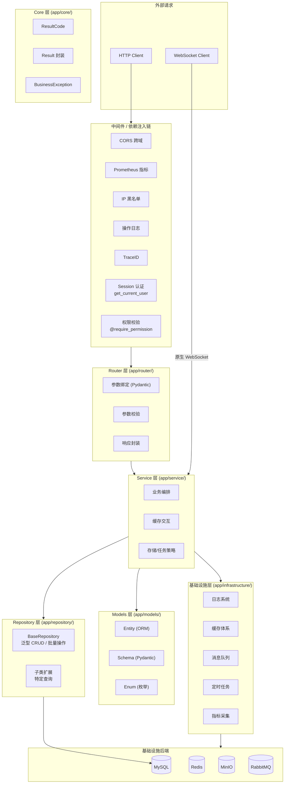

#### 2.2.2 层级职责

| 层级 | 包路径 | 职责 | 依赖方向 |
|------|--------|------|----------|
| **中间件/依赖注入** | `middleware/` + `dependencies/` + `decorators/` | 请求拦截、认证、鉴权、限流、防重提交、操作日志、TraceID、IP 黑名单 | ← 外部请求 |
| **Router 层** | `router/` | 参数绑定与校验（Pydantic）、调用 Service、统一响应封装 | → Service |
| **Service 层** | `service/` | 业务逻辑编排、缓存交互、存储/任务策略选择、异步任务分发 | → Repository + 基础设施 |
| **Repository 层** | `repository/` | 数据库 CRUD 封装、分页、模糊搜索、批量操作、复杂查询 | → SQLAlchemy ORM |
| **Models 层** | `models/` | ORM 实体、Schema 定义、Enum 常量 | 被 Router / Service / Repository 依赖 |
| **Core 层** | `core/` | 统一错误码、响应封装、业务异常 | 被所有层依赖 |
| **基础设施层** | `infrastructure/` | 日志、缓存、消息队列、定时任务、指标采集 | 被所有层依赖 |
| **工具层** | `utils/` | 密码、文件、日期、树形结构等纯函数工具 | 被 Service / Repository / Router 依赖 |

#### 2.2.3 依赖注入策略

项目基于 **FastAPI 原生依赖注入系统**实现：

- 使用 `Depends()` 声明依赖关系，由框架自动解析
- 数据库 Session 通过 `get_db`（`database.py`）异步生成器注入，自动管理生命周期
- Redis 连接通过 `get_redis`（`dependencies/redis.py`）生成器注入，或通过 `get_redis_client()` 获取全局单例（后台任务/中间件用）
- 权限校验通过 `@require_permission` 装饰器（`decorators/permission.py`）实现，装饰器内部依赖 `get_current_user` 注入 `UserContext`

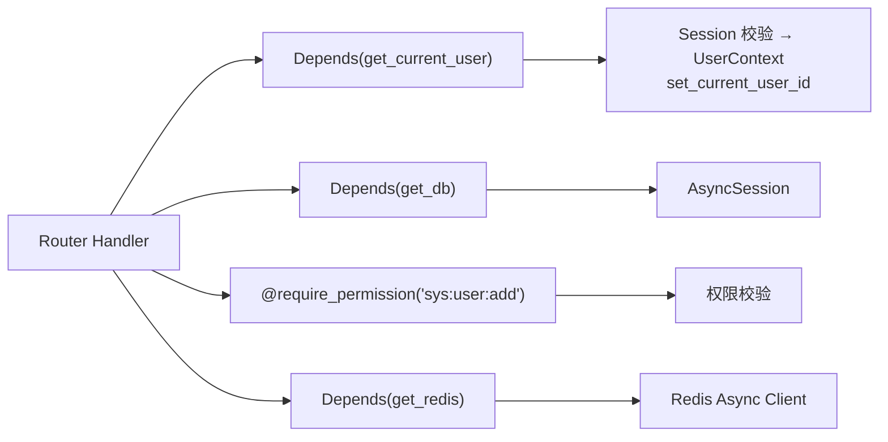

#### 2.2.4 数据模型分层

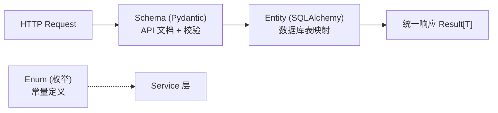

| 模型类型 | 包路径 | 职责 | 示例 |
|----------|--------|------|------|
| **Entity** | `models/entity/` | 数据库表映射，SQLAlchemy Column 定义 | `SysUser` |
| **Schema** | `models/schema/` | API 请求/响应 Schema，Pydantic 校验 + OpenAPI 自动生成 | `UserPageQuery` |
| **Enum** | `models/enum/` | 枚举常量定义 | `TaskStatus` |

> **注**：当前未单独划分 `models/vo/` 与 `models/form/` 目录。复合视图对象（如 `DatasetVO`）定义在 `models/schema/` 中，少数 VO（如 `EvaluationLogVO`）内联在 `router/evaluation.py` 中，后续计划统一收纳。

---

### 2.3 配置管理

#### 2.3.1 技术选型

| 组件 | 选型 | 说明 |
|------|------|------|
| 配置框架 | Pydantic Settings v2 | 类型安全、自动校验、环境变量绑定 |
| 环境变量 | `.env` 文件 + `os.getenv` | 敏感信息外部化 |
| 配置切换 | `APP_ENV` 环境变量 | 决定加载哪个配置类 |
| 计算属性 | `@property` / `@computed_field` | 自动派生 DATABASE_URL / REDIS_URL / RABBITMQ_URL |
| 实例缓存 | `@lru_cache` | `get_settings()` 缓存单例 |

#### 2.3.2 配置结构

```python
class Settings(BaseSettings):
    # 应用基础
    APP_NAME / APP_VERSION / DEBUG

    # 验证码配置
    CAPTCHA_LENGTH / CAPTCHA_WIDTH / CAPTCHA_HEIGHT
    CAPTCHA_FONT_SIZE / CAPTCHA_NOISE_LINES / CAPTCHA_EXPIRES

    # 共享密码（从 .env 加载，复用为多服务密码）
    DEHAZE_PASSWORD

    # 基础设施统一主机地址（从 .env 加载，DB_HOST/REDIS_HOST/MINIO_ENDPOINT 等均从此派生）
    DEHAZE_HOST

    # 数据库配置
    DB_HOST / DB_PORT / DB_NAME / DB_USER
    DATABASE_POOL_SIZE / DATABASE_MAX_OVERFLOW / DATABASE_POOL_RECYCLE / DATABASE_ECHO
    DATABASE_URL                   # @property 自动拼接

    # Redis 配置
    REDIS_HOST / REDIS_PORT / REDIS_DB
    REDIS_MAX_CONNECTIONS / REDIS_SOCKET_TIMEOUT / REDIS_HEALTH_CHECK_INTERVAL
    REDIS_URL / REDIS_PASSWORD     # @property 自动拼接

    # MinIO 对象存储配置
    MINIO_ENDPOINT / MINIO_ACCESS_KEY / MINIO_SECURE / MINIO_BUCKET_NAME
    MINIO_SECRET_KEY               # @property 返回 DEHAZE_PASSWORD
    FILE_STORAGE_TYPE              # minio / local

    # RabbitMQ 配置
    RABBITMQ_ENABLED / RABBITMQ_HOST / RABBITMQ_PORT / RABBITMQ_USER
    RABBITMQ_EXCHANGE / RABBITMQ_PREFETCH_COUNT / RABBITMQ_RETRY_DELAYS
    RABBITMQ_URL                   # @property 自动拼接

    # XXL-Job 配置
    XXLJOB_ENABLED / XXLJOB_ADMIN_URL / XXLJOB_ACCESS_TOKEN
    XXLJOB_EXECUTOR_APP_NAME / XXLJOB_EXECUTOR_HOST / XXLJOB_EXECUTOR_PORT

    # Prometheus 监控
    PROMETHEUS_ENABLED / PROMETHEUS_GPU_COLLECT_INTERVAL

    # 优雅关闭
    GRACEFUL_SHUTDOWN_TIMEOUT / GRACEFUL_SHUTDOWN_CANCEL_ON_TIMEOUT

    # 日志配置
    LOG_LEVEL / LOG_FORMAT / LOG_DIR / LOG_RETENTION_DAYS
    LOG_ENABLE_CONSOLE / LOG_ENABLE_FILE / LOG_FORMAT_JSON

    # 安全防护
    RATE_LIMIT_ENABLED / RATE_LIMIT_DEFAULT_TIMES / RATE_LIMIT_DEFAULT_SECONDS
    REPEAT_SUBMIT_ENABLED / REPEAT_SUBMIT_DEFAULT_INTERVAL
    IP_BLACKLIST_ENABLED / IP_BLACKLIST_THRESHOLD / IP_BLACKLIST_DURATION

    # WebSocket 跨 Worker
    WS_REDIS_CHANNEL / WS_ONLINE_KEY / WS_HEARTBEAT_INTERVAL / WS_ONLINE_TTL

    # TaskTracker 跨 Worker
    TASK_REDIS_KEY_PREFIX / TASK_HEARTBEAT_INTERVAL / TASK_REDIS_TTL

    # 设备配置
    DEVICE_ID                      # GPU 设备 ID 列表
```

#### 2.3.3 多环境支持

| 环境 | 配置类 | `APP_ENV` | 特性差异 |
|------|--------|-----------|----------|
| **开发** | `DevelopmentSettings` | `development` | DEBUG=True，SQL 日志输出，XXL-Job 关闭，RabbitMQ 启用 |
| **测试** | `TestingSettings` | `testing` | DEBUG=True，独立测试数据库 `dehaze_test` |
| **生产** | `ProductionSettings` | `production` | 强制校验密钥长度 ≥ 32 且 `DEHAZE_PASSWORD` 非空，JSON 日志 |

#### 2.3.4 敏感信息管理

所有敏感配置通过 `.env` 文件或环境变量注入：

```bash
# .env
DEHAZE_PASSWORD=shared-password-for-mysql-redis-minio
```

**安全校验**：
- `ProductionSettings.__init__` 校验 `DEHAZE_PASSWORD` 非空

> **设计取舍**：`DEHAZE_PASSWORD` 被复用为 MySQL、Redis、MinIO、RabbitMQ 的统一密码，简化部署但单点泄露即全盘沦陷。生产环境应通过独立 Secret 管理各组件凭证（未来改进）。

---

### 2.4 数据访问层

#### 2.4.1 技术选型

| 组件 | 选型 | 说明 |
|------|------|------|
| ORM | SQLAlchemy 2.0 + 异步模式 | 声明式模型、AsyncSession |
| 数据库驱动 | aiomysql（异步）+ PyMySQL（同步） | 异步为主，同步用于 Alembic 迁移 |
| 数据库迁移 | Alembic (纯 CLI) | 版本化 Schema 管理 |
| 对象存储 | MinIO Python SDK | 文件/图像存储 |

#### 2.4.2 异步引擎 & Session 管理

```python
# database.py 核心组件
engine = create_async_engine(
    settings.DATABASE_URL,
    pool_size=settings.DATABASE_POOL_SIZE,        # 10
    max_overflow=settings.DATABASE_MAX_OVERFLOW,  # 20
    pool_recycle=settings.DATABASE_POOL_RECYCLE,  # 3600
    pool_pre_ping=True,     # 连接借出前 ping，避免 MySQL 断连
    pool_timeout=10,        # 借不到连接 10s 超时
    echo=settings.DATABASE_ECHO,
)
async_session_factory = async_sessionmaker(
    engine, class_=AsyncSession, expire_on_commit=False, autocommit=False, autoflush=False,
)

# FastAPI 依赖注入
async def get_db() -> AsyncGenerator[AsyncSession, None]: ...

# 非依赖注入场景（后台任务等）
@asynccontextmanager
async def get_db_session() -> AsyncGenerator[AsyncSession, None]: ...
```

连接池参数：

| 参数 | 默认值 | 说明 |
|------|--------|------|
| `pool_size` | 10 | 连接池常驻连接数 |
| `max_overflow` | 20 | 最大溢出连接数（总计上限 30） |
| `pool_recycle` | 3600s | 连接回收周期 |
| `pool_pre_ping` | True | 连接借出前 ping，避免 MySQL `wait_timeout` 断连 |
| `pool_timeout` | 10s | 借不到连接的超时时间 |
| `expire_on_commit` | False | commit 后对象不过期，避免额外查询 |

#### 2.4.3 事务管理策略

采用 **"请求边界 = 事务边界"** 模型，由 `get_db()` / `get_db_session()` 统一管理 commit/rollback：

```python
# get_db() — FastAPI 路由依赖注入
async def get_db() -> AsyncGenerator[AsyncSession, None]:
    async with async_session_factory() as session:
        try:
            yield session
            await session.commit()       # 请求正常完成 → 自动提交
        except Exception:
            await session.rollback()     # 异常抛出 → 自动回滚
            raise

# get_db_session() — 非 HTTP 场景（后台任务、消息消费者）
@asynccontextmanager
async def get_db_session() -> AsyncGenerator[AsyncSession, None]:
    async with async_session_factory() as session:
        try:
            yield session
            await session.commit()
        except Exception:
            await session.rollback()
            raise
```

各层职责划分（设计规范）：

| 层级 | 事务职责 | 说明 |
|------|----------|------|
| Router 层 | 事务边界持有者 | 通过 `Depends(get_db)` 获取 session，请求结束自动 commit/rollback |
| Service 层 | 业务编排 | 组合多个 Repository 操作，**不做 commit** |
| Repository 层 | 数据操作 | 只做 `flush()`（获取自增 ID 时），不做 commit |
| 后台任务 | 自管事务 | 使用 `get_db_session()` 上下文管理器，按需显式 commit |

> **设计决策**：不引入 `@transactional` 装饰器。FastAPI 的 `Depends(get_db)` 天然就是事务边界的最佳承载点，装饰器会与 DI 签名冲突、且需要额外实现事务传播语义（REQUIRED/REQUIRES_NEW 等），性价比不高。

#### 2.4.4 Repository 层

引入泛型 `BaseRepository[T]`，提供标准 CRUD 操作，子类只需声明 `model` 类型即可继承全部能力：

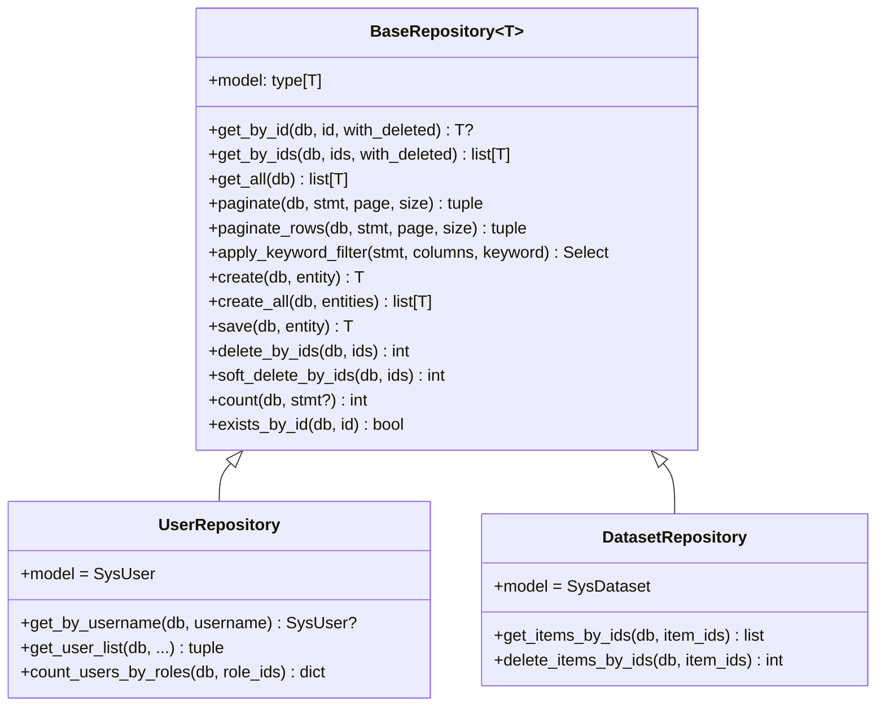

**设计决策**：Repository 层将 ORM 查询逻辑从 Service 层剥离，降低耦合度，便于单元测试时 Mock 数据层。

#### 2.4.5 BaseModel 审计字段自动填充

通过 SQLAlchemy `event.listens_for` 事件机制 + `ContextVar` 实现：

| 事件 | 触发时机 | 自动填充字段 |
|------|----------|-------------|
| `before_insert` | INSERT 前 | `create_time`、`update_time`、`create_by`、`update_by` |
| `before_update` | UPDATE 前 | `update_time`、`update_by` |

当前用户 ID 通过 `ContextVar` 线程安全地传递：

```text
get_current_user (依赖注入) → set_current_user_id(user.id)
    → ContextVar 存储
    → before_insert/before_update 事件读取
```

> **实现要点**：`before_update` 事件对 Core 层批量更新（`update().where(...)`）不触发是 SQLAlchemy 框架固有限制。`app/models/base.py` 提供 `get_audit_update_values()` 工具函数，所有 Core update 调用点（`base.py` / `task_repository.py` / `role_repository.py` / `dict_repository.py` / `input_history_repository.py`）已显式调用该函数注入审计字段；后台任务通过 `set_current_user_id(user_id)` 注入用户上下文，无上下文时回退 `SYSTEM_USER_ID`。

#### 2.4.6 存储分工

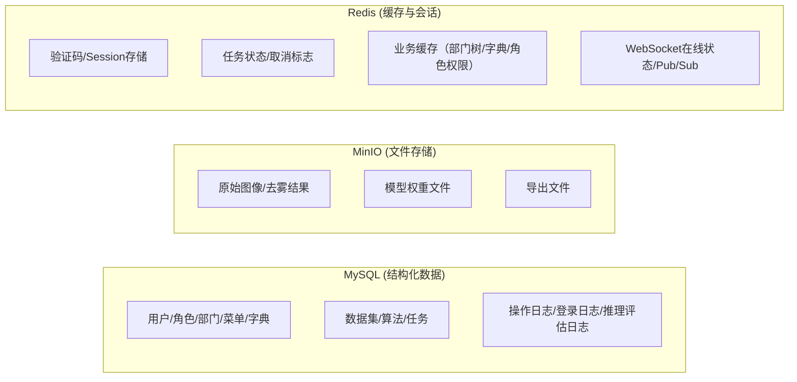

---

### 2.5 缓存体系

#### 2.5.1 架构设计

当前使用 Redis 异步客户端作为唯一缓存层（L2），通过连接池管理连接生命周期：

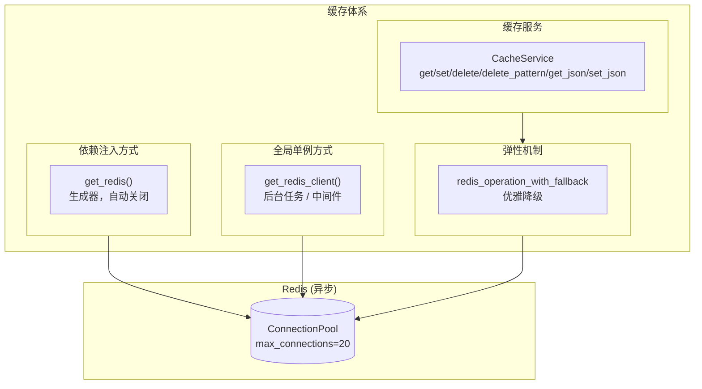

#### 2.5.2 连接池配置

| 参数 | 默认值 | 说明 |
|------|--------|------|
| `max_connections` | 20 | 最大连接数 |
| `socket_timeout` | 5.0s | 操作超时 |
| `socket_connect_timeout` | 5.0s | 连接超时 |
| `retry_on_timeout` | True | 超时是否重试 |
| `health_check_interval` | 30s | 健康检查间隔 |

#### 2.5.3 缓存用途矩阵

| 用途 | Key 格式 | TTL | 说明 |
|------|----------|-----|------|
| 验证码 | `captcha_code:{key}` | 5min | 登录验证码 |
| 用户会话 | `session:{sessionId}` | 7天 | Session 存储，滑动续期 |
| 任务状态 | `task:cache:{task_id}` | 24h | 导出任务进度缓存 |
| 任务取消标志 | `task:cancel:{task_id}` | 5min | 标记任务取消 |
| 任务运行状态 | `task:running:{task_id}` | 1h（心跳续期） | TaskTracker 跨 Worker 全局视图 |
| 部门树 | `dept:tree` | 1h | 部门树缓存 |
| 部门下拉 | `dept:options` | 1h | 部门下拉选项缓存 |
| 角色权限 | `role:perms:{role_code}` | 30min | 角色权限标识缓存 |
| WebSocket 在线 | `dehaze:ws:online_users` | 90s | 在线用户 sorted set |
| WebSocket 广播 | `dehaze:ws:broadcast` | - | Pub/Sub 频道 |
| IP 黑名单 | `ip:blacklist:{ip}` | 1h | 自动封禁的 IP |

#### 2.5.4 Redis 弹性机制

| 机制 | 实现 | 说明 |
|------|------|------|
| **优雅降级** | `redis_operation_with_fallback()` | Redis 不可用时执行 fallback 函数或返回默认值 |
| **L1 本地缓存** | `local_cache.py`（TTLCache + SingleFlight） | 进程内缓存，降低 Redis 压力，配合 SingleFlight 防击穿 |

```python
# redis_fallback.py
async def redis_operation_with_fallback(
    operation: Callable,
    default: Any = None,
    fallback: Optional[Callable] = None,
    operation_name: str = "",
) -> Any:
    try:
        return await operation()
    except Exception as e:
        logger.warning(f"Redis 操作失败 [{operation_name}]: {e}")
        if fallback is not None:
            return await fallback() if asyncio.iscoroutinefunction(fallback) else fallback()
        return default
```

> **实现要点**：缓存穿透/击穿/雪崩三大风险中，击穿通过 `local_cache.py` 的 SingleFlight 防护，雪崩通过 TTL 随机抖动防护；穿透（布隆过滤器）当前仅在 `local_cache.py` 提供 `BloomFilter` 工具类，需业务侧主动接入。`CacheService` 当前在 `menu_service`/`dept_service`/`dict_service` 等处每请求 `CacheService(redis)` 重新构造（共 10 处），L1 实例每请求新建，未来可改为单例以复用 L1 缓存。

#### 2.5.5 CacheService

`infrastructure/cache/cache.py` 提供轻量缓存服务封装：

| 方法 | 说明 |
|------|------|
| `get(key, default)` | 获取缓存值 |
| `set(key, value, ttl)` | 设置缓存（自动 JSON 序列化 dict/list） |
| `delete(key)` | 删除缓存 |
| `delete_pattern(pattern)` | 按模式批量删除（scan_iter） |
| `get_json(key, default)` | 获取并 JSON 反序列化 |
| `set_json(key, value, ttl)` | JSON 序列化后设置 |

`DeptCacheKeys` 是缓存 Key 集中管理的示例（`cache.py`），提供 `TREE`、`OPTIONS` 常量与 `all_patterns()` 批量清除方法。

#### 2.5.6 缓存演进规划

| 优先级 | 改进项 | 说明 | 状态 |
|--------|--------|------|------|
| P0 | 删除死代码 | `RedisCircuitBreaker` / `with_redis_retry` 已删除 | ✅ 已完成 |
| P0 | CacheService 单例化 | `menu_service`/`dept_service` 等每请求新建 CacheService，L1 失效 | 📋 规划中 |
| P1 | 缓存 Key 统一管理 | 引入 `CacheKeys` 命名空间，避免 Key 散落各处 | 📋 规划中 |
| P1 | 缓存穿透/雪崩防护 | 空值缓存、TTL 随机抖动（击穿已通过 SingleFlight 防护） | 📋 规划中 |
| P2 | 推理结果缓存 | 相同输入图像 + 相同算法的推理结果可缓存，避免重复计算 | 📋 规划中 |

---

### 2.6 消息队列

#### 2.6.1 技术选型

与 Java/Go 端保持一致的中间件选型：

| 消息中间件 | 用途 | 当前状态 |
|------------|------|----------|
| **RabbitMQ** | 异步任务分发（导出、批量操作等） | ✅ 已实现（aio-pika + MQ 优先 / asyncio.Task fallback） |
| **Kafka** | 日志收集与流处理 | 📋 规划中 |

#### 2.6.2 双通道任务分发架构

采用 **MQ 优先 + asyncio.Task fallback** 双通道架构，RabbitMQ 可用时消息持久化投递，不可用时自动降级为进程内异步任务：

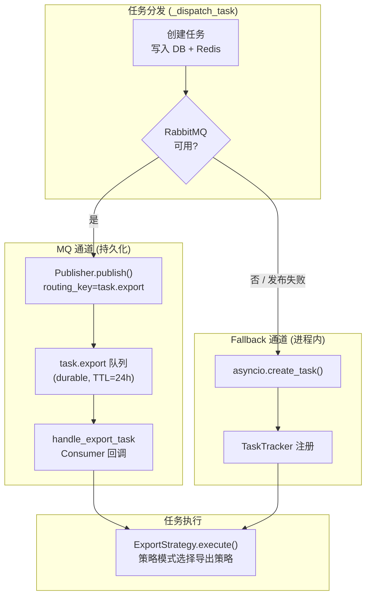

**双通道对比**：

| 特性 | MQ 通道 (RabbitMQ) | Fallback 通道 (asyncio.Task) |
|------|-------------------|-----------------------------|
| 消息持久化 | ✅ PERSISTENT 模式 | ❌ 进程内存 |
| 进程崩溃恢复 | ✅ 消息留在队列 | ❌ 任务丢失 |
| ACK 确认 | ✅ 处理成功后 ack | ❌ 无 |
| 失败重试 | ✅ nack + requeue | ❌ 需手动实现 |
| 死信队列 | ✅ DLX 兜底 | ❌ 无 |
| 跨进程/跨语言 | ✅ 共享队列 | ❌ 仅进程内 |

#### 2.6.3 Fallback 方案：asyncio.Task + TaskTracker

RabbitMQ 不可用时的降级方案，通过 `TaskTracker`（`service/task_tracker.py`）追踪进程内异步任务：

**TaskTracker 核心能力**：

| 能力 | 说明 |
|------|------|
| 任务注册 | `register(task_id, task, task_type, metadata)` |
| 关闭模式 | `initiate_shutdown()` 后拒绝新任务注册 |
| 等待完成 | `wait_for_completion(timeout)` 等待所有任务，超时后取消 |
| 自动清理 | 任务完成时通过 `add_done_callback` 自动移除 |
| 跨 Worker 全局视图 | Redis 注册任务状态 + 心跳续期，`get_global_running_tasks()` 返回全局视图 |

#### 2.6.4 任务状态流转

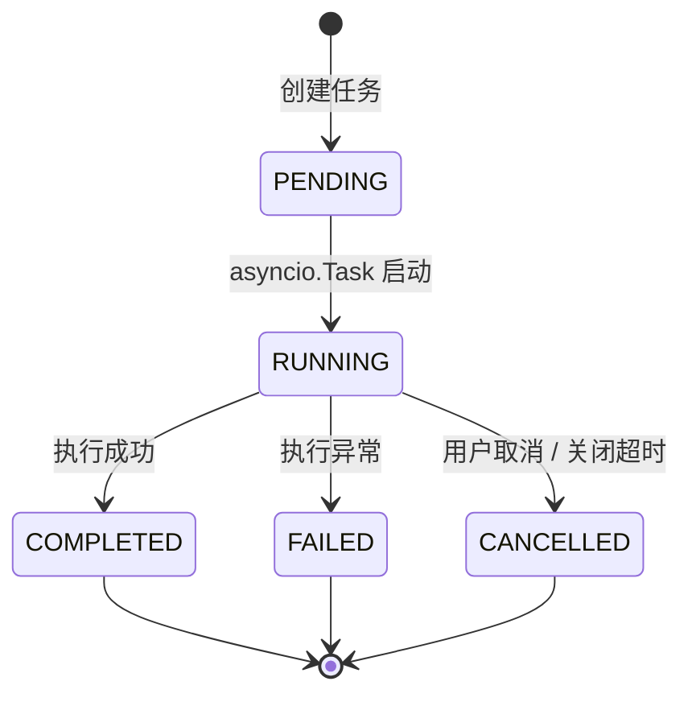

任务状态同时维护在 MySQL（持久化）和 Redis（实时查询）中。

#### 2.6.5 RabbitMQ 架构

与 Java/Go 端对齐，采用相同的交换机和队列设计（`infrastructure/mq/` 模块）：

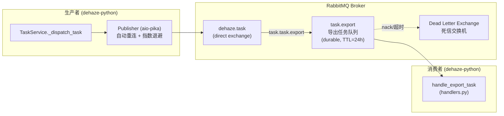

#### 2.6.6 RabbitMQ 配置

```python
# Settings (config.py)
RABBITMQ_ENABLED: bool = False              # 是否启用
RABBITMQ_HOST: str = "localhost"
RABBITMQ_PORT: int = 5672
RABBITMQ_USER: str = "guest"
RABBITMQ_EXCHANGE: str = "dehaze.task"       # 交换机（与 Go/Java 端一致）
RABBITMQ_EXCHANGE_TYPE: str = "direct"
RABBITMQ_ROUTING_KEY_PREFIX: str = "task"    # 路由键前缀
RABBITMQ_RECONNECT_MAX_RETRIES: int = 0      # 0 = 无限重试
RABBITMQ_RECONNECT_INITIAL_INTERVAL: float = 1.0
RABBITMQ_RECONNECT_MAX_INTERVAL: float = 30.0
RABBITMQ_PREFETCH_COUNT: int = 2             # 消费者预取数量
RABBITMQ_RETRY_DELAYS: list[int] = [5000, 30000, 300000]  # 分级重试延迟（ms）
```

#### 2.6.7 MQ 模块结构

```text
app/infrastructure/mq/
├── __init__.py        # 模块入口
├── publisher.py       # Publisher：消息发布、自动重连、指数退避
├── consumer.py        # Consumer：多队列消费、handler 注册、ack/nack
├── connection.py      # 全局单例管理（init_mq / close_mq / get_publisher / get_consumer）
└── handlers.py        # 消费者 handler（handle_export_task）
```

**已完成迁移**：

| 阶段 | 内容 | 状态 |
|------|------|------|
| **Phase 1** | 引入 `aio-pika`，实现 Publisher / Consumer（自动重连 + 指数退避） | ✅ 已完成 |
| **Phase 2** | 导出任务从 asyncio.Task 迁移为 MQ 优先 + fallback 双通道 | ✅ 已完成 |
| **Phase 3** | 与 Java/Go 端共享队列，实现跨语言任务协作 | 📋 规划中 |

#### 2.6.8 任务策略层

`service/task/` 采用策略模式实现不同类型的导出任务：

```text
app/service/task/
├── strategy.py           # ExportStrategy 抽象基类（execute + 进度回调 + 取消检测）
├── factory.py            # ExportStrategyFactory（模块加载时自动注册）
├── zip_utils.py          # ZIP 打包工具（MinIO 下载 + run_in_executor 压缩）
└── strategies/           # 具体导出策略
    ├── dataset_export.py # 数据集导出
    ├── batch_download.py # 批量下载
    ├── item_download.py  # 单项下载
    └── custom_export.py  # 自定义导出
```

#### 2.6.9 Kafka 规划（日志管道）

与 Java/Go 端保持一致：

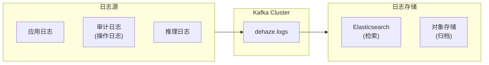

**Python 端 Kafka 客户端选型**：`aiokafka`（原生 asyncio 支持，与 FastAPI 异步模型一致）。

---

### 2.7 定时任务

#### 2.7.1 技术选型

| 组件 | 选型 | 说明 |
|------|------|------|
| **调度平台** | XXL-Job Admin | 与 Java/Go 端共享调度中心 |
| **Python 执行器** | pyxxl ≥ 0.4 | Python XXL-Job 执行器，原生 asyncio 支持 |
| **当前状态** | ✅ 已实现 | 执行器已集成，3 个定时任务已注册 |

#### 2.7.2 架构设计

与 Java/Go 端共享 XXL-Job Admin，Python 端作为独立 Executor 注册：

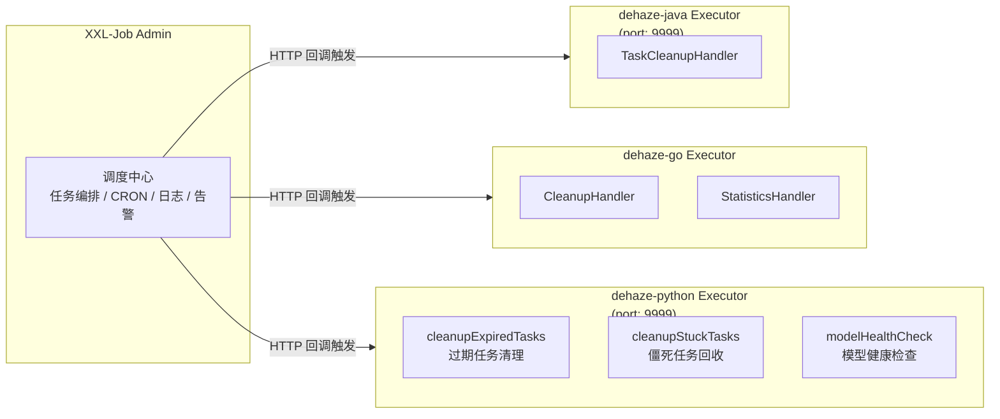

#### 2.7.3 已注册任务清单

| 任务名 | CRON 建议 | 功能 | 状态 |
|--------|-----------|------|------|
| `cleanupExpiredTasks` | `0 0 2 * * ?` | 删除 7 天前已完成/取消任务、30 天前所有任务，清理 Redis 缓存 | ✅ 已实现 |
| `cleanupStuckTasks` | `0 0 * * * ?` | 将超过 24h 的 pending/processing 任务标记为 failed | ✅ 已实现 |
| `modelHealthCheck` | `0 */30 * * * ?` | 检查 GPU 可用性/显存使用率、DB 连接、Redis 连接 | ✅ 已实现 |
| `cleanupOrphanFiles` | 建议 `0 0 4 * * ?` | 清理 MinIO 中无数据库记录关联的孤儿文件 | ✅ 已实现 |
| `cleanupTempFiles` | 建议 `0 0 5 * * ?` | 清理临时目录中过期的上传/导出临时文件 | ✅ 已实现 |

#### 2.7.4 XXL-Job 配置

```python
# Settings (config.py)
XXLJOB_ENABLED: bool = False                              # 是否启用
XXLJOB_ADMIN_URL: str = "http://localhost:8080/xxl-job-admin/api/"
XXLJOB_ACCESS_TOKEN: str = "default_token"
XXLJOB_EXECUTOR_APP_NAME: str = "xxl-job-executor-dehaze-python"
XXLJOB_EXECUTOR_HOST: str = "0.0.0.0"
XXLJOB_EXECUTOR_PORT: int = 9999                          # 与 Java 端区分
XXLJOB_EXECUTOR_LOG_PATH: str = "logs/pyxxl.log"
XXLJOB_TASK_LOG_DIR: str = "logs/xxljob-tasks"
XXLJOB_PID_FILE: str = "logs/pyxxl.pid"
```

#### 2.7.5 Job 模块结构

```text
app/infrastructure/job/
├── __init__.py        # 模块入口
├── executor.py        # 执行器生命周期管理（init_xxljob / close_xxljob / get_xxljob_runner）
└── handlers.py        # 定时任务 handler（@xxl_handler 装饰器注册）
```

`executor.py` 使用 `PyxxlRunner.run_with_daemon()` 启动 daemon 子进程（`multiprocessing.Process`），主进程退出时通过 `daemon.terminate()` 终止子进程，并清理 PID 文件。

> **多 Worker 守卫**：`app/lifecycle.py` 的 `_try_become_main_worker()` 使用 fcntl 文件锁（`LOCK_EX | LOCK_NB`）互斥，确保 uvicorn 多 Worker 部署下仅主 Worker 启动 XXL-Job executor daemon，避免端口冲突。Windows 开发环境（单 Worker）直接返回 True。

#### 2.7.6 迁移进度

| 阶段 | 内容 | 状态 |
|------|------|------|
| **Phase 1** | 部署 XXL-Job Admin（与 Java/Go 端共享） | ✅ 已完成 |
| **Phase 2** | 引入 pyxxl 执行器，注册到调度中心 | ✅ 已完成 |
| **Phase 3** | 实现任务清理、僵死回收、模型健康检查 | ✅ 已完成 |
| **Phase 4** | 实现孤儿文件清理、临时文件清理 | ✅ 已完成 |
| **Phase 5** | 新增缓存预热、统计报表等高级定时任务 | 📋 规划中 |

---

### 2.8 安全中间件

#### 2.8.1 认证体系

| 组件 | 实现 | 说明 |
|------|------|------|
| Session 认证 | Redis `session:{sessionId}` | 存储 userId、username、authorities，TTL 7 天，剩余 < 24h 自动续期 |
| 用户上下文 | `Depends(get_current_user)` | 自动解析 Session → UserContext → `set_current_user_id` |
| 可选验证 | `Depends(get_current_user_optional)` | 未登录返回 None（不设置 user_id） |
| 密码加密 | bcrypt（`utils/password.py`） | 密码哈希，专用线程池异步执行 |
| 验证码 | Redis 存储 + Pillow 生成 | 可配置长度/尺寸/字体/干扰线/过期时间 |

**UserContext 结构**：

```python
class UserContext(BaseModel):
    id: int
    username: str
    dept_id: Optional[int]
    data_scope: Optional[int]
    roles: list[str]

    @property
    def is_root(self) -> bool:
        return "ROOT" in self.roles
```

#### 2.8.2 权限体系

权限校验通过 **`require_permission` 装饰器**实现，装饰器内部依赖 `get_current_user` 注入 `UserContext`：

```python
@router.post("/users")
@require_permission("sys:user:add")
async def create_user(user: UserContext, ...):
    ...
```

权限匹配支持通配符：

```text
用户 → 角色（多对多） → 权限标识（多对多）
权限格式: 模块:功能:操作（如 sys:user:add）
通配符: * 匹配所有（ROOT 用户自动跳过校验）
fnmatch 双向匹配: sys:user:* ↔ sys:user:add
```

> **跨平台一致性**：权限匹配使用 `fnmatch.fnmatchcase`（大小写敏感），确保 Windows 和 Linux 行为一致。

#### 2.8.3 安全防护

| 防护类型 | 实现方式 | 说明 |
|----------|----------|------|
| SQL 注入 | SQLAlchemy 参数化查询 | ORM 层面天然防护 |
| XSS | `validate_no_xss` 输入校验 | Schema 层面校验 HTML 标签和 javascript: 协议 |
| CSRF | Session Cookie（SameSite=Lax） | 跨站请求不携带 Cookie |
| CORS | CORSMiddleware | 限制允许的 Origin |
| 暴力破解 | 验证码 + IP 黑名单 | 异常请求自动封禁 |
| 限流 | `RateLimitMiddleware` (ASGI 中间件) | 基于 Redis INCR+EXPIRE 固定窗口，默认 60 次/分钟，支持 X-Forwarded-For/X-Real-IP 代理头 |
| 防重复提交 | `repeat_submit` 装饰器 | 默认 5 秒内禁止重复提交 |

> **XSS 防护**：`app/models/schema/common.py` 的 `validate_no_xss` 校验器在 Pydantic Schema 层拦截 HTML 标签和 `javascript:` 协议，已覆盖 dataset/dept/dict/menu/role/user 全部用户输入模型；`app/service/dataset_service.py` 和 `dept_service.py` 额外在 Service 层通过 `_XSS_PATTERN` 正则做二次校验。
>
> **Session 注销**：`auth.py` 的注销端点直接从 Redis 删除 Session，使会话立即失效。

---

### 2.9 日志系统

#### 2.9.1 技术选型

| 组件 | 选型 | 说明 |
|------|------|------|
| 日志框架 | Python `logging` | 标准库，生态兼容性好 |
| 日志轮转 | RotatingFileHandler / TimedRotatingFileHandler | 按大小（10MB）或按天切割 |
| 编码处理 | 自研 `UTF8RotatingFileHandler` / `UTF8TimedRotatingFileHandler` | 确保中文日志正确输出 |
| 结构化日志 | `python-json-logger` + 自研 `JsonFormatter` | 生产环境 JSON 格式，注入 trace_id |

#### 2.9.2 日志配置

| 配置项 | 值 | 说明 |
|--------|-----|------|
| 格式 | `%(asctime)s - %(levelname)s [%(trace_id)s] --- [%(thread)d] %(name)s : %(message)s` | 含时间、级别、TraceID、线程 ID、模块名 |
| 文件路径 | `logs/{yyyy-MM-dd}/info.log`、`error.log` | 按日期分目录，info/error 分文件 |
| 按日期切割 | 每天午夜切到新日期目录 | `DailyDirectoryFileHandler` |
| 保留天数 | 30 天 | 超期日期目录自动清理 |
| 控制台输出 | 同时输出 | 开发环境调试用 |
| JSON 格式 | 文件始终 JSON；控制台生产环境 JSON | `LOG_FORMAT_JSON=True`，注入 timestamp/level/logger/service/trace_id |

#### 2.9.3 TraceID 注入

`infrastructure/logging.py` 通过 `ContextVar` 注入 TraceID：

- `JsonFormatter`（JSON 格式）：自动注入 `trace_id` 字段
- `TraceIDFilter`（文本格式）：注入 `record.trace_id` 供格式模板使用

TraceID 由 `middleware/trace.py` 的 `TraceMiddleware` 在请求入口生成并设置到 ContextVar。

#### 2.9.4 操作日志（结构化审计）

通过 `OperationLogMiddleware`（Starlette BaseHTTPMiddleware）实现全链路操作日志：

| 特性 | 说明 |
|------|------|
| 写入方式 | `asyncio.create_task()` 异步写入 MySQL |
| 敏感字段过滤 | password / token / secret / authorization 等自动脱敏 |
| 排除路径 | `/health`、`/docs`、`/redoc`、`/openapi.json`、`/metrics`、`/favicon.ico` |
| 请求体截断 | 最大 500 字符 |
| 记录内容 | Method、Path、Status、Latency(ms)、IP、UserAgent、请求体、响应体 |

#### 2.9.5 日志演进规划

```
当前: Python logging → 文件（按大小/天切割）
规划: logging → Kafka → Elasticsearch（检索）/ 对象存储（归档）
```

| 优先级 | 改进项 | 说明 |
|--------|--------|------|
| P1 | 结构化日志全环境启用 | JSON 格式当前仅生产环境启用，开发环境应同步 |
| P1 | f-string 日志懒求值 | 大量 `logger.info(f"...")` 应改为 `logger.info("...", arg)` |
| P2 | Kafka 日志管道 | 通过 aiokafka 将日志异步发送到 Kafka |
| P3 | 操作日志规范化 | 统一操作日志字段，与 Java/Go 端对齐 |

---

### 2.10 可观测性

#### 2.10.1 当前状态

| 能力 | 状态 | 说明 |
|------|------|------|
| 应用日志 | ✅ 已实现 | 文件 + 控制台双输出，支持 JSON 结构化 |
| 操作审计日志 | ✅ 已实现 | 全链路请求记录，异步写入 MySQL |
| 健康检查 | ✅ 已实现 | `GET /health`（liveness）+ `GET /ready`（readiness） |
| Prometheus 指标 | ✅ 已实现 | HTTP / GPU / 推理 / 任务 / 缓存 五大类指标 |
| TraceID | ✅ 已实现 | 请求级 TraceID 透传与回写 |
| 分布式追踪 | 📋 规划中 | OpenTelemetry 集成（跨服务 Span） |

#### 2.10.2 健康检查端点

| 端点 | 功能 | 返回信息 |
|------|------|----------|
| `GET /health` | liveness 探针 | status / app / version（始终 200） |
| `GET /ready` | readiness 探针 | 检查 DB + Redis + RabbitMQ（如启用），任一不可用返回 503 |

#### 2.10.3 Prometheus 指标体系

通过 `infrastructure/metrics/` 模块提供四大类指标：

| 指标类别 | 模块 | 关键指标 |
|----------|------|----------|
| **HTTP 指标** | starlette-exporter | 请求量、请求延迟、状态码分布 |
| **GPU 指标** | `gpu_metrics.py` | GPU 利用率、显存使用、温度、功耗 |
| **推理指标** | `inference_metrics.py` | 推理耗时（Histogram）、推理请求计数、图像大小、批大小 |
| **任务指标** | `task_metrics.py` | 任务队列深度、处理中任务数、处理耗时 |

GPU 指标采集器作为后台任务运行，通过配置控制采集间隔：

```python
PROMETHEUS_ENABLED = True
PROMETHEUS_GPU_COLLECT_INTERVAL = 5  # 秒
```

> **多 Worker 指标聚合**：`config.py` 在 Settings 加载时将 `PROMETHEUS_MULTIPROC_DIR` 传播到 OS 环境变量并创建目录；`router/metrics.py` 的 `/metrics` 端点检测到该环境变量后切换到 `MultiProcessCollector`，聚合所有 Worker 进程的指标。推理指标通过 `prediction_service.predict()` 的 finally 块手动调用 `record_inference_metrics()` 采集，包含 `algorithm` / `duration_seconds` / `status` / `image_size` 参数。

#### 2.10.4 可观测性演进规划

| 优先级 | 改进项 | 说明 |
|--------|--------|------|
| P2 | OpenTelemetry 集成 | 跨服务 Span 追踪，httpx 请求透传 TraceID |
| P3 | Grafana Dashboard | 预置 GPU 利用率、推理吞吐、任务积压等面板 |

---

### 2.11 三端对照

| 基础设施能力 | dehaze-python | dehaze-java | dehaze-go | 一致性 |
|-------------|---------------|-------------|-----------|--------|
| **HTTP 框架** | FastAPI (uvicorn) | Spring MVC (Tomcat) | Gin | 接口语义一致 |
| **ORM** | SQLAlchemy 2.0 (异步) | MyBatis-Plus | GORM | 功能对等 |
| **Repository** | BaseRepository 泛型基类 | Mapper 层 | Repository 接口 | 功能对等 |
| **缓存** | Redis (单级 + local_cache L1) | Spring Cache + 多级 (Caffeine L1 + Redis L2) | 多级缓存 (gkit local_cache + Redis) | Java/Go 已多级，Python L1 部分接入 |
| **消息队列** | ✅ aio-pika RabbitMQ (MQ优先+fallback) | ✅ RabbitMQ（消费者 TODO 桩） | ✅ RabbitMQ（handler.go TODO 桩） | Python 端已落地（2.6.7 Phase 2），Java/Go 端为 TODO 桩 |
| **定时任务** | ✅ pyxxl XXL-Job (5 个任务已注册) | 仅集成 Executor，未注册 @XxlJob | Ticker → XXL-Job | Python 端落地最多 |
| **日志** | Python logging + JSON | SLF4J + Logback | Zap | 格式/级别统一 |
| **日志管道** | 未实现 → Kafka(规划) | Kafka 死代码已删除 | 未实现 → Kafka(规划) | 统一规划 |
| **认证** | Redis Session | Spring Security + Session | 自研中间件 + Session | Session 机制互通 |
| **权限** | RBAC (Depends + @require_permission 装饰器) | RBAC (@PreAuthorize) | RBAC (中间件) | 权限标识一致 |
| **数据权限** | SQLAlchemy 查询装饰(规划) | MyBatis-Plus 拦截器 | GORM Plugin (Callback) | 语义一致，Go DataScope 当前永不生效 |
| **自动填充** | SQLAlchemy Event + ContextVar | MetaObjectHandler | GORM Callback | 字段名一致 |
| **API 文档** | FastAPI OpenAPI 3.1 | Knife4j (OpenAPI 3) | Swagger (swag) | 规范一致 |
| **监控** | prometheus-client | Micrometer + Prometheus | client_golang | 指标命名统一 |
| **健康检查** | `/health` + `/ready` | Actuator `/actuator/health` | `/health` + `/ready` | 功能对等 |
| **错误码** | 5 位字符串 (A0/B0/C0) | 5 位字符串 (A0/B0/C0) | 5 位字符串 (A0/B0/C0) | ✅ 完全一致 |
| **响应格式** | `{code, msg, data}` | `{code, msg, data}` | `{code, msg, data}` | ✅ 完全一致 |
| **WebSocket** | FastAPI 原生 WebSocket + Redis Pub/Sub | STOMP + SockJS | — | Python 跨 Worker 已实现 |
| **对象存储** | MinIO 直连 + 存储抽象层 | MinIO / 阿里云 OSS | 通过 API | Python 端需直接处理图像 |
| **Redis 弹性** | redis_operation_with_fallback 已实现（2.5.4），重试/熔断死代码已删除（2.5.6 P0 ✅） | Lettuce 自动重连 | 自研重试 | Python 端降级已实现 |
| **并发模型** | asyncio 协程 + 多 Worker | 线程池 + Tomcat 线程 | Goroutine | 各语言最优实践 |
| **限流/防重** | 装饰器 (Redis 计数) | 注解 + Redis | 中间件 | 功能对等 |
| **IP 黑名单** | ✅ 中间件自动封禁 | ✅ 中间件 | ✅ 中间件 | 三端对齐 |

---

### 2.12 应用生命周期管理

#### 2.12.1 启动流程

生命周期管理由独立的 `app/lifecycle.py` 模块承载，通过 FastAPI Lifespan 上下文管理器实现完整的启动/关闭控制：

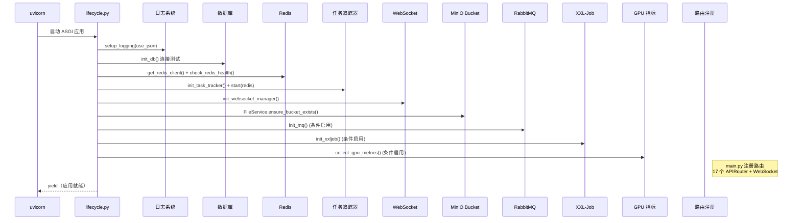

#### 2.12.2 优雅关闭

uvicorn 收到 `SIGTERM/SIGINT` 后自动触发 Lifespan 关闭阶段，由 `_graceful_shutdown()` 编排关闭顺序：

```text
收到 SIGINT/SIGTERM
    → 1. TaskTracker.initiate_shutdown()（拒绝新任务注册）
    → 2. WebSocketService.broadcast_shutdown_notification()（通知客户端）
    → 3. TaskTracker.wait_for_completion(timeout=30s)（等待运行中任务，超时后取消）
    → 3.5 TaskTracker.stop()（停止 Redis 状态同步）
    → 3.6 close_websocket_manager()（关闭跨 Worker 通信）
    → 4. close_xxljob()（终止 XXL-Job daemon 子进程）
    → 5. close_mq()（关闭 RabbitMQ Publisher/Consumer）
    → 6. GPUMetricsCollector.stop()（停止 GPU 指标采集）
    → 7. close_redis()（关闭 Redis 连接池）
    → 8. close_db()（关闭数据库连接池 engine.dispose）
```

#### 2.12.3 部署模式

| 环境 | 启动方式 | 并发模型 |
|------|----------|----------|
| **开发** | `uvicorn app.main:app --reload` | 单 Worker + 热重载 |
| **生产** | `uvicorn app.main:app --host 0.0.0.0 --port 80 --workers 4` | 多 Worker 进程 |
| **Docker** | NVIDIA CUDA 12.1 基础镜像 | uvicorn 多 Worker + GPU 推理 |

> **多 Worker 注意事项**：XXL-Job executor、GPU 指标采集器、Prometheus 指标聚合通过 `app/lifecycle.py` 的 fcntl 文件锁主 Worker 守卫 + `PROMETHEUS_MULTIPROC_DIR` 环境变量统一处理，仅主 Worker 启动守护进程，多 Worker 指标通过 `MultiProcessCollector` 聚合。

#### 2.12.4 本地开发启动

本地开发统一通过项目根目录 `scripts/run.py` 管理三端后端的生命周期，避免手动在各子项目目录下执行启动命令：

```bash
# 启动单个服务
python scripts/run.py run python

# 启动全部后端
python scripts/run.py run all

# 停止 / 重启
python scripts/run.py stop python
python scripts/run.py restart go,python,java

# 查看运行状态
python scripts/run.py ps
```

启动后控制台输出（stdout/stderr）重定向到 `dehaze-python/logs/{yyyy-MM-dd}/console.log`（追加模式，不再覆盖历史）。应用自身日志按 [06-部署架构.md 7.3 日志规范](../../02-系统架构/06-部署架构.md) 写入 `logs/{yyyy-MM-dd}/info.log` 与 `error.log`。

查看日志：

```bash
# 查看 console.log 最近 50 行（run.py 内置）
python scripts/run.py logs python

# 查看 info.log
tail -f dehaze-python/logs/$(date +%F)/info.log

# 查看错误日志
cat dehaze-python/logs/$(date +%F)/error.log
```

---

### 2.13 HTTP 服务与中间件

#### 2.13.1 技术选型

| 组件 | 选型 | 说明 |
|------|------|------|
| Web 框架 | FastAPI ≥ 0.115 | ASGI 异步框架，原生 async/await |
| ASGI 服务器 | uvicorn (标准模式) | 高性能 ASGI 服务器 |
| API 文档 | FastAPI 内置 (OpenAPI 3.1) | `/docs` (Swagger UI) + `/redoc` (ReDoc) |
| WebSocket | FastAPI 原生 WebSocket | 无需第三方库 |
| Schema 校验 | Pydantic 2.x | 请求/响应自动校验和文档生成 |
| 响应过滤 | `NonNullJSONResponse` | 过滤响应中的 null 字段 |

#### 2.13.2 中间件链

请求经过的处理层按注册顺序（后注册先执行），实际请求进入顺序：

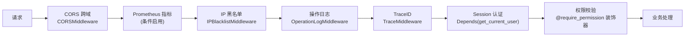

#### 2.13.3 中间件清单

| 组件 | 类型 | 功能 | 作用范围 |
|------|------|------|----------|
| `CORSMiddleware` | Starlette 中间件 | 跨域资源共享，开发/生产环境配置不同 Origin | 全局 |
| `PrometheusMiddleware` | starlette-exporter | Prometheus HTTP 指标采集 | 全局（条件启用） |
| `IPBlacklistMiddleware` | ASGI 中间件 | IP 黑名单检查 + 异常请求自动封禁 | 全局 |
| `OperationLogMiddleware` | ASGI 中间件 | 请求/响应全链路记录（异步写入 MySQL） | 全局（排除健康检查等路径） |
| `TraceMiddleware` | BaseHTTPMiddleware | TraceID 生成 / 透传 / 回写响应头 | 全局 |
| `RateLimitMiddleware` | ASGI 中间件 | IP+路径 固定窗口限流（Redis INCR+EXPIRE），支持 X-Forwarded-For/X-Real-IP 代理头 | 全局（排除健康检查等路径） |
| `get_current_user` | FastAPI Depends | Session 验证、UserContext 注入 | 受保护路由 |
| `get_current_user_optional` | FastAPI Depends | 未登录返回 None（不设置 user_id） | 可选认证路由 |
| `require_permission` | 函数装饰器 | RBAC 权限校验（支持通配符匹配） | 受保护路由 |
| `repeat_submit` | 函数装饰器 | 防重复提交 | 受保护路由 |

> 注：权限校验**仅通过 `require_permission` 装饰器**实现，不存在 `PermissionChecker` Depends 工厂。装饰器内部依赖 `get_current_user` 注入 `UserContext`。

#### 2.13.4 CORS 配置

| 环境 | 允许 Origin |
|------|-------------|
| 开发 | `localhost:5173/5174/5175/5176/5177/5183/5184/8081`、`127.0.0.1:5173/5174/5175/5176/5177/5183/5184/8081` |
| 生产 | 由 `CORS_ORIGINS` 环境变量配置 |

#### 2.13.5 路由注册

采用 FastAPI APIRouter 模式，在 `app/router/__init__.py` 的 `init_routes()` 集中注册，`main.py` 中额外注册 WebSocket 路由，共 18 个 APIRouter 实例 + 1 个 WebSocket：

| 路由模块 | 路径前缀 | 说明 |
|----------|----------|------|
| health | `/health` | 健康检查（liveness） |
| ready | （无前缀） | 就绪检查（`/ready`，检查 DB/Redis/RabbitMQ） |
| metrics | `/metrics` | Prometheus 指标端点（条件启用） |
| auth | `/api/v1/auth` | 认证（登录/注销/刷新/验证码） |
| user | `/api/v1/users` | 用户管理 |
| role | `/api/v1/roles` | 角色管理 |
| menu | `/api/v1/menus` | 菜单管理 |
| dept | `/api/v1/depts` | 部门管理 |
| dict | `/api/v1/dicts` | 字典管理 |
| dataset | `/api/v1/datasets` | 数据集管理 |
| dataset_item | `/api/v1/datasets/{datasetId}/items` | 数据项管理 |
| item_file | `/api/v1/items/{itemId}/files` | 数据项文件管理 |
| algorithm | `/api/v1/algorithms` | 算法管理 |
| algorithm_select | `/api/v1/algorithm-select` | 算法选择（推荐/收藏/对比） |
| file | `/api/v1/files` | 文件管理 |
| task | `/api/v1/tasks` | 导出任务 |
| prediction | `/api/v1/predictions` | 去雾预测 |
| evaluation | `/api/v1/evaluations` | 效果评估 |
| image_input | `/api/v1/image-input/history` | 图像输入历史记录 |
| websocket | `/ws` | WebSocket 实时通信 |

---

### 2.14 统一响应与错误处理

#### 2.14.1 响应格式

```json
{
  "code": "00000",
  "msg": "success",
  "data": { ... }
}
```

通过 `core/result.py` 提供泛型 `Result[T]` 和工厂函数：`success()` / `error()` / `warning()`。

#### 2.14.2 错误码体系

与 Java/Go 端共用同一套错误码规范（详见 [API 规范](../02-系统架构/04-API规范.md)）：

| 前缀 | 类别 | 示例 |
|------|------|------|
| `00` | 成功 | `00000` - 一切 ok |
| `A0` | 用户端错误 | `A0001` - 用户端错误, `A0200` - 登录异常, `A0400` - 参数错误 |
| `B0` | 系统执行错误 | `B0001` - 系统执行出错, `B0210` - 并发限流 |
| `C0` | 第三方服务错误 | `C0001` - 调用第三方服务出错, `C0300` - 数据库服务出错 |

#### 2.14.3 全局异常处理

通过 `register_exception_handlers(app)`（`core/exceptions.py`）注册 FastAPI 全局异常处理器：

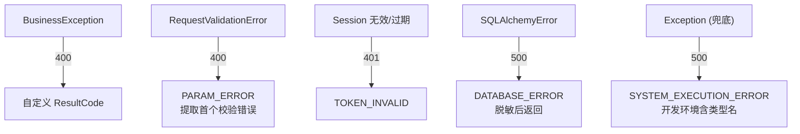

---

### 2.15 实时通信

#### 2.15.1 WebSocket 方案

基于 FastAPI 原生 WebSocket 实现，不依赖第三方库。通过 Redis Pub/Sub 实现跨 Worker 通信：

| 端点 | 协议 | 认证方式 |
|------|------|----------|
| `/ws?sessionId=SESSION_ID` | 原生 WebSocket | URL Query 参数传递 Session ID |

#### 2.15.2 跨 Worker 通信架构

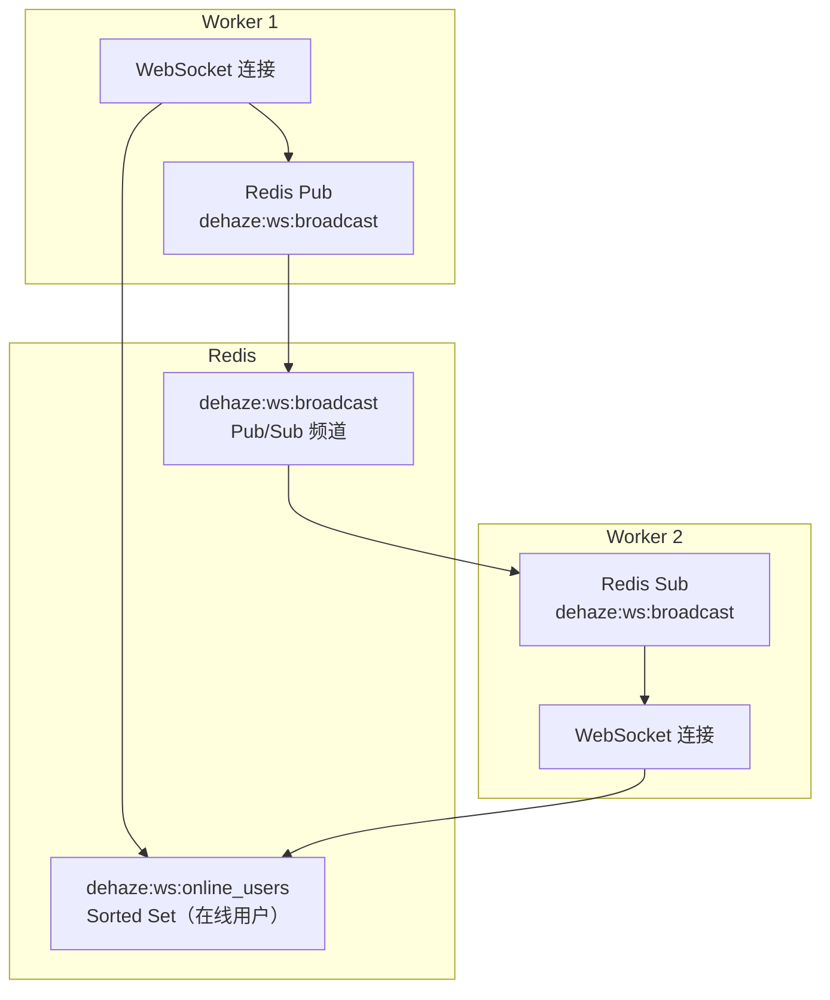

#### 2.15.3 消息类型

| 事件 | 方向 | 用途 |
|------|------|------|
| `connected` | Server → Client | 连接成功确认 |
| `ping` / `pong` | 双向 | 心跳检测（间隔 30s） |
| `broadcast` | Server → Client | 广播消息（推理进度、任务状态） |
| `private_message` | Server → Client | 私信消息 |
| `user_online` / `user_offline` | Server → Client | 用户上下线通知 |
| `shutdown_notification` | Server → Client | 服务关闭通知 |

---

### 2.16 通用导入导出框架

系统提供统一的导入导出能力，通过 **Handler 模式 + 通用策略** 实现复用，各业务模块只需实现 `ExportHandler`/`ImportHandler` 接口，不各自编写 Router/Service。

#### 2.16.1 核心组件

| 组件 | 职责 |
|------|------|
| `ImportExportRouter` | 统一入口，提供 `/{module}/_export`、`/{module}/_import`、`/{module}/template` 接口 |
| `ImportExportService` | 通用服务层：同步/异步判断、文件验证、Handler 路由、任务创建 |
| `ExportHandlerRegistry` / `ImportHandlerRegistry` | 处理器注册表，启动时按 `get_module()` 自动注册 |
| `TemplateManager` | 模板动态生成，根据 `get_field_configs()` 生成表头和示例数据 |
| `ImportExportFileGenerator` | 文件生成器，封装 openpyxl（Excel）和 csv（CSV）流式写入 |
| `GenericExportStrategy` / `GenericImportStrategy` | 通用任务策略，注册到 `ExportStrategyFactory`，处理所有 `xxx_export`/`xxx_import` 任务类型 |

#### 2.16.2 Handler 接口

- **ExportHandler**：`get_module()`、`estimate_count()`、`export()`、`get_field_configs()`
- **ImportHandler**：`get_module()`、`get_field_configs()`、`import_batch()`、`get_template_sample_data()`

#### 2.16.3 已实现的处理器

| 模块 | ExportHandler | ImportHandler |
|------|--------------|--------------|
| 用户管理 | UserExportHandler | UserImportHandler |
| 角色管理 | RoleExportHandler | RoleImportHandler |
| 部门管理 | DeptExportHandler | DeptImportHandler |
| 菜单管理 | MenuExportHandler | MenuImportHandler |
| 字典管理 | DictExportHandler | DictImportHandler |
| 数据集管理 | DatasetExportHandler | -（仅导出） |
| 算法管理 | AlgorithmExportHandler | AlgorithmImportHandler |

> 详细的接口设计、处理器实现、三端对齐要点详见 [任务管理/后端实现.md](../../03-模块设计/基础模块/任务管理/后端实现.md)。

### 2.17 预测流程插件化（拦截器链）

预测主流程通过 **责任链模式** 支持可插拔拦截器，新增预查询/缓存逻辑无需修改 `PredictionService.predict()` 主流程，只需实现 `PredictionInterceptor` 接口并在 `_build_interceptor_chain()` 中注册。

#### 2.17.1 核心组件

| 组件 | 路径 | 职责 |
|------|------|------|
| `PredictionContext` | `service/prediction/interceptor.py` | 请求上下文（algorithm / file_id / image_url / origin_file / params） |
| `InterceptedResult` | `service/prediction/interceptor.py` | 拦截命中后返回的结果（result_url / result_md5 / result_file_id） |
| `PredictionInterceptor` (ABC) | `service/prediction/interceptor.py` | 拦截器抽象基类，子类实现 `intercept(context)` |
| `PredictionInterceptorChain` | `service/prediction/interceptor.py` | 责任链：按注册顺序执行，第一个命中即短路 |
| `WpxNetPredictionInterceptor` | `service/prediction/wpxnet_interceptor.py` | WPXNet 预查询：通过 `sys_wpx_file` 表查表短路 |

#### 2.17.2 执行流程

```
POST /api/v1/prediction
    ↓
校验算法、查询原始文件（fileId 存在时）
    ↓
调用拦截器链 interceptorChain.intercept(context)
    ↓
┌──────────────────────────────────────┐
│  命中（返回非 None）                  │
│  • 写 completed 日志                  │
│  • 返回完整结果（含 resultUrl）       │
│  • 不下载图片、不调用算法             │
└──────────────────────────────────────┘
    ↓ 未命中
下载图片、计算 MD5
    ↓
查询 Redis 运行时缓存（24h TTL）
    ↓
┌──────────────────────────────────────┐
│  缓存命中                             │
│  • 写 completed 日志                  │
│  • 返回完整结果                       │
└──────────────────────────────────────┘
    ↓ 未命中
创建 processing 日志，提交 asyncio.create_task
立即返回 { logId, status: "processing" }
```

#### 2.17.3 WPXNet 预查询拦截器

针对 WPXNet 系列子算法（如 `WPXNet/DENSE-HAZE`、`WPXNet/NH-HAZE`），系统已通过 `scripts/init_wpx_file.py` 预计算并写入 `sys_wpx_file` 表的 MD5 映射（origin_md5 → new_file_id）。

命中条件：
1. 算法根节点名称包含 `WPXNet`
2. 请求携带 `fileId` 且对应 `SysFile.md5` 在 `sys_wpx_file` 表中存在映射
3. 映射的 `new_file_id` 对应的 `SysFile` 记录存在

命中后直接返回 `new_file.url` 作为结果，跳过 PyTorch 推理，响应时延从秒级降至毫秒级。

> 前置数据由 [scripts/init_wpx_file.py](../../../scripts/init_wpx_file.py) 建立，WPX 预处理图通过 nginx-dataset（端口 9000）静态服务访问，不走 MinIO。

#### 2.17.4 新增拦截器示例

```python
class MyInterceptor(PredictionInterceptor):
    async def intercept(self, context: PredictionContext) -> Optional[InterceptedResult]:
        if not self._should_handle(context):
            return None
        return InterceptedResult(
            result_url="...",
            result_md5="...",
            result_file_id=None,
        )
```

在 `prediction_service.py` 的 `_build_interceptor_chain()` 中注册：

```python
def _build_interceptor_chain() -> PredictionInterceptorChain:
    return PredictionInterceptorChain([
        WpxNetPredictionInterceptor(),
        MyInterceptor(),
    ])
```

### 2.18 技术栈总览

| 分类 | 技术 | 版本 | 用途 |
|------|------|------|------|
| **语言** | Python | ≥ 3.10 | 后端开发 + AI 推理 |
| **Web 框架** | FastAPI | ≥ 0.115 | ASGI 异步 HTTP 路由、中间件、WebSocket |
| **ASGI 服务器** | uvicorn | ≥ 0.32 | 高性能异步服务器 |
| **API 文档** | FastAPI 内置 OpenAPI 3.1 | - | Swagger UI + ReDoc 自动生成 |
| **ORM** | SQLAlchemy | ≥ 2.0 | 异步 ORM，声明式模型 |
| **数据库驱动** | aiomysql + PyMySQL | - | 异步/同步 MySQL 驱动 |
| **数据库迁移** | Alembic | - | Schema 版本管理 |
| **缓存** | redis-py (asyncio) | ≥ 6.4 | 异步 Redis 客户端 |
| **对象存储** | MinIO Python SDK | ≥ 7.2 | 文件/图像存储 |
| **密码加密** | bcrypt | ≥ 4.0 | 密码哈希 |
| **Schema 校验** | Pydantic | ≥ 2.0 | 请求/响应校验、配置管理 |
| **配置管理** | pydantic-settings | ≥ 2.0 | 环境变量绑定、多环境配置 |
| **监控** | prometheus-client + starlette-exporter | - | Prometheus 指标采集 |
| **结构化日志** | python-json-logger | - | JSON 格式日志输出 |
| **AI 推理** | PyTorch + torchvision | ≥ 2.9 | 深度学习推理引擎 |
| **HTTP 客户端** | httpx | ≥ 0.28 | 异步 HTTP 客户端 |
| **Excel** | openpyxl | ≥ 3.1 | Excel 导入导出 |
| **容器** | Docker (NVIDIA CUDA 12.1) | - | GPU 推理容器化 |
| **包管理** | uv | - | 快速 Python 包管理器 |
| **测试** | pytest + pytest-asyncio | ≥ 8.0 | 异步单元/集成测试 |
| **消息队列** | aio-pika (RabbitMQ) | ≥ 9.4 | 异步任务分发（MQ 优先 + asyncio.Task fallback） |
| **日志管道** | Kafka（规划） | - | 日志收集与流处理 |
| **定时任务** | pyxxl (XXL-Job) | ≥ 0.4 | 分布式定时任务调度（与 Java/Go 共享 Admin） |
