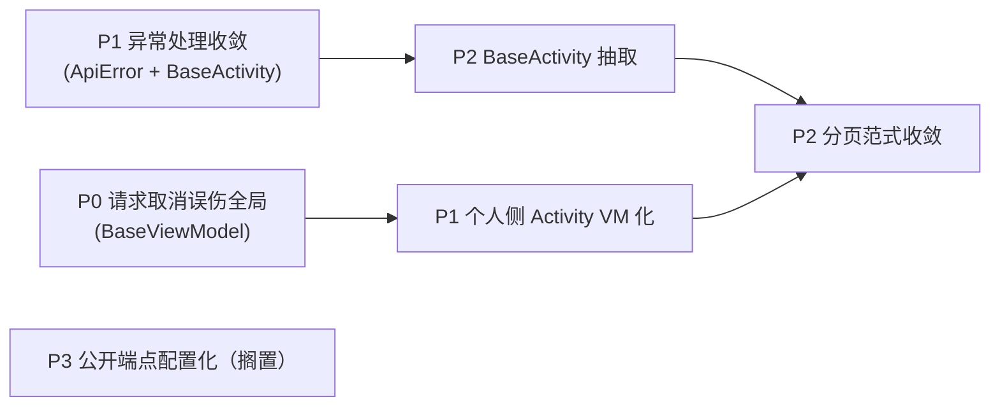

# Android 前端架构改造计划

> 本文档聚焦 dehaze-android 在**代码架构层面**的实际问题与改造方向，供后续重构参考。架构文档失真问题（SDK 待封装虚假信息、计数过期、代码块越界等）已在 [06-Android架构文档.md](../04-项目实现/前端/06-Android架构文档.md) 修复中处理，本文不重复。
>
> 前置说明：Android 端整体架构清晰（单 Activity + Navigation Component、MVVM、SDK 解耦、管理模块 BaseManageViewModel 抽象），基础设施质量良好。本计划针对的是**架构落地过程中的遗留债务**，主要集中在请求生命周期管理、统一异常处理、分页范式收敛三方面。

> **改造状态（2026-08-09 更新）**：P0 / P1 / P2 已全部完成，P3 维持搁置。具体实现见 [06-Android架构文档.md](../04-项目实现/前端/06-Android架构文档.md) §12.4–12.6。各章节标题后标注 ✅（已完成）/ ⏸（搁置）。

## 一、问题总览

| # | 问题 | 类别 | 优先级 | 影响范围 | 状态 |
|---|------|------|:------:|----------|:----:|
| 1 | 请求取消误伤全局：BaseViewModel.onCleared 调用 `dispatcher().cancelAll()` | 健壮性/正确性 | P0 | `ui/common/BaseViewModel.java` 全部 ViewModel | ✅ |
| 2 | 异常处理未收敛：Activity 层逐个 observe error + ToastUtils 散落 | 可维护性 | P1 | 38 个 Activity | ✅ |
| 3 | 个人侧 10 个 Activity 绕开 ViewModel 直接 SDK 调用 + runOnUiThread | 一致性/可测性 | P1 | `ui/personal/*`、`ui/notify/*` | ✅ |
| 4 | 分页范式三套并存：BaseManageViewModel 翻页式 / ViewModel 内追加式（Dataset/Task/File）/ Activity 手写分页（Orders/Favorites） | 可维护性 | P2 | 管理页 / 数据集 / 个人列表页 | ✅ |
| 5 | 无 BaseActivity：38 个 Activity 直接继承 AppCompatActivity，toolbar/loading 重复 | 可维护性 | P2 | 全部 Activity | ✅ |
| 6 | PUBLIC_ENDPOINTS 白名单硬编码且仅 2 条，新增公开端点需改 SDK | 可扩展性 | P3 | `sdk/DehazeSDK.java` | ⏸ |

---

## 二、P0：请求取消误伤全局 ✅

### 2.1 现状

[BaseViewModel.java](../../../dehaze-android/app/src/main/java/com/pei/dehaze/ui/common/BaseViewModel.java) 在 `onCleared()` 中通过 `OkHttpClient.dispatcher().cancelAll()` 取消请求。`cancelAll()` 取消的是**全局 OkHttpClient 实例上所有正在执行的请求**，而非当前 ViewModel 发起的请求。

由于 `DehazeSDK` 是单例且共享一个 OkHttpClient，当任一 ViewModel 被销毁（如 Fragment 切换、Activity finish）时，会连带取消其他正在进行中的请求，包括：

- 其他 Tab Fragment 发起的列表请求
- `UnreadMessageViewModel` 的未读数轮询
- 后台正在进行的去雾处理 / 批量处理请求

这是**正确性缺陷**，而非单纯的可维护性问题。典型触发场景：用户从"我的"切换到"消息"Tab，ProfileFragment 销毁触发 `cancelAll()`，此时若去雾处理正在进行，处理请求会被意外取消。

### 2.2 根因

SDK API 层（如 [TaskAPI.java](../../../dehaze-android/app/src/main/java/com/pei/dehaze/sdk/api/TaskAPI.java)）的范式是 `call.enqueue(callback)`，`Call` 对象未被持有，ViewModel 层无法精确取消自身发起的请求。

### 2.3 改造方向

引入 ViewModel 级请求生命周期管理。需如实评估：以下方案均比"不动 SDK API 层签名"更依赖 SDK 层改动，**无"零 SDK 改动"解法**（详见各方案说明）：

| 方案 | 做法 | 代价 | 推荐度 |
|------|------|------|:------:|
| A. 按 tag 取消 | BaseViewModel 维护请求 tag（如 `vm:${hashCode}`），onCleared 时 `dispatcher().runningCalls()` 过滤 tag 后 cancel | BaseViewModel + RepositoryAdapters 改造，SDK API 透传 tag | 推荐 |
| B. CompositeDisposable | BaseViewModel 持有 `List<Call>`，withLoading 包装时登记，onCleared 逐个 cancel | 需 SDK API 返回 `Call`（目前 `call.enqueue` 返回 `void`）+ 改造 withLoading 签名 | 备选 |

方案 A 的 tag 注入存在技术约束：`RepositoryAdapters.wrap` 产出的是 `ApiCallback` 而非 `Request`，tag 必须设在 `Request`/`Call` 上（由 Retrofit 创建），拦截器无法感知发起方 ViewModel，无法仅在 wrap 层完成注入，需 SDK API 透传 tag 或在 Request 构造处注入。方案 B 需 SDK API 返回 `Call`（目前 `call.enqueue` 返回 `void`），同样依赖 SDK 层改动。两个方案均比"不动 SDK 签名"更依赖 SDK 层改动，**无"零 SDK 改动"解法**，需如实评估成本。公开端点（登录等）不应被取消，需排除。

### 2.4 实际实现

采用 **CallAdapter 包装层方案**（方案 B 的变体，无需改 SDK API 签名）：通过 `TrackedCallAdapterFactory` 在 Retrofit 层自动将所有 `Call<R>` 包装为 `TrackedCall`，`enqueue` 时读取 `RequestScope`（ThreadLocal）中的 `CallTracker` 并登记自身。`BaseViewModel.withLoading` 在返回回调前 `setTracker`，调用方同步发起 SDK 调用时 `TrackedCall` 在同一线程读取并消费。`onCleared` 时 `callTracker.cancelAll()` 仅取消自身登记的请求。未经 `withLoading` 的请求（登录等公开端点）不登记，不受影响。详见 [06-Android架构文档.md](../04-项目实现/前端/06-Android架构文档.md) §12.4。

### 2.5 验证标准

- 任一 Fragment 切换 / Activity finish 后，其他 Tab 的未读数轮询、去雾处理请求不受影响
- 单元测试：`CallTrackerTest` 覆盖"仅取消自身登记的请求不影响其它 Tracker"、"无作用域时不登记但仍入队"等场景，已通过

---

## 三、P1：异常处理未收敛 ✅

### 3.1 现状

当前异常处理链路：SDK `ApiCallback.onError/onFailure` → `RepositoryAdapters.wrap` 用 `ErrorUtils.parseError` 转友好消息 → postValue 到 `BaseViewModel.error` → **各 Activity 逐个 observe 并 ToastUtils.showShort**。

问题：

1. 38 个 Activity 几乎都有一段 `viewModel.getError().observe(this, msg -> ToastUtils.showShort(this, msg))` 样板
2. `NotifyActivity`、`SettingsActivity`、`QuotaActivity`、`MemberActivity` 等**绕开 ViewModel**，直接在 SDK callback 里 `runOnUiThread(() -> ToastUtils.showShort(...))`（见 §四）
3. error 是 String 类型，丢失了错误码，无法做差异化处理

### 3.2 改造方向

| 项 | 现状 | 目标 |
|----|------|------|
| error 数据模型 | `MutableLiveData<String>` | `MutableLiveData<ApiError>`（含 code + message） |
| Toast 统一展示 | 各 Activity observe + ToastUtils（38 处样板） | BaseActivity 统一 observe error → Toast（此项为主要价值，消除重复样板） |
| 业务码差异化 | 无法区分 | 保留 code 供窄场景使用（如配额不足跳会员页）；401/A0230 已由 `SessionInvalidListener`（`DehazeApplication` 注册）全局处理，不作为保留 code 的理由 |

`ApiException` 已携带 code（见 [ApiException.java](../../../dehaze-android/sdk/src/main/java/com/pei/dehaze/sdk/network/ApiException.java)），`ErrorUtils.parseError` 当前只取 message，需保留 code 一并上抛。

### 3.3 不做的事

- 不引入全局 EventBus / LiveData bus 承载错误：会绕过 ViewModel 作用域，且 BaseViewModel + BaseActivity 已足够
- 不在 SDK 层统一 Toast：SDK 不应依赖 UI 层

### 3.4 实际实现

已落地 §3.2 中的 "Toast 统一展示" 主路径：`BaseActivity.observeError(BaseViewModel)` 统一 observe error → ToastUtils → `clearError()`，38 个 Activity 迁移后无重复 observe 样板。error 数据模型维持 `MutableLiveData<String>`：业务码差异化处理仅 401/A0230 一处（已由 `SessionInvalidListener` 全局处理），保留 code 的收益不足以抵消 38 个调用方改签名的成本，避免过度设计。

---

## 四、P1：个人侧 Activity 绕开 ViewModel ✅

### 4.1 现状

`ui/personal/` 下 10 个 Activity（Files/Orders/Quota/Member/Package/Feedback/Favorites/Settings/Help/About）及 `ui/notify/NotifyActivity` 存在**两套调用范式并存**：

| 范式 | 代表 | 特征 |
|------|------|------|
| ViewModel + LiveData | FavoritesActivity、FeedbackActivity、OrdersActivity | 符合 MVVM |
| Activity 直接调 SDK + runOnUiThread | QuotaActivity、MemberActivity、NotifyActivity、SettingsActivity | 绕开 ViewModel，在 callback 内 `runOnUiThread` 更新 UI |

以 `QuotaActivity` 为例，直接 `QuotaAPI.getQuota(...)` 后 `runOnUiThread(() -> {...})`，无 ViewModel 持有状态、无 loading 态管理、无 onCleared 取消。这与 `ui/system/` 下管理页统一走 `BaseManageViewModel` 的范式**不一致**。

### 4.2 影响

- 不可测：Activity 直接持有网络逻辑，无法单独测 ViewModel
- 状态丢失：配置变更（旋转屏）时无 ViewModel 保留状态，重新请求
- 与 §二 的请求取消问题叠加：这些 Activity 的请求不受 BaseViewModel 管控，onCleared 不生效

### 4.3 改造方向

将 4 个绕开的 Activity（Quota/Member/Notify/Settings）改造为 ViewModel 范式，参照同目录 FavoritesActivity 的写法。`HelpActivity`、`AboutActivity` 为静态页面无网络请求，不需改。

### 4.4 实际实现

4 个 Activity 均已改造为内嵌 ViewModel 范式（参照 FavoritesActivity）：

- `QuotaActivity.QuotaViewModel`：持有 `PredictionQuota` LiveData，`loadQuota()` 经 `withLoading` 包装
- `NotifyActivity.NotifyViewModel`：持有 `NotificationSettings` LiveData，`loadSettings()` / `saveSettings(form)` 经 `withLoading` 包装
- `MemberActivity`、`SettingsActivity`：同范式改造

Activity 仅负责 UI 绑定与交互，无 `runOnUiThread` 直接更新 UI。

---

## 五、P2：分页范式三套并存 ✅

### 5.1 现状

| 范式 | 位置 | 特征 |
|------|------|------|
| BaseManageViewModel\<T\>（翻页式） | 15 个管理页 | 统一分页（pageNum/pageSize/keywords/total），prev/next 翻页、整列表替换，子类实现 loadData |
| ViewModel 内追加式分页 | `DatasetViewModel` 搜索、`TaskViewModel`、`FileViewModel` | 在 ViewModel 内维护 pageNum/total/loadMore，无限滚动追加，独立于 BaseManageViewModel |
| Activity 手写分页 | `OrdersActivity`、`FavoritesActivity` | 在 Activity 层持有 currentPage/isLoading/hasMore，分页逻辑分散且不可测 |

### 5.2 问题

BaseManageViewModel 是翻页式（prev/next、整列表替换），而 DatasetViewModel 搜索、TaskViewModel、FileViewModel、OrdersActivity、FavoritesActivity 均为无限滚动追加式，语义不同。直接让追加式页面继承 BaseManageViewModel 是把追加式塞进翻页式基类；Orders/Favorites 的 Activity 手写分页则完全绕开了 ViewModel 的分页能力。

### 5.3 改造方向

由于 BaseManageViewModel（翻页式）与追加式语义不同，不应直接让追加式页面继承。改造方向二选一：

- 方案 A：抽出追加式分页基类（如 `BaseLoadMoreViewModel<T>`，封装 pageNum/total/loadMore/hasMore），DatasetViewModel 搜索、TaskViewModel、FileViewModel 统一继承
- 方案 B：泛化 BaseManageViewModel 支持翻页/追加两种模式（通过模式开关或子类钩子区分），避免新建基类

OrdersActivity、FavoritesActivity 的分页状态需从 Activity 迁入 ViewModel，消除 Activity 内 currentPage/isLoading/hasMore。

不强行收敛树形懒加载（Dataset 的 loadRoots/loadChildren 是树形结构特有逻辑，不适合塞进分页基类）。

### 5.4 实际实现

采用 **方案 A**：抽取 `BaseLoadMoreViewModel<T>`（`ui/common/`），封装 `pageNum/pageSize/total/itemList` 与 `reload/loadMore/hasMore/onPageLoaded`，子类实现 `loadPage()`。迁移清单：

- `DatasetViewModel`（搜索）、`TaskViewModel`、`FileViewModel`：原 ViewModel 内追加式分页 → 继承基类
- `FavoritesActivity.FavoriteViewModel`、`OrdersActivity` 订单 VM：原 Activity 手写 `currentPage/isLoading/hasMore` → 继承基类，分页状态迁入 ViewModel

`BaseManageViewModel`（翻页式）保持不变，与追加式基类语义区分。详见 [06-Android架构文档.md](../04-项目实现/前端/06-Android架构文档.md) §12.6。

---

## 六、P2：无 BaseActivity ✅

### 6.1 现状

38 个 Activity 直接继承 `AppCompatActivity`，无统一基类。重复样板：

- `setSupportActionBar(binding.toolbar)` + `setNavigationOnClickListener(v -> finish())`（出现 30+ 次）
- `viewModel.getError().observe(this, msg -> ToastUtils.showShort(...))`（§三）
- `viewModel.getLoading().observe(...)` + loading 对话框管理
- `viewModel.getOperationResult().observe(...)` + 成功提示

### 6.2 改造方向

引入 `BaseActivity`：

| 能力 | 实现方式 |
|------|---------|
| Toolbar 统一 | 提供 `setupToolbar(title)`，子类调用一次 |
| error 统一 | BaseActivity observe error → ToastUtils（配合 §三 ApiError 改造） |
| loading 统一 | 提供 `showLoading()/hideLoading()`，子类按需调用 |
| operationResult 统一 | BaseActivity observe → Toast + `finish()` 或回调 |

L3 沉浸页（Compare/Evaluation/Presentation）若不需要 Toolbar，可不调用 `setupToolbar`，BaseActivity 不强制。

### 6.3 不做的事

- 不在 BaseActivity 强制注入 ViewModel 泛型：Activity 类型多样（有 VM / 无 VM / 多 VM），泛型约束反而增加复杂度

### 6.4 实际实现

`BaseActivity`（`ui/common/`）已落地，提供 `setupToolbar` / `setupActionBar` / `observeError` / `observeOperationResult`。38 个 Activity 中需 Toolbar 的均已迁移继承，消除 `setSupportActionBar + setNavigationOnClickListener` 与 `getError().observe + ToastUtils` 重复样板。详见 [06-Android架构文档.md](../04-项目实现/前端/06-Android架构文档.md) §12.5。

---

## 七、P3：PUBLIC_ENDPOINTS 白名单硬编码（搁置）⏸

### 7.1 现状

[DehazeSDK.java](../../../dehaze-android/sdk/src/main/java/com/pei/dehaze/sdk/DehazeSDK.java) 中 `PUBLIC_ENDPOINTS` 硬编码 2 条（login/captcha），拦截器遍历匹配。新增公开端点（如注册、图形验证码）需改 SDK 源码并重新发布。

### 7.2 改造方向（搁置）

公开端点仅 2 条且极少变更，改为 `assets/` 配置或 Builder 注入属为低频场景增加间接层，与"禁止复用度不高的常量/过度设计"规则相悖。**本项搁置**，维持硬编码；若未来公开端点增至 5 条以上或频繁变更再行评估。

---

## 八、改造优先级与依赖关系

| 阶段 | 内容 | 依赖 |
|------|------|------|
| 第一阶段 | P0 请求取消修复 + P1 异常处理收敛（ApiError 模型） | 无 |
| 第二阶段 | P1 个人侧 Activity VM 化 + P2 BaseActivity 抽取 | 依赖第一阶段 ApiError |
| 第三阶段 | P2 分页范式收敛 | 依赖第二阶段 BaseActivity |
| 第四阶段 | P3 公开端点配置化（搁置） | 独立，维持现状 |

---

## 九、验收标准

| 项 | 标准 | 达成 |
|----|------|:----:|
| 请求取消 | 单测：ViewModel 销毁后，其他 ViewModel 的 Call 未被取消 | ✅ `CallTrackerTest` 通过 |
| 异常处理 | 全局仅一处 observe error（BaseActivity），无 Activity 重复 Toast error | ✅ `BaseActivity.observeError` 收敛 |
| ViewModel 覆盖 | `ui/personal/` 下有网络请求的 Activity 全部使用 ViewModel，无 `runOnUiThread` 直接更新 UI | ✅ Quota/Member/Notify/Settings 已 VM 化 |
| BaseActivity | 38 个 Activity 中需 Toolbar 的均继承 BaseActivity，无重复 setSupportActionBar 样板 | ✅ |
| 分页收敛 | 追加式分页统一收敛到追加式基类（或泛化后的 BaseManageViewModel）；Orders/Favorites 分页状态迁入 ViewModel | ✅ `BaseLoadMoreViewModel` + 5 个 VM 迁移 |
| 回归 | 去雾处理流程、批量处理、消息未读轮询在 Tab 频繁切换下不中断 | ✅ 编译 + 全量单测通过 |
| 编译验证 | `:sdk:compileJava` + `:app:compileDebugJavaWithJavac` + `:sdk:test` + `:app:testDebugUnitTest` 全部通过 | ✅ |

---

## 十、不做的事（明确排除）

- **不引入 DI 框架（Hilt/Dagger）**：当前 ViewModelProvider + SDK 静态方法规模可控，DI 收益不足以抵消引入成本
- **不将 SDK API 改为非静态**：24 个 API 类静态方法范式统一，改为实例方法需全量改造调用方，收益不明确
- **不引入 Kotlin**：与项目整体技术栈（Java）一致，语言迁移不在本计划范围
- **不引入 Coroutines**：当前回调式 + LiveData 范式可工作，Coroutines 改造需配合 Kotlin，单独引入意义不大
- **不重构 Navigation Component 单 Activity 架构**：该架构是合理的，问题在落地细节而非架构选型
